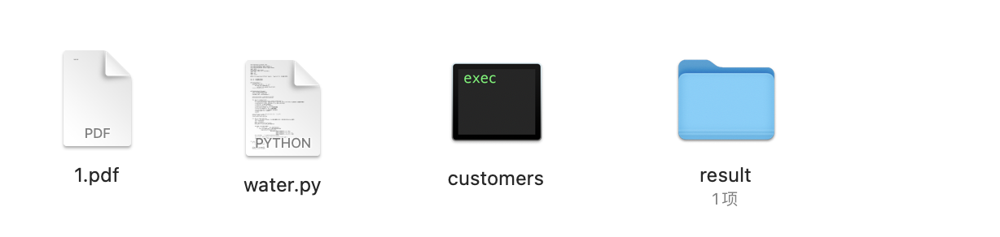

# Leaning-History
- 在学习过程中的一些记录
- 在早期用到word写的笔记就没有再放出来了
- 有关于CTF的赛题复现，很多都没有记录下来，或者是写wp比较潦草，就不放了，只放几个还不错的题目
- 对于一些早期的文章，逻辑稍微有点不通顺，有时间的话去修改一下，重新看看

## imageHandler.py

批量处理子目录下面的md文件包括图片（处理的本地图床，若是公网的图片，需要修改）

## water.py

对于pdf进行水印添加，把要批量打的文字放到customers中

python3 water.py "1.pdf"

