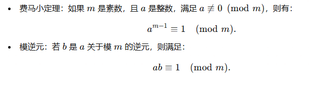

# RSA算法

之前在信安数学学了rsa算法，但是用笔和计算器还是不太一样，遇到的例子和形式也不太一样，最近闲来无事想看看逆向，遇到了一道RSA，就专门来重温一下RSA算法

RSA是非对称的算法，分为公私钥，最常见的就是ssh的authorized_keys就是rsa的公钥，再利用rsa的私钥进行登录，RSA的安全行基于大素数分解问题，两个大质数相乘很简单，但是通过因式分解来得到这个两个大质数却很难

RSA密钥生成包括以下步骤：

| 算法描述                                    | 变量表示 |
| ------------------------------------------- | -------- |
| ①选择两个大质数p和q                         | p, q     |
| ②计算n=pq                                   | n        |
| ③欧拉公式φ(n)=(p-1)(q-1)                    | φ(n)     |
| ④选择一个整数e，使得1<e<φ(n)，且e和φ(n)互质 | e        |
| ⑤计算e关于φ(n)的模逆元d，即ed≡1(mod φ(n))   | d        |

此时公钥`pk=(e, n)`，私钥`sk=(d, n)`

## 加密和解密过程

给定明文M，加密过程如下：

- 计算C≡Me (mod n)，得到的C就是密文。

给定密文C，解密过程如下：

- 计算M≡Cd (mod n)，得到的M就是解密后的明文。

根据上面我们提到的加密步骤我们依次代入进行计算

```
令p=17,q=11 => n = 17*11 = 187
再根据欧拉公式求φ(n) = (p-1)(q-1) = 16*10 = 160
此时找到一个正整数e，其中1< e < φ(n), 为了方便计算，我们取e=7
d是e对φ(n)的乘法逆元，也就有 de ≡ 1 （mod φ(n)）=> 7d ≡ 1 (mod 160), 所以这里计算可以得到d = 23
此时就能得到公钥pk=(187,7)和私钥sk=(187,23)
对明文M=90加密，C=90emod n = 907 mod 187 = 95

对密文C=95解密，M=95dmod n = 95*23 mod 187 = 90
```

## 欧拉公式

欧拉函数 φ(n) 是小于 n（n=pq） 并且与 n 互质的正整数的数量。在 RSA 算法中，φ(n) = (p-1)(q-1)，其中 p 和 q 是两个大质数。

> 例子：给定正整数 n=10，小于10并且与10互质的正整数有1, 3, 7, 9，所以 φ(10) = 4 = （2-1）（5-1）。

## 求逆元

### 扩展欧几里得公式

扩展欧几里得算法是一种用于求解 `ax + by = gcd(a, b)` 形式的二元一次方程的算法，其中 `x` 和 `y` 是未知数，`gcd(a, b)` 是 `a` 和 `b` 的最大公约数。该算法除了可以求出最大公约数，还能求出 `x` 和 `y`。

当我们要找的模逆元 b 存在的时候，即 gcd(a, m) = 1，我们实际上是要求解 ax + my = 1。在这个方程中，x 就是我们想要找的 a 关于模 m 的逆元。

> 例子：假设我们想要找到 a=7 关于模 m=12 的逆元。我们需要求解的方程是 7x + 12y = 1。使用扩展欧几里得算法，我们可以找到 x=7 和 y=-4，因此，7 是 7 关于模 12 的逆元。
>

### 费马小定理

费马小定理如下：


因为上标不方便表示，就直接截图了



接下来


> 例子：假设我们想要找到 `a=7` 关于模 `m=17` 的逆元。我们可以计算 7^(17-2) mod 17`，得到的结果 3 就是 7 关于模 17 的逆元。

# BUU逆向rsa


题目给了一个公钥和flag的加密文件，公钥是（e，n）但是这里是字符串表示，是因为RSA公钥通常以 PEM 编码（Base64 编码的ASN.1结构）或 DER 编码（二进制格式的ASN.1结构）存储。你需要解析这些格式以提取 n 和 e，可以用在线网站提取

[RSA公私钥分解 Exponent、Modulus，Rsa公私钥指数、系数(模数)分解--查错网](http://tool.chacuo.net/cryptrsakeyparse)

也可以用python分解RSA公钥

```
from cryptography.hazmat.primitives.asymmetric import rsa
from cryptography.hazmat.primitives import serialization

# 读取 PEM 格式公钥文件
# with open("pub.key", "rb") as key_file:
#     public_key = serialization.load_pem_public_key(key_file.read())
public_key = serialization.load_pem_public_key(b'''-----BEGIN PUBLIC KEY-----
MDwwDQYJKoZIhvcNAQEBBQADKwAwKAIhAMAzLFxkrkcYL2wch21CM2kQVFpY9+7+
/AvKr1rzQczdAgMBAAE=
-----END PUBLIC KEY-----
''')

# 检查公钥是否为 RSA 类型
if isinstance(public_key, rsa.RSAPublicKey):
    numbers = public_key.public_numbers()
    n = numbers.n  # 模数
    e = numbers.e  # 公钥指数
    print(f"模数 (n): {n}")
    print(f"公钥指数 (e): {e}")
else:
    print("这不是一个有效的 RSA 公钥。")
```


分解n，http://www.factordb.com/index.php，先转化为10进制再分解


最后得到了，e，p，q，n

```
E = 65537
N = 0xC0332C5C64AE47182F6C1C876D42336910545A58F7EEFEFC0BCAAF5AF341CCDD

p = 285960468890451637935629440372639283459
q = 304008741604601924494328155975272418463
```

解密的关键需要得到私钥`sk=(d, n)`，现在还需要d，d是e对φ(n)的乘法逆元de ≡ 1 （mod φ(n)）

```
φ(n)=(p-1)(q-1)
```

```
import gmpy2
import rsa

E = 65537
N = 0xC0332C5C64AE47182F6C1C876D42336910545A58F7EEFEFC0BCAAF5AF341CCDD

p = 285960468890451637935629440372639283459
q = 304008741604601924494328155975272418463

phin = (q-1)*(p-1)

d = gmpy2.invert(E, phin)

key = rsa.PrivateKey(int(N), E, int(d), p, q)

with open("flag.enc", "rb+") as f:
    f = f.read()
    print(rsa.decrypt(f, key))
```


参考链接

https://blog.csdn.net/mcmuyanga/article/details/109624988

https://blog.csdn.net/Demonslzh/article/details/130738368