# 漏洞描述

当受影响版本的 Spring-Kafka Consumer 未对Record配置 ErrorHandlingDeserializer 并设置 checkDeserExWhenKeyNull 或 checkDeserExWhenValueNull 为 true 且攻击者可以发布 Kafka 消息时，将会存在Java反序列化漏洞。只需发布 key 或 value 为 null 的消息，且在相应的header中放入序列化数据，便可以任意反序列化

漏洞编号：CVE-2023-34040

漏洞影响组件及版本为 Spring for Apache Kafka 2.8.1 to 2.9.10、3.0.0 to 3.0.9，利用条件如下：

- 没有为 Record 的 key 或 value 设置 ErrorHandlingDeserializer
- 将 checkDeserExWhenKeyNull 或 checkDeserExWhenValueNull 设置为 true
- 允许不受信任的源发布Kafka主题

Spring-Kafka 、 kafka-clients 和 Spring Boot 的版本对应关系参考官方文档： https://spring.io/projects/spring-kafka#overview

# 前置知识

Kafka使用教程：https://docs.spring.io/spring-kafka/docs/2.9.10/reference/html/#getting-started

**反序列化：**

当一个类里面嵌套了其他对象的序列化数据，仍然是可以反序列化的

创建一个Cmd类用作于反序列化

```
package Unser.Test;

import java.io.ObjectInputStream;
import java.io.Serializable;

public class Cmd implements Serializable {
    private String cmd;
    public void runcmd(String cmd)throws Exception{
        Runtime.getRuntime().exec(cmd);
    }

    private void readObject(ObjectInputStream ois) throws Exception {
        ois.defaultReadObject();
        runcmd(cmd);
    }
}
```

TestUtils用来封装序列化数据

```
package Unser.Test;

import java.io.Serializable;

public class TestUtils implements Serializable {

    private Object foo;

    public TestUtils(Object foo){
        this.foo = foo;
    }
}
```

对TestUtils进行反序列化，虽然TestUtils没有readObject，但是最后可以触发Cmd类的readObject方法

```
package Unser.Test;

import java.io.ByteArrayInputStream;
import java.io.ByteArrayOutputStream;
import java.io.ObjectInputStream;
import java.io.ObjectOutputStream;
import java.lang.reflect.Field;

public class UnserTest {
    public static void main(String[] args) throws Exception{
        Cmd cmd = new Cmd();
        Field field = cmd.getClass().getDeclaredField("cmd");
        field.setAccessible(true);
        field.set(cmd,"open -a Calculator");

        TestUtils testUtils = new TestUtils(cmd);
        ByteArrayOutputStream byteArrayOutputStream = new ByteArrayOutputStream();
        ObjectOutputStream objectOutputStream = new ObjectOutputStream(byteArrayOutputStream);
        objectOutputStream.writeObject(testUtils);

        ObjectInputStream objectInputStream = new ObjectInputStream(new ByteArrayInputStream(byteArrayOutputStream.toByteArray()));
        objectInputStream.readObject();

    }
}
```

# 漏洞复现

利用以下地址环境https://github.com/Contrast-Security-OSS/Spring-Kafka-POC-CVE-2023-34040

首先启动docker，其次启动consumer

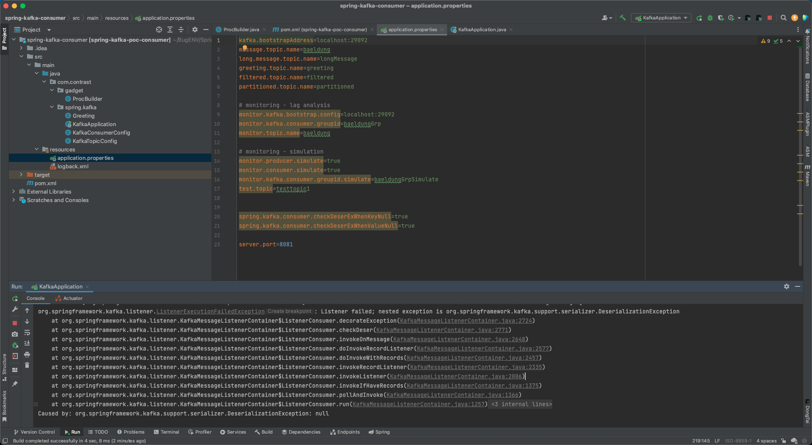

然后启动producer

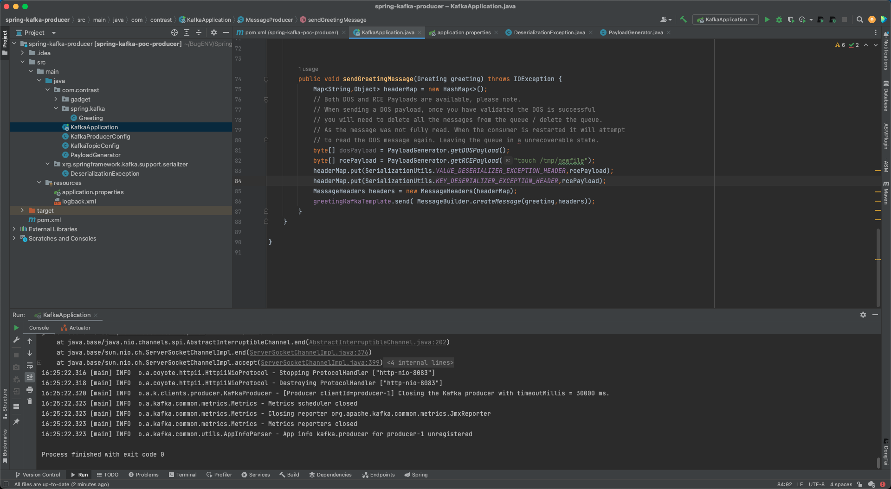

运行结束后，会在/tmp创建newfile文件（在consumer处触发）

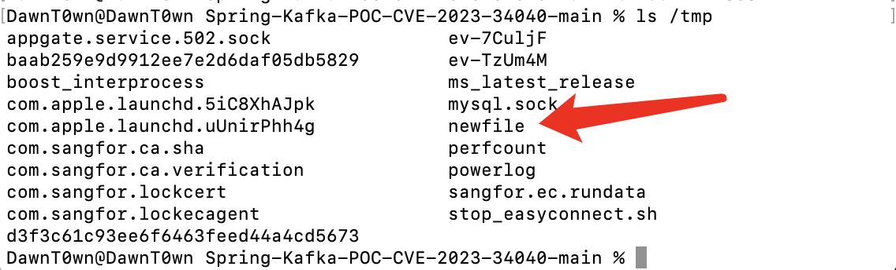

# 漏洞分析

漏洞修复方案在https://github.com/spring-projects/spring-kafka/pull/2770/files

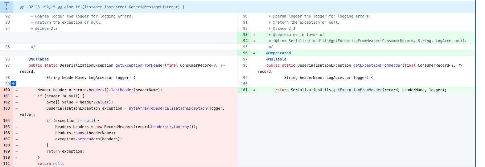

在ListenerUtils中进行了修复，将断点下在这个getExceptionFromHeader方法中

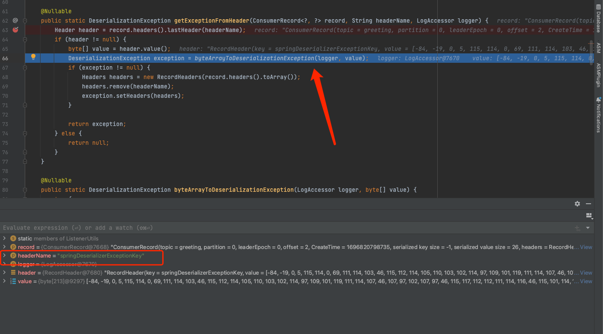

发现是从springDeserializerExceptionKey这个header中取出的值放入byteArrayToDeserializationException

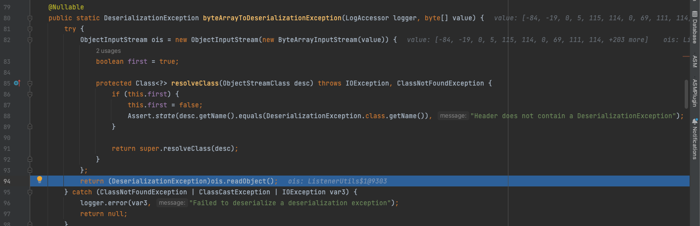

然后放入一个ObjectInputStream随后进行反序列化，但是这个ObjectStream中重写了resolveClass方法，这个resolveClass中会判断类名是否是`org.springframework.kafka.support.serializer.DeserializationException`，通过判断后first参数变成false，后面就不会再进入这个if，就直接调用父类的resolveClass方法了

也就是说，在反序列化数据中，顶层必须是`org.springframework.kafka.support.serializer.DeserializationException`，但是里面如果包含了一个可以塞入序列化数据的地方，仍然可以正常的反序列化其他数据

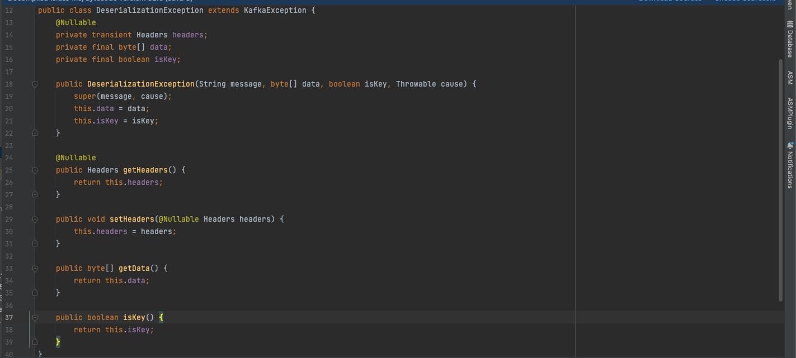

不过这个类并没有办法去嵌套其他序列化数据，并且没有实现serializable接口，不过我们可以直接构造一个类`xrg.springframework.kafka.support.serializer.DeserializationException`，在这个类里面自由地构造方法，嵌套序列化数据，最后在生成的序列化数据中修改类名为org开头，这样就可以去绕过resolveclass中的判断

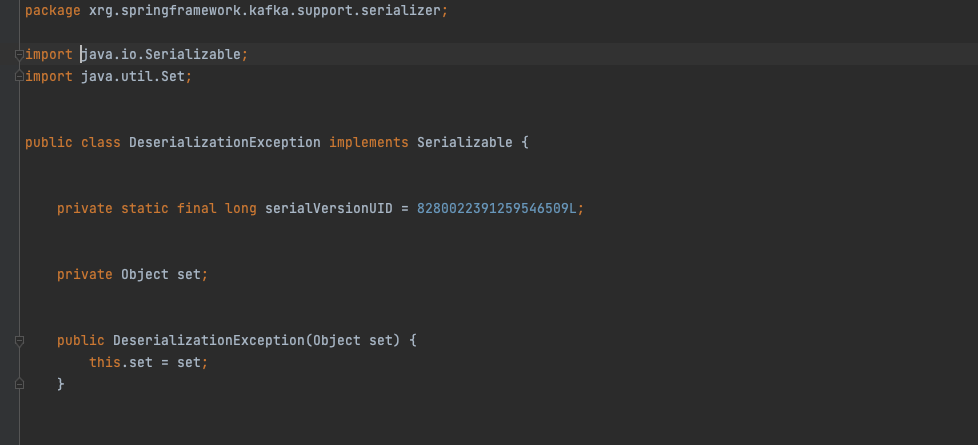

然后反序列化触发Gadget

关于修改类名，看到序列化数据，x对应120在数组的第八个

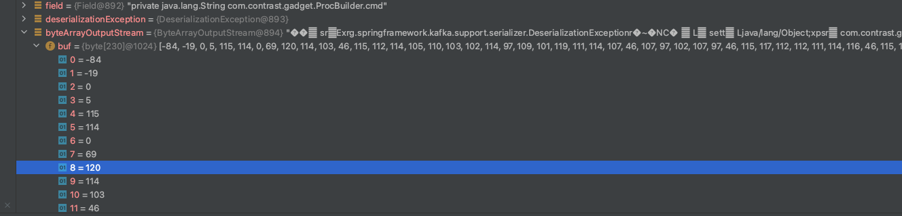

可以这样去修改

```
byte[] data = getPOC();
data[8] = "o".getBytes()[0];
System.out.println(new String(data));
```

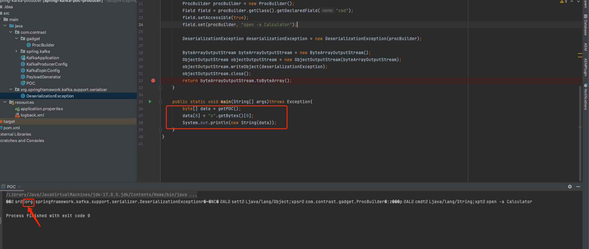

然后发送序列化数据，修改原来的项目

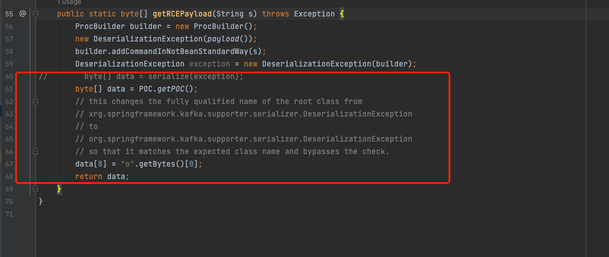

最后在consumer端反序列化命令执行（反序列化类是自己写的，没有用一些Gadget）

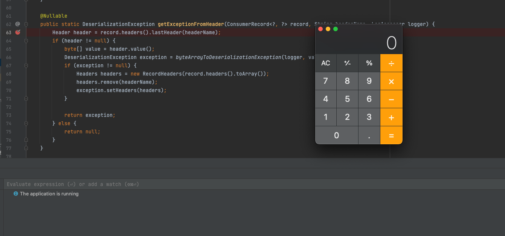

## 为什么要开启配置

追踪调用栈来看到，需要进入圈出来这两个if里面执行checkDeser方法

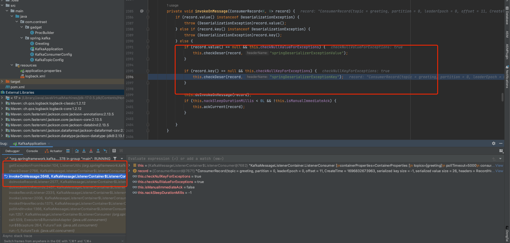

至于这两个字段其实就是我们设置的属性，所以只需要checkDeserExWhenKeyNull 或 checkDeserExWhenValueNull其中一个为true


相关配置可以在spring的properties里面设置

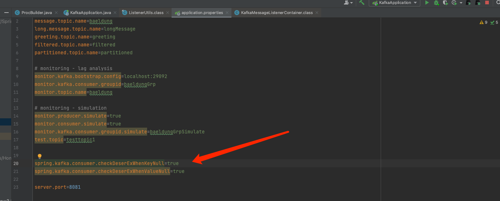

也可以在config中设置


# 漏洞修复

将版本更新到2.9.11版本，重新运行控制台得到如下提示

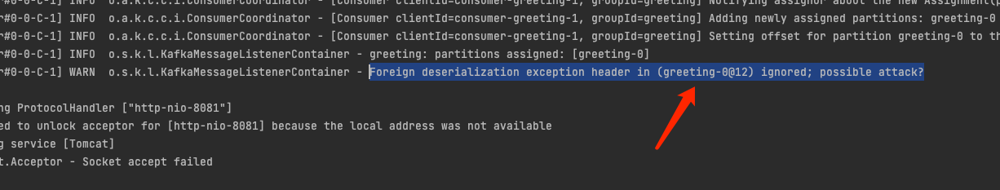

具体逻辑在SerializationUtils.getExceptionFromHeader

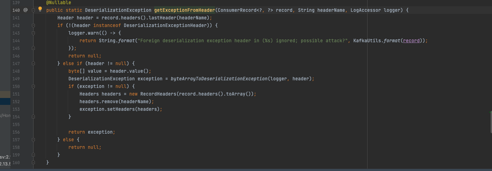

在执行checkDeser的时候

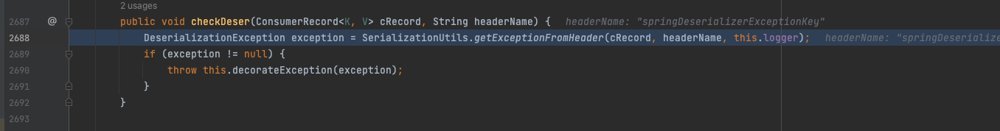

会调用SerializationUtils.getExceptionFromHeader，判断header是否实现了DeserializationExceptionHeader，但是这里的header是RecordHeader，所以会得到前面的结果


参考链接：

https://images.seebug.org/1695276921562-w331s

https://buaq.net/go-176040.html

https://github.com/Contrast-Security-OSS/Spring-Kafka-POC-CVE-2023-34040

https://l3yx.github.io/2023/09/28/Spring-Kafka-%E5%8F%8D%E5%BA%8F%E5%88%97%E5%8C%96%E6%BC%8F%E6%B4%9E-CVE-2023-34040-%E5%88%86%E6%9E%90/

https://docs.spring.io/spring-kafka/docs/2.9.10/reference/html/#getting-started