# CVE-2022-31692 权限绕过

环境：https://github.com/SpindleSec/cve-2022-31692

Spring Security的受影响版本在

- 5.6.0 <= Spring Security <= 5.6.8
- 5.7.0 <= Spring Security <= 5.7.4

如果存在通过forward转发路由的时候，并且转发的路由存在权限验证，返回forward转发结果的路由不存在权限验证，则存在漏洞

## 漏洞复现

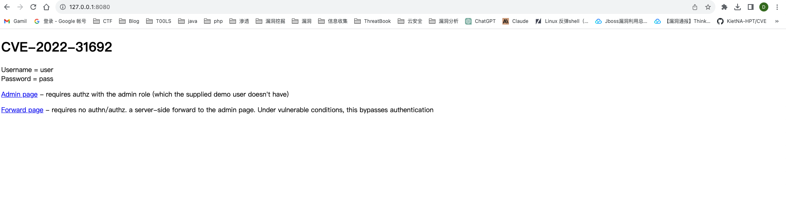

直接访问admin

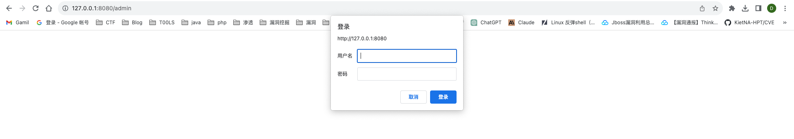

访问forward，重定向到admin路由


返回adminpage模板（springboot的controller返回值可以直接与模板文件绑定）

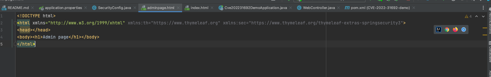

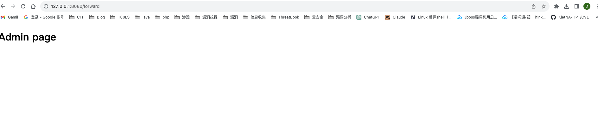

## 漏洞分析

### admin路由验证流程

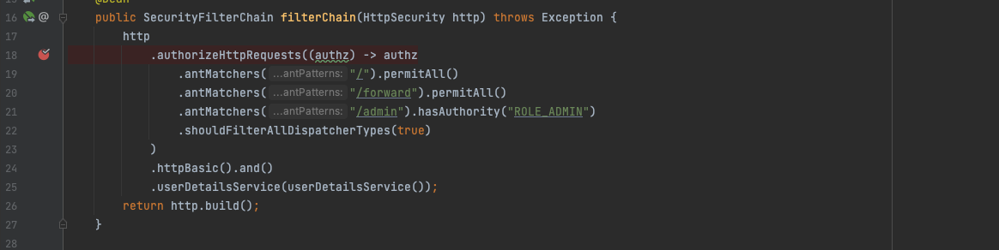

security的权限认证在AuthorizationFilter的doFilterInternal方法中

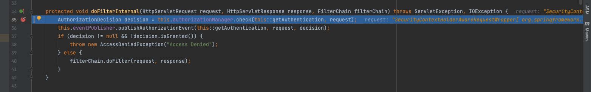

跟进check

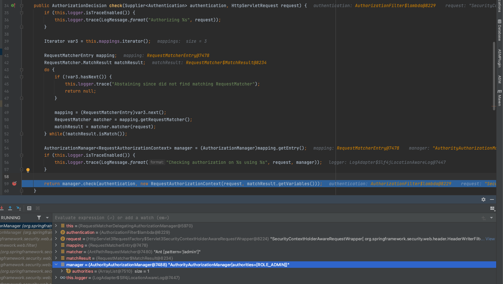

遍历config中添加的几个路径

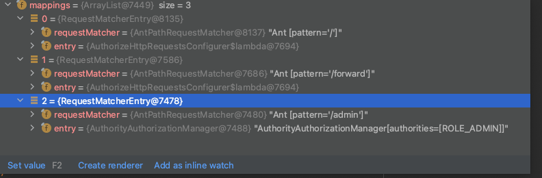

/admin的requestMatcher和request中的/admin匹配，退出循环，获取其中的entry（AuthorityAuthorizationManager），并调用相应的check方法

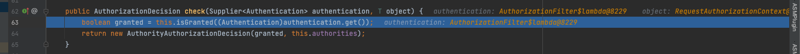

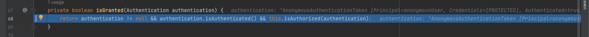

此时是anonymousUser

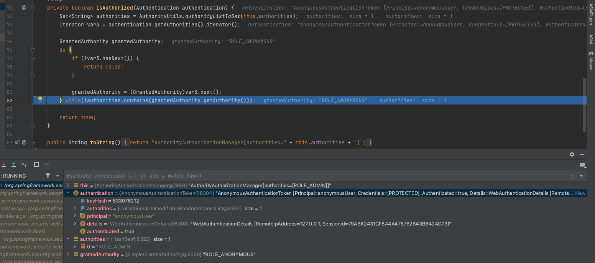

此时grantedAuthority是ROLE_ANONYMOUS，而authority是ROLE_ADMIN，所以返回false

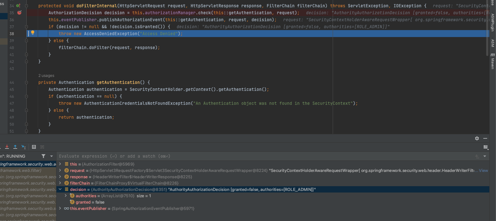

返回的desion的granted是false，在`doFilterInternal`中抛出权限错误。

### forward路由验证流程

对AuthorizationFilter的doFilterInternal方法的调用在OncePerRequestFilter的doFilter方法

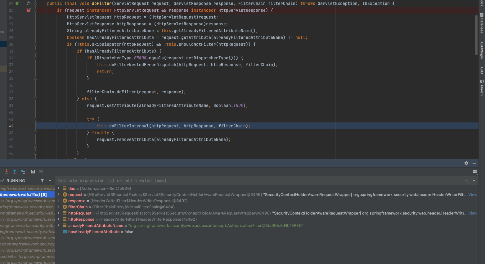

在第一次访问/forward路由的时候，hasAlreadyFilterAttribute为false是，进入else分支，将hasAlreadyFilterAttribute设置为true，会去调用每一个filter的doFilterInternal，仍然会进入到AuthorizationFilter的doFilterInternal方法，因为设置的antMatchers("/forward").permitAll()，所以在check方法中匹配到/forward路由的时候直接跳转到permitAllAuthorzationManager会直接放行

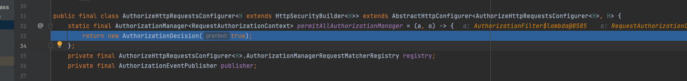

返回英国AuthorizationDecison，设置granted为true

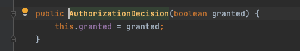

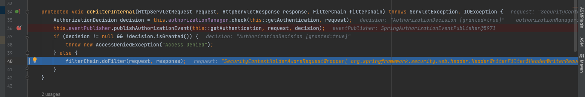

通过权限验证，在Controller返回forward:/admin后，spring的解析来到了ApplicationDispatcher到processRequest方法

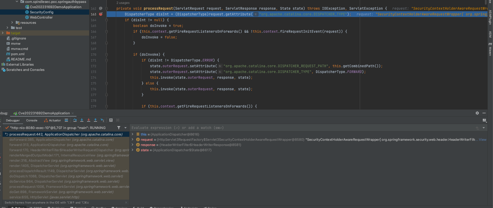

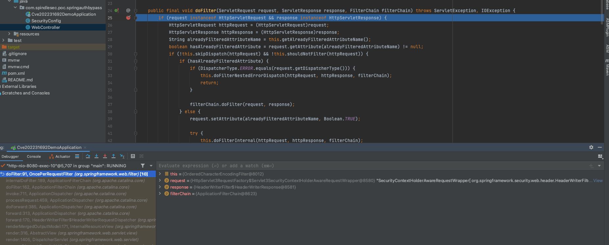

这次的请求又来到了OncePerRequestFilter的doFilter方法

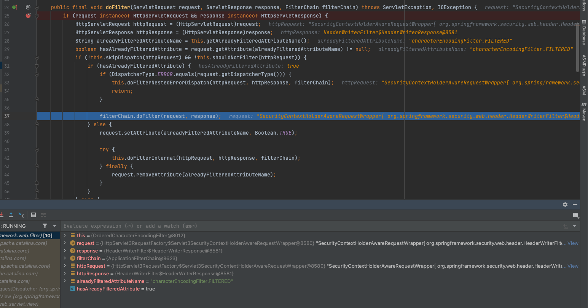

因为上次已经将hasAlreadyFilteredAttribute设置为true，所以调用filterChain的doFilter方法，而不会去调用doFilterInternal方法了

也就不会再去触发权限认证了，所以这次访问/admin路由就绕过了权限认证，最后返回adminpage渲染结果，即adminpage.html

## 漏洞修复

禁用`OncePerRequestFilter`功能或保证访问`/forward`跳转的目标网页所需的权限小于访问`/forward`的权限。

官方的修复方案是在`AuthorizationFilter.java`中新增了一个判断, 判断是否在**当前**`request`中使用过。

```
/*
* verify whether the filter has been set observeOncePerRequest = true and applied
*/
if (this.observeOncePerRequest && isApplied(request)) {
    chain.doFilter(request, response);
    return;
} 

if (skipDispatch(request)) {
    chain.doFilter(request, response);
    return;
}

String alreadyFilteredAttributeName = getAlreadyFilteredAttributeName();
request.setAttribute(alreadyFilteredAttributeName, Boolean.TRUE);
try {
    this.authorizationManager.verify(this::getAuthentication, request);
    chain.doFilter(request, response);
}
finally {
    request.removeAttribute(alreadyFilteredAttributeName);
	}
}
```


参考链接：

https://www.freebuf.com/vuls/349347.html