# 漏洞描述

编号： CVE-2023-20860

Spring官方发布了**Spring Framework 身份认证绕过漏洞(CVE-2023-20860)**，当Spring Security使用mvcRequestMatcher配置并将`**`作为匹配模式时，在Spring Security 和 Spring MVC 之间会发生模式不匹配，最终可能导致身份认证绕过。

# 漏洞复现

**配置**

```
package org.example;

import org.springframework.boot.SpringApplication;
import org.springframework.boot.autoconfigure.SpringBootApplication;
import org.springframework.context.annotation.Bean;
import org.springframework.security.config.annotation.web.builders.HttpSecurity;
import org.springframework.security.web.SecurityFilterChain;
import org.springframework.stereotype.Controller;
import org.springframework.web.bind.annotation.GetMapping;
import org.springframework.web.bind.annotation.ResponseBody;

@SpringBootApplication
@Controller
public class Application {

    public static void main(String[] args) {
        SpringApplication.run(Application.class, args);
    }

    @Bean
    public SecurityFilterChain securityFilterChain(HttpSecurity http) throws Exception {
        http.securityMatcher("**");
        http.authorizeHttpRequests().anyRequest().authenticated();
        http.httpBasic();
        return http.build();
    }

    @GetMapping("/admin/test")
    @ResponseBody
    public String test() {
        return "Test Page";
    }
}
```

正常访问：

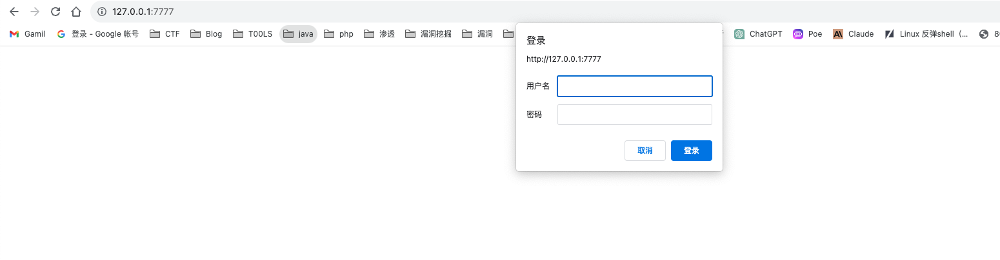

访问接口

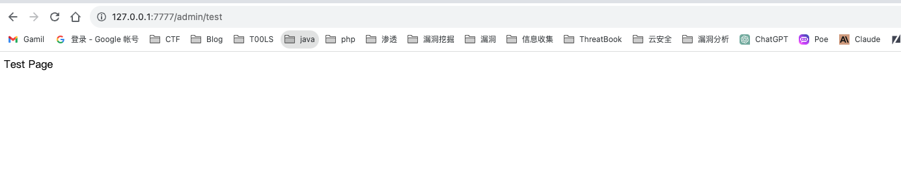

发现绕过了鉴权

# 漏洞分析

## 解析流程分析

在https://docs.spring.io/spring-security/reference/servlet/integrations/mvc.html#mvc-requestmatcher中提到了Spring Security提供了与Spring MVC在URL进行匹配深度集成MvcRequestMatcher，用于处理请求逻辑相匹配

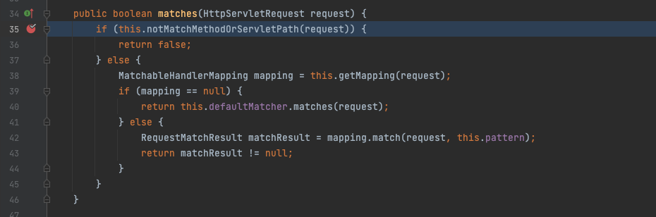

首先是notMatchMethodOrServletPath处理请求，进行一些简单的对比

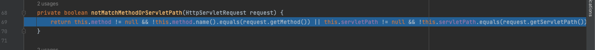

主要是请求方法和请求路径的一些对比，然后用getMapping对请求进行处理

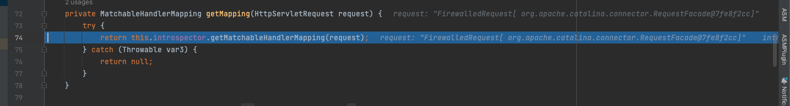

跟进到getMatchableHandlerMapping，这个方法主要是为了能找到指定请求的HandlerMapping，实际调用的是AbstractHandlerMethodMapping#getHandlerInternal

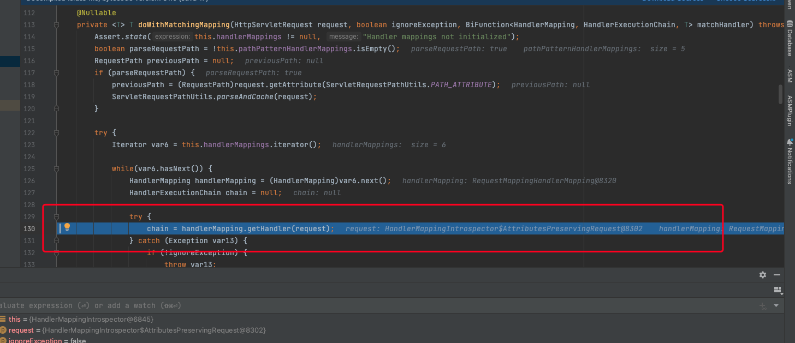

这里也即是找到了控制器的方法，回到matcher方法

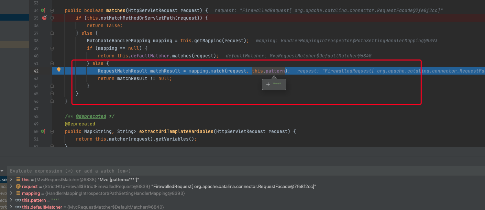

调用对应mapping的match，并且传入pattern，这个pattern是spring security设置的

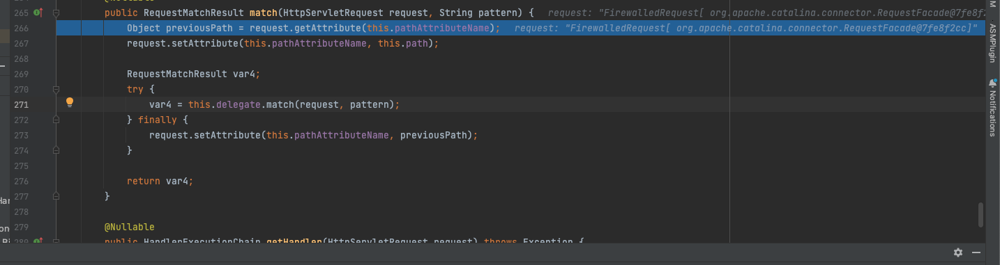

在设置一些参数后，将请求交给了org.springframework.web.servlet.handler.PathPatternMatchableHandlerMapping#match

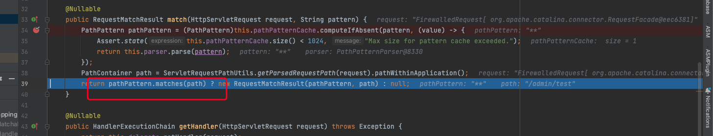

将request包装成PathContainer对象，还会继续调用PathPattern的matches方法进行与path的匹配

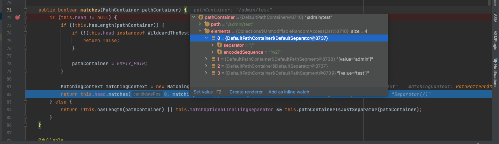

在之前的对request处理后，根据/将URL拆分成了多个PathElement对象，这里一共拆分了四个元素，分别是`/、admin、/、test`，然后/对应着SeparatorPathElement

首先是/，会调用SeparatorPathElement的matches方法

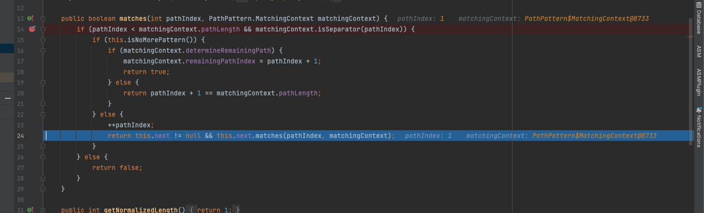

处理完后再处理下一个节点，即admin，是通过LiteralPathElement#matches进行处理，同样的最后会对pathindex进行+1，然后继续遍历PathElement元素直到遍历结束为止

在最后会根据matchOptionalTrailingSeparator（此参数为true时，默认为true）进行一定的处理，如果Pattern尾部没有斜杠，请求路径有尾部斜杠也能成功匹配（类似TrailingSlashMatch的作用）：

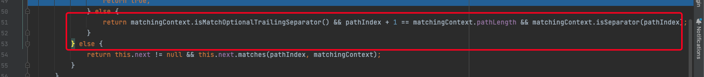

如果有斜杠的话，会进入这个方法

## 绕过分析

对比commit，在spring-webmvc-5.3.26

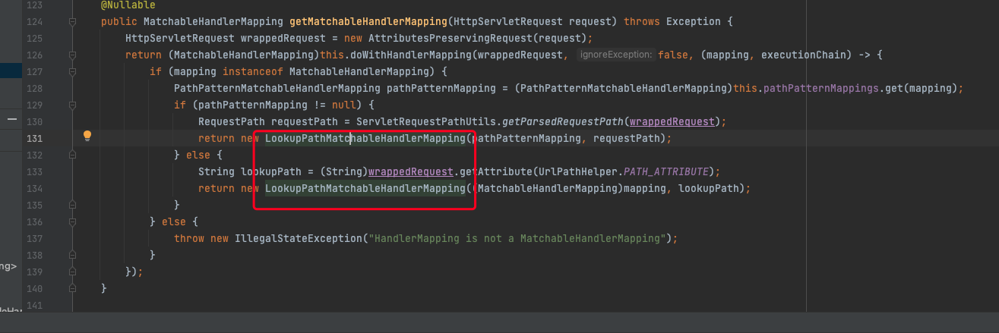

这里的返回值从PathSettingHandlerMapping变成了LookupPathMatchableHandlerMapping：

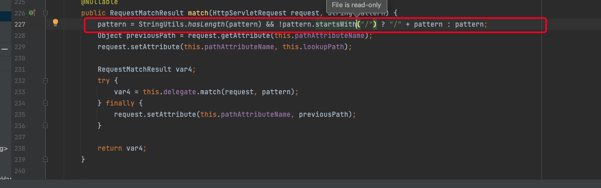

在其match方法中新增了一步，就是判断pattern是否以/开头，如果不是，则补全pattern

**在PathPattern解析的时候，会通过/分割来切割不同的URL，例如pattern是`admin/**`时，此时第一个Element是admin，对应LiteralPathElement#matches解析，如果直接是`**`，则由RegexPathElement的matches方法解析**

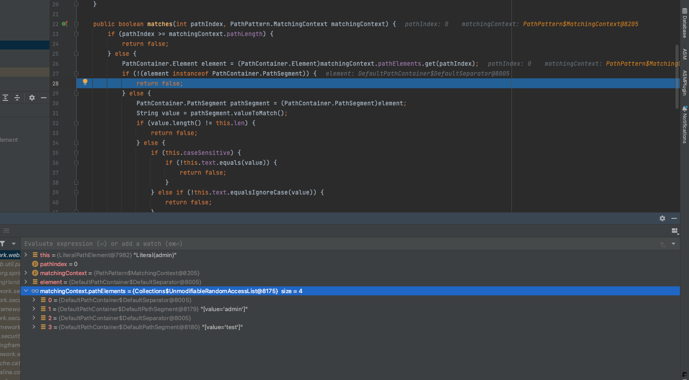

**当为`admin/**`的时候，在LiteralPathElement#matches解析与切割的/admin/test进行对比，而`/`明显不是PathSegment的实例，此时匹配失败会返回false，spring security就不会对其进行认证，但是Spring Controller却能正常解析，因为在Spring Controller中，以下两种方式是等价的，那么便导致了绕过问题。**

```Java
@GetMapping("/admin/*")
@GetMapping("admin/*")
```

当pattern是`**`的话，此时的matches就变成了RegexPathElement。这个引擎使用正则表达式匹配,所以可以匹配任意路由

# 漏洞修复

将spring-webmvc版本升级到5.3.26后

```XML
<dependency>
    <groupId>org.springframework</groupId>
    <artifactId>spring-webmvc</artifactId>
    <version>5.3.26</version>
</dependency>
```


参考链接：

https://forum.butian.net/share/2199

https://www.freebuf.com/articles/network/371374.html