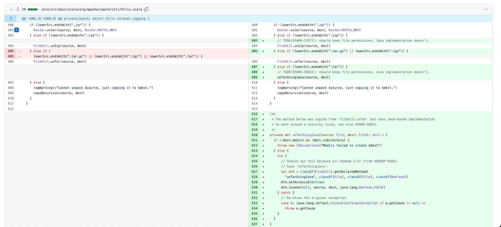
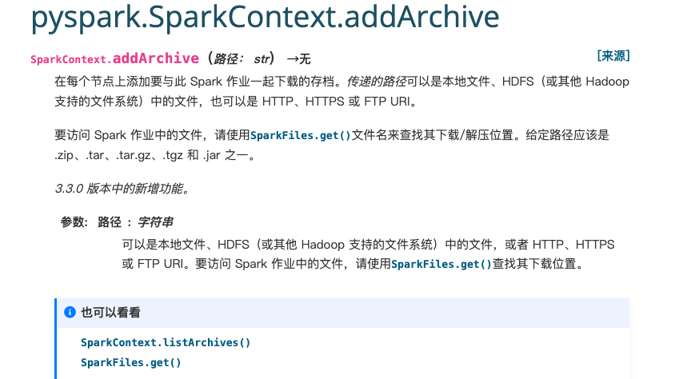
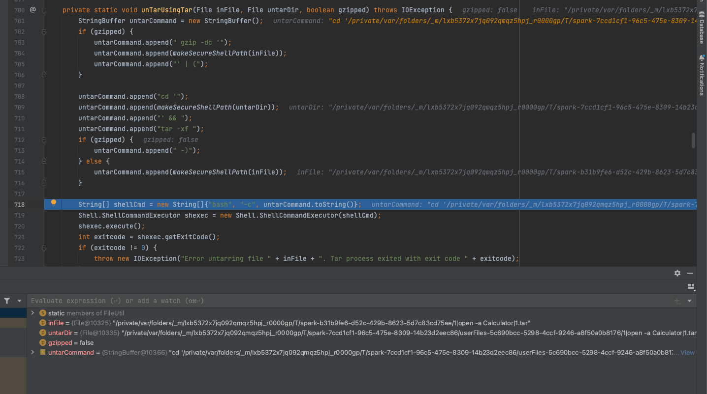
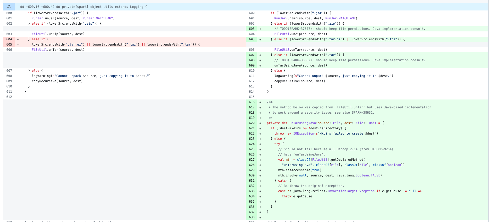
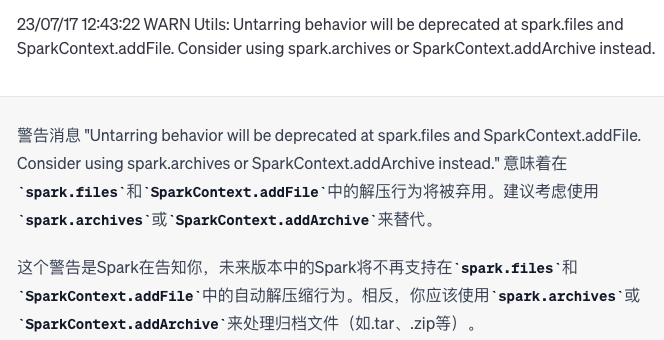

# 漏洞描述

Spark 是用于大规模数据处理的统一分析引擎。
由于 Hadoop 中"org.apache.hadoop.fs.FileUtill"类的“unTar”中针对 tar 文件的处理调了系统命令去解压，造成了 shell 命令注入的风险。​
攻击者可以通过该漏洞实现任意命令执行。

影响产品：Apache spark

组件名称：org.apache.spark:spark-core

影响版本：3.1.2, 3.2.1, 3.3.0

缺陷类型：shell命令注入

# 漏洞复现

在根目录下创建文件


在spark的命令行输入

```
sc.addArchive("/tmp/tar/1|open -a Calculator|1.tar")
```


# 漏洞分析

补丁链接

https://github.com/apache/spark/commit/057c051285ec32c665fb458d0670c1c16ba536b2



看到漏洞点在Utils.scala，spark提供了自己的shell，通过addArchive函数可以进行解压操作




在Apache Spark中，`addArchive`方法用于将一个或多个归档文件（如ZIP、JAR等）添加到Spark作业的执行环境中，以便在集群中的任务中使用这些归档文件。一个文件只能添加一次。否则会报如下错误


在漏洞点下一个断点


往上回溯到SparkContext的addArchive方法


SparkContext里面提供了很多工sparkshell使用命令的方法


我们通过addArchive方法对目标文件进行解压

跟进到addFile方法，这个方法用作于将文件或者归档文件添加到Spark作业到执行环境中


中间就是数据处理和添加到执行环境，在最后调用unpack进行解压


根据文件名的后缀来判断调用哪一个函数进行解压


接下来根据操作系统的shell来判断，不是windows的话就会使用unTarUsingTar


在unTarUsingTar中，看到其实是拼接的命令，当不满足gzipped，就通过cd到对应的目录，调用tar命令进行解压的，否则调用gzip解压



来看看最后拼接的内容


我们将文件名用管道符`（"|"）`分割，在cd的时候插入恶意的命令，这样不会报错，导致了命令执行

# 漏洞修复



在补丁中，判断以tar结尾的，调用了unTarUsingJava函数进行解压，而不在调用unTar，但是对于`.tar.gz`和`.tgz`这种文件还是继续调用unTar

# 漏洞思考

我尝试了用tar.gz这种结尾去实现相同的效果，但是并没有成功，在对比了两个命令最终效果后

```
bash -c " gzip -dc '/private/var/folders/_m/lxb5372x7jq092qmqz5hpj_r0000gp/T/spark-cfc15ecd-a32f-4885-9aab-4310fbf489b9/1|open -a Calculator|2.tar.gz' | (cd '/private/var/folders/_m/lxb5372x7jq092qmqz5hpj_r0000gp/T/spark-0c7d1c61-899c-4019-966d-a32d8f7c7307/userFiles-bc3a55db-cb68-44ba-89af-523435d41292/1|open -a Calculator|2.tar.gz' && tar -xf  -)" 
```

```
bash -c "cd '/private/var/folders/_m/lxb5372x7jq092qmqz5hpj_r0000gp/T/spark-0c7d1c61-899c-4019-966d-a32d8f7c7307/userFiles-bc3a55db-cb68-44ba-89af-523435d41292/1|open -a Calculator|1.tar' && tar -xf /private/var/folders/_m/lxb5372x7jq092qmqz5hpj_r0000gp/T/spark-770d3238-bb1e-4a06-aef6-b909f9470d9d/1|open -a Calculator|1.tar" 
```

我发现，用tar.gz这个结尾的会满足gzipped这个判断，导致用到了gzip解压


但是对于gzip和cd的话，cd并没有报错，然后执行tar命令的时候用管道符逃逸出来了命令

而对于tar.gz的命令格式的话，并没有逃逸出来命令，拼接的命令都在gzip和cd的时候执行了

**触发点的思考**：

看到了addArchive方法实则是调用的addFile方法，而在SparkContext也实现了这个，当我用addFIle去触发的时候却没有成功





参考链接：

https://www.zilyun.com/8603.html

https://segmentfault.com/a/1190000041611896