# CVE-2022-33891

## 漏洞简介

Apache Spark UI 可以设置选项 spark.acls.enable 启用 ACL ，使用身份验证过滤器。用以检查用户是否具有查看或修改应用程序的访问权限。如果启用了 ACL则 HttpSecurityFilter 中的代码路径可以允许用户通过提供任意用户名来执行命令。该功能最终将根据用户输入构建一个 Unix shell 命令并执行它，最终导致任意命令执行。

影响版本

Spark Core - Apache <=3.0.3

3.1.1 <= Spark Core - Apache <=3.1.2

3.2.0 <= Spark Core - Apache <=3.2.1

## 环境搭建

按漏洞影响版本下载spark源码3.1.1，链接如下：https://github.com/apache/spark/releases/tag/v3.1.1

官网下载链接：https://archive.apache.org/dist/spark

漏洞触发的关键在于是否启用ACL，使用身份验证过滤器。

启用ACL的两种方式：

1、通过在 `conf/spark-defaults.conf` 中添加参数 `spark.acls.enable true` 开启 ACL

2、运行spark-shell时，通过-c参数启动。

为更好分析漏洞，在运行spark-shell前，需在其中进行远程调试配置

export SPARK_SUBMIT_OPTS="-agentlib:jdwp=transport=dt_socket,server=y,suspend=n,address=5005"

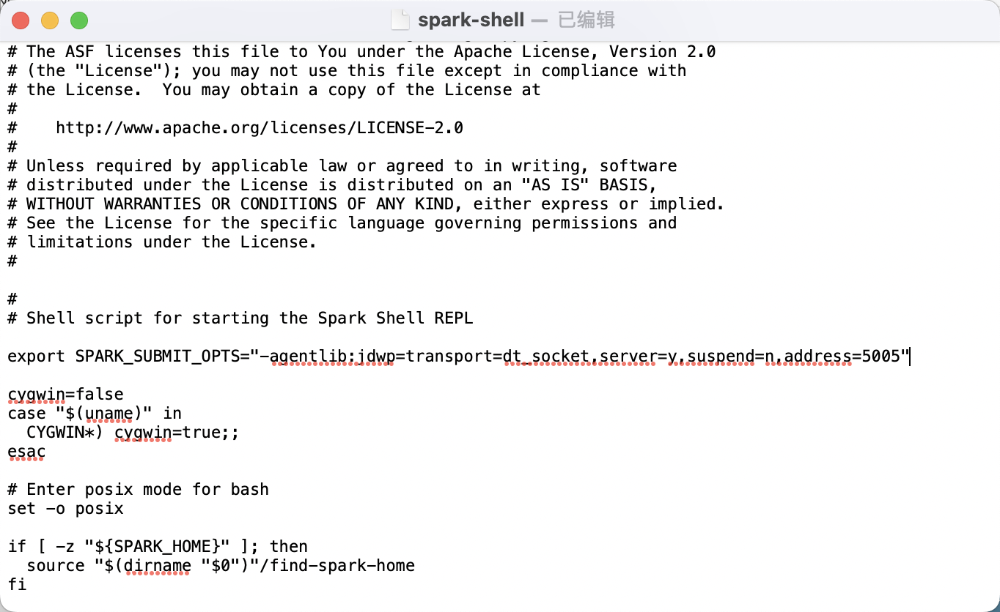

先构建项目 mvn -DskipTests clean package 

然后启动`./bin/spark-shell --conf spark.acls.enable=true`

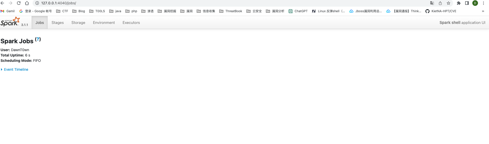

## 漏洞复现

直接访问

```
?doAs=`command`
```

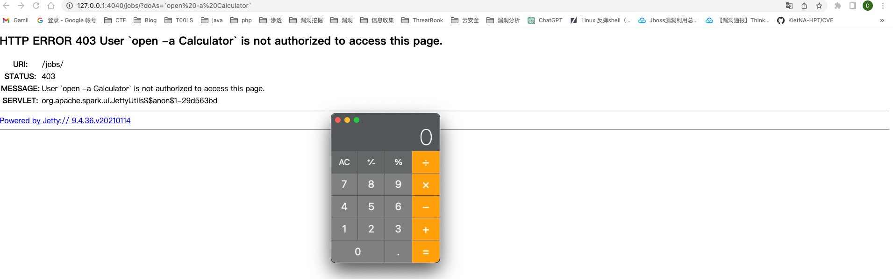

## 漏洞分析

提前安装一个插件

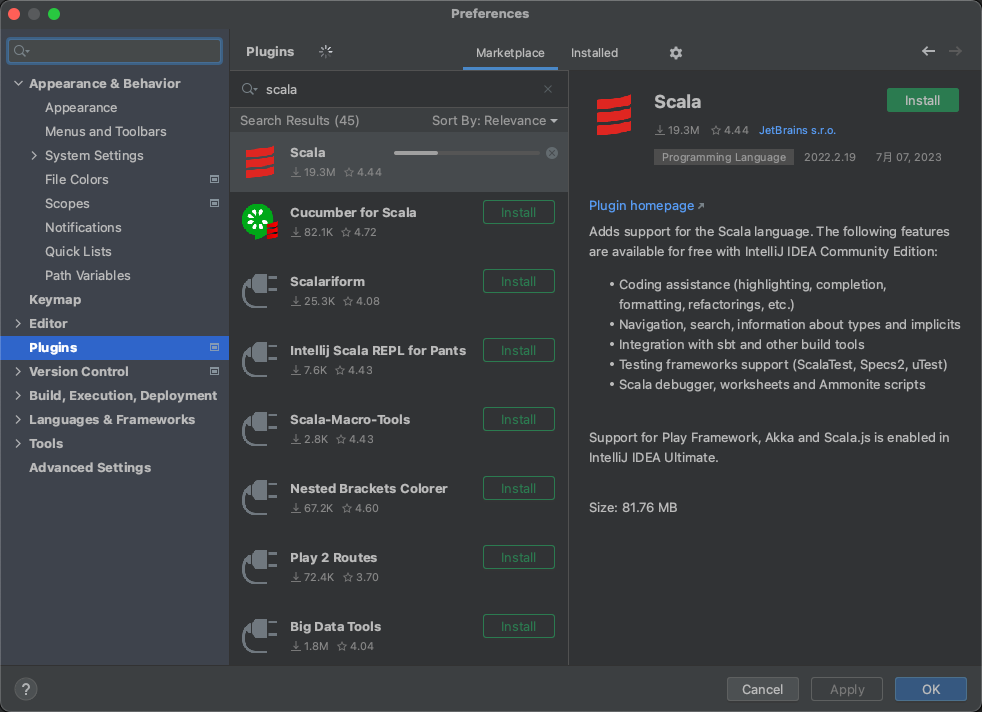

来看到这一次的补丁https://github.com/apache/spark/pull/36315/files

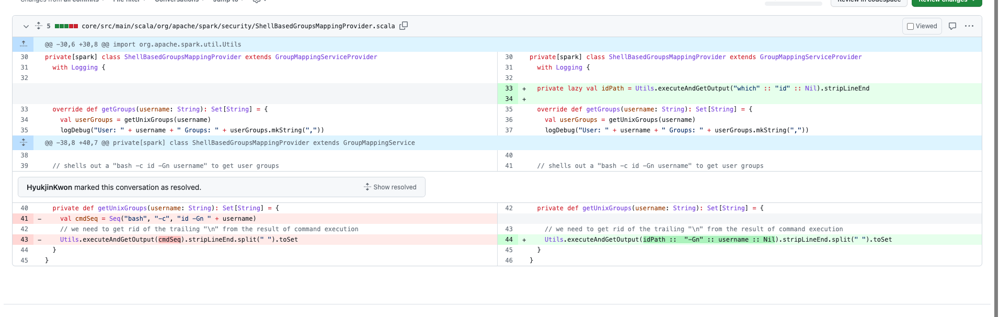

改动的地方很少，在修复的版本中直接删除了ShellBasedGroupsMappingProvider函数中对bash的调用，定位到这个地方，下一个断点看看，这个地方一个数`bash -c id -Gn`拼接上了一个可控参数，用反引号来命令执行了

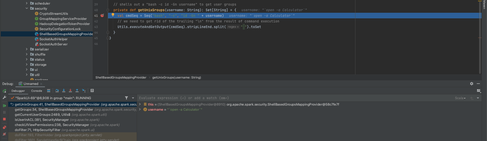

回溯到Http SecurityFilter的doFilter方法，

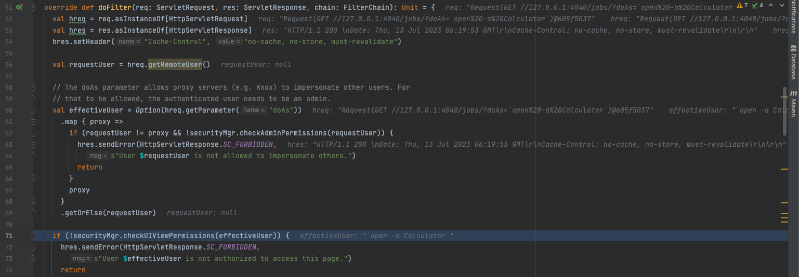

逻辑很简单，首先就是解析request和response，提取request中的doAs参数到effectiveUser变量，后面跟着的一块代码其实是用于身份处理的逻辑，这段代码的作用是：如果请求中包含"doAs"参数，且满足一定条件，那么返回该参数作为代理用户；否则，返回请求用户（`requestUser`）自身作为默认用户。

map这串代码对后面执行是没有影响的，接下来执行if判断，进入org.apache.spark.SecurityManager#checkUIViewPermissions函数。

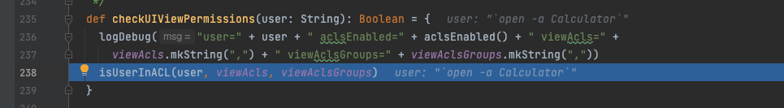

跟进到isUserInACL，可以看到，如果没有开启ACL，或者满足了其他条件，就直接会返回true，在else分支中调用了getCurrentUserGroups函数

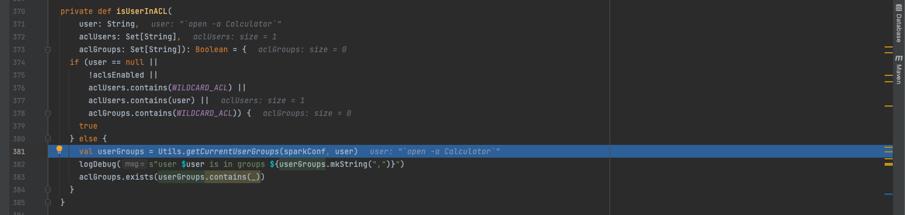

跟进getCurrentUserGroups函数，才能够SpackConf中获取USER_GROUP_MAPPING

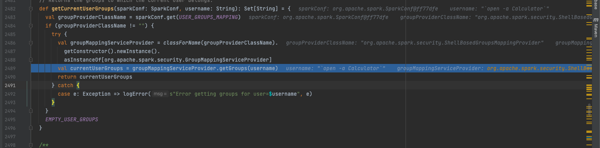

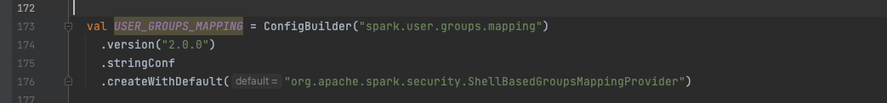

然后通过反射实例化这个org.apache.spark.security.ShellBasedGroupsMappingProvider类，调用其getGroups方法，传入的参数仍是最开始可控的doAs，也即是这里的username

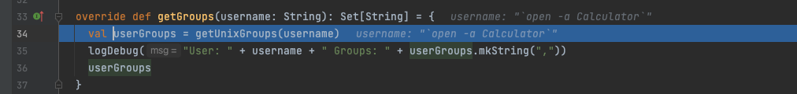

跟进getUnixGroups

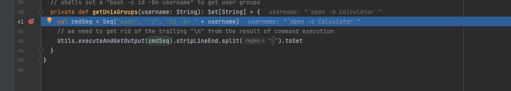

通过bash处理了可控参数，直接可以拼接反引号执行

# CVE-2023-32007

## 漏洞简介

　　Apache Spark UI 提供了通过配置选项 spark.acls.enable 启用 ACL 的可能性。使用身份验证过滤器，这会检查用户是否具有查看或修改应用程序的访问权限。如果启用了 ACL，则 HttpSecurityFilter 中的代码路径可以允许某人通过提供任意用户名来执行模拟。然后，恶意用户可能能够访问权限检查功能，该功能最终将根据他们的输入构建 Unix shell 命令并执行它。这将导致任意 shell 命令执行，因为用户 Spark 当前正在运行。此问题早先被披露为 CVE-2022-33891，但错误地声称版本 3.1.3（此后已停产）不会受到影响。此漏洞仅影响维护者不再支持的产品。建议用户升级到支持的 Apache Spark 版本，例如 3.4.0 版本。

影响版本

- WSO2 API Manager 2.2.0 and above
- WSO2 Identity Server 5.2.0 and above
- WSO2 Identity Server Analytics 5.4.0, 5.4.1, 5.5.0, 5.6.0
- WSO2 Identity Server as Key Manager 5.3.0 and above
- WSO2 Enterprise Integrator 6.2.0 and above

## 环境搭建

和上面一样，先构建在运行

下载链接：https://archive.apache.org/dist/spark/spark-3.1.3/spark-3.1.3-bin-hadoop2.7.tgz

源码下载：https://github.com/apache/spark/releases/tag/v3.1.3

下载存在漏洞的 spark 版本，在启动时通过设定 `./spark-shell --conf spark.acls.enable=true` 开启 ACL

也可以通过在 `conf/spark-defaults.conf` 中添加参数 `spark.acls.enable true` 开启 ACL

## 漏洞分析

这个洞和之前的一模一样，完全就是声明版本的时候没有涵盖到3.1.3版本，而这个版本是存在的


参考链接：

https://www.freebuf.com/vuls/347146.html

https://blog.csdn.net/LJQClqjc/article/details/125878486

https://paper.seebug.org/2000/

https://github.com/apache/spark/pull/36315/files

https://zone.huoxian.cn/d/2761-apache-spark-ui-cve-2023-32007