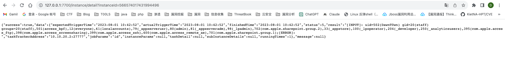

# 漏洞简介

PowerJob 是一款开源的分布式任务调度框架。

由于 PowerJob 未对网关进行鉴权，4.3.3 及之前版本中，未经授权的攻击者可向 /instance/detail 端点发送恶意构造的 instanceId 参数远程执行任意代码。

影响范围：PowerJob<=4.3.3

修复方案：

对 api 端点进行鉴权或移除内置 shell 执行模块

参考链接：

https://www.oscs1024.com/hd/MPS-ycmw-pl41

https://nvd.nist.gov/vuln/detail/CVE-2023-37754

https://github.com/PowerJob/PowerJob/issues/675

https://novysodope.github.io/2023/07/02/100/#V4-X

# 环境搭建

github 开源地址：https://github.com/PowerJob/PowerJob

修改application-daily.properties中的mysql连接信息


直接启动可能会因为spring boot内带tomcat，tomcat中的websocket会有冲突出现问题，注释掉WebConfig的这个Bean


注册一个应用，将power-job-samples的application.properties中的powerjob.worker.app-name改为应用名称


因为server中的任务需要交给job执行，所以再启动server注册应用后，将worker绑定应用，然后启动

在server中看到了加入的worker


# 前置知识

在powerjob的官方文档中提到了提供的一些官方处理器，其中有一个shell处理器可以执行脚本


但是powerjob3和powerjob4有一点区别


并没有直接提供shell的配置，但是shell处理器的全限定类名 `tech.powerjob.official.processors.impl.script.ShellProcessor`，使用内建的方式，可以直接指定对应的processor

而在powerjob3中，用到的processType就不是内建，而是SHELL，内容也不是全限定类名，而是直接的shell脚本内容


保存任务后，如果定时信息是cron也能自动运行，也可以直接点击任务运行


执行了对应的命令，这个都是PowerJob自己提供的

# 漏洞复现

由于powerjob本身接口是没有授权的，所以能够通过对应接口去进行对应任务的添加执行


通过/job/list获取对应job的ID

```
{"appId":1,"index":0,"pageSize":10,"keyword":"CVE"}
```


然后用/job/run去运行对应的job

```
http://127.0.0.1:7700/job/run?jobId=142&appId=1
```


拿到对应的data，通过/instance/detail的instanceId参数传入data获取命令执行结果

```
http://127.0.0.1:7700/instance/detail?instanceId=566574017431994496
```



# 漏洞分析

在WorkerActor类中，定义了很多处理器，用来处理不同节点的请求


而runjob节点则是通过taskTrackerActor.onReceiveServerScheduleJobReq(req)来处理；


分轻量级和重量级调用不同的create，这里通过处理器的类型判断任务级别，单机、固定频率、固定延迟模式都属于轻量，其他则是重量


这里调用LightTaskTracker的create方法


会去实例化一个LightTaskTracker对象


先去对父类对参数进行一次初始化，然后调用constructTaskContext将各项参数封装到taskContext对象


接下来就是去加载processor


跟进load


当前的processType是BUILT_IN，ProcessorFactoryList有四个Factory对象

而Optional.ofNullable(pf.supportTypes()).orElse(Collections.emptySet())会得到处理器参数


这里选择的是内建的BUILT_IN，不同处理器会进入不同的factory的build方法


根据注释看到，BUILT_IN的处理器工厂是BuiltInDefaultProcessorFactory这个类，在build方法中，会根据传进的ProcessorInfo信息来实例化对象


在load方法结束后，得到的processorBean里面的processor其实就是ShellProcessor对象了，然后将任务提交到线程池中，调用processTask


taskContext是前面已经封装好的context对象，包含了控制台传来的各项信息，这里的Processor是前面build方法设置的processor和classloader，强转成啦basicProcessor对象


进入到CommonBasicProcessor的process方法，该类是一个通用处理器类


在process方法中，将包含各种信息的TaskContext对象传到了process0方法中去，因为this是ShellProcess，所以调用的ShellProcess的process0，本身不存在这个方法，调用父类的process0，也即是AbstractScriptProcessor这个用来处理脚本的Processor


process0方法属于AbstractScriptProcessor类，该类属于通用脚本处理器类，所有脚本插件都要继承该类。在process0方法中，会使用prepareScriptFile方法来根据控制台传来的jobParams内容生成脚本文件，文件名是shell_instanceId.sh


调用getScriptName生成一个脚本文件路径，还是因为this为ShellProcess，所以调用ShellProcess的getScriptName


返回的是`shell_instanceId.sh`，拼接上workdir，写入到对应的路径

接下来通过判断getRunCommand的值是否上CMD_SHELL，也即是检测是否为windows，然后传入对应的命令，通过ProcessBuilder.start()执行命令


然后/instance/detail路由可以根据instanceId返回任务的执行后的结果


这个漏洞主要是PowerJob提供的任务调度的功能执行任务的时候，可以将jobParam的参数用ShellProcess处理器执行命令，这是它本身提供的功能，但是Powerjob对接口并没有做任何的授权，所以可以在授权的情况下造成命令执行


参考链接

https://novysodope.github.io/2023/07/02/100/#V4-X

https://www.yuque.com/powerjob/guidence/official_processor#Xql6t