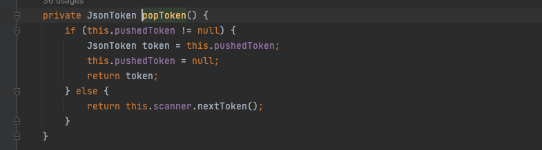

# 漏洞描述

Spring Data for MongoDB是 Spring Data 项目的一部分，该项目旨在为新的数据存储提供熟悉和一致的基于Spring的编程模型，同时保留存储的特定特征和功能。Spring 表达式语言(简称SpEL)：是一个支持运行时查询和操作对象图的强大的表达式语言，也是一种简洁的装配Bean的方式，它通过运行期执行的表达式将值装配到Bean的属性或构造器参数中。

通过 SpEL 可以实现：通过 bean 的 id 对 bean 进行引用；调用方式以及引用对象中的属性；计算表达式的值；正则表达式的匹配。

漏洞的原因是当使用`@Query`或`@Aggregation`注解[进行数据库查询](https://spring.io/blog/2014/07/15/spel-support-in-spring-data-jpa-query-definitions)，且使用了占位符获取参数导致的Spel表达式注入

Spring Data MongoDB应用程序在对包含查询参数占位符的SpEL表达式使用@Query或@Aggregation注解的查询方法进行值绑定时，若输入未被过滤，则易遭受SpEL注入攻击。该漏洞允许未经身份验证的攻击者构造恶意数据执行远程代码，最终获取服务器权限。

**利用范围**

Spring Data MongoDB == 3.4.0

3.3.0 <= Spring Data MongoDB <= 3.3.4

更早或不再受支持的Spring Data MongoDB版本也受到此漏洞影响。

**环境搭建**：

采用https://github.com/jweny/cve-2022-22980环境进行复现

# 漏洞复现


# 漏洞分析

补丁链接

https://github.com/spring-projects/spring-data-mongodb/commit/7c5ac764b343d45e5d0abbaba4e82395b471b4c4?diff=split


在bindableValueFor打一个断点，发现第二次才触发了SPEL表达式解析


此时的expression是Spel表达式


对比调用栈，发现，在createQuery处出现的分支


首先会调用getBindingContext对参数进行绑定


最后会返回ParameterBindingContext对象，先跟进captureExpressionDependencies


会实例化一个ParameterBindingJsonReader对象，对scanner和bindingContext进行初始化


随后调用decode方法


因为reader是ParameterBindingJsonReader对象，所以调用ParameterBindingJsonReader的readBsonType


通过contextType进入不同的if，这里满足条件，进入if，从ParameterBindingJsonReader对象中取出token，是根据pushtoken来的



如果不存在，后面会创建一个


接下来setCurrentName的时候调用bindableValueFor，来获取参数，其实这里获取到的就是json中的键名，这里是username


通过正则表达式对token的vakue进行匹配选择不同的if


然后返回bindableValue，回到readBsonType方法，接着继续往下走，通过popToken取出存储在scanner对象的buffer中的json的键值，此时是`,`会经过很多对value值进行equals的对比，此时value是`?#{?0}`，肯定是false的，最后进入到`bindableValueFor`中


此时的token


再次进入bindableValueFor中


对于`?#{?0}`是能够匹配的，进入else


讲匹配到的内容取出值交给binding，在通过substring取出占位符`?0`，接下来通过for循环将一开始传进来的payload和占位符进行替换，然后执行`this.evaluateExpression`，getBindableValueForIndex可以一步一步的去找到最开始定义的controller调用的findByUserNameLike方法传入的参数


替换后调用evaluateExpression


调用ParamterBindingContext的evaluateExpression


而此时的expressionEvaluator是ParameterBindingDocumentCodec


只是返回了一个空的Object实例，最后将value和type进行set后返回bindableValue


这里感觉就只设置了一个username参数，对于参数的值都没有设置


返回的ParamterBindingContext对象的evaluator是SpELExpressionEvaluator


在createQuery中调用decode方法


实例化ParameterBindingJsonReader传入刚才绑定的BindingContext，放到decode的参数里面


接下来仍然是readBsonType


解析流程是一样的


但是此时bingdContext中用到的却是DefaultSpELExpressionEvaluator


用到的是StandardContext，执行getValue触发Spel表达式注入


其实整个过程都是它本身的解析过程，貌似就是专门为`?#{?0}`这种占位符设计的Spel表达式解析，可能是为了灵活性，可以在查询的时候获取某个类的属性作为查询的参数，在https://spring.io/blog/2014/07/15/spel-support-in-spring-data-jpa-query-definitions的使用貌似就是这个意思


# 漏洞修复

在修复的版本中，新增了一个正则表达式

```
private static final Pattern SPEL_PARAMETER_BINDING_PATTERN = Pattern.compile("('\\?(\\d+)'|\\?(\\d+))");
```


在ParameterBindingContext的evaluateExpression其中进行了三元运算符判断，判断的是`this.expressionEvaluator`是否为`EvaluationContextExpressionEvaluator`的实例，然后会是false进入到`evaluate`，此时传进来的是键值对中的key`#__QVar0`然后无法触发SpEL表达式注入

```
public Object evaluateExpression(String expressionString, Map<String, Object> variables) {
    return this.expressionEvaluator instanceof EvaluationContextExpressionEvaluator ? ((EvaluationContextExpressionEvaluator)this.expressionEvaluator).evaluateExpression(expressionString, variables) : this.expressionEvaluator.evaluate(expressionString);
}
```

这里本身就是false


然后expression的值就是一个常量，无法Spel注入


这个补丁看起来就直接将Spel表达式办掉了


参考链接：

https://spring.io/blog/2014/07/15/spel-support-in-spring-data-jpa-query-definitions

https://paper.seebug.org/2004/

https://xz.aliyun.com/t/11484