# 漏洞描述

Spring Security发布了CVE-2023-34034漏洞的修复公告，在Spring Security配置的WebFlux中，使用"**"作为模式会导致Spring Security和Spring WebFlux之间的模式匹配不匹配，并可能导致安全绕过。

漏洞编号：CVE-2023-34034

# 环境搭建

https://github.com/DawnT0wn/Spring_Security_BugEnv/tree/main/CVE-2023-34034

SpringSecurity对WebFlux的支持主要依赖于 `WebFilter`

参考https://springdoc.cn/spring-security/reactive/configuration/webflux.html

> 使用`@EnableWebFluxSecurity`注解启用WebFlux安全配置，并通过实现`SecurityFilterChain`来定义安全规则链。然后使用`ServerHttpSecurity`配置类来定义授权规则。通过`authorizeExchange()`方法来为不同的请求路径和HTTP方法定义授权要求。

```
package com.example.cve202334034.config;

import org.springframework.context.annotation.Bean;
import org.springframework.context.annotation.Configuration;
import org.springframework.security.config.annotation.web.reactive.EnableWebFluxSecurity;
import org.springframework.security.config.web.server.ServerHttpSecurity;
import org.springframework.security.web.server.SecurityWebFilterChain;

import static org.springframework.security.config.Customizer.withDefaults;

@Configuration
@EnableWebFluxSecurity
public class SecurityConfig {


    @Bean
    public SecurityWebFilterChain springSecurityFilterChain(ServerHttpSecurity http) {
        http
                .authorizeExchange(exchanges -> exchanges
                        .pathMatchers("admin/**").hasRole("admin") // 针对 admin/** 路径配置角色要求，非安全配置
//                        .pathMatchers("/admin/**").hasRole("admin")	// 安全配置
                        .anyExchange().authenticated() // 其他路径需要认证
                )
                .httpBasic(withDefaults())
                .formLogin(withDefaults());
        return http.build();
    }


}
```

对于/admin路由需要admin角色才能访问，默认是user，是访问不了的，创建一个Controller

```
package com.example.cve202334034.Controller;

import org.springframework.stereotype.Controller;
import org.springframework.web.bind.annotation.GetMapping;
import org.springframework.web.bind.annotation.RequestMapping;
import org.springframework.web.bind.annotation.ResponseBody;
import org.springframework.web.bind.annotation.RestController;

@Controller
public class IndexController {
    @RequestMapping("/")
    @ResponseBody
    public String publicHello() {
        return "Hello, public user!";
    }

    @RequestMapping("/admin/page")
    @ResponseBody
    public String privateHello() {
        return "Hello, authenticated user!";
    }
}
```

# 漏洞复现

访问时spring security需要登陆

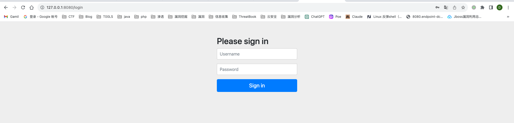

使用默认的账号user，以及密码进行登录

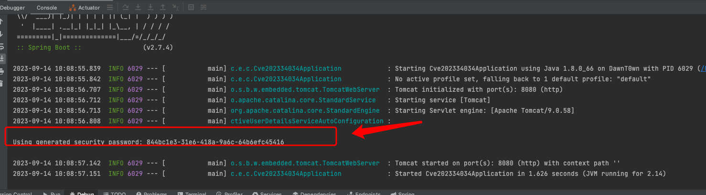

登陆后成功访问到/admin路由下的内容

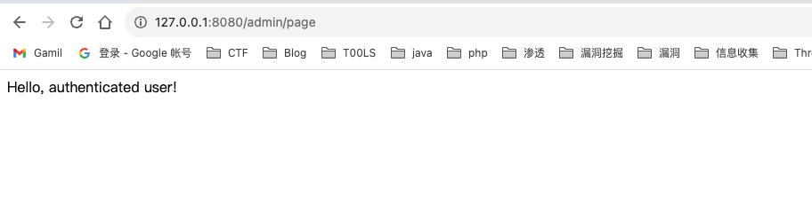

修改配置，将路径匹配从`admin/**`换成`/admin/**`

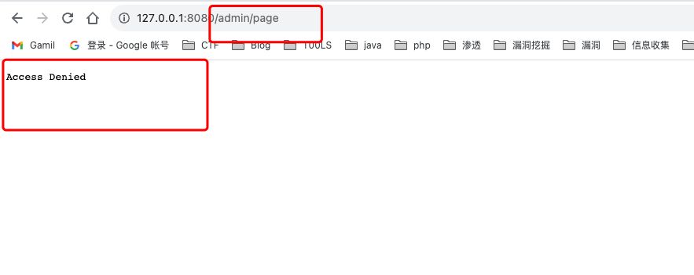

登陆后访问失败

# 漏洞分析

## Spring WebFlux解析流程

> Spring WebFlux是Spring Framework提供的用于构建响应式Web应用的模块，基于Reactive编程模型实现。它使用了Reactive Streams规范，并提供了一套响应式的Web编程模型，以便于处理高并发、高吞吐量的Web请求。
>
> 在SpringMvc中，DispatcherServlet是前端控制器设计模式的实现,提供Spring Web MVC的集中访问点,而且负责职责的分派。而**WebFlux的前端控制器是DispatcherHandler**。

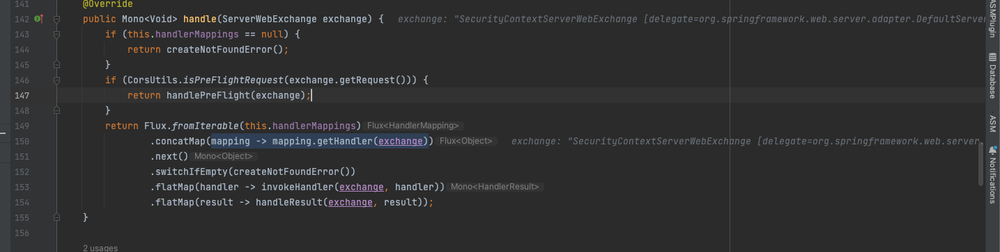

> org.springframework.web.reactive.DispatcherHandler#handler，其主要流程是遍历HandlerMapping数据结构，并封装成数据流类Flux。它会触发对应的handler方法，执行相应的业务代码逻辑，而HandlerMapping在配置阶段 会 根 据 @Controller 、 @RequestMapping 、 @GetMapping 、@PostMapping注解注册对应的业务方法到HandlerMapping接口，这也是 WebFlux兼容注解方式的原因 。 这些配置路由最终都会通过getHandler方法找到对应的处理类:

跟进getHandler方法看到

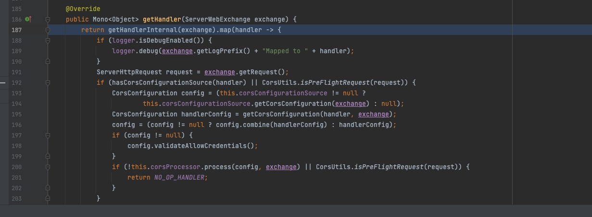

后调用getHandlerInternal方法获取适当处理器，接下来通过cors配置对信息进行处理，最终返回要用于处理请求的处理器对象或标识对象，主要来看getHandlerInternal方法

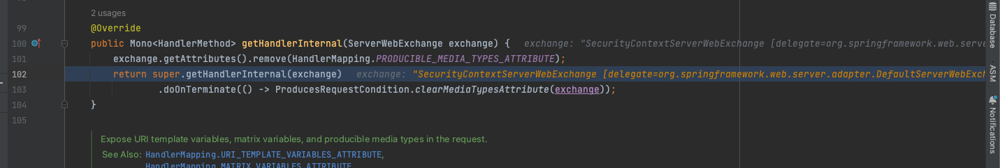

跟进其父类的getHandler

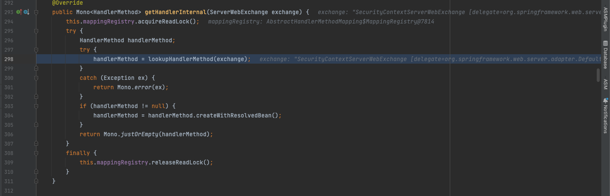

这个getHandler方法会将exchange传入lookupHanderMethod得到handlerMethod

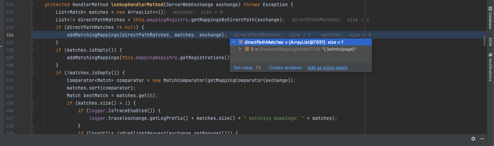

该方法会从已经注册的mapping中通过exchange获取一个List，将与当前请求匹配的映射通过addMatchingMappings添加到matches列表中。

在addMatchingMappings中遍历获取RequestMappinginfo，当匹配到是会添加到matches列表中

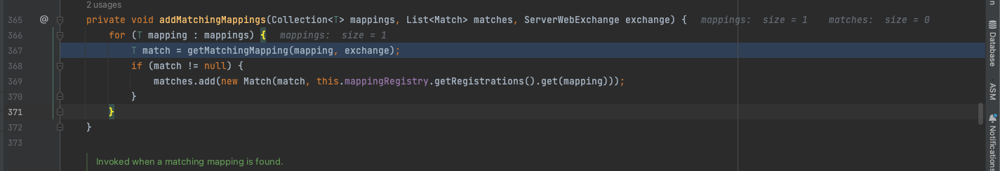

核心方法getMatchingMapping实际上调用的是org.springframework.web.reactive.result.method.RequestMappingInfoHandlerMapping#getMatchingCondition方法

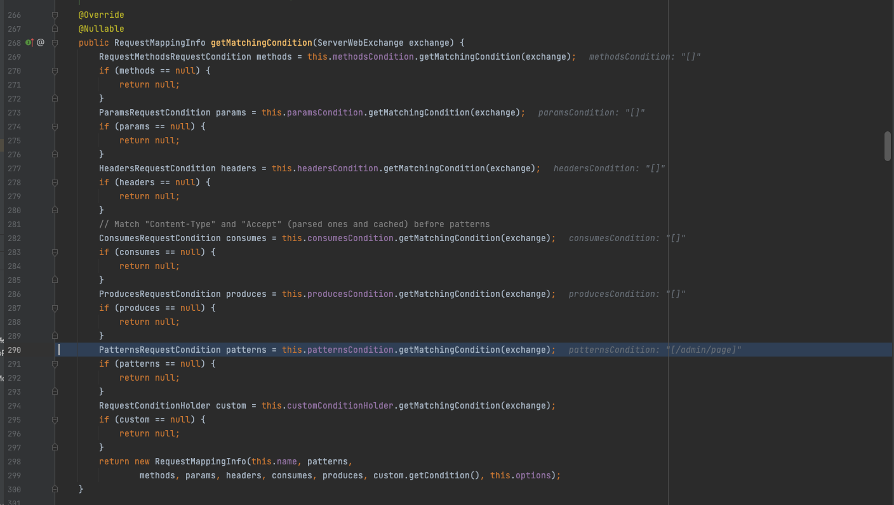

主要是检查各种参数是否匹配，例如请求方法methods、参数params、请求头headers还有出入参类型等等，对于路径匹配到话，调用的patternsCondition.getMatchingCondition(request)

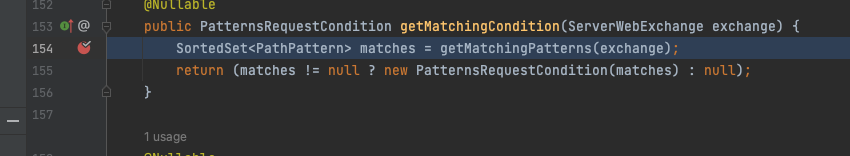

继续通过getMatchingPatterns获取matches

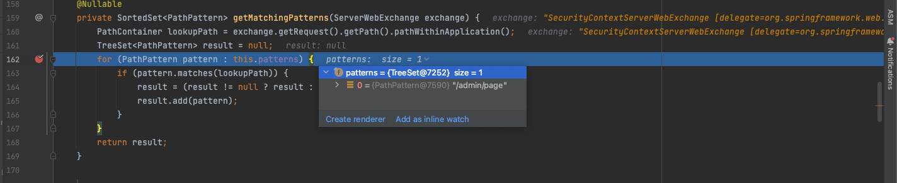

会从exchange中取出我们访问的路径给lookupPath，再遍历patterns调用PathPattern的matches方法

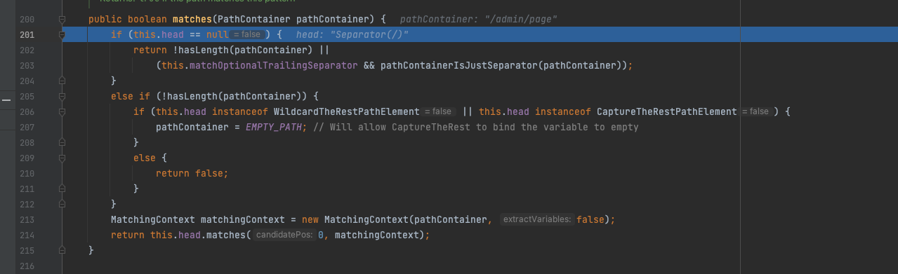

因为路径为/，接下来会调用SeparatorPathElement的matches方法进行处理

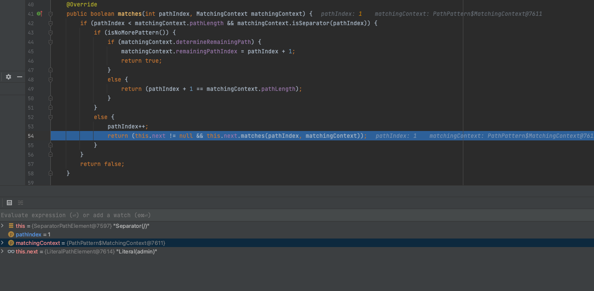

其实这里就和Spring MVC一样了，将访问的路径拆分成多个PathElement对象，然后依次调用对应的PathElement的matches方法逐个进行匹配，回到addMatchingMappings，因为获取到了match，会通过mapping从注册的mapping中获取MappingRegistration

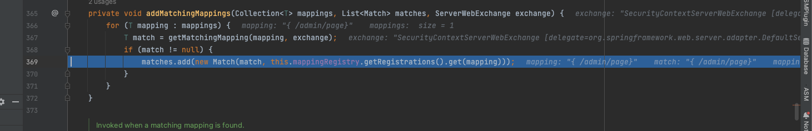

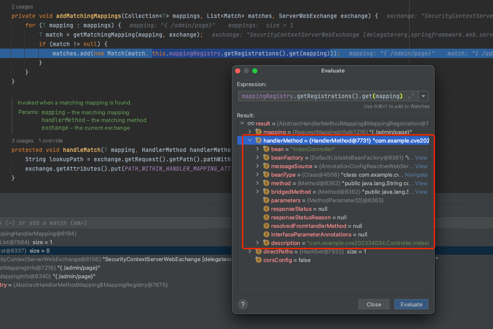

拿到对应的method，添加到matches中

接下来回到lookupHandlerMethod，因为matches不为空，进入if通过getHandlerMethod，从registration中获取对应URL的处理方法

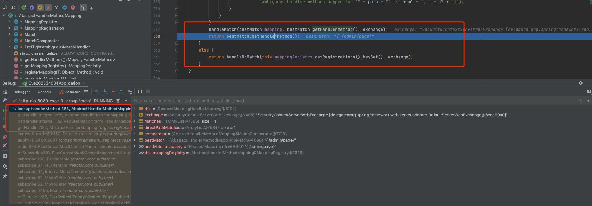

当我将控制器从`/admin/page`改为`admin/page`的时候发现匹配的路径仍然是/admin/page

原因是因为RequestMappingHandlerMapping在实例化的过程中，这个过程是在启动的时候完成的

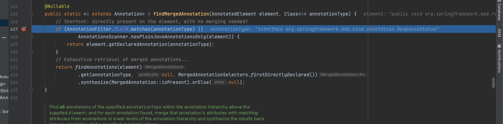

会通过AnnotatedElementUtils.findMergedAnnotation获取`element`上的`RequestMapping`注解。这个注解可以用于定义请求路径、请求方法、请求参数等信息。最后根据获取到的`RequestMapping`注解和自定义条件，调用`createRequestMappingInfo`方法创建一个完整的请求映射信息（`RequestMappingInfo`）对象，然后返回这个对象。

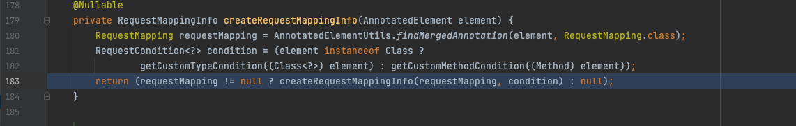

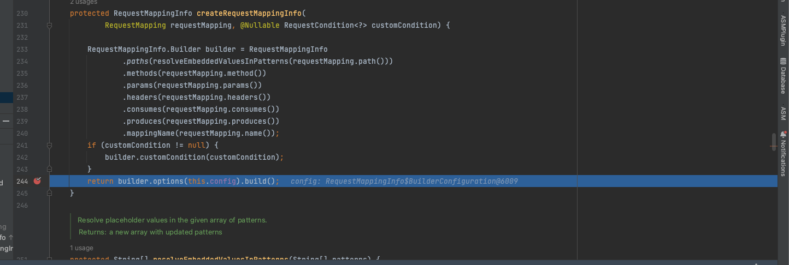

在后续调用`builder.options(this.config).build()`方法，使用提供的配置（`this.config`）构建并返回最终的请求映射信息（`RequestMappingInfo`）对象

在parse方法中

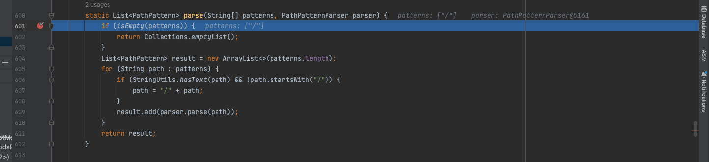

会自动给路径加上/，所以无论是admin/page还是/admin/page，解析的时候pattern均为/admin/page

## Spring Security流程

对于Spring WebFlux，spring security是采用的pathMatchers来实现基于请求路径的权限配置，而补丁修复的也是spring security相关的内容

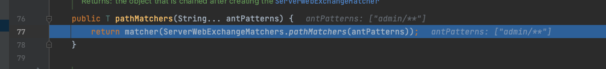

根据用户配置创建基于路径匹配的 `ServerWebExchangeMatcher` 对象，在这个pathMatchers方法中，首先创建了一个`ServerWebExchangeMatcher`的list列表。遍历传入的 `patterns` 数组，并对于每个路径模式，创建一个 `PathPatternParserServerWebExchangeMatcher` 对象，并传入该模式和请求方法，然后添加到`matchers` 列表。

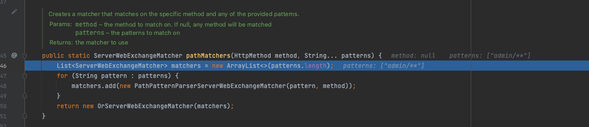

跟进PathPatternParserServerWebExchangeMatcher实例化的过程

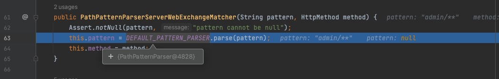

虽然是设置相应的值，但是pattern是通过PathPatternParser的parse方法得到的

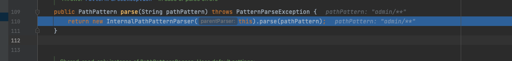

继续跟进，首先是对一些变量进行赋值

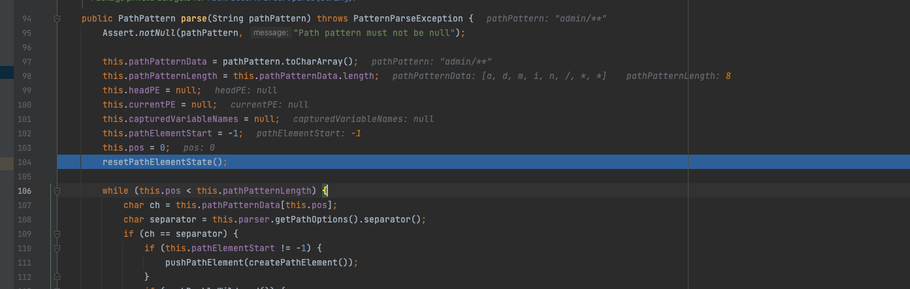

接下来通过循环解析匹配字符串的每一个字符，首先就是判断是否是路径分隔符

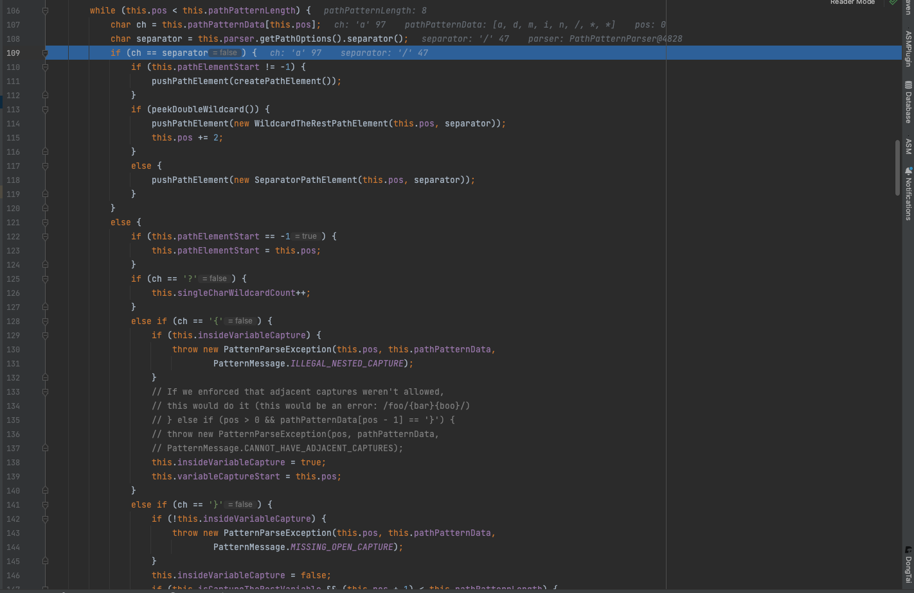

如果不是/，还会检查是不是`?{}:*`,以`:` 字符等字符，均不是的话则解析下一个字符，解析完成后，this.pathElementStart != -1则进入if循环，调用pushPathElement设置this.headPE等值，其实如果解析到一个/后，就不会进入这个if了

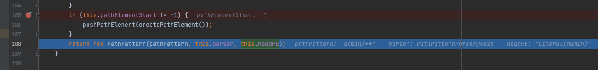

然后返回将最后一个路径元素添加到解析结果中。并使用解析得到的路径模式字符串、解析器和解析结果创建并返回 `PathPattern` 对象，用于后续的路径匹配和处理，在整个解析过程中，没有对匹配到路径前面增加/操作。最后Spring Security返回一个OrServerWebExchangeMatcher对象用户后续鉴权

在访问的时候会调用org.springframework.security.web.server.util.matcher#matches进行匹配

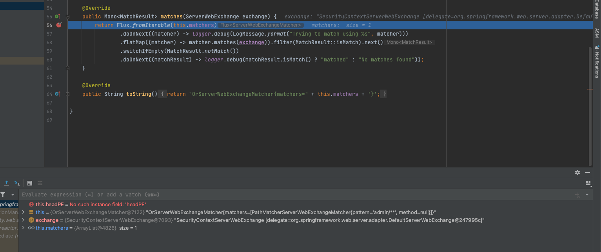

里面对应的matcher实际上就是spring security加载config的时候得到的OrServerWebExchangeMatcher里面封装的`PathPatternParserServerWebExchangeMatcher`对象，根据matches方法

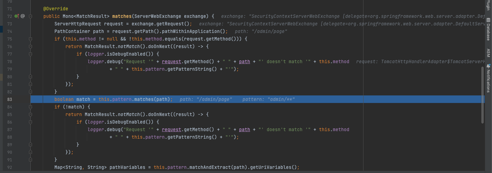

首先会从exchange中取出一个request对象，然后获取path（PathContainer对象，也就是将/admin/page分割后的多个PathElement），判断请求方法是否与当前的method一样，如果请求方法没有匹配到获取当前的method没有指定，是null的情况，就会调用PathPattern的matches方法，如果匹配成功，则将路径变量保存在 `pathVariables` 中用于后续验证使用。根据matches方法

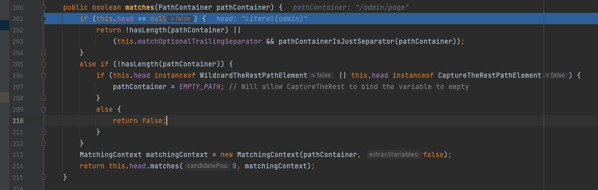

这也是也是PathPattern的matches，将路径拆分为多个PathElement对象依次解析，本质和CVE-2023-20860类似，将每个节点与PathContainer的节点进行匹配

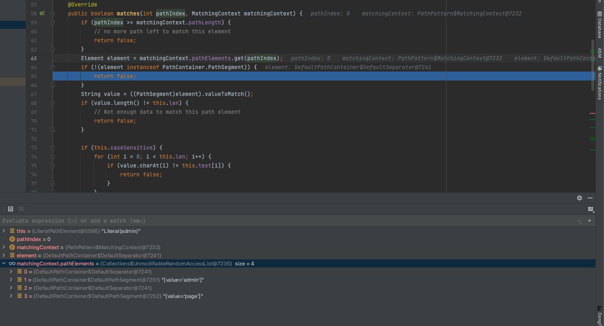

因为没有对admin/**加上/，在spring security配置的时候返回的PathPattern的第一个节点是admin，导致在解析第一个节点的时候，调用的是LiteralPathElement的matches方法，而WebFlux的请求路径默认加上了/，导致取出来的第一个element是DefaultSeparator而不是DefaultPathSegment，很明显没有实现PathSegment，直接返回false，权限校验失败

而补丁的主要功能就是在admin/**前面增加了/

# 漏洞修复

官方已经发布了修复版本，请及时更新到不受影响版本

**受影响版本**

6.1.0 <= Spring Security <= 6.1.1

6.0.0 <= Spring Security <= 6.0.4

5.8.0 <= Spring Security <= 5.8.4

5.7.0 <= Spring Security <= 5.7.9

5.6.0 <= Spring Security <= 5.6.11

**不受影响版本**

Spring Security >= 6.1.2

Spring Security >= 6.0.5

Spring Security >= 5.8.5

Spring Security >= 5.7.10

Spring Security >= 5.6.12

注意：以上对Spring Framework版本要求为

Spring Framework >= 6.0.11

Spring Framework >= 5.3.29

Spring Framework >= 5.2.25


参考链接：

https://forum.butian.net/share/2373

https://www.bilibili.com/video/BV1yN4y197wN/?vd_source=5ddaf0a13575e9d0512f1c316baf5a0e

https://springdoc.cn/spring-security/reactive/configuration/webflux.html