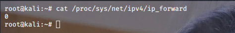

# 前言

之前接触过ARP欺骗,但是最近学了ARP协议后想再来看看ARP攻击

# 什么是ARP

地址解析协议，即ARP（Address ResolutionProtocol）

在以太网中,网络设备之间的通信是借助于MAC地址而不是ip地址,ARP协议就是用来把IP地址转换为MAC地址的。而RARP和ARP相反，它是反向地址转换协议，把MAC地址转换为IP地址。

每台设备会有一个ARP缓存表,用于存放一个从IP地址到MAC地址的映射表,经常动态更新

ARP的工作原理:当A要向B发送数据的时候,会在缓存表中查看有无B的IP地址,再找出其对应的MAC地址,再把这个MAC地址写入MAC帧,然后通过局域网把此MAC帧发往MAC地址

但是如果没有B的IP地址,ARP进程就会在局域网上广播,大概信息为:

我是A,我的IP是192.168.2.134,我的MAC地址是00-00-C0-15-AD-18,我想知道IP地址为192.168.2.121的主机的MAC地址

# ARP欺骗原理

在ARP缓存表机制存在一个缺陷，就是当请求主机收到ARP应答包后，不会去验证自己是否向对方主机发送过ARP请求包，就直接把这个返回包中的IP地址与MAC地址的对应关系保存进ARP缓存表中，如果原有相同IP对应关系，原有的则会被替换

可以用以下例子来理解

在同一局域网，主机A和B通过网关G相互通信，就好比A和B两个人写信，由邮递员G送信，我作为C永远都不知道A与B的通信内容?

当然不是,因为ARP缓存表的缺陷，我可以告诉A我是网关G，然后告诉网关G我是A，这样他们傻傻地相信了，就把内容发给了我

ARP欺骗有两种攻击利用方式

1.ARP欺骗断网攻击

攻击者欺骗受害主机，发送数据告诉受害主机说我是网关，然后受害主机会将攻击主机当作网关进行数据传输，这样就会导致受害主机无法正常上网。

2.ARP中间人攻击

攻击主机欺骗受害主机，发送数据告诉受害主机说我是网关，然后受害主机会将攻击主机当作网关进行数据传输。同时发送数据告诉网关说我是受害主机，网关会将攻击主机当作受害主机进行数据传输，这样受害主机和网关之间的数据交互都会经过攻击主机，受害主机不会断网不会察觉，所以可以查看到各种通信数据。

# 实战演示

攻击机:kali linux 192.168.121.129

靶机:win7 192.168.121.130

## ARP断网攻击

先nmap扫描一波该网段存活的主机IP


我们这次的靶机就是192.168.121.130可以看到靶机IP是存活的

看看win7的网关和ip


可以arp -a查看对应的ip和物理地址


192.168.121.2是网关的IP和对应的MAC地址

192.168.121.129是我们攻击机的IP和对应MAC地址

而且此时我们的靶机是能够正常上网,可以ping百度看看


是能够ping通的,这下就准备就绪了

这下可以直接使用kali的arpsproof进行arp欺骗

```
arpspoof -t 192.168.121.130 192.168.121.2 -i eth0
```

意思是告诉192.168.121.130我是网关

-i参数指定攻击机的某一张网卡来进行攻击，

-t第一个ip指定受害机的ip第二个ip为内网网关（一般来说是路由器）的ip

此时用arp -a可以看到网关的MAC地址已经和攻击机的一样了


在win7上再ping百度语句ping不通了,ping着ping着就请求超时了


结束arp进程后靶机可以重新上网,而且网关的MAC地址恢复了


而且此时我的防火墙是开启状态

## ARP中间人攻击（可截获图片和数据）

单单的断网肯定不够,既然能欺骗,那就可以进行双向欺骗去获取重要信息

使一台主机断网除了恶搞并没什么用,ARP中间人攻击并不会使受害主机断网,而是可以截取受害主机的流量

想要达到目的，我们就要使得我们的kali具备类似路由器的功能，将受害机发来的网络请求包转发给真实的网关，再由真实的网关转发到外网，接收返回包的过程同理

linux系统出于安全考虑禁止了IP转发功能，所以需要手动打开，在`/proc/sys/net/ipv4/ip_forward`里面数值是0，改为1就允许了IP转发（临时生效）

可以先看一下



将里面数值改为1


有时候还需要在其配置文件/etc/sysctl.conf将`net.ipv4.ip_forward`配置项取消掉“`#`”注释符号

改为1,然后执行`sysctl -p`更新,不过一般都不会用到

开启路由转发后,可以看到我arp欺骗已经成功而且我的靶机还是可以联网


此时靶机和网关的通信数据包会流经攻击机,用wireshark可以抓到流量数据


选择eth0这张网卡


看到192.168.121.130的数据包

或者使用driftnet工具

```
driftnet -i eth0
```


截取到了我靶机正在浏览的图片

不过你就被截取图片还是能够忍受的

利用手段

```
driftnet获取图片记录

ettercap嗅探HTTP网站帐号密码

sslstrip+dns2proxy_hsts嗅探HTTPS网站帐号密码

WIreshark+Cookie Hacker劫持Cookie
```

防止ARP攻击是比较困难的，修改协议也是不大可能，但是有一些工作是可以提高本地网络的安全性和可提高电脑的安全系数，比如:

1. 定期删除ARP缓存表；
2. 绑定静态的ARP表；
3. 安装ARP防火墙；
4. 拒绝连接安全性未知的WIFI等。


参考链接：

https://blog.csdn.net/ghtwf01/article/details/110440212

https://blog.csdn.net/weixin_39190897/article/details/104569308
