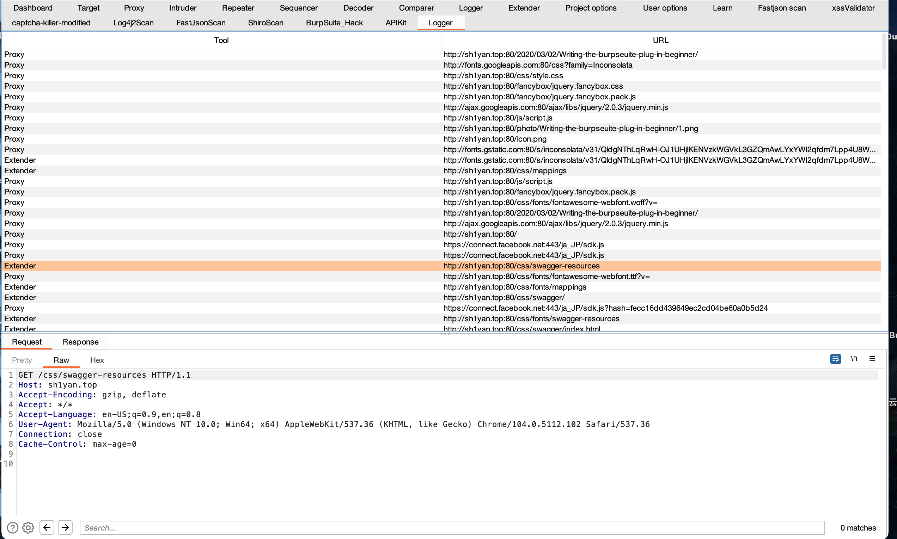

# Burp插件原理

1、插件的总入口是BurpExtender公开类，也就类似普通咱们写的mian函数，而该BurpExtender类是必须继承 IBurpExtender接口的。

2、当继承IBurpExtender接口后，会强制要求重写registerExtenderCallbacks()函数，而该函数的作用就是注册回调，当自己的写的插件需要哪些API支持的时候，都需要在该函数中进行注册，这样burp在执行的时候，会读取自己写的插件代码是否有回调注册，如果有就进行执行相应代码。

3、基本逻辑流程如下：

BurpExtender→registerExtenderCallbacks()→IBurpExtenderCallback.registerAPI类名称(this)→执行注册函数代码

**API接口介绍**

Burp Extender的API其实可以理解为Burp上大部分功能的对外接口，如 [IHttpListener](https://portswigger.net/burp/extender/api/burp/IHttpListener.html) 接口，当继承该API接口并进行回调注册后，Burp工具发出的所有请求包和响应包都会传给HTTP侦听器一份，我就可以对HTTP侦听器获得的http流量进行自定义分析或者修改处理。

下面我们用burp官方的插件例子https://portswigger.net/burp/extender/来举例，我们采用event-listener这个例子

我们在burp导出的接口这个包中，新建一个BurpExtender类（都叫这个名字）

# Event-Listener

官方给出的代码如下

```
package burp;

import java.io.PrintWriter;

public class BurpExtender implements IBurpExtender, IHttpListener,
        IProxyListener, IScannerListener, IExtensionStateListener
{
    private IBurpExtenderCallbacks callbacks;
    private PrintWriter stdout;

    //
    // implement IBurpExtender
    //

    @Override
    public void registerExtenderCallbacks(IBurpExtenderCallbacks callbacks)
    {
        // keep a reference to our callbacks object
        this.callbacks = callbacks;

        // set our extension name
        callbacks.setExtensionName("Event listeners");

        // obtain our output stream
        stdout = new PrintWriter(callbacks.getStdout(), true);

        // register ourselves as an HTTP listener
        callbacks.registerHttpListener(this);

        // register ourselves as a Proxy listener
        callbacks.registerProxyListener(this);

        // register ourselves as a Scanner listener
        callbacks.registerScannerListener(this);

        // register ourselves as an extension state listener
        callbacks.registerExtensionStateListener(this);
    }

    //
    // implement IHttpListener
    //

    @Override
    public void processHttpMessage(int toolFlag, boolean messageIsRequest, IHttpRequestResponse messageInfo)
    {
        stdout.println(
                (messageIsRequest ? "HTTP request to " : "HTTP response from ") +
                        messageInfo.getHttpService() +
                        " [" + callbacks.getToolName(toolFlag) + "]");
    }

    //
    // implement IProxyListener
    //

    @Override
    public void processProxyMessage(boolean messageIsRequest, IInterceptedProxyMessage message)
    {
        stdout.println(
                (messageIsRequest ? "Proxy request to " : "Proxy response from ") +
                        message.getMessageInfo().getHttpService());
    }

    //
    // implement IScannerListener
    //

    @Override
    public void newScanIssue(IScanIssue issue)
    {
        stdout.println("New scan issue: " + issue.getIssueName());
    }

    //
    // implement IExtensionStateListener
    //

    @Override
    public void extensionUnloaded()
    {
        stdout.println("Extension was unloaded");
    }
}
```

我们一步一步来分析，首先BurpExtender要实现IBurpExtender类，这个类要求我们重写一个方法registerExtenderCallbacks，对于我们插件来说，这个方法就相当于main函数，代码逻辑就是从他开始执行的，这个方法有一个参数为`IBurpExtenderCallbacks callbacks`


**IBurpExtenderCallbacks**：Burp Suite使用此接口将一组回调方法传递给扩展，扩展可以使用这些回调方法在Burp中执行各种操作。加载扩展时，Burp调用其 registerExtenderCallbacks()方法并传递IBurpExtenderCallbacks接口的实例 。然后，扩展可以根据需要调用此接口的方法，以扩展Burp的功能。

```
void	addScanIssue(IScanIssue issue)
// 此方法用于注册新的扫描仪问题。

void	addSuiteTab(ITab tab)
// 此方法用于将自定义选项卡添加到Burp Suite主窗口。

void	addToSiteMap(IHttpRequestResponse item)
// 此方法可用于将具有指定请求/响应详细信息的项目添加到Burp的站点地图。

IHttpRequestResponseWithMarkers	applyMarkers(IHttpRequestResponse httpRequestResponse, java.util.List<int[]> requestMarkers, java.util.List<int[]> responseMarkers)
// 此方法用于将标记应用于与某些特定目的相关的消息偏移量的HTTP请求或响应。

IBurpCollaboratorClientContext	createBurpCollaboratorClientContext()
// 此方法用于创建新的Burp Collaborator客户端上下文，该上下文可用于生成Burp Collaborator有效负载，并轮询Collaborator服务器以查找由于使用这些有效负载而导致的任何网络交互。

IMessageEditor	createMessageEditor(IMessageEditorController controller, boolean editable)
// 此方法用于创建Burp的HTTP消息编辑器的新实例，以使其在其自己的UI中使用。

ITextEditor	createTextEditor()
// 此方法用于创建Burp的纯文本编辑器的新实例，以供扩展程序在其自己的UI中使用。

void	customizeUiComponent(java.awt.Component component)
// 此方法用于根据Burp的UI样式自定义UI组件，包括字体大小，颜色，表行间距等。
    
IScanQueueItem	doActiveScan(java.lang.String host, int port, boolean useHttps, byte[] request)
// 此方法可用于将HTTP请求发送到Burp Scanner工具以执行活动的漏洞扫描。
    
IScanQueueItem	doActiveScan(java.lang.String host, int port, boolean useHttps, byte[] request, java.util.List<int[]> insertionPointOffsets)
// 此方法可用于根据要扫描的插入点的自定义列表，将HTTP请求发送到Burp Scanner工具以执行活动漏洞扫描。
    
void	doPassiveScan(java.lang.String host, int port, boolean useHttps, byte[] request, byte[] response)
// 此方法可用于将HTTP请求发送到Burp Scanner工具以执行被动漏洞扫描。
    
void	excludeFromScope(java.net.URL url)
// 此方法可用于从Suite范围范围中排除指定的URL。
    
void	exitSuite(boolean promptUser)
// 此方法可用于以编程方式关闭Burp，并向用户提供可选提示。
    
void	generateScanReport(java.lang.String format, IScanIssue[] issues, java.io.File file)
// 此方法用于为指定的扫描程序问题生成报告。
    
java.lang.String[]	getBurpVersion()
// 此方法检索有关正在运行扩展的Burp版本的信息。
    
java.lang.String[]	getCommandLineArguments()
// 此方法返回启动时传递给Burp的命令行参数。
    
java.util.List<IContextMenuFactory>	getContextMenuFactories()
// 此方法用于检索扩展名注册的上下文菜单工厂。
    
java.util.List<ICookie>	getCookieJarContents()
// 此方法用于检索Burp会话处理cookie jar的内容。
    
java.lang.String	getExtensionFilename()
// 此方法检索从中加载当前扩展名的文件的绝对路径名。
    
java.util.List<IExtensionStateListener>	getExtensionStateListeners()
// 此方法用于检索扩展注册的扩展状态侦听器。
    
java.lang.String[]	getHeaders(byte[] message)
// 不推荐使用。 
// 使用IExtensionHelpers.analyzeRequest()或 IExtensionHelpers.analyzeResponse()代替。
    
IExtensionHelpers	getHelpers()
// 此方法用于获取IExtensionHelpers对象，扩展可以使用该对象执行许多有用的任务。
    
java.util.List<IHttpListener>	getHttpListeners()
// 此方法用于检索扩展注册的HTTP侦听器。
    
java.util.List<IIntruderPayloadGeneratorFactory>	getIntruderPayloadGeneratorFactories()
// 此方法用于检索扩展注册的Intruder有效负载生成器工厂。
    
java.util.List<IIntruderPayloadProcessor>	getIntruderPayloadProcessors()
// 此方法用于检索扩展注册的Intruder有效负载处理器。
    
java.util.List<IMessageEditorTabFactory>	getMessageEditorTabFactories()
// 此方法用于检索扩展注册的消息编辑器选项卡工厂。
    
java.lang.String[][]	getParameters(byte[] request)
// 不推荐使用。 
// 使用IExtensionHelpers.analyzeRequest()代替。
    
IHttpRequestResponse[]	getProxyHistory()
// 此方法返回代理历史记录中所有项目的详细信息。
    
java.util.List<IProxyListener>	getProxyListeners()
// 此方法用于检索扩展注册的代理侦听器。
    
IScanIssue[]	getScanIssues(java.lang.String urlPrefix)
// 对于与指定文字前缀匹配的URL，此方法返回所有当前的扫描问题。
    
java.util.List<IScannerCheck>	getScannerChecks()
// 此方法用于检索扩展名注册的扫描程序检查。
    
java.util.List<IScannerInsertionPointProvider>	getScannerInsertionPointProviders()
// 此方法用于检索扩展名注册的扫描仪插入点提供程序。
    
java.util.List<IScannerListener>	getScannerListeners()
// 此方法用于检索扩展注册的Scanner侦听器。
    
java.util.List<IScopeChangeListener>	getScopeChangeListeners()
// 此方法用于检索扩展注册的范围更改侦听器。
    
java.util.List<ISessionHandlingAction>	getSessionHandlingActions()
// 此方法用于检索扩展注册的会话处理操作。
    
IHttpRequestResponse[]	getSiteMap(java.lang.String urlPrefix)
// 此方法返回站点地图中项目的详细信息。
    
java.io.OutputStream	getStderr()
// 此方法用于获取当前扩展的标准错误流。
    
java.io.OutputStream	getStdout()
// 此方法用于获取当前扩展的标准输出流。
    
java.lang.String	getToolName(int toolFlag)
// 此方法用于获取由提供的工具标志标识的Burp工具的描述性名称。
    
void	includeInScope(java.net.URL url)
// 此方法可用于在Suite范围范围内包括指定的URL。
    
boolean	isExtensionBapp()
// 此方法确定当前扩展是否已作为BApp（BApp商店中的Burp App）加载。
    
boolean	isInScope(java.net.URL url)
// 此方法可用于查询指定的URL是否在当前Suite范围内。
    
void	issueAlert(java.lang.String message)
// 此方法可用于在Burp Suite警报选项卡中显示指定的消息。
    
void	loadConfig(java.util.Map<java.lang.String,java.lang.String> config)
// 不推荐使用。 
// 使用loadConfigFromJson()代替。
    
void	loadConfigFromJson(java.lang.String config)
// 此方法使Burp从提供的JSON字符串中加载新的项目级配置。
    
java.lang.String	loadExtensionSetting(java.lang.String name)
// 此方法用于加载使用该方法保存的扩展的配置设置saveExtensionSetting()。
    
IHttpRequestResponse	makeHttpRequest(IHttpService httpService, byte[] request)
// 此方法可用于发出HTTP请求并检索其响应。
    
byte[]	makeHttpRequest(java.lang.String host, int port, boolean useHttps, byte[] request)
// 此方法可用于发出HTTP请求并检索其响应。
    
void	printError(java.lang.String error)
// 此方法将输出行输出到当前扩展程序的标准错误流。
    
void	printOutput(java.lang.String output)
// 此方法将输出行打印到当前扩展的标准输出流。
    
void	registerContextMenuFactory(IContextMenuFactory factory)
// 此方法用于为自定义上下文菜单项注册工厂。
    
void	registerExtensionStateListener(IExtensionStateListener listener)
// 此方法用于注册一个侦听器，该侦听器将收到有关扩展状态更改的通知。
    
void	registerHttpListener(IHttpListener listener)
// 此方法用于注册一个侦听器，该侦听器将被通知任何Burp工具发出的请求和响应。
    
void	registerIntruderPayloadGeneratorFactory(IIntruderPayloadGeneratorFactory factory)
// 此方法用于为入侵者有效载荷注册工厂。
    
void	registerIntruderPayloadProcessor(IIntruderPayloadProcessor processor)
// 此方法用于注册自定义入侵者有效负载处理器。
    
void	registerMenuItem(java.lang.String menuItemCaption, IMenuItemHandler menuItemHandler)
// 不推荐使用。 
// 使用registerContextMenuFactory()代替。
    
void	registerMessageEditorTabFactory(IMessageEditorTabFactory factory)
// 此方法用于为自定义消息编辑器选项卡注册工厂。
    
void	registerProxyListener(IProxyListener listener)
// 此方法用于注册一个侦听器，该侦听器将收到有关代理工具正在处理的请求和响应的通知。
    
void	registerScannerCheck(IScannerCheck check)
// 此方法用于注册自定义扫描程序检查。
    
void	registerScannerInsertionPointProvider(IScannerInsertionPointProvider provider)
// 此方法用于注册扫描仪插入点的提供者。
    
void	registerScannerListener(IScannerListener listener)
// 此方法用于注册一个侦听器，该侦听器将被通知由扫描程序工具报告的新问题。
    
void	registerScopeChangeListener(IScopeChangeListener listener)
// 此方法用于注册一个侦听器，该侦听器将在Burp套件范围的目标范围更改时得到通知。
    
void	registerSessionHandlingAction(ISessionHandlingAction action)
// 此方法用于注册自定义会话处理操作。
    
void	removeContextMenuFactory(IContextMenuFactory factory)
// 此方法用于删除扩展名已注册的上下文菜单工厂。
    
void	removeExtensionStateListener(IExtensionStateListener listener)
// 此方法用于删除已由扩展注册的扩展状态侦听器。
    
void	removeHttpListener(IHttpListener listener)
// 此方法用于删除扩展已注册的HTTP侦听器。
    
void	removeIntruderPayloadGeneratorFactory(IIntruderPayloadGeneratorFactory factory)
// 此方法用于删除扩展名已注册的Intruder有效负载生成器工厂。
    
void	removeIntruderPayloadProcessor(IIntruderPayloadProcessor processor)
// 此方法用于删除扩展名已注册的Intruder有效负载处理器。
    
void	removeMessageEditorTabFactory(IMessageEditorTabFactory factory)
// 此方法用于删除扩展名已注册的消息编辑器选项卡工厂。
    
void	removeProxyListener(IProxyListener listener)
// 此方法用于删除扩展名已注册的代理侦听器。
    
void	removeScannerCheck(IScannerCheck check)
// 此方法用于删除扩展名已注册的扫描程序检查。
    
void	removeScannerInsertionPointProvider(IScannerInsertionPointProvider provider)
// 此方法用于删除扩展名已注册的扫描仪插入点提供程序。
    
void	removeScannerListener(IScannerListener listener)
// 此方法用于删除扩展名已注册的Scanner侦听器。
    
void	removeScopeChangeListener(IScopeChangeListener listener)
// 此方法用于删除扩展已注册的范围更改侦听器。
    
void	removeSessionHandlingAction(ISessionHandlingAction action)
// 此方法用于删除扩展已注册的会话处理操作。
    
void	removeSuiteTab(ITab tab)
// 此方法用于从Burp Suite主窗口中删除先前添加的选项卡。
    
void	restoreState(java.io.File file)
// 不推荐使用。 
// 状态文件已替换为Burp项目文件。
    
IHttpRequestResponsePersisted	saveBuffersToTempFiles(IHttpRequestResponse httpRequestResponse)
// 此方法用于将IHttpRequestResponse对象的请求和响应保存 到临时文件，以便它们不再保存在内存中。
    
java.util.Map<java.lang.String,java.lang.String>	saveConfig()
// 不推荐使用。 
// 使用saveConfigAsJson()代替。
    
java.lang.String	saveConfigAsJson(java.lang.String... configPaths)
// 此方法使Burp以JSON格式保存其当前的项目级别配置。
    
void	saveExtensionSetting(java.lang.String name, java.lang.String value)
// 此方法用于以持久的方式保存扩展的配置设置，以免重新加载扩展和Burp Suite。
    
void	saveState(java.io.File file)
// 不推荐使用。 
// 状态文件已替换为Burp项目文件。
    
ITempFile	saveToTempFile(byte[] buffer)
// 此方法用于在磁盘上创建一个包含所提供数据的临时文件。
    
void	sendToComparer(byte[] data)
// 此方法可用于将数据发送到比较器工具。
    
void	sendToIntruder(java.lang.String host, int port, boolean useHttps, byte[] request)
// 此方法可用于向Burp Intruder工具发送HTTP请求。
    
void	sendToIntruder(java.lang.String host, int port, boolean useHttps, byte[] request, java.util.List<int[]> payloadPositionOffsets)
// 此方法可用于向Burp Intruder工具发送HTTP请求。
    
void	sendToRepeater(java.lang.String host, int port, boolean useHttps, byte[] request, java.lang.String tabCaption)
// 此方法可用于将HTTP请求发送到Burp Repeater工具。
    
void	sendToSpider(java.net.URL url)
// 此方法可用于将种子URL发送到Burp Spider工具。
    
void	setExtensionName(java.lang.String name)
// 此方法用于设置当前扩展名的显示名称，该名称将显示在扩展器工具的用户界面中。
    
void	setProxyInterceptionEnabled(boolean enabled)
// 此方法设置Burp代理的主侦听模式。
    
void	unloadExtension()
// 此方法用于从Burp Suite卸载扩展。
    
void	updateCookieJar(ICookie cookie)
// 此方法用于更新Burp会话处理cookie jar的内容。
```

现在我们来看这个例子的registerExtenderCallbacks方法

```java
@Override
public void registerExtenderCallbacks(IBurpExtenderCallbacks callbacks)
{
    // keep a reference to our callbacks object
    this.callbacks = callbacks;

    // set our extension name
    callbacks.setExtensionName("Event listeners");	# 插件名称

    // obtain our output stream
    stdout = new PrintWriter(callbacks.getStdout(), true); # stdout为输出，用PrintWriter打印

    // register ourselves as an HTTP listener
    callbacks.registerHttpListener(this);

    // register ourselves as a Proxy listener
    callbacks.registerProxyListener(this);

    // register ourselves as a Scanner listener
    callbacks.registerScannerListener(this);

    // register ourselves as an extension state listener
    callbacks.registerExtensionStateListener(this);
}
```

我们来注册几个监听事件，这些在burp导出的接口中能看到类，通过类名字我们大概能分辨出来（IHttpListenre，IProxyListener，IScannerListener），这里里面监听相关的累，一般来说，注册的话就是调用registerHttpListener等类似的方法，在IBurpExtenderCallbacks接口中我们也能验证对应的方法

```
callbacks.registerHttpListener(this);
```

我们注册了相应的事件，那就需要去实现相应的接口，重写接口的函数，然后去调用注册函数相关代码

所以这里BurpExtender实现了IHttpListener接口，重写了，processHttpMessage当Burp Suite接收到HTTP消息时，`processHttpMessage`方法将被调用，并处理响应消息

在Burp Suite中，`processHttpMessage`方法会在以下情况下被调用：

1. 当Burp Suite捕获到HTTP请求或响应时，会调用注册的`IHttpListener`的`processHttpMessage`方法。这意味着每当你发送或接收到HTTP请求/响应时，该方法都会被调用。
2. `processHttpMessage`方法的`toolFlag`参数指定了触发该方法调用的工具。你可以根据需要选择要处理的工具类型。例如，你可以仅处理代理工具捕获的请求/响应，或者只关注扫描工具生成的请求/响应。
3. `messageIsRequest`参数指示当前处理的消息是请求还是响应。如果为`true`，则表示当前处理的是请求消息；如果为`false`，则表示当前处理的是响应消息。

至于更加底层的代码，我们就不用去关了，只需要将其理解为IHttpListener的注册函数，收到http请求和响应的时候会调用它

为了全局使用callbacks和stdout，我们先定义一个全局变量

```
private IBurpExtenderCallbacks callbacks;
private PrintWriter stdout;
```

那我们就可以在里面编写实现的代码了

```
@Override
public void processHttpMessage(int toolFlag, boolean messageIsRequest, IHttpRequestResponse messageInfo)
{
    stdout.println(
            (messageIsRequest ? "HTTP request to " : "HTTP response from ") +
                    messageInfo.getHttpService() +
                    " [" + callbacks.getToolName(toolFlag) + "]");
}
```

这就是一个简单的打印


我们也可以判断是不是响应消息，来获取响应内容

```
@Override
    public void processHttpMessage(int toolFlag, boolean messageIsRequest, IHttpRequestResponse messageInfo) {
        // 判断是否为响应消息
        if (!messageIsRequest) {
            // 获取响应消息的响应头和响应体
            byte[] response = messageInfo.getResponse();
            IResponseInfo responseInfo = helpers.analyzeResponse(response);

            // 输出响应的状态码和URL
            int statusCode = responseInfo.getStatusCode();
            String url = helpers.analyzeRequest(messageInfo).getUrl().toString();
            System.out.println("Received response with status code " + statusCode + " from URL: " + url);
        }
    }
```

对于其他两个listener，都是一样的，在BurpExtender中实现起接口，重写方法

对于IExtensionStateListener，这个接口里面的方法是插件unload的时候触发的

还有issuescan


对于burp官网给的example还是挺简单的，看起来，但是和我们平常用的图形化界面还是有点不同，接下来来试试通过UI在Burp中新加一个窗口，监听所有的http请求和响应

# custom-logger

```
package burp;

import java.awt.Component;
import java.net.URL;
import java.util.ArrayList;
import java.util.List;
import javax.swing.JScrollPane;
import javax.swing.JSplitPane;
import javax.swing.JTabbedPane;
import javax.swing.JTable;
import javax.swing.SwingUtilities;
import javax.swing.table.AbstractTableModel;
import javax.swing.table.TableModel;

public class BurpExtender extends AbstractTableModel implements IBurpExtender, ITab, IHttpListener, IMessageEditorController
{
    private IBurpExtenderCallbacks callbacks;
    private IExtensionHelpers helpers;
    private JSplitPane splitPane;
    private IMessageEditor requestViewer;
    private IMessageEditor responseViewer;
    private final List<LogEntry> log = new ArrayList<LogEntry>();
    private IHttpRequestResponse currentlyDisplayedItem;

    //
    // implement IBurpExtender
    //

    @Override
    public void registerExtenderCallbacks(final IBurpExtenderCallbacks callbacks)
    {
        // keep a reference to our callbacks object
        this.callbacks = callbacks;

        // obtain an extension helpers object
        helpers = callbacks.getHelpers();

        // set our extension name
        callbacks.setExtensionName("Custom logger");

        // create our UI
        SwingUtilities.invokeLater(new Runnable()
        {
            @Override
            public void run()
            {
                // main split pane
                splitPane = new JSplitPane(JSplitPane.VERTICAL_SPLIT);

                // table of log entries
                Table logTable = new Table(BurpExtender.this);
                JScrollPane scrollPane = new JScrollPane(logTable);
                splitPane.setLeftComponent(scrollPane);

                // tabs with request/response viewers
                JTabbedPane tabs = new JTabbedPane();
                requestViewer = callbacks.createMessageEditor(BurpExtender.this, false);
                responseViewer = callbacks.createMessageEditor(BurpExtender.this, false);
                tabs.addTab("Request", requestViewer.getComponent());
                tabs.addTab("Response", responseViewer.getComponent());
                splitPane.setRightComponent(tabs);

                // customize our UI components
                callbacks.customizeUiComponent(splitPane);
                callbacks.customizeUiComponent(logTable);
                callbacks.customizeUiComponent(scrollPane);
                callbacks.customizeUiComponent(tabs);

                // add the custom tab to Burp's UI
                callbacks.addSuiteTab(BurpExtender.this);

                // register ourselves as an HTTP listener
                callbacks.registerHttpListener(BurpExtender.this);
            }
        });
    }

    //
    // implement ITab
    //

    @Override
    public String getTabCaption()
    {
        return "Logger";
    }

    @Override
    public Component getUiComponent()
    {
        return splitPane;
    }

    //
    // implement IHttpListener
    //

    @Override
    public void processHttpMessage(int toolFlag, boolean messageIsRequest, IHttpRequestResponse messageInfo)
    {
        // only process responses
        if (!messageIsRequest)
        {
            // create a new log entry with the message details
            synchronized(log)
            {
                int row = log.size();
                log.add(new LogEntry(toolFlag, callbacks.saveBuffersToTempFiles(messageInfo),
                        helpers.analyzeRequest(messageInfo).getUrl()));
                fireTableRowsInserted(row, row);
            }
        }
    }

    //
    // extend AbstractTableModel
    //

    @Override
    public int getRowCount()
    {
        return log.size();
    }

    @Override
    public int getColumnCount()
    {
        return 2;
    }

    @Override
    public String getColumnName(int columnIndex)
    {
        switch (columnIndex)
        {
            case 0:
                return "Tool";
            case 1:
                return "URL";
            default:
                return "";
        }
    }

    @Override
    public Class<?> getColumnClass(int columnIndex)
    {
        return String.class;
    }

    @Override
    public Object getValueAt(int rowIndex, int columnIndex)
    {
        LogEntry logEntry = log.get(rowIndex);

        switch (columnIndex)
        {
            case 0:
                return callbacks.getToolName(logEntry.tool);
            case 1:
                return logEntry.url.toString();
            default:
                return "";
        }
    }

    //
    // implement IMessageEditorController
    // this allows our request/response viewers to obtain details about the messages being displayed
    //

    @Override
    public byte[] getRequest()
    {
        return currentlyDisplayedItem.getRequest();
    }

    @Override
    public byte[] getResponse()
    {
        return currentlyDisplayedItem.getResponse();
    }

    @Override
    public IHttpService getHttpService()
    {
        return currentlyDisplayedItem.getHttpService();
    }

    //
    // extend JTable to handle cell selection
    //

    private class Table extends JTable
    {
        public Table(TableModel tableModel)
        {
            super(tableModel);
        }

        @Override
        public void changeSelection(int row, int col, boolean toggle, boolean extend)
        {
            // show the log entry for the selected row
            LogEntry logEntry = log.get(row);
            requestViewer.setMessage(logEntry.requestResponse.getRequest(), true);
            responseViewer.setMessage(logEntry.requestResponse.getResponse(), false);
            currentlyDisplayedItem = logEntry.requestResponse;

            super.changeSelection(row, col, toggle, extend);
        }
    }

    //
    // class to hold details of each log entry
    //

    private static class LogEntry
    {
        final int tool;
        final IHttpRequestResponsePersisted requestResponse;
        final URL url;

        LogEntry(int tool, IHttpRequestResponsePersisted requestResponse, URL url)
        {
            this.tool = tool;
            this.requestResponse = requestResponse;
            this.url = url;
        }
    }
}
```

对于UI界面，我们需要实现ITab接口，然后重写其方法，这里采用的swing UI

1. `SwingUtilities.invokeLater()` 方法确保在事件派发线程上执行 `run()` 方法中的代码，事件派发线程负责处理Swing GUI事件。
2. 在 `run()` 方法内部，代码创建了一个 `JSplitPane` 组件，用于将GUI分为两个可调整大小的面板（水平或垂直分割）。
3. 实例化了一个 `Table` 类，这可能是一个自定义类，扩展或使用 `javax.swing.JTable` 类。它表示用于显示日志条目的表格组件。
4. 创建了一个 `JScrollPane` 并将其初始化为 `logTable` 组件，如果表格包含的条目超过了一次可以显示的数量，它可以使表格具有滚动条功能。
5. 将 `scrollPane` 设置为 `splitPane` 的左侧组件，这意味着日志表格将位于分割面板的顶部或左侧，具体取决于 `JSplitPane.VERTICAL_SPLIT` 常量。
6. 创建了一个名为 `tabs` 的 `JTabbedPane` 组件。该组件允许添加多个选项卡，每个选项卡包含不同的组件。在这种情况下，它用于显示请求和响应查看器。
7. 使用 `callbacks.createMessageEditor()` 创建了两个消息编辑器组件。这些编辑器用于显示和编辑HTTP请求和响应。传递给该方法的 `false` 参数表示这些编辑器是只读的。
8. 使用 `addTab()` 方法将请求查看器组件添加到标题为 "Request" 的选项卡中，类似地，将响应查看器组件添加到标题为 "Response" 的选项卡中。
9. 将 `tabs` 组件设置为 `splitPane` 的右侧组件，这意味着它将位于分割面板的底部或右侧。
10. 使用 `callbacks.customizeUiComponent()` 方法自定义了各种UI组件（split pane、table、scroll pane、tabs）。
11. 将自定义选项卡添加到Burp的用户界面中，使用 `callbacks.addSuiteTab()` 方法。
12. 使用 `callbacks.registerHttpListener()` 方法将当前对象（BurpExtender）注册为HTTP监听器。




https://www.cnblogs.com/wjrblogs/p/16618145.html

http://sh1yan.top/2020/03/02/Writing-the-burpseuite-plug-in-beginner/

https://portswigger.net/burp/extender/

https://t0data.gitbooks.io/burpsuite/content/chapter16.html
