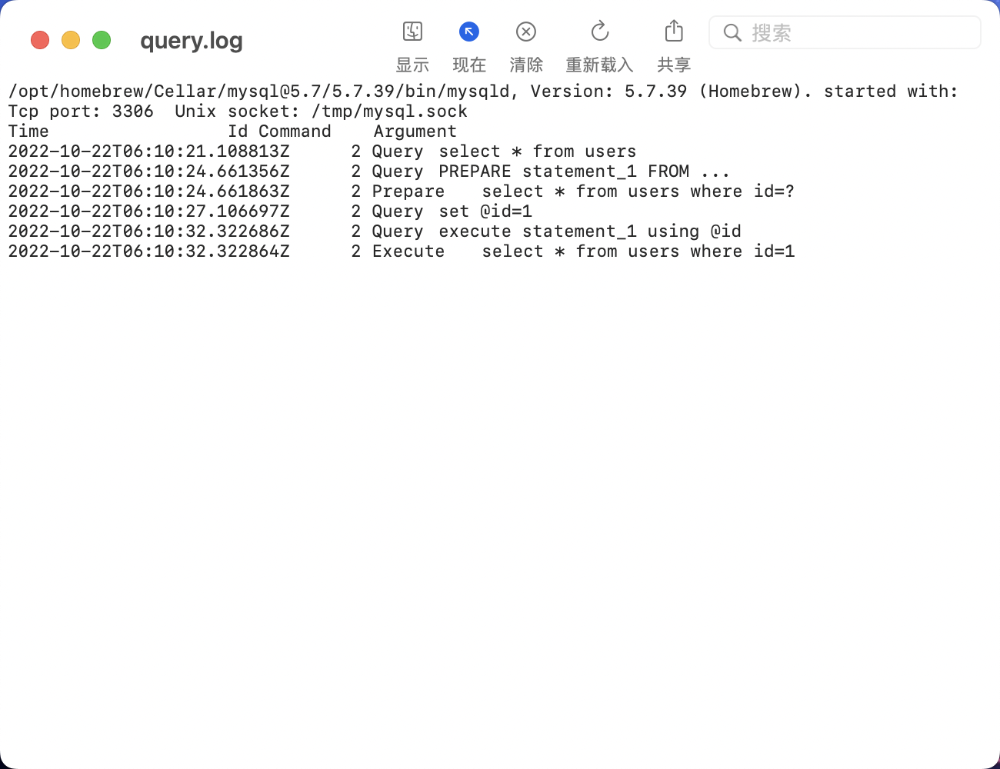
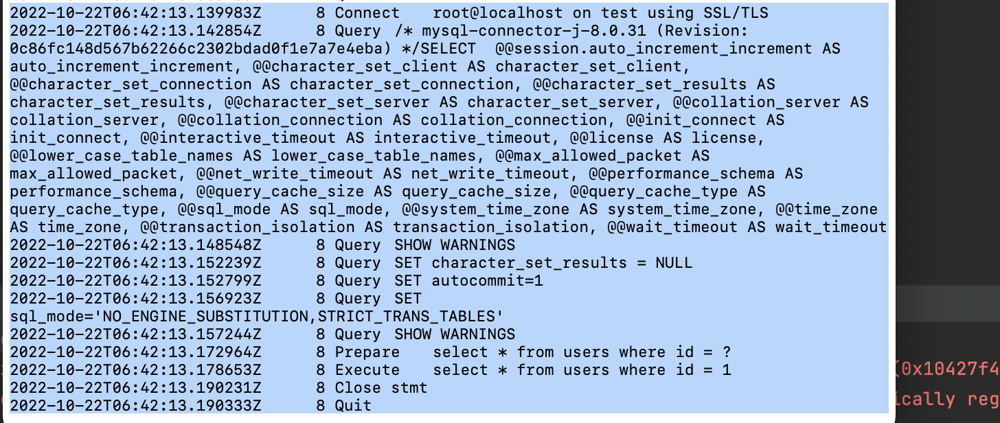
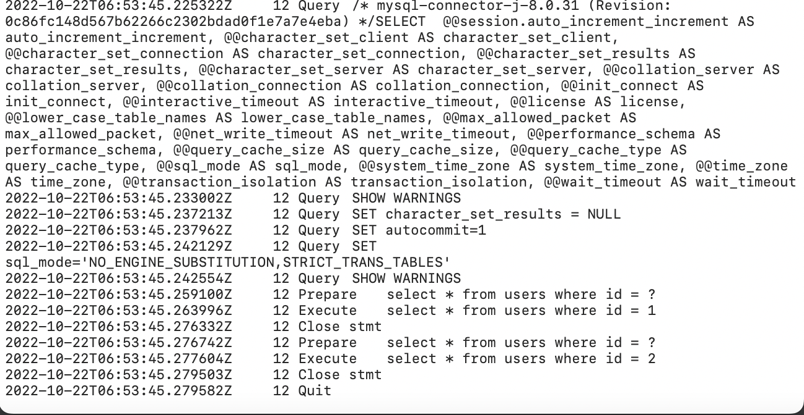

# 什么是预编译

​	但是有很多情况下，我们的一条SQL语句可能需要反复的执行，而SQL语句也只可能传递的参数不一样，类似于这样的SQL语句如果每次都需要进行校验、解析等操作，未免太过于浪费性能了，因此我们提出了SQL语句的预编译。

​	所谓预编译就是将一些灵活的参数值以占位符?的形式给代替掉，我们把参数值给抽取出来，把SQL语句进行模板化。让MySQL服务器执行相同的SQL语句时，不需要在校验、解析SQL语句上面花费重复的时间

# 预编译作用：

- 预编译阶段可以优化 sql 的执行
   预编译之后的 sql 多数情况下可以直接执行，DBMS 不需要再次编译，越复杂的sql，编译的复杂度将越大，预编译阶段可以合并多次操作为一个操作。可以提升性能。
- 防止SQL注入
   使用预编译，而其后注入的参数将`不会再进行SQL编译`。也就是说其后注入进来的参数系统将不会认为它会是一条SQL语句，而默认其是`一个参数`，参数中的or或者and 等就不是SQL语法保留字了。

# MYSQL预编译

之前在强网杯的有道堆叠注入的时候，了解过一些，Mysql预编译的语法

```
set用于设置变量名和值
prepare用于预备一个语句，并赋予名称，以后可以引用该语句
execute执行语句
deallocate prepare用来释放掉预处理的语句
```

```
-- 定义一个预编译语句
prepare statement_1 from 'select * from users where id=?';	#将sql语句赋值给参数statement_1

设置参数值：
set @id=1;

执行预编译SQL语句：
execute statement_1 using @id;	#用@id的值填充预编译语句里面的占位符？
```

为了看到预处理执行的语句，为开启了日志记录

```
set global general_log='on';
set global general_log_file='/Users/DawnT0wn/Desktop/query.log';
```


查询到了id为1到结果，可以看看执行了什么语句



在预编译执行后，执行了`select * from users where id=1`这段代码

# JDBC预编译

在java中，我们用JDBC去连接数据库，而Connection创建Statement的方式有如下三种

- createStatement(): 创建基本的Statement对象
- prepareStatement(): 创建PreparedStatement对象。
- preparCall(): 创建CallableStatement对象。

通过prepareStatement可以创建一个PreparedStatement对象来将参数化的SQL语句发送到数据库，也就是所说的预编译

## 开启预编译

prepareStatement默认是没有开启预编译的，要让其生效，必须在JDBC连接的URL设置`useServerPrepStmts=true`

```
String url="jdbc:mysql://localhost:3306/test?useServerPrepStmts=true";
```

```
package JDBCTest;

import java.sql.*;

public class preparetest {
    public static void main(String[] args) throws Exception{
        Class.forName("com.mysql.jdbc.Driver");
        String url="jdbc:mysql://localhost:3306/test?useServerPrepStmts=true";
        String username="root";
        String password="xxxx";
        Connection conn= DriverManager.getConnection(url, username, password);
        String sql="select * from users where id = ?";
        PreparedStatement stmt = conn.prepareStatement(sql);
        stmt.setInt(1,1); //设置索引为1的占位符的值为1
        ResultSet rs=stmt.executeQuery();
        System.out.println("id|name|password|email|birthday");
        while (rs.next()) {
            int id=rs.getInt("id");     //通过列名获取指定字段的值
            String name=rs.getString("name");
            String psw=rs.getString("password");
            String email=rs.getString("email");
            Date birthday=rs.getDate("birthday");
            System.out.println(id+"|"+name+"|"+psw+"|"+email+"|"+birthday);
        }
        //6.回收数据库
        rs.close();
        stmt.close();
        conn.close();
    }
}
```

如果是字符串就用stmt.setString

数据库执行日志：




## 开启预编译缓存

```
jdbc:mysql://localhost:3306/test?useServerPrepStmts=true&cachePrepStmts=true
```

当jdbc的cachePrepStmts为true的时候，开启预编译缓存

这是个什么东西呢，当不开启缓存的时候可以看看

```
package JDBCTest;

import java.sql.*;

public class preparetest {
    public static void main(String[] args) throws Exception{
        Class.forName("com.mysql.jdbc.Driver");

        //2.通过 DriverManager获取数据库连接
        String url="jdbc:mysql://localhost:3306/test?useServerPrepStmts=true";
        String username="root";
        String password="Gatc_327509";
        Connection conn= DriverManager.getConnection(url, username, password);
        //3.通过 Connection对象获取 Statement对象
        String sql="select * from users where id = ?";
        
        
        PreparedStatement stmt = conn.prepareStatement(sql);
        stmt.setInt(1,1);

        //4.使用 Statement执行SQL语句
        ResultSet rs=stmt.executeQuery();
        //5、操作 ResultSet结果集
        System.out.println("id|name|password|email|birthday");
        while (rs.next()) {
            int id=rs.getInt("id");     //通过列名获取指定字段的值
            String name=rs.getString("name");
            String psw=rs.getString("password");
            String email=rs.getString("email");
            Date birthday=rs.getDate("birthday");
            System.out.println(id+"|"+name+"|"+psw+"|"+email+"|"+birthday);
        }
        //6.回收数据库
        rs.close();
        stmt.close();

        PreparedStatement statement = conn.prepareStatement(sql);
        statement.setInt(1,2);
        ResultSet resultSet = statement.executeQuery();
        System.out.println("id|name|password|email|birthday");
        while (resultSet.next()) {
            int id=resultSet.getInt("id");     //通过列名获取指定字段的值
            String name=resultSet.getString("name");
            String psw=resultSet.getString("password");
            String email=resultSet.getString("email");
            Date birthday=resultSet.getDate("birthday");
            System.out.println(id+"|"+name+"|"+psw+"|"+email+"|"+birthday);
        }
        resultSet.close();
        statement.close();
        conn.close();

    }
}
```

当我创建不同的PreparedStatement对象的时候，一个连接会预编译两次



但是很明显这种方式就不够完美了，同样的预编译语句，为只需要改参数值即可，那肯定会大大提高运行效率

于是有了预编译缓存：

预编译语句被DB的编译器编译后的执行代码被缓存下来,那么下次调用时只要是相同的预编译语句就不需要编译,只要将参数直接传入编译过的语句执行代码中(相当于一个涵数)就会得到执行

同样的代码，修改一下url

```
jdbc:mysql://localhost:3306/test?useServerPrepStmts=true&cachePrepStmts=true
```


可以很明显的看到这里值预编译了一次

另外要注意，statement对象是不支持预编译的，即使设置了参数

**编译是用来提升SQL语句的响应速度的**，将一段SQL语句定制成模板，把灵活的参数作为[占位符](https://so.csdn.net/so/search?q=占位符&spm=1001.2101.3001.7020)让我们传递进去，达到多次执行相同的SQL语句必须要重复校验、解析等操作

# PHP中的预编译

其实很多人听说过PDO，为也是因为这个才了解到预编译的，PDO确实是可以作为一个防止sql注入的有效手段，但是只说PDO，那别人就会觉得你只会PHP，其实PDO也就是一个在PHP中实现预编译的手段

在PHP中，有两种连接数据库的方式，一个是mysqli，一个是PDO

```
<?php
$servername = "localhost";
$username = "username";
$password = "password";
 
// 创建连接
$conn = mysqli_connect($servername, $username, $password);
 
// 检测连接
if (!$conn) {
    die("Connection failed: " . mysqli_connect_error());
}
echo "连接成功";
?>
```


```
<?php
$servername = "localhost";
$username = "username";
$password = "password";
 
try {
    $conn = new PDO("mysql:host=$servername;", $username, $password);
    echo "连接成功"; 
}
catch(PDOException $e)
{
    echo $e->getMessage();
}
?>
```

PDO可以被认作是一种通过编译SQL语句模板来运行SQL语句的机制。

- 查询仅需解析（或预处理）一次，但可以用相同或不同的参数执行多次。当查询准备好后，数据库将分析、编译和优化执行该查询的计划。对于复杂的查询，此过程要花费较长的时间，如果需要以不同参数多次重复相同的查询，那么该过程将大大降低应用程序的速度。通过使用预处理语句，可以避免重复分析/编译/优化周期。简言之，预处理语句占用更少的资源，因而运行得更快。
- 提供给预处理语句的参数不需要用引号括起来，驱动程序会自动处理。如果应用程序只使用预处理语句，可以确保不会发生SQL注入。（然而，如果查询的其他部分是由未转义的输入来构建，则仍存在SQL注入的风险

```
<?php
$servername = "localhost";
$username = "root";
$password = "Gatc_327509";
$dbname = "test";

$conn = new PDO("mysql:host=$servername;dbname=$dbname", $username, $password);
$conn->setAttribute(PDO::ATTR_EMULATE_PREPARES,false);


$sql = "select * from users where id = ?";
//预编译语句
$stmt = $conn->prepare($sql);
//定义要传入的变量（可以接收传过来的值）
$id=1;
//将变量绑定到占位初
$stmt ->bindParam(1,$id);
//执行sql语句
$stmt->execute();
$stmt->bindColumn(1,$id);
$stmt->bindColumn(2,$name);
$stmt->bindColumn(3,$pass);
//将数据取出
// pdo预编译 占位符
// $sql = "select * from users where username=? ";
// $stmt = $conn->prepare($sql);
// $username = 'root';
//占位符通过变量绑定
// $stmt -> bindParam(1,$username);
// $stmt->execute();
// $stmt->bindColumn(3,$id);
// $stmt->bindColumn(2,$username);
// 占位符通过数组绑定
// $stmt ->execute([$username]);
// $stmt->bindColumn(3,$id);
// $stmt->bindColumn(2,$username);
//将对应的数据库对应的列绑定到变量上
// $stmt->bindColumn(1,$pass);
// $stmt->bindColumn(2,$user);
// $stmt->bindColumn(3,$id);
//将数据取出
while($stmt->fetch()){
	echo $id."\n";
	echo $name."\n";
    echo $pass;
}
//释放内存资源
$stmt =null;
//断开连接
$conn = null;

```

添加

```
$conn->setAttribute(PDO::ATTR_EMULATE_PREPARES,false);
```


参考链接：

https://blog.csdn.net/bb15070047748/article/details/107266400

https://blog.csdn.net/weixin_49183673/article/details/124000318
