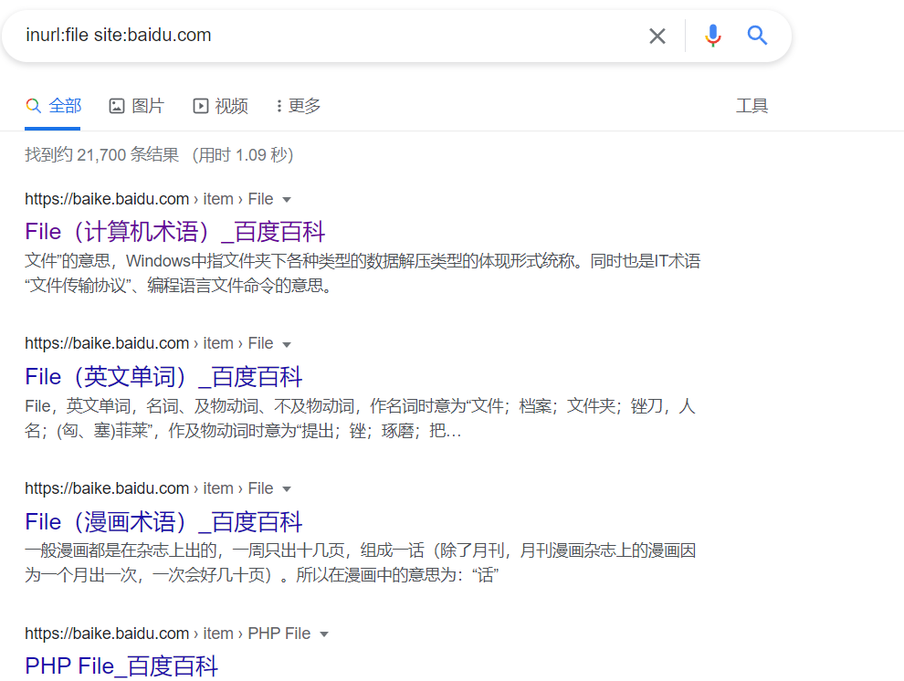

# 信息收集

信息收集是渗透的基本

搞渗透的人应该都清楚，信息收集对于渗透测试来说是非常重要的，我们手上掌握的目标的信息越多，成功渗透的概率就越大，而信息收集又分为两类。

第一类：主动信息收集：通过直接访问、扫描网站，这种流量将流经网站

第二类：被动信息收集：利用第三方的服务对目标进行访问了解，比例：Google搜索、Shodan搜索等

# CMS识别


Google的这个插件也能识别一些CMS信息


# 网站waf识别

```
https://github.com/EnableSecurity/wafw00f

nmap -p 80,443 --script http-waf-fingerprint ip
nmap -p 80,443 --script http-waf-detect ip
```

# 域名信息收集

## 域名注册人信息收集

利用whois查询

whois是用来查询域名的IP以及所有者等信息的传输协议。就是一个用来查询域名是否被注册，以及注册域名的详细信息的数据库（如：域名所有人、域名注册商），一般情况下对于中小型网站域名注册者就是网站管理员。通过域名Whois服务器查询，可以查询域名归属者联系方式，以及注册和到期时间

Whois协议

基本内容是先向服务器的TCP端口43建立一个连接发送查询关键字并加上回车换行，然后接收服务器的查询结果

**whois查询方式：**：

```
web接口:
	http://whois.chinaz.com/	#站长之家
	https://whois.aliyun.com/	#阿里云域名信息查询
	https://www.whois365.com/	#全球whois查询
	https://x.threatbook.cn/	#微步情报社区
	http://whois.4.cn/whois		#这个网站还有whois反查功能
whois命令查询:
	whois 域名
```

## 子域名爆破

子域名指二级域名，二级域名是顶级域名（一级域名）的下一级。

比如：mail.baidu.com和bbs.baidu.com是baidu.com的子域，而baidu.com则是顶级域名.com的子域

利用工具

```
wydomain

layer子域名挖掘机

dnsenum
```


## 备案信息查询

ICP备案介绍：Internet Content Provider 网络内容提供商。国家对经营性互联网信息服务实行许可制度；对非经营性互联网信息服务实行备案制度

```
https://icp.chinaz.com/
```

## whois反查

先通过whois获取注册人和邮箱，再通过注册人和邮箱反查域名。

**缺点：**很多公司都是DNS解析的运行商注册的，查到的是运营商代替个人和公司注册的网站信息

大部分时候是查不到的

# Google语法

**googlehack 常用语法**

```
site 指定域名

intext 正文中存在关键字的网页

intitle 标题中存在关键字的网页

info 一些基本信息

inurl URL存在关键字的网页

filetype 搜索指定文件类型
```

**site:baidu.com#收集百度子域名**


**intitle:管理登录 #查找后台管理登陆界面**


**filetype:php #查找php类型主页**


**inurl:file #查找url上含file的网址寻找上传漏洞**



当让这些语法还可以一起组合使用起到更大的作用，如下

```
site:http://xx.com filetype:txt 查找TXT文件 其他的以此类推

查找后台

site:http://xx.com intext:管理

site:http://xx.com inurl:login

site:http://xx.com intitle:后台

查看服务器使用的程序

site:http://xx.com filetype:asp

site:http://xx.com filetype:php

site:http://xx.com filetype:jsp

site:http://xx.com filetype:aspx

查看上传漏洞

site:http://xx.com inurl:file

site:http://xx.com inurl:load

查找注射点

site:http://xx.com filetype:asp
```


信息收集有很多,主要就是明白怎么用,所以剩下的就不记录了,可以参照下面两个blog

参考链接

https://www.freebuf.com/articles/web/271407.html (这个链接提供了很多网站和工具)

https://zhuanlan.zhihu.com/p/250941978