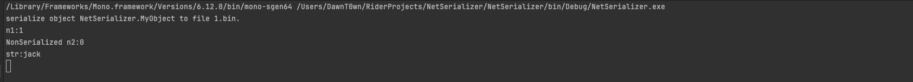
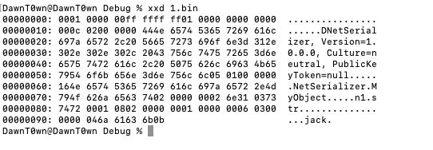
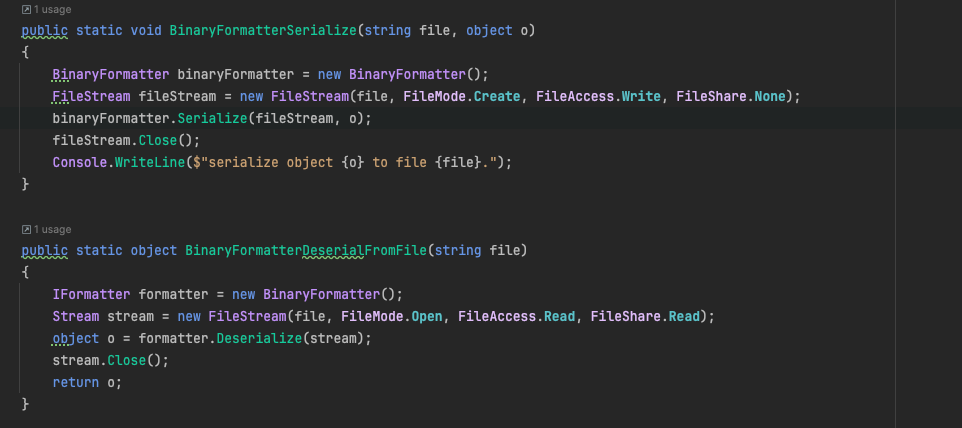
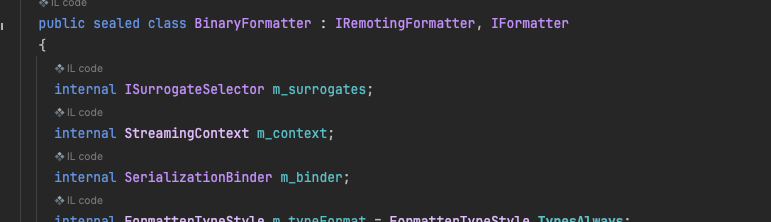
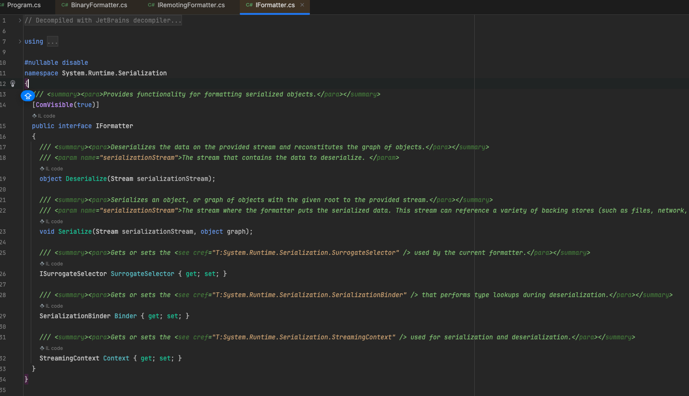
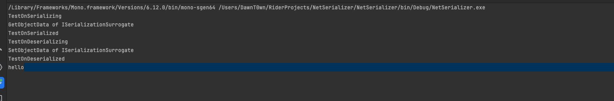
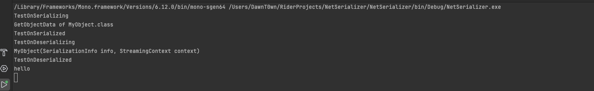
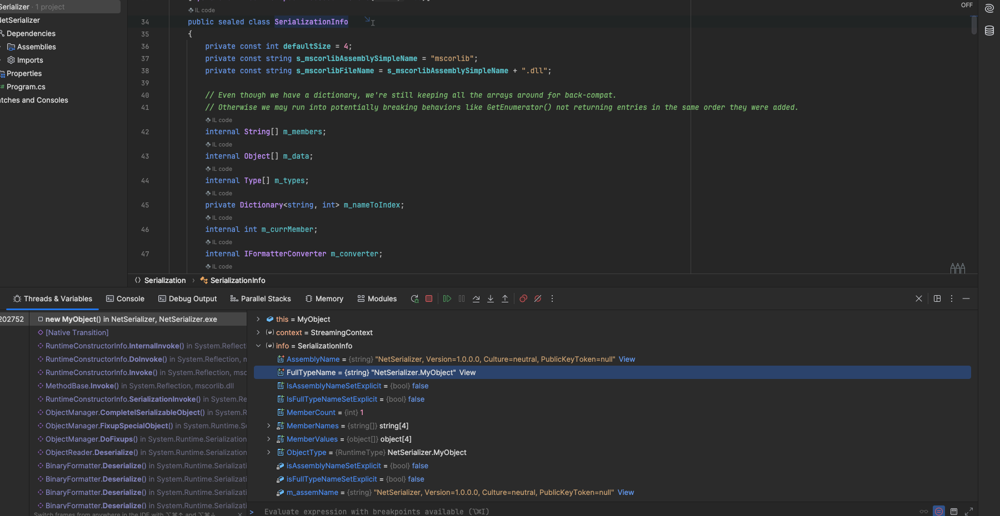
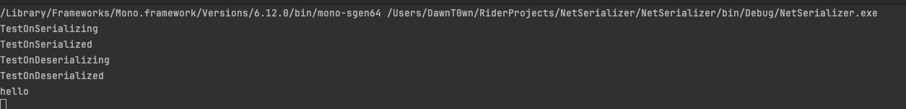
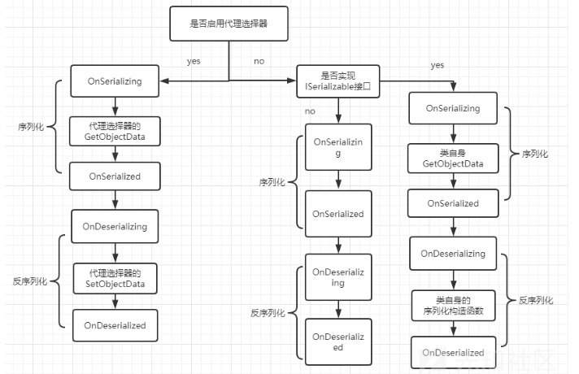

# 前言

最近想把自己会的领域拓宽一点，找到一点新的学习方向，突然想到这么久了还没有学dotnet，于是来跟着y4er的文章学一下dotnet的反序列化

# dotnet序列化与反序列化

对于序列化与反序列化的原因，不管是在Java，PHP，Python中都是一样，为了对某个对象的持久化处理，在任何时间可以恢复这个对象，在dotnet中依然适用

微软官方给出了内置库中可以序列化的类型列表：https://learn.microsoft.com/zh-cn/previous-versions/dotnet/fundamentals/serialization/binary/binary-serialization

在Java中，我们要对一个类进行序列化，需要这个类实现了Serializable接口，那在dotnet中应该怎么来表示这个可以序列化呢

dotnet使用`特性`的方式标记Serializable，大概这样

```
[Serializable]  
public class MyObject
{  
  public int n1;  
  [NonSerialized] public int n2;  
  public String str;  
}
```

用`[Serializable]`来标记MyObject这个类是可以序列化的，但是其中的`n2`这个变量是不能被序列化的字段

这里有一个序列化与反序列化的例子

```c#
using System;
using System.IO;
using System.Runtime.Serialization;
using System.Runtime.Serialization.Formatters.Binary;

namespace NetSerializer
{
    [Serializable]
    public class MyObject
    {
        public int n1;
        [NonSerialized] public int n2;
        public String str;
    }

    class Program
    {
        public static void BinaryFormatterSerialize(string file, object o)
        {
            BinaryFormatter binaryFormatter = new BinaryFormatter();
            FileStream fileStream = new FileStream(file, FileMode.Create, FileAccess.Write, FileShare.None);
            binaryFormatter.Serialize(fileStream, o);
            fileStream.Close();
            Console.WriteLine($"serialize object {o} to file {file}.");
        }

        public static object BinaryFormatterDeserialFromFile(string file)
        {
            IFormatter formatter = new BinaryFormatter();
            Stream stream = new FileStream(file, FileMode.Open, FileAccess.Read, FileShare.Read);
            object o = formatter.Deserialize(stream);
            stream.Close();
            return o;
        }

        static void Main(string[] args)
        {
            try
            {
                MyObject myObject = new MyObject();
                myObject.n1 = 1;
                myObject.n2 = 2;
                myObject.str = "jack";

                BinaryFormatterSerialize("1.bin", myObject);
                MyObject myObject1 = (MyObject)BinaryFormatterDeserialFromFile("1.bin");

                Console.WriteLine($"n1:{myObject1.n1}");
                Console.WriteLine($"NonSerialized n2:{myObject1.n2}");
                Console.WriteLine($"str:{myObject1.str}");
            }
            catch (Exception e)
            {
                Console.WriteLine(e.Message);
            }
            Console.ReadKey();
        }
    }
}
```

序列化内容写进了1.bin这个二进制文件，然后反序列化后分别对`n1、n2、str`三个字段进行了打印，除了不能被序列化的`n2`，其他的值都被正常还原了



对于Java来看，这里的序列化都是生成了二进制文件，可以说是一个二进制流，那Java的序列化有开头的标志`aced0005`，那dotnet的序列化流应该也有一个标准的数据开头`00010000`



# Formatter

在序列化与反序列化的时候我们引入了一个BinaryFormatter类



这个对象里面提供了Serialize和Deserialize方法，分别对应`将序列化内容写进流/读取序列化流还原对象`，这个的工作过程和`writeObject/readObject`的过程很像（不是指函数过程），类似

```
ByteArrayOutputStream byteArrayOutputStream = new ByteArrayOutputStream();
ObjectOutputStream objectOutputStream = new ObjectOutputStream(byteArrayOutputStream);
objectOutputStream.writeObject(obj);
```

回到BinaryFormatter这个类，这个类表示使用二进制的形式进行序列化，在dotnet中还有很多其他的Formatter，每种Formatter都对应了一种序列化格式：

1. BinaryFormatter 用于二进制格式
2. SoapFormatter 用于序列化soap格式
3. LosFormatter 用于序列化 Web 窗体页的视图状态
4. ObjectStateFormatter 用于序列化状态对象图

甚至还有一些其他格式的，例如XmlSerializer，JsonSerializer分别对影xml和json格式的序列化数据，感觉序列化数据一个和XmlDecoder和fastjson这种很类似



上面提到的Formatter类都实现了名为IFormatter，IRemotingFormatter接口，其中IRemotingFormatter是用来远程调用的RPC接口，它也实现了IFormatter，所以重点看IFormatter接口。



IFormatter接口中定了序列化和反序列化两种方法以及三个字段

| 类 字段名                            | 含义用途                                                |
| ------------------------------------ | ------------------------------------------------------- |
| ISurrogateSelector SurrogateSelector | 序列化代理选择器 接管formatter的序列化或反序列化处理    |
| SerializationBinder Binder           | 用于控制在序列化和反序列化期间使用的实际类型            |
| StreamingContext Context             | 序列化流上下文 其中states字段包含了序列化的来源和目的地 |

通过这三个字段，我们可以控制序列化和反序列化时数据的类型、值以及其他信息。

# BinaryFormatter生命周期及事件

对于Formatter调用Serialize方法的时候，会有如下的过程

- 首先确定formatter是否有代理选择器，也就是SurrogateSelector字段，如果有代理选择器，如果有则检查代理选择器要处理的对象类型与给定对象类型是否一致，如果一致，代理选择器会调用`ISerializable.GetObjectData`
- 如果没有设置代理选择器SurrogateSelector，或者是代理选择器不处理该对象类型，就检查对象是否有`[Serilizable]`特性，如果没有则不能序列化并抛出异常
- 检查对象是否实现ISerializable接口，如果实现了这个接口就调用其GetObjectData方法
- 如果没有实现ISerializable接口，就使用默认的序列化策略，序列化所有没有被标记为`[NonSerializable]`的字段

在序列化与反序列化中还有四个相关的事件，也是通过特性标注

| 特性                                                         | 调用关联的方法时 | 典型用法                              |
| ------------------------------------------------------------ | ---------------- | ------------------------------------- |
| [OnDeserializingAttribute](https://docs.microsoft.com/zh-cn/dotnet/api/system.runtime.serialization.ondeserializingattribute) | 反序列化之前     | 初始化可选字段的默认值。              |
| [OnDeserializedAttribute](https://docs.microsoft.com/zh-cn/dotnet/api/system.runtime.serialization.ondeserializedattribute) | 反序列化之后     | 根据其他字段的内容修改可选字段值。    |
| [OnSerializingAttribute](https://docs.microsoft.com/zh-cn/dotnet/api/system.runtime.serialization.onserializingattribute) | 序列化之前       | 准备序列化。 例如，创建可选数据结构。 |
| [OnSerializedAttribute](https://docs.microsoft.com/zh-cn/dotnet/api/system.runtime.serialization.onserializedattribute) | 序列化之后       | 记录序列化事件。                      |

```c#
[OnDeserializing]
private void TestOnDeserializing(StreamingContext sc)
{
    Console.WriteLine("TestOnDeserializing");

}
[OnDeserialized]
private void TestOnDeserialized(StreamingContext sc)
{
    Console.WriteLine("TestOnDeserialized");
}
[OnSerializing]
private void TestOnSerializing(StreamingContext sc)
{
    Console.WriteLine("TestOnSerializing");
}
[OnSerialized]
private void TestOnSerialized(StreamingContext sc)
{
    Console.WriteLine("TestOnSerialized");
}
```

这里用y4er师傅的代码可以清楚的看到相关流程

```c#
using System;
using System.IO;
using System.Runtime.Serialization;
using System.Runtime.Serialization.Formatters.Binary;
using System.Security.Permissions;

namespace NetSerializer
{
    [Serializable]
    public class MyObject : ISerializable
    {
        public string str { get; set; }
        
        public MyObject()
        {
        }
        
        //实现了ISerializable接口的类必须包含有序列化构造函数，否则会出错。
        protected MyObject(SerializationInfo info, StreamingContext context)
        {
            Console.WriteLine("MyObject(SerializationInfo info, StreamingContext context)");
            str = info.GetString("str");
        }

        [SecurityPermission(SecurityAction.LinkDemand, Flags = SecurityPermissionFlag.SerializationFormatter)]
        public virtual void GetObjectData(SerializationInfo info, StreamingContext context)
        {
            Console.WriteLine("GetObjectData of MyObject.class");
            info.AddValue("str", str, typeof(string));
        }

        [OnDeserializing]
        private void TestOnDeserializing(StreamingContext sc)
        {
            Console.WriteLine("TestOnDeserializing");

        }
        [OnDeserialized]
        private void TestOnDeserialized(StreamingContext sc)
        {
            Console.WriteLine("TestOnDeserialized");
        }
        [OnSerializing]
        private void TestOnSerializing(StreamingContext sc)
        {
            Console.WriteLine("TestOnSerializing");
        }
        [OnSerialized]
        private void TestOnSerialized(StreamingContext sc)
        {
            Console.WriteLine("TestOnSerialized");
        }
    }
    class MySerializationSurrogate : ISerializationSurrogate
    {
        public void GetObjectData(object obj, SerializationInfo info, StreamingContext context)
        {
            Console.WriteLine("GetObjectData of ISerializationSurrogate");
            info.AddValue("str", ((MyObject)obj).str);
        }

        public object SetObjectData(object obj, SerializationInfo info, StreamingContext context, ISurrogateSelector selector)
        {
            Console.WriteLine("SetObjectData of ISerializationSurrogate");
            MyObject m = new MyObject();
            m.str = (string)info.GetValue("str", typeof(string));
            return m;
        }
    }
    class Program
    {
        static void Main(string[] args)
        {
            try
            {
                MyObject myObject = new MyObject();
                myObject.str = "hello";

                using (MemoryStream memoryStream = new MemoryStream())
                {
                    // 构建formatter
                    BinaryFormatter binaryFormatter = new BinaryFormatter();

                    // 设置序列化代理选择器
                    SurrogateSelector ss = new SurrogateSelector();
                    ss.AddSurrogate(typeof(MyObject), binaryFormatter.Context, new MySerializationSurrogate());
                    // 赋值给formatter 这里是否设置代理选择器决定了序列化的生命周期
                    // binaryFormatter.SurrogateSelector = ss;
                    // 序列化
                    binaryFormatter.Serialize(memoryStream, myObject);
                    // 重置stream
                    memoryStream.Position = 0;
                    myObject = null;
                    // 反序列化
                    myObject = (MyObject)binaryFormatter.Deserialize(memoryStream);
                    Console.WriteLine(myObject.str);    // hello
                }

            }
            catch (Exception e)
            {
                Console.WriteLine(e.StackTrace);
            }
            Console.ReadKey();
        }
    }
}
```

- `MyObject`类实现了`ISerializable`接口，并且重写了`GetObjectData`方法，在其中添加了4个事件，内容就直接打印
- `MySerializationSurrogate`类实现了`ISerializationSurrogate`接口，用于提供代理对象的序列化和反序列化逻辑
- 在main方法中，首先创建了一个`MyObject`对象，通过`BinaryFormatter`设置代理选择器，并将`MySerializationSurrogate`添加为`MyObject`类型的代理。最后，通过`Serialize`方法序列化对象到`MemoryStream`，再通过`Deserialize`方法从`MemoryStream`反序列化对象。

当设置了代理选择器后，运行的结果为



可以看到是，序列化时先触发了OnDeserializing，然后是代理选择器的GetObjectData方法，相应的事件，然后在反序列化的时候触发了代理选择器的SetObjectData方法，最后还原对象，得到MyObject的str字段值

当把`binaryFormatter.SurrogateSelector = ss;`这段代码注释掉后，也就是不添加代理选择器



就是正常调用MyObject类的GetObjectData方法，然后调用了构造方法

```c#
//实现了ISerializable接口的类必须包含有序列化构造函数，否则会出错。
protected MyObject(SerializationInfo info, StreamingContext context)
{
    Console.WriteLine("MyObject(SerializationInfo info, StreamingContext context)");
    str = info.GetString("str");
}
```

SerializationInfo info变量中表示序列化流的信息，对象的类型和值都存储在其中



存储了对象类型、成员个数、程序集名称、类型名称等，还有一些AddValue的重载用于添加类实例字段变量键值对

其实这个序列化构造函数在代理选择器中表现的更加明显：

```
class MySerializationSurrogate : ISerializationSurrogate
{
    public void GetObjectData(object obj, SerializationInfo info, StreamingContext context)
    {
        Console.WriteLine("GetObjectData of ISerializationSurrogate");
        info.AddValue("str", ((MyObject)obj).str);
    }

    public object SetObjectData(object obj, SerializationInfo info, StreamingContext context, ISurrogateSelector selector)
    {
        Console.WriteLine("SetObjectData of ISerializationSurrogate");
        MyObject m = new MyObject();
        m.str = (string)info.GetValue("str", typeof(string));
        return m;
    }
}
```

一个get一个set表示对象的序列化形式和反序列化重构时的处理方式。而非代理选择器只实现ISerializable接口的类只有GetObjectData，其类自身的序列化构造函数等同于代理选择器的SetObjectData。

当对象不实现ISerializable接口的时候，就只触发回调函数的事件



y4er师傅给了一张序列化以及反序列化的流程图




参考链接：

https://xz.aliyun.com/t/9591
