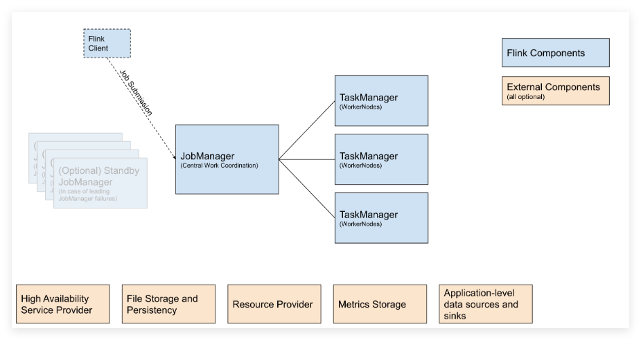
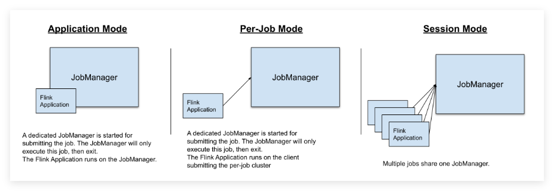
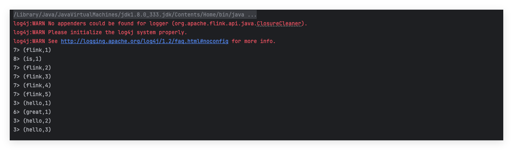
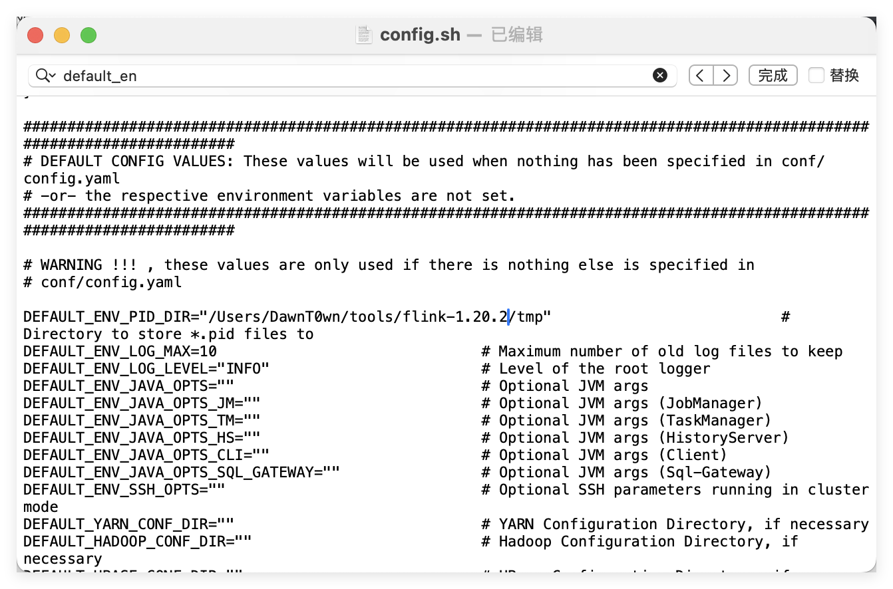
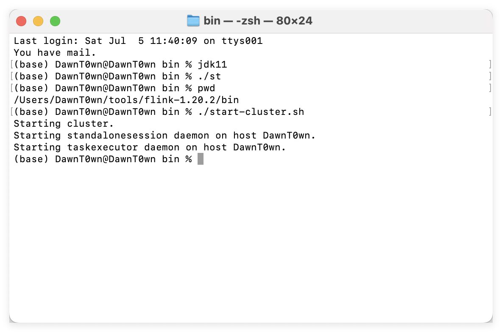
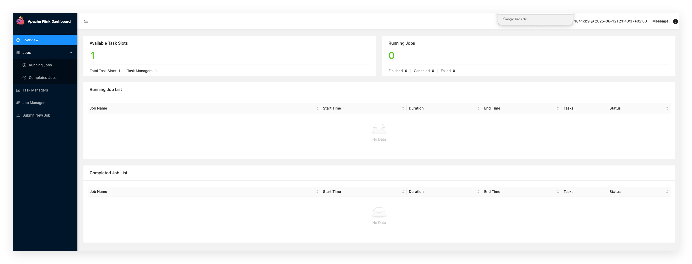
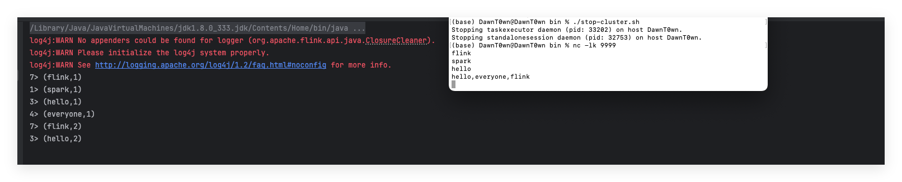
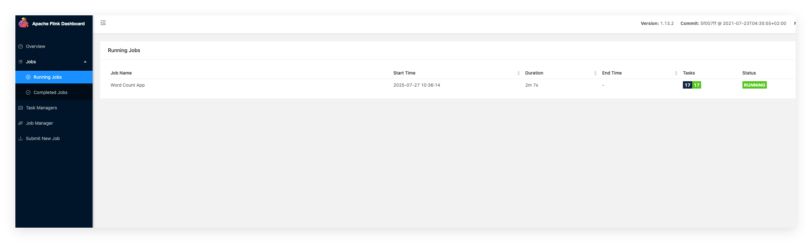
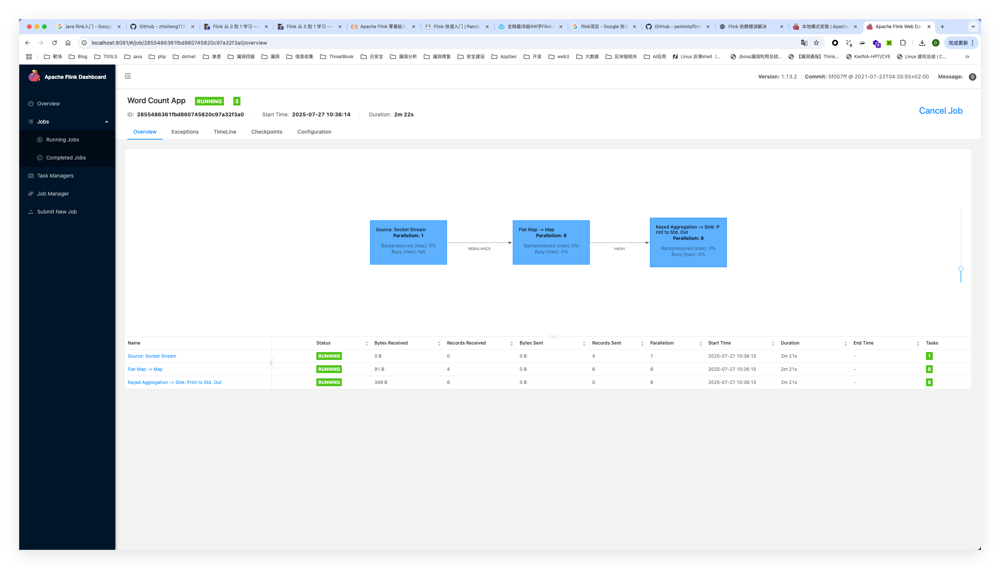

# 前言

很早之前就想接触一下Flink，但是只是其漏洞的复现，然后Flink可以做到的事情其实有很多，当前很多告警机制都是在发生后才实现、

例如：所有的监控数据直接存在 ElasticSearch 中，然后我们告警是去 ElasticSearch 中搜索我们监控指标需要的数据，幸好 ElasticSearch 的搜索能力够强大。但是你有没有发现一个问题，就是所有的监控数据从采集、采集后的数据做一些 计算/转换/聚合、再通过 Kafka 消息队列、再存进 ElasticSearch 中，再而去 ElasticSearch 中查找我们的监控数据，然后做出告警策略。整个流程对监控来说看起来很按照常理，但是对于告警来说，如果中间某个环节出了问题，比如 Kafka 消息队列延迟、监控数据存到 ElasticSearch 中写入时间较长、都是存在延时的。也许是 30 秒、一分钟、或者更长，这样对于告警来说这无疑将导致告警的消息没有任何的意义。

所以最好的时候就是读Kafka队列的时候就对其进行计算，当遇到庞大的QPS时，python是算不过来的，这时候就需要用到Flink这种实时计算的框架。

# Flink

Apache Flink是一个分布式计算框架，能够对有界和无界的数据流进行高效的处理

- 有界数据：即批数据（离线数据），具有已定义的起止位置，属于静态数据集
- 无界数据：即流式数据（实时数据），无已定义的结束位置，属于动态数据集

## 特点和优势

- 支持Scala、Java API
- 支持流批一体
- 同时支持高吞吐、低延迟、高性能，相比与Spark，实时性更高，并且有状态计算，而Spark需要借助redis才能实现
- 支持事件时间和处理时间语义，基于事件时间语义能够针对无序事件提供精确、一致的结果；基于处理时间语义能够用在具有极低延迟需求的应用中，能够达到秒级甚至毫秒级处理结果
- 支持不同时间语义下的窗口编程
- 支持具有 Backpressure 功能的持续流模型
- 提供精确一次（exactly once）的状态一致性保障
- Flink 在 JVM 内部实现了自己的内存管理
- 基于轻量级的分布式快照 Checkpoint 的容错
- 支持 Savepoint 机制，手工触发，适用于升级
- 支持高可用性配置（无单点失效），与 k8s、Yarn、Apache Mesos 紧密集成
- 提供常见存储系统的连接器：Kafka，Elasticsearch 等
- 提供详细、可自由定制的系统及应用指标（metrics）集合，用于提前定位和响应问题

## Flink API

- **Stateful Stream Processing** 最低级的抽象接口是状态化的数据流接口（stateful streaming）。这个接口是通过 ProcessFunction 集成到 DataStream API 中的。该接口允许用户自由的处理来自一个或多个流中的事件，并使用一致的容错状态。另外，用户也可以通过注册 event time 和 processing time 处理回调函数的方法来实现复杂的计算。
- **DataStream/DataSet API** DataStream / DataSet API 是 Flink 提供的核心 API ，DataSet 处理有界的数据集，DataStream 处理有界或者无界的数据流。用户可以通过各种方法（map / flatmap / window / keyby / sum / max / min / avg / join 等）将数据进行转换 / 计算。
- **Table API**  Table API 提供了例如 select、project、join、group-by、aggregate 等操作，使用起来却更加简洁，可以在表与 DataStream/DataSet 之间无缝切换，也允许程序将 Table API 与 DataStream 以及 DataSet 混合使用。
- **SQL** Flink 提供的最高层级的抽象是 SQL，这一层抽象在语法与表达能力上与 Table API 类似，SQL 抽象与 Table API 交互密切，同时 SQL 查询可以直接在 Table API 定义的表上执行。

## 基本架构

下图是官方的架构图




Flink系统架构中包含了两个角色，分别是JobManager和TaskManager，是一个典型的Master-Slave架构。JobManager相当于是Master，TaskManager相当于是Slave。

在Flink中，JobManager负责整个Flink集群任务的调度以及资源的管理。它从客户端（Flink Client）中获取提交的应用，然后根据集群中TaskManager上TaskSlot的使用情况，为提交的应用分配相应的TaskSlot资源并命令TaskManager启动从客户端中获取的应用。

TaskManager负责执行作业流的Task，并且缓存和交换数据流。在TaskManager中资源调度的最小单位是Task slot。TaskManager中Task slot的数量表示并发处理Task的数量。**一台机器节点可以运行多个TaskManager** 。

**TaskManager会向JobManager发送心跳保持连接**。

## 提交作业流程

在 Flink 中，可以通过以下 3 种方式执行应用程序：

- Session Mode
- Per-Job Mode
- Application Mode



**Session、Per-Job和Application**是Flink在YARN和Kubernetes上运行时的三种不同模式，它们不是独立的部署模式，而是在YARN和Kubernetes部署模式下的子模式。

- Session模式：在Session模式下，Flink集群会一直运行，用户可以在同一个Flink集群中提交多个作业。Session模式的优点是作业提交快，缺点是作业之间可能会相互影响。
- Per-Job模式：在Per-Job模式下，每个作业都会启动一个独立的Flink集群。Per-Job模式的优点是作业之间相互隔离，缺点是作业提交慢。
- Application模式：Application模式是在Flink 1.11版本中引入的一种新模式，它结合了Session模式和Per-Job模式的优点。在Application模式下，每个作业都会启动一个独立的Flink集群，但是作业提交快。

这三种模式都可以在YARN和Kubernetes部署模式下使用。

### Session Mode

Session Mode 是预分配资源的，也就是提前根据指定的资源参数初始化一个 Flink 集群，拥有固定数量的 JobManager 和 TaskManager。（JobManager 只有一个）

这样做的好处是，提交的作业可以直接执行，无需花费额外的开销去启动集群。相应地，Session Mode 的弊端也很明显。如果 TaskManager 因某个作业崩溃了，那么该 TaskManager 上运行的所有作业都会受到故障的影响。除了对相关作业产生负面影响外，这还意味着潜在的大规模恢复过程。此外，只有一个集群也意味着 JobManager 的负载大大增加，这是具有一定风险的。

**提交作业流程：**

- 用户启动Flink会话，连接到Flink集群
- 用户使用CLI或者Web UI提交作业，提交到作业会发送到Flink集群的JobManager
- JobManager接收到作业后，会对作业进行解析和编译，生成作业图
- 生成的作业图被发送到JobManager的调度器进行调度
- 调度器将作业图划分为任务并将其分配给TaskManager执行
- TaskManager 在其本地执行环境中运行任务
- Session Mode下，Flink运行在交互式会话中，允许用户在一个Flink集群上连续地提交和管理多个作业
- 用户可以通过 Flink 命令行界面（CLI）或 Web UI 进行交互

### Pre-Job Mode

Per-Job Mode 可以基于资源协调框架（如 YARN、k8s）为每个提交的作业启动专属的 Flink 集群。这提供了更好的资源隔离保证，当作业完成后，集群将被关闭，所有附属的资源也会被清除。

这样的好处是，一个作业的 TaskManager 失败不会影响其他作业的运行，且 JobManager 的负载是分散开来的，不存在单点问题。当然，缺点也很明显，为每个作业启动一个集群会消耗更多的集群资源，同时也会导致一定程度的延时。

**提交作业流程：**

- 用户准备好作业程序和所需的配置文件
- 用户使用Flink提供的命令行工具或编程API将作业程序和配置文件打包成一个作业JAR文件
- 用户将作业JAR文件上传到Flink集群所在的环境（例如Hadoop的分布式文件系统）
- 用户使用Flink提供的命令行工具或者API在指定的Flink集群上提交作业
- JobManager接收应用程序JAR文件并进行解析、编译和调度
- 调度器将作业图划分为任务并将其分配给可用的TaskManager执行
- TaskManager在其本地环境中运行任务
- 在Per-Job模式下，每个作业都会启动一个独立的Flink进群，用于执行该作业
- 这种模式适用于独立的批处理或流处理作业，不需要与其他作业共享资源。

### Application Mode

在 Per-Job Mode 和 Session Mode 下，应用程序的 `main` 方法都是在客户端执行的，此过程包括：

- 在本地下载应用程序依赖项
- 提取 Flink 运行时可以理解的应用程序表示形式（即 JobGraph）
- 将依赖项和 JobGraph 传输到 Flink 集群

这导致客户端需要消耗非常多的资源，因为它可能需要大量的网络带宽来下载依赖项并将二进制文件传输到集群，并且需要 CPU 资源来执行 `main` 方法。当有多用户共享客户端时，这个问题将更加明显。

为解决 Per-Job Mode 和 Session Mode 存在的这个缺陷，Application Mode 在 Per-Job Mode 的基础上，将应用程序的 `main` 方法转移到 JobManager 上执行。通过这种体系结构，Application Mode 提供了与 Per-Job Mode 相同的资源隔离和负载平衡保证，同时也解决了客户端负载过多的问题。

与 Per-Job Mode 相比，Application Mode 允许提交包含多个作业的应用程序。作业的执行顺序不受部署模式影响，但受启动作业调用位置的影响。使用 `execute` 会导致“下一个”作业的执行被推迟到“该”作业完成为止，使用非阻塞的 `executeAsync()` 可以使“下一个”作业在“此”作业完成之前就开始。

**提交作业流程：**

- 用户准备好应用程序和所需的配置文件
- 用户使用Flink提供的命令行工具或API将应用程序和配置文件打包成一个应用程序JAR文件
- 用户将应用程序JAR文件上传到Flink集群所在的环境
- 用户使用Flink提供的命令行工具或API在指定的Flink集群上提交应用程序
- JobManager接收应用JAR文件并进行解析、编译和调度
- 调度器将应用程序图划分为任务并将其分配给可用的TaskManager执行
- TaskManager 在其本地执行环境中运行任务。
- Application 模式是 Flink 1.11 版本引入的一种模式，用于在常驻的 Flink 集群上执行多个应用程序。
- 在 Application 模式下，用户可以在运行中的 Flink 集群上动态提交、更新和停止应用程序。

## 环境搭建

Flink支持多种部署模式，包括本地模式、Standalone模式、YARN模式、Mesos模式和Kubernetes模式。

- 本地模式：本地模式是在单个JVM中启动Flink，主要用于开发和测试。它不需要任何集群管理器，但也不能跨多台机器运行。本地模式的优点是部署简单，缺点是不能利用分布式计算的优势。
- Standalone模式：Standalone模式是在一个独立的集群中运行Flink。它需要手动启动Flink集群，并且需要手动管理资源。Standalone模式的优点是部署简单，可以跨多台机器运行，缺点是需要手动管理资源。
- YARN模式：YARN模式是在Hadoop YARN集群中运行Flink。它可以利用YARN进行资源管理和调度。YARN模式的优点是可以利用现有的Hadoop集群，缺点是需要安装和配置Hadoop YARN，**这是在企业中使用最多的方式**。
- Mesos模式：Mesos模式是在Apache Mesos集群中运行Flink。它可以利用Mesos进行资源管理和调度。Mesos模式的优点是可以利用现有的Mesos集群，缺点是需要安装和配置Mesos。
- Kubernetes模式：Kubernetes模式是在Kubernetes集群中运行Flink。它可以利用Kubernetes进行资源管理和调度。Kubernetes模式的优点是可以利用现有的Kubernetes集群，缺点是需要安装和配置Kubernetes。

### 部署开发环境

```xml
<properties>
        <maven.compiler.source>8</maven.compiler.source>
        <maven.compiler.target>8</maven.compiler.target>
        <project.build.sourceEncoding>UTF-8</project.build.sourceEncoding>
        <scala.binary.version>2.11</scala.binary.version>
        <flink.version>1.13.2</flink.version>
    </properties>

    <dependencies>
        <dependency>
            <groupId>org.apache.flink</groupId>
            <artifactId>flink-streaming-java_${scala.binary.version}</artifactId>
            <version>${flink.version}</version>
        </dependency>
        <dependency>
            <groupId>org.apache.flink</groupId>
            <artifactId>flink-clients_${scala.binary.version}</artifactId>
            <version>${flink.version}</version>
        </dependency>
        <dependency>
            <groupId>org.apache.flink</groupId>
            <artifactId>flink-runtime-web_${scala.binary.version}</artifactId>
            <version>${flink.version}</version>
        </dependency>
    </dependencies>
```

**注意：**

- 如果要将程序打包提交到集群运行，打包的时候不需要包含这些依赖，因为集群环境已经包含了这些依赖，此时依赖的作用域应该设置为provided。
- Flink 应用在 IntelliJ IDEA 中运行，这些 Flink 核心依赖的作用域需要设置为 compile 而不是 provided 。 否则 IntelliJ 不会添加这些依赖到 classpath，会导致应用运行时抛出 `NoClassDefFountError` 异常。

添加打包插件

```
<build>
    <plugins>
        <plugin>
            <groupId>org.apache.maven.plugins</groupId>
            <artifactId>maven-shade-plugin</artifactId>
            <version>3.1.1</version>
            <executions>
                <execution>
                    <phase>package</phase>
                    <goals>
                        <goal>shade</goal>
                    </goals>
                    <configuration>
                        <artifactSet>
                            <excludes>
                                <exclude>com.google.code.findbugs:jsr305</exclude>
                                <exclude>org.slf4j:*</exclude>
                                <exclude>log4j:*</exclude>
                            </excludes>
                        </artifactSet>
                        <filters>
                            <filter>
                                <!--不要拷贝 META-INF 目录下的签名，
                                否则会引起 SecurityExceptions 。 -->
                                <artifact>*:*</artifact>
                                <excludes>
                                    <exclude>META-INF/*.SF</exclude>
                                    <exclude>META-INF/*.DSA</exclude>
                                    <exclude>META-INF/*.RSA</exclude>
                                </excludes>
                            </filter>
                        </filters>
                        <transformers>
                            <transformer implementation="org.apache.maven.plugins.shade.resource.ManifestResourceTransformer">
                                <mainClass>my.programs.main.clazz</mainClass>
                            </transformer>
                        </transformers>
                    </configuration>
                </execution>
            </executions>
        </plugin>
    </plugins>
</build>
```

### 示例

#### 本地

```
package com.example.dataStream;

import org.apache.flink.api.common.functions.FlatMapFunction;
import org.apache.flink.api.common.functions.MapFunction;
import org.apache.flink.api.java.functions.KeySelector;
import org.apache.flink.api.java.tuple.Tuple2;
import org.apache.flink.streaming.api.datastream.DataStream;
import org.apache.flink.streaming.api.environment.StreamExecutionEnvironment;
import org.apache.flink.util.Collector;

public class WordCountApp {

    public static void main(String[] args) throws Exception {

        // 初始化执行环境
        StreamExecutionEnvironment env = StreamExecutionEnvironment.getExecutionEnvironment();

        // 使用内存数据作为数据源
        DataStream<String> source = env.fromElements(
                "hello flink",
                "flink is great",
                "hello hello",
                "flink flink flink"
        );

        // 转换处理
        source.flatMap(new FlatMapFunction<String, String>() {
            @Override
            public void flatMap(String value, Collector<String> out) {
                for (String word : value.split("\\s+")) {
                    out.collect(word.trim());
                }
            }
        }).map(new MapFunction<String, Tuple2<String, Integer>>() {
            @Override
            public Tuple2<String, Integer> map(String value) {
                return new Tuple2<>(value, 1);
            }
        }).keyBy(new KeySelector<Tuple2<String, Integer>, String>() {
            @Override
            public String getKey(Tuple2<String, Integer> value) {
                return value.f0;
            }
        }).sum(1).print();

        // 启动任务
        env.execute("Word Count Without Socket");
    }
}
```



#### Web UI

直接去官网下载二进制文件

修改`bin/config.sh`文件，为`DEFAULT_ENV_PID_DIR`指定为新建的路径，这是因为`Flink`启动时会把启动的进程`ID`存到一个文件中，默认是`/tmp`下，由于是临时目录，会被系统清理，存放的进程`ID`会找不到，从而导致无法关闭集群



通过`./bin/start-cluster.sh` 启动



访问8081端口



将上面代码改为Web UI方式，在此之前，停掉之前搭建的Web UI，下面代码自己会启动一个Web UI如果不停掉，8081占用后就会用另外的端口

```
package com.example.dataStream.WebUI;

import org.apache.flink.api.common.functions.FlatMapFunction;
import org.apache.flink.api.common.functions.MapFunction;
import org.apache.flink.api.java.functions.KeySelector;
import org.apache.flink.api.java.tuple.Tuple2;
import org.apache.flink.configuration.Configuration;
import org.apache.flink.configuration.RestOptions;
import org.apache.flink.streaming.api.datastream.DataStreamSource;
import org.apache.flink.streaming.api.environment.StreamExecutionEnvironment;
import org.apache.flink.util.Collector;

public class WordCountApp {

    public static void main(String[] args) throws Exception {

        // 使用本地模式并开启 WebUI
        Configuration conf = new Configuration();
        conf.setString(RestOptions.BIND_PORT, "8081-8089");
        StreamExecutionEnvironment env = StreamExecutionEnvironment.createLocalEnvironmentWithWebUI(conf);

        // 定义数据源：source
        DataStreamSource<String> source = env.socketTextStream("localhost", 9999);

        // 业务处理：transformation
        source.flatMap(new FlatMapFunction<String, String>() {
            @Override
            public void flatMap(String value, Collector<String> collector) throws Exception {
                String[] words = value.split(",");
                for (String word : words) {
                    collector.collect(word.trim());
                }
            }
        }).map(new MapFunction<String, Tuple2<String, Integer>>() {
            @Override
            public Tuple2<String, Integer> map(String value) throws Exception {
                return new Tuple2<>(value, 1);
            }
        }).keyBy(new KeySelector<Tuple2<String, Integer>, String>() {
            @Override
            public String getKey(Tuple2<String, Integer> value) throws Exception {
                return value.f0;
            }
        }).sum(1).print();

        // 执行
        env.execute("Word Count App");

    }
}
```

先用nc开一个端口

```
nc -lk 9999
```

运行程序后就可以在nc监听输入，可以在命令行看到结果



Web UI也可以看到Running Task对应作业的详细执行信息






参考链接：

https://cloud.tencent.com/developer/article/2343983

https://magicpenta.github.io/docs/flink/Flink%20%E5%BF%AB%E9%80%9F%E5%85%A5%E9%97%A8/

https://nightlies.apache.org/flink/flink-docs-release-1.16/zh/docs/try-flink/local_installation/