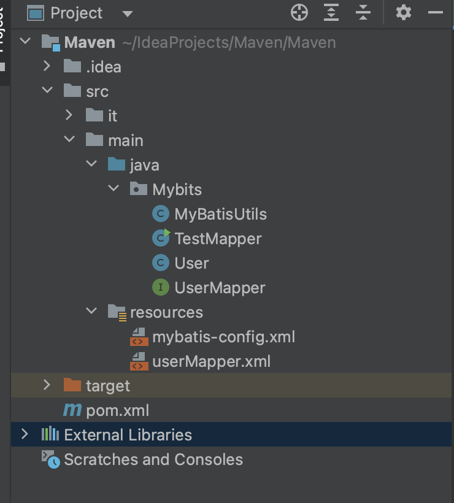
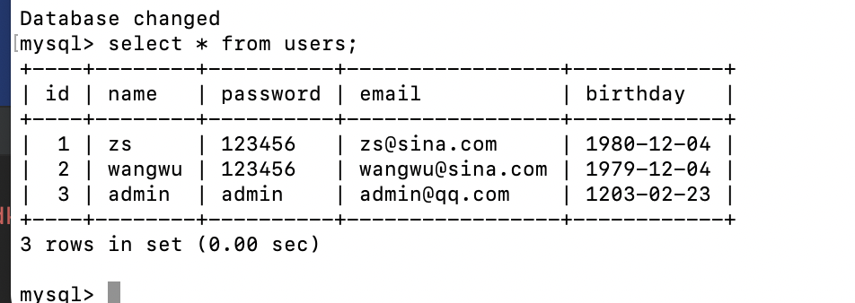
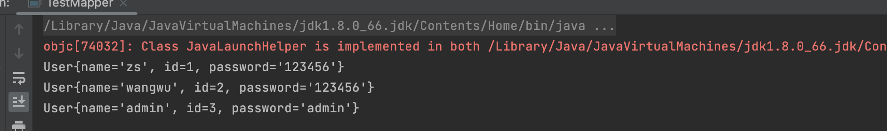
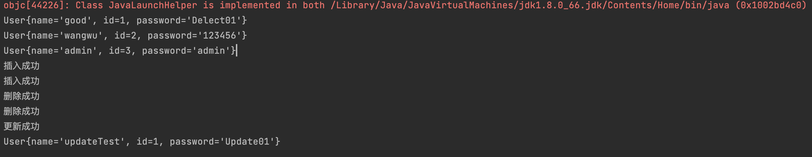
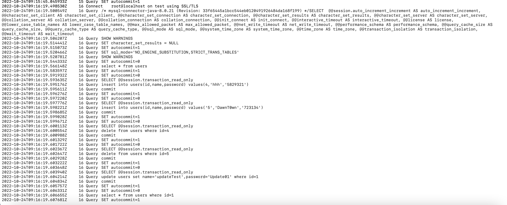
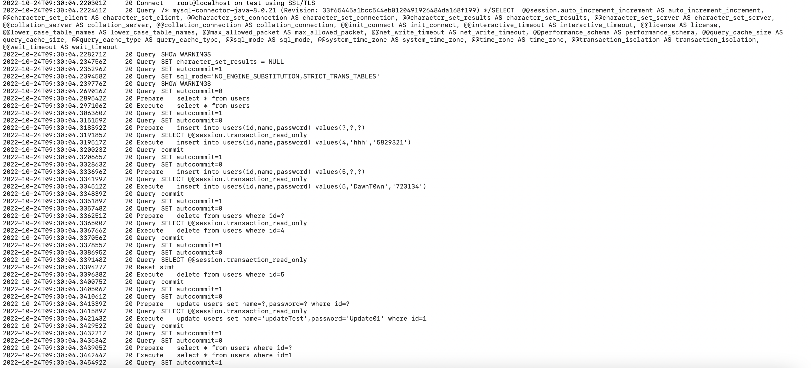
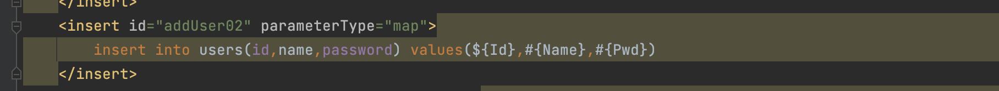

在学习java的sql注入之前，先来了解一下mybits框架

# 什么是Mybits

MyBatis 是一款优秀的持久层框架;

它支持自定义 SQL、存储过程以及高级映射。

 MyBatis 免除了几乎所有的 JDBC 代码以及设置参数和获取结果集的工作。MyBatis 可以通过简单的 XML 或注解来配置和映射原始类型、接口和 Java POJO（Plain Old Java Objects，普通老式 Java 对象）为数据库中的记录。


# 为什么需要Mybatis

方便

传统的JDBC代码太复杂，简化，框架，自动化。

帮助程序员将数据存入数据库中。

更容易上手。技术没有高低之分。

优点：

- 简单易学

- 灵活
- sql和代码的分离，提高了可维护性。
- 提供映射标签，支持对象与数据库的orm字段关系映射。
- 提供对象关系映射标签，支持对象关系组建维护。
- 提供xml标签，支持编写动态sql。


# 第一个Mybatis程序

## 环境搭建

创建一个maven项目，导入如下依赖

```xml
<dependency>
    <groupId>junit</groupId>
    <artifactId>junit</artifactId>
    <version>4.11</version>
    <scope>test</scope>
</dependency>
<!-- https://mvnrepository.com/artifact/mysql/mysql-connector-java -->
<dependency>
    <groupId>mysql</groupId>
    <artifactId>mysql-connector-java</artifactId>
    <version>8.0.21</version>
</dependency>
<!-- https://mvnrepository.com/artifact/org.mybatis/mybatis -->
<dependency>
    <groupId>org.mybatis</groupId>
    <artifactId>mybatis</artifactId>
    <version>3.5.2</version>
</dependency>
```

## 编写程序

项目结构



Mybatis-config.xml

```
<?xml version="1.0" encoding="UTF-8"?>

<!DOCTYPE configuration
        PUBLIC "-//mybatis.org//DTD Config 3.0//EN"
        "http://mybatis.org/dtd/mybatis-3-config.dtd">

<configuration>
    <!--配置环境，这里可以有多套环境 default代表默认的是那一套-->
    <environments default="development">
        <!--配置一套环境 id .环境的名字-->
        <environment id="development">
            <!--transactionManager:事务管理，type:jdbc-->
            <transactionManager type="JDBC"/>
            <!--dataSource 数据源-->
            <dataSource type="POOLED">
                <property name="driver" value="com.mysql.cj.jdbc.Driver"/>
                <!--xml中不允许&符号直接出现，我们需要使用 &amp; 代替-->
                <property name="url" value="jdbc:mysql://localhost:3306/test?useSSL=true&amp;useUnicode=true&amp;charsetEncoding=UTF-8"/>
                <property name="username" value="root"/>
                <property name="password" value="root"/>
            </dataSource>
        </environment>
    </environments>
    <mappers>
        <mapper resource="userMapper.xml"/>
    </mappers>
</configuration>
```

userMapper.xml

```
<?xml version="1.0" encoding="UTF-8" ?>
<!DOCTYPE mapper
        PUBLIC "-//mybatis.org//DTD Mapper 3.0//EN"
        "http://mybatis.org/dtd/mybatis-3-mapper.dtd">

<!--mapper标签的namespace对应Mapper接口的类-->
<mapper namespace="Mybits.UserMapper">
    <!--select标签的id对应映射接口的方法名字  resultType:返回结果的类型  中间就编写sql语句-->
    <select id="selectUser" resultType="Mybits.User">
        select * from users;
    </select>
</mapper>
```

namespace中的包名要和Mapper接口的包名一致

select

选择，查询语句；

- id：就是对应的namespace中的方法名；
- resultType : Sql语句执行的返回值；
- parameterType : 参数类型；


**User.java**

里面参数的名字与数据库列名相同



```
package Mybatis;

public class User {
    private String name;
    private int id;
    private String password;

    public User() {
    }

    public User(String name, int id, String password) {
        this.name = name;
        this.id = id;
        this.password = password;
    }

    public String getName() {
        return name;
    }

    public int getId() {
        return id;
    }

    public String getPassword() {
        return password;
    }

    @Override
    public String toString() {
        return "User{" +
                "name='" + name + '\'' +
                ", id=" + id +
                ", password='" + password + '\'' +
                '}';
    }
}

```

MyBatisUtils.java

```
package Mybatis;

import org.apache.ibatis.io.Resources;
import org.apache.ibatis.session.SqlSessionFactory;
import org.apache.ibatis.session.SqlSessionFactoryBuilder;

import java.io.IOException;
import java.io.InputStream;

//mybatis的工具类，重复的代码
public class MyBatisUtils {

    //类变量不需要设置默认值；
    private static SqlSessionFactory sqlSessionFactory;
    static {
        //在maven中，所有的资源文件一般都放在resources目录下，我们可以直接拿到。
        try {
            String resource = "mybatis-config.xml";
            InputStream inputStream = Resources.getResourceAsStream(resource);
            sqlSessionFactory = new SqlSessionFactoryBuilder().build(inputStream);
        } catch (IOException e) {
            e.printStackTrace();
        }
    }

    //设置SqlSessionFactory公共的方法
    public static SqlSessionFactory getSqlSessionFactory(){
        return sqlSessionFactory;
    }
}

```

UserMapper.java

```
package Mybatis;

import java.util.List;

public interface UserMapper {
    List<User> selectUser();
}

```

TestMapper.java

```
package Mybatis;

import org.apache.ibatis.session.SqlSession;
import org.apache.ibatis.session.SqlSessionFactory;

import java.util.List;

public class TestMapper {
    public static void main(String[] args) throws Exception{
        //1.拿到sqlSessionFactory对象
        SqlSessionFactory sqlSessionFactory = MyBatisUtils.getSqlSessionFactory();
        //2.通过sqlSessionFactory对象openSession()创建一个sqlSession。
        SqlSession sqlSession = sqlSessionFactory.openSession();
        //3.通过sqlSession获得mapper对象 ， 参数为映射文件对应的接口类的class对象
//        UserMapper mapper = sqlSession.getMapper(UserMapper.class);
//        //4.通过mapper对象来执行操作；
//        List<User> users = mapper.selectUser();
        List<User> users = sqlSession.selectList("Mybatis.UserMapper.selectUser");
        //获得结果集
        for (User user : users) {
            System.out.println(user);
        }
    }
}

```

两种方法调用，个人喜欢第一种

```
第一种
UserMapper mapper = sqlSession.getMapper(UserMapper.class);
List<User> users = mapper.selectUser();		#	相当于直接去调用这个借口的这个方法

第二种
List<User> users = sqlSession.selectList("Mybatis.UserMapper.selectUser")
```



虽然看起来比JDBC麻烦，但是在后期的使用上远比JDBC方便

## 增删改需要提交事务

在执行增删改的操作的时候，需要加上一下语句

```
sqlSession.commit()；
```

# 多个sql语句，多个参数执行

当我们只执行一个sql语句的时候，可能看不出来使用框架的好处，接下来尝试看看多个sql语句执行的时候，并且带上多个参数，使用框架应该怎么去实现

当我们的实体类，或者数据库中的表，字段或者参数过多，我们应该考虑使用Map

因为在map中，参数是以键值对的形式存储的，我们可以通过put来实现对相应参数的赋值

修改一下UserMapper

```
package Mybatis;

import java.util.List;
import java.util.Map;

public interface UserMapper {
    public List<User> getUserList();
    public int addUser(User user);
    public int addUser02(Map<String,Object> map);
    public int deleteUserById(int id);
    public int updateUser(User user);
    public User getUserById(int id);
}
```

在XML中去实现对接口方法对访问

```
<?xml version="1.0" encoding="UTF-8" ?>
<!DOCTYPE mapper
        PUBLIC "-//mybatis.org//DTD Mapper 3.0//EN"
        "http://mybatis.org/dtd/mybatis-3-mapper.dtd">

<!--mapper标签的namespace对应Mapper接口的类-->
<mapper namespace="Mybatis.UserMapper">
    <!--select标签的id对应映射接口的方法名字  resultType:返回结果的类型  中间就编写sql语句-->
    <select id="selectUser" resultType="Mybatis.User">
        select * from users;
    </select>
    <insert id="addUser" parameterType="Mybatis.User">
        insert into users(id,name,password) values(#{id},#{name},#{password})
    </insert>
    <insert id="addUser02" parameterType="map">
        insert into users(id,name,password) values(#{Id},#{Name},#{Pwd})
    </insert>
    <delete id="deleteUserById" parameterType="int">
        delete from users where id=#{id}
    </delete>
    <update id="updateUser" parameterType="Mybatis.User">
        update users set name=#{name},password=#{password} where id=#{id}
    </update>
    <select id="getUserById" parameterType="int" resultType="Mybatis.User">
        select * from users where id=#{id}
    </select>
</mapper>

```

关于UserMapper的参数，一定要和参数名相同，而且select的东西，需要和数据库的列名一样才能get到

TestMapper

```
package Mybatis;

import org.apache.ibatis.session.SqlSession;
import org.apache.ibatis.session.SqlSessionFactory;

import java.util.HashMap;
import java.util.List;
import java.util.Map;

public class TestMapper {
    public static void main(String[] args) throws Exception{
        selectUser();
        addUser();
        addUser02();
        deleteUserById(4);
        deleteUserById(5);
        updateUser();
        getUserById();
    }
    public static void selectUser(){
        SqlSessionFactory sqlSessionFactory = MyBatisUtils.getSqlSessionFactory();
        SqlSession sqlSession = sqlSessionFactory.openSession();
        List<User> users = sqlSession.selectList("Mybatis.UserMapper.selectUser");
        //获得结果集
        for (User user : users) {
            System.out.println(user);
        }
        sqlSession.close();
    }
    public static void addUser(){
        SqlSessionFactory sqlSessionFactory = MyBatisUtils.getSqlSessionFactory();
        SqlSession sqlSession = sqlSessionFactory.openSession();
        UserMapper userMapper = sqlSession.getMapper(UserMapper.class);
        int flag = userMapper.addUser(new User(4,"hhh","5829321"));
        if(flag>0){
            System.out.println("插入成功");
        }
        else {
            System.out.println("插入失败");
        }
        sqlSession.commit();
        sqlSession.close();
    }
    public static void addUser02(){
        SqlSessionFactory sqlSessionFactory = MyBatisUtils.getSqlSessionFactory();
        SqlSession sqlSession = sqlSessionFactory.openSession();
        UserMapper userMapper = sqlSession.getMapper(UserMapper.class);
        Map<String,Object> map = new HashMap<String, Object>();
        map.put("Id","5");
        map.put("Name","DawnT0wn");
        map.put("Pwd","723134");
        int flag = userMapper.addUser02(map);
        if(flag>0){
            System.out.println("插入成功");
        }
        else {
            System.out.println("插入失败");
        }
        sqlSession.commit();
        sqlSession.close();
    }
    public static void deleteUserById(int id){
        SqlSessionFactory sqlSessionFactory = MyBatisUtils.getSqlSessionFactory();
        SqlSession sqlSession = sqlSessionFactory.openSession();
        UserMapper userMapper = sqlSession.getMapper(UserMapper.class);
        int flag = userMapper.deleteUserById(id);
        if(flag>0){
            System.out.println("删除成功");
        }
        else {
            System.out.println("删除失败");
        }
        sqlSession.commit();
        sqlSession.close();
    }
    public static void updateUser(){
        SqlSessionFactory sqlSessionFactory = MyBatisUtils.getSqlSessionFactory();
        SqlSession sqlSession = sqlSessionFactory.openSession();
        UserMapper userMapper = sqlSession.getMapper(UserMapper.class);
        int flag = userMapper.updateUser(new User(1,"updateTest","Update01"));
        if(flag>0){
            System.out.println("更新成功");
        }
        else {
            System.out.println("更新失败");
        }
        sqlSession.commit();
        sqlSession.close();
    }
    public static void getUserById(){
        SqlSessionFactory sqlSessionFactory = MyBatisUtils.getSqlSessionFactory();
        SqlSession sqlSession = sqlSessionFactory.openSession();
        UserMapper userMapper = sqlSession.getMapper(UserMapper.class);
        User user = userMapper.getUserById(1);
        System.out.println(user);
        sqlSession.close();
    }
}

```



日志记录



# 预编译

在mybatis的XML配置文件中，我们看到了#{}这样的写法，其实mybatis还支持${}这种写法，可以看到这些写法都是把参数带入sql语句中，不过直接执行的话看起来没有什么区别，不过这个占位的写法和预编译很像

既然是支持sql的，那就支持预编译，而mybatis毕竟是一个框架，他的占位就是通过#{}和${}来实现的

修改一下mybatis-config.xml中连接jdbc的url，开启预编译和预编译缓存，因为mybatis底层也是通过JDBC的preparestatement实现的

```
useServerPrepStmts=true

cachePrepStmts=true
```

注意xml文档中不支持&，需要用`&amp;`替代

```
<property name="url" value="jdbc:mysql://localhost:3306/test?useSSL=true&amp;useUnicode=true&amp;cachePrepStmts=true&amp;useServerPrepStmts=true&amp;charsetEncoding=UTF-8"/>
```



我把userMapper.xml改了一个，把这里的Id用${}包裹起来的



从日志记录可以看出来，这里用${}和#{}都进行预编译了，但是${}的预编译是把参数带入进去的，而不是利用占位符?，很明显这中方式是不安全的，所以我们如果需要预编译的话，需要用#{}去占位，而且要开启预编译设置


这次就注意了解一下Mybatis怎么写的，具体的深入等后续需要再说吧


参考链接

https://blog.csdn.net/weixin_41066584/article/details/111565571