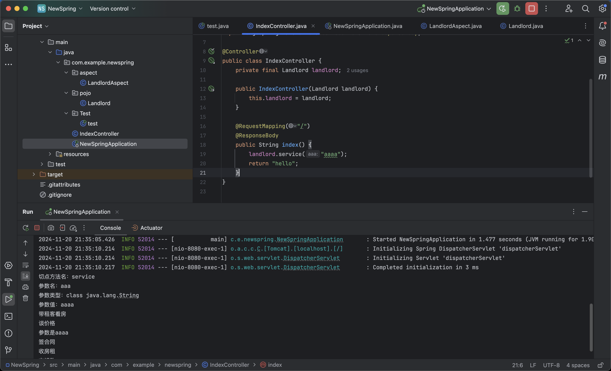

# 什么是AOP

> AOP 即 Aspect Oriented Program 面向切面编程
>
> 首先，在面向切面编程的思想里面，把功能分为核心业务功能，和周边功能。
>
> - **所谓的核心业务**，比如登陆，增加数据，删除数据都叫核心业务
> - **所谓的周边功能**，比如性能统计，日志，事务管理等等
>
> 周边功能在 Spring 的面向切面编程AOP思想里，即被定义为切面
>
> 在面向切面编程AOP的思想里面，核心业务功能和切面功能分别独立进行开发，然后把切面功能和核心业务功能 "编织" 在一起，这就叫AOP
>
> AOP能够将那些与业务无关，**却为业务模块所共同调用的逻辑或责任（例如事务处理、日志管理、权限控制等）封装起来**，便于**减少系统的重复代码**，**降低模块间的耦合度**，并**有利于未来的可拓展性和可维护性**。
>
> AOP 当中的概念：
>
> - 切入点（Pointcut） 在哪些类，哪些方法上切入（**where**）
> - 通知（Advice） 在方法执行的什么实际（**when:**方法前/方法后/方法前后）做什么（**what:**增强的功能）
> - 切面（Aspect） 切面 = 切入点 + 通知，通俗点就是：**在什么时机，什么地方，做什么增强！**
> - 织入（Weaving） 把切面加入到对象，并创建出代理对象的过程。（由 Spring 来完成）

# 环境搭建

```
<dependency>
    <groupId>org.springframework.boot</groupId>
    <artifactId>spring-boot-starter-aop</artifactId>
</dependency>
```

不是纯正的开发，主要是来学习这种方式的用法，通过代码来加深一下理解，基本上的内容来自https://github.com/wmyskxz/MoreThanJava/blob/master/java-web/spring/Spring%E5%AD%A6%E4%B9%A0-4-%E2%80%94%E2%80%94%E9%9D%A2%E5%90%91%E5%88%87%E9%9D%A2%E7%BC%96%E7%A8%8B-AOP%E6%A8%A1%E5%9D%97.md，自己主要是复现一遍加深理解

也可以用

```
<dependency>
	<groupId>org.springframework</groupId>
	<artifactId>spring-aop</artifactId>
	<version>5.0.11.RELEASE</version>
</dependency>

<dependency>
	<groupId>org.springframework</groupId>
	<artifactId>spring-aspects</artifactId>
	<version>5.0.11.RELEASE</version>
</dependency>

 <dependency>
	 <groupId>org.springframework</groupId>
	 <artifactId>spring-context</artifactId>
	 <version>5.0.11.RELEASE</version>
 </dependency>

```

# 代码

对于一个业务逻辑往往分为主逻辑和其他的功能，比如说日志记录等，用切面的方式就可以对业务逻辑实现解耦

定义Landlord类

```
package com.example.newspring.pojo;

import org.springframework.stereotype.Component;

@Component("landlord")
public class Landlord {

    public void service() {
        // 仅仅只是实现了核心的业务功能
        System.out.println("签合同");
        System.out.println("收房租");
    }
}
```

定义切面类

```
package com.example.newspring.aspect;

import org.aspectj.lang.annotation.After;
import org.aspectj.lang.annotation.Aspect;
import org.aspectj.lang.annotation.Before;
import org.springframework.stereotype.Component;

@Component
@Aspect
public class LandlordAspect {

    @Before("execution(* com.example.newspring.pojo.Landlord.service())")
    public void before(){
        System.out.println("带租客看房");
        System.out.println("谈价格");
    }

    @After("execution(* com.example.newspring.pojo.Landlord.* (..))")
    public void after(){
        System.out.println("交钥匙");
    }
}

```

被定义的切面是一个bean，需要用Component注解

为了启动spring，在 applicationContext.xml 中配置自动注入，并告诉 Spring IoC 容器去哪里扫描这两个 Bean

```
<?xml version="1.0" encoding="UTF-8"?>
<beans xmlns="http://www.springframework.org/schema/beans"
       xmlns:xsi="http://www.w3.org/2001/XMLSchema-instance"
       xmlns:context="http://www.springframework.org/schema/context"
       xmlns:aop="http://www.springframework.org/schema/aop"
       xsi:schemaLocation="http://www.springframework.org/schema/beans
       http://www.springframework.org/schema/beans/spring-beans.xsd http://www.springframework.org/schema/context http://www.springframework.org/schema/context/spring-context.xsd http://www.springframework.org/schema/aop http://www.springframework.org/schema/aop/spring-aop.xsd">

    <context:component-scan base-package="com.example.newspring.pojo" />
    <context:component-scan base-package="com.example.newspring.aspect" />

    <aop:aspectj-autoproxy/>
</beans>
```

直接运行即可

```
package com.example.newspring.Test;

import com.example.newspring.pojo.Landlord;
import org.springframework.context.ApplicationContext;
import org.springframework.context.support.ClassPathXmlApplicationContext;

public class test {
    public static void main(String[] args) {

        ApplicationContext context =
                new ClassPathXmlApplicationContext("applicationContext.xml");
        Landlord landlord = (Landlord) context.getBean("landlord", Landlord.class);
        landlord.service();

    }
}
```


可以发现打印的顺序是先执行了@Before注解下的内容，如何是service函数，接下来是@After的内容

有一点像我们在agent中hook方法，在前面增加执行的函数，这里通过定义切面，对于执行的函数前后增加逻辑

# 开发切面的注解

在前面，我们已经用@Aspect注解来定义了切面类，并且使用了@Before和@After注解来开发，其中会用到的注解

| 注解              | 说明                                                         |
| ----------------- | ------------------------------------------------------------ |
| `@Before`         | 前置通知，在连接点方法前调用                                 |
| `@Around`         | 环绕通知，它将覆盖原有方法，但是允许你通过反射调用原有方法，后面会讲 |
| `@After`          | 后置通知，在连接点方法后调用                                 |
| `@AfterReturning` | 返回通知，在连接点方法执行并正常返回后调用，要求连接点方法在执行过程中没有发生异常 |
| `@AfterThrowing`  | 异常通知，当连接点方法异常时调用                             |

所谓的连接点就是我们用在注解中定义的表达式execution(* pojo.Landlord.service())对应的方法，Spring 通过这个正则表达式判断具体要拦截的是哪一个类的哪一个方法

```
/**
     * 这里我们使用注解的形式
     * 当然，我们也可以通过切点表达式直接指定需要拦截的package,需要拦截的class 以及 method
     * 切点表达式:   execution(...)
          *
     * execution(public * *(..)) 任意的公共方法
     * execution（* set*（..）） 以set开头的所有的方法
     * execution（* com.LoggerApply.*（..））com.LoggerApply这个类里的所有的方法
     * execution（* com.annotation.*.*（..））com.annotation包下的所有的类的所有的方法
     * execution（* com.annotation..*.*（..））com.annotation包及子包下所有的类的所有的方法
     * execution(* com.annotation..*.*(String,?,Long)) com.annotation包及子包下所有的类的有三个参数，第一个参数为String类型，第二个参数为任意类型，第三个参数为Long类型的方法
     * execution(@annotation(com.lingyejun.annotation.Lingyejun))用Lingyejun注解标注的方法
		 */
```

但是如果每一个通知都需要去定义表达式又麻烦了，可以用`@Pointcut` 注解来定义一个切点来

```
package com.example.newspring.aspect;

import org.aspectj.lang.annotation.After;
import org.aspectj.lang.annotation.Aspect;
import org.aspectj.lang.annotation.Before;
import org.aspectj.lang.annotation.Pointcut;
import org.springframework.stereotype.Component;

@Component
@Aspect
public class LandlordAspect {

    @Pointcut("execution(* com.example.newspring.pojo.Landlord.service())")
    public void pointcut() {}

    @Before("pointcut()")
    public void before(){
        System.out.println("带租客看房");
        System.out.println("谈价格");
    }

    @After("pointcut()")
    public void after(){
        System.out.println("交钥匙");
    }
}
```

再运行


## 环绕通知

再来看一个注解@Aroun，先改造一下service方法

```
package com.example.newspring.pojo;

import org.springframework.stereotype.Component;

@Component("landlord")
public class Landlord {

    public void service(String aaa) {
        System.out.println("参数是" + aaa);
        // 仅仅只是实现了核心的业务功能
        System.out.println("签合同");
        System.out.println("收房租");
    }
}
```

把原来的before注解这些注释掉

```
package com.example.newspring.aspect;

import org.aspectj.lang.ProceedingJoinPoint;
import org.aspectj.lang.Signature;
import org.aspectj.lang.annotation.*;
import org.aspectj.lang.reflect.MethodSignature;
import org.springframework.stereotype.Component;

import java.lang.reflect.Method;
import java.lang.reflect.Parameter;

@Component
@Aspect
public class LandlordAspect {

    @Pointcut("execution(* com.example.newspring.pojo.Landlord.service(String))")
    public void pointcut() {}
//
//    @Before("pointcut()")
//    public void before(){
//        System.out.println("带租客看房");
//        System.out.println("谈价格");
//    }
//
//    @After("pointcut()")
//    public void after(){
//        System.out.println("交钥匙");
//    }

    @Around("pointcut()")
    public void around(ProceedingJoinPoint joinPoint) throws Throwable {
        MethodSignature signature = (MethodSignature) joinPoint.getSignature();
        System.out.println("切点方法名：" + signature.getName());
        // 获取参数信息
        Parameter[] parameters = signature.getMethod().getParameters();
        Object[] args = joinPoint.getArgs(); // 获取参数值
        for (int i = 0; i < parameters.length; i++) {
            System.out.println("参数名：" + parameters[i].getName());
            System.out.println("参数类型：" + parameters[i].getType());
            System.out.println("参数值：" + args[i]);
        }

        System.out.println("带租客看房");
        System.out.println("谈价格");

        try {
            joinPoint.proceed();
        } catch (Throwable throwable) {
            throwable.printStackTrace();
        }

        System.out.println("交钥匙");
    }
}
```

运行

```
package com.example.newspring.Test;

import com.example.newspring.pojo.Landlord;
import org.springframework.context.ApplicationContext;
import org.springframework.context.support.ClassPathXmlApplicationContext;

public class test {
    public static void main(String[] args) {

        ApplicationContext context =
                new ClassPathXmlApplicationContext("applicationContext.xml");
        Landlord landlord = (Landlord) context.getBean("landlord", Landlord.class);
        landlord.service("test");

    }
}
```


使用Spring触发

```
package com.example.newspring;

import com.example.newspring.pojo.Landlord;
import org.springframework.stereotype.Controller;
import org.springframework.web.bind.annotation.RequestMapping;
import org.springframework.web.bind.annotation.ResponseBody;

@Controller
public class IndexController {
    private final Landlord landlord;

    public IndexController(Landlord landlord) {
        this.landlord = landlord;
    }

    @RequestMapping("/")
    @ResponseBody
    public String index() {
        landlord.service("aaaa");
        return "hello";
    }
}
```



基于以上，常在代码中用到的是，定义一个注解， 在定义一个切面，切点就是这个注解，那么被注解的方法，就会走这个AOP逻辑，这样便于使用，不需要对每一个方法再去添加一个新的切点


当然，AOP肯定不止这么简单，因为我最近的需要是看代码，所以先记录一下这个的用法吧，AOP可以不通过注解实现，也可以通过xml实现


参考链接：

https://github.com/wmyskxz/MoreThanJava/blob/master/java-web/spring/Spring%E5%AD%A6%E4%B9%A0-4-%E2%80%94%E2%80%94%E9%9D%A2%E5%90%91%E5%88%87%E9%9D%A2%E7%BC%96%E7%A8%8B-AOP%E6%A8%A1%E5%9D%97.md

[SpringBoot中使用Aspect实现切面，超详细_aspect切面-CSDN博客](https://blog.csdn.net/DDDYSz/article/details/123378554)

https://pdai.tech/md/spring/spring-x-framework-aop.html