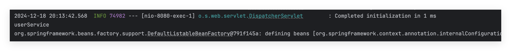
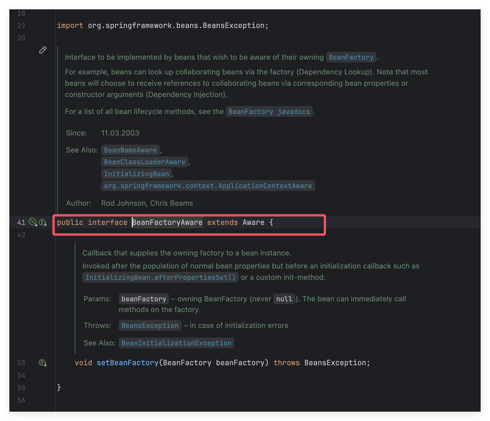

# 什么是Aware

Aware 接口是一个具有标识作用的超级接口，指示 bean 是具有被 Spring 容器通知的能力，通知的方式是采用回调的方式。Aware 接口是一个空接口，具体的实现由各个子接口决定，且该接口通常只**包含一个单个参数并且返回值为void的方法**。可以理解就是 set 方法。该方法的命名方式为 **set + 去掉接口名中的 Aware 后缀**，即 XxxAware 接口，则方法定义为 setXxx()，例如 BeanNameAware（setBeanName），ApplicationContextAware（setApplicationContext）。**注意，仅实现Aware接口，不会提供任何默认功能，需要明确的指定实现哪个子接口**

Spring 的 Aware 回调机制允许 Spring 容器中的 Bean 在初始化后获取容器的各种上下文信息。`Aware` 接口包含多个回调接口，例如 `ApplicationContextAware`、`BeanFactoryAware`、`EnvironmentAware` 等，允许你在 Bean 初始化时获取到相关的 Spring 容器信息

在Spring中自带了很多Aware接口

```
BeanFactoryAware,                //获取 IoC 容器 BeanFactory 的能力
ApplicationContextAware,         //获取 Spring 应用上下文 ApplicationContext 对象的能力
EnvironmentAware,                //获取 Environment 对象的能力
ResourceLoaderAware,             //获取资源加载器对象 ResourceLoader 的能力
BeanClassLoaderAware,            //获取加载当前 Bean Class 的 ClassLoader 的能力
BeanNameAware,                   //获取当前 Bean 名称的能力
MessageSourceAware,              //获取用于国际化 MessageSource 对象的能力
ApplicationEventPublisherAware,  //获取事件发布对象 ApplicationEventPublisher 的能力
EmbeddedValueResolverAware       //获取占位符处理对象 StringValueResolver 的能力
```

# 实现

当我们有如下一个bean，我希望获取它的beanName，当我的bean交给容器操作后，如果想操作beanName就需要单独地用@bean注解去取出来进行操作，但是我只希望这个值是我交给IOC的bean的beanName

```
package com.example.newspring.service;

import org.springframework.beans.factory.annotation.Autowired;
import org.springframework.stereotype.Component;

@Component("userService")
public class UserService {

    private String beanName;

    public void test(){
        System.out.println(beanName);
    }
}
```

显然上面的打印是有问题的，这个时候就可以借助Spring的Aware回调机制，先来修改一下UserService类，让它实现BeanFactoryAware和BeanNameAware，这两个Aware的作用分别是获取 IoC 容器 BeanFactory 的能力和获取当前 Bean 名称的能力，需要实现接口中对应的set方法

```
package com.example.newspring.service;

import org.springframework.beans.BeansException;
import org.springframework.beans.factory.BeanFactory;
import org.springframework.beans.factory.BeanFactoryAware;
import org.springframework.beans.factory.BeanNameAware;
import org.springframework.stereotype.Component;

@Component("userService")
public class UserService implements BeanNameAware, BeanFactoryAware {

    private String beanName;
    private BeanFactory beanFactory;

    @Override
    public void setBeanFactory(BeanFactory beanFactory) throws BeansException {
        this.beanFactory = beanFactory;
    }

    @Override
    public void setBeanName(String name) {
        this.beanName = name;
    }

    public void test(){
        System.out.println(beanName);//打印orderService属性
        System.out.println(beanFactory);
    }
}
```

再在Controller中注入这个bean到ioc中

```
package com.example.newspring;

import com.example.newspring.service.UserService;
import org.springframework.beans.factory.annotation.Autowired;
import org.springframework.stereotype.Controller;
import org.springframework.web.bind.annotation.RequestMapping;
import org.springframework.web.bind.annotation.ResponseBody;

@Controller
public class IndexController {

    @Autowired
    private UserService userService;

    @RequestMapping("/")
    @ResponseBody
    public String index() {
        userService.test();
        return "hello";
    }
}
```

访问根路由看看是否正常打印



打印了我的service，也就是Component到value值以及打印了对应的BeanFactory对象

这就是Aware回调机制，当然也可以写自己的Aware，只需要按照Spring给定的Aware也有实现Aware接口即可，写一个接口的setter方法




参考链接：

https://blog.csdn.net/meism5/article/details/114382513

https://developer.aliyun.com/article/1114610