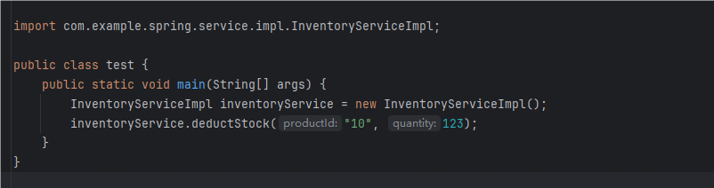
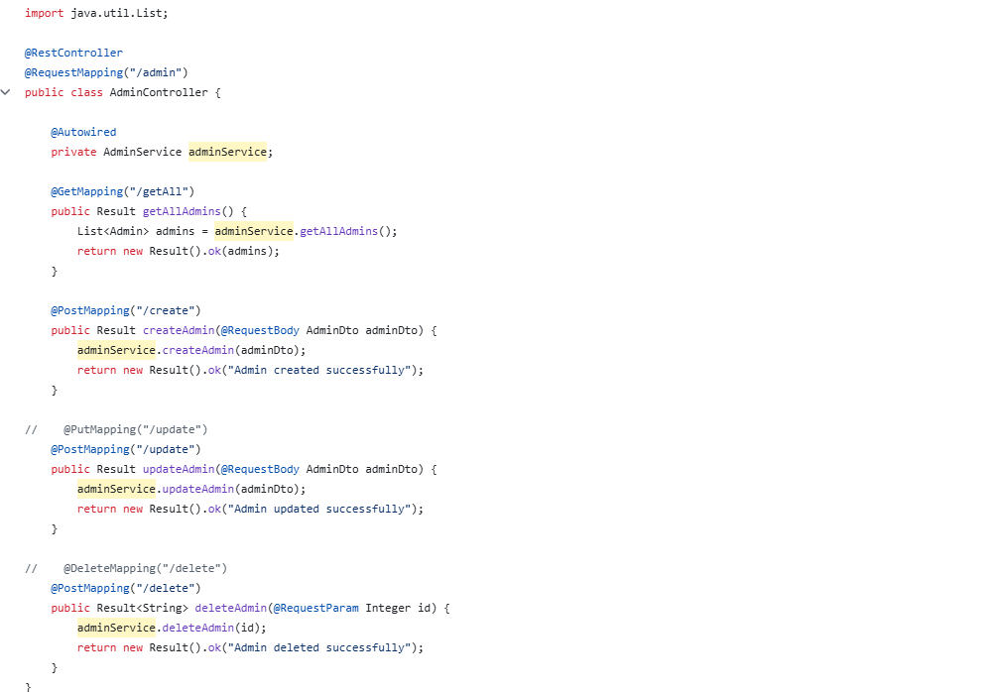
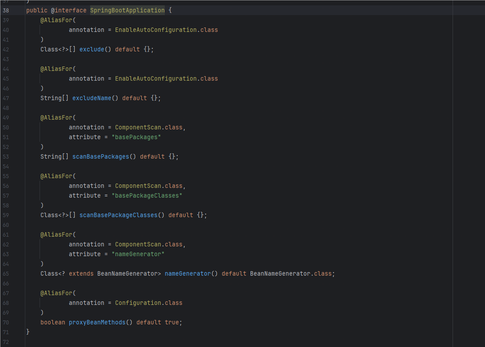
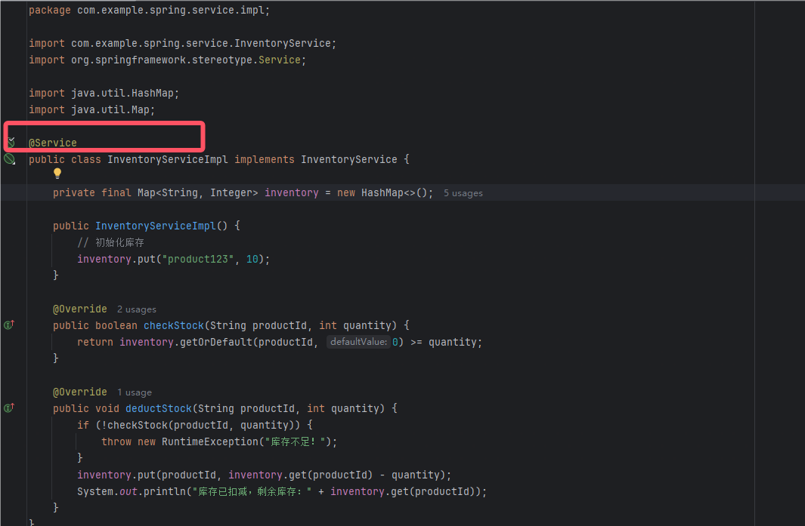

# 理解Spring IOC

因为是安全人员，在审计代码的时候并未注意到具体的代码是如何写的，以及一些写法为什么会跑起来， 在一些地方，明明没看到类的实例化，却发现了可以调用类中的非静态方法，最近就来了解一下这是为什么

虽然之前没了解过Spring IOC，但是IOC却贯穿于Java代码的始终

Ioc—Inversion of Control，即“控制反转”，**不是什么技术，而是一种设计思想**。在Java开发中，Ioc意味着将你设计好的对象交给容器控制，而不是传统的在你的对象内部直接控制。

> IoC Container管理的是Spring Bean， 那么Spring Bean是什么呢？

Spring里面的bean就类似是定义的一个组件，而这个组件的作用就是实现某个功能的，这里所定义的bean就相当于给了你一个更为简便的方法来调用这个组件去实现你要完成的功能

这是我们正常调用某个类的方法的过程



我们需要先主动new一个对象，如何去调用其中的方法，此时这个类是由我们管理的

而IOC的思想就是专门一个容器来创建这些对象，即由Ioc容器来控制对象的创建

那实际上，我们在看一些mybatis的例子的时候，发现直接就调用了service的方法



这种就是不需要我们主动创建的，而是有Spring IOC容器给我们的对象

# IOC配置

## XML配置

```
<?xml version="1.0" encoding="UTF-8"?>
<beans xmlns="http://www.springframework.org/schema/beans"
       xmlns:xsi="http://www.w3.org/2001/XMLSchema-instance"
       xsi:schemaLocation="http://www.springframework.org/schema/beans
 http://www.springframework.org/schema/beans/spring-beans.xsd">
    <!-- services -->
    <bean id="userService" class="tech.pdai.springframework.service.UserServiceImpl">
        <property name="userDao" ref="userDao"/>
        <!-- additional collaborators and configuration for this bean go here -->
    </bean>
    <!-- more bean definitions for services go here -->
</beans>
```

在配置文件的xml中声明命名空间与配置的bean，将这个bean交给IOC管理

## Java配置

将类的创建交给我们配置的JavcConfig类来完成，Spring只负责维护和管理，采用纯Java创建方式。其本质上就是把在XML上的配置声明转移到Java配置类中

- **优点**：适用于任何场景，配置方便，因为是纯Java代码，扩展性高，十分灵活
- **缺点**：由于是采用Java类的方式，声明不明显，如果大量配置，可读性比较差

创建一个配置类， 添加@Configuration注解声明为配置类

创建方法，方法上加上@bean，该方法用于创建实例并返回，该实例创建后会交给spring管理，方法名建议与实例名相同（首字母小写）。注：实例类不需要加任何注解

```
@Configuration
public class BeansConfig {

    /**
     * @return user dao
     */
    @Bean("userDao")
    public UserDaoImpl userDao() {
        return new UserDaoImpl();
    }

    /**
     * @return user service
     */
    @Bean("userService")
    public UserServiceImpl userService() {
        UserServiceImpl userService = new UserServiceImpl();
        userService.setUserDao(userDao());
        return userService;
    }
}
```

但是个人觉得这种方式并没有体现出IOC的优势，反而像是自己设计了一个IOC思想的类，只是通过@Configuration注解声明为配置类了

使用

```
ApplicationContext context = new AnnotationConfigApplicationContext(AppConfig.class);
UserService userService = context.getBean(UserService.class);
System.out.println(userService);
```

## 注解配置

Spring会自动扫描带有@Component，@Controller，@Service，@Repository这四个注解的类，然后帮我们创建并管理，前提是需要先配置Spring的注解扫描器`@ComponentScan` 

但是我们创建的spring项目默认的注解

```
@SpringBootApplication
```

实际上是以下三个注解的组合：

```
@SpringBootConfiguration
@EnableAutoConfiguration
@ComponentScan
```



`@ComponentScan` 默认扫描当前包及其子包

类添加@Component相关的注解，比如@Controller，@Service，@Repository



# 依赖注入

我们将bean交给了ioc容器进行管理，那需要使用的时候，需要告诉容器，我要用这个bean，就好比从自己做果汁跑去店里面买果汁，最后虽然都能等到果汁，但是去购买的时候，店里面虽然有果汁了，但是我需要点单

## setter方式注入

在Spring3.x刚推出的时候，推荐使用注入的就是这种, 但是这种方式比较麻烦，所以在Spring4.x版本中推荐构造函数注入。也是用的xml的方式

- property都是setter方式注入，比如下面的xml:

```xml
<?xml version="1.0" encoding="UTF-8"?>
<beans xmlns="http://www.springframework.org/schema/beans"
       xmlns:xsi="http://www.w3.org/2001/XMLSchema-instance"
       xsi:schemaLocation="http://www.springframework.org/schema/beans
 http://www.springframework.org/schema/beans/spring-beans.xsd">
    <!-- services -->
    <bean id="userService" class="tech.pdai.springframework.service.UserServiceImpl">
        <property name="userDao" ref="userDao"/>
        <!-- additional collaborators and configuration for this bean go here -->
    </bean>
    <!-- more bean definitions for services go here -->
</beans>
```

本质上包含两步：

1. 第一步，需要new UserServiceImpl()创建对象, 所以需要默认构造函数
2. 第二步，调用setUserDao()函数注入userDao的值, 所以需要setUserDao()函数

所以对应的service类是这样的：

```java
public class UserServiceImpl {

    /**
     * user dao impl.
     */
    private UserDaoImpl userDao;

    /**
     * init.
     */
    public UserServiceImpl() {
    }

    /**
     * find user list.
     *
     * @return user list
     */
    public List<User> findUserList() {
        return this.userDao.findUserList();
    }

    /**
     * set dao.
     *
     * @param userDao user dao
     */
    public void setUserDao(UserDaoImpl userDao) {
        this.userDao = userDao;
    }
}
```

## 构造函数注入

在Spring4.x版本中推荐的注入方式就是这种

- **在XML配置方式中**，`<constructor-arg>`是通过构造函数参数注入，比如下面的xml:

```xml
<?xml version="1.0" encoding="UTF-8"?>
<beans xmlns="http://www.springframework.org/schema/beans"
       xmlns:xsi="http://www.w3.org/2001/XMLSchema-instance"
       xsi:schemaLocation="http://www.springframework.org/schema/beans
 http://www.springframework.org/schema/beans/spring-beans.xsd">
    <!-- services -->
    <bean id="userService" class="tech.pdai.springframework.service.UserServiceImpl">
        <constructor-arg name="userDao" ref="userDao"/>
        <!-- additional collaborators and configuration for this bean go here -->
    </bean>
    <!-- more bean definitions for services go here -->
</beans>
```

本质上是new UserServiceImpl(userDao)创建对象, 所以对应的service类是这样的：

```java
public class UserServiceImpl {

    /**
     * user dao impl.
     */
    private final UserDaoImpl userDao;

    /**
     * init.
     * @param userDaoImpl user dao impl
     */
    public UserServiceImpl(UserDaoImpl userDaoImpl) {
        this.userDao = userDaoImpl;
    }

    /**
     * find user list.
     *
     * @return user list
     */
    public List<User> findUserList() {
        return this.userDao.findUserList();
    }

}
```

对应的service中设置注入从setter方法变为了构造器来注入userDao这个对象

## 注解注入

注解往往是最便捷最高效的方式

以@Autowired（自动注入）注解注入为例，修饰符有三个属性：Constructor，byType，byName。默认按照byType注入。

- **constructor**：通过构造方法进行自动注入，spring会匹配与构造方法参数类型一致的bean进行注入，如果有一个多参数的构造方法，一个只有一个参数的构造方法，在容器中查找到多个匹配多参数构造方法的bean，那么spring会优先将bean注入到多参数的构造方法中。
- **byName**：被注入bean的id名必须与set方法后半截匹配，并且id名称的第一个单词首字母必须小写，这一点与手动set注入有点不同。
- **byType**：查找所有的set方法，将符合符合参数类型的bean注入。

用的最多的就是@Autowired注解

```
@Service
public class UserServiceImpl {

    /**
     * user dao impl.
     */
    @Autowired
    private UserDaoImpl userDao;

    /**
     * find user list.
     *
     * @return user list
     */
    public List<User> findUserList() {
        return userDao.findUserList();
    }

}
```

# 例子

写了这么多，其实在整个过程中我们需要做的就是，在需要注册的bean加上@Component，@Controller，@Service，@Repository等注解

| 注解            | 层次       | 功能描述                           | 适用场景                       |
| --------------- | ---------- | ---------------------------------- | ------------------------------ |
| **@Component**  | 通用组件层 | 泛指组件，用于无法分类的 Bean      | 工具类、自定义组件等           |
| **@Controller** | 控制层     | 处理 HTTP 请求，返回视图或数据     | MVC 控制器，REST API           |
| **@Service**    | 服务层     | 封装业务逻辑                       | 服务类、业务逻辑实现           |
| **@Repository** | 数据访问层 | 封装数据持久化逻辑，带异常转换功能 | DAO 类，数据库操作类（Mapper） |

然后在需要使用的地方用@Autowired注解进行注入

Controller中定义访问路径，此时需要用到OrderService，使用@Autowired注解进行注入，就不要再进行实例化

```
package com.example.spring.Controller;


import com.example.spring.service.OrderService;
import org.springframework.beans.factory.annotation.Autowired;
import org.springframework.stereotype.Controller;
import org.springframework.web.bind.annotation.RequestBody;
import org.springframework.web.bind.annotation.RequestMapping;
import org.springframework.web.bind.annotation.ResponseBody;

import java.lang.reflect.InvocationHandler;

@Controller
public class IndexController {
    @Autowired
    public OrderService orderService;

    @RequestMapping("/")
    @ResponseBody
    public String test(){
        return "Hello World";
    }

    @RequestMapping("/ioc")
    public void ioc(){
        orderService.placeOrder("product123", 5);
    }
}

```

OrderService接口与实现类

```
package com.example.spring.service;

public interface OrderService {
    void placeOrder(String productId, int quantity);
}
```

```
package com.example.spring.service.impl;

import com.example.spring.service.InventoryService;
import com.example.spring.service.NotificationService;
import com.example.spring.service.OrderService;
import com.example.spring.service.PaymentService;
import org.springframework.beans.factory.annotation.Autowired;
import org.springframework.stereotype.Service;

@Service
public class OrderServiceImpl implements OrderService {

    @Autowired
    private InventoryService inventoryService;
    @Autowired
    private PaymentService paymentService;
    @Autowired
    private NotificationService notificationService;

    // 构造器注入多个服务
//    @Autowired
//    public OrderServiceImpl(InventoryService inventoryService, PaymentService paymentService, NotificationService notificationService) {
//        this.inventoryService = inventoryService;
//        this.paymentService = paymentService;
//        this.notificationService = notificationService;
//    }

    @Override
    public void placeOrder(String productId, int quantity) {
        // 检查库存
        if (!inventoryService.checkStock(productId, quantity)) {
            throw new RuntimeException("库存不足！");
        }

        // 扣减库存
        inventoryService.deductStock(productId, quantity);

        // 处理支付
        paymentService.processPayment("user123", productId, quantity);

        // 发送通知
        notificationService.sendNotification("user123", "订单已成功创建！");

        System.out.println("订单处理完成！");
    }
}
```

其他几个接口与实现类

```
package com.example.spring.service;

public interface InventoryService {
    boolean checkStock(String productId, int quantity);
    void deductStock(String productId, int quantity);
}
```

```
package com.example.spring.service;

public interface NotificationService {
    void sendNotification(String userId, String message);
}
```

```
package com.example.spring.service;

public interface PaymentService {
    void processPayment(String userId, String productId, int quantity);
}
```

```
package com.example.spring.service.impl;

import com.example.spring.service.InventoryService;
import org.springframework.stereotype.Service;

import java.util.HashMap;
import java.util.Map;

@Service
public class InventoryServiceImpl implements InventoryService {

    private final Map<String, Integer> inventory = new HashMap<>();

    public InventoryServiceImpl() {
        // 初始化库存
        inventory.put("product123", 10);
    }

    @Override
    public boolean checkStock(String productId, int quantity) {
        return inventory.getOrDefault(productId, 0) >= quantity;
    }

    @Override
    public void deductStock(String productId, int quantity) {
        if (!checkStock(productId, quantity)) {
            throw new RuntimeException("库存不足！");
        }
        inventory.put(productId, inventory.get(productId) - quantity);
        System.out.println("库存已扣减，剩余库存：" + inventory.get(productId));
    }
}
```

```
package com.example.spring.service.impl;

import com.example.spring.service.NotificationService;
import org.springframework.stereotype.Service;

@Service
public class NotificationServiceImpl implements NotificationService {
    @Override
    public void sendNotification(String userId, String message) {
        System.out.println("通知发送成功，用户：" + userId + "，消息：" + message);
    }
}
```

```
package com.example.spring.service.impl;

import com.example.spring.service.PaymentService;
import org.springframework.stereotype.Service;

@Service
public class PaymentServiceImpl implements PaymentService {
    @Override
    public void processPayment(String userId, String productId, int quantity) {
        System.out.println("支付成功，用户：" + userId + "，商品：" + productId + "，数量：" + quantity);
    }
}
```

访问/ioc路径


整个的调用都没用到实例化，都是通过依赖注入ioc管理的bean来实现的


参考链接：

https://pdai.tech/md/spring/spring-x-framework-ioc.html