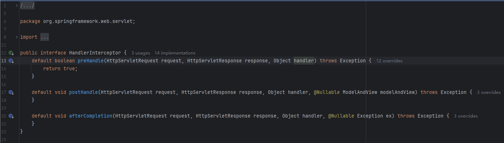
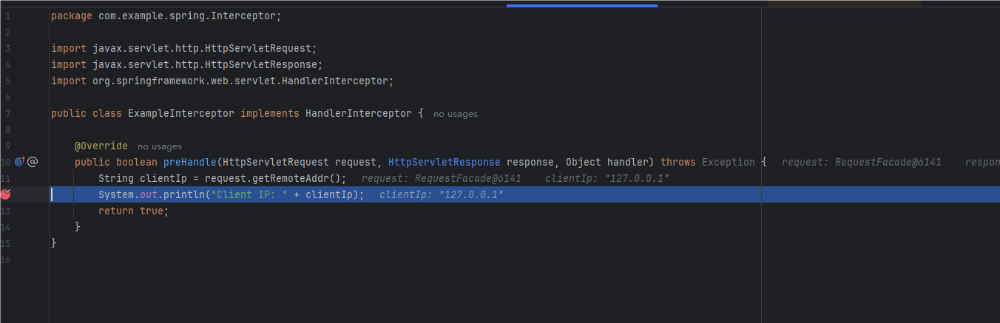

Spring的Interceptor的作用类似于Filter，Filter在servlet前进行处理，而Interceptor可以配置对应的路由在请求前进行拦截

# HandlerInterceptor

拦截器在 Spring MVC 中使用接口 HandlerInterceptor 表示，这个接口包含了三个方法：preHandle、postHandle、afterCompletion，这三个方法都有的 handler 参数表示处理器，通常情况下可以表示我们使用注解 @Controller 定义的控制器


- preHandle：处理器执行之前执行，如果返回 false 将跳过处理器、拦截器 postHandle 方法、视图渲染等，直接执行拦截器 afterCompletion 方法。

- postHandle：处理器执行后，视图渲染前执行，如果处理器抛出异常，将跳过该方法直接执行拦截器 afterCompletion 方法。
- afterCompletion：视图渲染后执行，不管处理器是否抛出异常，该方法都将执行。

# 自定义Interceptor

```
package com.example.spring.Interceptor;

import javax.servlet.http.HttpServletRequest;
import javax.servlet.http.HttpServletResponse;
import org.springframework.web.servlet.HandlerInterceptor;

public class ExampleInterceptor implements HandlerInterceptor {

    @Override
    public boolean preHandle(HttpServletRequest request, HttpServletResponse response, Object handler) throws Exception {
        String clientIp = request.getRemoteAddr();
        System.out.println("Client IP: " + clientIp);
        return true;
    }
}
```

重写preHandle方法，在Controller处理前进行拦截，往往可以用来针对不同路由做一个身份识别功能

这是之前写的一个项目里面的拦截器

```
package com.example.mojocebe.Interceptor;

import cn.hutool.http.Status;
import com.example.mojocebe.utils.JwtUtils;
import org.springframework.stereotype.Component;
import org.springframework.web.servlet.HandlerInterceptor;

import javax.servlet.http.Cookie;
import javax.servlet.http.HttpServletRequest;
import javax.servlet.http.HttpServletResponse;
import java.util.Map;


@Component
public class DoctorInterceptor implements HandlerInterceptor {

    private String token = "";
    /**
     * 针对Doctor的拦截器，医生不能访问的路由在webconfig配置
     */
    @Override
    public boolean preHandle(HttpServletRequest request, HttpServletResponse response, Object handler) {
        try {

            Cookie[] cookies = request.getCookies();
            if (cookies != null){
                for(Cookie cookie : cookies){
                    if (cookie.getName().equals("token")){
                        token = cookie.getValue();
                        break;
                    }
                }
            }

            int result = JwtUtils.checkToken(token);
            if (result == Status.HTTP_FORBIDDEN) {
                response.setStatus(401);
                return false;
            }
            else{
                Map role_map = JwtUtils.getMemberIdByJwtToken(token);
                Integer role = Integer.parseInt((String) role_map.get("roles"));
                if (role == 1){
                    response.setStatus(401);
                    return false;
                }
                return true;
            }
        } catch (Exception e) {
            e.printStackTrace();
            response.setStatus(401);
            return false;
        }
    }
}
```

# 注册拦截器

当定义好拦截器后，还需要对拦截器进行注册 

xml格式

    <mvc:interceptors >
        <bean class="com.example.spring.Interceptor.ExampleInterceptor"/>
        <mvc:interceptor>
            <mvc:mapping path="/**"/>
            <mvc:exclude-mapping path="/login"/>
            <bean class="com.example.spring.Interceptor.ExampleInterceptor"/>
        </mvc:interceptor>
    </mvc:interceptors>

一般能用xml方式的都有另外更简单的方式配置，这是参考链接中的例子

```
@Configuration
public class MvcConfig {

    @Bean
    public MappedInterceptor logInterceptor() {
        return new MappedInterceptor(null, new LoginInterceptor());
    }

    @Bean
    public MappedInterceptor loginInterceptor() {
        return new MappedInterceptor(new String[]{"/**"}, new String[]{"/login"}, new LoginInterceptor());
    }
}
```

但是我更喜欢用api进行配置，通过实现WebMvcConfigurer接口添加拦截器

```
package com.example.spring.webconfig;

import com.example.spring.Interceptor.ExampleInterceptor;
import org.springframework.context.annotation.Configuration;
import org.springframework.web.servlet.config.annotation.EnableWebMvc;
import org.springframework.web.servlet.config.annotation.InterceptorRegistry;
import org.springframework.web.servlet.config.annotation.WebMvcConfigurer;

@Configuration
public class MvcConfig implements WebMvcConfigurer {

    @Override
    public void addInterceptors(InterceptorRegistry registry) {
        registry.addInterceptor(new ExampleInterceptor());
    }
}
```

@EnableWebMvc是较旧的配置Spring MVC的方式。如果使用SpringBoot，它提供了自动配置，通常不需要显式使用@EnableWebMvc，因为它已经包含在默认配置中。Spring Boot会根据特定的依赖项和注解的存在自动启用与Web相关的配置

所以可以不用@EnableWebMvc注解了，注册后进入拦截器



当然在添加拦截器的时候还可以对路由进行添加，这是之前项目中的代码，这种写法直接一目了然的配置了拦截器的范围，以及排除不需要拦截的路由

```
@Override
    public void addInterceptors(InterceptorRegistry registry) {
        registry.addInterceptor(userInterceptor)
                .addPathPatterns("/**")
                .excludePathPatterns("/user/**")
                .excludePathPatterns("/checkToken")
                .excludePathPatterns("/webmvc/**")
                .excludePathPatterns("/common/**")
                .excludePathPatterns("/dept/**");
        registry.addInterceptor(doctorInterceptor)
                .addPathPatterns("/title/query");
        registry.addInterceptor(patientInterceptor)
                .addPathPatterns("/manager/**")
                .addPathPatterns("/doctor/**");
    }
    @Override
    public void addCorsMappings(CorsRegistry registry) {
      // 设置允许跨域的路径
        registry.addMapping("/**")
                // 设置允许跨域请求的域名
                .allowedOriginPatterns("*")
                // 是否允许cookie
                .allowCredentials(true)
                // 设置允许的请求方式
                .allowedMethods("GET", "POST", "DELETE", "PUT")
                // 设置允许的header属性
                .allowedHeaders("*")
                // 跨域允许时间
                .maxAge(3600);
    }

```


参考链接：

[Spring MVC 系列之拦截器 Interceptor 最全总结_springmvc interceptor-CSDN博客](https://blog.csdn.net/zzuhkp/article/details/121242297)

