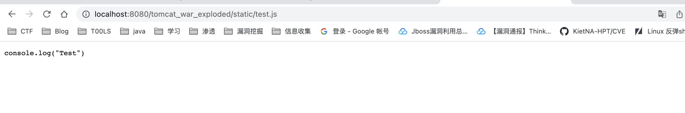

# 前言

​    最近在Java安全方面遇到一些瓶颈，对于Java一些自带的功能了解不够，导致看不懂代码等，所以想来补一下Java等知识，而在一本书上看到了Java EE，所以特地来学习记录一下，像Java等内存webshell就需要对servlet等注册过程有一定了解，另外对于Java EE来说可以对web开发有一个认识的过程

# 介绍

Java EE，Java 平台企业版（Java Platform Enterprise Edition），之前称为Java 2 Platform, Enterprise Edition (J2EE)，2018年3月更名为 Jakarta EE(这个名称应该还没有得到群众认可)。狭义的 Java EE 是 Sun 公司为企业级应用推出的标准平台，用来开发B/S架构软件，可以说是一个框架，也可以说是一种规范。

广义的 Java EE 包含各种框架，其中最重要的就是 Spring 全家桶。Spring 诞生之初是为了改进 Java EE 开发的体验，后来逐渐成为了 Java Web 开发的实际标准。后面的文章里，会对 Spring 进行进一步的说明。

JavaEE 号称有十三种核心技术。它们分别是：**JDBC**、**JNDI**、**EJB**、RMI、**Servlet**、**JSP**、XML、JMS、Java IDL、JTS、JTA、JavaMail和JAF。

## Java EE主要技术

### JDBC

Java 数据库连接，（Java Database Connectivity，JDBC）是 Java 语言中用来规范客户端程序如何来访问数据库的应用程序接口，提供了诸如查询和更新数据库中数据的方法。

### JNDI

Java 命名和目录接口（Java Naming and Directory Interface，JNDI），是 Java 的一个目录服务应用程序界面（API），它提供一个目录系统，并将服务名称与对象关联起来，从而使得开发人员在开发过程中可以使用名称来访问对象。

### EJB

企业级 JavaBean（Enterprise JavaBean, EJB）是一个用来构筑企业级应用的服务器端可被管理组件。不过这个东西在 Spring 问世后基本凉凉了，知道是什么就行。

### Servlet

Servlet（Server Applet），是用 Java 编写的服务器端程序。其主要功能在于交互式地浏览和修改数据，生成动态 Web 内容。

狭义的 Servlet 是指 Java 语言实现的一个接口，广义的 Servlet 是指任何实现了这个 Servlet 接口的类，一般情况下，人们将 Servlet 理解为后者。

### JSP

JSP（全称JavaServer Pages）是由 Sun 公司主导创建的一种动态网页技术标准。JSP 部署于网络服务器上，可以响应客户端发送的请求，并根据请求内容动态地生成 HTML、XML 或其他格式文档的 Web 网页，然后返回给请求者。

## JavaEE框架

JavaEE 拥有广泛市场的原因之一就是可以使用多种框架来使开发变得简单。对于框架的选择多种多样，目前比较常见的框架组合有 SSH和SSM。在后面的章节中会作详细介绍。另外Spring本身也提供了多种层次的框架供选择，可以到Spring官网了解详情。

Spring： https://spring.io/

### SSH

Structs + Spring + Hibernate

### SSM

Spring +SpringMVC + MyBatis

# JSP

对于jsp的话，在el表达式学习的过程中学了一点，主要是一些语法，在里面可以调用java的代码

```
<!DOCTYPE html>
<html>
    <head>
        <meta http-equiv="Content-Type" content="text/html; charset=UTF-8">
        <title>JSP Page</title>
    </head>
    <body>
        <%
            String data="hello world";
            boolean flag=true;
            if (flag==true) {
                out.println("<h1>" +data.toUpperCase()+ "</h1>");
            }
        %>
    </body>
</html>

```

**JSP 执行过程**

test.jsp 的执行过程为：

- test.jsp 被转译为 test_jsp.java(该类继承自 HttpJspBase，而 HttpJspBase 继承自 HttpServlet)
- test_jsp.java 被编译成 hello_jsp.class
- 执行 hello_jsp.class，生成 html
- 通过 HTTP 协议把 html 响应返回给浏览器

## Scriptlet

在 `<% %>` 之间，可以写任何 Java 代码

## 声明

在 <% ! %> 之间可以声明字段或方法，但是不建议这么做。

## 动作

`<jsp:include page="Filename">` 在 JSP 页面中包含另一个页面。

## 注释

`<%-- jsp代码 --%>`

# Servlet

- 如何使用Servlet编写Hello Servlet
- 如何将Servlet与URL对应起来
- Servlet如何调用JSP
- Servlet如何返回JSON数据
- 如何编写一个Dispatcher

**Servlet 的生命周期**

- 当 Servlet 第一次被调用的时候，其实例会被装在内存中。这个过程只会进行一次。
- Servlet 的 service 函数将被调用。
- 在之后的访问中，service 函数直接被调用。
- 当 web 应用 reload 或者服务器被关闭时，Servlet 的实例被销毁。

在使用servlet编辑web页面的时候，针对路由的配置有两种方法，一种是使用配置web.xml，另外一种是使用注解

## 第一个简易的servlet

HTTP最常见的方法是GET和POST，在一个Servlet中对应的处理方法分别是doGet()和doPost()，在对不同的请求方法的处理中需要在项目中重写对应的方法

项目的配置就不多写了，就是基本的在IDEA中配置tomcat项目

首先在web目录下创建一个html文件，其实就是一个登陆框，提交一个developer参数到test路由

```
<!DOCTYPE html>
<head>
    <meta http-equiv="Content-Type" content="text/html; charset=UTF-8">
    <title>测试 Servlet</title>
</head>

<form action="test" method="post">
    开发者： <input type="text" name="developer"> <br>
    <input type="submit" value="提交">
</form>
</html>
```

TestServlet.java

因为这里是post提交的参数，所以只需要重写doPost方法

```
package servlet;

import javax.servlet.ServletException;
import javax.servlet.annotation.WebServlet;
import javax.servlet.http.HttpServlet;
import javax.servlet.http.HttpServletRequest;
import javax.servlet.http.HttpServletResponse;
import java.io.IOException;

public class TestServlet extends HttpServlet {
    protected void doPost(HttpServletRequest request, HttpServletResponse response) throws ServletException, IOException {
        String developer = request.getParameter("developer");
        response.setContentType("text/html; charset=UTF-8");
        response.getWriter().println("欢迎开发者" + developer);
    }


    protected void doGet(HttpServletRequest request, HttpServletResponse response) throws ServletException, IOException {
    }
}
```

`response.setContentType("text/html;charset=UTF-8");` 用来设置HTTP响应头中的Content-Type。 response.getWriter()输出内容则是响应正文，每一个servlet类都应该继承自HttpServlet

web.xml

```
<?xml version="1.0" encoding="UTF-8"?>
<web-app xmlns="http://xmlns.jcp.org/xml/ns/javaee"
         xmlns:xsi="http://www.w3.org/2001/XMLSchema-instance"
         xsi:schemaLocation="http://xmlns.jcp.org/xml/ns/javaee http://xmlns.jcp.org/xml/ns/javaee/web-app_4_0.xsd"
         version="4.0">


    <servlet>
        <servlet-name>TestServlet</servlet-name>
        <servlet-class>servlet.TestServlet</servlet-class>
    </servlet>

    <servlet-mapping>
        <servlet-name>TestServlet</servlet-name>
        <url-pattern>/test</url-pattern>
    </servlet-mapping>
</web-app>
```

`<servlet>`将具体的类和servlet名字联系起来

`<servlet-mapping>`通过servlet名字将类和路径联系起来

xml中还可以通过下面代码来设置超时，单位是分钟

```xml
<session-config>
        <session-timeout>
            30
        </session-timeout>
    </session-config>
```

这里意思就是，我访问/test路由就是调用的TestServlet类的方法


在html中提交一个参数，通过TestServlet的doPost方法处理

## 通过注解绑定路由

重写一下TestServlet类

用@WebServlet进行路由绑定

```
package servlet;

import javax.servlet.ServletException;
import javax.servlet.annotation.WebServlet;
import javax.servlet.http.HttpServlet;
import javax.servlet.http.HttpServletRequest;
import javax.servlet.http.HttpServletResponse;
import java.io.IOException;

@WebServlet("/TestServlet")
public class TestServlet extends HttpServlet {
    protected void doPost(HttpServletRequest request, HttpServletResponse response) throws ServletException, IOException {
        String developer = request.getParameter("developer");
        response.setContentType("text/html; charset=UTF-8");
        response.getWriter().println("欢迎开发者" + developer);
    }


    protected void doGet(HttpServletRequest request, HttpServletResponse response) throws ServletException, IOException {
        String aaa = "Welcome DawnT0wn";
        response.setContentType("text/html; charset=UTF-8");
        response.getWriter().println(aaa);
    }
}
```

将web.xml中的路由绑定注释掉

访问TestServlet路由


通过Post访问


可以看到也是通过TestServlet的doGet或者doPost方法处理的

## Servlet调用JSP

HelloServlet.java

```
import java.io.IOException;
import java.io.PrintWriter;
import javax.servlet.RequestDispatcher;
import javax.servlet.ServletException;
import javax.servlet.http.HttpServlet;
import javax.servlet.http.HttpServletRequest;
import javax.servlet.http.HttpServletResponse;

import javax.servlet.annotation.WebServlet;

@WebServlet("/HelloServlet")
public class HelloServlet extends HttpServlet {

    protected void processRequest(HttpServletRequest request, HttpServletResponse response)
            throws ServletException, IOException {
        response.setContentType("text/html;charset=UTF-8");
        request.setAttribute("title", "Hello Servlet");
        request.setAttribute("content", "This is servlet and jsp");
        RequestDispatcher rd = request.getRequestDispatcher("/WEB-INF/hello.jsp");
        rd.forward(request, response);
    }

    @Override
    protected void doGet(HttpServletRequest request, HttpServletResponse response)
            throws ServletException, IOException {
        processRequest(request, response);
    }

    @Override
    protected void doPost(HttpServletRequest request, HttpServletResponse response)
            throws ServletException, IOException {
        processRequest(request, response);
    }

}
```

request.setAttribute设置jsp中参数的值，在对应路径下创建一个jsp

```
<%--
  Created by IntelliJ IDEA.
  User: DawnT0wn
  Date: 2022/10/17
  Time: 17:03
  To change this template use File | Settings | File Templates.
--%>
<%@ page contentType="text/html;charset=UTF-8" language="java" %>
<html>
<head>
    <title>${title}</title>
</head>
<body>
<h1>${content}</h1>
</body>
</html>
```


## JS，CSS等静态文件放在哪里

在web目录下创建一个static目录，里面放对应的js，CSS等文件

在web.xml中添加

```
<servlet-mapping>
        <servlet-name>default</servlet-name>
        <url-pattern>*.jpg</url-pattern>
    </servlet-mapping>

    <servlet-mapping>
        <servlet-name>default</servlet-name>
        <url-pattern>*.png</url-pattern>
    </servlet-mapping>

    <servlet-mapping>
        <servlet-name>default</servlet-name>
        <url-pattern>*.js</url-pattern>
    </servlet-mapping>

    <servlet-mapping>
        <servlet-name>default</servlet-name>
        <url-pattern>*.css</url-pattern>
    </servlet-mapping>
```



## 编写Dispatcher

继续修改代码

```
import java.io.IOException;
import java.io.PrintWriter;
import javax.servlet.ServletException;
import javax.servlet.http.HttpServlet;
import javax.servlet.http.HttpServletRequest;
import javax.servlet.http.HttpServletResponse;

import javax.servlet.annotation.WebServlet;

@WebServlet("/")
public class HelloServlet extends HttpServlet {

    protected void processRequest(HttpServletRequest request, HttpServletResponse response)
            throws ServletException, IOException {
        response.setContentType("text/plain;charset=UTF-8");
        try (PrintWriter out = response.getWriter()) {
            out.println("context: " + request.getContextPath());
            out.println("request uri: " + request.getRequestURI());
            out.println("params: " + request.getParameterMap());
        }
    }

    @Override
    protected void doGet(HttpServletRequest request, HttpServletResponse response)
            throws ServletException, IOException {
        processRequest(request, response);
    }

    @Override
    protected void doPost(HttpServletRequest request, HttpServletResponse response)
            throws ServletException, IOException {
        processRequest(request, response);
    }

}
```

虽然绑定的是根路由，但是当带上访问路径（可以是不存在的）和参数的时候可以有返回


我们可以通过request对象得到HTTP请求信息，特别是request URI

对应写定路由的页面没有影响


# JDBC

既然是对于web开发，那么与数据库的交互就必不可少，因为数据库有各种各样的，所以sun公司就提出了一个接口，但是没有规定实现类，而对于java这种流行的语言来说，一个数据库公司需要与我进行交互，你就得自己写一个实现类，所以在java中诞生了JDBC，这样就可以通过一套语言管理各种数据库，而不用专门去学习各种数据库的操作了

JDBC的实现包括三部分。

(1)JDBC驱动管理器：负责注册特定的JDBC驱动器，主要通过java.sql. Driver Manager类实现。

(2)JDBC驱动器API：由Sun公司负责制定，其中最主要的接口是java.sql. Driver接口。

(3)JDBC驱动器：它是一种数据库驱动，由数据库厂商创建，也称为JDBC驱动程序JDBC驱动器实现了JDBC驱动器API，负责与特定的数据库连接，以及处理通信细节。

jar包下载https://dev.mysql.com/downloads/connector/j/5.1.html


## JDBC常用的API

### driver接口

Driver接口是所有JDBC驱动程序必须实现的接口，该接口专门提供给数据库厂商使用。在编写JDBC程序时，必须要把指定数据库驱动程序或类库加载到项目的classpath中

### DriverManager类

Driver Manager类用于加载JDBC驱动并且创建与数据库的连接。在Driver Manager类中，定义了两个比较重要的静态方法。如表所示：

```text
registerDriver(Driver driver) 
该方法用于向 DriverManager中注册给定的JDBC驱动程程序,也可以直接用Class.forname直接获取驱动
```

```text
getConnection(String url,String user,String pwd)
该方法用于建立和数据库的连接,并返回表示连接的 Connection对象
```

### Connection接口

**getMetaData()**
该方法用于返回表示数据库的元数据的 DatabaseMetaData对象

**createStatement()**
用于创建一个Statement对象来将SQL语句发送到数据库

**prepareStatement(String sql)**
用于创建一个PreparedStatement对象来将参数化的SQL语句发送到数据库

**prepareCall(String sql)**
用于创建一个CallableStatement对象来调用数据库存储过程

### Statement接口

Statement接口用于向数据库发送SQL语句，在Statement接口中，提供了三个执行SQL语句的方法

**execute(String sql)**

用于执行各种SQL语句，该方法返回一个boolean类型的值，如果为true，表示所执行的SQL语句具备查询结果，可通过Statement的getResultSet方法获得查询结果。

**executeUpdate(String sql)**

用于执行SQL中的Insert、update和delete语句。该方法返回一个int类型的值，表示数据库中受该SQL语句影响的记录的数目。
**executeQuery(String sql)**

用于执行SQL中的select语句，该方法返回一个表示查询结果的ResultSet对象

### PreparedStatement接口

PreparedStatement是Statement的子接口，用于执行预编译的SQL语句

**executeUpdate()**

在此PreparedStatement对象中执行SQL语句，该语句必须是个DML语句或者是无返回内容的SQL语句，比如DDL语句。

**executeQuery()**

在此PreparedStatement对象中执行SQL查询，该方法返回的ResultSet对象

**setInt(int parameterIndex, int x)**

将指定参数设置为给定的int值

**setFloat(int parameterIndex, float x)**

指定参数设置为给定的float值

**setString(int parameterIndex, String x)**

将指定参数设置为给定的String值

**setDate(int parameterIndex, Date x)**

将指定参数设置为给定的Date值

**addBatch()**

将一组参数添加到此PreparedStatement对象的批处理命令中

**setCharacterStream(parameterIndex, reader, length)**

将指定的输入流写入数据库的文本字段

**setBinaryStream(parameterIndex, x, length)**

将二进制的输入流数据写入到二进制字段中

需要注意的是，上表中的setDate()方法可以设置日期内容，但参数Date的类型是java.sq.Date，而不是java.util.Date

### CallableStatement接口

CallableStatement是PreparedStatement的子接口，用于执行SQL存储过程

**registerOutParameter(int parameterIndex,int sqlType)**

按顺序位置将OUT参数注册为SQL类型。其中，parameterIndex表示顺序位置，sqlType表示SQL类型

**setNull(String parameter Name, int sqlType)**

将指定参数设置为SQL类型的NULL
**setString(String parameterName, String x)**

查询最后一个读取的OUT参数是否为SQL类型的NULL

**wasNull()**

查询最后一个读取的OUT参数是否为SQL类型的NULL

**getlnt(int parameterIndex)**

以Java语言中int值的形式获取指定的数据库中INTEGER类型参数的值

 CallableStatement接口继承PreparedStatement，PreparedStatement接口又继承了 Statement，因此CallableStatement接口中除了拥有自己特有的方法，也同时拥有了这两个父接口中的方法

### ResultSet接口

ResultSet接口表示 select查询语句得到的结果集，该结果集封装在一个逻辑表格中。在 ResultSet接口内部有一个指向表格数据行的游标，ResultSet对象初始化时，游标在表格的第一行之前

**getString(int columnIndex)**

用于获取指定字段的String类型的值，参数columnIndex代表字段的索引
**getString(String columnName)**

用于获取指定字段的String类型的值，参数column Name代表字段的名称
**getInt(int columnIndex)**

用于获取指定字段的int类型的值，参数columnIndex代表字段的索引
**
getInt(String columnName)**

用于获取指定字段的int类型的值，参数columnName代表字段的名称

**getDate(int columnIndex)**

用于获取指定字段的Date类型的值，参数columnIndex代表字段的索引
**getDate(String columnName)**

用于获取指定字段的Date类型的值，参数column Name代表字段的名称
**next()**

将游标从当前位置向下移一行
**absolute(int row)**

将游标移动到此Resultset对象的指定行
**afterLast()**

将游标移动到此ResultSet对象的末尾，即最后一行之后
**beforeFirst()**

将游标移动到此Resultset对象的开头，即第一行之前
**previous()**
将游标移动到此ResultSet对象的上一行
**last()**

将游标移动到此ResultSet对象的最

ResultSet接口中定义了大量的getter方法，采用哪种getter方法取决于字段的数据类型。程序既可以通过字段的名称来获取指定数据，也可以通过字段的索引来获取指定的数据，字段的索引是从1开始编号的

## JDBC编程步骤

JDBC编程大致按照以下几个步骤进行。

### 加载并注册数据库驱动

```
DriverManager.registerDriver(Driver driver); #这里的driver其实就是com.mysql.jdbc.Driver
也可以用反射加载驱动
Class.forName("com.mysql.jdbc.Driver");	#主要高版本的jdbc这个驱动名是com.mysql.cj.jdbc.Driver
如果用反射会有报错，但是能执行，如果直接用registerDriver会报错，不执行
```

### 通过Driver Manager获取数据库连接

```
Connection conn= DriverManager.getConnection(String url, String user, String pass);
```

从上述方式可以看出，getConnection()方法中有三个参数，它们分别表示数据库url、登录数据库的用户名和密码。数据库通常遵循如下形式的写法。

`jdbc:subprotocol:subname`

上面的URL写法中jdbc部分是固定的，subprotocol指定链接达到特定数据库的驱动程序，而subname部分则很不固定，也没有什么规律，不同数据库的形式可能存在较大差异，以Mysql数据库为例，其形式如下：

```
jdbc:mysql://hostname:port/databasename
```

### 通过Connection对象获取Statement对象。

Connection创建Statement的方式有如下三种

- createStatement(): 创建基本的Statement对象
- prepareStatement(): 创建PreparedStatement对象。
- preparCall(): 创建CallableStatement对象。

以创建基本的Statement对象为例，具体方式如下。

```
Statement stmt=conn.createStatement();
```

### 使用Statement执行SQL语句

所有的Statement都有如下三种方法来执行语句

- execute()：可以执行任何SQL语句。
- executeQuery()：通常执行查询语句，执行后返回代表结果集的Resultset对象。
- executeUpdate()：主要用于执行DML和DDL语句。执行DML语句，如INSERT、UPDATE或 DELETE时，返回受SQL语句影响的行数，执行DDL语句返回0。

以executeQuery为例

```text
//执行SQL语句，获取结果集ResulSet
ResultSet rs=stmt.executQuery(sql);
```

### 操作ResultSet结果集

如果执行的SQL语句是查询语句，执行结果将返回Resultset对象，该对象里保存了SQL语句查询的结果。程序可以通过操作该ResultSet对象来取出查询结果。 ResultSet对象提供的方法主要可以分为以下两类。

- next()、previous()、first()、last()、beforeFirst()、afterLast()、absolute()等移动记录指针的方法
- getter获取指针指向行，特定列的值。

```
while (resultSet.next()){
    String name = resultSet.getString("name");
    System.out.println(name);
}
```

### 回收数据库资源

关闭数据库连接，释放资源，包括关闭ResultSet、Statement和Connection等资源，调用对应的close方法即可

## 第一个JDBC

创建一个test库，里面插入数据表


```
package JDBCTest;

import java.sql.Connection;
import java.sql.DriverManager;
import java.sql.ResultSet;
import java.sql.Statement;

public class Test {
    public static void main(String[] args) throws Exception{
        Class.forName("com.mysql.cj.jdbc.Driver");
        String url = "jdbc:mysql://localhost:3306/test";
        String username = "root";
        String password = mysql password;
        Connection conn = DriverManager.getConnection(url,username,password);
        Statement stmt = conn.createStatement();
        String sql = "select * from users";
        ResultSet resultSet = stmt.executeQuery(sql);
        while (resultSet.next()){
            String name = resultSet.getString("name");
            System.out.println(name);
        }
        resultSet.close();
        stmt.close();
        conn.close();

    }
}
```


