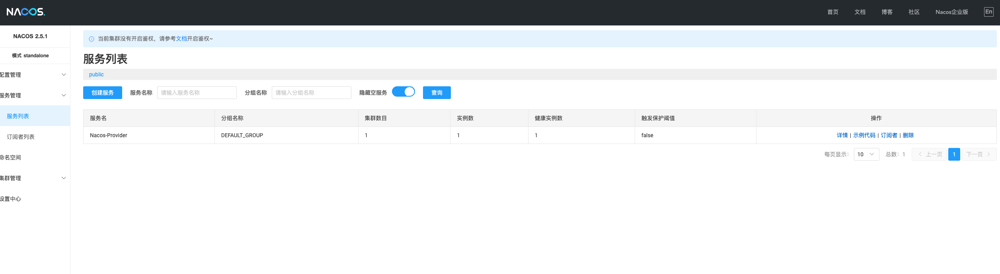
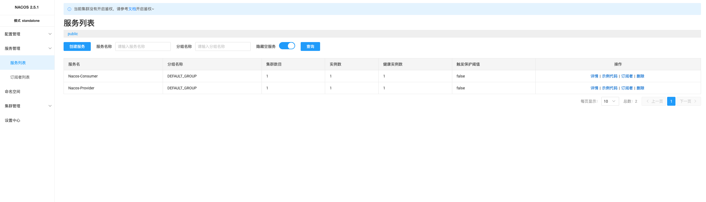
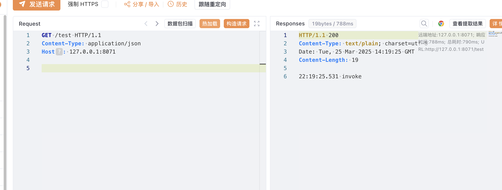
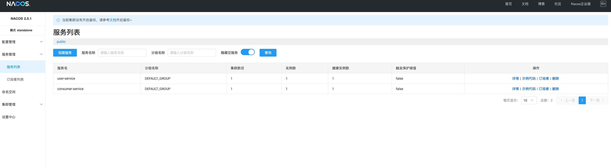
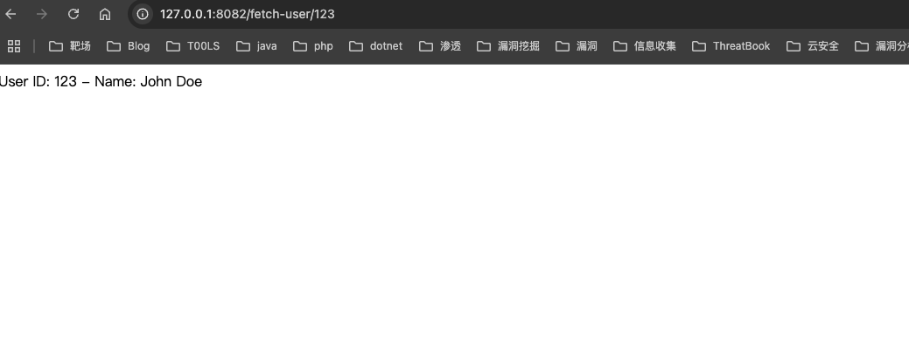

# SpringBoot整合Nacos

需要两个项目Nacos-Provider和Nacos-Consumer，一个服务提供者，一个服务消费者

## Nacos-Provider

相关依赖

```
<dependencies>
    <dependency>
        <groupId>org.springframework.boot</groupId>
        <artifactId>spring-boot-starter-web</artifactId>
    </dependency>

    <dependency>
        <groupId>org.springframework.boot</groupId>
        <artifactId>spring-boot-starter-test</artifactId>
        <scope>test</scope>
    </dependency>

    <dependency>
        <groupId>com.alibaba.cloud</groupId>
        <artifactId>spring-cloud-starter-alibaba-nacos-discovery</artifactId>
        <version>2.1.2.RELEASE</version>
    </dependency>
    <!--服务配置依赖-->
    <dependency>
        <groupId>com.alibaba.cloud</groupId>
        <artifactId>spring-cloud-starter-alibaba-nacos-config</artifactId>
        <version>2.1.2.RELEASE</version>
    </dependency>
</dependencies>
```

这里因为Spring-Cloud版本依赖问题，需要用低版本的Spring-boot，JDK版本用的1.8

```
<parent>
    <groupId>org.springframework.boot</groupId>
    <artifactId>spring-boot-starter-parent</artifactId>
    <version>2.1.13.RELEASE</version>
    <relativePath/> <!-- lookup parent from repository -->
</parent>
```

ProviderController.java

```
package org.example.Controller;

import org.springframework.web.bind.annotation.GetMapping;
import org.springframework.web.bind.annotation.RestController;

import java.time.LocalTime;

@RestController
public class ProviderController {
    @GetMapping("invoke")
    public String invoke() {
        return LocalTime.now() + " invoke";
    }
}
```

一个控制器，输出时间加上invoke字符串

application.yml

```
server:
  port: 8070
spring:
  application:
    name: Nacos-Provider
  cloud:
    # nacos服务地址
    nacos:
      server-addr: 127.0.0.1:8848
```

启动类添加@EnableDiscoveryClient注解启动

从Spring Cloud Edgware开始，@EnableDiscoveryClient 或@EnableEurekaClient 可省略。只需加上相关依赖，并进行相应配置，即可将微服务注册到服务发现组件上。

@EnableDiscoveryClient和@EnableEurekaClient共同点就是：都是能够让注册中心能够发现，扫描到改服务。

不同点：@EnableEurekaClient只适用于Eureka作为注册中心，@EnableDiscoveryClient 可以是其他注册中心



## Nacos-Consumer

相关依赖

```
<dependencies>
        <dependency>
            <groupId>org.springframework.boot</groupId>
            <artifactId>spring-boot-starter-web</artifactId>
        </dependency>
        <dependency>
            <groupId>org.springframework.boot</groupId>
            <artifactId>spring-boot-starter-test</artifactId>
            <scope>test</scope>
        </dependency>
        <dependency>
            <groupId>org.springframework.cloud</groupId>
            <artifactId>spring-cloud-starter-openfeign</artifactId>
            <version>2.1.2.RELEASE</version>
        </dependency>
        <dependency>
            <groupId>com.alibaba.cloud</groupId>
            <artifactId>spring-cloud-starter-alibaba-nacos-discovery</artifactId>
            <version>2.1.2.RELEASE</version>
        </dependency>
    </dependencies>
```


需要nacos-discovery和openfeign依赖，spring版本和刚才一样

```
server:
  port: 8071
spring:
  application:
    name: Nacos-Consumer
  cloud:
    # nacos服务地址
    nacos:
      server-addr: 127.0.0.1:8848
```

接口ProviderFeign.java

```
package org.example.Interfaces;

import org.springframework.cloud.openfeign.FeignClient;
import org.springframework.web.bind.annotation.GetMapping;

@FeignClient("Nacos-Provider")
public interface ProviderFeign {
    @GetMapping("invoke")
    String invoke();
}

```

这里@FeignClient注解的内容和需要远程调用的服务名相同，接口是RPC的接口

ConsummerController.java

```
package org.example.Controllers;


import org.example.Interfaces.ProviderFeign;
import org.springframework.beans.factory.annotation.Autowired;
import org.springframework.web.bind.annotation.GetMapping;
import org.springframework.web.bind.annotation.RestController;

@RestController
public class ConsummerController {
    @Autowired
    private ProviderFeign providerFeign;
    @GetMapping("/test")
    public String test() {
        return providerFeign.invoke();
    }
}

```

创建一个Controller调用接口中的invoke方法来远程调用注册中心的Nacos-Provider服务invoke接口的方法

启动类加上@EnableFeignClients和@EnableDiscoveryClient注解



现在直接调用8071端口的/test路由，即可远程调用8070端口的/invoke路由



# Facade包调用

facade包也是远程调用，还是需要借助Nacos

因为要打包facade，所以还是按照一个比较完整的项目来实现

一个分为了两个项目，provider和consumer，最后provider只打包facade包给consumer，通过服务发现调用

```
provider-project/      # 服务提供者（独立项目）
├── common/            # Spring Boot 启动模块
│   ├── src/main/java/com/example/provider/common/ProviderApplication.java
│   ├── pom.xml
├── dao/               # 数据访问层（Maven 模块）
│   ├── pom.xml
├── facade/            # API 接口定义（Maven 模块）
│   ├── pom.xml
│   ├── src/main/java/com/example/provider/facade/UserServiceFacade.java
├── service/           # 业务逻辑层（Maven 模块）
│   ├── pom.xml
│   ├── src/main/java/com/example/provider/service/UserServiceImpl.java
├── test/              # 单元测试模块
│   ├── pom.xml
├── pom.xml            # Provider 父级 POM

consumer-project/      # 服务消费者（独立项目）
├── common/            # Spring Boot 启动模块
│   ├── src/main/java/com/example/consumer/common/ConsumerApplication.java
│   ├── pom.xml
├── facade/            # 依赖 provider 的 facade（Maven 模块，不实现逻辑）
│   ├── pom.xml
├── pom.xml            # Consumer 父级 POM
```

## Facade-Provider

父项目的pom.xml

```
<?xml version="1.0" encoding="UTF-8"?>
<project xmlns="http://maven.apache.org/POM/4.0.0"
         xmlns:xsi="http://www.w3.org/2001/XMLSchema-instance"
         xsi:schemaLocation="http://maven.apache.org/POM/4.0.0 http://maven.apache.org/xsd/maven-4.0.0.xsd">
    <modelVersion>4.0.0</modelVersion>

    <parent>
        <groupId>org.springframework.boot</groupId>
        <artifactId>spring-boot-starter-parent</artifactId>
        <version>2.1.13.RELEASE</version>
        <relativePath/> <!-- lookup parent from repository -->
    </parent>
    <groupId>org.example</groupId>
    <artifactId>Facade-Provider</artifactId>
    <version>1.0-SNAPSHOT</version>
    <packaging>pom</packaging>
    <modules>
        <module>common</module>
        <module>dao</module>
        <module>facade</module>
        <module>service</module>
        <module>common</module>
    </modules>

    <properties>
        <maven.compiler.source>8</maven.compiler.source>
        <maven.compiler.target>8</maven.compiler.target>
        <project.build.sourceEncoding>UTF-8</project.build.sourceEncoding>
    </properties>

    <dependencies>
        <dependency>
            <groupId>org.springframework.boot</groupId>
            <artifactId>spring-boot-starter-web</artifactId>
        </dependency>
        <dependency>
            <groupId>org.springframework.boot</groupId>
            <artifactId>spring-boot-starter-test</artifactId>
            <scope>test</scope>
        </dependency>
        <dependency>
            <groupId>com.alibaba.cloud</groupId>
            <artifactId>spring-cloud-starter-alibaba-nacos-discovery</artifactId>
            <version>2.1.2.RELEASE</version>
        </dependency>
    </dependencies>

</project>
```

### spring启动模块

Pom.xml

```
<?xml version="1.0" encoding="UTF-8"?>
<project xmlns="http://maven.apache.org/POM/4.0.0"
         xmlns:xsi="http://www.w3.org/2001/XMLSchema-instance"
         xsi:schemaLocation="http://maven.apache.org/POM/4.0.0 http://maven.apache.org/xsd/maven-4.0.0.xsd">
    <modelVersion>4.0.0</modelVersion>
    <parent>
        <groupId>org.example</groupId>
        <artifactId>Facade-Provider</artifactId>
        <version>1.0-SNAPSHOT</version>
    </parent>

    <groupId>com.example</groupId>
    <artifactId>common</artifactId>

    <properties>
        <maven.compiler.source>8</maven.compiler.source>
        <maven.compiler.target>8</maven.compiler.target>
        <project.build.sourceEncoding>UTF-8</project.build.sourceEncoding>
    </properties>

    <dependencies>
        <dependency>
            <groupId>org.example</groupId>
            <artifactId>service</artifactId>
            <version>1.0-SNAPSHOT</version>
        </dependency>
    </dependencies>

</project>
```

appcation.yml注册到nacos

```
<?xml version="1.0" encoding="UTF-8"?>
<project xmlns="http://maven.apache.org/POM/4.0.0"
         xmlns:xsi="http://www.w3.org/2001/XMLSchema-instance"
         xsi:schemaLocation="http://maven.apache.org/POM/4.0.0 http://maven.apache.org/xsd/maven-4.0.0.xsd">
    <modelVersion>4.0.0</modelVersion>
    <parent>
        <groupId>org.example</groupId>
        <artifactId>Facade-Provider</artifactId>
        <version>1.0-SNAPSHOT</version>
    </parent>

    <groupId>com.example</groupId>
    <artifactId>common</artifactId>

    <properties>
        <maven.compiler.source>8</maven.compiler.source>
        <maven.compiler.target>8</maven.compiler.target>
        <project.build.sourceEncoding>UTF-8</project.build.sourceEncoding>
    </properties>

    <dependencies>
        <dependency>
            <groupId>org.example</groupId>
            <artifactId>service</artifactId>
            <version>1.0-SNAPSHOT</version>
        </dependency>
    </dependencies>

</project>
```

启动类

```
package com.example.provider;

import org.springframework.boot.SpringApplication;
import org.springframework.boot.autoconfigure.SpringBootApplication;
import org.springframework.cloud.client.discovery.EnableDiscoveryClient;

@SpringBootApplication
@EnableDiscoveryClient
public class ProviderApplication {
    public static void main(String[] args) {
        SpringApplication.run(ProviderApplication.class, args);
    }
}
```

### facade模块

因为没有用到数据，dao层就忽略了

```
<?xml version="1.0" encoding="UTF-8"?>
<project xmlns="http://maven.apache.org/POM/4.0.0"
         xmlns:xsi="http://www.w3.org/2001/XMLSchema-instance"
         xsi:schemaLocation="http://maven.apache.org/POM/4.0.0 http://maven.apache.org/xsd/maven-4.0.0.xsd">
    <modelVersion>4.0.0</modelVersion>
    <parent>
        <groupId>org.example</groupId>
        <artifactId>Facade-Provider</artifactId>
        <version>1.0-SNAPSHOT</version>
    </parent>
    <artifactId>facade</artifactId>
    <packaging>jar</packaging>

    <properties>
        <maven.compiler.source>8</maven.compiler.source>
        <maven.compiler.target>8</maven.compiler.target>
        <project.build.sourceEncoding>UTF-8</project.build.sourceEncoding>
    </properties>


</project>
```

只定义接口，需要借口才能被访问，本质上还是http调用

```
package com.example.provider.dao.provider.facade;

import org.springframework.web.bind.annotation.GetMapping;
import org.springframework.web.bind.annotation.PathVariable;

public interface UserServiceFacade {
    @GetMapping("/user/{id}")
    String getUserInfo(@PathVariable Long id);
}
```

### service模块

```
<?xml version="1.0" encoding="UTF-8"?>
<project xmlns="http://maven.apache.org/POM/4.0.0"
         xmlns:xsi="http://www.w3.org/2001/XMLSchema-instance"
         xsi:schemaLocation="http://maven.apache.org/POM/4.0.0 http://maven.apache.org/xsd/maven-4.0.0.xsd">
    <modelVersion>4.0.0</modelVersion>
    <parent>
        <groupId>org.example</groupId>
        <artifactId>Facade-Provider</artifactId>
        <version>1.0-SNAPSHOT</version>
    </parent>

    <artifactId>service</artifactId>

    <properties>
        <maven.compiler.source>8</maven.compiler.source>
        <maven.compiler.target>8</maven.compiler.target>
        <project.build.sourceEncoding>UTF-8</project.build.sourceEncoding>
    </properties>

    <dependencies>
        <dependency>
            <groupId>org.example</groupId>
            <artifactId>facade</artifactId>
            <version>1.0-SNAPSHOT</version>
        </dependency>
    </dependencies>

</project>
```

facade的实现逻辑在service层，所以需要依赖facade模块，随便写一个实现方法

```
package com.example.provider.dao.provider.service;

import com.example.provider.dao.provider.facade.UserServiceFacade;
import org.springframework.web.bind.annotation.RestController;

@RestController
public class UserServiceImpl implements UserServiceFacade {
    @Override
    public String getUserInfo(Long id) {
        return "User ID: " + id + " - Name: John Doe";
    }
}
```

## Facade-Consumer

### spring启动模块

```
<?xml version="1.0" encoding="UTF-8"?>
<project xmlns="http://maven.apache.org/POM/4.0.0"
         xmlns:xsi="http://www.w3.org/2001/XMLSchema-instance"
         xsi:schemaLocation="http://maven.apache.org/POM/4.0.0 http://maven.apache.org/xsd/maven-4.0.0.xsd">
    <modelVersion>4.0.0</modelVersion>
    <parent>
        <groupId>com.example</groupId>
        <artifactId>Facade_Consumer</artifactId>
        <version>1.0-SNAPSHOT</version>
    </parent>

    <artifactId>common</artifactId>

    <properties>
        <maven.compiler.source>8</maven.compiler.source>
        <maven.compiler.target>8</maven.compiler.target>
        <project.build.sourceEncoding>UTF-8</project.build.sourceEncoding>
    </properties>

    <dependencies>
        <dependency>
            <groupId>com.example</groupId>
            <artifactId>service</artifactId>
            <version>1.0-SNAPSHOT</version>
        </dependency>
    </dependencies>

</project>
```

需要依赖service层

application.yml，绑定到nacos，后面才能在nacos上寻到user-service

```
spring:
  application:
    name: consumer-service
  cloud:
    nacos:
      discovery:
        server-addr: localhost:8848
server:
  port: 8082
```

controller自动注入service，调用service的方法

```
package com.example.consumer.controller;

import com.example.consumer.service.UserService;
import org.springframework.beans.factory.annotation.Autowired;
import org.springframework.web.bind.annotation.GetMapping;
import org.springframework.web.bind.annotation.PathVariable;
import org.springframework.web.bind.annotation.RequestMapping;
import org.springframework.web.bind.annotation.RestController;

@RestController
@RequestMapping("/fetch-user")
public class UserController {
    @Autowired
    private UserService userService;

    @GetMapping("/{id}")
    public String fetchUser(@PathVariable Long id) {
        return userService.getUserId(id);
    }
}
```

### service层

因为这是我本地环境，没有maven包的仓库，就直接将打包好的facade放在本地maven仓库了

`~/.m2/repository/org/example/facade/1.0-SNAPSHOT`

```
<?xml version="1.0" encoding="UTF-8"?>
<project xmlns="http://maven.apache.org/POM/4.0.0"
         xmlns:xsi="http://www.w3.org/2001/XMLSchema-instance"
         xsi:schemaLocation="http://maven.apache.org/POM/4.0.0 http://maven.apache.org/xsd/maven-4.0.0.xsd">
    <modelVersion>4.0.0</modelVersion>
    <parent>
        <groupId>com.example</groupId>
        <artifactId>Facade_Consumer</artifactId>
        <version>1.0-SNAPSHOT</version>
    </parent>

    <artifactId>service</artifactId>

    <properties>
        <maven.compiler.source>8</maven.compiler.source>
        <maven.compiler.target>8</maven.compiler.target>
        <project.build.sourceEncoding>UTF-8</project.build.sourceEncoding>
    </properties>

    <dependencies>
        <!-- 引入 provider 的 facade -->
        <dependency>
            <groupId>org.example</groupId>
            <artifactId>facade</artifactId>
            <version>1.0-SNAPSHOT</version>
        </dependency>
    </dependencies>

</project>
```

```
package com.example.consumer.remote;

import com.example.provider.dao.provider.facade.UserServiceFacade;
import org.springframework.cloud.openfeign.FeignClient;

@FeignClient(name = "user-service")
public interface UserServiceClient extends UserServiceFacade {
}
```

定义接口继承facade，添加FeignClient注解

因为Controller和UserServiceClient不在一个包里面，所以多定义一个Service来调用UserServiceClient，Controller调用UserService

```
package com.example.consumer.service;

public interface UserService {
    String getUserId(Long userId);
}
```

```
package com.example.consumer.impl;

import com.example.consumer.remote.UserServiceClient;
import com.example.consumer.service.UserService;
import org.springframework.beans.factory.annotation.Autowired;
import org.springframework.stereotype.Service;

@Service
public class UserServiceImpl implements UserService {
    @Autowired
    private UserServiceClient userServiceClient;

    @Override
    public String getUserId(Long userId) {
        return userServiceClient.getUserInfo(userId);
    }
}
```

## 测试

都启动后



访问Consumer的controller开放的接口



实际调用Provider定义的facade接口的实现方法

# 二者区别

## 相同点

**都是分布式架构中的重要组成部分**

- `Nacos` 主要用于 **服务注册与配置管理**，用于动态发现服务，并集中管理配置项。
- `Facade` 主要用于 **定义接口规范**，在微服务调用时可以使用 **API 统一管理**，减少代码耦合。

**都需要在 `pom.xml` 中进行依赖管理**

- Nacos 需要引入 `spring-cloud-starter-alibaba-nacos` 相关依赖。
- Facade 需要单独的 `API` 依赖，并在 `provider` 和 `consumer` 端分别引入。

**都涉及跨服务调用**

- Nacos 主要用于 **服务发现**，在不同的微服务间进行远程调用（可以基于 Feign、Dubbo）。
- Facade 主要用于 **接口抽取**，让多个服务共享同一接口，避免代码重复。

## 不同点

| 方面     | Spring Boot 整合 Nacos                                      | 打包 Facade                                              |
| -------- | ----------------------------------------------------------- | -------------------------------------------------------- |
| 作用     | 进行服务注册、发现和配置管理                                | 作为 API 接口规范，定义微服务间的调用规则                |
| 使用场景 | 多个微服务动态注册，避免硬编码服务地址                      | 需要多个微服务共享相同的接口定义                         |
| 依赖     | 需要引入 `spring-cloud-starter-alibaba-nacos`               | 需要创建单独的 `facade` 模块并引入依赖                   |
| 调用方式 | 通过 Nacos 发现远程服务，可以基于 `Feign` 或 `Dubbo`        | 直接依赖 `facade` 模块，使用 `Feign` 或 `RPC` 调用       |
| 代码实现 | 需要 `@EnableDiscoveryClient` 和 `@NacosValue` 来使用 Nacos | 需要创建 `interface`，并让 `provider` 和 `consumer` 依赖 |

使用facade调用可以减少耦合，并且在修改provider的代码时，只要facade接口不变，consumer就不需要变化

| 比较项         | Spring Boot 直接整合 Nacos                                   | 使用 Facade                                          |
| -------------- | ------------------------------------------------------------ | ---------------------------------------------------- |
| **依赖方式**   | `consumer` 直接使用 `Feign` 或 `RestTemplate` 访问 `provider` | `consumer` 依赖 `facade`，`provider` 仅实现 `facade` |
| **修改影响**   | `provider` 修改 API，`consumer` 可能会报错                   | `provider` 内部逻辑变化，`consumer` 无需修改         |
| **API 统一性** | 可能因 `consumer` 自己维护 API 造成不一致                    | `consumer` 和 `provider` 共享 `facade`，API 统一     |
| **耦合度**     | **强耦合**，API 变更影响 `consumer`                          | **低耦合**，只要 `facade` 不变，`consumer` 无需修改  |

当企业内一个provider给多个consumer用的时候，就可以采用facade的方式

如果provider经常变更，建议使用facade统一api，避免consumer代码频繁改动
