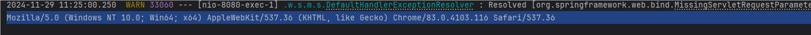
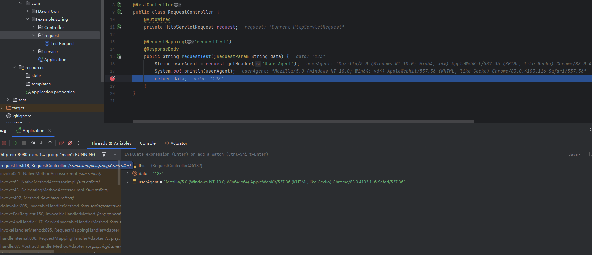
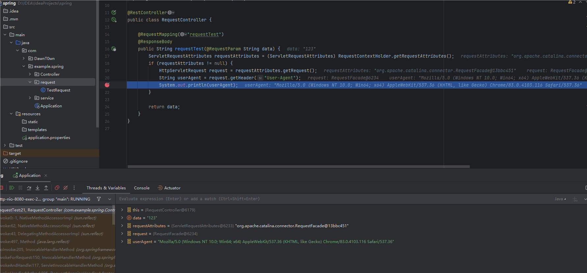
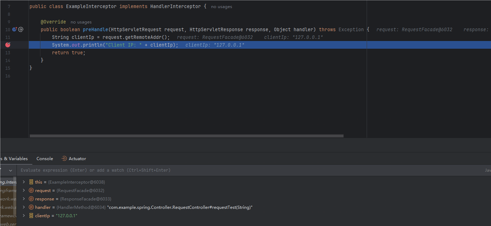

# 前言

最近别人问了我一个问题，在开发中怎么获取的header中的token，然后我第一时间就想到了直接用request对象获取不就行了，可是这不是tomcat，在spring中的controller并没有request对象，于是联想之前内存马获取request对象的操作，加上搜索，把这里获取request对象的方式总结一下，说不定在内存马中也能用到（未验证）

在tomcat内存马中，为了动态注册tomcat组件，通过request对象获取了当前上下文的StandardContext，但是这些都是在请求过程中有对request对象进行处理

# SpringBoot获取Request对象

## 在请求方法中注入Request对象

**适用场景**：在处理 HTTP 请求时，需要直接访问 `HttpServletRequest` 对象。

```
@RestController
public class RequestController {
    @RequestMapping("requestTest")
    @ResponseBody
    public String requestTest(HttpServletRequest request, @RequestParam String data) {
        String userAgent = request.getHeader("User-Agent");
        System.out.println(userAgent);
        return data;
    }

    @RequestMapping("requestTest2")
    @ResponseBody
    public BizResponse<TestResponse> requestTest2(HttpServletRequest request, @RequestBody TestRequest testRequest) {
        String userAgent = request.getHeader("User-Agent");
        System.out.println(userAgent);
        TestResponse testResponse = xxService.queryXXX(testRequest);
        return new BizResponse(testResponse);
    }
}
```

这里我没有再去搞mybatis，就只用第一个例子演示了

```
POST /requestTest HTTP/1.1
Host: 127.0.0.1:8080
User-Agent: Mozilla/5.0 (Windows NT 10.0; Win64; x64) AppleWebKit/537.36 (KHTML, like Gecko) Chrome/83.0.4103.116 Safari/537.36
Content-Type: application/x-www-form-urlencoded
Content-Length: 583

data=123
```



打印了User-Agent

## 使用@Autowired注入

**适用场景**：当你需要在服务层直接使用 `HttpServletRequest` 对象。

在 Spring 的组件（如 `Service` 或 `Controller`）中，可以通过 `@Autowired` 注入 `HttpServletRequest`。Spring 会为每个请求创建一个对应的 `HttpServletRequest` 对象。



一样地获取到了当前的request对象

## 使用RequestContextHolder

**适用场景**：在工具类或无法直接注入的地方使用。

可以通过 `RequestContextHolder` 获取当前请求的上下文，并从中提取 `HttpServletRequest` 对象

```
@RestController
public class RequestController {

    @RequestMapping("requestTest")
    @ResponseBody
    public String requestTest(@RequestParam String data) {
        ServletRequestAttributes requestAttributes = (ServletRequestAttributes) RequestContextHolder.getRequestAttributes();
        if (requestAttributes != null) {
            HttpServletRequest request = requestAttributes.getRequest();
            String userAgent = request.getHeader("User-Agent");
            System.out.println(userAgent);
        }
        
        return data;
    }
}
```



## 使用 @ModelAttribute注解

**适用场景**：需要在多个控制器方法中使用同一个 `HttpServletRequest` 对象。

如果你需要在每个请求处理方法执行前获取 `HttpServletRequest`，可以用 `@ModelAttribute` 注解

```
import javax.servlet.http.HttpServletRequest;
import org.springframework.web.bind.annotation.*;

@Controller
@RequestMapping("/example")
public class ExampleController {

    private HttpServletRequest request;

    @ModelAttribute
    public void setRequest(HttpServletRequest request) {
        this.request = request;
    }

    @GetMapping("/info")
    public String getRequestInfo() {
        String clientIp = request.getRemoteAddr();
        return "Client IP: " + clientIp;
    }
}
```

这个给人的感觉其实就和Spring IOC中使用AutoWired注解注入bean还是用控制器注入的区别差不多

## 通过Interceptor拦截

在之前写的JavaWeb中，我的权限校验是针对路由的，就直接在拦截器中处理Request对象了

```
package com.example.spring.Interceptor;

import javax.servlet.http.HttpServletRequest;
import javax.servlet.http.HttpServletResponse;
import org.springframework.web.servlet.HandlerInterceptor;

public class ExampleInterceptor implements HandlerInterceptor {

    @Override
    public boolean preHandle(HttpServletRequest request, HttpServletResponse response, Object handler) throws Exception {
        String clientIp = request.getRemoteAddr();
        System.out.println("Client IP: " + clientIp);
        return true;
    }
}
```

添加拦截器

```
package com.example.spring.webconfig;

import com.example.spring.Interceptor.ExampleInterceptor;
import org.springframework.context.annotation.Configuration;
import org.springframework.web.servlet.config.annotation.EnableWebMvc;
import org.springframework.web.servlet.config.annotation.InterceptorRegistry;
import org.springframework.web.servlet.config.annotation.WebMvcConfigurer;

@Configuration
@EnableWebMvc
public class MvcConfig implements WebMvcConfigurer {

    @Override
    public void addInterceptors(InterceptorRegistry registry) {
        registry.addInterceptor(new ExampleInterceptor());
    }
}

```



## 通过Filter拦截

要知道，在Spring里面包装了tomcat，也可以使用tomcat的filter组件，当然也可以直接在路由用servlet

```
import javax.servlet.*;
import javax.servlet.http.HttpServletRequest;
import java.io.IOException;

public class ExampleFilter implements Filter {

    @Override
    public void doFilter(ServletRequest request, ServletResponse response, FilterChain chain) throws IOException, ServletException {
        HttpServletRequest httpRequest = (HttpServletRequest) request;
        String clientIp = httpRequest.getRemoteAddr();
        System.out.println("Client IP: " + clientIp);
        chain.doFilter(request, response);
    }
}
```

