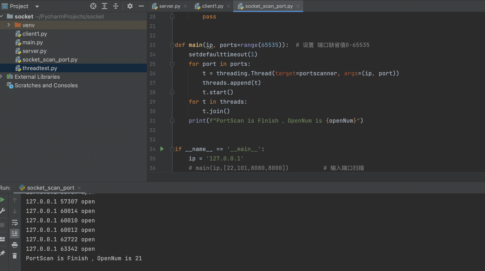

# python网络编程

Python 提供了两个级别访问的网络服务：

- 低级别的网络服务支持基本的 Socket，它提供了标准的 BSD Sockets API，可以访问底层操作系统 Socket 接口的全部方法。
- 高级别的网络服务模块 SocketServer， 它提供了服务器中心类，可以简化网络服务器的开发。

## 什么是socket

Socket又称"套接字"，应用程序通常通过"套接字"向网络发出请求或者应答网络请求，使主机间或者一台计算机上的进程间可以通讯

说白了，就是两台主机之间通讯可以用到的一个东西

Python 中，我们用 socket（）函数来创建套接字，语法格式如下：

```
socket.socket([family[, type[, proto]]])
```

**参数**

- family: 套接字家族可以使 AF_UNIX 或者 AF_INET。
- type: 套接字类型可以根据是面向连接的还是非连接分为 `SOCK_STREAM` 或 `SOCK_DGRAM`。
- protocol: 一般不填默认为 0。

## socket模块内置函数

```python
s = socket.socket()
```

| 函数                                 | 描述                                                         |
| :----------------------------------- | :----------------------------------------------------------- |
| 服务器端套接字                       |                                                              |
| s.bind()                             | 绑定地址（host,port）到套接字， 在 AF_INET下，以元组（host,port）的形式表示地址。 |
| s.listen()                           | 开始 TCP 监听。backlog 指定在拒绝连接之前，操作系统可以挂起的最大连接数量。该值至少为 1，大部分应用程序设为 5 就可以了。 |
| s.accept()                           | 被动接受TCP客户端连接,(阻塞式)等待连接的到来                 |
| 客户端套接字                         |                                                              |
| s.connect()                          | 主动初始化TCP服务器连接，。一般address的格式为元组（hostname,port），如果连接出错，返回socket.error错误。 |
| s.connect_ex()                       | connect()函数的扩展版本,出错时返回出错码,而不是抛出异常      |
| 公共用途的套接字函数                 |                                                              |
| s.recv()                             | 接收 TCP 数据，数据以字符串形式返回，bufsize 指定要接收的最大数据量。flag 提供有关消息的其他信息，通常可以忽略。 |
| s.send()                             | 发送 TCP 数据，将 string 中的数据发送到连接的套接字。返回值是要发送的字节数量，该数量可能小于 string 的字节大小。 |
| s.sendall()                          | 完整发送 TCP 数据。将 string 中的数据发送到连接的套接字，但在返回之前会尝试发送所有数据。成功返回 None，失败则抛出异常。 |
| s.recvfrom()                         | 接收 UDP 数据，与 recv() 类似，但返回值是（data,address）。其中 data 是包含接收数据的字符串，address 是发送数据的套接字地址。 |
| s.sendto()                           | 发送 UDP 数据，将数据发送到套接字，address 是形式为（ipaddr，port）的元组，指定远程地址。返回值是发送的字节数。 |
| s.close()                            | 关闭套接字                                                   |
| s.getpeername()                      | 返回连接套接字的远程地址。返回值通常是元组（ipaddr,port）。  |
| s.getsockname()                      | 返回套接字自己的地址。通常是一个元组(ipaddr,port)            |
| s.setsockopt(level,optname,value)    | 设置给定套接字选项的值。                                     |
| s.getsockopt(level,optname[.buflen]) | 返回套接字选项的值。                                         |
| s.settimeout(timeout)                | 设置套接字操作的超时期，timeout是一个浮点数，单位是秒。值为None表示没有超时期。一般，超时期应该在刚创建套接字时设置，因为它们可能用于连接的操作（如connect()） |
| s.gettimeout()                       | 返回当前超时期的值，单位是秒，如果没有设置超时期，则返回None。 |
| s.fileno()                           | 返回套接字的文件描述符。                                     |
| s.setblocking(flag)                  | 如果flag为0，则将套接字设为非阻塞模式，否则将套接字设为阻塞模式（默认值）。非阻塞模式下，如果调用recv()没有发现任何数据，或send()调用无法立即发送数据，那么将引起socket.error异常。 |
| s.makefile()                         | 创建一个与该套接字相关连的文件                               |

## 实例

既然是服务端与客户端的通信，那就需要去模拟服务端和客户端，这里就举一个服务端向客户端发送信息的例子

server.py

```
import socket

s = socket.socket()		//创建socket对象
host = socket.gethostname()				//获取本机的hostname
# print(host)
port = 2333				//设置端口
s.bind((host,port))			//绑定套接字到本机的主机名和端口

s.listen(10)		//等待客户端连接
while True:
    c,addr = s.accept()			//获取连接信息
    print("连接地址和端口:",addr)
    str = "这是您的第一个socket"
    c.send(str.encode())		//发送信息
    c.close()			//关闭连接
```

可以连续通信

```
import socket

s = socket.socket()
host = socket.gethostname()
# print(host)
port = 2333
s.bind((host, port))

s.listen(10)
while True:
    c, addr = s.accept()
    print("连接地址和端口:", addr)
    c.send("已连接".encode())
    while True:
        data = c.recv(1024)
        if not data:
            break
        print("收到消息:", data.decode())
        str = input("请输入要发送给客户端的消息:")
        c.send(str.encode())
    c.close()
```

Client.py

```
import socket

s = socket.socket()
host = socket.gethostname()
port = 2333
s.connect((host,port))			//连接服务器
print(s.recv(1024).decode())		//获取信息
s.close()
```

上述第二种服务端对应的客户端

```
import socket

s = socket.socket()
host = socket.gethostname()
port = 2333
s.connect((host, port))

while True:
    data = s.recv(1024)
    if not data:
        break
    print("收到消息:", data.decode())
    data = input("输入要发送的消息:")
    if not data:
        break
    s.send(data.encode())
s.close()
```

先运行服务端，再运行客户端去和服务端连接


这里利用了encode和decode函数，原因是python2和python3在套接字返回值解码有一定区别，encode方法可以吧str转化成bytes进行传输，到了客户端需要利用decode解码拿到原始值

# python socket实现端口扫描

利用多线程和socket连接对全端口进行扫描，判断是否开启

```
import threading
from socket import *

lock = threading.Lock()  # 确保 多个线程在共享资源的时候不会出现脏数据
openNum = 0  # 端口开放数量统计
threads = []  # 线程池


def portscanner(host, port):
    global openNum
    try:
        s = socket(AF_INET, SOCK_STREAM)
        s.connect((host, port))
        lock.acquire()
        openNum += 1
        print(f"{host} {port} open")
        lock.release()
        s.close()
    except:
        pass


def main(ip, ports=range(65535)):  # 设置 端口缺省值0-65535
    setdefaulttimeout(1)
    for port in ports:
        t = threading.Thread(target=portscanner, args=(ip, port))
        threads.append(t)
        t.start()
    for t in threads:
        t.join()
    print(f"PortScan is Finish ，OpenNum is {openNum}")


if __name__ == '__main__':
    ip = '127.0.0.1'
    # main(ip,[22,101,8080,8000])          # 输入端口扫描
    main(ip)  # 全端口扫描
```

其实就是用socket去connect对应端口，如果成功则说明开启了端口，如果连接超时则抛出异常，捕获异常直接pass继续，如何为每个



可以看到一共开启了21个端口