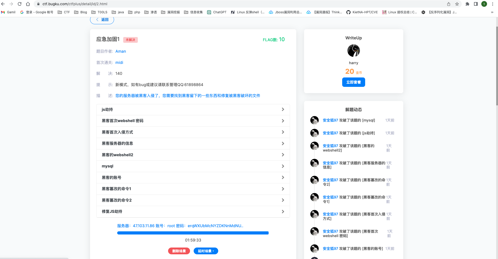

# JS劫持

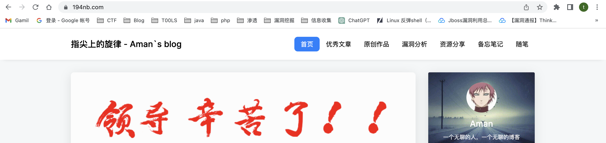

打开给的IP发现重定向到了`194nb.com`

答案就是`https://www.194nb.com`

# 首次webshell密码

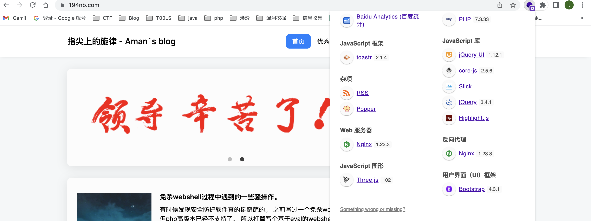

可以看到我们的服务器是通过nginx搭建的

所以我们去找到nginx的log

```
/var/log/nginx/access.log 
```

看/var/www/html的时候发现是通过thinkphp来建站的，去public目录下看到Uploads目录，在access.log下也可以看到关于这个目录的操作，既然是webshell，我们就只需要去找php的文件

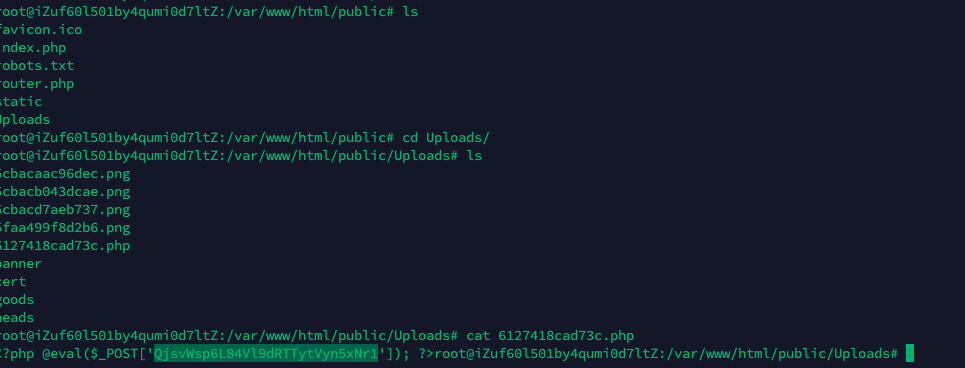

看到了一个php文件，去log里面搜一下，这个就是最开始上传的webshell

初次之外，我们还可以通过find匹配所有的的php文件

```
find /var/www/html -name *.php -print
```

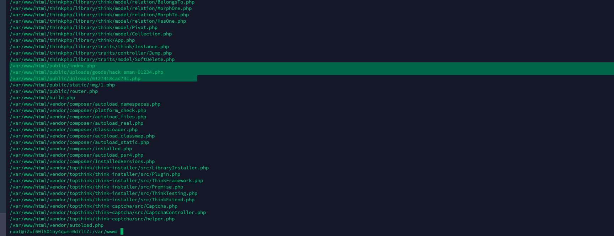

找出可疑的再去和log比较

还可以把它丢在D盾里面扫一遍

# 首次入侵方式

还是我们的80服务是nginx，就去查看nginx日志，这里我没有找到，因为日志太多啦

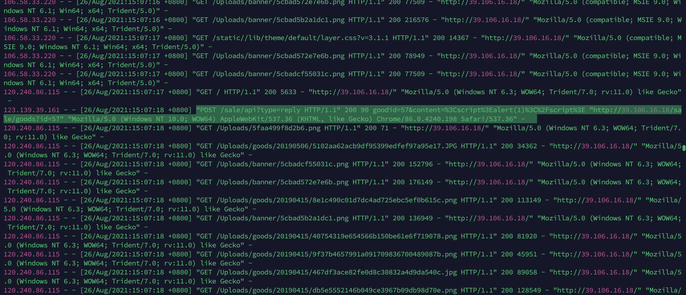

这里可以配合一些威胁日志分析工具去处理，比如腾讯的日志提取工具

https://security.tencent.com/index.php/opensource/detail/15

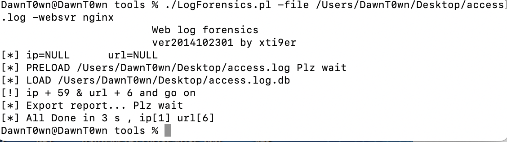

在access.log.db（文本文档）看到一些操作及其实际时间，但是没有看到xss，只看到了上传的webshell

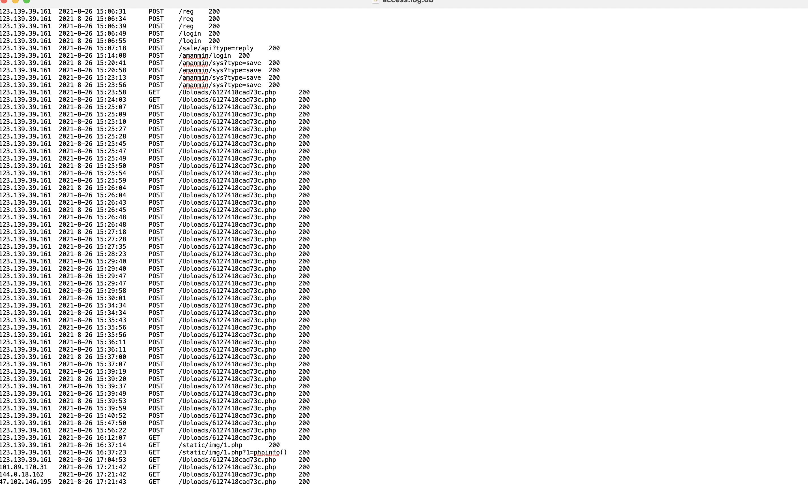

# 黑客服务器信息

ps -aux看到执行啦一个sh文件

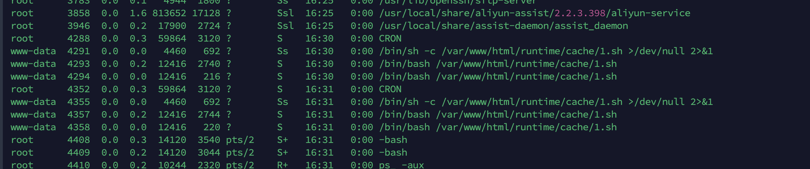

cat看一下

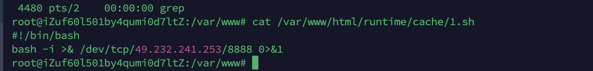

反弹shell

49.232.241.253:8888

# 黑客的webshell2

在之前find匹配php文件到时候，除了第一个我还看到了另外一个可疑文件（D盾扫不出来）

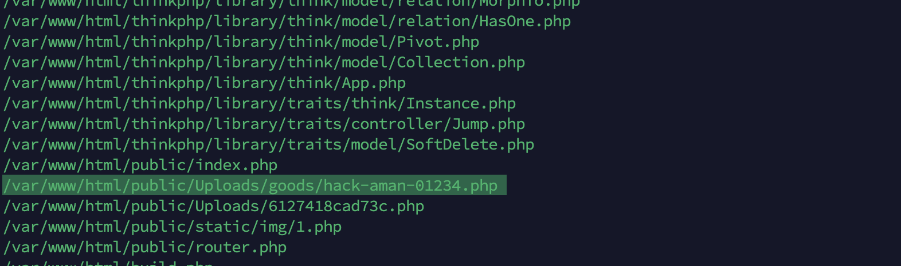

这三个文件都很可疑

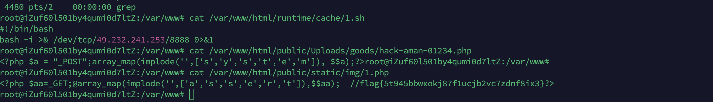

# mysql

首先去找与数据库连接的配置文件，找到数据库用户密码

这里最好把整个网站的源码扒下来审计，在`/var/www/html/application/database.php`


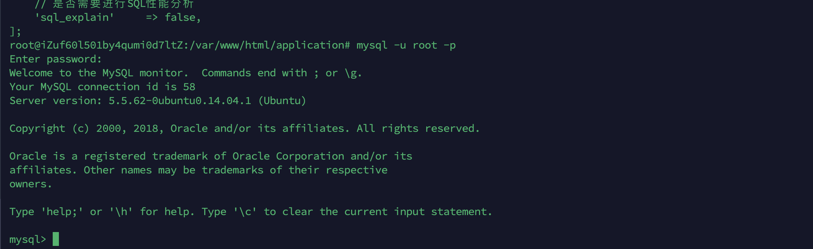

mysql的getshell无非就是UDF提权，在我看来应该是去把mysql写文件的功能关掉，但是当我关的时候却是readonly

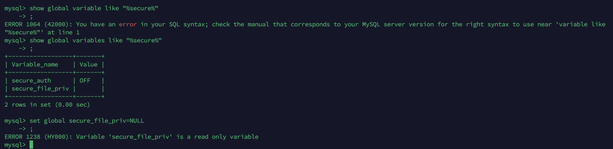

但是网上说的是收回用户的file权限，还需要去关闭全局日志功能（这一点还是有欠缺的）

```
revoke file on *.* from 'root'@'localhost';
set global general_log = off;
flush privileges;
```

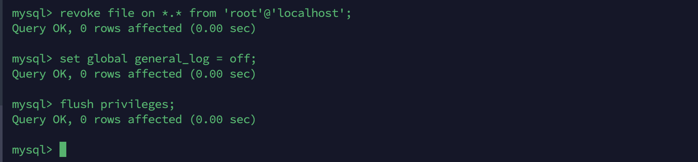


# 黑客的账号

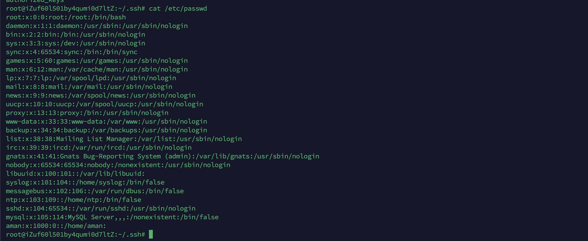

这里可以直接在/etc/passwd中看到一个aman用户，但是我在home目录下并没有找到

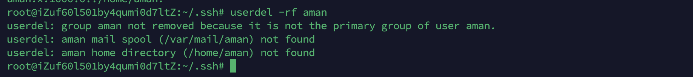

# 黑客篡改的命令1,2

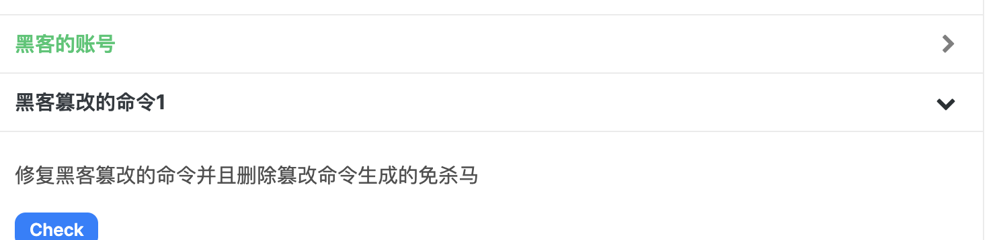

这下面两个就一起了，篡改的命令的话我们去/bin目录查找

看到了`ps_`和`ls2`命令，免杀马的话就是之前没有扫到的那两个可以文件，都是能执行命令的


这里注意一下时间，ls2应该才是我们本来的

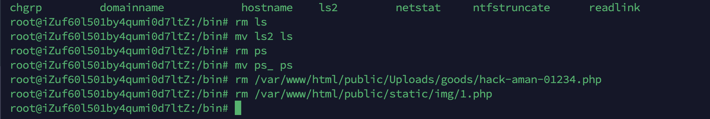

# 修复JS劫持

JS劫持的话，那肯定是通过JS代码了，我们去查找含有JS代码的文件

```
find . | xargs grep -ri '<script type="text/javascript">' -l | sort | uniq -c
```

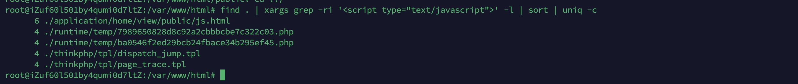

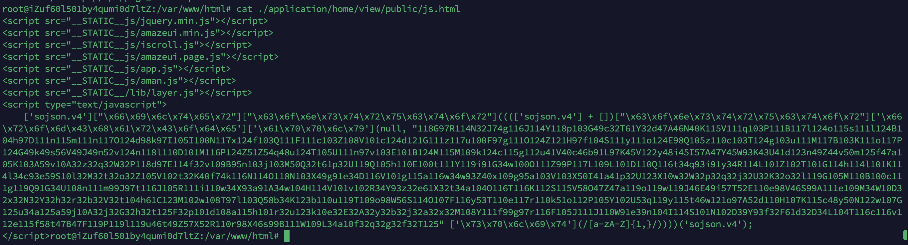

看到js.html中存在js劫持代码，[JSDec - Liulihaocai](https://jsdec.js.org/)

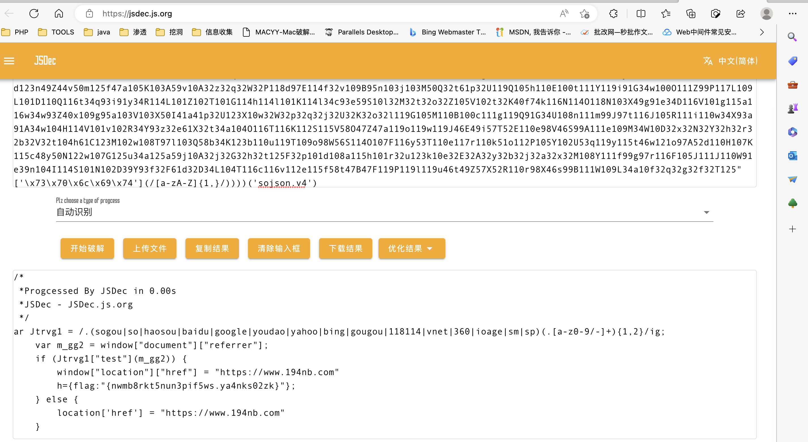


参考链接：

https://blog.csdn.net/jiuyongpinyin/article/details/128645057